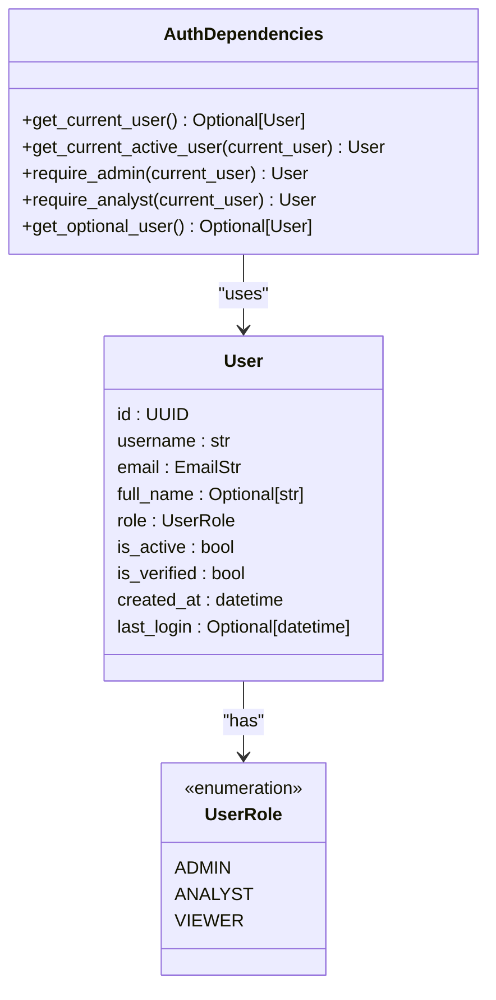
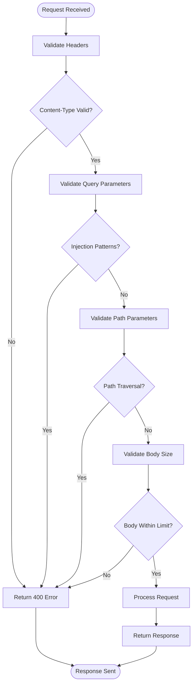
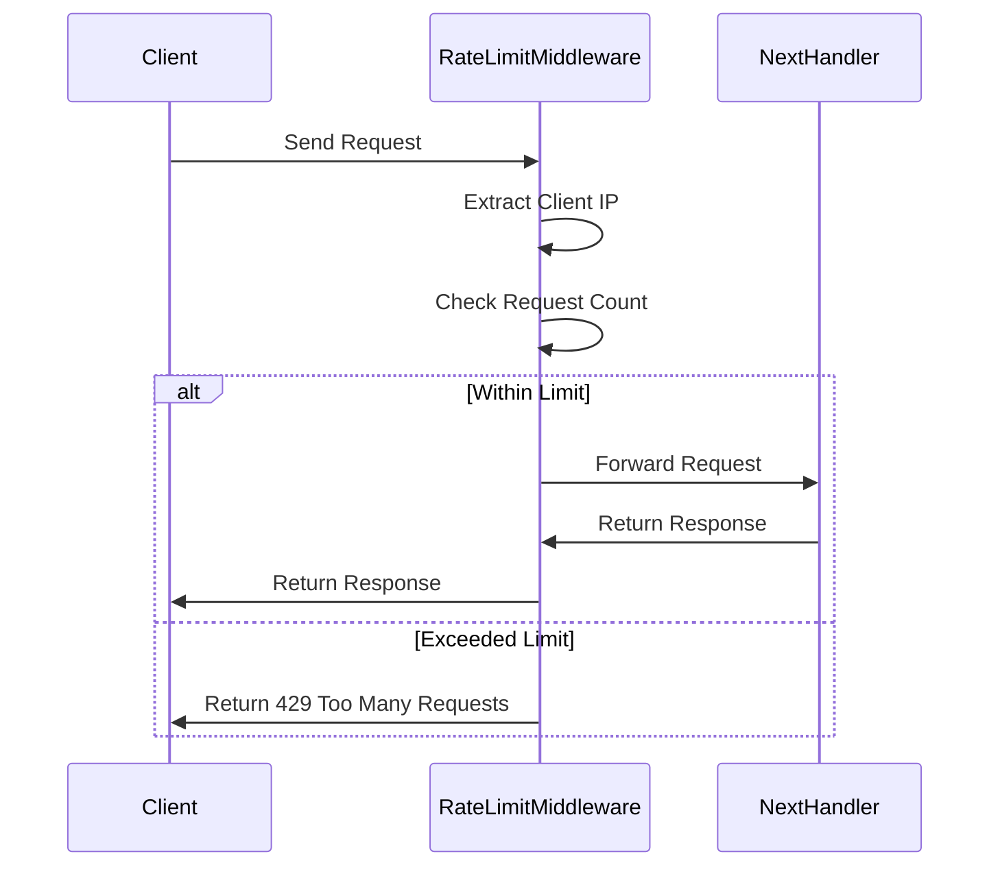
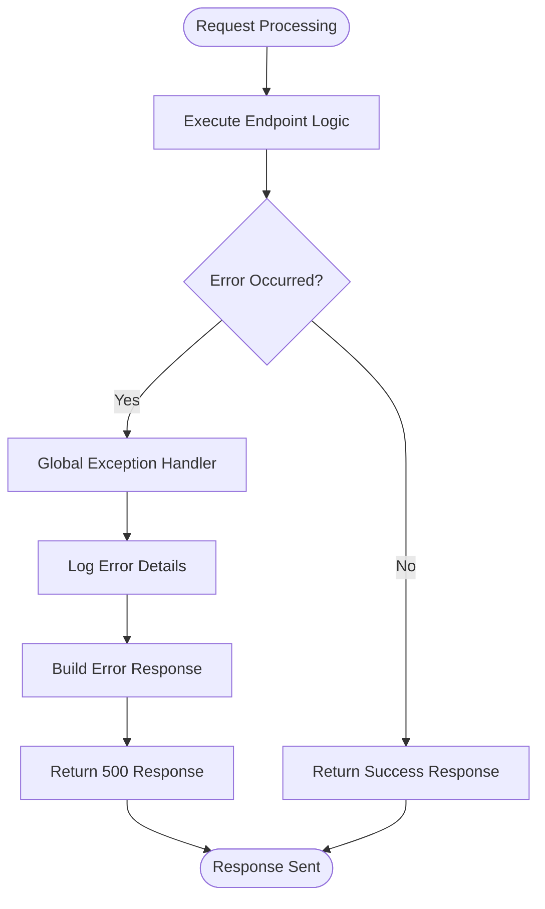

# API Reference

<cite>
**Referenced Files in This Document**   
- [main.py](file://api/main.py)
- [auth/dependencies.py](file://api/auth/dependencies.py)
- [middleware/validation.py](file://api/middleware/validation.py)
- [routers/finetuning.py](file://api/routers/finetuning.py)
- [routers/ingest.py](file://api/routers/ingest.py)
- [routers/mahoun.py](file://api/routers/mahoun.py)
- [routers/search.py](file://api/routers/search.py)
- [routers/system.py](file://api/routers/system.py)
- [routers/health_v2.py](file://api/routers/health_v2.py)
- [routers/metrics.py](file://api/routers/metrics.py)
- [models.py](file://api/models.py)
- [dependencies.py](file://api/dependencies.py)
- [frontend/src/api/client.ts](file://frontend/src/api/client.ts)
- [frontend/src/api/types.ts](file://frontend/src/api/types.ts)
</cite>

## Table of Contents
1. [Introduction](#introduction)
2. [Authentication and Authorization](#authentication-and-authorization)
3. [Input Validation and Security](#input-validation-and-security)
4. [Rate Limiting](#rate-limiting)
5. [Error Handling](#error-handling)
6. [Router Endpoints](#router-endpoints)
   - [Fine-Tuning Router](#fine-tuning-router)
   - [Ingest Router](#ingest-router)
   - [MAHOUN Router](#mahoun-router)
   - [Search Router](#search-router)
   - [System Router](#system-router)
   - [Health V2 Router](#health-v2-router)
   - [Metrics Router](#metrics-router)
7. [Client Implementation Guidelines](#client-implementation-guidelines)
8. [Performance Optimization](#performance-optimization)

## Introduction
The MAHOUN Self-Improvement API provides a comprehensive RESTful interface for managing document ingestion, legal search, fine-tuning, system health, and metrics. Built on FastAPI, the API offers robust functionality for legal technology applications with a focus on security, validation, and scalability. This documentation details all public endpoints, their request/response schemas, authentication requirements, and usage patterns.

**Section sources**
- [main.py](file://api/main.py#L1-L667)

## Authentication and Authorization
The API implements a flexible authentication system through dependency injection. The authentication mechanism is currently in a placeholder state, with actual authentication disabled by default. The system provides several dependency functions for different access levels:

- `get_current_user()`: Returns the current authenticated user or None if not authenticated
- `get_current_active_user()`: Requires authentication and raises 401 Unauthorized if not authenticated
- `require_admin()`: Requires admin role, raises 403 Forbidden if user lacks admin privileges
- `require_analyst()`: Requires analyst or admin role, raises 403 Forbidden if user lacks sufficient privileges
- `get_optional_user()`: Returns the current user if authenticated, otherwise returns None

Authentication is implemented through the `auth/dependencies.py` module, which can be extended to support JWT tokens, session cookies, or API keys in production environments. The User model includes fields for role-based access control with roles including admin, analyst, and viewer.



**Diagram sources**
- [auth/dependencies.py](file://api/auth/dependencies.py#L7-L101)
- [models.py](file://api/models.py#L17-L22)

**Section sources**
- [auth/dependencies.py](file://api/auth/dependencies.py#L7-L101)
- [models.py](file://api/models.py#L72-L85)

## Input Validation and Security
The API implements comprehensive input validation through middleware to ensure security and data integrity. The `InputValidationMiddleware` performs several critical security checks on incoming requests:

- Validates and sanitizes headers, query parameters, path parameters, and request body size
- Checks for common security vulnerabilities including SQL injection, command injection, and path traversal
- Enforces size limits on request bodies (10MB maximum) and query parameters
- Skips validation for specific paths like health checks and metrics endpoints

The validation system uses Pydantic models for request/response validation and includes custom sanitization through the `StringSanitizer` class. All endpoints leverage these validation mechanisms to prevent malicious input and ensure data consistency.



**Diagram sources**
- [middleware/validation.py](file://api/middleware/validation.py#L26-L248)

**Section sources**
- [middleware/validation.py](file://api/middleware/validation.py#L26-L248)
- [models.py](file://api/models.py#L7-L276)

## Rate Limiting
The API includes rate limiting capabilities through the `RateLimitMiddleware` to prevent abuse and ensure fair usage. The rate limiter tracks requests per client IP address within a configurable time window:

- Configurable maximum requests per window (default: 100)
- Configurable time window in seconds (default: 60)
- Returns HTTP 429 Too Many Requests when limits are exceeded
- Can be disabled in development environments via environment variables

Rate limiting is applied to all endpoints except health checks and documentation endpoints. The middleware maintains an in-memory store of request counts per IP address and automatically cleans up expired entries.



**Diagram sources**
- [middleware/validation.py](file://api/middleware/validation.py#L250-L338)

**Section sources**
- [middleware/validation.py](file://api/middleware/validation.py#L250-L338)
- [main.py](file://api/main.py#L80-L85)

## Error Handling
The API implements comprehensive error handling at both the global and endpoint levels. A global exception handler catches unhandled exceptions and returns structured JSON responses with error details:

- Returns HTTP 500 Internal Server Error for unhandled exceptions
- Includes error ID, message, and timestamp in error responses
- Logs full exception details for debugging
- Provides consistent error response format across all endpoints

Endpoint-specific error handling includes:
- HTTP 400 Bad Request for validation errors
- HTTP 401 Unauthorized for authentication failures
- HTTP 403 Forbidden for authorization failures
- HTTP 404 Not Found for missing resources
- HTTP 429 Too Many Requests for rate limiting

All error responses follow the `ErrorResponse` model structure, ensuring clients receive consistent error information.



**Diagram sources**
- [main.py](file://api/main.py#L89-L111)

**Section sources**
- [main.py](file://api/main.py#L89-L111)
- [models.py](file://api/models.py#L269-L276)

## Router Endpoints
The API exposes multiple routers for different functional areas, each with specific endpoints for various operations. This section details each router, its endpoints, request/response schemas, and usage examples.

### Fine-Tuning Router
The fine-tuning router provides endpoints for managing model fine-tuning jobs, including job creation, monitoring, dataset management, and model deployment.

**Section sources**
- [routers/finetuning.py](file://api/routers/finetuning.py#L1-L596)

#### Endpoints

**Create Fine-Tuning Job**
- **Method**: POST
- **URL**: `/api/v1/finetuning/jobs`
- **Authentication**: Required (analyst or admin role)
- **Description**: Creates and starts a new fine-tuning job with the specified configuration
- **Request Schema**: `FineTuningRequest`
- **Response Schema**: `FineTuningJob`
- **Status Codes**: 201 Created, 400 Bad Request, 500 Internal Server Error

```json
{
  "job_name": "legal-contract-finetune-2024",
  "description": "Fine-tune model on legal contract data",
  "config": {
    "model_name": "bert-base-uncased",
    "training_mode": "lora",
    "learning_rate": 2e-5,
    "num_epochs": 3,
    "batch_size": 4,
    "gradient_accumulation_steps": 4,
    "lora_r": 8,
    "lora_alpha": 16,
    "lora_dropout": 0.05
  },
  "dataset": {
    "source": "feedback",
    "feedback_start_date": "2024-01-01T00:00:00Z",
    "feedback_end_date": "2024-01-31T23:59:59Z",
    "min_rating": 4.0
  },
  "auto_deploy": false,
  "deployment_strategy": "shadow"
}
```

**List Fine-Tuning Jobs**
- **Method**: GET
- **URL**: `/api/v1/finetuning/jobs?status={status}&limit={limit}`
- **Authentication**: Required (analyst or admin role)
- **Description**: Lists all fine-tuning jobs, optionally filtered by status
- **Query Parameters**: 
  - `status` (optional): Filter by job status (pending, preparing, training, evaluating, completed, failed, cancelled)
  - `limit` (optional): Maximum number of results to return (default: 50, max: 100)
- **Response Schema**: Array of `FineTuningJob`
- **Status Codes**: 200 OK, 500 Internal Server Error

**Get Fine-Tuning Job**
- **Method**: GET
- **URL**: `/api/v1/finetuning/jobs/{job_id}`
- **Authentication**: Required (analyst or admin role)
- **Description**: Retrieves detailed information about a specific fine-tuning job
- **Path Parameter**: `job_id` - The ID of the job to retrieve
- **Response Schema**: `FineTuningJob`
- **Status Codes**: 200 OK, 404 Not Found, 500 Internal Server Error

**Cancel Fine-Tuning Job**
- **Method**: DELETE
- **URL**: `/api/v1/finetuning/jobs/{job_id}`
- **Authentication**: Required (analyst or admin role)
- **Description**: Cancels a running or pending fine-tuning job
- **Path Parameter**: `job_id` - The ID of the job to cancel
- **Response Schema**: Object with status and job_id
- **Status Codes**: 200 OK, 400 Bad Request, 404 Not Found, 500 Internal Server Error

**Get Training Metrics**
- **Method**: GET
- **URL**: `/api/v1/finetuning/jobs/{job_id}/metrics?limit={limit}`
- **Authentication**: Required (analyst or admin role)
- **Description**: Retrieves training metrics for a specific job
- **Path Parameter**: `job_id` - The ID of the job
- **Query Parameter**: `limit` (optional): Number of metric entries to return (default: 100, max: 1000)
- **Response Schema**: Array of `TrainingMetrics`
- **Status Codes**: 200 OK, 404 Not Found, 500 Internal Server Error

**Deploy Fine-Tuned Model**
- **Method**: POST
- **URL**: `/api/v1/finetuning/jobs/{job_id}/deploy`
- **Authentication**: Required (analyst or admin role)
- **Description**: Deploys a completed fine-tuned model to production
- **Path Parameter**: `job_id` - The ID of the job to deploy
- **Request Schema**: `DeploymentRequest`
- **Response Schema**: Deployment confirmation
- **Status Codes**: 200 OK, 400 Bad Request, 404 Not Found, 500 Internal Server Error

```json
{
  "job_id": "job-12345",
  "strategy": "canary",
  "traffic_percentage": 10.0,
  "rollback_on_error": true
}
```

**List Datasets**
- **Method**: GET
- **URL**: `/api/v1/finetuning/datasets`
- **Authentication**: Required (analyst or admin role)
- **Description**: Lists available datasets for fine-tuning
- **Response Schema**: Object with datasets array and total count
- **Status Codes**: 200 OK, 500 Internal Server Error

**Create Dataset from Feedback**
- **Method**: POST
- **URL**: `/api/v1/finetuning/datasets/from-feedback?start_date={start_date}&end_date={end_date}&min_rating={min_rating}`
- **Authentication**: Required (analyst or admin role)
- **Description**: Creates a training dataset from user feedback
- **Query Parameters**:
  - `start_date` (optional): Start date for feedback collection
  - `end_date` (optional): End date for feedback collection
  - `min_rating` (optional): Minimum rating for feedback inclusion (default: 4.0, range: 1-5)
- **Response Schema**: Dataset creation details
- **Status Codes**: 200 OK, 400 Bad Request, 500 Internal Server Error

### Ingest Router
The ingest router handles document upload and processing, including metadata storage, content extraction, and integration with the ingestion pipeline.

**Section sources**
- [routers/ingest.py](file://api/routers/ingest.py#L1-L335)

#### Endpoints

**Ingest Document**
- **Method**: POST
- **URL**: `/api/ingest/`
- **Authentication**: Required (analyst or admin role)
- **Description**: Ingests a legal document into the MAHOUN system
- **Request Schema**: `DocumentIngest`
- **Response Schema**: `DocumentIngestResponse`
- **Status Codes**: 200 OK, 500 Internal Server Error

```json
{
  "title": "Civil Procedure Law",
  "content": "The full text of the civil procedure law...",
  "doc_type": "law",
  "law_id": "CPL-2024",
  "case_id": null,
  "date_published": "2024-01-01T00:00:00Z",
  "source": "official_gazette"
}
```

**Upload File**
- **Method**: POST
- **URL**: `/api/ingest/upload?include_text={include_text}`
- **Authentication**: Optional (user info logged if authenticated)
- **Description**: Uploads a document file (PDF, DOCX, TXT) and extracts text
- **Request Body**: Multipart form data with file field
- **Query Parameter**: `include_text` (optional): Whether to return full extracted text (default: false)
- **Response Schema**: Upload response with document details
- **Status Codes**: 200 OK, 400 Bad Request, 415 Unsupported Media Type, 500 Internal Server Error

### MAHOUN Router
The MAHOUN router provides endpoints for document processing, legal analysis, claim generation, and report creation.

**Section sources**
- [routers/mahoun.py](file://api/routers/mahoun.py#L1-L562)

#### Endpoints

**Upload Documents**
- **Method**: POST
- **URL**: `/api/v1/mahoun/upload-documents`
- **Authentication**: Optional
- **Description**: Uploads and processes documents (PDF, DOCX, TXT, images with OCR)
- **Request Body**: Multipart form data with file field
- **Form Parameters**:
  - `doc_type` (optional): Document type (contract, letter, report, general_conditions)
  - `metadata` (optional): Additional metadata as JSON
  - `index` (optional): Whether to index document after upload (default: true)
- **Response Schema**: `DocumentUploadResponse`
- **Status Codes**: 200 OK, 500 Internal Server Error

**Analyze Delay**
- **Method**: POST
- **URL**: `/api/v1/mahoun/analyze-delay`
- **Authentication**: Required
- **Description**: Analyzes project delays with baseline vs actual comparison
- **Request Schema**: `DelayAnalysisRequest`
- **Response Schema**: `DelayAnalysisResponse`
- **Status Codes**: 200 OK, 400 Bad Request, 500 Internal Server Error

**Generate Claim**
- **Method**: POST
- **URL**: `/api/v1/mahoun/generate-claim`
- **Authentication**: Required
- **Description**: Generates a formal claim document
- **Request Schema**: `ClaimGenerationRequest`
- **Response Schema**: `ClaimGenerationResponse`
- **Status Codes**: 200 OK, 400 Bad Request, 500 Internal Server Error

**Ask Contract**
- **Method**: POST
- **URL**: `/api/v1/mahoun/ask-contract`
- **Authentication**: Required
- **Description**: Asks questions about contracts and receives answers with citations
- **Request Schema**: `ContractQueryRequest`
- **Response Schema**: `ContractQueryResponse`
- **Status Codes**: 200 OK, 400 Bad Request, 500 Internal Server Error

**Generate Delay Report**
- **Method**: POST
- **URL**: `/api/v1/mahoun/generate-delay-report`
- **Authentication**: Required
- **Description**: Generates a comprehensive delay analysis report
- **Request Schema**: `DelayAnalysisRequest`
- **Response Schema**: `ReportResponse`
- **Status Codes**: 200 OK, 400 Bad Request, 500 Internal Server Error

**Generate Timeline Report**
- **Method**: POST
- **URL**: `/api/v1/mahoun/generate-timeline-report`
- **Authentication**: Required
- **Description**: Generates a timeline analysis report
- **Request Body**: JSON with query, documents, and date_range parameters
- **Response Schema**: `ReportResponse`
- **Status Codes**: 200 OK, 400 Bad Request, 500 Internal Server Error

**Get Report**
- **Method**: GET
- **URL**: `/api/v1/mahoun/reports/{report_id}?format={format}`
- **Authentication**: Required
- **Description**: Retrieves a generated report by ID
- **Path Parameter**: `report_id` - The ID of the report to retrieve
- **Query Parameter**: `format` (optional): Response format (json, markdown, text; default: json)
- **Response Schema**: Varies by format
- **Status Codes**: 200 OK, 404 Not Found, 400 Bad Request, 500 Internal Server Error

**List Reports**
- **Method**: GET
- **URL**: `/api/v1/mahoun/reports`
- **Authentication**: Required
- **Description**: Lists all generated reports
- **Response Schema**: Object with reports array and total count
- **Status Codes**: 200 OK, 500 Internal Server Error

### Search Router
The search router provides endpoints for searching legal verdicts with filtering, semantic search, and graph-based enrichment.

**Section sources**
- [routers/search.py](file://api/routers/search.py#L1-L388)

#### Endpoints

**Search Verdicts**
- **Method**: POST
- **URL**: `/v1/search/verdicts`
- **Authentication**: Optional
- **Description**: Searches for legal verdicts using natural language queries
- **Request Schema**: `VerdictSearchRequest`
- **Response Schema**: `VerdictSearchResponse`
- **Status Codes**: 200 OK, 500 Internal Server Error

```json
{
  "query": "اعتراض ثالث اجرایی نسبت به توقیف عملیات",
  "filters": {
    "court_level": "دادگاه تجدیدنظر استان",
    "is_final": true,
    "tags": ["اعتراض ثالث اجرایی", "رفع توقیف"]
  },
  "limit": 10,
  "enrich_with_graph": true
}
```

**Search Health Check**
- **Method**: GET
- **URL**: `/v1/search/health`
- **Authentication**: Not required
- **Description**: Checks the health of the search service and its backends
- **Response Schema**: Health status object
- **Status Codes**: 200 OK

### System Router
The system router provides health and status endpoints for monitoring system components.

**Section sources**
- [routers/system.py](file://api/routers/system.py#L1-L227)

#### Endpoints

**System Health**
- **Method**: GET
- **URL**: `/system/health`
- **Authentication**: Not required
- **Description**: Performs comprehensive health checks on all system components (PostgreSQL, Neo4j, Redis)
- **Response Schema**: Detailed health status with component statuses and latencies
- **Status Codes**: 200 OK

**System Status**
- **Method**: GET
- **URL**: `/system/status`
- **Authentication**: Not required
- **Description**: Provides lightweight system status (quick API availability check)
- **Response Schema**: Basic status information
- **Status Codes**: 200 OK

### Health V2 Router
The enhanced health check router provides comprehensive health monitoring with caching capabilities.

**Section sources**
- [routers/health_v2.py](file://api/routers/health_v2.py#L1-L158)

#### Endpoints

**Basic Health Check**
- **Method**: GET
- **URL**: `/health/v2`
- **Authentication**: Not required
- **Description**: Quick health check to verify API is running
- **Response Schema**: Basic health status
- **Status Codes**: 200 OK

**Detailed Health Check**
- **Method**: GET
- **URL**: `/health/v2/detailed?use_cache={use_cache}&cache_ttl={cache_ttl}`
- **Authentication**: Not required
- **Description**: Comprehensive health check for all system components with optional caching
- **Query Parameters**:
  - `use_cache` (optional): Whether to use cached results (default: true)
  - `cache_ttl` (optional): Cache TTL in seconds (default: 30.0)
- **Response Schema**: Detailed health status with cache information
- **Status Codes**: 200 OK, 500 Internal Server Error

**Component Health Check**
- **Method**: GET
- **URL**: `/health/v2/component/{component_name}?use_cache={use_cache}&cache_ttl={cache_ttl}`
- **Authentication**: Not required
- **Description**: Health check for a specific component
- **Path Parameter**: `component_name` - Name of the component to check
- **Query Parameters**:
  - `use_cache` (optional): Whether to use cached results (default: true)
  - `cache_ttl` (optional): Cache TTL in seconds (default: 30.0)
- **Response Schema**: Component-specific health status with cache information
- **Status Codes**: 200 OK, 500 Internal Server Error

### Metrics Router
The metrics router provides endpoints for accessing and managing system metrics.

**Section sources**
- [routers/metrics.py](file://api/routers/metrics.py#L1-L181)

#### Endpoints

**Get All Metrics**
- **Method**: GET
- **URL**: `/metrics`
- **Authentication**: Not required
- **Description**: Retrieves all collected metrics
- **Response Schema**: Object with all metrics data
- **Status Codes**: 200 OK, 500 Internal Server Error

**Get Metrics Summary**
- **Method**: GET
- **URL**: `/metrics/summary`
- **Authentication**: Not required
- **Description**: Retrieves summary statistics for all metrics
- **Response Schema**: Metrics summary object
- **Status Codes**: 200 OK, 500 Internal Server Error

**Get Specific Metric**
- **Method**: GET
- **URL**: `/metrics/{metric_name}`
- **Authentication**: Not required
- **Description**: Retrieves data for a specific metric by name
- **Path Parameter**: `metric_name` - Name of the metric to retrieve
- **Response Schema**: Metric data including counter, gauge, and history
- **Status Codes**: 200 OK, 404 Not Found, 500 Internal Server Error

**Get Agent Metrics Summary**
- **Method**: GET
- **URL**: `/metrics/agents/summary`
- **Authentication**: Not required
- **Description**: Retrieves summary of all agent-related metrics
- **Response Schema**: Agent metrics summary object
- **Status Codes**: 200 OK, 500 Internal Server Error

**Reset Metrics**
- **Method**: POST
- **URL**: `/metrics/reset`
- **Authentication**: Not required
- **Description**: Resets all metrics or a specific metric
- **Request Body**: Optional JSON with metric_name field
- **Response Schema**: Reset confirmation message
- **Status Codes**: 200 OK, 500 Internal Server Error

## Client Implementation Guidelines
The API provides client implementations in both Python and TypeScript for seamless integration. The frontend client is implemented in TypeScript and provides type-safe access to the API endpoints.

### Python Client
For Python clients, use the `requests` library to interact with the API. The following example demonstrates how to search for legal verdicts:

```python
import requests
import json

# Set up the API endpoint
base_url = "http://localhost:8000"
search_endpoint = f"{base_url}/v1/search/verdicts"

# Define the search payload
payload = {
    "query": "اعتراض ثالث اجرایی",
    "filters": {
        "is_final": True,
        "court_level": "دادگاه تجدیدنظر استان"
    },
    "limit": 10,
    "enrich_with_graph": True
}

# Set up headers
headers = {
    "Content-Type": "application/json",
    "Accept": "application/json"
}

# Make the request
try:
    response = requests.post(search_endpoint, json=payload, headers=headers)
    response.raise_for_status()  # Raises an HTTPError for bad responses
    
    # Process the response
    results = response.json()
    print(f"Found {results['total']} results")
    for hit in results['results']:
        print(f"Score: {hit['score']}, Text: {hit['chunk_text'][:100]}...")
        
except requests.exceptions.RequestException as e:
    print(f"Request failed: {e}")
```

### TypeScript Client
The TypeScript client is implemented in `frontend/src/api/client.ts` and provides type-safe functions for API interaction. The client handles error parsing, request cleaning, and network error handling.

```typescript
import { searchVerdicts, checkSearchHealth } from './api/client';
import { VerdictSearchRequest, VerdictSearchResponse } from './api/types';

// Example: Search for verdicts
async function performSearch() {
  const searchRequest: VerdictSearchRequest = {
    query: "اعتراض ثالث اجرایی",
    filters: {
      is_final: true,
      court_level: "دادگاه تجدیدنظر استان"
    },
    limit: 10,
    enrich_with_graph: true
  };

  try {
    const response: VerdictSearchResponse = await searchVerdicts(searchRequest);
    console.log(`Found ${response.total} results`);
    response.results.forEach(hit => {
      console.log(`Score: ${hit.score}, Text: ${hit.chunk_text.substring(0, 100)}...`);
    });
  } catch (error) {
    if (error instanceof SearchAPIError) {
      console.error(`API Error: ${error.message} (Status: ${error.statusCode})`);
    } else {
      console.error('Unexpected error:', error);
    }
  }
}

// Example: Check search health
async function healthCheck() {
  try {
    const health = await checkSearchHealth();
    console.log(`Search service status: ${health.status}`);
    console.log(`Vector store: ${health.backends.vector_store}`);
    console.log(`Graph: ${health.backends.graph}`);
  } catch (error) {
    console.error('Health check failed:', error);
  }
}
```

The TypeScript client includes:
- Type definitions that match the backend Pydantic models
- Automatic cleaning of null/undefined/empty values in filters
- Comprehensive error handling with custom `SearchAPIError` class
- Network error handling with user-friendly messages
- Support for environment variables to configure the API base URL

**Section sources**
- [frontend/src/api/client.ts](file://frontend/src/api/client.ts#L1-L153)
- [frontend/src/api/types.ts](file://frontend/src/api/types.ts#L1-L182)

## Performance Optimization
The API includes several features for performance optimization, particularly for batch operations and streaming responses.

### Batch Operations
For improved performance when processing multiple items, consider the following strategies:

1. **Batch Document Ingestion**: While the current API supports single document ingestion, consider implementing batch endpoints for ingesting multiple documents in a single request to reduce network overhead.

2. **Parallel Requests**: When retrieving multiple resources, use parallel requests rather than sequential calls. For example, when fetching multiple reports, use Promise.all() in JavaScript or asyncio.gather() in Python.

3. **Pagination**: For endpoints that return lists (e.g., fine-tuning jobs, reports), use the limit parameter to control response size and implement pagination for large datasets.

### Streaming Responses
The API currently returns complete responses, but streaming can be implemented for long-running operations:

1. **Server-Sent Events (SSE)**: For fine-tuning job monitoring, implement SSE to stream training metrics in real-time rather than polling the metrics endpoint.

2. **Chunked Transfer Encoding**: For large responses (e.g., document content), implement chunked transfer encoding to start sending data before the entire response is ready.

3. **WebSocket Connections**: For interactive applications, consider implementing WebSocket connections for real-time updates on long-running processes.

### Caching Strategies
Implement client-side caching to reduce redundant requests:

1. **Health Checks**: Cache health check results for a short duration (e.g., 30 seconds) since system health doesn't change frequently.

2. **Static Data**: Cache responses for endpoints that return relatively static data, such as model lists or configuration information.

3. **Search Results**: Implement result caching for common search queries, especially those with filters that don't change frequently.

### Connection Management
Optimize client-server communication:

1. **Keep-Alive**: Ensure HTTP keep-alive is enabled to reuse connections for multiple requests.

2. **Compression**: Enable gzip compression on the client and server to reduce payload sizes.

3. **Connection Pooling**: Use connection pooling in client applications to avoid the overhead of establishing new connections for each request.

**Section sources**
- [routers/finetuning.py](file://api/routers/finetuning.py#L295-L314)
- [routers/search.py](file://api/routers/search.py#L194-L239)
- [frontend/src/api/client.ts](file://frontend/src/api/client.ts#L71-L111)