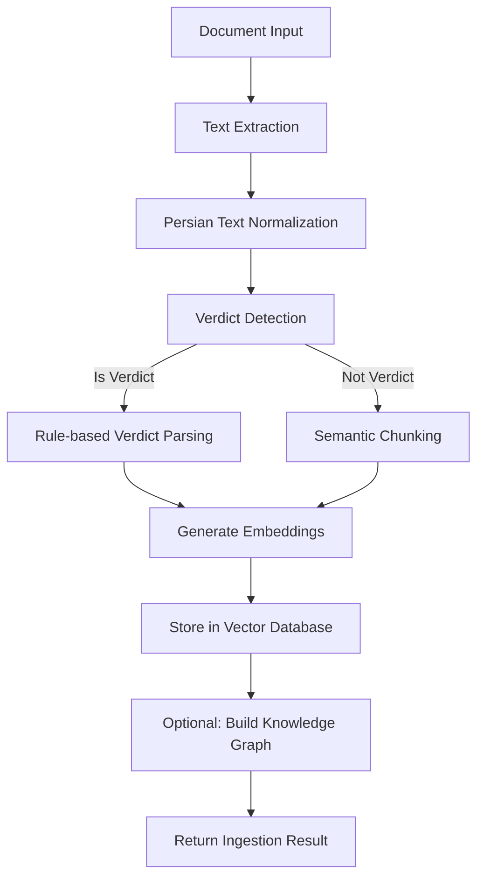
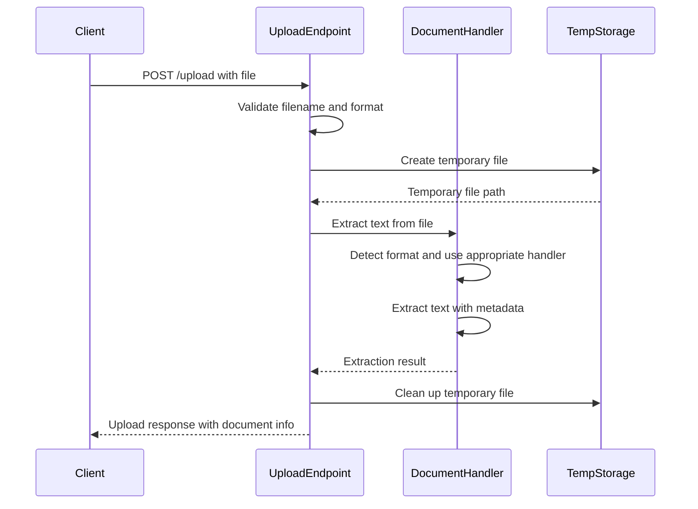
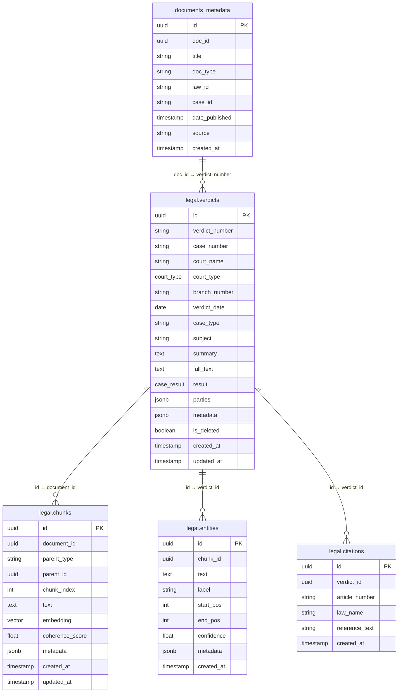
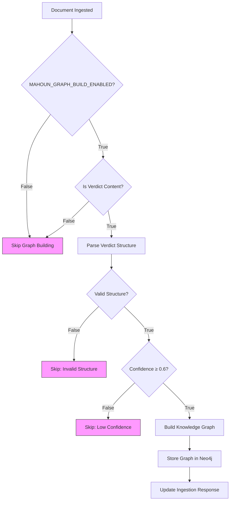
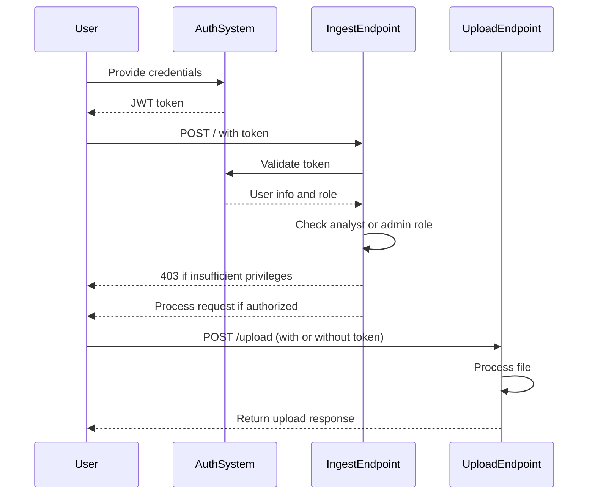

# Document Ingestion API

<cite>
**Referenced Files in This Document**   
- [ingest.py](file://api/routers/ingest.py)
- [models.py](file://api/models.py)
- [document_handlers.py](file://mahoun/pipelines/ingestion/document_handlers.py)
- [pipeline.py](file://mahoun/pipelines/ingestion/pipeline.py)
- [enhanced_pipeline.py](file://mahoun/pipelines/ingestion/enhanced_pipeline.py)
- [legal_storage.py](file://mahoun/pipelines/ingestion/legal_storage.py)
- [minimal_verdict_parser.py](file://mahoun/pipelines/ingestion/minimal_verdict_parser.py)
- [dependencies.py](file://api/auth/dependencies.py)
- [database.py](file://api/database.py)
- [run_import.py](file://mahoun/pipelines/graph_build/run_import.py)
</cite>

## Table of Contents
1. [Introduction](#introduction)
2. [API Endpoints](#api-endpoints)
3. [Request/Response Schemas](#requestresponse-schemas)
4. [Ingestion Pipeline](#ingestion-pipeline)
5. [File Upload Process](#file-upload-process)
6. [Metadata Storage](#metadata-storage)
7. [Graph Building](#graph-building)
8. [Error Handling](#error-handling)
9. [Authentication](#authentication)
10. [Examples](#examples)

## Introduction
The Document Ingestion API provides endpoints for uploading and processing legal documents within the MAHOUN system. This API enables users to ingest document content, which is then processed through a comprehensive pipeline that chunks text, generates embeddings, and optionally builds knowledge graphs. The system supports various document formats and includes robust error handling and authentication mechanisms.

**Section sources**
- [ingest.py](file://api/routers/ingest.py#L1-L335)

## API Endpoints
The Document Ingestion API provides two primary endpoints for document processing:

### POST / (ingest_document)
This endpoint ingests a legal document into the MAHOUN system. It requires analyst or admin role authentication and processes the document by storing metadata in PostgreSQL, chunking the text, generating embeddings, and optionally building knowledge graphs.

### POST /upload
This endpoint allows file uploads of supported document formats (PDF, DOCX, TXT, MD). Authentication is optional for file upload. If authenticated, user information is logged for audit purposes. The endpoint returns information about the extracted document content, including text preview and extraction metadata.

**Section sources**
- [ingest.py](file://api/routers/ingest.py#L113-L335)

## Request/Response Schemas
The API uses Pydantic models for request and response validation, ensuring data integrity and providing clear documentation of expected data structures.

### DocumentIngest
The `DocumentIngest` model defines the request body for the `/` endpoint:

```json
{
  "title": "string",
  "content": "string",
  "doc_type": "law|case|contract|regulation|other",
  "law_id": "string",
  "case_id": "string",
  "date_published": "datetime",
  "source": "string",
  "metadata": {}
}
```

### DocumentIngestResponse
The `DocumentIngestResponse` model defines the response structure for successful document ingestion:

```json
{
  "doc_id": "string",
  "status": "string",
  "message": "string",
  "chunks_created": 0,
  "embeddings_created": 0,
  "graph_nodes_created": 0
}
```

### UploadFile
The file upload endpoint uses FastAPI's `UploadFile` type to handle file uploads, with additional parameters for including full text in the response.

**Section sources**
- [models.py](file://api/models.py#L90-L112)
- [ingest.py](file://api/routers/ingest.py#L262-L335)

## Ingestion Pipeline
The document ingestion pipeline processes documents through several stages: text extraction, normalization, chunking, embedding generation, and storage. The pipeline can use either a standard or enhanced implementation based on the `USE_ENHANCED_INGESTION` environment variable.



**Diagram sources**
- [ingest.py](file://api/routers/ingest.py#L113-L259)
- [pipeline.py](file://mahoun/pipelines/ingestion/pipeline.py#L228-L513)
- [enhanced_pipeline.py](file://mahoun/pipelines/ingestion/enhanced_pipeline.py#L132-L326)

**Section sources**
- [ingest.py](file://api/routers/ingest.py#L113-L259)
- [pipeline.py](file://mahoun/pipelines/ingestion/pipeline.py#L228-L513)
- [enhanced_pipeline.py](file://mahoun/pipelines/ingestion/enhanced_pipeline.py#L132-L326)

## File Upload Process
The file upload process handles document files of supported formats (PDF, DOCX, TXT, MD) through a structured workflow that includes format detection, text extraction, and temporary file management.



**Diagram sources**
- [ingest.py](file://api/routers/ingest.py#L262-L335)
- [document_handlers.py](file://mahoun/pipelines/ingestion/document_handlers.py#L731-L755)

**Section sources**
- [ingest.py](file://api/routers/ingest.py#L262-L335)
- [document_handlers.py](file://mahoun/pipelines/ingestion/document_handlers.py#L731-L755)

## Metadata Storage
Document metadata is stored in PostgreSQL using the `documents_metadata` table. The ingestion process stores key document attributes including title, document type, law ID, case ID, publication date, and source. For legal verdicts, additional structured data is stored in the `legal.*` schema tables, including verdict details, citations, entities, and document chunks with embeddings.



**Diagram sources**
- [ingest.py](file://api/routers/ingest.py#L140-L155)
- [legal_storage.py](file://mahoun/pipelines/ingestion/legal_storage.py#L163-L195)

**Section sources**
- [ingest.py](file://api/routers/ingest.py#L140-L155)
- [legal_storage.py](file://mahoun/pipelines/ingestion/legal_storage.py#L163-L195)

## Graph Building
The system can optionally build knowledge graphs from ingested documents when the `MAHOUN_GRAPH_BUILD_ENABLED` environment variable is set to "true". Graph building is specifically enabled for legal verdicts with sufficient parsing confidence (≥0.6).



The graph building process uses the `GraphBuildPipeline` to extract entities, relationships, and legal references from parsed verdict structures, creating nodes and edges that represent the legal knowledge contained in the document.

**Diagram sources**
- [ingest.py](file://api/routers/ingest.py#L191-L232)
- [run_import.py](file://mahoun/pipelines/graph_build/run_import.py#L106-L120)

**Section sources**
- [ingest.py](file://api/routers/ingest.py#L191-L232)
- [run_import.py](file://mahoun/pipelines/graph_build/run_import.py#L106-L120)

## Error Handling
The API implements comprehensive error handling for various failure scenarios, returning appropriate HTTP status codes and descriptive error messages.

### Supported Error Types
- **400 Bad Request**: Missing filename in upload
- **415 Unsupported Media Type**: Unsupported file format
- **403 Forbidden**: Insufficient permissions for document ingestion
- **500 Internal Server Error**: Ingestion or upload processing failures

The ingestion process includes specific error handling for text extraction failures, embedding generation issues, and database storage problems, with detailed logging to facilitate debugging.

**Section sources**
- [ingest.py](file://api/routers/ingest.py#L285-L289)
- [ingest.py](file://api/routers/ingest.py#L295-L299)
- [ingest.py](file://api/routers/ingest.py#L254-L259)
- [ingest.py](file://api/routers/ingest.py#L329-L334)

## Authentication
The document ingestion endpoint requires authentication with analyst or admin role, enforced by the `require_analyst` dependency. The file upload endpoint supports optional authentication, logging user information when available but allowing anonymous uploads.



**Diagram sources**
- [ingest.py](file://api/routers/ingest.py#L116)
- [ingest.py](file://api/routers/ingest.py#L267)
- [dependencies.py](file://api/auth/dependencies.py#L69-L87)

**Section sources**
- [ingest.py](file://api/routers/ingest.py#L116)
- [ingest.py](file://api/routers/ingest.py#L267)
- [dependencies.py](file://api/auth/dependencies.py#L69-L87)

## Examples
### Uploading a Legal Document with Metadata
```json
POST /api/ingest/
Content-Type: application/json

{
  "title": "Contract Dispute Verdict",
  "content": "The court finds in favor of the plaintiff...",
  "doc_type": "case",
  "law_id": "CIV-2023-001",
  "case_id": "CASE-2023-0456",
  "date_published": "2023-06-15T10:30:00Z",
  "source": "Tehran General Court",
  "metadata": {
    "court": "Tehran General Court",
    "judge": "Judge Ahmad",
    "parties": ["Plaintiff Co.", "Defendant Inc."]
  }
}
```

### Handling Extraction Errors
When text extraction fails, the API returns detailed error information:

```json
{
  "doc_id": "abc123",
  "filename": "contract.pdf",
  "mime": "application/pdf",
  "sha256": "e3b0c442...",
  "text_length": 0,
  "text_preview": "",
  "extraction_method": "pypdf",
  "extraction_error": "Could not extract text from PDF. Install: pip install pypdf"
}
```

**Section sources**
- [ingest.py](file://api/routers/ingest.py#L113-L259)
- [ingest.py](file://api/routers/ingest.py#L262-L335)
- [document_handlers.py](file://mahoun/pipelines/ingestion/document_handlers.py#L33-L40)