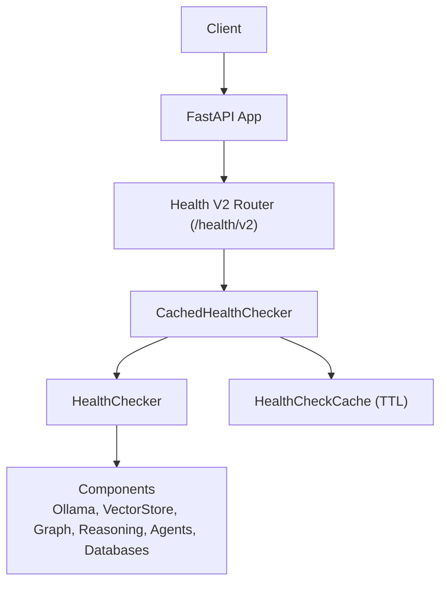
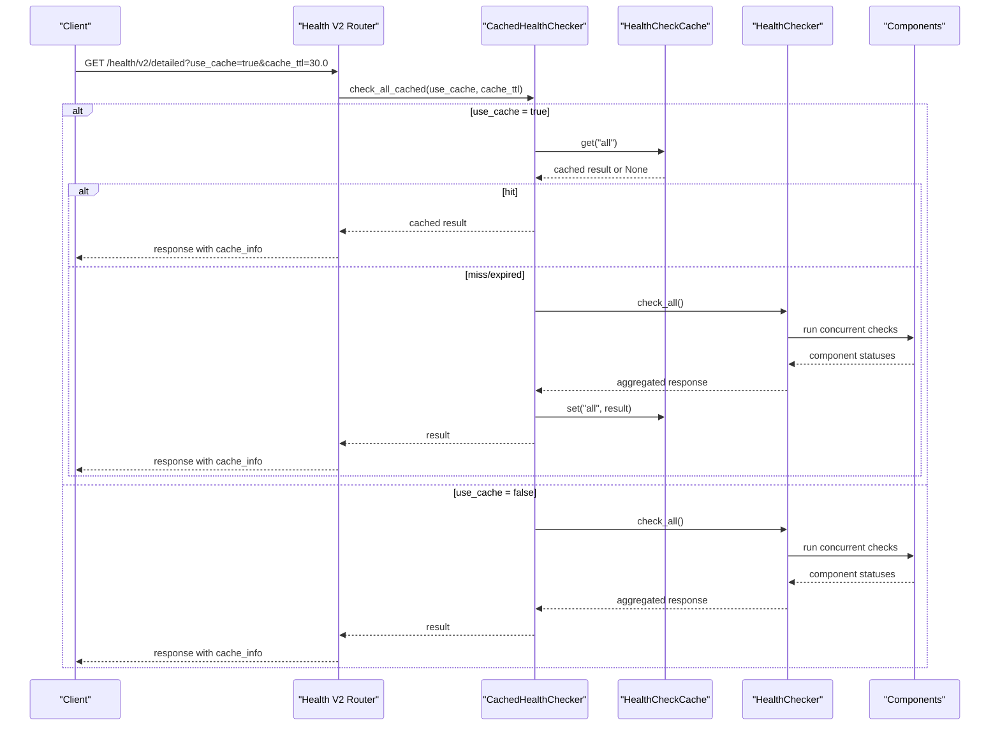
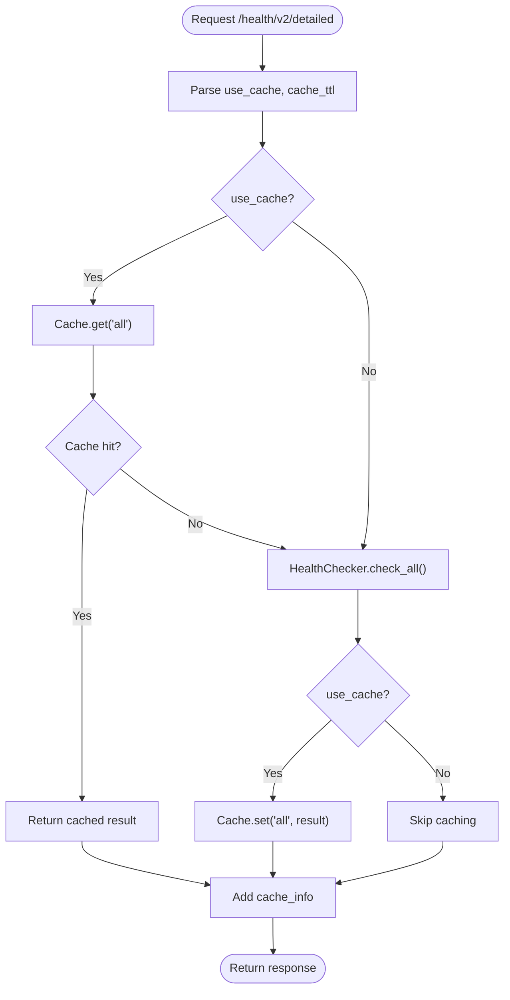
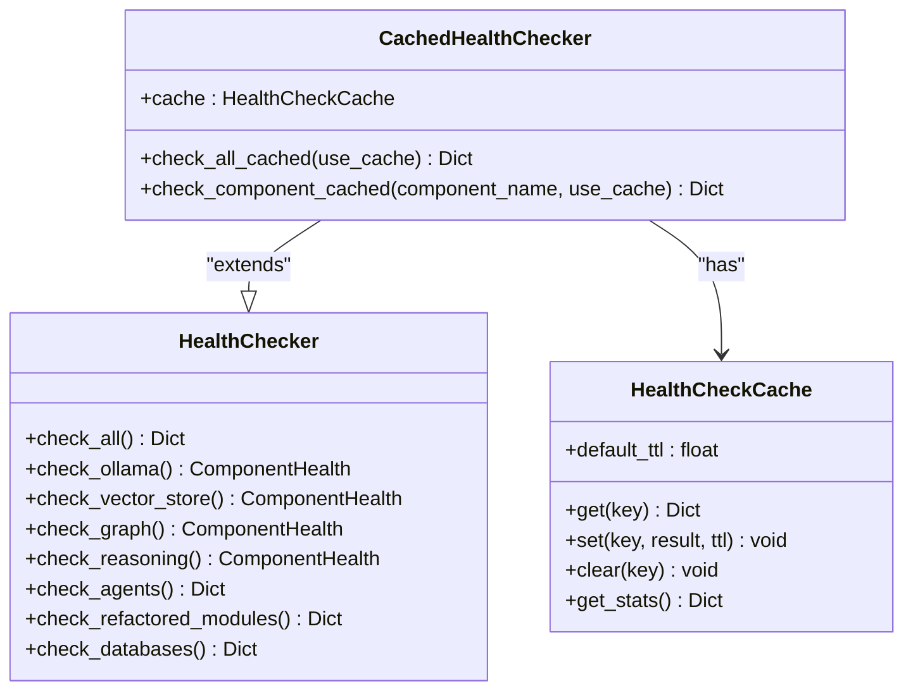

# Enhanced Health Check API

<cite>
**Referenced Files in This Document**
- [health_v2.py](file://api/routers/health_v2.py)
- [health_checker.py](file://mahoun/core/health_checker.py)
- [health_cache.py](file://mahoun/core/health_cache.py)
- [main.py](file://api/main.py)
- [runtime_config.py](file://mahoun/core/runtime_config.py)
- [test_health_checker.py](file://tests/test_health_checker.py)
- [test_real_health_checks.py](file://tests/test_real_health_checks.py)
</cite>

## Table of Contents
1. [Introduction](#introduction)
2. [Project Structure](#project-structure)
3. [Core Components](#core-components)
4. [Architecture Overview](#architecture-overview)
5. [Detailed Component Analysis](#detailed-component-analysis)
6. [Dependency Analysis](#dependency-analysis)
7. [Performance Considerations](#performance-considerations)
8. [Troubleshooting Guide](#troubleshooting-guide)
9. [Conclusion](#conclusion)
10. [Appendices](#appendices)

## Introduction
This document describes the Enhanced Health Check API, focusing on the new endpoints under /health/v2. It explains how the CachedHealthChecker provides TTL-based caching to reduce load, documents the comprehensive component checks (Ollama LLM Service, ChromaDB/VectorStore, Neo4j/Graph, UltraReasoningService, and all registered agents), and details the cache_info field in responses. It also lists the available components for targeted health checks and provides examples for checking specific components and disabling cache for real-time status.

## Project Structure
The Enhanced Health Check API is implemented as a FastAPI router and integrates with a caching layer and a comprehensive health checker. The API is registered in the main application.

**Diagram sources**
- [health_v2.py](file://api/routers/health_v2.py#L1-L158)
- [health_cache.py](file://mahoun/core/health_cache.py#L1-L203)
- [health_checker.py](file://mahoun/core/health_checker.py#L1-L661)
- [main.py](file://api/main.py#L144-L151)

**Section sources**
- [health_v2.py](file://api/routers/health_v2.py#L1-L158)
- [main.py](file://api/main.py#L144-L151)

## Core Components
- Health V2 Router: Defines GET /health/v2, GET /health/v2/detailed, and GET /health/v2/component/{component}.
- CachedHealthChecker: Extends HealthChecker with TTL-based caching and component-specific keys.
- HealthChecker: Implements checks for Ollama, VectorStore, Graph, UltraReasoningService, agents, refactored modules, and databases.
- HealthCheckCache: Thread-safe cache with TTL and statistics.

Key behaviors:
- GET /health/v2 returns a simple service status.
- GET /health/v2/detailed runs comprehensive checks and adds cache_info.
- GET /health/v2/component/{component} checks a specific component and adds cache_info.
- Cache TTL defaults to 30 seconds and can be configured per request.

**Section sources**
- [health_v2.py](file://api/routers/health_v2.py#L1-L158)
- [health_cache.py](file://mahoun/core/health_cache.py#L1-L203)
- [health_checker.py](file://mahoun/core/health_checker.py#L1-L661)

## Architecture Overview
The Enhanced Health Check API composes a FastAPI router with a caching-enabled health checker. The router delegates to CachedHealthChecker, which either serves cached results or invokes HealthChecker to compute fresh results. HealthChecker performs concurrent checks across components and aggregates results into a structured response. The cache_info field includes cache usage statistics.

**Diagram sources**
- [health_v2.py](file://api/routers/health_v2.py#L64-L96)
- [health_cache.py](file://mahoun/core/health_cache.py#L123-L145)
- [health_checker.py](file://mahoun/core/health_checker.py#L569-L661)

## Detailed Component Analysis

### Endpoint: GET /health/v2
- Purpose: Quick health check to verify API responsiveness.
- Response: Simple object indicating service status and version.
- Typical response fields: status, service, version.

**Section sources**
- [health_v2.py](file://api/routers/health_v2.py#L30-L45)

### Endpoint: GET /health/v2/detailed
- Purpose: Comprehensive health check for all system components.
- Query parameters:
  - use_cache: bool, default True. Controls whether cached results are used.
  - cache_ttl: float, default 30.0 seconds. TTL for cache entries.
- Behavior:
  - Uses CachedHealthChecker to compute or retrieve cached results.
  - Adds cache_info to the response with cached flag and cache_stats.
- Response structure highlights:
  - status: overall system status.
  - core: status and import safety.
  - graph: status and reason.
  - agents: status and count.
  - self_improve: status and reason.
  - components: detailed breakdown of each component.

**Diagram sources**
- [health_v2.py](file://api/routers/health_v2.py#L64-L96)
- [health_cache.py](file://mahoun/core/health_cache.py#L123-L145)
- [health_checker.py](file://mahoun/core/health_checker.py#L569-L661)

**Section sources**
- [health_v2.py](file://api/routers/health_v2.py#L48-L96)
- [health_cache.py](file://mahoun/core/health_cache.py#L123-L145)
- [health_checker.py](file://mahoun/core/health_checker.py#L569-L661)

### Endpoint: GET /health/v2/component/{component}
- Purpose: Targeted health check for a specific component.
- Path parameter:
  - component_name: string identifying the component.
- Query parameters:
  - use_cache: bool, default True.
  - cache_ttl: float, default 30.0 seconds.
- Supported components:
  - ollama
  - vector_store
  - graph
  - reasoning
  - refactored.hybrid_search
  - refactored.gaussian_process
  - refactored.self_improvement
  - postgresql
  - redis
  - agent.{agent_name} (e.g., agent.doc_parser)

Behavior:
- CachedHealthChecker resolves the component and executes the appropriate check.
- Adds cache_info to the response.

Error handling:
- Unknown component raises an error.
- Database component not found raises an error.
- Agent not found raises an error.
- General exceptions are caught and surfaced as HTTP 500.

**Section sources**
- [health_v2.py](file://api/routers/health_v2.py#L98-L158)
- [health_cache.py](file://mahoun/core/health_cache.py#L147-L201)
- [health_checker.py](file://mahoun/core/health_checker.py#L276-L339)

### CachedHealthChecker and Cache
- TTL-based caching:
  - Default TTL is 30 seconds.
  - Per-request TTL can be configured via cache_ttl query parameter.
  - Cache keys:
    - "all" for comprehensive checks.
    - Component names for targeted checks (e.g., "ollama", "agent.doc_parser").
- Thread-safe operations:
  - Uses a reentrant lock for cache operations.
- Statistics:
  - get_stats returns cached_keys, cache_size, and default_ttl.
- cache_info field:
  - cached: boolean indicating whether the result was served from cache.
  - cache_stats: statistics from get_stats.

**Diagram sources**
- [health_cache.py](file://mahoun/core/health_cache.py#L1-L203)
- [health_checker.py](file://mahoun/core/health_checker.py#L1-L661)

**Section sources**
- [health_cache.py](file://mahoun/core/health_cache.py#L1-L203)

### Component Checks Implemented
- Ollama LLM Service:
  - Checks if enabled in runtime settings.
  - Validates service availability and lists models.
  - Returns component-specific details and status.
- ChromaDB/VectorStore:
  - Retrieves backend and collection configuration.
  - Returns stats if available; otherwise degraded.
- Neo4j/Graph:
  - Respects runtime mode; marks disabled when expected.
  - Reports backend and URI if enabled.
- UltraReasoningService:
  - Verifies service availability and configuration flags.
- Registered Agents:
  - Checks instantiation of known agents and reports status.
- Refactored Modules:
  - UltraHybridSearch: attempts initialization and returns operational status.
  - GaussianProcess: checks runtime enablement and metrics.
  - UltraSelfImprovementSystem: import-based check with note about real model requirement.
- Databases:
  - PostgreSQL: connection pool check with test query.
  - Redis: ping connectivity.

Runtime awareness:
- Many checks consult runtime settings to determine availability and configuration.

**Section sources**
- [health_checker.py](file://mahoun/core/health_checker.py#L69-L661)
- [runtime_config.py](file://mahoun/core/runtime_config.py#L1-L200)

## Dependency Analysis
- Router depends on CachedHealthChecker.
- CachedHealthChecker depends on HealthChecker and HealthCheckCache.
- HealthChecker depends on runtime configuration and component services.
- Application registration includes the Health V2 router.

**Diagram sources**
- [health_v2.py](file://api/routers/health_v2.py#L1-L158)
- [health_cache.py](file://mahoun/core/health_cache.py#L1-L203)
- [health_checker.py](file://mahoun/core/health_checker.py#L1-L661)
- [runtime_config.py](file://mahoun/core/runtime_config.py#L1-L200)
- [main.py](file://api/main.py#L144-L151)

**Section sources**
- [health_v2.py](file://api/routers/health_v2.py#L1-L158)
- [health_cache.py](file://mahoun/core/health_cache.py#L1-L203)
- [health_checker.py](file://mahoun/core/health_checker.py#L1-L661)
- [runtime_config.py](file://mahoun/core/runtime_config.py#L1-L200)
- [main.py](file://api/main.py#L144-L151)

## Performance Considerations
- Default TTL of 30 seconds reduces repeated expensive checks.
- use_cache parameter allows bypassing cache for real-time verification.
- cache_ttl parameter lets clients tune TTL per request.
- HealthChecker runs component checks concurrently to minimize latency.
- Thread-safe cache operations prevent race conditions.

[No sources needed since this section provides general guidance]

## Troubleshooting Guide
Common issues and resolutions:
- Unknown component name:
  - The component name must match supported values. Verify spelling and prefixes (agent., refactored.).
- Database component not found:
  - Ensure runtime enables the database and environment variables are set correctly.
- Agent not found:
  - Confirm the agent name exists in the agents registry.
- Internal server error (500):
  - Inspect logs for component-specific exceptions.
  - Disable cache temporarily by setting use_cache=false to force real-time checks.
- Degraded or unhealthy status:
  - Review component details and error messages in the response.
  - Check runtime settings and environment variables affecting component availability.

Verification references:
- Tests confirm health checker returns structured results and validates component health states.
- Tests confirm health endpoint behavior and response structure expectations.

**Section sources**
- [health_v2.py](file://api/routers/health_v2.py#L98-L158)
- [health_checker.py](file://mahoun/core/health_checker.py#L1-L661)
- [test_health_checker.py](file://tests/test_health_checker.py#L1-L128)
- [test_real_health_checks.py](file://tests/test_real_health_checks.py#L1-L446)

## Conclusion
The Enhanced Health Check API provides robust, configurable health monitoring with caching to reduce load. It covers critical system components and exposes detailed diagnostics, including cache_info for observability. Clients can target specific components and disable cache when real-time status is required.

[No sources needed since this section summarizes without analyzing specific files]

## Appendices

### API Definitions
- GET /health/v2
  - Description: Quick health check to verify API is running.
  - Response: status, service, version.
- GET /health/v2/detailed
  - Query: use_cache (bool, default True), cache_ttl (float, default 30.0).
  - Response: status, core, graph, agents, self_improve, components, cache_info.
- GET /health/v2/component/{component}
  - Path: component_name (string).
  - Query: use_cache (bool, default True), cache_ttl (float, default 30.0).
  - Response: component-specific health status plus cache_info.

Examples:
- Check all components with default cache:
  - GET /health/v2/detailed
- Check all components without cache:
  - GET /health/v2/detailed?use_cache=false
- Check a specific component with custom TTL:
  - GET /health/v2/component/agent.doc_parser?cache_ttl=60.0
- Disable cache for a specific component:
  - GET /health/v2/component/vector_store?use_cache=false

**Section sources**
- [health_v2.py](file://api/routers/health_v2.py#L30-L158)
- [health_cache.py](file://mahoun/core/health_cache.py#L123-L201)