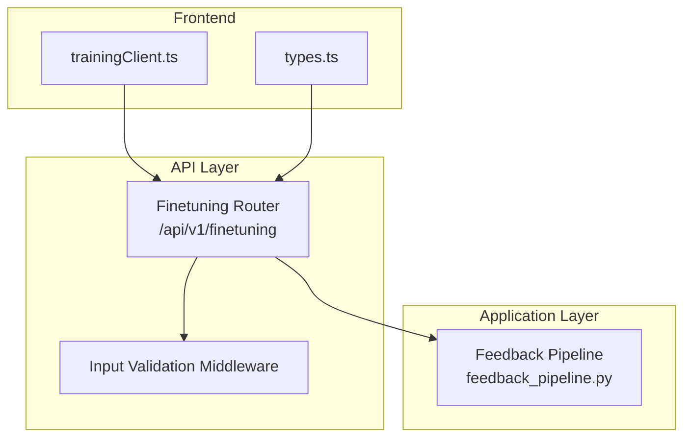
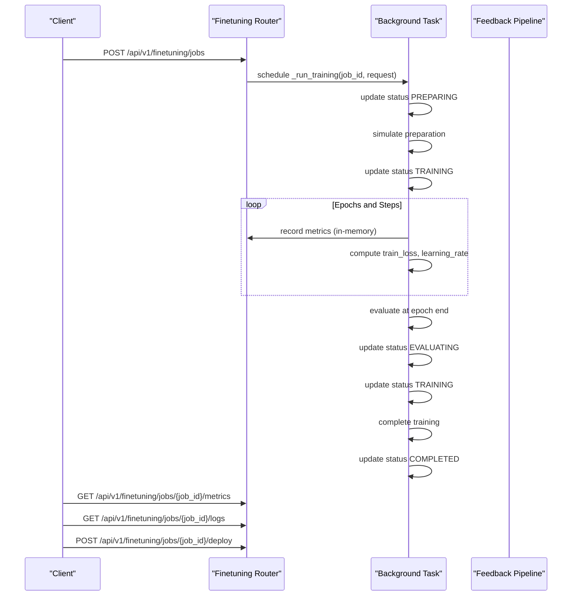
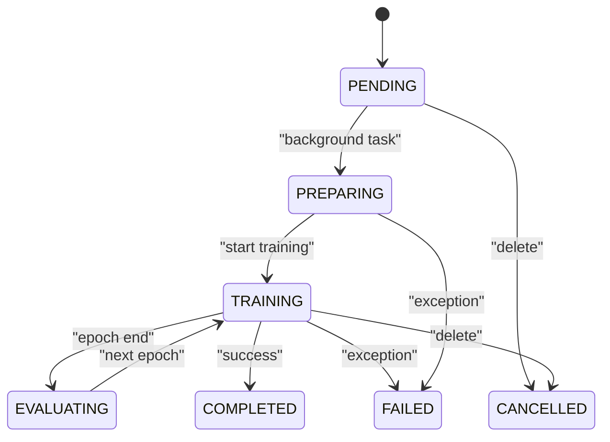
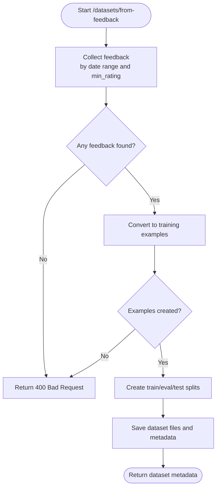
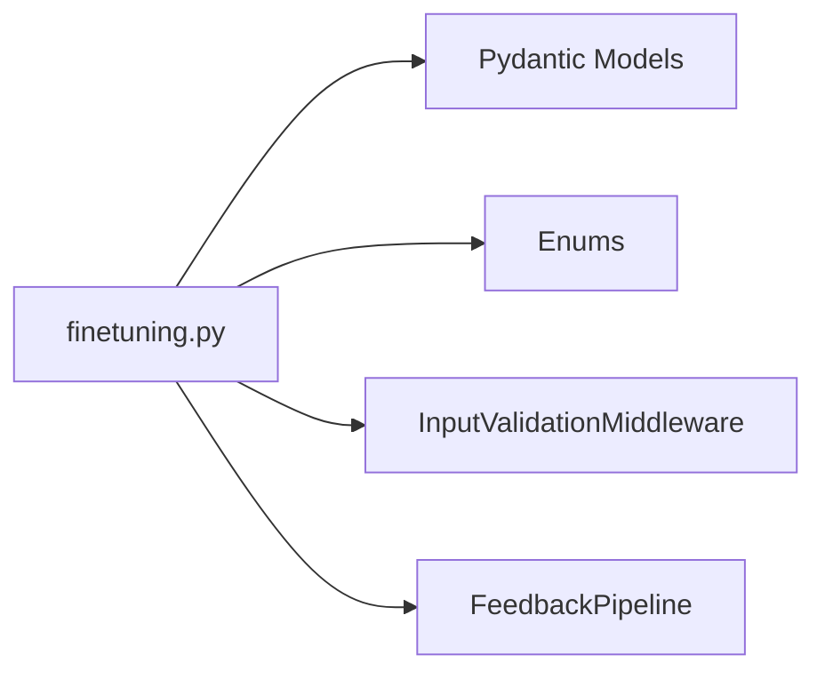

# Fine-Tuning API

<cite>
**Referenced Files in This Document**
- [finetuning.py](file://api/routers/finetuning.py)
- [main.py](file://api/main.py)
- [validation.py](file://api/middleware/validation.py)
- [feedback_pipeline.py](file://mahoun/finetuning/feedback_pipeline.py)
- [test_finetuning_api_real.py](file://tests/test_finetuning_api_real.py)
- [trainingClient.ts](file://frontend/src/api/trainingClient.ts)
- [types.ts](file://frontend/src/api/types.ts)
- [MonitoringDashboard.tsx](file://frontend/src/components/MonitoringDashboard.tsx)
- [FineTuningDashboard.tsx](file://frontend/src/pages/FineTuningDashboard.tsx)
</cite>

## Table of Contents
1. [Introduction](#introduction)
2. [Project Structure](#project-structure)
3. [Core Components](#core-components)
4. [Architecture Overview](#architecture-overview)
5. [Detailed Component Analysis](#detailed-component-analysis)
6. [Dependency Analysis](#dependency-analysis)
7. [Performance Considerations](#performance-considerations)
8. [Troubleshooting Guide](#troubleshooting-guide)
9. [Conclusion](#conclusion)
10. [Appendices](#appendices)

## Introduction
This document provides comprehensive API documentation for the fine-tuning endpoints. It covers the complete training lifecycle from job creation to deployment, including status transitions, dataset creation from user feedback, monitoring via metrics/logs, and deployment strategies (shadow, canary, full). It also documents request/response schemas using Pydantic models, HTTP methods, and authentication/authorization requirements.

## Project Structure
The fine-tuning API is implemented as a FastAPI router under the prefix /api/v1/finetuning. It integrates with a feedback pipeline to build training datasets from user feedback and exposes endpoints for job management, metrics, logs, and deployment.

**Diagram sources**
- [finetuning.py](file://api/routers/finetuning.py#L1-L120)
- [validation.py](file://api/middleware/validation.py#L26-L76)
- [feedback_pipeline.py](file://mahoun/finetuning/feedback_pipeline.py#L1-L120)
- [trainingClient.ts](file://frontend/src/api/trainingClient.ts#L165-L219)
- [types.ts](file://frontend/src/api/types.ts#L112-L182)

**Section sources**
- [finetuning.py](file://api/routers/finetuning.py#L1-L120)
- [main.py](file://api/main.py#L136-L142)

## Core Components
- Pydantic models define request/response schemas:
  - FineTuningRequest: request to start a job
  - FineTuningJob: job state and progress
  - TrainingMetrics: per-step metrics
  - DatasetConfig: dataset source and split ratios
- Enums:
  - TrainingStatus: lifecycle states
  - TrainingMode: supported training modes
  - DatasetSource: dataset source types
- Endpoints:
  - Jobs: list, create, get, delete (cancel), metrics, logs, deploy
  - Datasets: list, create from feedback
  - Models: list available models (including local GGUF)

**Section sources**
- [finetuning.py](file://api/routers/finetuning.py#L34-L171)
- [finetuning.py](file://api/routers/finetuning.py#L319-L724)

## Architecture Overview
The fine-tuning API orchestrates training jobs asynchronously. Clients submit a job request, the server validates it, prepares the dataset (optionally from feedback), and starts training in the background. Metrics and logs are exposed for monitoring, and the trained model can be deployed with configurable strategies.

**Diagram sources**
- [finetuning.py](file://api/routers/finetuning.py#L319-L724)
- [feedback_pipeline.py](file://mahoun/finetuning/feedback_pipeline.py#L183-L218)

## Detailed Component Analysis

### Endpoints and Schemas

- Base URL: /api/v1/finetuning

- Authentication and Authorization
  - The API is mounted under the main FastAPI app. Security middleware applies CORS, trusted host, input validation, and rate limiting globally. There is no explicit authentication decorator on the fine-tuning router; however, the app’s security middleware is applied to all routes. For production, ensure appropriate authentication/authorization is enforced at the gateway or by adding route-level dependencies.

- Models and Enums
  - TrainingStatus: pending, preparing, training, evaluating, completed, failed, cancelled
  - TrainingMode: full_finetune, lora, qlora, dora, adalora
  - DatasetSource: feedback, upload, existing

- Request/Response Schemas
  - FineTuningRequest: job_name, description, config (FineTuningConfig), dataset (DatasetConfig), auto_deploy, deployment_strategy
  - FineTuningJob: job_id, job_name, description, status, config, dataset, progress, metrics, timestamps, resources, outputs
  - TrainingMetrics: timestamp, epoch, step, train_loss, eval_loss, eval_accuracy, eval_perplexity, learning_rate, gpu_memory_mb, samples_per_second
  - DatasetConfig: source, dataset_id, feedback_start_date, feedback_end_date, min_rating, train_ratio, eval_ratio, test_ratio

- Endpoints

  - POST /jobs
    - Purpose: Create and start a new fine-tuning job.
    - Request: FineTuningRequest
    - Response: FineTuningJob (201)
    - Notes: Background task starts training; job begins in PENDING, then PREPARING, TRAINING, EVALUATING, and finally COMPLETED or FAILED.

  - GET /jobs
    - Purpose: List all fine-tuning jobs.
    - Query: status (optional), limit (default 50, min 1, max 100)
    - Response: List[FineTuningJob]

  - GET /jobs/{job_id}
    - Purpose: Get detailed information about a specific job.
    - Response: FineTuningJob

  - DELETE /jobs/{job_id}
    - Purpose: Cancel a running fine-tuning job.
    - Response: {status, job_id}
    - Constraints: Can only cancel if status is pending/preparing/training.

  - GET /jobs/{job_id}/metrics
    - Purpose: Get training metrics for a job.
    - Query: limit (default 100, min 1, max 1000)
    - Response: List[TrainingMetrics]

  - GET /jobs/{job_id}/logs
    - Purpose: Get training logs for a job.
    - Query: lines (default 100, min 1, max 1000)
    - Response: {job_id, lines[], total_lines}

  - POST /jobs/{job_id}/deploy
    - Purpose: Deploy a fine-tuned model to production.
    - Request: DeploymentRequest (job_id, strategy, traffic_percentage, rollback_on_error)
    - Response: {status, job_id, strategy, traffic_percentage, model_path, deployed_at}
    - Constraints: Job must be COMPLETED and have a model_path.

  - GET /datasets
    - Purpose: List available datasets for fine-tuning.
    - Response: {datasets: [...], total: number}

  - POST /datasets/from-feedback
    - Purpose: Create a training dataset from user feedback.
    - Query: start_date (datetime), end_date (datetime), min_rating (float, default 4.0, range 1–5)
    - Response: Dataset metadata and file paths
    - Notes: Uses FeedbackPipeline to collect, filter, convert, split, and save dataset.

  - GET /models
    - Purpose: List available models including local GGUF models.
    - Response: {models: [...], local_count, remote_count, total_count, model_directory}

**Section sources**
- [finetuning.py](file://api/routers/finetuning.py#L319-L724)
- [finetuning.py](file://api/routers/finetuning.py#L191-L313)

### Training Lifecycle and Status Transitions
- States: PENDING → PREPARING → TRAINING → EVALUATING → COMPLETED or FAILED
- Cancelation: Allowed only when status is pending/preparing/training.
- Completion: Sets model_path and checkpoint_path; can auto-deploy if configured.

**Diagram sources**
- [finetuning.py](file://api/routers/finetuning.py#L34-L43)
- [finetuning.py](file://api/routers/finetuning.py#L396-L421)
- [finetuning.py](file://api/routers/finetuning.py#L647-L724)

**Section sources**
- [finetuning.py](file://api/routers/finetuning.py#L34-L43)
- [finetuning.py](file://api/routers/finetuning.py#L396-L421)
- [finetuning.py](file://api/routers/finetuning.py#L647-L724)

### Dataset Creation from Feedback
- Endpoint: POST /datasets/from-feedback
- Filters: date range (start_date, end_date), min_rating
- Flow:
  - Collect feedback from FeedbackPipeline with filters
  - Convert to training examples
  - Create dataset splits (train/eval/test)
  - Save dataset files and metadata
- Returns dataset metadata and file paths.

**Diagram sources**
- [finetuning.py](file://api/routers/finetuning.py#L555-L641)
- [feedback_pipeline.py](file://mahoun/finetuning/feedback_pipeline.py#L183-L218)
- [feedback_pipeline.py](file://mahoun/finetuning/feedback_pipeline.py#L219-L283)
- [feedback_pipeline.py](file://mahoun/finetuning/feedback_pipeline.py#L357-L410)
- [feedback_pipeline.py](file://mahoun/finetuning/feedback_pipeline.py#L411-L490)

**Section sources**
- [finetuning.py](file://api/routers/finetuning.py#L555-L641)
- [feedback_pipeline.py](file://mahoun/finetuning/feedback_pipeline.py#L183-L283)
- [feedback_pipeline.py](file://mahoun/finetuning/feedback_pipeline.py#L357-L490)

### Monitoring Training Progress
- Metrics endpoint: GET /jobs/{job_id}/metrics
- Logs endpoint: GET /jobs/{job_id}/logs
- Frontend integration:
  - trainingClient.ts consumes /api/v1/finetuning/models and displays model lists.
  - MonitoringDashboard.tsx and FineTuningDashboard.tsx display job status and metrics.

**Section sources**
- [finetuning.py](file://api/routers/finetuning.py#L423-L475)
- [trainingClient.ts](file://frontend/src/api/trainingClient.ts#L165-L219)
- [MonitoringDashboard.tsx](file://frontend/src/components/MonitoringDashboard.tsx#L93-L128)
- [FineTuningDashboard.tsx](file://frontend/src/pages/FineTuningDashboard.tsx#L277-L306)

### Deployment Strategies
- Strategy options: shadow, canary, full
- Canary: serve a percentage of traffic and gradually increase
- Shadow: run alongside production without serving traffic
- Full: replace production model immediately
- The deployment endpoint validates job status and model availability before deploying.

**Section sources**
- [finetuning.py](file://api/routers/finetuning.py#L477-L523)

### Client Implementation Guidelines
- Use trainingClient.ts to fetch available models and integrate with the UI.
- Poll /jobs/{job_id} and /jobs/{job_id}/metrics for progress and metrics.
- Use /datasets/from-feedback to create datasets from feedback with desired filters.
- Start a job with FineTuningRequest and monitor status transitions.
- Deploy using POST /jobs/{job_id}/deploy with chosen strategy.

**Section sources**
- [trainingClient.ts](file://frontend/src/api/trainingClient.ts#L165-L219)
- [test_finetuning_api_real.py](file://tests/test_finetuning_api_real.py#L133-L200)
- [FineTuningDashboard.tsx](file://frontend/src/pages/FineTuningDashboard.tsx#L277-L306)

## Dependency Analysis
- Router dependencies:
  - Finetuning router depends on Pydantic models and enums.
  - Uses in-memory storage for jobs and metrics during simulation.
- Middleware:
  - InputValidationMiddleware and RateLimitMiddleware are applied globally.
- Feedback pipeline:
  - Used by the dataset-from-feedback endpoint to process feedback and produce datasets.

**Diagram sources**
- [finetuning.py](file://api/routers/finetuning.py#L34-L171)
- [validation.py](file://api/middleware/validation.py#L26-L76)
- [feedback_pipeline.py](file://mahoun/finetuning/feedback_pipeline.py#L1-L120)

**Section sources**
- [finetuning.py](file://api/routers/finetuning.py#L34-L171)
- [main.py](file://api/main.py#L53-L85)
- [validation.py](file://api/middleware/validation.py#L26-L76)

## Performance Considerations
- Background training runs synchronously in the example implementation. For production, use a job queue (e.g., Celery) and GPU workers.
- Streaming logs and checkpoints should be persisted to durable storage.
- Metrics collection should be optimized to avoid excessive memory usage.

[No sources needed since this section provides general guidance]

## Troubleshooting Guide
- Common HTTP errors:
  - 404 Not Found: job_id not found
  - 400 Bad Request: invalid configuration, unsupported training mode, cannot cancel job in current status, cannot deploy non-completed job, dataset creation failures
  - 500 Internal Server Error: unhandled exceptions
- Error handling:
  - Global exception handler returns structured JSON with error_id and timestamp.
  - Input validation middleware enforces request constraints and sanitization.

**Section sources**
- [finetuning.py](file://api/routers/finetuning.py#L382-L421)
- [finetuning.py](file://api/routers/finetuning.py#L477-L523)
- [finetuning.py](file://api/routers/finetuning.py#L555-L641)
- [main.py](file://api/main.py#L89-L112)
- [validation.py](file://api/middleware/validation.py#L26-L76)

## Conclusion
The fine-tuning API provides a complete workflow for training, monitoring, and deploying models with support for dataset creation from user feedback. The design leverages Pydantic models for strong typing and FastAPI for robust routing. For production, integrate authentication, a persistent job queue, and robust error handling.

[No sources needed since this section summarizes without analyzing specific files]

## Appendices

### API Reference Summary

- POST /api/v1/finetuning/jobs
  - Request: FineTuningRequest
  - Response: FineTuningJob (201)

- GET /api/v1/finetuning/jobs
  - Query: status (optional), limit (1–100)
  - Response: List[FineTuningJob]

- GET /api/v1/finetuning/jobs/{job_id}
  - Response: FineTuningJob

- DELETE /api/v1/finetuning/jobs/{job_id}
  - Response: {status, job_id}
  - Constraints: status must be pending/preparing/training

- GET /api/v1/finetuning/jobs/{job_id}/metrics
  - Query: limit (1–1000)
  - Response: List[TrainingMetrics]

- GET /api/v1/finetuning/jobs/{job_id}/logs
  - Query: lines (1–1000)
  - Response: {job_id, lines[], total_lines}

- POST /api/v1/finetuning/jobs/{job_id}/deploy
  - Request: DeploymentRequest
  - Response: {status, job_id, strategy, traffic_percentage, model_path, deployed_at}
  - Constraints: job status must be completed and model_path must be present

- GET /api/v1/finetuning/datasets
  - Response: {datasets: [...], total}

- POST /api/v1/finetuning/datasets/from-feedback
  - Query: start_date, end_date, min_rating (1–5)
  - Response: Dataset metadata and file paths

- GET /api/v1/finetuning/models
  - Response: {models: [...], local_count, remote_count, total_count, model_directory}

**Section sources**
- [finetuning.py](file://api/routers/finetuning.py#L319-L724)