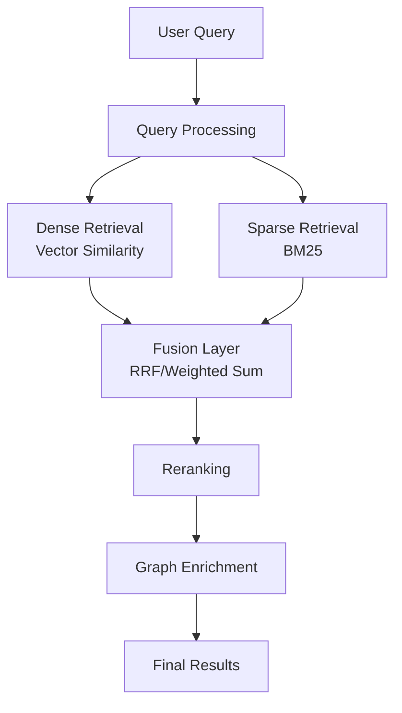
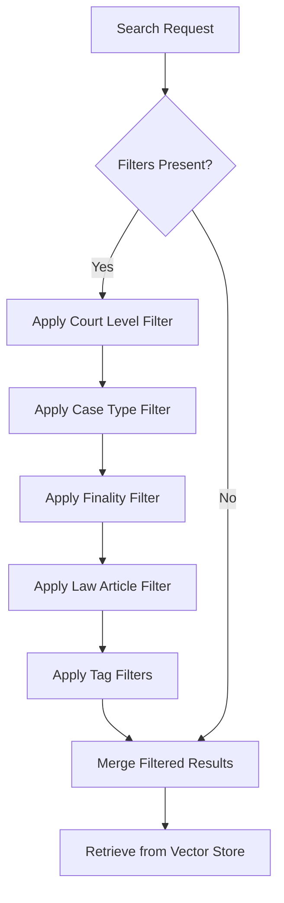
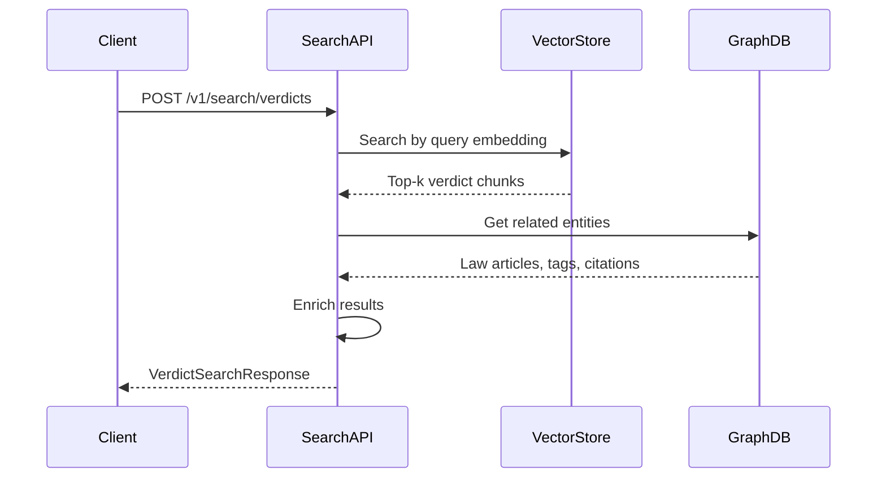

# Legal Search API

<cite>
**Referenced Files in This Document**   
- [search.py](file://api/routers/search.py)
- [hybrid_search_v2.py](file://mahoun/retrieval/hybrid_search_v2.py)
- [hybrid_rag_service.py](file://mahoun/rag/hybrid_rag_service.py)
- [rag_integration.py](file://mahoun/graph/services/rag_integration.py)
</cite>

## Table of Contents
1. [Introduction](#introduction)
2. [Core Endpoints](#core-endpoints)
3. [Request/Response Schemas](#requestresponse-schemas)
4. [Hybrid Search Architecture](#hybrid-search-architecture)
5. [Filtering Capabilities](#filtering-capabilities)
6. [Graph-Based Enrichment](#graph-based-enrichment)
7. [Health Check Endpoint](#health-check-endpoint)
8. [Error Handling and Degradation](#error-handling-and-degradation)
9. [Usage Examples](#usage-examples)

## Introduction

The Legal Search API provides advanced search capabilities for Persian legal verdicts using a hybrid approach that combines semantic search with graph-based enrichment. The system is designed to deliver relevant legal precedents by leveraging both vector similarity and structured graph relationships.

The API supports natural language queries in Persian and English, with comprehensive filtering options and robust error handling. The architecture is built for reliability with graceful degradation when backend services are unavailable.

**Section sources**
- [search.py](file://api/routers/search.py#L1-L388)

## Core Endpoints

The Legal Search API exposes two primary endpoints for searching verdicts and checking service health.

### POST /v1/search/verdicts

This endpoint performs semantic search over indexed legal verdicts using natural language queries. It supports filtering, result limiting, and optional graph-based enrichment.

**Request**
- Method: POST
- Path: `/v1/search/verdicts`
- Content-Type: `application/json`

**Response**
- Status: 200 OK
- Content-Type: `application/json`

The endpoint returns a structured response containing search results, metadata, and applied filters.

### GET /v1/search/health

This endpoint checks the operational status of the search service and its backend components.

**Request**
- Method: GET
- Path: `/v1/search/health`

**Response**
- Status: 200 OK
- Content-Type: `application/json`

The health check returns the status of critical backend services including the VectorStore and Graph database.

**Section sources**
- [search.py](file://api/routers/search.py#L194-L387)

## Request/Response Schemas

The API uses well-defined schemas for requests and responses to ensure consistency and proper validation.

### VerdictSearchRequest

The request body for searching legal verdicts.

```json
{
  "query": "string",
  "filters": {
    "court_level": "string",
    "case_type": "string",
    "is_final": "boolean",
    "article_no": "string",
    "law_name": "string",
    "tags": ["string"]
  },
  "limit": "integer",
  "enrich_with_graph": "boolean"
}
```

**Fields:**
- `query`: Natural language search query (Persian or English), required, 1-2000 characters
- `filters`: Optional object containing filter criteria
- `limit`: Maximum number of results to return (1-100, default: 10)
- `enrich_with_graph`: Whether to enrich results with graph data (default: true)

### SearchFilters

Optional filtering criteria for narrowing search results.

**Fields:**
- `court_level`: Court level (e.g., "دادگاه تجدیدنظر استان")
- `case_type`: Type of case (e.g., "اعتراض ثالث اجرایی / رفع توقیف")
- `is_final`: Whether the verdict is final (قطعی)
- `article_no`: Law article number to filter by
- `law_name`: Name of law to filter by
- `tags`: Array of tags to filter by

### VerdictSearchResponse

The response structure for search results.

```json
{
  "results": [
    {
      "verdict_id": "string",
      "score": "number",
      "section": "string",
      "chunk_text": "string",
      "case_type": "string",
      "court_level": "string",
      "procedure_stage": "string",
      "is_final": "boolean",
      "tags": ["string"],
      "law_articles": ["string"],
      "extra_metadata": {}
    }
  ],
  "total": "integer",
  "query": "string",
  "filters_applied": {}
}
```

**Fields:**
- `results`: Array of VerdictHit objects
- `total`: Total number of results returned
- `query`: Original search query
- `filters_applied`: Filters that were applied in the search

### VerdictHit

A single search result representing a relevant verdict chunk.

**Fields:**
- `verdict_id`: Unique identifier of the verdict
- `score`: Relevance score (0-1, higher is better)
- `section`: Section of the verdict
- `chunk_text`: Relevant text snippet
- `case_type`: Type of case
- `court_level`: Court level
- `procedure_stage`: Procedure stage
- `is_final`: Whether the verdict is final
- `tags`: Array of associated tags
- `law_articles`: Array of referenced law articles
- `extra_metadata`: Additional metadata as key-value pairs

**Section sources**
- [search.py](file://api/routers/search.py#L34-L148)

## Hybrid Search Architecture

The search system implements a hybrid approach that combines multiple retrieval methods to improve result quality and relevance.



**Diagram sources**
- [hybrid_search_v2.py](file://mahoun/retrieval/hybrid_search_v2.py#L561-L800)
- [hybrid_rag_service.py](file://mahoun/rag/hybrid_rag_service.py#L58-L377)

### Semantic Search

The core search functionality uses dense retrieval through vector similarity. Queries are converted to embeddings and compared against indexed verdict chunks using cosine similarity. This enables semantic understanding of natural language queries in both Persian and English.

The system uses a production-grade vector store with support for metadata filtering and efficient similarity search. The dense retrieval component is responsible for understanding the meaning and context of queries.

### Sparse Retrieval

Complementing the dense retrieval, the system implements BM25 sparse retrieval for keyword-based matching. This traditional information retrieval method excels at exact term matching and handles cases where semantic similarity might miss relevant results due to vocabulary differences.

The sparse retriever includes text preprocessing with tokenization, stopword removal, and stemming to improve matching accuracy. This component ensures that verdicts containing exact keywords from the query are properly identified.

### Fusion Methods

The hybrid system combines results from both retrieval methods using configurable fusion algorithms:

- **RRF (Reciprocal Rank Fusion)**: Combines results based on their ranked positions, giving higher weight to documents that appear in top positions across both methods
- **Weighted Sum**: Linear combination of scores from both retrieval methods using configurable weights
- **Learned Fusion**: Machine learning-based combination of scores (not currently implemented)

The fusion layer produces a unified ranking that leverages the strengths of both semantic and keyword-based approaches.

**Section sources**
- [hybrid_search_v2.py](file://mahoun/retrieval/hybrid_search_v2.py#L78-L800)

## Filtering Capabilities

The search API provides comprehensive filtering options to narrow results based on specific criteria.

### Court Level Filtering

Results can be filtered by court level, allowing users to focus on verdicts from specific judicial tiers. Supported values include:
- دادگاه تجدیدنظر استان (Provincial Court of Appeal)
- دادگاه کیفری (Criminal Court)
- دادگاه صلح (Peace Court)
- دادگاه عمومی (General Court)

### Case Type Filtering

Filtering by case type enables targeted searches for specific legal domains. Common case types include:
- اعتراض ثالث اجرایی / رفع توقیف (Third-party enforcement objection / Release of seizure)
- اختلاف معاملات تجاری (Commercial transaction disputes)
- فسخ قرارداد (Contract termination)

### Finality Status

The `is_final` filter allows users to distinguish between provisional and final (قطعی) verdicts. This is critical for legal research where only final judgments may be considered binding precedents.

### Law Article Filtering

Results can be filtered by specific law articles using either the article number (`article_no`) or the law name (`law_name`). This enables precise searching for verdicts that reference particular legal provisions.

### Tag-Based Filtering

The system supports filtering by tags, which are keywords or categories associated with verdicts. Multiple tags can be specified, and results must match all provided tags (AND logic).



**Diagram sources**
- [search.py](file://api/routers/search.py#L261-L269)
- [hybrid_search_v2.py](file://mahoun/retrieval/hybrid_search_v2.py#L466-L467)

## Graph-Based Enrichment

The system enhances search results with graph-based data from a Neo4j knowledge graph, providing deeper context and relationships.

### Enrichment Process

When `enrich_with_graph` is enabled, the system performs the following enrichment steps:

1. For each search result, query the graph database for related entities
2. Extract referenced law articles and tags from the graph
3. Identify citation relationships with other verdicts
4. Calculate authority scores based on graph centrality
5. Combine original and graph-based scores



**Diagram sources**
- [rag_integration.py](file://mahoun/graph/services/rag_integration.py#L96-L153)
- [search.py](file://api/routers/search.py#L276-L277)

### Enrichment Features

**Law Article Extraction**: The system identifies and extracts references to legal articles within verdicts, providing direct links to relevant legislation.

**Tag Expansion**: Verdicts are associated with descriptive tags that capture key legal concepts, enabling better categorization and discovery.

**Citation Network**: The graph maintains citation relationships between verdicts, allowing the system to identify precedent-setting cases and related judgments.

**Authority Scoring**: Results are scored based on their position in the citation network, with verdicts that are frequently cited receiving higher authority scores.

The graph enrichment process significantly enhances the value of search results by providing context that goes beyond simple text matching.

**Section sources**
- [rag_integration.py](file://mahoun/graph/services/rag_integration.py#L21-L153)

## Health Check Endpoint

The health check endpoint provides operational status information for the search service and its dependencies.

### GET /v1/search/health

This endpoint returns a JSON object with the health status of the service and its backend components.

**Response Structure**
```json
{
  "status": "string",
  "service": "string",
  "backends": {
    "vector_store": "string",
    "graph": "string"
  },
  "message": "string"
}
```

### Status Levels

The health check returns one of three status levels:

- **healthy**: All backend services are available and responsive
- **degraded**: Some backend services are unavailable, but the service can still function
- **unhealthy**: Critical failures prevent the service from operating

### Backend Verification

The health check verifies connectivity to two critical backend services:

**Vector Store**: Checks that the vector database is accessible and can perform similarity searches. If unavailable, the service enters degraded mode, returning empty results.

**Graph Database**: Verifies connectivity to the Neo4j instance used for enrichment. If unavailable, enrichment is skipped but search functionality remains available.

```mermaid
flowchart TD
A[Health Check Request] --> B{Vector Store Available?}
B --> |Yes| C{Graph Available?}
B --> |No| D[Status: degraded]
C --> |Yes| E[Status: healthy]
C --> |No| F[Status: healthy<br/>(graph optional)]
D --> G[Message: VectorStore not available]
E --> H[Return health status]
F --> H
```

**Diagram sources**
- [search.py](file://api/routers/search.py#L338-L386)

## Error Handling and Degradation

The system implements comprehensive error handling to ensure reliability and graceful degradation.

### Payload Validation

The API validates incoming requests and handles corrupted payloads safely:

- Validates query string length and content
- Checks limit parameter bounds (1-100)
- Safely handles missing or malformed filter objects
- Returns empty results rather than failing on corrupted payloads

When a payload cannot be properly processed, the system extracts what information it can and returns an empty result set with the available query information.

### Graceful Degradation

The system is designed to degrade gracefully when backend services are unavailable:

**Vector Store Unavailable**: When the vector database is unreachable, the search endpoint returns empty results with a degraded status. This prevents cascading failures while maintaining API contract compliance.

**Graph Service Unavailable**: If the graph database is down, the system skips enrichment but continues to return search results. The `enrich_with_graph` parameter is effectively ignored.

**Complete Backend Failure**: In cases of complete backend failure, the health check reflects the unhealthy status, but the search endpoint still returns a valid (empty) response structure.

### Error Recovery

The system implements retry logic and connection pooling to recover from transient failures:

- Connection retries with exponential backoff
- Local caching of recent queries
- Circuit breaker pattern to prevent overwhelming failing services
- Comprehensive logging for troubleshooting

The error handling strategy prioritizes returning a response over raising exceptions, ensuring that clients always receive a predictable API response even during partial system failures.

**Section sources**
- [search.py](file://api/routers/search.py#L309-L335)

## Usage Examples

### Basic Search

Search for verdicts related to third-party enforcement objections:

```json
{
  "query": "اعتراض ثالث اجرایی نسبت به توقیف عملیات",
  "limit": 10
}
```

### Filtered Search

Search for final verdicts from the Provincial Court of Appeal:

```json
{
  "query": "رفع توقیف",
  "filters": {
    "court_level": "دادگاه تجدیدنظر استان",
    "is_final": true
  },
  "limit": 5
}
```

### Law Article Search

Find verdicts referencing Article 348 of the Civil Procedure Code:

```json
{
  "query": "ماده 348",
  "filters": {
    "law_name": "قانون آیین دادرسی مدنی"
  }
}
```

### Tag-Based Search

Search for verdicts tagged with specific legal concepts:

```json
{
  "query": "اختلاف تجاری",
  "filters": {
    "tags": ["اعتراض ثالث اجرایی", "رفع توقیف"]
  }
}
```

### Service Degradation Response

When the VectorStore is unavailable, the system returns empty results:

```json
{
  "results": [],
  "total": 0,
  "query": "اعتراض ثالث اجرایی",
  "filters_applied": {
    "is_final": true
  }
}
```

The health check would show:
```json
{
  "status": "degraded",
  "service": "legal_search",
  "backends": {
    "vector_store": "unavailable",
    "graph": "available"
  },
  "message": "VectorStore not available; search will return empty results"
}
```

**Section sources**
- [search.py](file://api/routers/search.py#L13-L19)
- [search.py](file://api/routers/search.py#L219-L234)