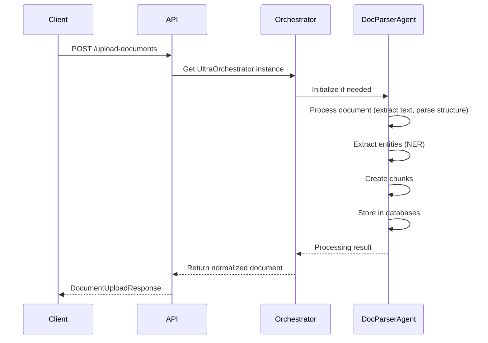
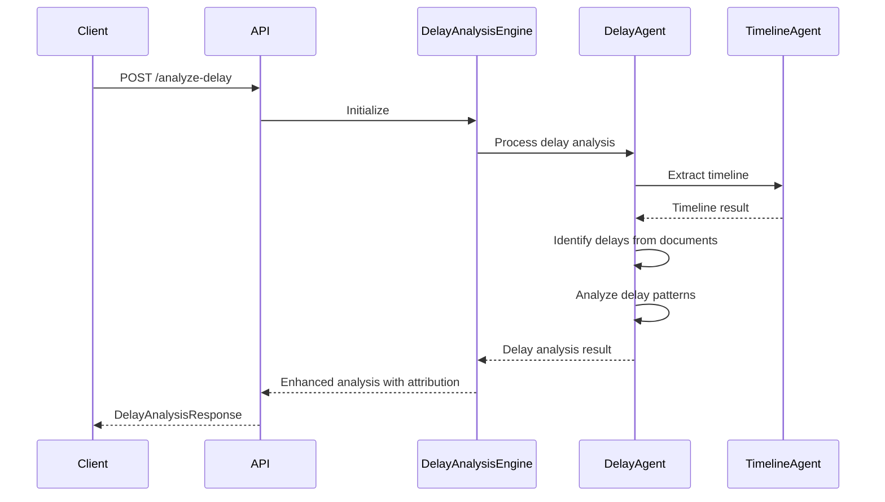
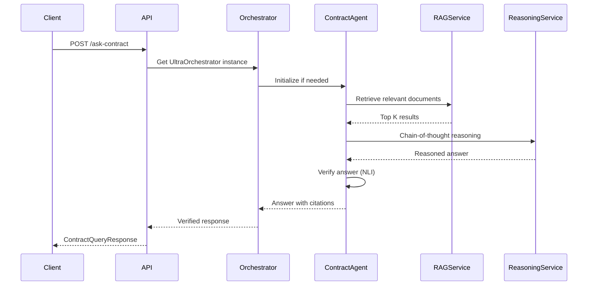
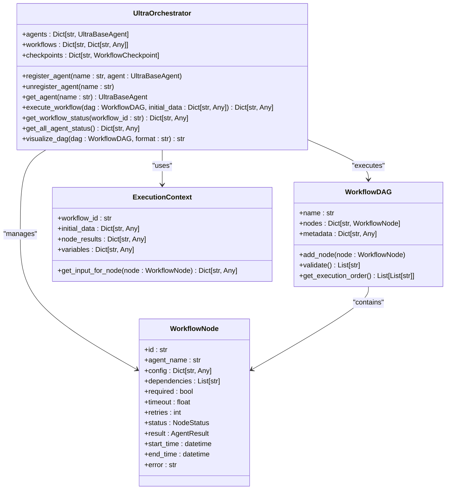
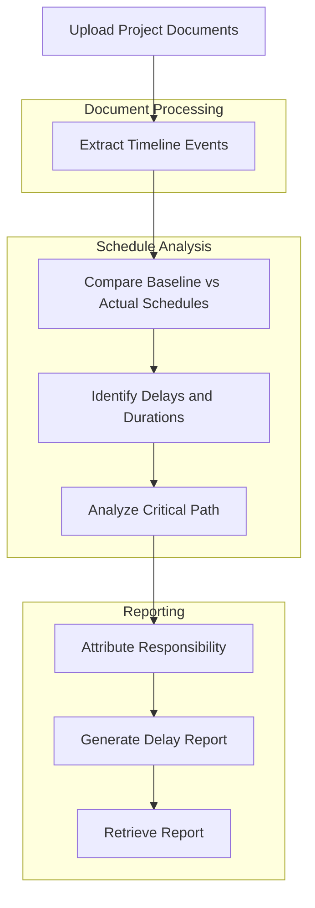
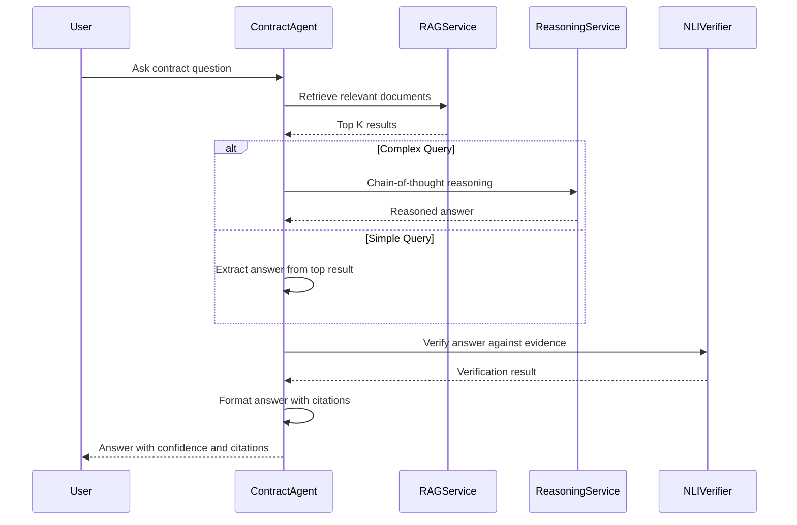
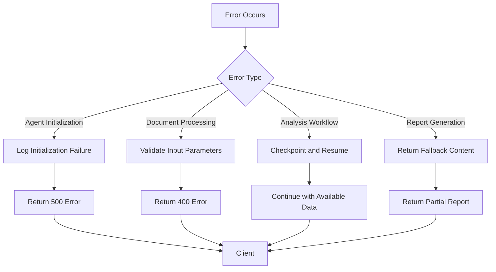

# MAHOUN Core API

<cite>
**Referenced Files in This Document**   
- [mahoun.py](file://api/routers/mahoun.py)
- [orchestrator.py](file://mahoun/agents/orchestrator.py)
- [doc_parser_agent.py](file://mahoun/agents/doc_parser_agent.py)
- [contract_agent.py](file://mahoun/agents/contract_agent.py)
- [delay_agent.py](file://mahoun/agents/delay_agent.py)
- [delay_analyzer.py](file://mahoun/domain/delay_analyzer.py)
- [delay_report.py](file://output/delay_report.py)
- [claim_generator.py](file://output/claim_generator.py)
- [error_handling.py](file://mahoun/core/error_handling.py)
</cite>

## Table of Contents
1. [Introduction](#introduction)
2. [API Endpoints](#api-endpoints)
3. [Request/Response Schemas](#requestresponse-schemas)
4. [Orchestrator Pattern](#orchestrator-pattern)
5. [Delay Analysis Workflow](#delay-analysis-workflow)
6. [Claim Generation and Contract Q&A](#claim-generation-and-contract-qa)
7. [Report Generation and Retrieval](#report-generation-and-retrieval)
8. [Error Handling](#error-handling)
9. [Examples](#examples)
10. [Conclusion](#conclusion)

## Introduction
The MAHOUN Core API provides advanced analysis capabilities for construction contract disputes, delay analysis, claim generation, and contract question answering. The system leverages a sophisticated orchestrator pattern with specialized agents to coordinate complex workflows for legal and project analysis. This documentation covers the core endpoints, request/response schemas, architectural patterns, and workflow details for the MAHOUN system.

**Section sources**
- [mahoun.py](file://api/routers/mahoun.py#L1-L50)

## API Endpoints
The MAHOUN API exposes several endpoints for document processing, analysis, and report generation. These endpoints follow a RESTful design with clear separation of concerns and standardized response formats.

### /upload-documents
Uploads and processes documents for analysis. Supports various formats including PDF, DOCX, TXT, and images (with OCR). The endpoint normalizes the document content and optionally indexes it for retrieval.



**Diagram sources**
- [mahoun.py](file://api/routers/mahoun.py#L160-L237)
- [doc_parser_agent.py](file://mahoun/agents/doc_parser_agent.py#L70-L344)

### /analyze-delay
Analyzes project delays by comparing baseline vs actual schedules. The endpoint identifies delays, performs critical path analysis, and attributes responsibility for delays.



**Diagram sources**
- [mahoun.py](file://api/routers/mahoun.py#L239-L287)
- [delay_analyzer.py](file://mahoun/domain/delay_analyzer.py#L19-L117)

### /generate-claim
Generates formal claim drafts based on provided facts and legal basis. The endpoint structures the claim content and provides citations to supporting documents.

### /ask-contract
Answers questions about contracts with citation tracking. Uses retrieval-augmented generation (RAG) to find relevant contract clauses and provide accurate answers.



**Diagram sources**
- [mahoun.py](file://api/routers/mahoun.py#L341-L396)
- [contract_agent.py](file://mahoun/agents/contract_agent.py#L262-L450)

### /generate-delay-report and /generate-timeline-report
Generate comprehensive reports for delay analysis and timeline visualization. These endpoints coordinate multiple agents to produce detailed analysis reports.

### /reports/{report_id} and /reports
Retrieve generated reports by ID or list all available reports. Reports are stored in memory with download URLs provided in responses.

**Section sources**
- [mahoun.py](file://api/routers/mahoun.py#L160-L562)

## Request/Response Schemas
The MAHOUN API uses Pydantic models to define request and response schemas, ensuring type safety and clear documentation.

### DocumentUploadRequest
Request schema for document upload endpoint.

| Field | Type | Description | Required |
|-------|------|-------------|----------|
| doc_type | string | Document type: contract, letter, report, general_conditions | Yes |
| metadata | object | Additional metadata | No |
| index | boolean | Index document after upload | Yes (default: true) |

### DocumentUploadResponse
Response schema for document upload endpoint.

| Field | Type | Description |
|-------|------|-------------|
| success | boolean | Whether the upload was successful |
| document_id | string | Unique identifier for the uploaded document |
| doc_type | string | Type of the document |
| normalized | object | Normalized document structure |
| indexed | boolean | Whether the document was indexed |
| processing_time_ms | number | Time taken to process the document in milliseconds |

### DelayAnalysisRequest
Request schema for delay analysis endpoint.

| Field | Type | Description | Required |
|-------|------|-------------|----------|
| project_id | string | Project identifier | Yes |
| query | string | Analysis query | No |
| baseline_schedule | object | Baseline schedule data | No |
| actual_schedule | object | Actual schedule data | No |

### DelayAnalysisResponse
Response schema for delay analysis endpoint.

| Field | Type | Description |
|-------|------|-------------|
| success | boolean | Whether the analysis was successful |
| project_id | string | Project identifier |
| delays | array | List of identified delays |
| delay_analysis | object | Summary of delay analysis |
| critical_path | array | Critical path activities |
| attribution | object | Responsibility attribution for delays |
| processing_time_ms | number | Time taken for analysis in milliseconds |

### ClaimGenerationRequest
Request schema for claim generation endpoint.

| Field | Type | Description | Required |
|-------|------|-------------|----------|
| claim_type | string | Type of claim | Yes |
| facts | string | Facts and information for the claim | Yes |
| legal_basis | string | Legal basis for the claim | No |
| parties | object | Information about involved parties | No |

### ClaimGenerationResponse
Response schema for claim generation endpoint.

| Field | Type | Description |
|-------|------|-------------|
| success | boolean | Whether claim generation was successful |
| claim_id | string | Unique identifier for the generated claim |
| claim_content | string | Full content of the claim |
| markdown | string | Markdown formatted claim |
| citations | array | List of supporting document citations |
| processing_time_ms | number | Time taken for claim generation in milliseconds |

### ContractQueryRequest
Request schema for contract question answering endpoint.

| Field | Type | Description | Required |
|-------|------|-------------|----------|
| query | string | Question about the contract | Yes |
| clause_number | string | Specific clause number to query | No |
| contract_id | string | Contract identifier | No |
| top_k | integer | Number of results to return (1-20) | No (default: 10) |

### ContractQueryResponse
Response schema for contract question answering endpoint.

| Field | Type | Description |
|-------|------|-------------|
| success | boolean | Whether the query was successful |
| answer | string | Answer to the contract question |
| confidence | number | Confidence score (0-1) |
| verified | boolean | Whether the answer was verified |
| citations | array | List of document citations supporting the answer |
| clauses | array | List of relevant contract clauses |
| processing_time_ms | number | Time taken for query processing in milliseconds |

**Section sources**
- [mahoun.py](file://api/routers/mahoun.py#L36-L118)

## Orchestrator Pattern
The MAHOUN system employs an orchestrator pattern to coordinate specialized agents for complex analysis workflows. The UltraOrchestrator manages workflow execution as a Directed Acyclic Graph (DAG), enabling parallel execution of independent tasks and dependency resolution.

### UltraOrchestrator Architecture
The UltraOrchestrator is responsible for:
- Managing agent lifecycle (initialization, registration, execution)
- Coordinating workflow execution as a DAG
- Handling checkpointing and resumption of long-running workflows
- Providing progress tracking and real-time monitoring
- Implementing error recovery and rollback mechanisms



**Diagram sources**
- [orchestrator.py](file://mahoun/agents/orchestrator.py#L234-L800)

### Agent Registration
The orchestrator registers specialized agents during initialization:

```python
# Register all agents
_orchestrator.register_agent("doc_parser_agent", UltraDocParserAgent())
_orchestrator.register_agent("dispute_agent", DisputeAgent())
_orchestrator.register_agent("claim_agent", UltraClaimAgent())
_orchestrator.register_agent("timeline_agent", TimelineAgent())
_orchestrator.register_agent("delay_agent", DelayAgent())
_orchestrator.register_agent("narrative_agent", NarrativeAgent())
_orchestrator.register_agent("contract_agent", UltraContractAgent())
```

Each agent specializes in a specific domain:
- **DocParserAgent**: Document parsing and normalization
- **ContractAgent**: Contract question answering and clause analysis
- **DelayAgent**: Project delay analysis and critical path identification
- **TimelineAgent**: Timeline extraction and event sequencing
- **ClaimAgent**: Claim generation and legal drafting

**Section sources**
- [mahoun.py](file://api/routers/mahoun.py#L128-L153)
- [orchestrator.py](file://mahoun/agents/orchestrator.py#L234-L800)

## Delay Analysis Workflow
The delay analysis workflow compares baseline vs actual schedules to identify delays, perform critical path analysis, and attribute responsibility.

### Workflow Steps
1. **Document Ingestion**: Upload project documents (contracts, correspondence, schedules)
2. **Timeline Extraction**: Extract key events and milestones from documents
3. **Schedule Comparison**: Compare baseline vs actual schedules
4. **Delay Identification**: Identify specific delays and their durations
5. **Critical Path Analysis**: Determine the critical path and impact of delays
6. **Responsibility Attribution**: Attribute delays to responsible parties
7. **Report Generation**: Generate comprehensive delay analysis report



**Diagram sources**
- [delay_analyzer.py](file://mahoun/domain/delay_analyzer.py#L19-L117)
- [delay_agent.py](file://mahoun/agents/delay_agent.py#L20-L138)

### Critical Path Analysis
The system identifies the critical path by analyzing task dependencies and durations. Delays on the critical path directly impact the project completion date, while delays on non-critical paths may have float time.

The delay analysis engine calculates:
- Total project delay
- Critical path delay vs non-critical path delay
- Float time for non-critical activities
- Impact of concurrent delays
- Responsibility attribution based on contract clauses

**Section sources**
- [delay_analyzer.py](file://mahoun/domain/delay_analyzer.py#L19-L117)
- [delay_agent.py](file://mahoun/agents/delay_agent.py#L20-L138)

## Claim Generation and Contract Q&A
The MAHOUN system provides advanced capabilities for claim generation and contract question answering with citation tracking.

### Claim Generation Process
The claim generation process follows these steps:

1. **Input Collection**: Gather claim type, facts, legal basis, and party information
2. **Legal Research**: Retrieve relevant legal precedents and contract clauses
3. **Claim Structuring**: Organize the claim according to legal standards
4. **Content Generation**: Draft the claim content with proper legal language
5. **Citation Integration**: Add citations to supporting documents and legal authorities
6. **Quality Assurance**: Verify the claim for completeness and accuracy

The system uses the UltraClaimAgent to generate claims, which leverages the orchestrator pattern to coordinate with other agents as needed.

### Contract Question Answering
The contract Q&A system uses a multi-step process:

1. **Query Understanding**: Analyze the user's question to determine intent
2. **Document Retrieval**: Use RAG to find relevant contract clauses and documents
3. **Chain-of-Thought Reasoning**: Apply step-by-step reasoning to formulate an answer
4. **Answer Verification**: Use NLI verification to ensure answer accuracy
5. **Confidence Scoring**: Calculate confidence in the answer
6. **Citation Generation**: Provide citations to supporting documents

The ContractAgent implements this workflow, using different reasoning modes based on query complexity:
- **Simple Mode**: Direct answer from top document result
- **Chain-of-Thought**: Step-by-step reasoning with evidence evaluation
- **Multi-hop**: Multiple retrieval and reasoning rounds for complex queries
- **Auto**: Automatic selection based on query characteristics



**Diagram sources**
- [contract_agent.py](file://mahoun/agents/contract_agent.py#L262-L450)

**Section sources**
- [contract_agent.py](file://mahoun/agents/contract_agent.py#L262-L450)
- [claim_generator.py](file://output/claim_generator.py#L8-L42)

## Report Generation and Retrieval
The MAHOUN system provides comprehensive report generation capabilities for delay analysis and timeline visualization.

### Report Generation Process
Reports are generated through a coordinated process:

1. **Request Processing**: Receive report generation request with parameters
2. **Analysis Execution**: Run the appropriate analysis (delay, timeline)
3. **Content Structuring**: Organize findings into a coherent structure
4. **Formatting**: Generate both plain text and markdown formats
5. **Storage**: Store the generated report in memory
6. **Response Preparation**: Return report with download URL

### In-Memory Report Storage
Generated reports are stored in memory using a simple dictionary-based storage system:

```python
_report_storage = {}

# Store report
_report_storage[report_id] = result

# Retrieve report
if report_id not in _report_storage:
    raise HTTPException(status_code=404, detail=f"Report {report_id} not found")
```

Each report includes:
- Unique report ID
- Report type (delay, timeline)
- Content in multiple formats (text, markdown)
- Download URL for retrieval
- Processing time metrics

Reports can be retrieved individually by ID or listed in summary form.

**Section sources**
- [mahoun.py](file://api/routers/mahoun.py#L400-L562)
- [delay_report.py](file://output/delay_report.py#L8-L53)

## Error Handling
The MAHOUN system implements comprehensive error handling for agent initialization failures and processing errors.

### Error Handling Strategy
The system uses a standardized error handling approach with the ErrorHandler class:



**Diagram sources**
- [error_handling.py](file://mahoun/core/error_handling.py#L31-L82)

### Specific Error Cases
The system handles several specific error scenarios:

**Agent Initialization Failures**
When an agent fails to initialize, the system:
- Logs the initialization error with full traceback
- Returns a 500 Internal Server Error
- Provides specific error details in the response

```python
if not doc_parser:
    raise HTTPException(
        status_code=status.HTTP_500_INTERNAL_SERVER_ERROR,
        detail="DocParserAgent not available"
    )
```

**Processing Errors**
For document processing and analysis errors:
- Input validation errors return 400 Bad Request
- Processing failures return 500 Internal Server Error
- The system logs detailed error context for debugging

```python
except Exception as e:
    logger.error(f"Document upload failed: {e}", exc_info=True)
    raise HTTPException(
        status_code=status.HTTP_500_INTERNAL_SERVER_ERROR,
        detail=f"Document upload failed: {str(e)}"
    )
```

The error handling system captures:
- Operation name
- Module where error occurred
- Error type and message
- Full traceback
- Additional metadata
- Timestamp

**Section sources**
- [mahoun.py](file://api/routers/mahoun.py#L196-L236)
- [error_handling.py](file://mahoun/core/error_handling.py#L31-L82)

## Examples
This section provides practical examples of using the MAHOUN API for common scenarios.

### Analyzing Project Delays
To analyze delays in a construction project:

```bash
curl -X POST "http://localhost:8000/api/v1/mahoun/analyze-delay" \
  -H "Content-Type: application/json" \
  -d '{
    "project_id": "PROJ-001",
    "query": "Analyze delays in foundation work",
    "baseline_schedule": {
      "foundation_start": "2025-01-15",
      "foundation_end": "2025-02-15"
    },
    "actual_schedule": {
      "foundation_start": "2025-01-20",
      "foundation_end": "2025-03-01"
    }
  }'
```

The response includes identified delays, critical path analysis, and responsibility attribution.

### Querying Contract Clauses
To ask a question about a contract:

```bash
curl -X POST "http://localhost:8000/api/v1/mahoun/ask-contract" \
  -H "Content-Type: application/json" \
  -d '{
    "query": "What are the liquidated damages for delay in this contract?",
    "top_k": 5
  }'
```

The response provides an answer with confidence score, verification status, and citations to relevant contract clauses.

**Section sources**
- [mahoun.py](file://api/routers/mahoun.py#L239-L396)

## Conclusion
The MAHOUN Core API provides a comprehensive suite of endpoints for construction contract analysis, delay assessment, claim generation, and contract question answering. The system's orchestrator pattern enables coordination of specialized agents for complex workflows, while the standardized request/response schemas ensure consistent API usage. The delay analysis workflow compares baseline vs actual schedules to identify delays and perform critical path analysis, while the claim generation and contract Q&A capabilities provide citation-tracked responses. Report generation and retrieval are supported with in-memory storage, and comprehensive error handling ensures robust operation. These capabilities make MAHOUN a powerful tool for construction dispute resolution and project analysis.