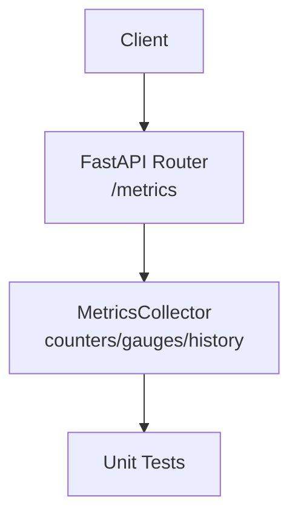
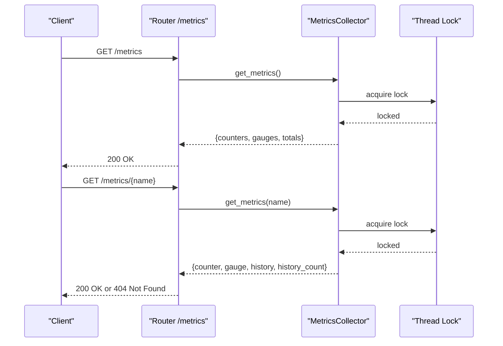
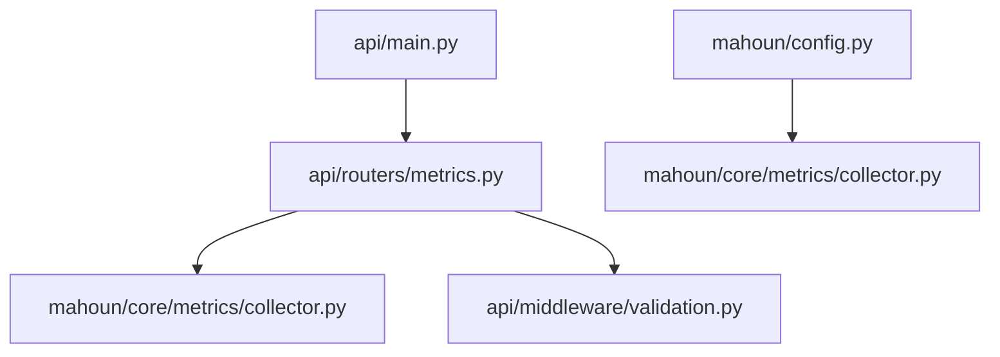

# Metrics API

<cite>
**Referenced Files in This Document**
- [api/routers/metrics.py](file://api/routers/metrics.py)
- [mahoun/core/metrics/collector.py](file://mahoun/core/metrics/collector.py)
- [mahoun/core/metrics/decorators.py](file://mahoun/core/metrics/decorators.py)
- [api/main.py](file://api/main.py)
- [api/middleware/validation.py](file://api/middleware/validation.py)
- [mahoun/config.py](file://mahoun/config.py)
- [tests/test_metrics.py](file://tests/test_metrics.py)
</cite>

## Table of Contents
1. [Introduction](#introduction)
2. [Project Structure](#project-structure)
3. [Core Components](#core-components)
4. [Architecture Overview](#architecture-overview)
5. [Detailed Component Analysis](#detailed-component-analysis)
6. [Dependency Analysis](#dependency-analysis)
7. [Performance Considerations](#performance-considerations)
8. [Troubleshooting Guide](#troubleshooting-guide)
9. [Conclusion](#conclusion)
10. [Appendices](#appendices)

## Introduction
This document describes the Metrics API endpoints and the underlying metrics collector. It covers:
- Endpoints: GET /metrics, GET /metrics/summary, GET /metrics/{metric_name}, GET /metrics/agents/summary, and POST /metrics/reset
- The metrics collector that tracks counters, gauges, and historical data
- Response structures for current values, history counts, and timestamps
- Agent metrics summary filtering by the “agent.” prefix
- Reset functionality for clearing specific metrics or all metrics
- Example use cases: retrieving LLM invocation counts, monitoring agent performance, and resetting counters for testing
- Error handling for non-existent metrics (404) and collection failures (500)
- Authentication and rate limiting considerations for metrics access

## Project Structure
The Metrics API is implemented as a FastAPI router mounted under /metrics. It delegates to a thread-safe metrics collector that stores counters, gauges, and a bounded history of metric events.

**Diagram sources**
- [api/routers/metrics.py](file://api/routers/metrics.py#L30-L181)
- [mahoun/core/metrics/collector.py](file://mahoun/core/metrics/collector.py#L40-L213)

**Section sources**
- [api/routers/metrics.py](file://api/routers/metrics.py#L1-L181)
- [mahoun/core/metrics/collector.py](file://mahoun/core/metrics/collector.py#L40-L213)

## Core Components
- Metrics API Router: Defines endpoints for retrieving metrics, summaries, agent summaries, and resetting metrics.
- MetricsCollector: Thread-safe collector storing counters, gauges, and a bounded history of metric events.
- Decorators: Automatic instrumentation for timing and call tracking.
- Application integration: The API is mounted at /metrics and integrated into the main FastAPI app with validation and rate limiting middleware.

Key responsibilities:
- Expose metrics endpoints
- Aggregate counters and gauges
- Maintain bounded history per metric
- Provide agent-filtered summaries
- Reset metrics selectively or globally

**Section sources**
- [api/routers/metrics.py](file://api/routers/metrics.py#L30-L181)
- [mahoun/core/metrics/collector.py](file://mahoun/core/metrics/collector.py#L40-L213)
- [mahoun/core/metrics/decorators.py](file://mahoun/core/metrics/decorators.py#L27-L170)
- [api/main.py](file://api/main.py#L152-L159)

## Architecture Overview
The Metrics API is a thin layer over the MetricsCollector. Requests are processed by the router, which calls collector methods and returns structured responses. The collector maintains thread-safety with locks and supports bounded history.

**Diagram sources**
- [api/routers/metrics.py](file://api/routers/metrics.py#L30-L110)
- [mahoun/core/metrics/collector.py](file://mahoun/core/metrics/collector.py#L119-L168)

## Detailed Component Analysis

### Metrics API Router
Endpoints:
- GET /metrics
  - Returns aggregated counters and gauges plus totals
- GET /metrics/summary
  - Returns summary statistics (counts, top counters, timestamp)
- GET /metrics/{metric_name}
  - Returns a specific metric’s current counter, gauge, history, and history_count
  - Returns 404 if history_count is zero (no data)
- GET /metrics/agents/summary
  - Filters counters and gauges by keys starting with “agent.”
- POST /metrics/reset
  - Resets a specific metric or all metrics
  - Returns a success message

Error handling:
- 500 Internal Server Error for collection failures
- 404 Not Found for non-existent metrics when querying a specific metric by name

Security and rate limiting:
- Input validation middleware skips validation for /metrics
- Rate limiting middleware applies to all requests unless disabled

**Section sources**
- [api/routers/metrics.py](file://api/routers/metrics.py#L30-L181)
- [api/middleware/validation.py](file://api/middleware/validation.py#L33-L41)
- [api/main.py](file://api/main.py#L80-L85)

### MetricsCollector
Responsibilities:
- Thread-safe recording of counters and gauges
- Maintains a bounded history per metric using deques
- Provides methods to get all metrics, a specific metric, summary statistics, and reset

Data model:
- Counters: cumulative integer values
- Gauges: floating-point current values
- History: list of metric events with name, value, timestamp, and tags

Key methods:
- record_counter(name, value, tags)
- record_gauge(name, value, tags)
- record_timing(name, duration_ms, tags)
- get_metrics(name=None)
- get_summary()
- reset(name=None)

Thread-safety:
- Uses a lock to protect shared state during reads/writes

Bounded history:
- Each metric’s history is stored in a deque with a configurable maximum length

**Section sources**
- [mahoun/core/metrics/collector.py](file://mahoun/core/metrics/collector.py#L40-L213)

### Decorators for Automatic Instrumentation
- track_timing(metric_name): Records execution time and tags outcomes (success/error)
- track_calls(metric_name): Increments call and success counters, and records error counters with error type tags
- track_all(metric_name): Applies both timing and calls decorators

These decorators integrate with the MetricsCollector to automatically capture performance and reliability signals.

**Section sources**
- [mahoun/core/metrics/decorators.py](file://mahoun/core/metrics/decorators.py#L27-L170)

### Response Structures

- GET /metrics
  - Returns:
    - counters: map of metric names to current counter values
    - gauges: map of metric names to current gauge values
    - total_metrics: total number of historical data points across all metrics
    - unique_metrics: number of distinct metrics with history

- GET /metrics/summary
  - Returns:
    - total_counters: number of counter series
    - total_gauges: number of gauge series
    - total_data_points: total number of historical data points
    - unique_metrics: number of distinct metrics with history
    - top_counters: top N counters by value
    - timestamp: ISO timestamp of the summary

- GET /metrics/{metric_name}
  - Returns:
    - name: metric name
    - counter: current counter value
    - gauge: current gauge value
    - history: list of historical events (each with name, value, timestamp, tags)
    - history_count: number of historical events

- GET /metrics/agents/summary
  - Returns:
    - counters: filtered counters whose keys start with “agent.”
    - gauges: filtered gauges whose keys start with “agent.”
    - total_agent_metrics: total number of agent-related counters and gauges

- POST /metrics/reset
  - Returns:
    - message: success message indicating reset of a specific metric or all metrics

Notes:
- Non-existent metrics return 404 Not Found when querying a specific metric by name
- Collection failures return 500 Internal Server Error

**Section sources**
- [mahoun/core/metrics/collector.py](file://mahoun/core/metrics/collector.py#L119-L168)
- [api/routers/metrics.py](file://api/routers/metrics.py#L30-L181)

### Example Use Cases

- Retrieving LLM invocation counts
  - Use GET /metrics to fetch counters and gauges
  - Look for metrics that reflect LLM invocations (e.g., calls, success, errors)
  - Alternatively, use GET /metrics/{metric_name} to fetch a specific invocation metric

- Monitoring agent performance
  - Use GET /metrics/agents/summary to get counters and gauges prefixed with “agent.”
  - Track throughput, success rates, and durations for agent-related activities

- Resetting counters for testing
  - Use POST /metrics/reset to clear all metrics or a specific metric
  - After reset, verify counters are zero and history_count is zero for targeted metrics

**Section sources**
- [mahoun/core/metrics/decorators.py](file://mahoun/core/metrics/decorators.py#L95-L147)
- [api/routers/metrics.py](file://api/routers/metrics.py#L112-L181)
- [tests/test_metrics.py](file://tests/test_metrics.py#L80-L107)

### Error Handling
- 404 Not Found
  - Returned when querying a specific metric by name and the history_count is zero
- 500 Internal Server Error
  - Returned for failures while collecting metrics or resetting metrics

**Section sources**
- [api/routers/metrics.py](file://api/routers/metrics.py#L81-L110)
- [api/routers/metrics.py](file://api/routers/metrics.py#L152-L181)

## Dependency Analysis
The Metrics API depends on the MetricsCollector for data. The collector is a singleton accessed via a factory function. The API router is mounted in the main application and participates in the middleware stack.

**Diagram sources**
- [api/routers/metrics.py](file://api/routers/metrics.py#L1-L20)
- [mahoun/core/metrics/collector.py](file://mahoun/core/metrics/collector.py#L197-L213)
- [api/main.py](file://api/main.py#L152-L159)
- [mahoun/config.py](file://mahoun/config.py#L47-L78)

**Section sources**
- [api/routers/metrics.py](file://api/routers/metrics.py#L1-L20)
- [mahoun/core/metrics/collector.py](file://mahoun/core/metrics/collector.py#L197-L213)
- [api/main.py](file://api/main.py#L152-L159)
- [mahoun/config.py](file://mahoun/config.py#L47-L78)

## Performance Considerations
- Thread-safety: The collector uses locks to protect shared state, preventing race conditions at the cost of potential contention under heavy write loads.
- Bounded history: Each metric’s history is stored in a deque with a maximum length, controlling memory growth.
- Summary computation: Summary aggregates across all metrics; on systems with many metrics, consider caching or periodic aggregation to reduce overhead.
- Decorator overhead: Automatic instrumentation adds timing and call counters; ensure metric names are scoped appropriately to avoid excessive cardinality.

[No sources needed since this section provides general guidance]

## Troubleshooting Guide
Common issues and resolutions:
- 404 Not Found when querying a specific metric
  - Cause: No historical data for the metric
  - Resolution: Verify the metric name and ensure the collector has recorded events for it
- 500 Internal Server Error
  - Cause: Exceptions during metric retrieval or reset
  - Resolution: Check server logs for the raised exception and retry; ensure the collector is initialized
- Unexpected empty responses
  - Cause: Metrics disabled by configuration or reset clears all data
  - Resolution: Confirm observability configuration and re-run instrumentation

Verification via tests:
- Unit tests demonstrate counter/gauge/timing recording, summary computation, and reset behavior
- Tests also verify decorator behavior for timing and calls

**Section sources**
- [tests/test_metrics.py](file://tests/test_metrics.py#L13-L107)
- [tests/test_metrics.py](file://tests/test_metrics.py#L109-L166)

## Conclusion
The Metrics API provides a simple, robust interface for retrieving and resetting metrics. The underlying MetricsCollector ensures thread-safety and bounded history, while decorators enable automatic instrumentation of timing and call success/error tracking. The API integrates with the application’s middleware stack, applying input validation and rate limiting, with metrics endpoints excluded from input validation.

[No sources needed since this section summarizes without analyzing specific files]

## Appendices

### Endpoint Reference

- GET /metrics
  - Description: Get all collected metrics (counters, gauges, and totals)
  - Response: counters, gauges, total_metrics, unique_metrics
  - Errors: 500 on collection failure

- GET /metrics/summary
  - Description: Get summary statistics for all metrics
  - Response: total_counters, total_gauges, total_data_points, unique_metrics, top_counters, timestamp
  - Errors: 500 on collection failure

- GET /metrics/{metric_name}
  - Description: Get data for a specific metric by name
  - Response: name, counter, gauge, history, history_count
  - Errors: 404 if history_count is zero; 500 on collection failure

- GET /metrics/agents/summary
  - Description: Get summary of all agent-related metrics (keys starting with “agent.”)
  - Response: counters (filtered), gauges (filtered), total_agent_metrics
  - Errors: 500 on collection failure

- POST /metrics/reset
  - Description: Reset all metrics or a specific metric
  - Response: message indicating success
  - Errors: 500 on reset failure

Security and rate limiting:
- Input validation middleware excludes /metrics from validation
- Rate limiting middleware applies to all requests unless disabled via environment variables

**Section sources**
- [api/routers/metrics.py](file://api/routers/metrics.py#L30-L181)
- [api/middleware/validation.py](file://api/middleware/validation.py#L33-L41)
- [api/main.py](file://api/main.py#L80-L85)