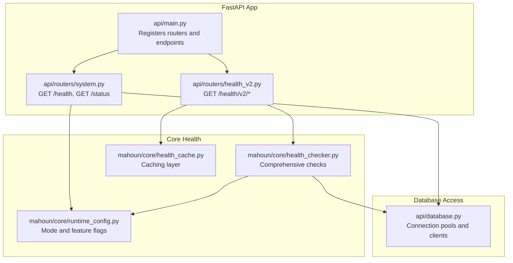
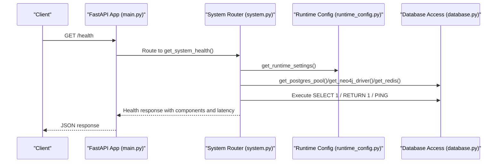
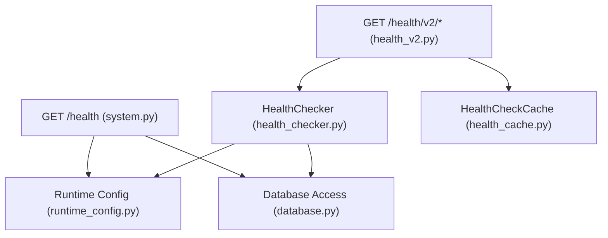

# System Health and Status API

<cite>
**Referenced Files in This Document**
- [system.py](file://api/routers/system.py)
- [health_v2.py](file://api/routers/health_v2.py)
- [main.py](file://api/main.py)
- [runtime_config.py](file://mahoun/core/runtime_config.py)
- [health_checker.py](file://mahoun/core/health_checker.py)
- [health_cache.py](file://mahoun/core/health_cache.py)
- [database.py](file://api/database.py)
- [test_real_health_checks.py](file://tests/test_real_health_checks.py)
</cite>

## Table of Contents
1. [Introduction](#introduction)
2. [Project Structure](#project-structure)
3. [Core Components](#core-components)
4. [Architecture Overview](#architecture-overview)
5. [Detailed Component Analysis](#detailed-component-analysis)
6. [Dependency Analysis](#dependency-analysis)
7. [Performance Considerations](#performance-considerations)
8. [Troubleshooting Guide](#troubleshooting-guide)
9. [Conclusion](#conclusion)

## Introduction
This document provides API documentation for the system health endpoints, focusing on:
- GET /health: Production-grade health checks performing real database queries (PostgreSQL: SELECT 1, Neo4j: RETURN 1, Redis: PING).
- GET /status: Lightweight availability check returning a simple online status.

It explains the health response structure, component statuses (healthy, degraded, unhealthy), latency measurements, and error details. It also describes how runtime settings (desktop_minimal mode, graph_enabled) affect which components are checked, how the overall status is calculated, and how /health differs from /status. Finally, it includes examples for interpreting results and troubleshooting connectivity issues, along with timestamp and total check time for performance monitoring.

## Project Structure
The health endpoints are implemented in the FastAPI application under the system router and enhanced health endpoints under health_v2. The runtime configuration controls which components are checked based on mode and feature flags.

**Diagram sources**
- [main.py](file://api/main.py#L114-L151)
- [system.py](file://api/routers/system.py#L26-L226)
- [health_v2.py](file://api/routers/health_v2.py#L1-L158)
- [runtime_config.py](file://mahoun/core/runtime_config.py#L1-L278)
- [health_checker.py](file://mahoun/core/health_checker.py#L1-L661)
- [health_cache.py](file://mahoun/core/health_cache.py#L1-L203)
- [database.py](file://api/database.py#L1-L175)

**Section sources**
- [main.py](file://api/main.py#L114-L151)
- [system.py](file://api/routers/system.py#L26-L226)
- [health_v2.py](file://api/routers/health_v2.py#L1-L158)

## Core Components
- GET /health: Performs real connectivity tests against PostgreSQL, Neo4j, and Redis. It measures per-component latency, captures errors, and computes an overall status based on component outcomes. It respects runtime mode to disable certain checks when not applicable.
- GET /status: Lightweight endpoint returning a simple online status without performing heavy checks.
- GET /health/v2: Enhanced health checks using a centralized HealthChecker with caching support, providing detailed component statuses and optional cache statistics.

Key runtime settings affecting checks:
- desktop_minimal mode disables PostgreSQL checks and may disable Neo4j depending on graph settings.
- graph_enabled and graph_backend influence whether Neo4j checks are performed.
- Optional components (Ollama, PostgreSQL, Redis, Gaussian Process) are controlled by environment flags.

**Section sources**
- [system.py](file://api/routers/system.py#L26-L226)
- [runtime_config.py](file://mahoun/core/runtime_config.py#L1-L278)
- [health_v2.py](file://api/routers/health_v2.py#L1-L158)
- [health_checker.py](file://mahoun/core/health_checker.py#L1-L661)
- [health_cache.py](file://mahoun/core/health_cache.py#L1-L203)

## Architecture Overview
The health endpoints integrate with runtime configuration and database access layers to produce production-grade health reports.

**Diagram sources**
- [main.py](file://api/main.py#L238-L245)
- [system.py](file://api/routers/system.py#L26-L226)
- [runtime_config.py](file://mahoun/core/runtime_config.py#L1-L278)
- [database.py](file://api/database.py#L1-L175)

## Detailed Component Analysis

### GET /health
- Purpose: Production-grade health check performing real database queries.
- Behavior:
  - PostgreSQL: Executes SELECT 1 against the pool; measures latency; marks unhealthy on connection or query failure.
  - Neo4j: Executes RETURN 1 via a session; measures latency; marks unhealthy on driver/session or query failure; disabled in desktop_minimal mode or when graph is disabled/fallback.
  - Redis: Executes PING; measures latency; marks unhealthy on client or ping failure.
  - Overall status: Calculated from component states (healthy, degraded, unhealthy, disabled).
  - Response includes timestamp, total check time, component details, and summary counts.
- Runtime settings impact:
  - desktop_minimal mode disables PostgreSQL checks and marks Neo4j as disabled if graph is not enabled.
  - Graph checks depend on graph_enabled and graph_backend.

Response structure highlights:
- status: "healthy" | "degraded" | "unhealthy"
- mode: current runtime mode
- timestamp: ISO formatted
- total_check_time_ms: total elapsed time across all checks
- components: per-component status, latency_ms, error, checked_at
- summary: counts of healthy, unhealthy, disabled, total

Interpretation examples:
- All healthy: status = "healthy", components show healthy with low latency.
- Mixed states: status = "degraded", indicating partial failures.
- No healthy components: status = "unhealthy".
- Disabled components: status may be "degraded" when all checked components are disabled.

Troubleshooting:
- If PostgreSQL is disabled, confirm mode and flags.
- If Neo4j is disabled, verify graph_enabled and graph_backend.
- If Redis fails, check connection URL and credentials.

**Section sources**
- [system.py](file://api/routers/system.py#L26-L226)
- [runtime_config.py](file://mahoun/core/runtime_config.py#L1-L278)
- [database.py](file://api/database.py#L1-L175)
- [test_real_health_checks.py](file://tests/test_real_health_checks.py#L129-L283)

### GET /status
- Purpose: Lightweight availability check.
- Behavior: Returns a simple online status with mode and timestamp, instructing users to use /health for detailed checks.
- No real database queries are executed.

**Section sources**
- [system.py](file://api/routers/system.py#L210-L226)

### GET /health/v2
- Purpose: Enhanced health checks using HealthChecker with caching.
- Endpoints:
  - GET /health/v2: Basic health check returning a simple status.
  - GET /health/v2/detailed: Comprehensive health check across multiple components (Ollama, VectorStore, Graph, Reasoning, Agents, Refactored modules, Databases).
  - GET /health/v2/component/{component}: Component-specific health check with caching support.
- Caching: CachedHealthChecker caches results by key ("all", component name) with configurable TTL.

Response structure highlights:
- status: Overall status derived from core components and agents.
- core: Core status and import safety indicator.
- graph: Graph status and reason.
- agents: Agent status and count.
- self_improve: Self-improvement status and reason.
- components: Detailed breakdown of all components.

**Section sources**
- [health_v2.py](file://api/routers/health_v2.py#L1-L158)
- [health_checker.py](file://mahoun/core/health_checker.py#L1-L661)
- [health_cache.py](file://mahoun/core/health_cache.py#L1-L203)

### GET /health (application-level alias)
- The main application registers a GET /health endpoint that delegates to the centralized HealthChecker, returning the same detailed structure as /health/v2/detailed.

**Section sources**
- [main.py](file://api/main.py#L238-L245)
- [health_checker.py](file://mahoun/core/health_checker.py#L1-L661)

## Dependency Analysis
The health endpoints depend on runtime configuration and database access layers. The enhanced health endpoints rely on HealthChecker and HealthCheckCache.

**Diagram sources**
- [system.py](file://api/routers/system.py#L26-L226)
- [health_v2.py](file://api/routers/health_v2.py#L1-L158)
- [health_checker.py](file://mahoun/core/health_checker.py#L1-L661)
- [health_cache.py](file://mahoun/core/health_cache.py#L1-L203)
- [runtime_config.py](file://mahoun/core/runtime_config.py#L1-L278)
- [database.py](file://api/database.py#L1-L175)

**Section sources**
- [system.py](file://api/routers/system.py#L26-L226)
- [health_v2.py](file://api/routers/health_v2.py#L1-L158)
- [health_checker.py](file://mahoun/core/health_checker.py#L1-L661)
- [health_cache.py](file://mahoun/core/health_cache.py#L1-L203)
- [runtime_config.py](file://mahoun/core/runtime_config.py#L1-L278)
- [database.py](file://api/database.py#L1-L175)

## Performance Considerations
- Latency measurement: Both /health and /health/v2 measure per-component latency and total time. Use total_check_time_ms and component latency_ms for performance monitoring.
- Caching: /health/v2 supports caching to reduce load; tune cache_ttl to balance freshness and performance.
- Concurrency: HealthChecker runs checks concurrently; ensure database pools and drivers are ready to minimize delays.
- Mode-aware checks: desktop_minimal mode avoids expensive checks, reducing latency and preventing false negatives.

[No sources needed since this section provides general guidance]

## Troubleshooting Guide
Common issues and resolutions:
- PostgreSQL disabled in desktop_minimal mode:
  - Confirm mode and flags; adjust runtime settings if necessary.
  - Expect disabled status for PostgreSQL in this mode.
- Neo4j disabled or unhealthy:
  - Verify graph_enabled and graph_backend.
  - Check Neo4j driver initialization and credentials.
- Redis connectivity issues:
  - Validate REDIS_URL and credentials.
  - Ensure Redis server is reachable.
- Overall status degraded:
  - Inspect component details for unhealthy entries and error messages.
  - Review latency_ms to identify slow components.
- Timestamp and total time:
  - Use timestamp for correlation with logs.
  - Use total_check_time_ms for SLA monitoring.

**Section sources**
- [system.py](file://api/routers/system.py#L26-L226)
- [runtime_config.py](file://mahoun/core/runtime_config.py#L1-L278)
- [database.py](file://api/database.py#L1-L175)
- [test_real_health_checks.py](file://tests/test_real_health_checks.py#L129-L283)

## Conclusion
The system provides two complementary health endpoints:
- GET /health: Production-grade checks with real database queries, latency measurements, and robust status calculation.
- GET /status: Lightweight availability check for quick API health.
- GET /health/v2: Enhanced checks with caching and detailed component reporting.

Runtime settings govern which components are checked, enabling graceful degradation in constrained environments. Use the provided fields (status, components, latency, timestamp, total_check_time_ms) to monitor and troubleshoot effectively.