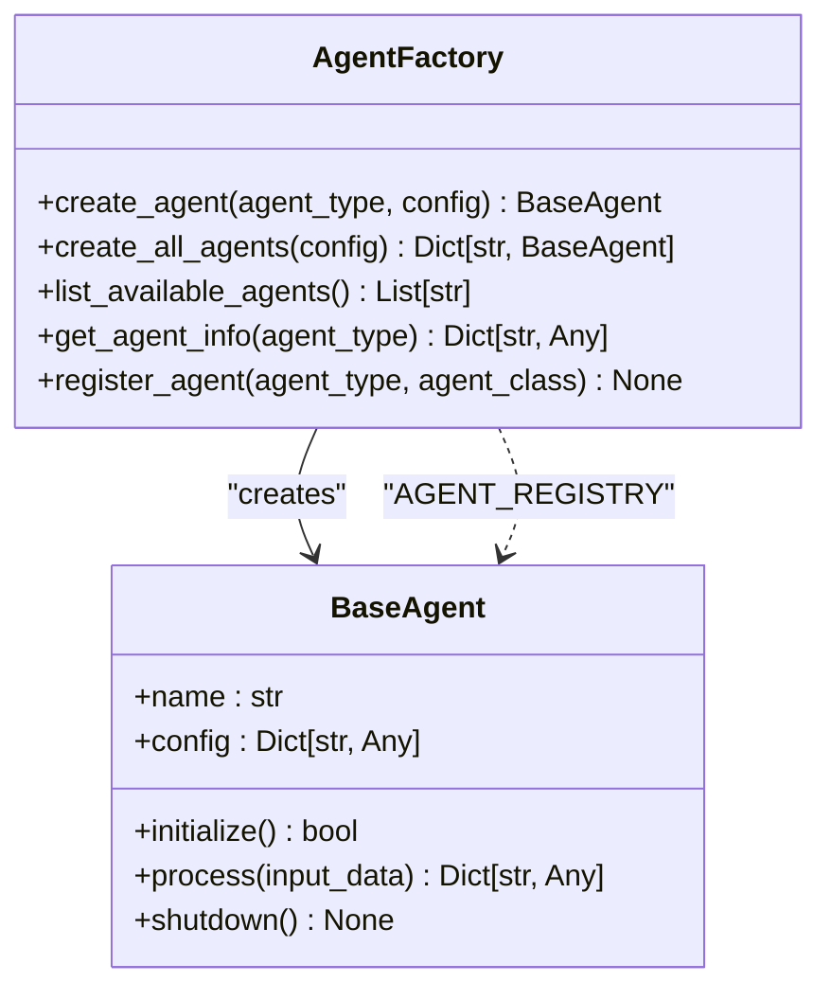
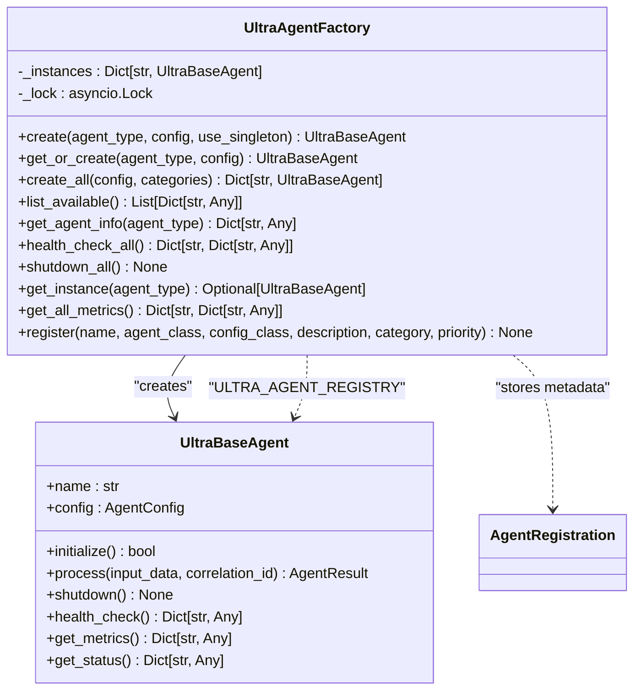
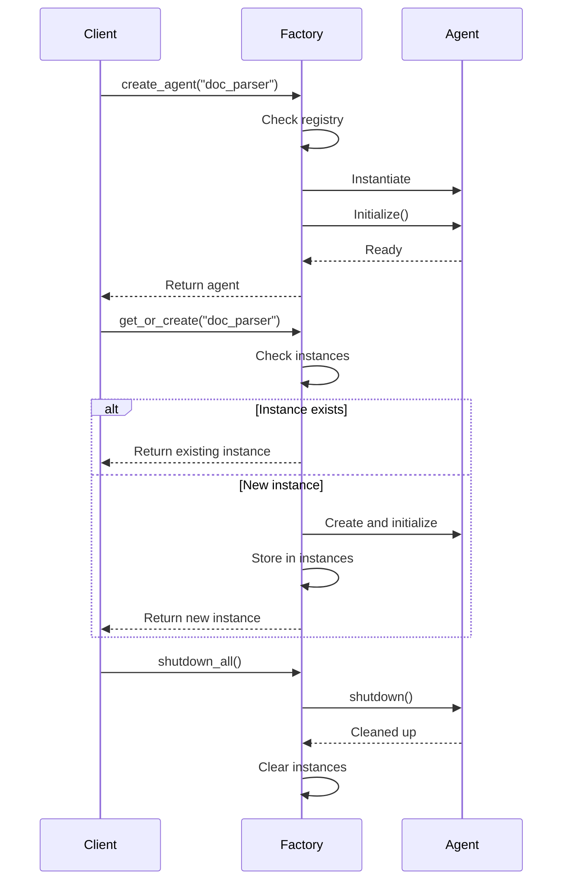
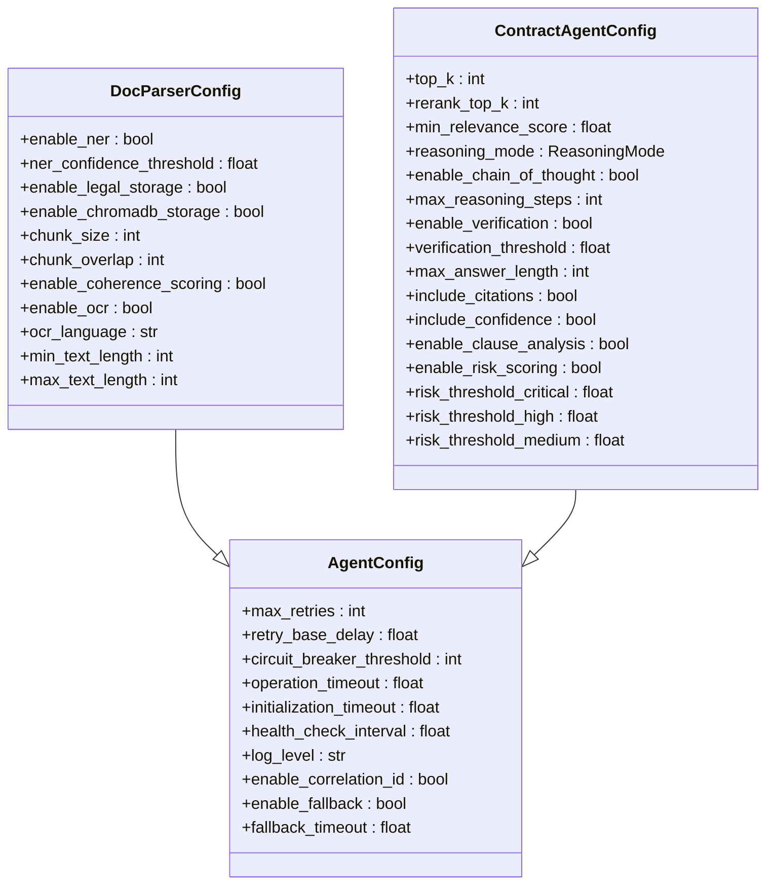
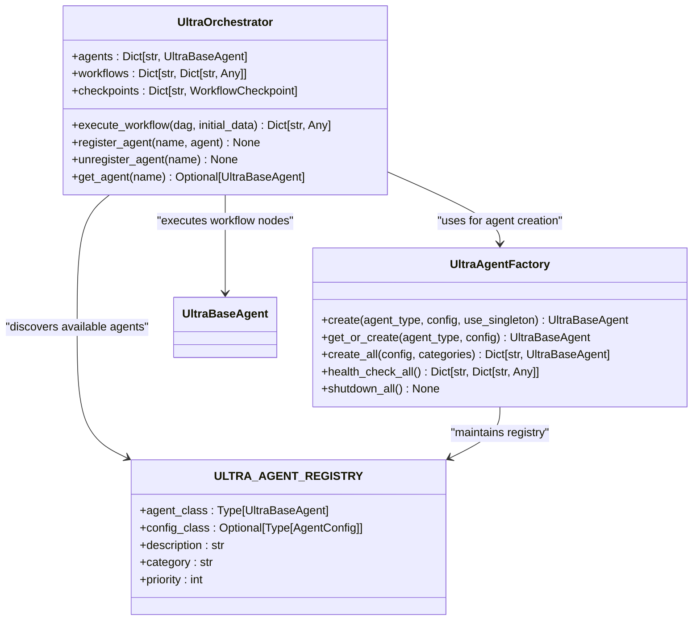

# Agent Factory Pattern

<cite>
**Referenced Files in This Document**   
- [factory.py](file://mahoun/agents/factory.py)
- [ultra_factory.py](file://mahoun/agents/ultra_factory.py)
- [base_agent.py](file://mahoun/agents/base_agent.py)
- [orchestrator.py](file://mahoun/agents/orchestrator.py)
- [doc_parser_agent.py](file://mahoun/agents/doc_parser_agent.py)
- [contract_agent.py](file://mahoun/agents/contract_agent.py)
- [ultra_narrative_agent.py](file://mahoun/agents/ultra_narrative_agent.py)
- [ultra_precedent_agent.py](file://mahoun/agents/ultra_precedent_agent.py)
- [legacy_adapter.py](file://mahoun/agents/legacy_adapter.py)
- [__init__.py](file://mahoun/agents/__init__.py)
</cite>

## Table of Contents
1. [Introduction](#introduction)
2. [Core Components](#core-components)
3. [Standard AgentFactory Implementation](#standard-agentfactory-implementation)
4. [UltraAgentFactory Implementation](#ultraagentfactory-implementation)
5. [Agent Registration and Lifecycle Management](#agent-registration-and-lifecycle-management)
6. [Configuration and Dependency Injection](#configuration-and-dependency-injection)
7. [Relationship with Orchestrator and Agent Registry](#relationship-with-orchestrator-and-agent-registry)
8. [Error Handling and Validation](#error-handling-and-validation)
9. [Memory Management and Performance](#memory-management-and-performance)
10. [Usage Patterns and Examples](#usage-patterns-and-examples)
11. [Conclusion](#conclusion)

## Introduction
The Agent Factory Pattern in the Mahoun platform provides a robust framework for creating, managing, and orchestrating intelligent agents for legal document processing. This pattern implements two complementary factory classes: the standard `AgentFactory` for basic agent creation and the advanced `UltraAgentFactory` for enterprise-grade agent management with enhanced capabilities. The system enables centralized agent creation with configuration injection, lifecycle management, and integration with the orchestrator for workflow execution. This documentation provides a comprehensive analysis of both factory implementations, their differences, and their role in the overall architecture.

## Core Components

The agent factory pattern is built upon several core components that work together to provide a comprehensive agent management system. The foundation is the `UltraBaseAgent` class, which implements enterprise patterns including circuit breakers, retry with exponential backoff, structured logging with correlation IDs, health checks, and graceful degradation. This base class serves as the foundation for all specialized agents in the system. The factory pattern itself is implemented through two main classes: `AgentFactory` for standard operations and `UltraAgentFactory` for advanced enterprise features. These factories work in conjunction with the `UltraOrchestrator` to manage complex workflows and agent interactions. The system also includes backward compatibility mechanisms through the `LegacyAgentAdapter` to ensure smooth integration of older agent implementations.

**Section sources**
- [base_agent.py](file://mahoun/agents/base_agent.py#L1-L576)
- [factory.py](file://mahoun/agents/factory.py#L1-L182)
- [ultra_factory.py](file://mahoun/agents/ultra_factory.py#L1-L590)
- [orchestrator.py](file://mahoun/agents/orchestrator.py#L1-L800)

## Standard AgentFactory Implementation

The `AgentFactory` class provides a straightforward implementation of the factory pattern for creating and managing agents. It maintains a registry of available agent types through the `AGENT_REGISTRY` dictionary, which maps agent type strings to their corresponding classes. The factory offers several key methods for agent creation and management. The `create_agent` method creates and initializes a single agent instance of the specified type, with optional configuration injection. The `create_all_agents` method creates all registered agents, allowing for bulk instantiation with agent-specific configurations. Additional utility methods include `list_available_agents` to retrieve all available agent types and `get_agent_info` to obtain detailed information about a specific agent type. The factory also supports dynamic registration of new agent types through the `register_agent` method, enabling extensibility.



**Diagram sources**
- [factory.py](file://mahoun/agents/factory.py#L51-L182)
- [base_agent.py](file://mahoun/agents/base_agent.py#L161-L576)

**Section sources**
- [factory.py](file://mahoun/agents/factory.py#L51-L182)

## UltraAgentFactory Implementation

The `UltraAgentFactory` class extends the basic factory pattern with enterprise-grade features for advanced agent management. Unlike the standard factory, it implements a singleton pattern to ensure only one instance of each agent type exists, preventing redundant resource consumption. The factory supports lazy loading, where agents are only created when explicitly requested, optimizing memory usage and initialization time. It includes comprehensive health monitoring capabilities through the `health_check_all` method, which checks the status of all instantiated agents. The factory also provides graceful shutdown functionality with the `shutdown_all` method, ensuring proper cleanup of all agent resources. Advanced features include priority-based agent registration, category filtering for bulk operations, and metrics collection from all agents. The factory maintains a more sophisticated registry (`ULTRA_AGENT_REGISTRY`) that stores additional metadata about each agent type, including descriptions, categories, and configuration classes.



**Diagram sources**
- [ultra_factory.py](file://mahoun/agents/ultra_factory.py#L224-L524)
- [base_agent.py](file://mahoun/agents/base_agent.py#L161-L576)

**Section sources**
- [ultra_factory.py](file://mahoun/agents/ultra_factory.py#L224-L524)

## Agent Registration and Lifecycle Management

Both factory implementations provide mechanisms for agent registration and lifecycle management, with the Ultra factory offering more sophisticated capabilities. The standard `AgentFactory` uses a simple dictionary-based registry (`AGENT_REGISTRY`) that maps agent type strings to their classes. Agents are registered either at module load time or dynamically through the `register_agent` method. The lifecycle is straightforward: agents are created, initialized, used, and eventually shut down. In contrast, the `UltraAgentFactory` implements a more advanced registration system using the `AgentRegistration` dataclass, which stores not only the agent class but also its configuration class, description, category, and priority. This factory enforces a singleton pattern through its `_instances` dictionary, ensuring that only one instance of each agent type exists. The factory uses an asyncio lock to ensure thread-safe access to the singleton instances. The lifecycle management includes lazy initialization, where agents are only created when first requested, and automatic cleanup during shutdown. The Ultra factory also provides health monitoring and metrics collection as integral parts of the agent lifecycle.



**Diagram sources**
- [factory.py](file://mahoun/agents/factory.py#L51-L182)
- [ultra_factory.py](file://mahoun/agents/ultra_factory.py#L224-L524)
- [base_agent.py](file://mahoun/agents/base_agent.py#L161-L576)

**Section sources**
- [factory.py](file://mahoun/agents/factory.py#L51-L182)
- [ultra_factory.py](file://mahoun/agents/ultra_factory.py#L224-L524)

## Configuration and Dependency Injection

The agent factory pattern supports flexible configuration and dependency injection to customize agent behavior. The standard `AgentFactory` accepts a configuration dictionary that is passed directly to the agent constructor. This allows for runtime customization of agent parameters without modifying the agent implementation. The `UltraAgentFactory` provides a more sophisticated configuration system through the use of dataclasses. Each agent type can have an associated configuration class (e.g., `DocParserConfig`, `ContractAgentConfig`) that defines type-safe configuration options with default values. When creating an agent, the factory instantiates the appropriate configuration class, merging any provided configuration values with the defaults. This approach provides better type safety and IDE support compared to plain dictionaries. The configuration system supports hierarchical configuration, where global settings can be overridden by agent-specific settings. Both factories support configuration injection during both single agent creation and bulk instantiation, allowing for consistent configuration management across the system.



**Diagram sources**
- [base_agent.py](file://mahoun/agents/base_agent.py#L55-L82)
- [doc_parser_agent.py](file://mahoun/agents/doc_parser_agent.py#L41-L64)
- [contract_agent.py](file://mahoun/agents/contract_agent.py#L127-L155)

**Section sources**
- [base_agent.py](file://mahoun/agents/base_agent.py#L55-L82)
- [doc_parser_agent.py](file://mahoun/agents/doc_parser_agent.py#L41-L64)
- [contract_agent.py](file://mahoun/agents/contract_agent.py#L127-L155)

## Relationship with Orchestrator and Agent Registry

The agent factory pattern is closely integrated with the `UltraOrchestrator` and agent registry system to enable complex workflow execution. The orchestrator relies on the factory pattern to create and manage the agents required for workflow execution. When defining a workflow DAG (Directed Acyclic Graph), the orchestrator specifies which agents should be used for each node. During workflow execution, the orchestrator uses the factory to create or retrieve the required agents. The factory's singleton pattern ensures that agents are shared across workflow nodes, reducing resource consumption and enabling state sharing. The agent registry serves as a central catalog of available agents, allowing both the factory and orchestrator to discover and instantiate agents dynamically. This architecture enables flexible workflow composition, where workflows can be defined declaratively without hardcoding agent dependencies. The health monitoring capabilities of the Ultra factory also integrate with the orchestrator, allowing it to detect and respond to agent failures during workflow execution.



**Diagram sources**
- [orchestrator.py](file://mahoun/agents/orchestrator.py#L234-L685)
- [ultra_factory.py](file://mahoun/agents/ultra_factory.py#L54-L55)
- [ultra_factory.py](file://mahoun/agents/ultra_factory.py#L44-L52)

**Section sources**
- [orchestrator.py](file://mahoun/agents/orchestrator.py#L234-L685)
- [ultra_factory.py](file://mahoun/agents/ultra_factory.py#L44-L55)

## Error Handling and Validation

The agent factory pattern implements comprehensive error handling and validation mechanisms to ensure robust operation. The standard `AgentFactory` performs basic validation by checking if the requested agent type exists in the registry, raising a `ValueError` with a descriptive message if not. It also handles exceptions during agent creation, logging errors and continuing with other agents in bulk operations. The `UltraAgentFactory` enhances these capabilities with more sophisticated error handling. It validates agent registration, ensuring that classes inherit from `UltraBaseAgent` and that names are not already registered. The factory's `get_or_create` method uses thread-safe locking to prevent race conditions during singleton creation. Both factories integrate with the agent's built-in circuit breaker pattern, which prevents cascade failures by temporarily rejecting requests after a threshold of failures. The Ultra factory also provides health monitoring that can detect and report agent issues, enabling proactive error detection. Configuration validation is performed using dataclass constructors, which validate type hints and provide meaningful error messages for invalid configurations.

**Section sources**
- [factory.py](file://mahoun/agents/factory.py#L81-L85)
- [ultra_factory.py](file://mahoun/agents/ultra_factory.py#L270-L275)
- [base_agent.py](file://mahoun/agents/base_agent.py#L114-L154)

## Memory Management and Performance

The agent factory pattern incorporates several memory management and performance optimization strategies. The standard `AgentFactory` follows a simple create-and-use model, where agents are created as needed and exist for the duration of their usage. The `UltraAgentFactory` implements more advanced memory management through its singleton pattern and lazy loading. By ensuring only one instance of each agent type exists, it prevents redundant memory consumption from multiple instances of the same agent. Lazy loading delays agent creation until the first request, reducing startup time and memory usage for unused agents. The factory's `shutdown_all` method provides explicit memory cleanup, ensuring that agent resources are properly released. Performance is further optimized through the use of asyncio for non-blocking operations, allowing concurrent agent creation and execution. The registry system enables fast agent type lookup with O(1) complexity. The Ultra factory also includes performance monitoring through its metrics collection capabilities, allowing for identification of performance bottlenecks.

**Section sources**
- [ultra_factory.py](file://mahoun/agents/ultra_factory.py#L242-L243)
- [base_agent.py](file://mahoun/agents/base_agent.py#L202-L212)
- [ultra_factory.py](file://mahoun/agents/ultra_factory.py#L470-L481)

## Usage Patterns and Examples

The agent factory pattern supports several common usage patterns for creating and managing agents. For simple use cases, the standard `AgentFactory` can be used to create individual agents:

```python
from mahoun.agents import AgentFactory

# Create a single agent
agent = await AgentFactory.create_agent("doc_parser")

# Create all agents
agents = await AgentFactory.create_all_agents()

# List available agents
available = AgentFactory.list_available_agents()
```

For enterprise applications, the `UltraAgentFactory` provides more advanced capabilities:

```python
from mahoun.agents import UltraAgentFactory

# Create or get existing agent (singleton)
agent = await UltraAgentFactory.get_or_create("doc_parser")

# Create all agents with specific categories
agents = await UltraAgentFactory.create_all(categories=["parsing", "analysis"])

# Check health of all agents
health = await UltraAgentFactory.health_check_all()

# Gracefully shutdown all agents
await UltraAgentFactory.shutdown_all()
```

The factories can also be used with custom configurations:

```python
# Custom configuration for document parser
config = {
    "doc_parser": {
        "enable_ner": True,
        "chunk_size": 1024
    },
    "contract": {
        "top_k": 15,
        "enable_verification": False
    }
}

# Create all agents with custom configurations
agents = await UltraAgentFactory.create_all(config)
```

Integration with the orchestrator enables complex workflow execution:

```python
from mahoun.agents import UltraOrchestrator, WorkflowDAG, WorkflowNode

# Create orchestrator
orchestrator = UltraOrchestrator()

# Define workflow
dag = WorkflowDAG(name="legal_analysis")
dag.add_node(WorkflowNode(id="parse", agent_name="doc_parser"))
dag.add_node(WorkflowNode(id="analyze", agent_name="contract", dependencies=["parse"]))

# Execute workflow
result = await orchestrator.execute_workflow(dag, {"text": "..."})
```

**Section sources**
- [factory.py](file://mahoun/agents/factory.py#L59-L125)
- [ultra_factory.py](file://mahoun/agents/ultra_factory.py#L246-L368)
- [orchestrator.py](file://mahoun/agents/orchestrator.py#L351-L468)

## Conclusion
The agent factory pattern in the Mahoun platform provides a comprehensive solution for agent creation and management, with two complementary implementations serving different use cases. The standard `AgentFactory` offers a simple, straightforward approach suitable for basic applications, while the `UltraAgentFactory` provides enterprise-grade features including singleton management, lazy loading, health monitoring, and graceful shutdown. Both factories integrate seamlessly with the orchestrator and agent registry system, enabling complex workflow execution and dynamic agent discovery. The pattern supports flexible configuration, robust error handling, and efficient memory management, making it suitable for both simple and complex applications. By following this pattern, developers can create maintainable, scalable, and reliable agent-based systems for legal document processing and analysis.