# Agent Types and Responsibilities

<cite>
**Referenced Files in This Document**   
- [mahoun/agents/__init__.py](file://mahoun/agents/__init__.py)
- [mahoun/agents/base_agent.py](file://mahoun/agents/base_agent.py)
- [mahoun/agents/factory.py](file://mahoun/agents/factory.py)
- [mahoun/agents/orchestrator.py](file://mahoun/agents/orchestrator.py)
- [mahoun/agents/ultra_factory.py](file://mahoun/agents/ultra_factory.py)
- [mahoun/agents/doc_parser_agent.py](file://mahoun/agents/doc_parser_agent.py)
- [mahoun/agents/contract_agent.py](file://mahoun/agents/contract_agent.py)
- [mahoun/agents/dispute_agent.py](file://mahoun/agents/dispute_agent.py)
- [mahoun/agents/delay_agent.py](file://mahoun/agents/delay_agent.py)
- [mahoun/agents/risk_assessment_agent.py](file://mahoun/agents/risk_assessment_agent.py)
- [mahoun/agents/ultra_delay_agent.py](file://mahoun/agents/ultra_delay_agent.py)
- [mahoun/agents/ultra_risk_assessment_agent.py](file://mahoun/agents/ultra_risk_assessment_agent.py)
- [mahoun/agents/ultra_precedent_agent.py](file://mahoun/agents/ultra_precedent_agent.py)
- [mahoun/agents/ultra_timeline_agent.py](file://mahoun/agents/ultra_timeline_agent.py)
- [mahoun/agents/narrative_agent.py](file://mahoun/agents/narrative_agent.py)
</cite>

## Table of Contents
1. [Introduction](#introduction)
2. [Core Agent Architecture](#core-agent-architecture)
3. [Agent Factory and Initialization](#agent-factory-and-initialization)
4. [Document Parser Agent](#document-parser-agent)
5. [Contract Agent](#contract-agent)
6. [Delay Agent](#delay-agent)
7. [Dispute Agent](#dispute-agent)
8. [Risk Assessment Agent](#risk-assessment-agent)
9. [Timeline Agent](#timeline-agent)
10. [Legal Precedent Agent](#legal-precedent-agent)
11. [Narrative Agent](#narrative-agent)
12. [Critic Agent](#critic-agent)
13. [Ultra Agent Variants](#ultra-agent-variants)
14. [Agent Orchestration](#agent-orchestration)
15. [Error Handling and Performance](#error-handling-and-performance)
16. [Conclusion](#conclusion)

## Introduction
The MAHOUN system employs a sophisticated multi-agent architecture designed for comprehensive legal document analysis and decision support. This document details the specialized AI agents within the system, their responsibilities, implementation details, and interactions with core systems. The agents are built on a robust foundation that includes circuit breakers, retry mechanisms, health monitoring, and graceful degradation. They interact with key systems such as the knowledge graph, RAG (Retrieval-Augmented Generation) system, and LLM (Large Language Model) router to provide domain-specific expertise in areas like contract analysis, dispute identification, delay assessment, and risk evaluation. This documentation provides a thorough explanation of each agent type, their interfaces, input/output schemas, and configuration options, making the system accessible to both beginners and experienced developers.

## Core Agent Architecture

The foundation of the MAHOUN agent system is the `UltraBaseAgent` class, which provides enterprise-grade patterns for reliability and resilience. All specialized agents inherit from this base class, ensuring a consistent implementation of critical features.

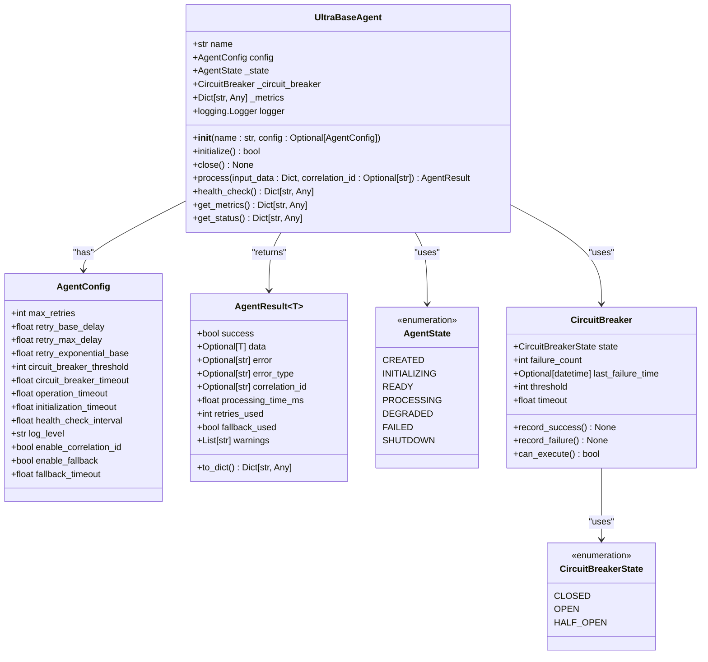

**Diagram sources**
- [mahoun/agents/base_agent.py](file://mahoun/agents/base_agent.py#L1-L576)

**Section sources**
- [mahoun/agents/base_agent.py](file://mahoun/agents/base_agent.py#L1-L576)

## Agent Factory and Initialization

Agents are created and managed through factory patterns that provide centralized control and lifecycle management. The system includes both a legacy `AgentFactory` and an enhanced `UltraAgentFactory` for creating Ultra agents with additional enterprise features.

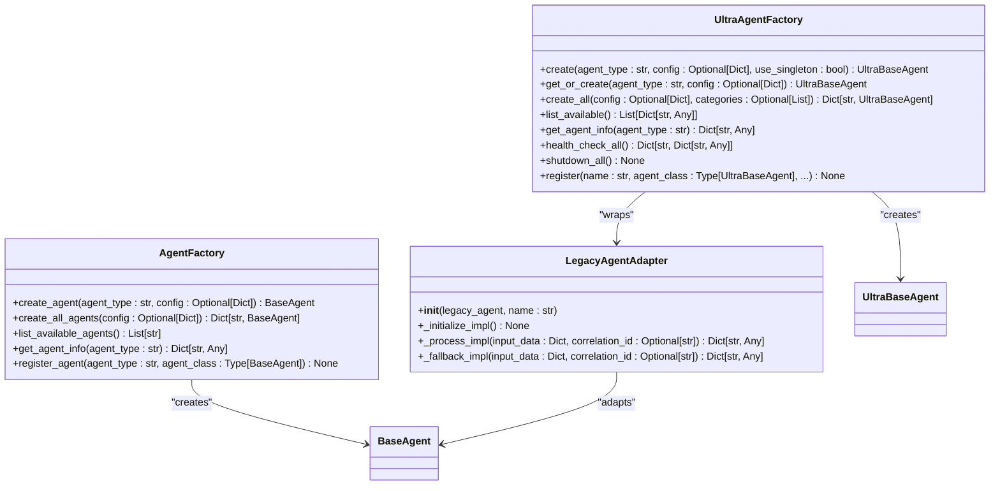

**Diagram sources**
- [mahoun/agents/factory.py](file://mahoun/agents/factory.py#L1-L182)
- [mahoun/agents/ultra_factory.py](file://mahoun/agents/ultra_factory.py#L1-L590)

**Section sources**
- [mahoun/agents/factory.py](file://mahoun/agents/factory.py#L1-L182)
- [mahoun/agents/ultra_factory.py](file://mahoun/agents/ultra_factory.py#L1-L590)

## Document Parser Agent

The Document Parser Agent is responsible for extracting and processing text from various document formats, including PDF, DOCX, and images. It integrates with NER (Named Entity Recognition), legal storage, and intelligent chunking systems to provide comprehensive document analysis.

### Domain Responsibilities
- Extract text from multi-format documents (PDF, DOCX, TXT, images)
- Perform OCR (Optical Character Recognition) for scanned documents
- Apply Persian legal text normalization
- Parse verdict structure into a standardized format
- Extract legal entities using NER
- Create intelligent document chunks with coherence scoring
- Store processed documents in ChromaDB and PostgreSQL

### Interfaces and Configuration
The agent uses the `DocParserConfig` class for configuration, which extends the base `AgentConfig`.

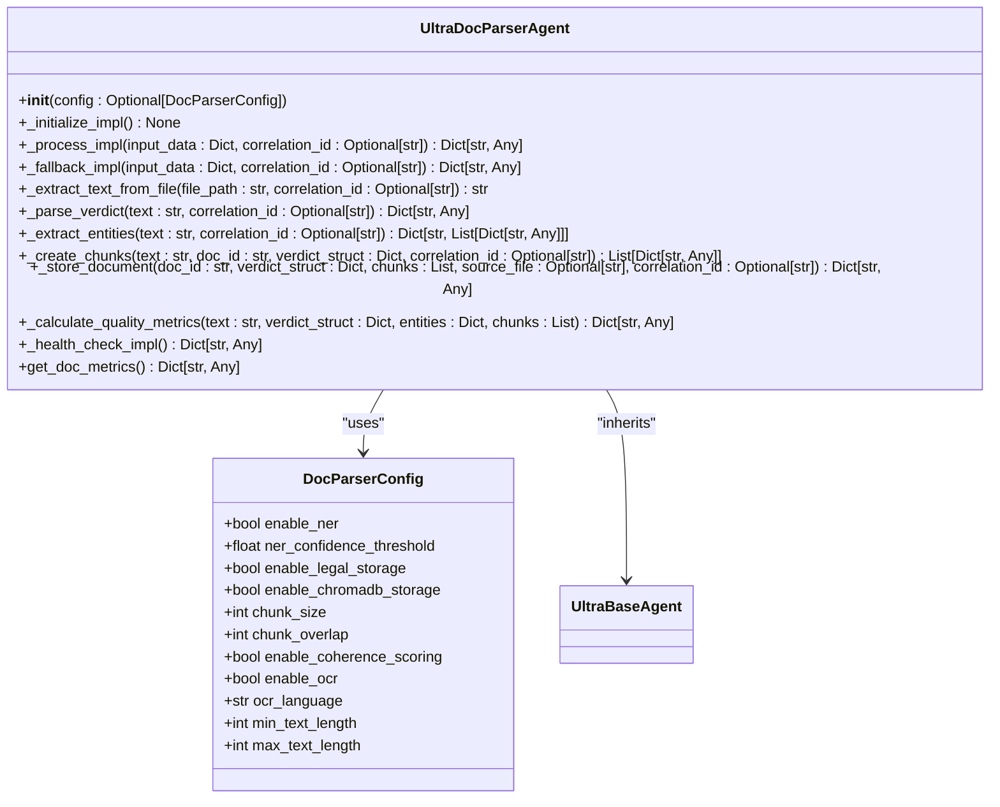

**Diagram sources**
- [mahoun/agents/doc_parser_agent.py](file://mahoun/agents/doc_parser_agent.py#L1-L566)

**Section sources**
- [mahoun/agents/doc_parser_agent.py](file://mahoun/agents/doc_parser_agent.py#L1-L566)

### Input/Output Schema
**Input Schema:**
```json
{
  "text": "string (optional)",
  "file_path": "string (optional)",
  "doc_id": "string (optional)",
  "doc_type": "string (optional)",
  "metadata": "object (optional)",
  "skip_storage": "boolean (optional)",
  "skip_ner": "boolean (optional)"
}
```

**Output Schema:**
```json
{
  "doc_id": "string",
  "doc_type": "string",
  "verdict_struct": "object",
  "entities": "object",
  "chunks": "array",
  "chunks_count": "integer",
  "storage_result": "object",
  "quality_metrics": "object",
  "processing_time_ms": "number",
  "metadata": "object"
}
```

### Core System Interactions
- **Knowledge Graph**: Entities extracted by NER are used to build and enrich the knowledge graph.
- **RAG System**: Document chunks are indexed in the vector store for retrieval.
- **LLM Router**: The agent uses the LLM router for text processing and entity extraction.

### Example Usage
```python
from mahoun.agents import UltraAgentFactory

# Create and initialize the agent
agent = await UltraAgentFactory.create("doc_parser")

# Process a document
result = await agent.process({
    "file_path": "/path/to/document.pdf",
    "doc_type": "verdict"
})
```

## Contract Agent

The Contract Agent specializes in analyzing contract clauses, answering contractual questions, and providing risk assessments. It uses chain-of-thought reasoning and NLI (Natural Language Inference) verification to ensure accurate and reliable responses.

### Domain Responsibilities
- Analyze contract clauses for risk and compliance
- Answer complex contractual questions using multi-step reasoning
- Verify answers using NLI (Natural Language Inference)
- Provide confidence calibration and citation tracking
- Perform clause-level risk scoring and recommendations

### Interfaces and Configuration
The agent uses the `ContractAgentConfig` class for configuration, which includes settings for reasoning, verification, and clause analysis.

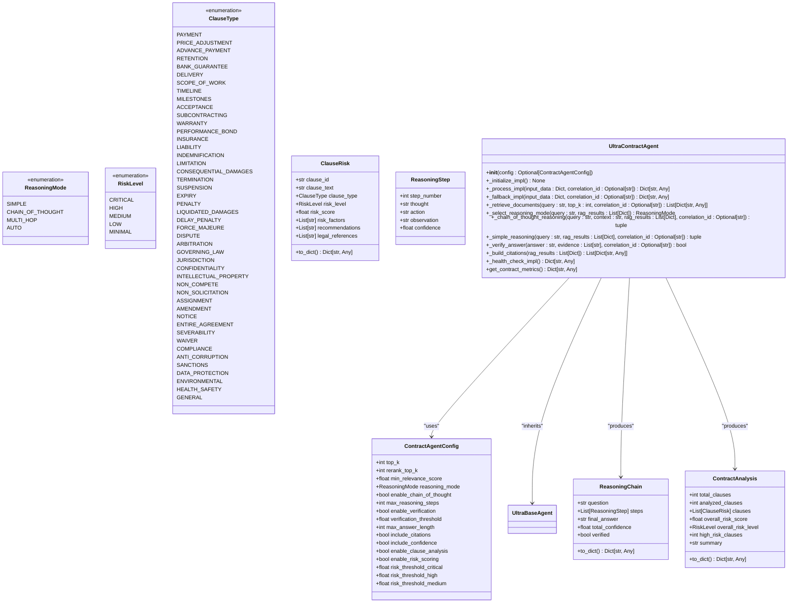

**Diagram sources**
- [mahoun/agents/contract_agent.py](file://mahoun/agents/contract_agent.py#L1-L1685)

**Section sources**
- [mahoun/agents/contract_agent.py](file://mahoun/agents/contract_agent.py#L1-L1685)

### Input/Output Schema
**Input Schema:**
```json
{
  "query": "string",
  "context": "string (optional)",
  "top_k": "integer (optional)",
  "reasoning_mode": "string (optional)",
  "skip_verification": "boolean (optional)"
}
```

**Output Schema:**
```json
{
  "answer": "string",
  "confidence": "number",
  "verified": "boolean",
  "reasoning_chain": "object",
  "citations": "array",
  "metadata": "object"
}
```

### Core System Interactions
- **Knowledge Graph**: Contract clauses and relationships are stored and queried from the knowledge graph.
- **RAG System**: The agent uses the hybrid RAG service for retrieving relevant contract clauses and legal precedents.
- **LLM Router**: The reasoning service uses the LLM router for chain-of-thought reasoning.

### Example Usage
```python
from mahoun.agents import UltraAgentFactory

# Create and initialize the agent
agent = await UltraAgentFactory.create("contract")

# Analyze a contract question
result = await agent.process({
    "query": "Is delay penalty claimable under these conditions?",
    "reasoning_mode": "cot"
})
```

## Delay Agent

The Delay Agent analyzes project delays by integrating timeline data, schedule information, and RAG results to identify, classify, and attribute delays.

### Domain Responsibilities
- Identify delays from project documents and timelines
- Classify delays by type (excusable, non-excusable, concurrent)
- Attribute responsibility for delays to parties (contractor, client, force majeure)
- Analyze impact on critical path
- Support forensic schedule analysis

### Interfaces and Configuration
The agent uses a simple configuration dictionary and integrates with existing components.

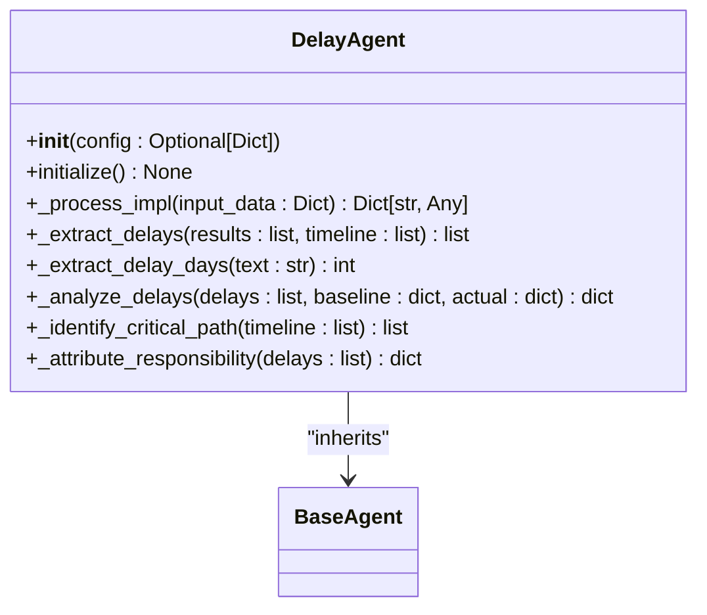

**Diagram sources**
- [mahoun/agents/delay_agent.py](file://mahoun/agents/delay_agent.py#L1-L220)

**Section sources**
- [mahoun/agents/delay_agent.py](file://mahoun/agents/delay_agent.py#L1-L220)

### Input/Output Schema
**Input Schema:**
```json
{
  "project_id": "string",
  "baseline_schedule": "object (optional)",
  "actual_schedule": "object (optional)",
  "query": "string"
}
```

**Output Schema:**
```json
{
  "delays": "array",
  "delay_analysis": "object",
  "critical_path": "array",
  "attribution": "object",
  "timeline": "array",
  "metadata": "object"
}
```

### Core System Interactions
- **Knowledge Graph**: Timeline events and dependencies are stored in the knowledge graph.
- **RAG System**: The agent uses the hybrid RAG service to search for delay-related information.
- **LLM Router**: The reasoning service is used for analyzing delay causes and impacts.

### Example Usage
```python
from mahoun.agents import AgentFactory

# Create and initialize the agent
agent = await AgentFactory.create_agent("delay")

# Analyze project delays
result = await agent.process({
    "project_id": "P12345",
    "query": "Analyze delays in project execution"
})
```

## Dispute Agent

The Dispute Agent detects and analyzes disputes, contract violations, and risks by combining RAG, reasoning, and citation extraction capabilities.

### Domain Responsibilities
- Detect disputes and contract violations
- Classify disputes by type (financial, temporal, quality, contractual)
- Score dispute severity
- Assess overall risk level
- Generate legal references and recommendations
- Extract related clauses for backward compatibility

### Interfaces and Configuration
The agent uses a simple configuration dictionary and integrates with multiple components.

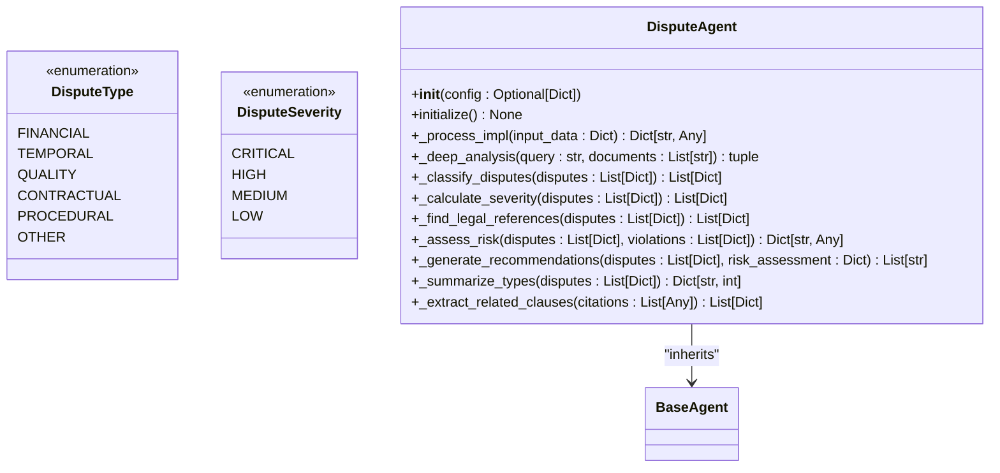

**Diagram sources**
- [mahoun/agents/dispute_agent.py](file://mahoun/agents/dispute_agent.py#L1-L429)

**Section sources**
- [mahoun/agents/dispute_agent.py](file://mahoun/agents/dispute_agent.py#L1-L429)

### Input/Output Schema
**Input Schema:**
```json
{
  "query": "string",
  "documents": "array (optional)",
  "focus_areas": "array (optional)"
}
```

**Output Schema:**
```json
{
  "disputes": "array",
  "violations": "array",
  "related_clauses": "array",
  "citations": "array",
  "dispute_types": "object",
  "risk_assessment": "object",
  "legal_references": "array",
  "recommendations": "array",
  "metadata": "object"
}
```

### Core System Interactions
- **Knowledge Graph**: Dispute relationships and legal references are stored in the knowledge graph.
- **RAG System**: The agent uses the hybrid RAG service and query router for comprehensive search.
- **LLM Router**: The reasoning service is used for deep analysis of disputes.

### Example Usage
```python
from mahoun.agents import AgentFactory

# Create and initialize the agent
agent = await AgentFactory.create_agent("dispute")

# Analyze disputes
result = await agent.process({
    "query": "Identify disputes in the contract execution",
    "documents": ["doc1", "doc2"]
})
```

## Risk Assessment Agent

The Risk Assessment Agent evaluates the risk of legal claims by analyzing strengths, weaknesses, success probability, and cost-benefit analysis.

### Domain Responsibilities
- Assess strengths and weaknesses of a legal case
- Calculate success probability
- Perform cost-benefit analysis
- Generate strategic recommendations
- Integrate with dispute analysis for comprehensive risk assessment

### Interfaces and Configuration
The agent uses a simple configuration dictionary and integrates with multiple components.

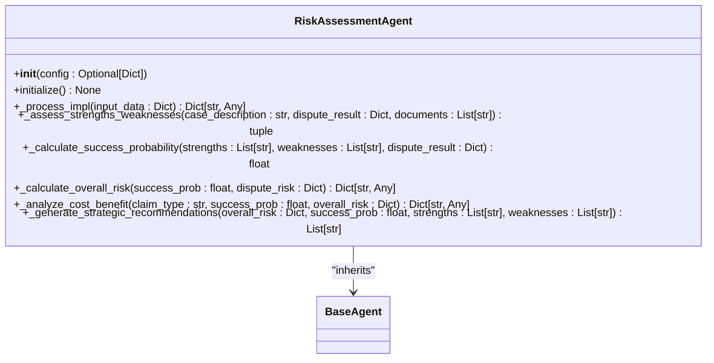

**Diagram sources**
- [mahoun/agents/risk_assessment_agent.py](file://mahoun/agents/risk_assessment_agent.py#L1-L288)

**Section sources**
- [mahoun/agents/risk_assessment_agent.py](file://mahoun/agents/risk_assessment_agent.py#L1-L288)

### Input/Output Schema
**Input Schema:**
```json
{
  "case_description": "string",
  "documents": "array",
  "claim_type": "string"
}
```

**Output Schema:**
```json
{
  "overall_risk": "object",
  "success_probability": "number",
  "strengths": "array",
  "weaknesses": "array",
  "cost_benefit": "object",
  "recommendations": "array",
  "dispute_analysis": "object",
  "metadata": "object"
}
```

### Core System Interactions
- **Knowledge Graph**: Case strengths, weaknesses, and risk factors are stored in the knowledge graph.
- **RAG System**: The agent uses the hybrid RAG service to gather relevant case information.
- **LLM Router**: The reasoning service is used for assessing strengths and weaknesses.

### Example Usage
```python
from mahoun.agents import AgentFactory

# Create and initialize the agent
agent = await AgentFactory.create_agent("risk_assessment")

# Assess risk of a claim
result = await agent.process({
    "case_description": "Claim for delay damages in construction project",
    "claim_type": "delay",
    "documents": ["contract", "correspondence"]
})
```

## Timeline Agent

The Timeline Agent extracts and analyzes temporal events from legal documents, checking for consistency and validating event sequences.

### Domain Responsibilities
- Extract dates and events from text
- Normalize Persian and Gregorian dates
- Classify event types (contractual, performance, correspondence, legal, financial)
- Check temporal consistency and detect conflicts
- Generate visual timeline support

### Interfaces and Configuration
The agent uses the `TimelineConfig` class for configuration.

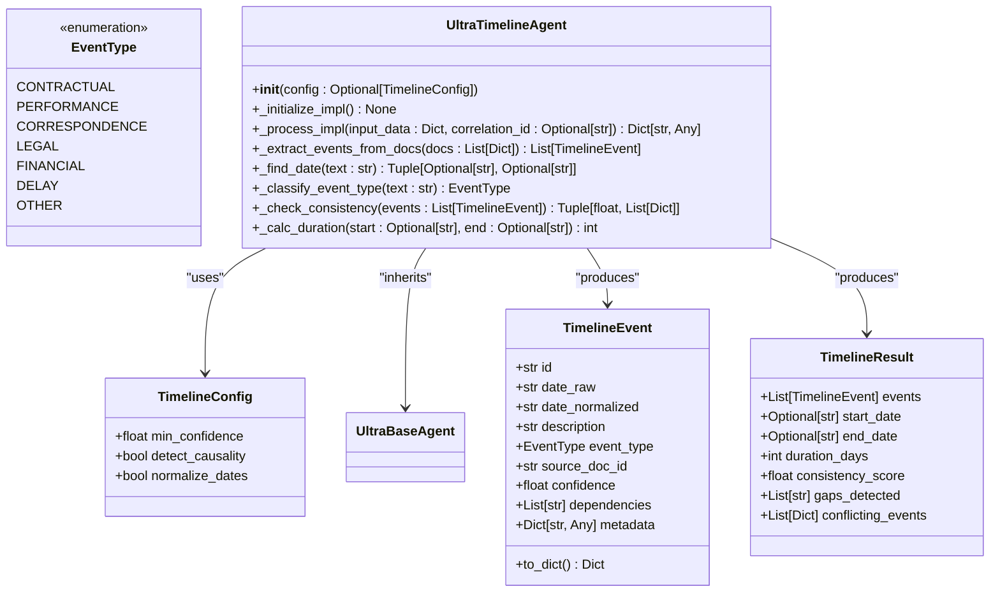

**Diagram sources**
- [mahoun/agents/ultra_timeline_agent.py](file://mahoun/agents/ultra_timeline_agent.py#L1-L290)

**Section sources**
- [mahoun/agents/ultra_timeline_agent.py](file://mahoun/agents/ultra_timeline_agent.py#L1-L290)

### Input/Output Schema
**Input Schema:**
```json
{
  "query": "string (optional)",
  "documents": "array (optional)"
}
```

**Output Schema:**
```json
{
  "timeline": "array",
  "analysis": "object"
}
```

### Core System Interactions
- **Knowledge Graph**: Temporal events and dependencies are stored as nodes and relationships.
- **RAG System**: The agent uses the hybrid RAG service to retrieve relevant documents for timeline extraction.
- **LLM Router**: The reasoning service could be used for causal link analysis.

### Example Usage
```python
from mahoun.agents import UltraAgentFactory

# Create and initialize the agent
agent = await UltraAgentFactory.create("timeline")

# Extract timeline
result = await agent.process({
    "query": "Extract all events from the contract execution"
})
```

## Legal Precedent Agent

The Legal Precedent Agent searches for similar legal cases and precedents, extracting legal principles and generating comparisons.

### Domain Responsibilities
- Search for legal precedents using semantic similarity
- Extract legal principles from precedents
- Generate case comparison analysis
- Rank precedents by relevance
- Provide recommendations based on findings

### Interfaces and Configuration
The agent uses the `PrecedentAgentConfig` class for configuration.

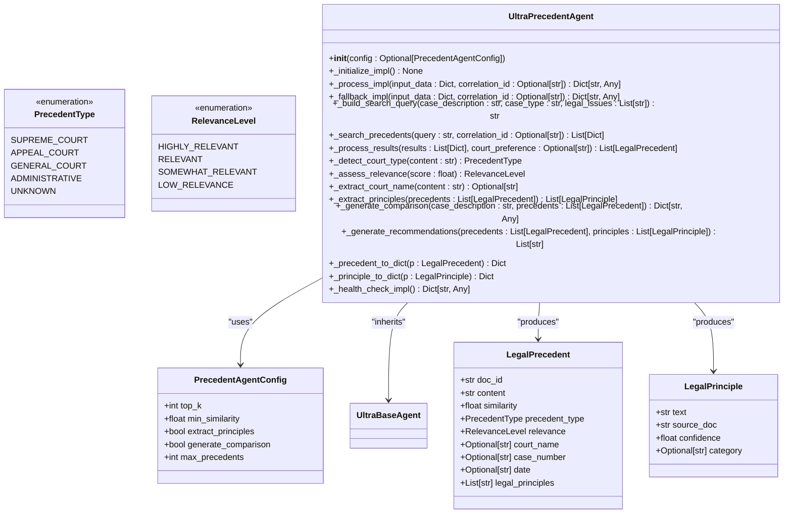

**Diagram sources**
- [mahoun/agents/ultra_precedent_agent.py](file://mahoun/agents/ultra_precedent_agent.py#L1-L445)

**Section sources**
- [mahoun/agents/ultra_precedent_agent.py](file://mahoun/agents/ultra_precedent_agent.py#L1-L445)

### Input/Output Schema
**Input Schema:**
```json
{
  "case_description": "string",
  "case_type": "string (optional)",
  "legal_issues": "array (optional)",
  "court_preference": "string (optional)"
}
```

**Output Schema:**
```json
{
  "precedents": "array",
  "legal_principles": "array",
  "comparison": "object",
  "recommendations": "array",
  "metadata": "object"
}
```

### Core System Interactions
- **Knowledge Graph**: Precedent relationships and legal principles are stored in the knowledge graph.
- **RAG System**: The agent uses the hybrid RAG service for semantic search of precedents.
- **LLM Router**: The reasoning service could be used for extracting legal principles.

### Example Usage
```python
from mahoun.agents import UltraAgentFactory

# Create and initialize the agent
agent = await UltraAgentFactory.create("precedent")

# Search for precedents
result = await agent.process({
    "case_description": "Dispute over construction delay penalties",
    "case_type": "construction",
    "legal_issues": ["delay", "penalty", "compensation"]
})
```

## Narrative Agent

The Narrative Agent generates comprehensive legal-technical narratives by integrating information from various sources and analyses.

### Domain Responsibilities
- Generate legal-technical narratives combining legal and technical aspects
- Structure narratives into sections (introduction, analysis, conclusions)
- Integrate citations from legal sources
- Use reasoning for coherent narrative generation
- Support different narrative types (legal, technical, combined)

### Interfaces and Configuration
The agent uses a simple configuration dictionary and integrates with multiple components.

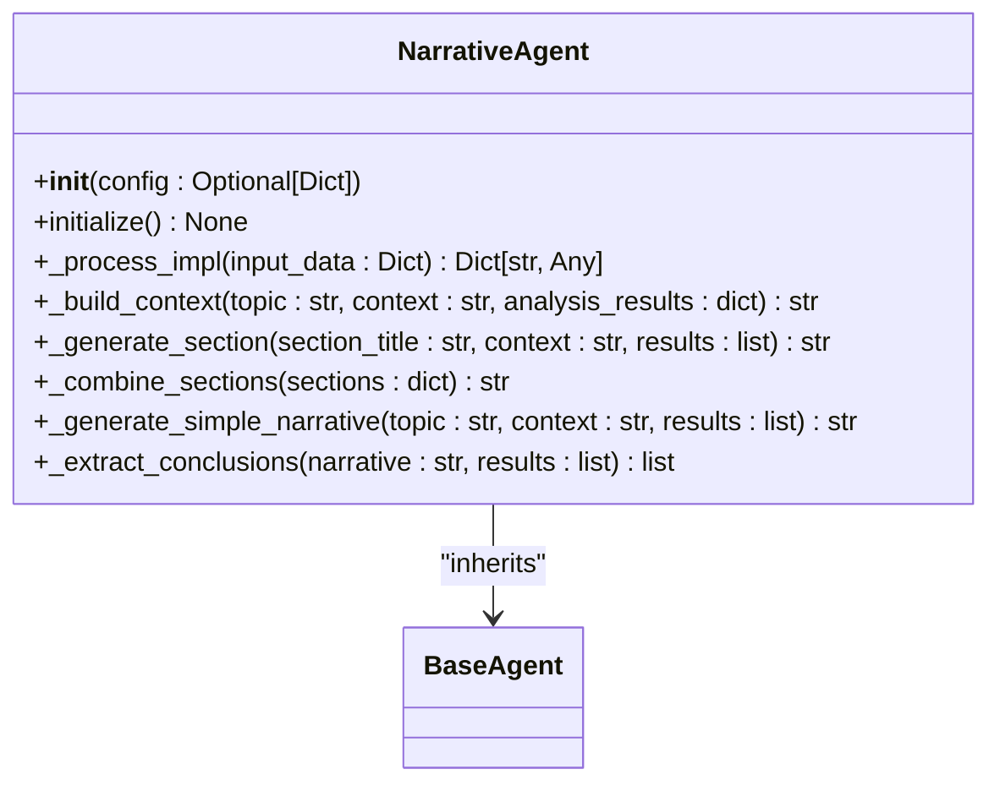

**Diagram sources**
- [mahoun/agents/narrative_agent.py](file://mahoun/agents/narrative_agent.py#L1-L225)

**Section sources**
- [mahoun/agents/narrative_agent.py](file://mahoun/agents/narrative_agent.py#L1-L225)

### Input/Output Schema
**Input Schema:**
```json
{
  "topic": "string",
  "context": "string (optional)",
  "analysis_results": "object (optional)",
  "narrative_type": "string (optional)"
}
```

**Output Schema:**
```json
{
  "narrative": "string",
  "sections": "object",
  "citations": "array",
  "conclusions": "array",
  "metadata": "object"
}
```

### Core System Interactions
- **Knowledge Graph**: Narrative elements and relationships are stored in the knowledge graph.
- **RAG System**: The agent uses the hybrid RAG service to retrieve relevant information for narrative generation.
- **LLM Router**: The reasoning service is used for generating narrative sections.

### Example Usage
```python
from mahoun.agents import AgentFactory

# Create and initialize the agent
agent = await AgentFactory.create_agent("narrative")

# Generate a narrative
result = await agent.process({
    "topic": "Analysis of construction delay claims",
    "context": "Project P12345, contract signed on 2023-01-01",
    "analysis_results": {"delays": [...], "risks": [...]}
})
```

## Critic Agent

The Critic Agent is responsible for verifying the integrity and faithfulness of responses generated by other agents. It acts as a red-teaming component to ensure the reliability of the system's outputs.

### Domain Responsibilities
- Verify the faithfulness of answers to their supporting evidence
- Detect potential hallucinations in generated responses
- Provide integrity reports for agent outputs
- Integrate with the orchestrator's integrity guard

### Interfaces and Configuration
The Critic Agent uses the base agent configuration and implements the standard processing interface.

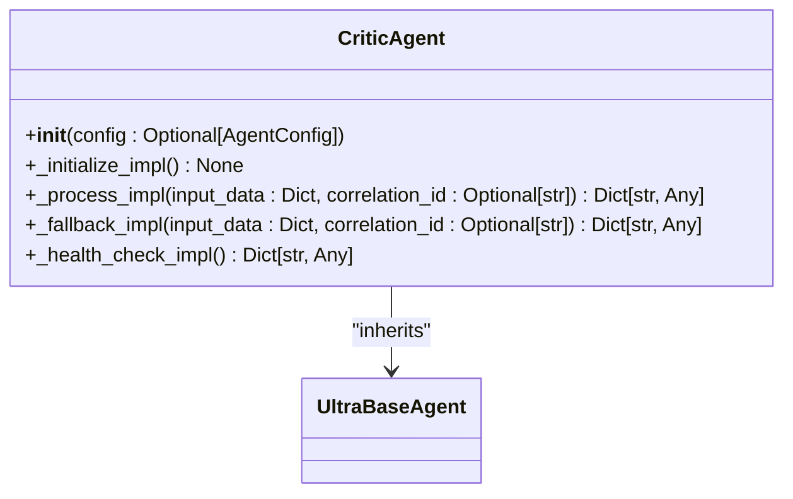

**Section sources**
- [mahoun/agents/critic_agent.py](file://mahoun/agents/critic_agent.py)

### Input/Output Schema
**Input Schema:**
```json
{
  "query": "string",
  "answer": "string",
  "context": "array"
}
```

**Output Schema:**
```json
{
  "faithfulness_score": "number",
  "integrity_report": "object",
  "warnings": "array"
}
```

### Core System Interactions
- **Knowledge Graph**: Integrity reports and verification results are stored in the knowledge graph.
- **RAG System**: The agent uses the RAG system to retrieve supporting evidence for verification.
- **LLM Router**: The agent uses the LLM router for NLI (Natural Language Inference) verification.

### Example Usage
```python
from mahoun.agents import AgentFactory

# Create and initialize the agent
agent = await AgentFactory.create_agent("critic")

# Verify an answer
result = await agent.process({
    "query": "Is the delay penalty applicable?",
    "answer": "Yes, the delay penalty is applicable according to clause 15.2.",
    "context": ["clause 15.2 text", "related correspondence"]
})
```

## Ultra Agent Variants

The MAHOUN system includes "Ultra" variants of several agents that provide enhanced capabilities with advanced features such as probabilistic modeling, graph analysis, and enterprise-grade patterns.

### Ultra Delay Agent
The Ultra Delay Agent extends the basic Delay Agent with automated delay identification, excusability analysis, concurrent delay detection, and critical path impact analysis.

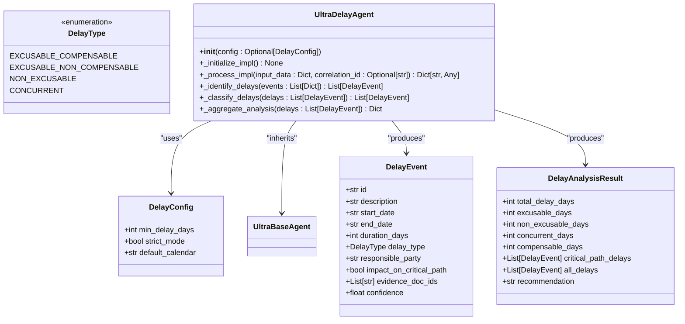

**Diagram sources**
- [mahoun/agents/ultra_delay_agent.py](file://mahoun/agents/ultra_delay_agent.py#L1-L217)

**Section sources**
- [mahoun/agents/ultra_delay_agent.py](file://mahoun/agents/ultra_delay_agent.py#L1-L217)

### Ultra Risk Assessment Agent
The Ultra Risk Assessment Agent extends the basic Risk Assessment Agent with probabilistic success estimation using Gaussian Process, uncertainty quantification, topological risk analysis using graph RAG, and Monte Carlo cost-benefit analysis.

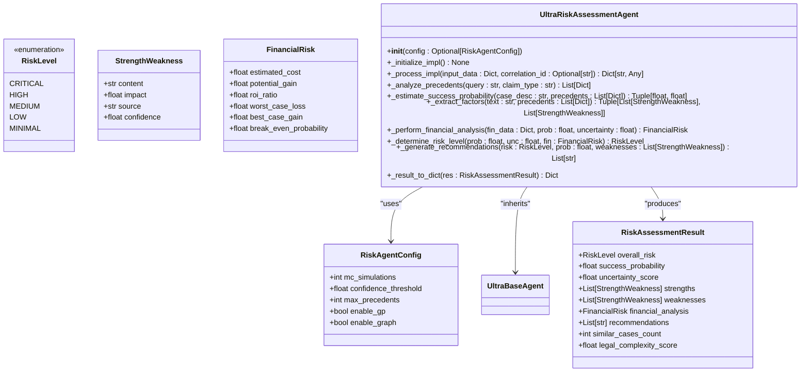

**Diagram sources**
- [mahoun/agents/ultra_risk_assessment_agent.py](file://mahoun/agents/ultra_risk_assessment_agent.py#L1-L344)

**Section sources**
- [mahoun/agents/ultra_risk_assessment_agent.py](file://mahoun/agents/ultra_risk_assessment_agent.py#L1-L344)

## Agent Orchestration

The MAHOUN system uses an orchestrator to manage complex workflows involving multiple agents. The orchestrator executes workflows as Directed Acyclic Graphs (DAGs), enabling parallel execution with dependency resolution.

### Workflow Execution
The orchestrator allows defining workflows as DAGs where nodes represent agent executions and edges represent dependencies.

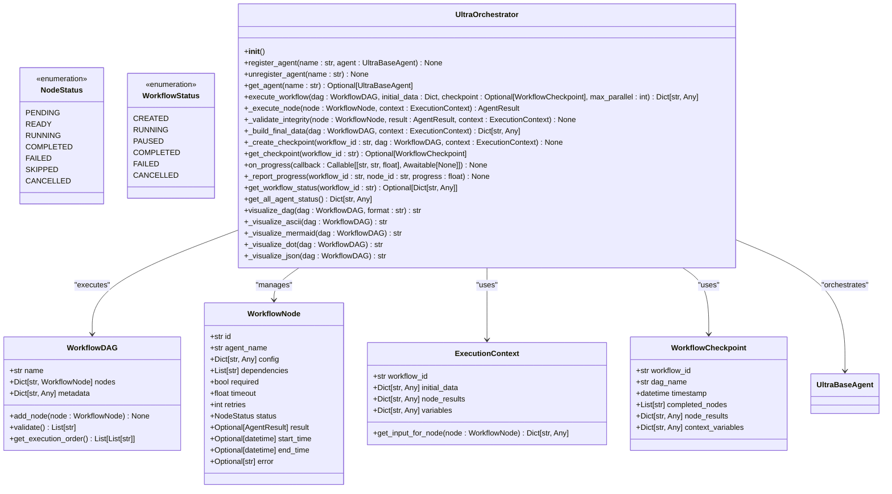

**Diagram sources**
- [mahoun/agents/orchestrator.py](file://mahoun/agents/orchestrator.py#L1-L800)

**Section sources**
- [mahoun/agents/orchestrator.py](file://mahoun/agents/orchestrator.py#L1-L800)

### Example Workflow
```python
from mahoun.agents import UltraOrchestrator, WorkflowDAG, WorkflowNode

# Create orchestrator and register agents
orchestrator = UltraOrchestrator()
orchestrator.register_agent("doc_parser", doc_parser_agent)
orchestrator.register_agent("contract", contract_agent)
orchestrator.register_agent("narrative", narrative_agent)

# Define workflow DAG
dag = WorkflowDAG(name="contract_analysis")
dag.add_node(WorkflowNode(id="parse", agent_name="doc_parser"))
dag.add_node(WorkflowNode(id="analyze", agent_name="contract", dependencies=["parse"]))
dag.add_node(WorkflowNode(id="report", agent_name="narrative", dependencies=["analyze"]))

# Execute workflow
result = await orchestrator.execute_workflow(dag, {"text": "..."})
```

## Error Handling and Performance

The MAHOUN agent system implements comprehensive error handling and performance optimization strategies to ensure reliability and efficiency.

### Error Handling
All agents inherit robust error handling from the `UltraBaseAgent` class, which includes:
- **Circuit Breaker Pattern**: Prevents cascade failures by temporarily rejecting requests when failure thresholds are exceeded.
- **Retry with Exponential Backoff**: Handles transient failures by retrying with increasing delays.
- **Graceful Degradation**: Provides fallback implementations when primary processing fails.
- **Structured Logging**: Includes correlation IDs for tracing requests across services.
- **Health Checks**: Monitors agent health and dependencies.

### Timeout Management
Each agent implements timeout management at multiple levels:
- **Operation Timeout**: Maximum time for a single processing operation.
- **Initialization Timeout**: Maximum time for agent initialization.
- **Node Timeout**: In orchestrator workflows, maximum time for individual node execution.

### Performance Optimization
Key performance optimizations include:
- **Lazy Loading**: Components are initialized only when needed.
- **Singleton Management**: Agents are reused to avoid repeated initialization.
- **Parallel Execution**: The orchestrator executes independent nodes in parallel.
- **Caching**: Results are cached where appropriate to avoid redundant processing.
- **Efficient Chunking**: Documents are intelligently chunked to balance context and processing efficiency.

### Monitoring and Metrics
All agents provide comprehensive metrics through the `get_metrics()` and `get_status()` methods, including:
- Total calls and success rate
- Processing time and throughput
- Retry and failure counts
- Fallback usage
- Custom agent-specific metrics

## Conclusion
The MAHOUN system's specialized AI agents form a comprehensive ecosystem for legal document analysis and decision support. Each agent is designed with a specific domain responsibility, from document parsing and contract analysis to delay assessment and risk evaluation. The agents are built on a robust foundation that ensures reliability, resilience, and scalability. They interact seamlessly with core systems like the knowledge graph, RAG system, and LLM router, leveraging their capabilities to provide sophisticated analysis. The use of enterprise patterns such as circuit breakers, retry mechanisms, and graceful degradation ensures high availability and fault tolerance. The orchestrator enables complex multi-agent workflows, allowing for sophisticated analysis pipelines. This documentation provides a thorough understanding of the agent types, their implementation details, and their interactions, making the system accessible to both beginners and experienced developers.