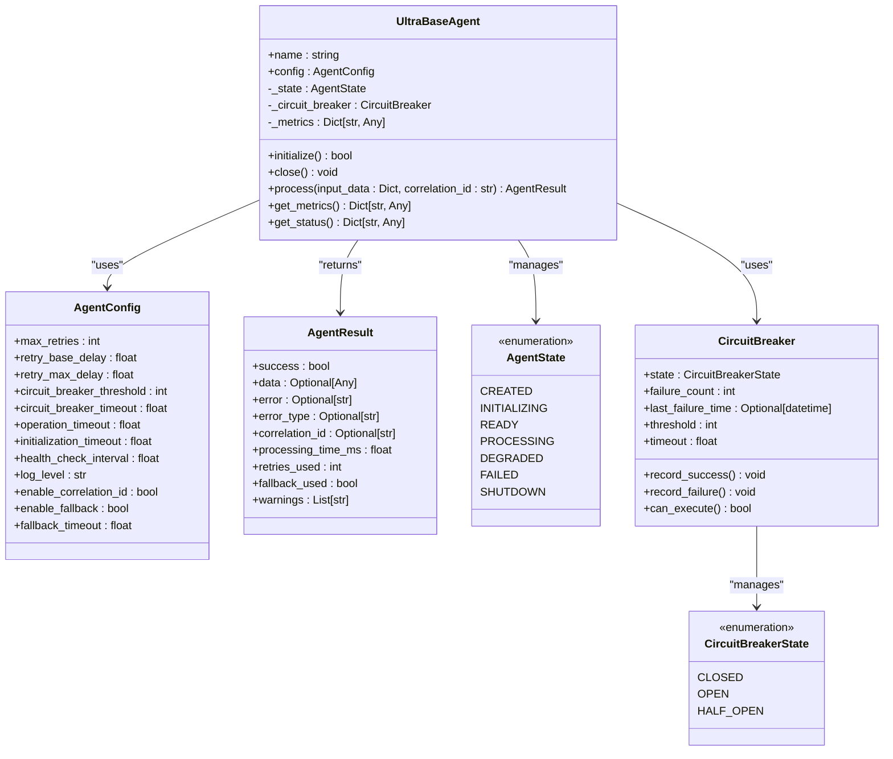
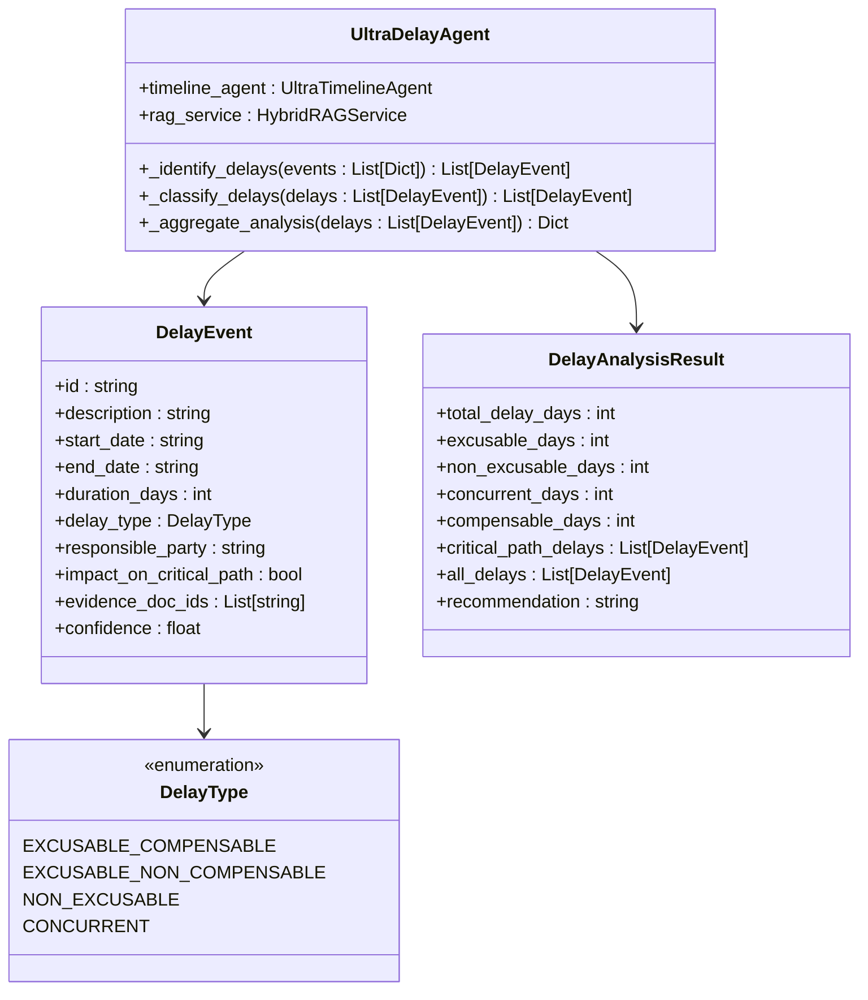
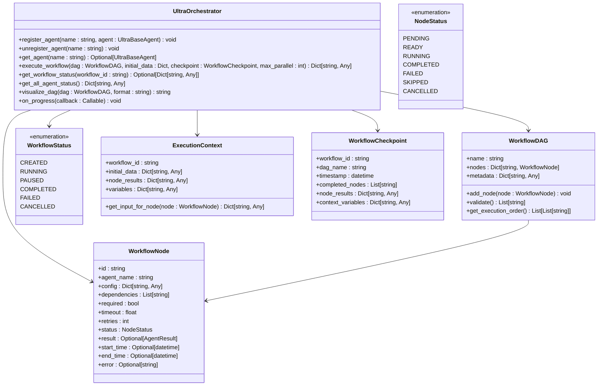

# Agent-Based Architecture

<cite>
**Referenced Files in This Document**   
- [base_agent.py](file://mahoun/agents/base_agent.py)
- [factory.py](file://mahoun/agents/factory.py)
- [ultra_factory.py](file://mahoun/agents/ultra_factory.py)
- [orchestrator.py](file://mahoun/agents/orchestrator.py)
- [doc_parser_agent.py](file://mahoun/agents/doc_parser_agent.py)
- [contract_agent.py](file://mahoun/agents/contract_agent.py)
- [delay_agent.py](file://mahoun/agents/delay_agent.py)
- [dispute_agent.py](file://mahoun/agents/dispute_agent.py)
- [ultra_delay_agent.py](file://mahoun/agents/ultra_delay_agent.py)
- [ultra_narrative_agent.py](file://mahoun/agents/ultra_narrative_agent.py)
- [ultra_precedent_agent.py](file://mahoun/agents/ultra_precedent_agent.py)
</cite>

## Table of Contents
1. [Introduction](#introduction)
2. [Core Agent Design](#core-agent-design)
3. [Specialized AI Agents](#specialized-ai-agents)
4. [Ultra Agent Variants](#ultra-agent-variants)
5. [Agent Factory Pattern](#agent-factory-pattern)
6. [Orchestration Mechanism](#orchestration-mechanism)
7. [Core System Integration](#core-system-integration)
8. [Lifecycle Management](#lifecycle-management)
9. [Performance Considerations](#performance-considerations)

## Introduction
The agent-based system is a sophisticated architecture designed for legal and contractual analysis, featuring specialized AI agents that perform distinct analytical tasks. The system is built on an enterprise-grade foundation with robust patterns for reliability, scalability, and maintainability. At its core, the architecture employs a hierarchical agent model where specialized agents inherit from a base `UltraBaseAgent` class that provides enterprise features such as circuit breakers, retry mechanisms with exponential backoff, structured logging with correlation IDs, health checks, and graceful degradation. The system supports both legacy agents and advanced "Ultra" agents, with a factory pattern for dynamic instantiation and an orchestrator for coordinating multi-agent workflows. Agents interact with core systems including a knowledge graph, RAG (Retrieval-Augmented Generation), and LLM (Large Language Model) router to deliver comprehensive analytical capabilities.

**Section sources**
- [base_agent.py](file://mahoun/agents/base_agent.py#L1-L576)

## Core Agent Design

The foundation of the agent-based system is the `UltraBaseAgent` class, which implements enterprise-grade patterns for reliability and resilience. This base class provides a comprehensive set of features including circuit breaker pattern to prevent cascade failures, retry mechanisms with exponential backoff, structured logging with correlation IDs for tracing requests across services, health check endpoints, graceful degradation with fallback mechanisms, and async context management. The agent lifecycle is managed through a state machine with states including CREATED, INITIALIZING, READY, PROCESSING, DEGRADED, FAILED, and SHUTDOWN. Each agent maintains standardized metrics such as total calls, successful calls, failed calls, retries used, fallback calls, and processing time. The base agent also implements a circuit breaker with states CLOSED (normal operation), OPEN (failing, reject requests), and HALF_OPEN (testing if recovered), which prevents overwhelming downstream services during periods of failure. The processing flow includes circuit breaker checks, initialization verification, retry loops with exponential backoff, and fallback execution if enabled and the primary processing fails.



**Diagram sources**
- [base_agent.py](file://mahoun/agents/base_agent.py#L15-L576)

## Specialized AI Agents

The system includes several specialized AI agents designed for specific analytical tasks in the legal and contractual domain. These agents inherit from the `UltraBaseAgent` class and implement domain-specific processing logic while maintaining the enterprise features provided by the base class. The specialized agents include the Document Parser Agent for processing and analyzing legal documents, the Contract Agent for contract analysis and question answering, the Delay Agent for analyzing project delays, and the Dispute Agent for detecting and analyzing disputes and contract violations. Each agent is designed to handle its specific domain with appropriate configurations, processing methods, and error handling strategies. The agents follow a consistent interface with initialization, processing, and fallback methods, ensuring uniform behavior across the system.

### Document Parser Agent
The Document Parser Agent is responsible for processing and analyzing legal documents. It extracts text from various formats including PDF, DOCX, and images (using OCR when necessary), parses the verdict structure, extracts entities using NER (Named Entity Recognition), creates intelligent chunks with coherence scoring, and stores the processed data in both ChromaDB and PostgreSQL. The agent includes quality metrics and validation to ensure processing integrity. It implements graceful degradation by providing a fallback mode that performs basic parsing when dependencies fail.

**Section sources**
- [doc_parser_agent.py](file://mahoun/agents/doc_parser_agent.py#L1-L566)

### Contract Agent
The Contract Agent performs comprehensive analysis of contracts and answers contract-related questions. It uses RAG (Retrieval-Augmented Generation) to retrieve relevant documents, applies chain-of-thought reasoning for complex queries, verifies answers using NLI (Natural Language Inference), and provides confidence calibration. The agent supports multiple reasoning modes including simple direct answers, chain-of-thought reasoning, and multi-hop retrieval. It includes features for citation tracking, clause analysis, and risk scoring with comprehensive legal taxonomy covering financial, execution, guarantee, liability, termination, penalty, legal, confidentiality, IP, and specialized clauses.

**Section sources**
- [contract_agent.py](file://mahoun/agents/contract_agent.py#L1-L1685)

### Delay Agent
The Delay Agent analyzes project delays by integrating with other components such as the HybridRAGService for document search and the TimelineAgent for timeline extraction. It identifies delays from document content, analyzes their impact on project timelines, identifies the critical path, and attributes responsibility to different parties (client, contractor, consultant). The agent uses keyword-based detection for delay identification and heuristic analysis for responsibility attribution. It provides comprehensive delay analysis including total delays, average delay duration, and comparison between baseline and actual schedules.

**Section sources**
- [delay_agent.py](file://mahoun/agents/delay_agent.py#L1-L220)

### Dispute Agent
The Dispute Agent detects and analyzes disputes, contract violations, and risks. It classifies disputes into types such as financial, temporal, quality, contractual, and procedural, and assigns severity levels (critical, high, medium, low). The agent performs risk assessment based on the number and severity of disputes and violations, identifies legal references, and generates actionable recommendations. It integrates with the RAG system for document retrieval and uses reasoning services for deep analysis of potential disputes. The agent maintains backward compatibility with previous versions by including fields like related_clauses and citations in its output.

**Section sources**
- [dispute_agent.py](file://mahoun/agents/dispute_agent.py#L1-L429)

## Ultra Agent Variants

The system includes advanced "Ultra" variants of agents that provide enhanced capabilities beyond the standard agents. These Ultra agents inherit from the same `UltraBaseAgent` foundation but implement more sophisticated analysis techniques and integrate with additional services. The Ultra agents include the UltraDelayAgent for comprehensive delay analysis, the UltraNarrativeAgent for generating legal-technical narratives, and the UltraPrecedentAgent for finding legal precedents. These agents represent the next generation of analytical capabilities in the system, offering deeper insights and more comprehensive analysis.

### Ultra Delay Agent
The Ultra Delay Agent provides enterprise-grade delay analysis with capabilities for automated delay identification, excusability and compensability analysis, concurrent delay detection, critical path impact analysis, and forensic schedule analysis support. It uses the UltraTimelineAgent to extract events and then analyzes them to determine delay types (excusable compensable, excusable non-compensable, non-excusable, or concurrent), responsible parties, and impact on the critical path. The agent provides detailed recommendations based on the analysis, such as filing a claim for compensable delays or requesting an extension of time for excusable delays.



**Diagram sources**
- [ultra_delay_agent.py](file://mahoun/agents/ultra_delay_agent.py#L1-L217)

### Ultra Narrative Agent
The Ultra Narrative Agent generates comprehensive legal-technical narratives by integrating information from multiple sources. It produces multi-section narratives with standardized structure including introduction, background, facts, analysis, legal framework, conclusions, and recommendations. The agent weaves citations from retrieved documents into the narrative and scores coherence to ensure quality. It supports different narrative types (legal, technical, combined, summary, detailed) and can generate specific sections based on requirements. The agent uses template-based structure with content generation informed by RAG results and analysis from other agents.

**Section sources**
- [ultra_narrative_agent.py](file://mahoun/agents/ultra_narrative_agent.py#L1-L406)

### Ultra Precedent Agent
The Ultra Precedent Agent searches for legal precedents and court verdicts similar to a given case. It performs semantic similarity search across a database of legal documents, extracts legal principles from precedents, compares cases, ranks precedents by relevance, and generates recommendations for legal strategy. The agent classifies precedents by court type (Supreme Court, Appeal Court, General Court, Administrative) and assesses relevance levels (highly relevant, relevant, somewhat relevant, low relevance). It provides detailed information about each precedent including similarity score, court name, case number, date, and extracted legal principles.

**Section sources**
- [ultra_precedent_agent.py](file://mahoun/agents/ultra_precedent_agent.py#L1-L445)

## Agent Factory Pattern

The system implements a factory pattern for dynamic instantiation and management of agents. Two factory implementations are provided: the standard `AgentFactory` for legacy agents and the `UltraAgentFactory` for Ultra agents. The factories provide centralized agent creation with configuration injection and lifecycle management. They support lazy loading (agents are created only when needed), singleton management (one instance per agent type), health monitoring, and graceful shutdown. The factories maintain registries of available agent types and provide methods for creating single agents, creating all registered agents, listing available agents, and retrieving agent information.

### Standard Agent Factory
The standard `AgentFactory` manages legacy agents and provides methods for creating agents by type, creating all registered agents, listing available agents, and registering new agent types. It maintains a registry that maps agent type strings to agent classes, allowing for dynamic instantiation. The factory handles configuration injection and ensures agents are properly initialized before being returned to the caller.

```mermaid
classDiagram
class AgentFactory {
+create_agent(agent_type : string, config : Dict) BaseAgent
+create_all_agents(config : Dict) Dict[string, BaseAgent]
+list_available_agents() List[string]
+get_agent_info(agent_type : string) Dict[string, Any]
+register_agent(agent_type : string, agent_class : Type) void
}
class BaseAgent {
<<abstract>>
+initialize() bool
+close() void
+process(input_data : Dict, correlation_id : str) AgentResult
}
AgentFactory --> BaseAgent : "creates"
AgentFactory : AGENT_REGISTRY : Dict[string, Type]
```

**Diagram sources**
- [factory.py](file://mahoun/agents/factory.py#L1-L182)

### Ultra Agent Factory
The `UltraAgentFactory` extends the factory pattern with enhanced capabilities for Ultra agents. It provides singleton management through a class-level instances dictionary, ensuring only one instance of each agent type exists. The factory supports thread-safe singleton access using an asyncio lock. It includes methods for health checking all instantiated agents and gracefully shutting down all agents. The factory maintains detailed registration information for each agent type, including description, category, and priority, allowing for more sophisticated agent management and discovery.

```mermaid
classDiagram
class UltraAgentFactory {
+create(agent_type : string, config : Dict, use_singleton : bool) UltraBaseAgent
+get_or_create(agent_type : string, config : Dict) UltraBaseAgent
+create_all(config : Dict, categories : List) Dict[string, UltraBaseAgent]
+list_available() List[Dict[string, Any]]
+get_agent_info(agent_type : string) Dict[string, Any]
+health_check_all() Dict[string, Dict[string, Any]]
+shutdown_all() void
+get_instance(agent_type : string) Optional[UltraBaseAgent]
+get_all_metrics() Dict[string, Dict[string, Any]]
+register(name : string, agent_class : Type, config_class : Type, description : string, category : string, priority : int) void
}
class UltraBaseAgent {
<<abstract>>
+initialize() bool
+close() void
+process(input_data : Dict, correlation_id : str) AgentResult
}
UltraAgentFactory --> UltraBaseAgent : "creates"
UltraAgentFactory : _instances : Dict[string, UltraBaseAgent]
UltraAgentFactory : _lock : asyncio.Lock
UltraAgentFactory : ULTRA_AGENT_REGISTRY : Dict[string, AgentRegistration]
```

**Diagram sources**
- [ultra_factory.py](file://mahoun/agents/ultra_factory.py#L1-L590)

## Orchestration Mechanism

The system includes an `UltraOrchestrator` that coordinates multi-agent workflows using a DAG (Directed Acyclic Graph) based execution model. The orchestrator allows for complex workflows where agents are executed in a specific order based on dependencies, with support for parallel execution of independent tasks. It provides features for checkpointing and resuming long-running workflows, real-time progress tracking, workflow visualization, and error recovery. The orchestrator manages the execution lifecycle of workflows, tracking their status and providing comprehensive monitoring capabilities.

### Workflow Execution
The orchestrator executes workflows defined as DAGs where each node represents an agent execution step. Nodes specify the agent to use, configuration parameters, dependencies (other nodes that must complete first), and execution settings such as timeout and retries. The orchestrator validates the DAG structure to ensure there are no missing dependencies or cycles before execution. It calculates the execution order as levels, where nodes in the same level can be executed in parallel since they have no dependencies on each other. The orchestrator limits parallel execution to prevent resource exhaustion and creates checkpoints after each level of execution, enabling workflow resumption if interrupted.



**Diagram sources**
- [orchestrator.py](file://mahoun/agents/orchestrator.py#L1-L985)

## Core System Integration

The agents in the system integrate with several core systems that provide foundational capabilities for AI-driven analysis. These integrations enable the agents to leverage advanced AI techniques and data management systems to deliver comprehensive analytical results. The primary integration points include the knowledge graph for structured data representation, RAG (Retrieval-Augmented Generation) for information retrieval, and the LLM (Large Language Model) router for intelligent model selection and execution.

### Knowledge Graph Integration
The system uses a knowledge graph to represent structured relationships between entities extracted from legal documents. The graph stores information about parties, contracts, clauses, events, and their interrelationships, enabling complex queries and relationship analysis. Agents can query the knowledge graph to understand context and relationships that inform their analysis. The graph is updated as new documents are processed and entities are extracted, maintaining a current representation of the legal domain.

### RAG Integration
The RAG (Retrieval-Augmented Generation) system provides agents with the ability to retrieve relevant information from a large corpus of documents before generating responses. This hybrid approach combines the precision of information retrieval with the generative capabilities of LLMs. The RAG service supports multiple retrieval modes including text-only, graph-enhanced, and hybrid search, allowing agents to select the most appropriate method for their task. The system includes reranking capabilities to improve result relevance and supports citation extraction to provide provenance for retrieved information.

### LLM Router Integration
The LLM router provides intelligent model selection and execution for agents that require generative capabilities. It uses a bandit algorithm to dynamically select the most appropriate LLM based on task requirements, model performance, and cost considerations. The router supports multiple models and providers, enabling fallback when primary models are unavailable. It includes uncertainty modeling to assess confidence in model outputs and can route requests to different models based on the assessed uncertainty level. The router also implements circuit breakers and rate limiting to protect against model service failures and abuse.

**Section sources**
- [contract_agent.py](file://mahoun/agents/contract_agent.py#L27-L31)
- [orchestrator.py](file://mahoun/agents/orchestrator.py#L25-L33)

## Lifecycle Management

The agent system implements comprehensive lifecycle management for all agents, ensuring proper initialization, execution, and shutdown. The lifecycle is managed through a state machine with well-defined states and transitions, providing visibility into the operational status of each agent. The system includes health check mechanisms, metrics collection, and error recovery strategies to maintain reliability and resilience.

### State Management
Each agent maintains its state through the `AgentState` enumeration, which includes states such as CREATED, INITIALIZING, READY, PROCESSING, DEGRADED, FAILED, and SHUTDOWN. The state transitions are managed automatically by the agent base class, with state changes occurring in response to lifecycle events. The orchestrator and factory can query agent states to make decisions about workflow execution and resource allocation.

### Health Monitoring
All agents implement health check endpoints that return comprehensive status information including the agent's state, circuit breaker state, metrics, and component health. The `UltraOrchestrator` and `UltraAgentFactory` provide methods to check the health of all registered or instantiated agents, enabling system-wide health monitoring. Health checks are performed periodically through background tasks, allowing for early detection of issues.

### Error Recovery
The system implements multiple error recovery strategies to maintain availability and reliability. The circuit breaker pattern prevents cascade failures by temporarily halting requests to failing services. Retry mechanisms with exponential backoff handle transient failures, while graceful degradation allows agents to continue operating with reduced functionality when dependencies fail. The orchestrator supports checkpointing and workflow resumption, enabling recovery from interruptions in long-running processes.

**Section sources**
- [base_agent.py](file://mahoun/agents/base_agent.py#L37-L45)
- [orchestrator.py](file://mahoun/agents/orchestrator.py#L45-L53)

## Performance Considerations

The agent-based system is designed with performance considerations for concurrent agent execution and memory isolation. The architecture supports high-throughput scenarios while maintaining resource efficiency and preventing interference between concurrent operations.

### Concurrent Execution
The `UltraOrchestrator` supports parallel execution of independent workflow nodes, with configurable limits on the number of concurrent executions to prevent resource exhaustion. The system uses asyncio for non-blocking I/O operations, allowing efficient handling of multiple concurrent requests. The agent factory implementations support lazy loading and singleton patterns to minimize memory usage and initialization overhead.

### Memory Isolation
Each agent instance maintains its own state and configuration, ensuring memory isolation between different agent instances. The system uses configuration objects that are immutable after initialization, preventing unintended state sharing. The orchestrator maintains separate execution contexts for each workflow, ensuring that data and variables do not leak between different workflow executions.

### Resource Management
The system implements resource management through configuration parameters that control execution behavior. These include timeouts for operations and initialization, limits on retries, and configuration of the circuit breaker thresholds. The agent base class includes metrics collection to monitor resource usage and performance characteristics, enabling optimization and capacity planning.

**Section sources**
- [base_agent.py](file://mahoun/agents/base_agent.py#L58-L82)
- [orchestrator.py](file://mahoun/agents/orchestrator.py#L78-L84)