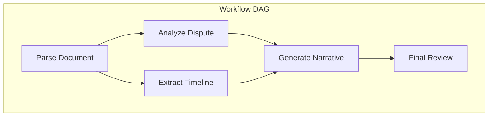
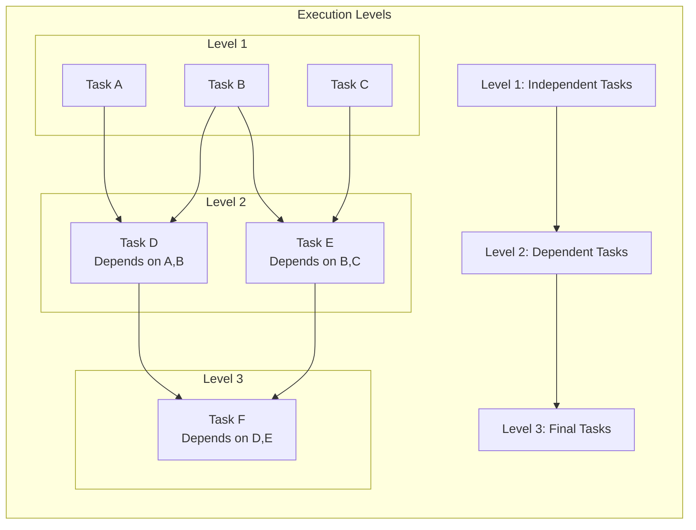
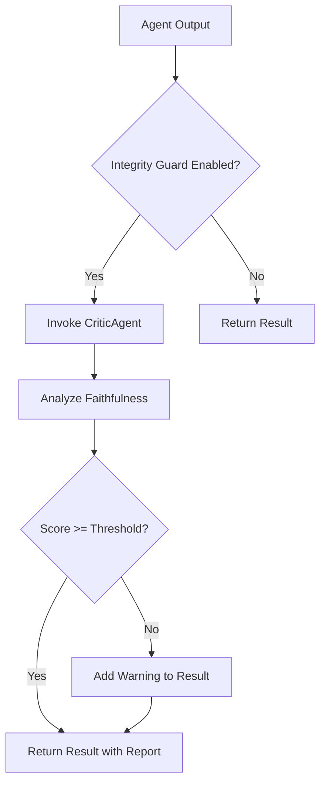

# Orchestration Mechanism

<cite>
**Referenced Files in This Document**   
- [orchestrator.py](file://mahoun/orchestrator/orchestrator.py)
- [orchestrator.py](file://mahoun/agents/orchestrator.py)
- [ultra_factory.py](file://mahoun/agents/ultra_factory.py)
- [factory.py](file://mahoun/agents/factory.py)
- [base_agent.py](file://mahoun/agents/base_agent.py)
- [demo_mvp.py](file://mahoun/orchestrator/demo_mvp.py)
- [state_machine.py](file://mahoun/orchestrator/state_machine.py)
- [runtime_profile.py](file://mahoun/orchestrator/runtime_profile.py)
- [ultra_citation_auditor.py](file://mahoun/guardrails/ultra_citation_auditor.py)
- [ultra_nli_verifier.py](file://mahoun/guardrails/ultra_nli_verifier.py)
</cite>

## Table of Contents
1. [Introduction](#introduction)
2. [UltraOrchestrator Class Implementation](#ultraorchestrator-class-implementation)
3. [DAG-Based Execution Model](#dag-based-execution-model)
4. [Dependency Resolution and Parallel Execution](#dependency-resolution-and-parallel-execution)
5. [Workflow Definition and Interfaces](#workflow-definition-and-interfaces)
6. [Integration with Agents and Factory System](#integration-with-agents-and-factory-system)
7. [API Layer Integration](#api-layer-integration)
8. [Checkpoint and Resume Functionality](#checkpoint-and-resume-functionality)
9. [Real-Time Progress Monitoring](#real-time-progress-monitoring)
10. [Integrity Guard System](#integrity-guard-system)
11. [Error Recovery and Timeout Handling](#error-recovery-and-timeout-handling)
12. [Performance Optimization](#performance-optimization)
13. [Usage Examples](#usage-examples)
14. [Conclusion](#conclusion)

## Introduction
The MAHOUN system's orchestration mechanism provides a comprehensive framework for managing complex multi-agent workflows. The UltraOrchestrator class serves as the central component for coordinating agent execution, managing dependencies, and ensuring workflow integrity. This documentation details the implementation of the orchestration system, focusing on its DAG-based execution model, dependency resolution, parallel execution capabilities, and integration with other system components. The orchestrator enables the definition and execution of sophisticated workflows that leverage various specialized agents for legal reasoning, document analysis, and decision-making. The system incorporates advanced features such as checkpoint/resume functionality, real-time progress monitoring, and integrity validation to ensure reliable and transparent operation.

## UltraOrchestrator Class Implementation
The UltraOrchestrator class implements a sophisticated workflow management system that coordinates the execution of multiple agents in a defined sequence. The orchestrator provides enterprise-grade features including DAG-based workflow execution, parallel processing with dependency resolution, checkpoint/ resume capabilities, and real-time progress tracking. The implementation follows a modular design that separates concerns between workflow management, agent coordination, and system monitoring. The orchestrator maintains a registry of available agents and manages their lifecycle, ensuring proper initialization and cleanup. It also implements comprehensive error handling with retry mechanisms and fallback strategies to enhance system resilience. The class exposes a clean API for workflow definition and execution, making it accessible to both beginners and experienced developers.

**Section sources**
- [orchestrator.py](file://mahoun/agents/orchestrator.py#L234-L674)

## DAG-Based Execution Model
The orchestration system employs a Directed Acyclic Graph (DAG) model to represent workflow dependencies and execution order. This approach allows for the definition of complex workflows where tasks have explicit dependencies that must be satisfied before execution. The WorkflowDAG class serves as the container for workflow definition, managing nodes and their interdependencies. Each node in the DAG represents a single agent execution step with defined dependencies on other nodes. The orchestrator validates the DAG structure to ensure there are no cycles and that all dependencies reference existing nodes. This validation occurs before workflow execution to prevent runtime errors. The DAG model enables sophisticated workflow patterns including fan-out/fan-in scenarios, conditional execution paths, and parallel processing of independent tasks.

**Diagram sources**
- [orchestrator.py](file://mahoun/agents/orchestrator.py#L94-L154)

## Dependency Resolution and Parallel Execution
The orchestrator implements sophisticated dependency resolution to determine the execution order of workflow nodes. The get_execution_order method analyzes the DAG structure and returns a list of execution levels, where nodes within the same level can be executed in parallel as they have no dependencies on each other. This approach maximizes parallelism while respecting dependency constraints. During execution, the orchestrator uses a semaphore to limit the maximum number of parallel tasks, preventing resource exhaustion. The system dynamically adjusts the execution plan based on completed tasks, ensuring that nodes are only executed when all their dependencies have been satisfied. This mechanism enables efficient utilization of system resources while maintaining the integrity of the workflow logic.

**Diagram sources**
- [orchestrator.py](file://mahoun/agents/orchestrator.py#L156-L190)

## Workflow Definition and Interfaces
The orchestration system provides a clear and intuitive interface for defining and executing workflows. The primary components include the WorkflowDAG for workflow structure definition, WorkflowNode for individual task specification, and ExecutionContext for managing data flow between nodes. Workflows are defined by creating a DAG instance and adding nodes with their dependencies. The execute_workflow method serves as the main entry point for workflow execution, accepting the DAG, initial data, and optional checkpoint for resuming interrupted workflows. The system supports various configuration options for individual nodes, including timeout settings, retry policies, and execution requirements. The interface is designed to be accessible to developers of all skill levels while providing the flexibility needed for complex use cases.

**Section sources**
- [orchestrator.py](file://mahoun/agents/orchestrator.py#L67-L228)

## Integration with Agents and Factory System
The orchestrator integrates seamlessly with the agent factory system to manage agent lifecycle and dependencies. The UltraAgentFactory provides a centralized mechanism for creating and managing agent instances, supporting both lazy loading and singleton patterns. When a workflow requires an agent, the orchestrator either retrieves an existing instance from the factory or creates a new one as needed. This integration ensures efficient resource utilization and consistent agent configuration across the system. The factory system also provides health monitoring and graceful shutdown capabilities for all managed agents. The orchestrator can automatically instantiate specialized agents like the CriticAgent for integrity validation when needed, demonstrating the flexibility of this integration.

**Section sources**
- [ultra_factory.py](file://mahoun/agents/ultra_factory.py#L224-L482)
- [orchestrator.py](file://mahoun/agents/orchestrator.py#L261-L275)

## API Layer Integration
The orchestration system integrates with the API layer to provide external access to workflow capabilities. The api_router module exposes endpoints for system health monitoring and metrics collection, allowing external systems to monitor the orchestrator's status. The internal health endpoint provides comprehensive information about system uptime, resource utilization, component health, and pending tasks. Metrics are exposed in both Prometheus format and JSON for integration with various monitoring systems. This integration enables real-time monitoring of orchestration activities and facilitates the development of management interfaces and alerting systems. The API layer also supports the execution of predefined workflows through dedicated endpoints, making the orchestration capabilities accessible to external applications.

**Section sources**
- [api_router.py](file://mahoun/api_router.py#L1-L84)
- [orchestrator.py](file://mahoun/agents/orchestrator.py#L261-L275)

## Checkpoint and Resume Functionality
The orchestrator implements robust checkpoint and resume functionality to support long-running workflows and ensure resilience against interruptions. The checkpoint system automatically saves workflow state after each execution level, capturing completed nodes, their results, and context variables. This allows workflows to be resumed from the last checkpoint in case of system failure or intentional pause. The _create_checkpoint method serializes the current workflow state, while get_checkpoint retrieves stored checkpoints for resumption. When resuming a workflow, the orchestrator restores the execution context and skips already completed nodes, continuing from the point of interruption. This feature is particularly valuable for complex legal analyses that may require significant processing time or human review at intermediate stages.

**Section sources**
- [orchestrator.py](file://mahoun/agents/orchestrator.py#L599-L625)

## Real-Time Progress Monitoring
The orchestration system provides comprehensive real-time progress monitoring through callback mechanisms and status reporting. The on_progress method allows clients to register asynchronous callbacks that receive progress updates during workflow execution. These callbacks receive the workflow ID, current node, and overall progress percentage, enabling the development of real-time progress indicators. The get_workflow_status method provides detailed information about the current state of any workflow, including node-level status, execution times, and error information. This monitoring capability supports both user-facing progress displays and system-level monitoring for operational oversight. The progress tracking is integrated with the checkpoint system, ensuring that progress information is preserved across workflow resumptions.

**Section sources**
- [orchestrator.py](file://mahoun/agents/orchestrator.py#L630-L674)

## Integrity Guard System
The orchestrator incorporates an advanced Integrity Guard system to validate the quality and accuracy of workflow outputs. This system leverages specialized agents like the CriticAgent to perform red-teaming on generated results, identifying potential hallucinations or factual inaccuracies. The _validate_integrity method automatically invokes the CriticAgent when enabled, analyzing the faithfulness of agent responses to their input context. The system uses a configurable threshold to determine acceptable faithfulness scores, with results below the threshold triggering warnings. The integrity validation is integrated with the agent's result structure, adding detailed integrity reports to the output. This multi-layered approach to quality assurance ensures that the system maintains high standards of accuracy and reliability in its outputs.

**Diagram sources**
- [orchestrator.py](file://mahoun/agents/orchestrator.py#L544-L582)
- [critic_agent.py](file://mahoun/agents/critic_agent.py#L96-L129)

## Error Recovery and Timeout Handling
The orchestration system implements comprehensive error recovery and timeout handling mechanisms to ensure robust operation. Each workflow node can be configured with timeout and retry parameters, allowing for graceful handling of transient failures. The _execute_node method wraps agent execution in a timeout context, automatically failing nodes that exceed their allotted time. Failed nodes are retried according to their retry configuration, with exponential backoff between attempts. The system distinguishes between required and optional nodes, allowing workflows to continue execution even if non-critical nodes fail. When all retries are exhausted, the workflow fails with detailed error information. The error handling is integrated with the circuit breaker pattern implemented in the base agent class, preventing cascade failures in case of persistent issues with specific agents.

**Section sources**
- [orchestrator.py](file://mahoun/agents/orchestrator.py#L484-L543)
- [base_agent.py](file://mahoun/agents/base_agent.py#L368-L441)

## Performance Optimization
The orchestrator incorporates several performance optimization techniques to maximize efficiency and throughput. The parallel execution model with configurable concurrency limits allows for optimal utilization of available resources without overwhelming the system. The factory system's singleton pattern reduces the overhead of agent creation and initialization. The checkpoint system minimizes redundant processing by allowing workflows to resume from intermediate states. The orchestrator also implements efficient data passing between nodes through the ExecutionContext, avoiding unnecessary data copying. The system monitors its own performance and provides metrics that can be used to identify bottlenecks and optimize workflow design. These optimizations ensure that the orchestration system can handle complex workflows efficiently, even under heavy load.

**Section sources**
- [orchestrator.py](file://mahoun/agents/orchestrator.py#L424-L432)
- [ultra_factory.py](file://mahoun/agents/ultra_factory.py#L241-L244)

## Usage Examples
The orchestration system supports various usage patterns for defining and executing workflows. A basic workflow might involve document parsing followed by dispute analysis and narrative generation. More complex workflows can incorporate conditional logic, parallel processing, and human-in-the-loop review stages. The demo_mvp.py script provides a comprehensive example of the end-to-end pipeline, demonstrating document ingestion, hybrid retrieval, reasoning, and verification. Workflows can be defined programmatically by creating DAG instances and adding nodes with their dependencies. The system also supports the execution of predefined workflows through API endpoints, enabling integration with external applications. The flexibility of the orchestration system allows it to support both simple linear workflows and complex branching structures with multiple parallel execution paths.

**Section sources**
- [demo_mvp.py](file://mahoun/orchestrator/demo_mvp.py#L50-L470)
- [orchestrator.py](file://mahoun/agents/orchestrator.py#L351-L483)

## Conclusion
The orchestration mechanism in the MAHOUN system provides a robust and flexible framework for managing complex multi-agent workflows. The UltraOrchestrator class implements a sophisticated DAG-based execution model with comprehensive dependency resolution, parallel execution capabilities, and advanced features like checkpoint/resume functionality and real-time progress monitoring. The tight integration with the agent factory system ensures efficient resource utilization and consistent agent management. The inclusion of the Integrity Guard system and comprehensive error handling mechanisms enhances the reliability and quality of workflow outputs. This orchestration system enables the development of sophisticated legal reasoning applications that can process complex documents, perform detailed analysis, and generate well-supported conclusions with transparent provenance. The design balances accessibility for beginners with the technical depth required by experienced developers, making it a powerful tool for building advanced AI applications in the legal domain.