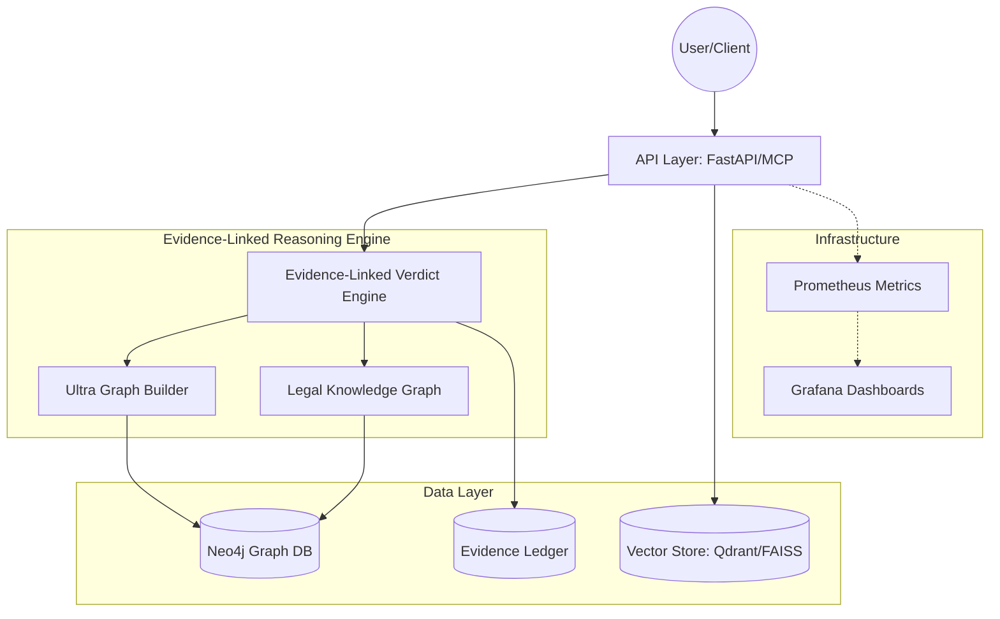
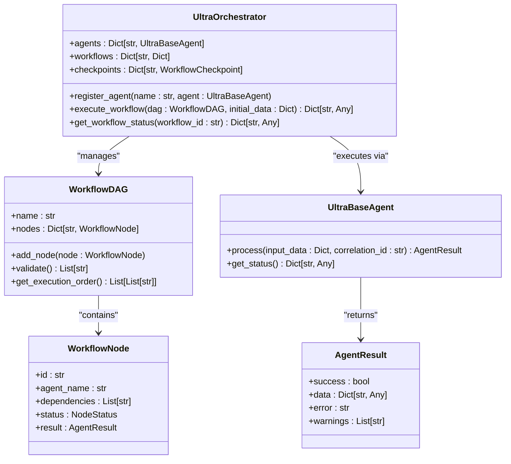
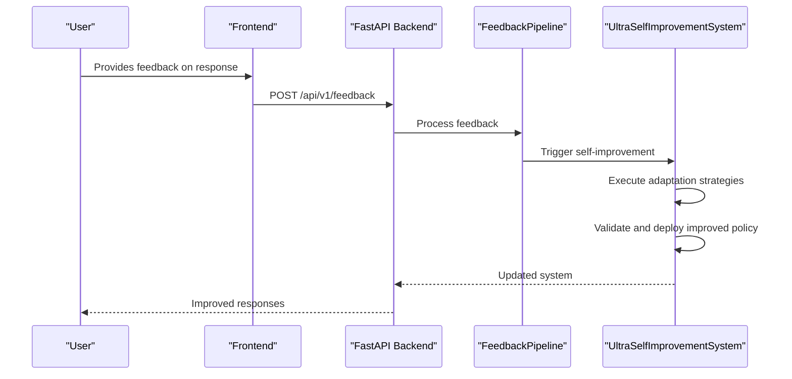
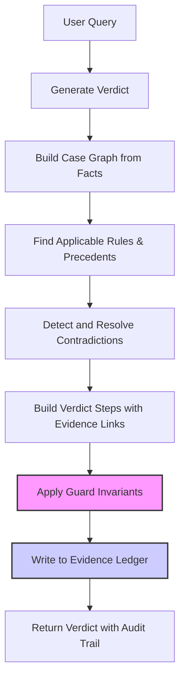
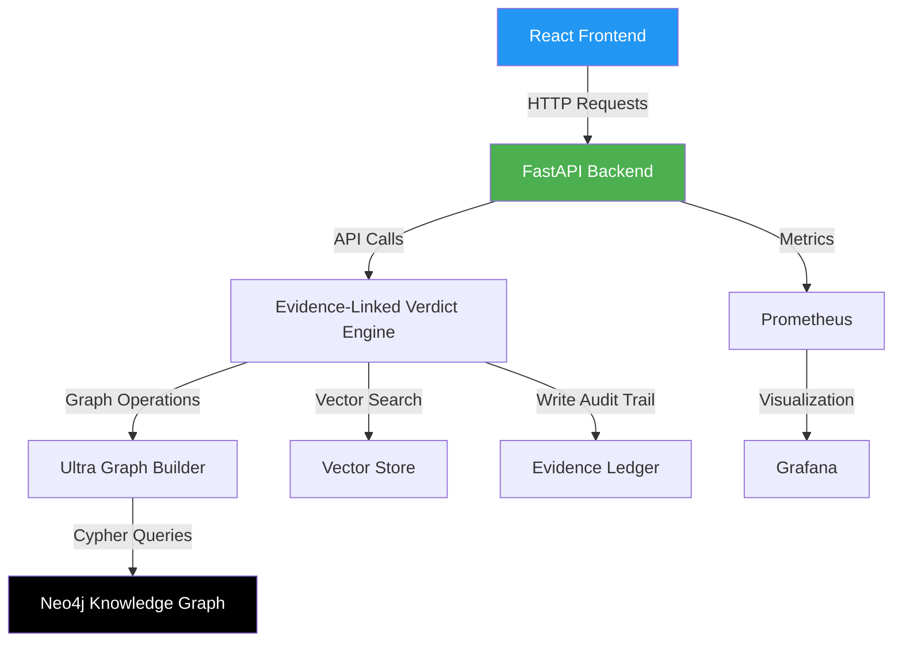
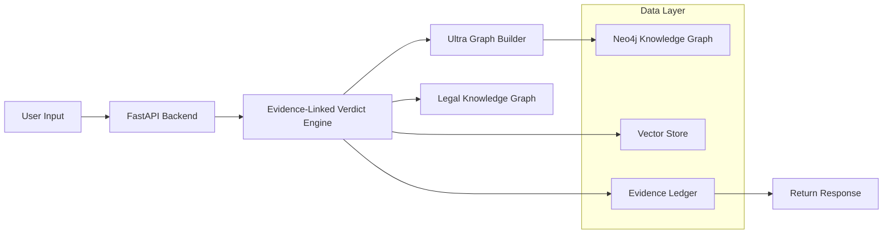
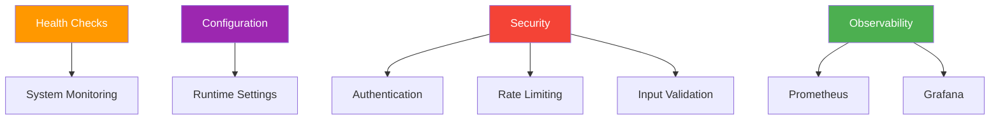

# Architecture Overview

<cite>
**Referenced Files in This Document**   
- [README.md](file://README.md)
- [docs/ARCHITECTURE.md](file://docs/ARCHITECTURE.md)
- [api/main.py](file://api/main.py)
- [frontend/src/App.tsx](file://frontend/src/App.tsx)
- [mahoun/reasoning/evidence_linked_verdict.py](file://mahoun/reasoning/evidence_linked_verdict.py)
- [mahoun/graph/ultra_graph_builder.py](file://mahoun/graph/ultra_graph_builder.py)
- [mahoun/rag/ultra_graph_rag.py](file://mahoun/rag/ultra_graph_rag.py)
- [mahoun/self_improve/ultra_self_improvement_system.py](file://mahoun/self_improve/ultra_self_improvement_system.py)
- [mahoun/graph/neo4j/connection.py](file://mahoun/graph/neo4j/connection.py)
- [mahoun/agents/orchestrator.py](file://mahoun/agents/orchestrator.py)
- [mahoun/pipelines/ingestion/enhanced_pipeline.py](file://mahoun/pipelines/ingestion/enhanced_pipeline.py)
- [mahoun/metrics/health.py](file://mahoun/metrics/health.py)
- [mahoun/self_improve/ultra_self_improvement_system.py](file://mahoun/self_improve/ultra_self_improvement_system.py)
- [mahoun/reasoning/kg_adapters.py](file://mahoun/reasoning/kg_adapters.py)
- [mahoun/pipelines/graph/entity_linker.py](file://mahoun/pipelines/graph/entity_linker.py)
- [mahoun/mcp/tools/graph.py](file://mahoun/mcp/tools/graph.py)
</cite>

## Table of Contents
1. [Introduction](#introduction)
2. [System Architecture](#system-architecture)
3. [Agent-Based Architecture](#agent-based-architecture)
4. [Self-Improvement Loop](#self-improvement-loop)
5. [Provenance Tracking](#provenance-tracking)
6. [Component Interactions](#component-interactions)
7. [Technology Stack Trade-offs](#technology-stack-trade-offs)
8. [System Context and Data Flow](#system-context-and-data-flow)
9. [Cross-Cutting Concerns](#cross-cutting-concerns)
10. [Scalability Considerations](#scalability-considerations)

## Introduction
The Mahoun platform is an audit-grade AI reasoning system designed to eliminate hallucination through graph-based evidence linking. This document provides a comprehensive architectural overview of the system, detailing its agent-based design, self-improvement mechanisms, provenance tracking, and component interactions. The architecture is built around a zero-hallucination guarantee, where every conclusion is explicitly linked to verifiable evidence in a knowledge graph. The system integrates a FastAPI backend, React frontend, Neo4j knowledge graph, and a hybrid RAG system to deliver deterministic, auditable reasoning for high-stakes domains such as healthcare, finance, and legal compliance.

**Section sources**
- [README.md](file://README.md#L1-L487)
- [docs/ARCHITECTURE.md](file://docs/ARCHITECTURE.md#L1-L83)

## System Architecture
The Mahoun platform follows a modular, layered architecture designed for auditability, scalability, and deterministic reasoning. The system is composed of four main layers: the Application Layer, the Evidence-Linked Reasoning Engine, the Data Layer, and the Infrastructure Layer. The Application Layer includes web APIs, an MCP server, and CLI tools that serve as entry points for users and clients. The Evidence-Linked Reasoning Engine is the core of the system, responsible for generating verdicts with explicit evidence links. This engine includes the Evidence-Linked Verdict Engine, the Ultra Graph Builder, and the Legal Knowledge Graph. The Data Layer consists of Neo4j for graph storage, a vector store (Qdrant/FAISS) for embeddings, and an immutable Evidence Ledger for audit trails. The Infrastructure Layer includes Prometheus for metrics collection and Grafana for monitoring dashboards, providing observability and health monitoring.

**Diagram sources** 
- [docs/ARCHITECTURE.md](file://docs/ARCHITECTURE.md#L10-L41)

**Section sources**
- [docs/ARCHITECTURE.md](file://docs/ARCHITECTURE.md#L5-L83)

## Agent-Based Architecture
The Mahoun platform employs an agent-based architecture to handle complex reasoning tasks through specialized, modular components. Agents are autonomous entities that perform specific functions such as document parsing, contract analysis, dispute extraction, and legal precedent reasoning. The UltraOrchestrator manages these agents by executing workflows defined as Directed Acyclic Graphs (DAGs), where each node represents an agent and edges represent dependencies. This design enables parallel execution of independent tasks, checkpointing for long-running workflows, and real-time progress tracking. The orchestrator also includes an Integrity Guard that uses a Critic Agent to validate the outputs of other agents, ensuring that responses are faithful to the input context and free from hallucination. Agents are registered with the orchestrator and can be dynamically created or replaced, providing flexibility and extensibility.

**Diagram sources** 
- [mahoun/agents/orchestrator.py](file://mahoun/agents/orchestrator.py#L41-L803)

**Section sources**
- [mahoun/agents/orchestrator.py](file://mahoun/agents/orchestrator.py#L1-L985)

## Self-Improvement Loop
The Mahoun platform features a sophisticated self-improvement system that continuously enhances its performance through feedback, experimentation, and optimization. The self-improvement loop is driven by user feedback, A/B testing, and policy deployment, allowing the system to adapt and improve over time. Feedback from users is collected via the `/api/v1/feedback` endpoint and processed by a FeedbackPipeline, which filters high-quality feedback for training. The system supports multiple adaptation strategies, including quantum-inspired optimization, evolutionary algorithms, and neuromorphic learning, to optimize its reasoning policies. The UltraSelfImprovementSystem coordinates these strategies, executing them in phases of exploration, exploitation, consolidation, validation, and deployment. This loop enables the platform to autonomously refine its models, improve accuracy, and maintain high performance in dynamic environments.

**Diagram sources** 
- [api/main.py](file://api/main.py#L251-L357)
- [mahoun/self_improve/ultra_self_improvement_system.py](file://mahoun/self_improve/ultra_self_improvement_system.py#L1-L2093)

**Section sources**
- [api/main.py](file://api/main.py#L251-L357)
- [mahoun/self_improve/ultra_self_improvement_system.py](file://mahoun/self_improve/ultra_self_improvement_system.py#L1-L2093)

## Provenance Tracking
Provenance tracking is a core feature of the Mahoun platform, ensuring that every decision is fully auditable and traceable to its source. The system achieves this through the Evidence-Linked Verdict Engine, which generates verdicts where every reasoning step is explicitly linked to evidence in the knowledge graph. Each verdict includes a complete audit trail with references to graph nodes, edges, rules, and precedents that support the conclusion. The Evidence Ledger, an immutable storage system, records all verdicts along with their evidence references, confidence scores, and invariant versions. This ledger enforces critical invariants such as verdict blocking (preventing publication without evidence), no resurrection (preventing excluded nodes from reappearing), and audit sufficiency (ensuring all references enable verdict invalidation). The provenance system is designed to meet regulatory requirements for transparency and accountability in high-stakes applications.

**Diagram sources** 
- [mahoun/reasoning/evidence_linked_verdict.py](file://mahoun/reasoning/evidence_linked_verdict.py#L1-L800)

**Section sources**
- [mahoun/reasoning/evidence_linked_verdict.py](file://mahoun/reasoning/evidence_linked_verdict.py#L1-L800)

## Component Interactions
The Mahoun platform's components interact through a well-defined architecture that integrates the frontend, FastAPI backend, Neo4j knowledge graph, and RAG system. The React frontend communicates with the FastAPI backend via REST APIs, sending user queries and receiving responses. The backend processes these queries by invoking the Evidence-Linked Verdict Engine, which orchestrates the reasoning process. This engine uses the Ultra Graph Builder to construct and manage the knowledge graph, which is stored in Neo4j. The RAG system enhances retrieval by combining dense, sparse, and graph-based search methods, with results re-ranked using graph analytics. The Neo4j database is accessed through a dedicated connection manager that provides connection pooling, retry logic, and health checks. These components work together to ensure that every response is grounded in verifiable evidence and delivered with high performance.

**Diagram sources** 
- [api/main.py](file://api/main.py#L1-L667)
- [frontend/src/App.tsx](file://frontend/src/App.tsx#L1-L145)
- [mahoun/graph/neo4j/connection.py](file://mahoun/graph/neo4j/connection.py#L1-L476)

**Section sources**
- [api/main.py](file://api/main.py#L1-L667)
- [frontend/src/App.tsx](file://frontend/src/App.tsx#L1-L145)
- [mahoun/graph/neo4j/connection.py](file://mahoun/graph/neo4j/connection.py#L1-L476)

## Technology Stack Trade-offs
The Mahoun platform's technology stack is carefully chosen to balance performance, reliability, and developer productivity. FastAPI is selected for the REST backend due to its high performance, automatic OpenAPI documentation, and strong typing with Pydantic, which reduces bugs and improves code quality. React is used for the frontend because of its component-based architecture, rich ecosystem, and ability to create dynamic user interfaces. Neo4j is chosen as the knowledge graph database for its native graph processing capabilities, Cypher query language, and support for complex relationships, which are essential for provenance tracking and reasoning. The RAG system combines multiple retrieval methods to maximize accuracy and coverage. These choices reflect a trade-off between cutting-edge capabilities and practical considerations such as maintainability, community support, and integration with existing tools.

**Section sources**
- [README.md](file://README.md#L463-L467)
- [docs/ARCHITECTURE.md](file://docs/ARCHITECTURE.md#L1-L83)

## System Context and Data Flow
The data flow in the Mahoun platform begins with user input from the frontend, which is sent to the FastAPI backend. The backend routes the query to the Evidence-Linked Verdict Engine, which initiates the reasoning process. The engine first builds a case graph from the input facts using the Ultra Graph Builder. It then retrieves applicable rules and precedents from the Legal Knowledge Graph, which is stored in Neo4j. The system performs a hybrid search across the vector store and knowledge graph to find relevant context. The reasoning engine applies chain-of-thought reasoning with explicit evidence links, ensuring that every step is grounded in the graph. Contradictions are detected and resolved using deterministic algorithms. The final verdict is generated with a complete audit trail and written to the Evidence Ledger before being returned to the user. This flow ensures that all responses are verifiable, auditable, and free from hallucination.

**Diagram sources** 
- [mahoun/reasoning/evidence_linked_verdict.py](file://mahoun/reasoning/evidence_linked_verdict.py#L1-L800)
- [mahoun/graph/ultra_graph_builder.py](file://mahoun/graph/ultra_graph_builder.py#L1-L842)

**Section sources**
- [mahoun/reasoning/evidence_linked_verdict.py](file://mahoun/reasoning/evidence_linked_verdict.py#L1-L800)
- [mahoun/graph/ultra_graph_builder.py](file://mahoun/graph/ultra_graph_builder.py#L1-L842)

## Cross-Cutting Concerns
The Mahoun platform addresses several cross-cutting concerns to ensure robustness, security, and maintainability. Health-first design is implemented through comprehensive health checks that monitor system components, resource usage, and metrics. The system uses a configuration-driven architecture, allowing runtime settings to be adjusted without code changes, which supports different deployment modes such as Desktop-Minimal. Security is enforced through API key authentication, rate limiting, CORS policies, and input validation. The system is designed to be resilient, with retry logic for database connections and error handling that prevents cascading failures. Observability is provided by Prometheus and Grafana, enabling real-time monitoring and alerting. These concerns are integrated throughout the architecture to ensure the platform is reliable and secure in production environments.

**Diagram sources** 
- [mahoun/metrics/health.py](file://mahoun/metrics/health.py#L1-L227)
- [api/main.py](file://api/main.py#L52-L85)

**Section sources**
- [mahoun/metrics/health.py](file://mahoun/metrics/health.py#L1-L227)
- [api/main.py](file://api/main.py#L52-L85)

## Scalability Considerations
The Mahoun platform is designed to scale to handle large document ingestion and concurrent user queries. The system uses asynchronous processing and connection pooling to maximize throughput and minimize latency. The Neo4j database is configured with a large connection pool size (50) and optimized for high-concurrency scenarios. The ingestion pipeline is enhanced with LLM-based parsing, cross-validated NER, and semantic chunking to improve accuracy and efficiency. The RAG system supports hybrid search, combining dense, sparse, and graph-based methods to balance speed and precision. The self-improvement loop allows the system to adapt to changing workloads by optimizing policies and deploying updates with minimal downtime. These scalability features ensure that the platform can grow with user demand while maintaining high performance and reliability.

**Section sources**
- [mahoun/graph/neo4j/connection.py](file://mahoun/graph/neo4j/connection.py#L69-L72)
- [mahoun/pipelines/ingestion/enhanced_pipeline.py](file://mahoun/pipelines/ingestion/enhanced_pipeline.py#L1-L376)