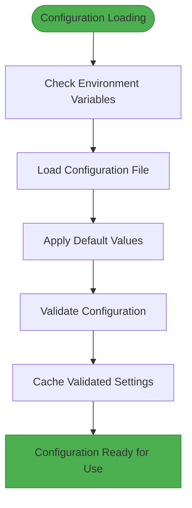
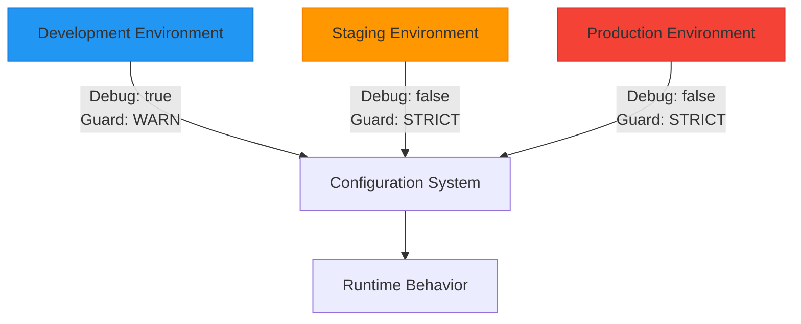
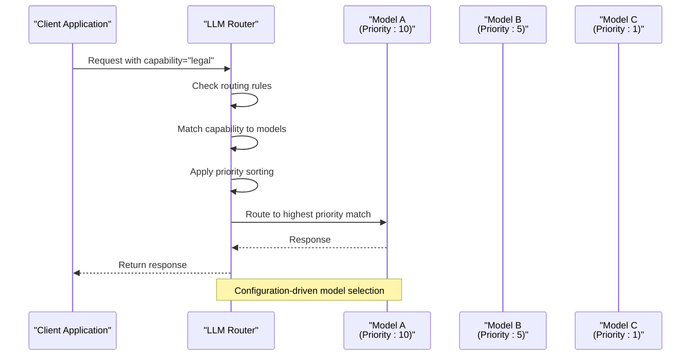
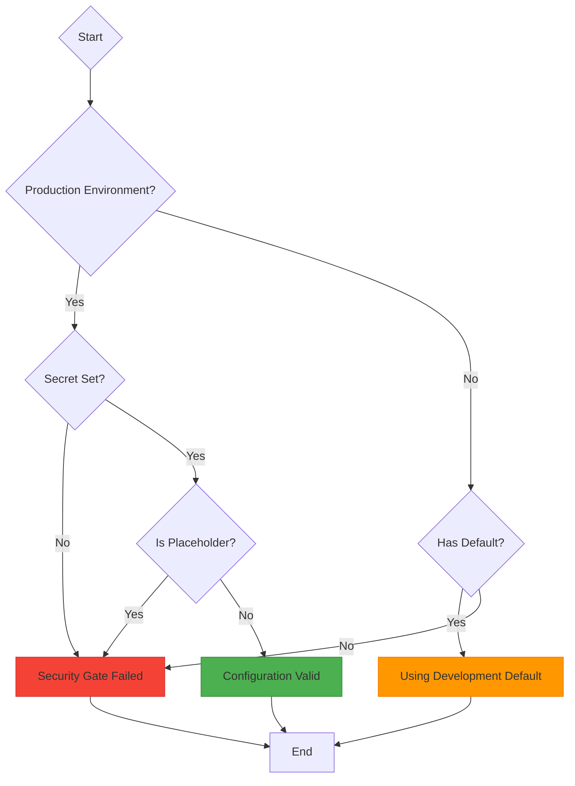

# Configuration-Driven Architecture

<cite>
**Referenced Files in This Document**   
- [runtime.json](file://config/runtime.json)
- [runtime.py](file://config/runtime.py)
- [runtime_config.py](file://mahoun/core/runtime_config.py)
- [config.py](file://mahoun/core/config.py)
- [settings.py](file://mahoun/core/settings.py)
- [secrets.py](file://mahoun/core/secrets.py)
- [paths.py](file://mahoun/core/paths.py)
- [router.py](file://mahoun/core/llm/router.py)
- [factory.py](file://mahoun/agents/factory.py)
- [validation.py](file://mahoun/core/validation.py)
- [main.py](file://api/main.py)
</cite>

## Table of Contents
1. [Introduction](#introduction)
2. [Configuration Hierarchy and Loading Mechanism](#configuration-hierarchy-and-loading-mechanism)
3. [Runtime Configuration Structure](#runtime-configuration-structure)
4. [Environment-Specific Configuration](#environment-specific-configuration)
5. [Feature Flag Implementation](#feature-flag-implementation)
6. [LLM Routing and Dynamic Model Selection](#llm-routing-and-dynamic-model-selection)
7. [Agent Behavior Configuration](#agent-behavior-configuration)
8. [Pipeline Wiring and Component Integration](#pipeline-wiring-and-component-integration)
9. [Configuration Validation and Security](#configuration-validation-and-security)
10. [Hot Reloading and Change Propagation](#hot-reloading-and-change-propagation)
11. [Versioning and Configuration Management](#versioning-and-configuration-management)
12. [Conclusion](#conclusion)

## Introduction
The Mahoun Platform employs a sophisticated configuration-driven architecture that enables dynamic control of runtime behavior through JSON configuration files and environment variables. This architecture allows for flexible deployment across different environments, dynamic feature toggling, and seamless adaptation of system behavior without requiring application restarts. The configuration system is designed with enterprise-grade principles including strict validation, hierarchical overrides, comprehensive security controls, and observability. This document details how configuration controls agent behavior, LLM routing, pipeline wiring, and other critical system components, providing a comprehensive understanding of the platform's configuration model.

## Configuration Hierarchy and Loading Mechanism

The configuration system implements a hierarchical loading mechanism with multiple layers of precedence, ensuring flexibility while maintaining security and consistency. The hierarchy follows the principle of "environment variables override configuration files, which override defaults," providing maximum control at deployment time.

The system uses a multi-layered approach to configuration loading, with different components handling various aspects of the configuration. The primary configuration loader is implemented in `mahoun/core/config.py` using Pydantic Settings V2, which provides robust validation and type safety. This loader reads from environment variables prefixed with `MAHOUN_`, configuration files, and sensible defaults.



**Diagram sources**
- [config.py](file://mahoun/core/config.py#L183-L857)

**Section sources**
- [config.py](file://mahoun/core/config.py#L1-L857)
- [runtime.py](file://config/runtime.py#L1-L43)

## Runtime Configuration Structure

The runtime configuration is structured as a comprehensive JSON document that defines all aspects of system behavior. The primary configuration file `runtime.json` contains sections for environment settings, feature flags, LLM configuration, retrieval parameters, reasoning capabilities, storage locations, database connections, API settings, and observability options.

The configuration structure is designed to be both human-readable and machine-processable, with clear separation of concerns between different system components. Each section of the configuration serves a specific purpose:

```json
{
  "environment": {
    "mode": "${MAHOUN_ENV:-dev}",
    "debug": "${MAHOUN_DEBUG:-false}",
    "guard_mode": "${MAHOUN_GUARD_MODE:-STRICT}"
  },
  "features": {
    "graph_enabled": "${MAHOUN_ENABLE_GRAPH:-true}",
    "rag_enabled": "${MAHOUN_ENABLE_RAG:-true}",
    "self_improvement_enabled": "${MAHOUN_ENABLE_SELF_IMPROVEMENT:-false}",
    "lora_enabled": false
  },
  "llm": {
    "provider": "${MAHOUN_LLM_PROVIDER:-local}",
    "model_dir": "${MAHOUN_MODEL_DIR:-./models}",
    "default_model": "${MAHOUN_LLM_DEFAULT_MODEL:-}",
    "timeout": "${MAHOUN_LLM_TIMEOUT:-30}",
    "max_retries": "${MAHOUN_LLM_MAX_RETRIES:-3}",
    "max_tokens": 2048,
    "temperature": 0.4,
    "use_gpu": "${MAHOUN_USE_GPU:-false}",
    "gpu_memory_fraction": 0.8
  }
}
```

This structure allows for fine-grained control over system behavior, with each component able to access only the configuration parameters relevant to its operation. The use of environment variable substitution (e.g., `${MAHOUN_ENV:-dev}`) enables dynamic configuration based on deployment environment.

**Section sources**
- [runtime.json](file://config/runtime.json#L1-L89)
- [runtime.py](file://config/runtime.py#L6-L42)

## Environment-Specific Configuration

The platform supports multiple deployment environments (development, staging, production) with distinct configuration requirements for each. Environment-specific settings are controlled primarily through the `MAHOUN_ENV` environment variable, which determines the operational mode of the system.

Different environments have different security and performance characteristics:

- **Development**: Permissive settings, default passwords allowed, debug mode enabled
- **Staging**: Strict security requirements, no default passwords, limited debug information
- **Production**: Maximum security, mandatory secrets, disabled debug mode

The configuration system enforces environment-specific rules through validation constraints in the `MahounSettings` class. For example, in production environments, the system validates that:
- Debug mode is disabled
- Guard mode is not set to OFF
- Ledger backend is not set to noop
- Required API keys are present for remote LLM providers



**Diagram sources**
- [config.py](file://mahoun/core/config.py#L500-L530)
- [secrets.py](file://mahoun/core/secrets.py#L65-L68)

**Section sources**
- [config.py](file://mahoun/core/config.py#L200-L203)
- [secrets.py](file://mahoun/core/secrets.py#L55-L68)

## Feature Flag Implementation

Feature flags are implemented as boolean configuration options that enable or disable specific platform capabilities. This allows for gradual rollout of new features, A/B testing, and easy toggling of experimental functionality without code changes or deployments.

The primary feature flags include:
- `graph_enabled`: Controls knowledge graph functionality
- `rag_enabled`: Enables or disables RAG (Retrieval-Augmented Generation) capabilities
- `self_improvement_enabled`: Toggles the self-improvement system
- `lora_enabled`: Controls LoRA (Low-Rank Adaptation) training capabilities

These flags are consumed by various components throughout the system to conditionally enable functionality. For example, the agent factory checks the `graph_enabled` flag before creating graph-dependent agents, and the LLM router considers the `self_improvement_enabled` flag when determining routing strategies.

The feature flag system is designed to fail gracefully when disabled, ensuring that the core functionality remains available even when advanced features are turned off. This approach supports the platform's goal of being deployable in resource-constrained environments while still providing full capabilities when resources are available.

**Section sources**
- [runtime.json](file://config/runtime.json#L11-L15)
- [config.py](file://mahoun/core/config.py#L409-L423)

## LLM Routing and Dynamic Model Selection

The LLM routing system is a sophisticated component that uses configuration data to determine which language model should handle each request. The router implements multiple strategies for model selection, including priority-based routing, capability matching, cost-aware routing, and latency-based selection.

The configuration defines a list of available models with their capabilities, priorities, and provider information. The router uses this information to make intelligent decisions about model selection based on the specific requirements of each request.



**Diagram sources**
- [router.py](file://mahoun/core/llm/router.py#L321-L800)
- [runtime.json](file://config/runtime.json#L18-L28)

**Section sources**
- [router.py](file://mahoun/core/llm/router.py#L1-L903)
- [runtime.json](file://config/runtime.json#L18-L28)

The router also implements circuit breakers to prevent cascading failures when a model becomes unresponsive, and maintains statistics on model performance to inform future routing decisions. This creates a self-optimizing system that improves over time based on actual usage patterns.

## Agent Behavior Configuration

Agent behavior is controlled through the agent factory pattern, which uses configuration data to instantiate and configure different types of agents. The factory reads configuration parameters to determine which agents to create and how to initialize them.

The agent registry maps agent types to their corresponding classes, allowing for dynamic agent creation based on configuration:

```python
AGENT_REGISTRY: Dict[str, Type] = {
    "doc_parser": UltraDocParserAgent,
    "dispute": DisputeAgent,
    "claim": UltraClaimAgent,
    "timeline": TimelineAgent,
    "delay": DelayAgent,
    "narrative": NarrativeAgent,
    "contract": UltraContractAgent,
    "critic": CriticAgent,
}
```

Each agent type can have specific configuration parameters that control its behavior, such as processing thresholds, timeout values, and integration settings. The factory pattern allows for easy extension of the agent ecosystem without modifying core routing logic.

The configuration also controls agent execution modes, such as whether to run in synchronous or asynchronous mode, and whether to enable verbose logging for debugging purposes. This granular control enables fine-tuning of agent behavior for different use cases and performance requirements.

**Section sources**
- [factory.py](file://mahoun/agents/factory.py#L1-L182)
- [runtime_config.py](file://mahoun/core/runtime_config.py#L25-L278)

## Pipeline Wiring and Component Integration

The configuration system controls how different components are wired together into processing pipelines. This includes defining data flow between agents, specifying integration points with external services, and configuring middleware components.

Pipeline configuration is achieved through a combination of feature flags and explicit connection settings. For example, the retrieval configuration section determines whether to use BM25, dense retrieval, or graph-based retrieval, and how to fuse results from multiple sources:

```json
"retrieval": {
  "use_bm25": true,
  "use_dense": true,
  "use_graph": "${MAHOUN_ENABLE_GRAPH:-true}",
  "top_k": 10,
  "fusion_method": "rrf"
}
```

This approach allows for dynamic reconfiguration of the processing pipeline without code changes. Different deployment scenarios can use different pipeline configurations optimized for their specific requirements, such as low-latency mode for interactive applications or high-accuracy mode for analytical workloads.

The wiring system also handles error handling and fallback paths, ensuring that the pipeline can adapt to component failures or unavailability. This creates a resilient architecture that maintains functionality even when individual components are degraded or unavailable.

**Section sources**
- [runtime.json](file://config/runtime.json#L30-L36)
- [config.py](file://mahoun/core/config.py#L248-L272)

## Configuration Validation and Security

The configuration system implements comprehensive validation and security measures to ensure the integrity and safety of the platform. All configuration values are validated against strict schemas, with detailed error messages provided for invalid configurations.

Security considerations are paramount in the configuration design:

- **Secrets Management**: Sensitive values like API keys and passwords are never stored in configuration files. Instead, they are provided through environment variables and validated at runtime.
- **Production Safeguards**: The system prevents deployment with insecure defaults in production environments, requiring explicit configuration of security-critical parameters.
- **Input Sanitization**: All configuration inputs are sanitized to prevent injection attacks and other security vulnerabilities.

The `secrets.py` module implements a security gate that prevents the use of development placeholders in production environments:



**Diagram sources**
- [secrets.py](file://mahoun/core/secrets.py#L101-L163)
- [validation.py](file://mahoun/core/validation.py#L1-L451)

**Section sources**
- [secrets.py](file://mahoun/core/secrets.py#L1-L212)
- [validation.py](file://mahoun/core/validation.py#L1-L451)
- [config.py](file://mahoun/core/config.py#L500-L530)

## Hot Reloading and Change Propagation

The configuration system supports hot reloading, allowing configuration changes to propagate through the system without requiring restarts. This enables dynamic adaptation to changing conditions and immediate deployment of configuration updates.

The settings manager implements a caching mechanism with change detection:

```python
def reload_settings() -> MahounSettings:
    """Force reload settings from environment."""
    clear_settings_cache()
    return get_settings()
```

When configuration changes are detected, the system propagates these changes to all components that depend on configuration data. This is achieved through a combination of:
- Cache invalidation
- Event-driven updates
- Polling mechanisms for components that cannot receive push notifications

The hot reloading capability is particularly valuable for adjusting performance parameters, toggling features, and updating connection settings in response to operational requirements. It reduces downtime and enables more agile system management.

**Section sources**
- [config.py](file://mahoun/core/config.py#L761-L764)
- [settings.py](file://mahoun/core/settings.py#L20-L50)

## Versioning and Configuration Management

Configuration versioning is managed through a combination of schema validation, backward compatibility considerations, and change tracking. The system uses JSON Schema to validate configuration files against a defined structure, ensuring that configurations are correct before they are applied.

The configuration hash mechanism provides a way to detect changes and track configuration versions:

```python
def get_config_hash(self) -> str:
    """Get hash of current configuration for change detection."""
    config_dict = self.model_dump(exclude={'neo4j_password', 'openai_api_key', 
                                          'anthropic_api_key', 'azure_openai_api_key'})
    config_str = json.dumps(config_dict, sort_keys=True, default=str)
    return hashlib.sha256(config_str.encode()).hexdigest()[:16]
```

This hash can be used to identify configuration changes, support rollback capabilities, and correlate system behavior with specific configuration states. The system also maintains a history of configuration changes for audit purposes, supporting compliance and troubleshooting.

Configuration management best practices are enforced through the development workflow, including:
- Configuration reviews as part of pull requests
- Automated validation in CI/CD pipelines
- Environment-specific configuration templates
- Documentation of configuration options and their effects

**Section sources**
- [config.py](file://mahoun/core/config.py#L641-L646)
- [runtime.schema.json](file://config/runtime.schema.json)

## Conclusion

The configuration-driven architecture of the Mahoun Platform provides a flexible, secure, and maintainable foundation for controlling system behavior. By centralizing configuration in JSON files and environment variables, the platform achieves separation of concerns between code and configuration, enabling rapid adaptation to different deployment scenarios and operational requirements.

Key strengths of the architecture include:
- Comprehensive validation and security controls
- Hierarchical configuration with environment-specific overrides
- Dynamic feature flagging and component wiring
- Intelligent LLM routing based on capabilities and performance
- Hot reloading capabilities for zero-downtime configuration updates
- Detailed observability and change tracking

This architecture supports the platform's goals of being deployable in diverse environments, from resource-constrained desktop installations to enterprise-scale server deployments, while maintaining consistent behavior and robust security controls. The configuration system is a critical component of the platform's adaptability and resilience, enabling it to meet the complex requirements of legal technology applications.