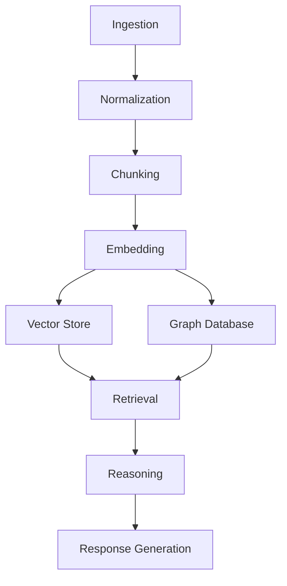
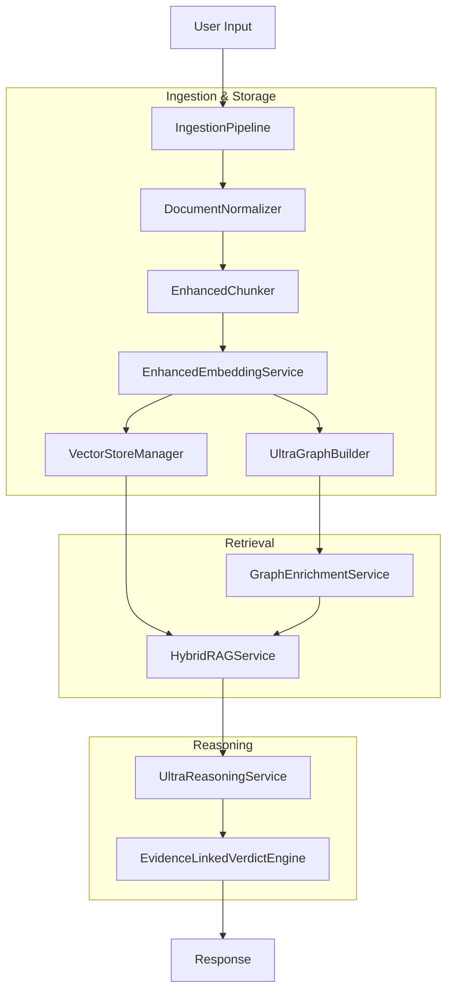
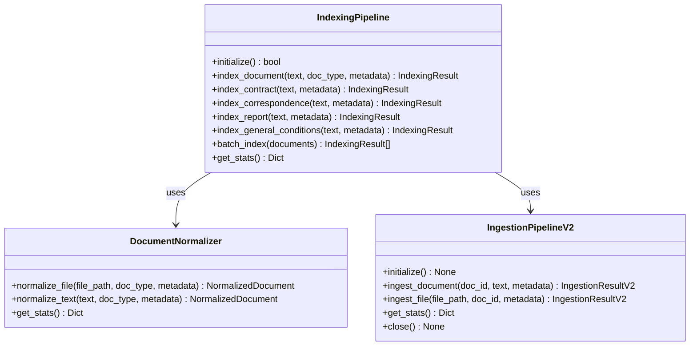
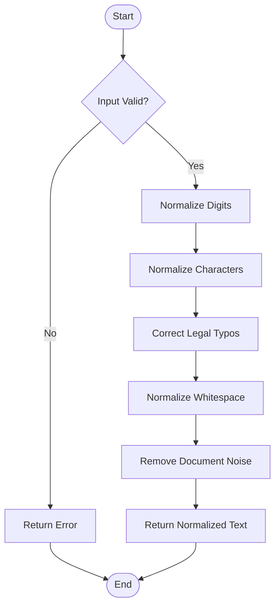
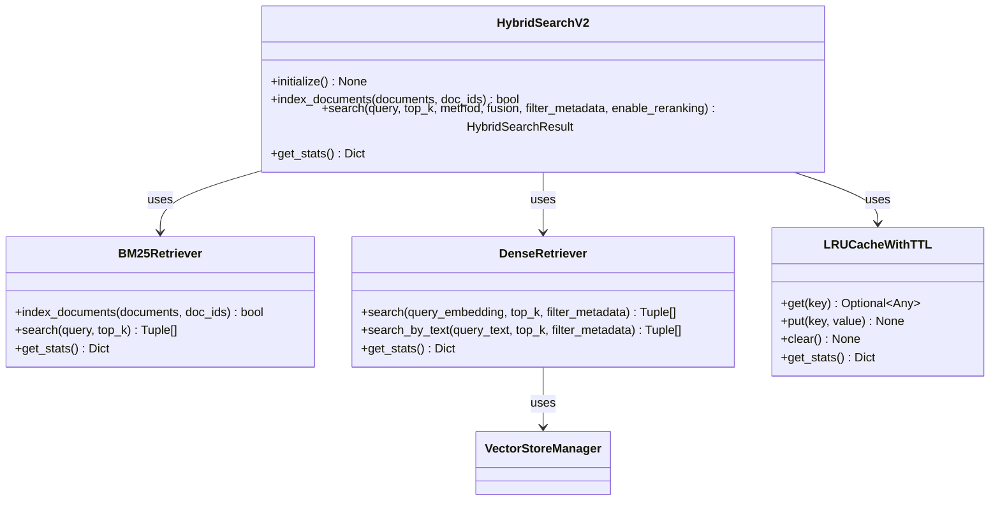
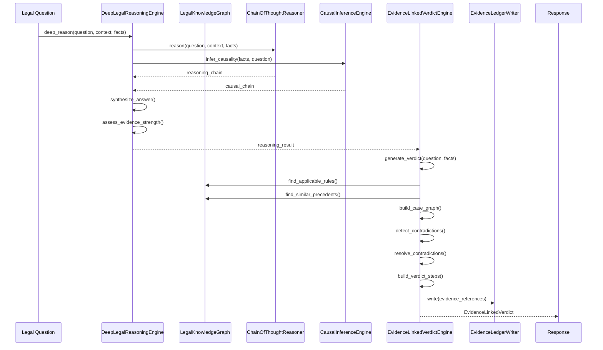

# Data Flow Pipeline

<cite>
**Referenced Files in This Document**   
- [indexing_pipeline.py](file://mahoun/rag/indexing_pipeline.py)
- [hybrid_search_v2.py](file://mahoun/retrieval/hybrid_search_v2.py)
- [reasoning_engine.py](file://mahoun/reasoning/reasoning_engine.py)
- [document_normalizer.py](file://mahoun/pipelines/ingestion/document_normalizer.py)
- [pipeline.py](file://mahoun/pipelines/ingestion/pipeline.py)
- [enhanced_chunker.py](file://mahoun/pipelines/ingestion/enhanced_chunker.py)
- [enhanced_embedding.py](file://mahoun/pipelines/ingestion/enhanced_embedding.py)
- [ultra_hybrid_search.py](file://mahoun/retrieval/ultra_hybrid_search.py)
- [evidence_linked_verdict.py](file://mahoun/reasoning/evidence_linked_verdict.py)
- [hybrid_rag_service.py](file://mahoun/rag/hybrid_rag_service.py)
- [rag_integration.py](file://mahoun/graph/services/rag_integration.py)
- [manager.py](file://mahoun/pipelines/vector_store/manager.py)
- [ultra_reasoning_service.py](file://mahoun/reasoning/ultra_reasoning_service.py)
- [persian_normalizer.py](file://mahoun/pipelines/ingestion/persian_normalizer.py)
</cite>

## Table of Contents
1. [Introduction](#introduction)
2. [Project Structure](#project-structure)
3. [Core Components](#core-components)
4. [Architecture Overview](#architecture-overview)
5. [Detailed Component Analysis](#detailed-component-analysis)
6. [Dependency Analysis](#dependency-analysis)
7. [Performance Considerations](#performance-considerations)
8. [Troubleshooting Guide](#troubleshooting-guide)
9. [Conclusion](#conclusion)

## Introduction
This document provides comprehensive architectural documentation for the end-to-end data flow pipeline of the MAHOUN system. The pipeline processes user input through ingestion, retrieval, reasoning, and response generation stages. It handles document normalization, chunking, embedding, hybrid search (BM25 + dense + graph), and evidence-based reasoning. The system is specifically designed to handle Persian content and implements robust error handling and fallback mechanisms at each processing stage. Performance optimization techniques include caching strategies and parallel processing.

## Project Structure

**Diagram sources**
- [indexing_pipeline.py](file://mahoun/rag/indexing_pipeline.py)
- [hybrid_search_v2.py](file://mahoun/retrieval/hybrid_search_v2.py)
- [reasoning_engine.py](file://mahoun/reasoning/reasoning_engine.py)

**Section sources**
- [indexing_pipeline.py](file://mahoun/rag/indexing_pipeline.py)
- [hybrid_search_v2.py](file://mahoun/retrieval/hybrid_search_v2.py)
- [reasoning_engine.py](file://mahoun/reasoning/reasoning_engine.py)

## Core Components

The MAHOUN system's data flow pipeline consists of several core components that work together to process documents and generate responses. The pipeline begins with document ingestion, where various document types are processed and normalized. The normalized documents are then chunked into smaller segments for more effective processing. These chunks are converted into embeddings using specialized models, particularly optimized for Persian content. The embeddings are stored in a vector store for efficient retrieval, while a knowledge graph is built to capture relationships between entities. During retrieval, a hybrid search approach combines BM25, dense vector search, and graph-based retrieval to find relevant information. The retrieved information is then processed by a reasoning engine that applies chain-of-thought reasoning, causal inference, and knowledge graph integration to generate evidence-based conclusions.

**Section sources**
- [indexing_pipeline.py](file://mahoun/rag/indexing_pipeline.py)
- [hybrid_search_v2.py](file://mahoun/retrieval/hybrid_search_v2.py)
- [reasoning_engine.py](file://mahoun/reasoning/reasoning_engine.py)
- [document_normalizer.py](file://mahoun/pipelines/ingestion/document_normalizer.py)
- [pipeline.py](file://mahoun/pipelines/ingestion/pipeline.py)

## Architecture Overview

**Diagram sources**
- [indexing_pipeline.py](file://mahoun/rag/indexing_pipeline.py)
- [document_normalizer.py](file://mahoun/pipelines/ingestion/document_normalizer.py)
- [enhanced_chunker.py](file://mahoun/pipelines/ingestion/enhanced_chunker.py)
- [enhanced_embedding.py](file://mahoun/pipelines/ingestion/enhanced_embedding.py)
- [manager.py](file://mahoun/pipelines/vector_store/manager.py)
- [hybrid_rag_service.py](file://mahoun/rag/hybrid_rag_service.py)
- [rag_integration.py](file://mahoun/graph/services/rag_integration.py)
- [ultra_reasoning_service.py](file://mahoun/reasoning/ultra_reasoning_service.py)
- [evidence_linked_verdict.py](file://mahoun/reasoning/evidence_linked_verdict.py)

## Detailed Component Analysis

### Ingestion Pipeline Analysis
The ingestion pipeline is responsible for processing documents from various sources and preparing them for storage and retrieval. It handles different document types including contracts, correspondence, reports, and general conditions. The pipeline normalizes document text, extracts metadata, and prepares the content for further processing.

**Diagram sources**
- [indexing_pipeline.py](file://mahoun/rag/indexing_pipeline.py)
- [document_normalizer.py](file://mahoun/pipelines/ingestion/document_normalizer.py)
- [pipeline.py](file://mahoun/pipelines/ingestion/pipeline.py)

**Section sources**
- [indexing_pipeline.py](file://mahoun/rag/indexing_pipeline.py)
- [document_normalizer.py](file://mahoun/pipelines/ingestion/document_normalizer.py)
- [pipeline.py](file://mahoun/pipelines/ingestion/pipeline.py)

### Document Normalization Process
The document normalization process ensures consistent text representation across the system, particularly important for handling Persian content with its various character and digit representations. The normalizer handles different variants of Persian and Arabic characters, digits, and common typos found in legal documents.

**Diagram sources**
- [persian_normalizer.py](file://mahoun/pipelines/ingestion/persian_normalizer.py)

**Section sources**
- [persian_normalizer.py](file://mahoun/pipelines/ingestion/persian_normalizer.py)

### Chunking and Embedding Pipeline
The chunking and embedding pipeline processes normalized documents by dividing them into manageable segments and converting them into vector representations. The enhanced chunker uses semantic boundaries to preserve context, while the embedding service selects appropriate models based on content type.

```mermaid
sequenceDiagram
participant NormalizedDoc as Normalized Document
participant Chunker as EnhancedChunker
participant Embedder as EnhancedEmbeddingService
participant VectorStore as VectorStoreManager
NormalizedDoc->>Chunker : normalize_text()
Chunker->>Chunker : detect_content_type()
Chunker->>Chunker : get_dynamic_chunk_size()
Chunker->>Chunker : enhanced_chunk()
Chunker->>Chunker : post_process_chunks()
Chunker-->>Embedder : List~Chunk~
Embedder->>Embedder : get_service()
Embedder->>Embedder : embed_texts()
Embedder-->>VectorStore : List~Embedding~
VectorStore->>VectorStore : insert()
VectorStore-->>Response : Success/Failure
```

**Diagram sources**
- [enhanced_chunker.py](file://mahoun/pipelines/ingestion/enhanced_chunker.py)
- [enhanced_embedding.py](file://mahoun/pipelines/ingestion/enhanced_embedding.py)
- [manager.py](file://mahoun/pipelines/vector_store/manager.py)

**Section sources**
- [enhanced_chunker.py](file://mahoun/pipelines/ingestion/enhanced_chunker.py)
- [enhanced_embedding.py](file://mahoun/pipelines/ingestion/enhanced_embedding.py)
- [manager.py](file://mahoun/pipelines/vector_store/manager.py)

### Hybrid Search and Retrieval System
The hybrid search system combines multiple retrieval methods to provide comprehensive results. It implements BM25 sparse retrieval, dense vector similarity search, and graph-based retrieval, with configurable fusion strategies to combine results from different methods.

**Diagram sources**
- [hybrid_search_v2.py](file://mahoun/retrieval/hybrid_search_v2.py)

**Section sources**
- [hybrid_search_v2.py](file://mahoun/retrieval/hybrid_search_v2.py)

### Reasoning and Evidence-Based Verdict System
The reasoning system combines chain-of-thought reasoning, causal inference, and knowledge graph integration to generate evidence-based verdicts. The system ensures that all conclusions are explicitly linked to graph evidence, preventing hallucination and ensuring legal accountability.

**Diagram sources**
- [reasoning_engine.py](file://mahoun/reasoning/reasoning_engine.py)
- [evidence_linked_verdict.py](file://mahoun/reasoning/evidence_linked_verdict.py)

**Section sources**
- [reasoning_engine.py](file://mahoun/reasoning/reasoning_engine.py)
- [evidence_linked_verdict.py](file://mahoun/reasoning/evidence_linked_verdict.py)

## Dependency Analysis

```mermaid
graph TD
indexing_pipeline --> document_normalizer
indexing_pipeline --> pipeline
hybrid_search_v2 --> vector_store
hybrid_search_v2 --> bm25_retriever
ultra_hybrid_search --> graph_hop
reasoning_engine --> knowledge_graph
reasoning_engine --> chain_of_thought
reasoning_engine --> causal_inference
evidence_linked_verdict --> graph_builder
evidence_linked_verdict --> knowledge_graph
evidence_linked_verdict --> ledger_writer
hybrid_rag_service --> vector_store
hybrid_rag_service --> ultra_hybrid_search
hybrid_rag_service --> graph_retriever
rag_integration --> graph_enrichment
ultra_reasoning_service --> ollama_llm
document_normalizer --> persian_normalizer
enhanced_chunker --> smart_chunker
enhanced_embedding --> embed_index
vector_store --> chromadb
vector_store --> json_backend
vector_store --> memory_backend
```

**Diagram sources**
- [indexing_pipeline.py](file://mahoun/rag/indexing_pipeline.py)
- [hybrid_search_v2.py](file://mahoun/retrieval/hybrid_search_v2.py)
- [ultra_hybrid_search.py](file://mahoun/retrieval/ultra_hybrid_search.py)
- [reasoning_engine.py](file://mahoun/reasoning/reasoning_engine.py)
- [evidence_linked_verdict.py](file://mahoun/reasoning/evidence_linked_verdict.py)
- [hybrid_rag_service.py](file://mahoun/rag/hybrid_rag_service.py)
- [rag_integration.py](file://mahoun/graph/services/rag_integration.py)
- [ultra_reasoning_service.py](file://mahoun/reasoning/ultra_reasoning_service.py)
- [document_normalizer.py](file://mahoun/pipelines/ingestion/document_normalizer.py)
- [enhanced_chunker.py](file://mahoun/pipelines/ingestion/enhanced_chunker.py)
- [enhanced_embedding.py](file://mahoun/pipelines/ingestion/enhanced_embedding.py)
- [manager.py](file://mahoun/pipelines/vector_store/manager.py)

**Section sources**
- [indexing_pipeline.py](file://mahoun/rag/indexing_pipeline.py)
- [hybrid_search_v2.py](file://mahoun/retrieval/hybrid_search_v2.py)
- [ultra_hybrid_search.py](file://mahoun/retrieval/ultra_hybrid_search.py)
- [reasoning_engine.py](file://mahoun/reasoning/reasoning_engine.py)
- [evidence_linked_verdict.py](file://mahoun/reasoning/evidence_linked_verdict.py)
- [hybrid_rag_service.py](file://mahoun/rag/hybrid_rag_service.py)
- [rag_integration.py](file://mahoun/graph/services/rag_integration.py)
- [ultra_reasoning_service.py](file://mahoun/reasoning/ultra_reasoning_service.py)
- [document_normalizer.py](file://mahoun/pipelines/ingestion/document_normalizer.py)
- [enhanced_chunker.py](file://mahoun/pipelines/ingestion/enhanced_chunker.py)
- [enhanced_embedding.py](file://mahoun/pipelines/ingestion/enhanced_embedding.py)
- [manager.py](file://mahoun/pipelines/vector_store/manager.py)

## Performance Considerations
The MAHOUN system implements several performance optimization techniques to ensure efficient processing of documents and queries. The ingestion pipeline is designed to handle documents under 1MB within 10 seconds, with a target of 500ms for documents under 10KB. The hybrid search system aims for sub-100ms response times for hybrid searches with top-10 results, and under 50ms for cached queries. Caching strategies are implemented at multiple levels, including query result caching with LRU and TTL policies. The system uses thread-safe concurrent processing to handle multiple operations in parallel, and implements graceful degradation when components fail. The vector store supports multiple backends, with ChromaDB as the primary production backend providing persistence, and fallback options including JSON-based storage and in-memory storage for development environments.

**Section sources**
- [pipeline.py](file://mahoun/pipelines/ingestion/pipeline.py)
- [hybrid_search_v2.py](file://mahoun/retrieval/hybrid_search_v2.py)
- [manager.py](file://mahoun/pipelines/vector_store/manager.py)

## Troubleshooting Guide
The system includes comprehensive error handling and fallback mechanisms at each stage of the pipeline. When a component fails, the system attempts to continue with alternative approaches or degraded functionality. For example, if the preferred embedding model is unavailable, the system falls back to a default model. If the graph database is not available, the retrieval system operates in text-only mode. The system logs detailed metrics and statistics for monitoring and debugging, including processing times, success rates, and error counts. Cache hit rates and eviction statistics are also tracked to identify potential performance issues. The logging system provides detailed information about each processing step, including normalization, chunking, embedding, and retrieval operations, which can be used to diagnose issues with specific documents or queries.

**Section sources**
- [pipeline.py](file://mahoun/pipelines/ingestion/pipeline.py)
- [hybrid_search_v2.py](file://mahoun/retrieval/hybrid_search_v2.py)
- [ultra_hybrid_search.py](file://mahoun/retrieval/ultra_hybrid_search.py)
- [hybrid_rag_service.py](file://mahoun/rag/hybrid_rag_service.py)

## Conclusion
The MAHOUN system's data flow pipeline provides a comprehensive solution for processing legal documents and generating evidence-based responses. The pipeline handles document ingestion, normalization, chunking, embedding, and storage in both vector and graph databases. The hybrid retrieval system combines multiple search methods to find relevant information, while the reasoning engine applies advanced techniques like chain-of-thought reasoning and causal inference to generate well-supported conclusions. The system is specifically designed to handle Persian content, with specialized normalization for Persian legal documents. Performance optimizations include caching, parallel processing, and efficient data structures. The architecture includes robust error handling and fallback mechanisms to ensure reliability, and comprehensive logging and monitoring for troubleshooting and optimization.