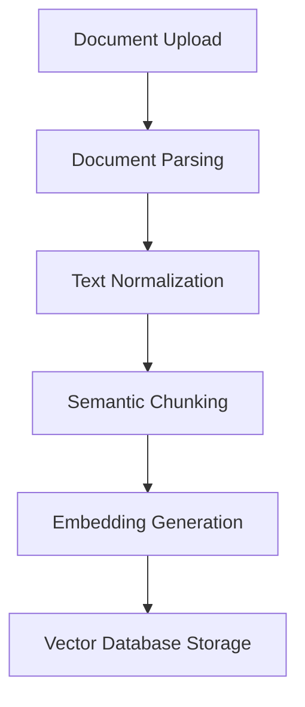
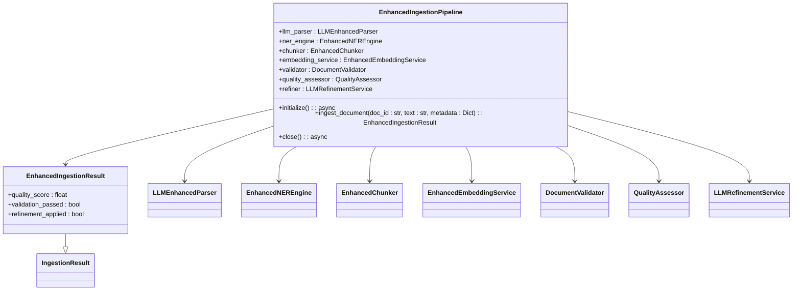
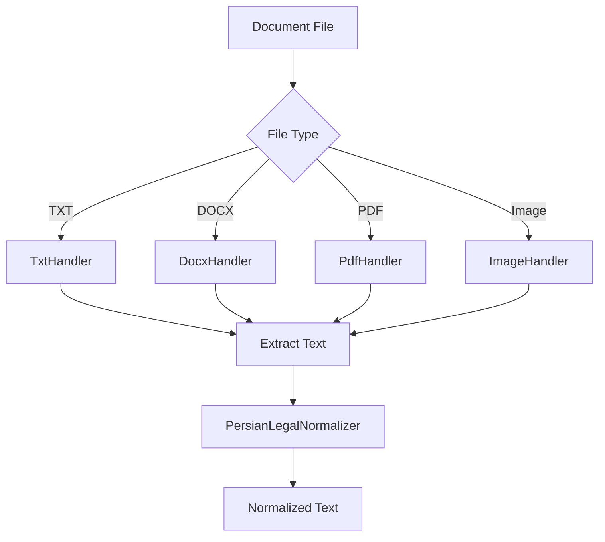
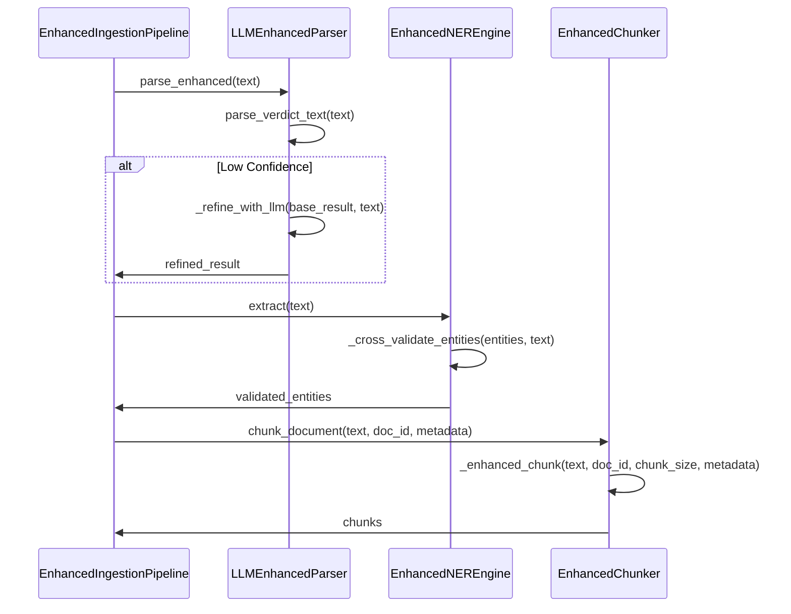
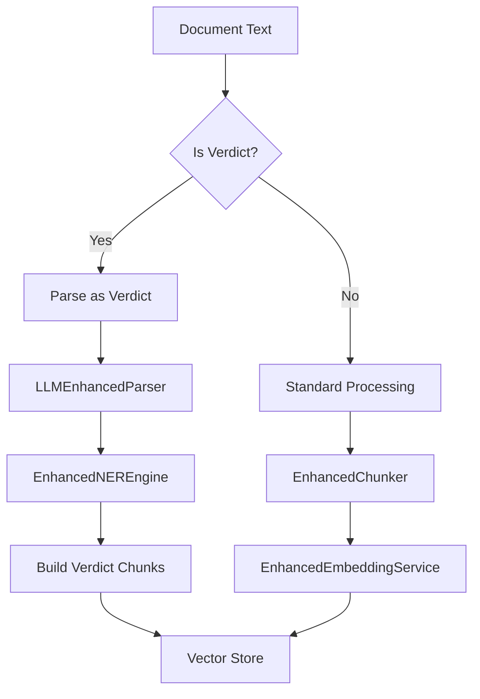
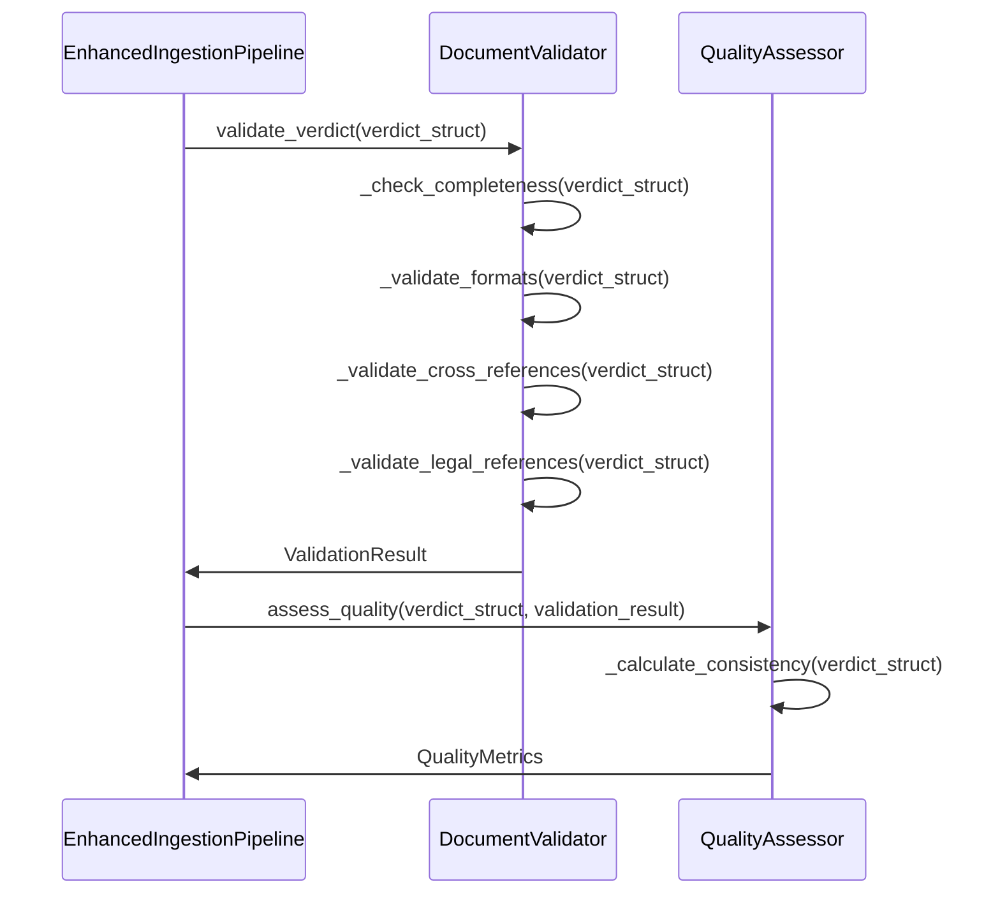
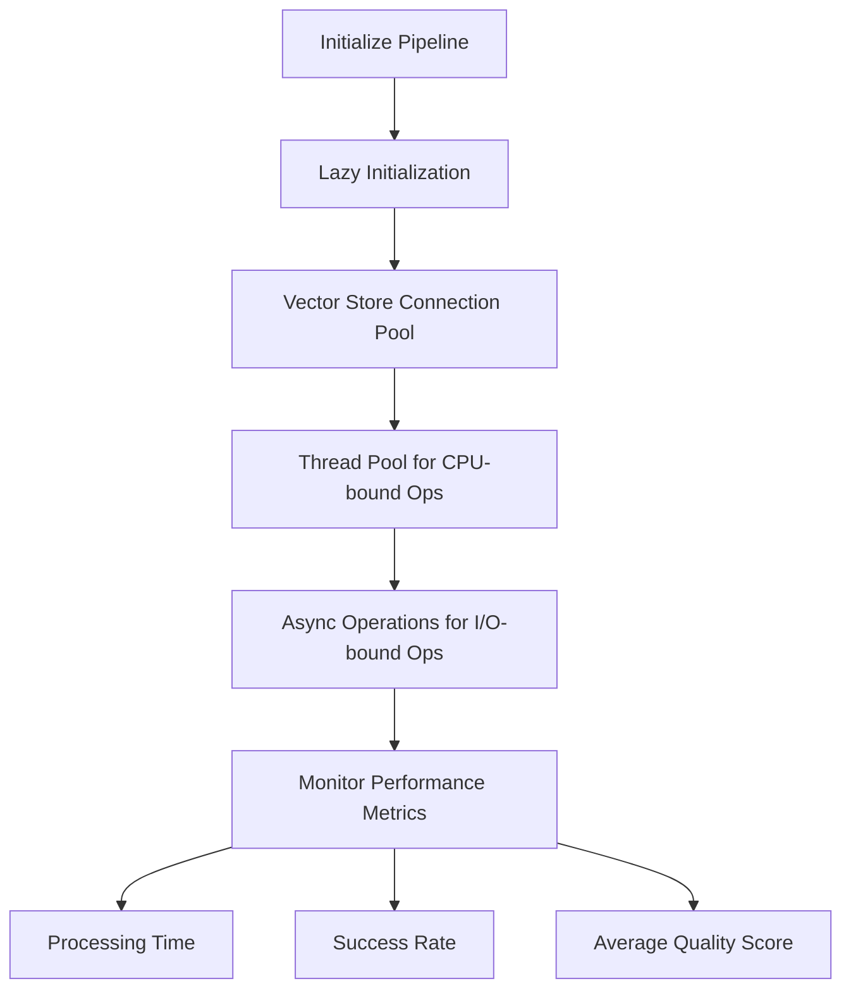

# Ingestion Pipeline

<cite>
**Referenced Files in This Document**   
- [enhanced_pipeline.py](file://mahoun/pipelines/ingestion/enhanced_pipeline.py)
- [pipeline.py](file://mahoun/pipelines/ingestion/pipeline.py)
- [document_handlers.py](file://mahoun/pipelines/ingestion/document_handlers.py)
- [enhanced_chunker.py](file://mahoun/pipelines/ingestion/enhanced_chunker.py)
- [llm_enhanced_parser.py](file://mahoun/pipelines/ingestion/llm_enhanced_parser.py)
- [enhanced_ner.py](file://mahoun/pipelines/ingestion/enhanced_ner.py)
- [validation_quality.py](file://mahoun/pipelines/ingestion/validation_quality.py)
- [legal_ner.py](file://mahoun/pipelines/ingestion/legal_ner.py)
- [persian_normalizer.py](file://mahoun/pipelines/ingestion/persian_normalizer.py)
- [minimal_verdict_parser.py](file://mahoun/pipelines/ingestion/minimal_verdict_parser.py)
- [llm_refiner.py](file://mahoun/pipelines/ingestion/llm_refiner.py)
- [vector_store/manager.py](file://mahoun/pipelines/vector_store/manager.py)
- [vector_store/manager_v2.py](file://mahoun/pipelines/vector_store/manager_v2.py)
</cite>

## Table of Contents
1. [Introduction](#introduction)
2. [Document Processing Workflow](#document-processing-workflow)
3. [Enhanced Ingestion Pipeline](#enhanced-ingestion-pipeline)
4. [Document Parsing and Normalization](#document-parsing-and-normalization)
5. [Accuracy Improvements](#accuracy-improvements)
6. [Document Type and Language Handling](#document-type-and-language-handling)
7. [Error Handling and Validation](#error-handling-and-validation)
8. [Performance and Optimization](#performance-and-optimization)
9. [Conclusion](#conclusion)

## Introduction
The ingestion pipeline is a comprehensive system designed to process, parse, normalize, chunk, embed, and store documents in vector databases. This document details the complete workflow from document upload to indexing, with a focus on the EnhancedIngestionPipeline, which improves accuracy through LLM-enhanced parsing, cross-validated NER, and semantic chunking. The pipeline handles various document types, particularly legal verdicts, and supports multiple languages, with a special emphasis on Persian. The documentation includes error handling, validation mechanisms, quality assessment procedures, and performance optimization techniques such as lazy initialization and resource pooling.

**Section sources**
- [enhanced_pipeline.py](file://mahoun/pipelines/ingestion/enhanced_pipeline.py#L1-L376)
- [pipeline.py](file://mahoun/pipelines/ingestion/pipeline.py#L1-L792)

## Document Processing Workflow
The ingestion pipeline processes documents through a series of well-defined stages: upload, parsing, normalization, chunking, embedding generation, and storage in vector databases. Each stage is designed to handle specific aspects of document processing, ensuring high accuracy and reliability. The workflow begins with document upload, where various file formats are supported, including TXT, DOCX, PDF, and images. The pipeline then parses the document to extract text, normalizes the text to a standard format, and chunks the text into manageable segments. Embeddings are generated for each chunk, and the chunks are stored in a vector database for efficient retrieval.

**Diagram sources**
- [pipeline.py](file://mahoun/pipelines/ingestion/pipeline.py#L228-L495)
- [document_handlers.py](file://mahoun/pipelines/ingestion/document_handlers.py#L731-L755)

## Enhanced Ingestion Pipeline
The EnhancedIngestionPipeline is a drop-in replacement for the standard IngestionPipeline, with enhanced accuracy features. It integrates LLM-enhanced parsing, cross-validated NER, semantic chunking, better embeddings, comprehensive validation, and LLM refinement. The pipeline is initialized lazily, ensuring efficient resource utilization. The EnhancedIngestionResult class extends the standard IngestionResult with quality metrics such as quality_score, validation_passed, and refinement_applied.

**Diagram sources**
- [enhanced_pipeline.py](file://mahoun/pipelines/ingestion/enhanced_pipeline.py#L42-L376)
- [pipeline.py](file://mahoun/pipelines/ingestion/pipeline.py#L86-L792)

## Document Parsing and Normalization
The document parsing and normalization stage is responsible for extracting text from various document formats and normalizing it to a standard format. The pipeline supports TXT, DOCX, PDF, and image files. For PDFs, multiple extraction strategies are employed, including pdfplumber for tables and layout, pypdf for simple PDFs, and OCR for scanned PDFs. The PersianLegalNormalizer class handles normalization of Persian text, converting Arabic and Persian digits to English digits, normalizing character variants, correcting common typos, and normalizing whitespace.

**Diagram sources**
- [document_handlers.py](file://mahoun/pipelines/ingestion/document_handlers.py#L64-L755)
- [persian_normalizer.py](file://mahoun/pipelines/ingestion/persian_normalizer.py#L34-L377)

## Accuracy Improvements
The EnhancedIngestionPipeline improves accuracy through several mechanisms: LLM-enhanced parsing, cross-validated NER, and semantic chunking. The LLMEnhancedParser uses an LLM to refine the results of rule-based parsing, particularly for low-confidence or ambiguous fields. The EnhancedNEREngine performs cross-validation between multiple extraction strategies and post-processes the results to improve accuracy. The EnhancedChunker uses semantic boundaries to create chunks, avoiding splitting within sentences or paragraphs.

**Diagram sources**
- [llm_enhanced_parser.py](file://mahoun/pipelines/ingestion/llm_enhanced_parser.py#L25-L456)
- [enhanced_ner.py](file://mahoun/pipelines/ingestion/enhanced_ner.py#L19-L362)
- [enhanced_chunker.py](file://mahoun/pipelines/ingestion/enhanced_chunker.py#L31-L317)

## Document Type and Language Handling
The ingestion pipeline is designed to handle various document types, with a special focus on legal verdicts. It detects verdicts based on metadata hints and text heuristics, such as the presence of keywords like "رأی" or "دادنامه". For Persian documents, the pipeline uses the PersianLegalNormalizer to handle normalization of Persian text, including digit conversion, character normalization, typo correction, and whitespace normalization. The pipeline also supports other languages, but Persian is given special attention due to its complexity and importance in the legal domain.

**Diagram sources**
- [pipeline.py](file://mahoun/pipelines/ingestion/pipeline.py#L616-L637)
- [persian_normalizer.py](file://mahoun/pipelines/ingestion/persian_normalizer.py#L34-L377)

## Error Handling and Validation
The ingestion pipeline includes comprehensive error handling and validation mechanisms to ensure the quality and reliability of processed documents. The DocumentValidator class performs field completeness validation, data format correctness, cross-reference consistency, and legal reference validity. The QualityAssessor class assesses the overall quality of ingested documents, calculating metrics such as completeness, accuracy, consistency, and overall score. The pipeline also includes validation and quality assessment for verdicts, with specific checks for required fields, data formats, and cross-references.

**Diagram sources**
- [validation_quality.py](file://mahoun/pipelines/ingestion/validation_quality.py#L45-L449)
- [enhanced_pipeline.py](file://mahoun/pipelines/ingestion/enhanced_pipeline.py#L202-L219)

## Performance and Optimization
The ingestion pipeline is optimized for performance through techniques such as lazy initialization, resource pooling, and efficient data processing. The pipeline components are initialized lazily, ensuring that resources are only allocated when needed. The pipeline uses connection pooling for the vector store, reducing the overhead of establishing connections. The pipeline also employs efficient data processing techniques, such as using thread pools for CPU-bound operations and async operations for I/O-bound operations. The pipeline's performance is monitored through comprehensive metrics, including processing time, success rate, and average quality score.

**Diagram sources**
- [pipeline.py](file://mahoun/pipelines/ingestion/pipeline.py#L176-L227)
- [vector_store/manager.py](file://mahoun/pipelines/vector_store/manager.py#L128-L159)
- [vector_store/manager_v2.py](file://mahoun/pipelines/vector_store/manager_v2.py#L187-L203)

## Conclusion
The ingestion pipeline is a robust and efficient system for processing, parsing, normalizing, chunking, embedding, and storing documents in vector databases. The EnhancedIngestionPipeline improves accuracy through LLM-enhanced parsing, cross-validated NER, and semantic chunking. The pipeline handles various document types, particularly legal verdicts, and supports multiple languages, with a special emphasis on Persian. The pipeline includes comprehensive error handling, validation mechanisms, and quality assessment procedures. Performance is optimized through techniques such as lazy initialization and resource pooling, ensuring efficient and reliable document processing.

**Section sources**
- [enhanced_pipeline.py](file://mahoun/pipelines/ingestion/enhanced_pipeline.py#L1-L376)
- [pipeline.py](file://mahoun/pipelines/ingestion/pipeline.py#L1-L792)