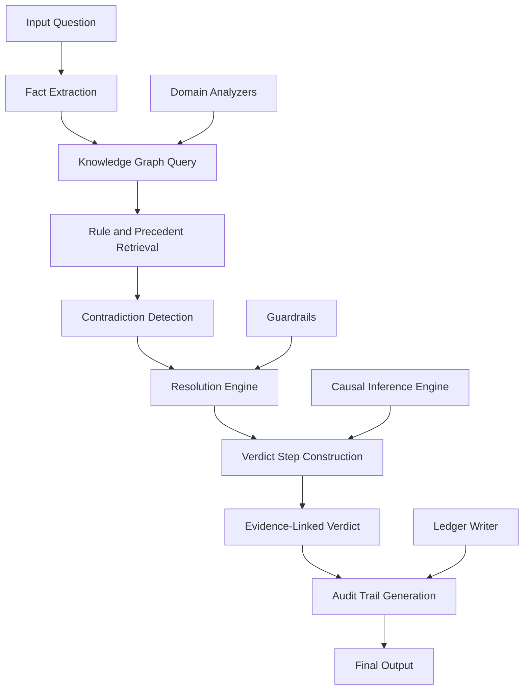
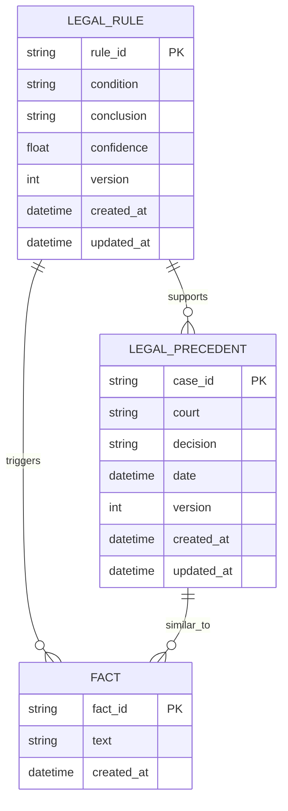
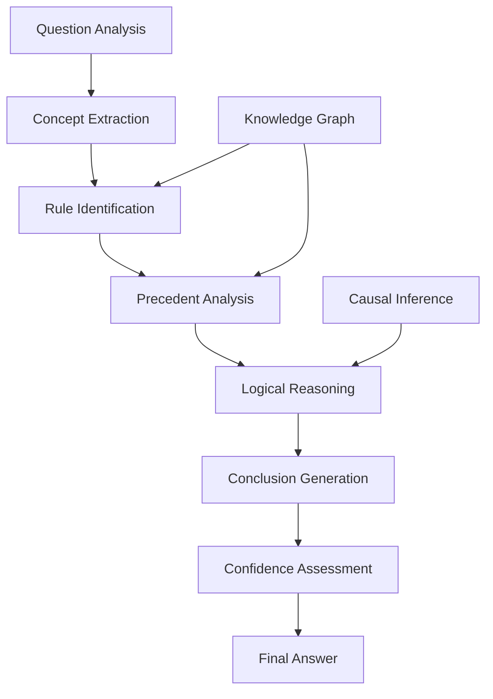
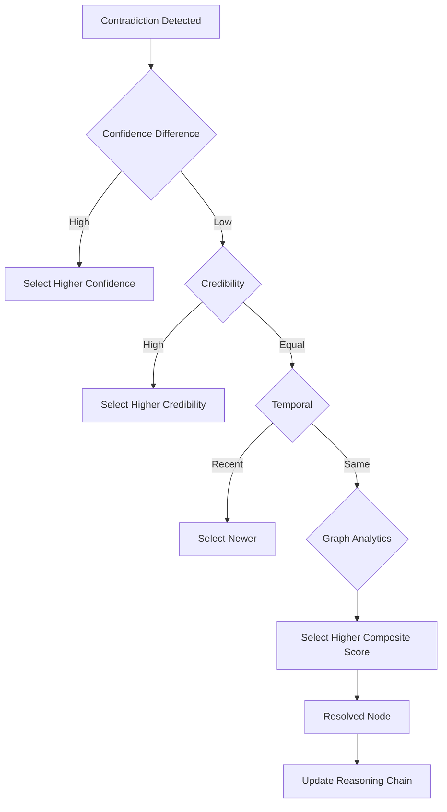
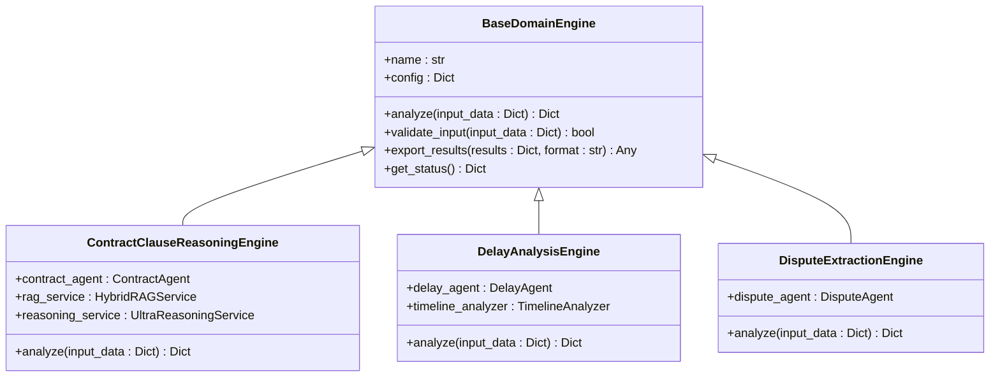
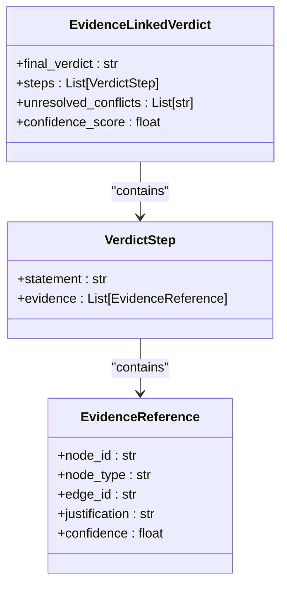
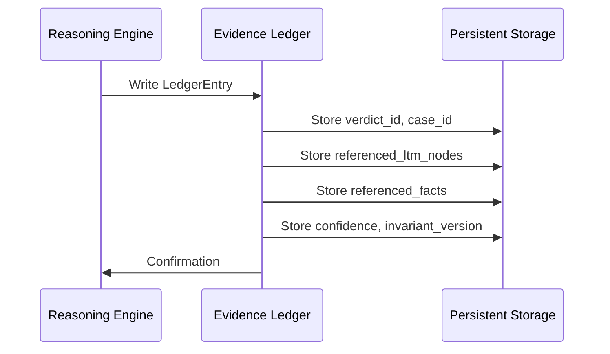

# Reasoning Engine

<cite>
**Referenced Files in This Document**   
- [reasoning_engine.py](file://mahoun/reasoning/reasoning_engine.py)
- [evidence_linked_verdict.py](file://mahoun/reasoning/evidence_linked_verdict.py)
- [knowledge_graph.py](file://mahoun/reasoning/knowledge_graph.py)
- [chain_of_thought.py](file://mahoun/reasoning/chain_of_thought.py)
- [causal_inference.py](file://mahoun/reasoning/causal_inference.py)
- [contract_reasoning.py](file://mahoun/domain/contract_reasoning.py)
- [delay_analyzer.py](file://mahoun/domain/delay_analyzer.py)
- [dispute_extractor.py](file://mahoun/domain/dispute_extractor.py)
- [ultra_graph_builder.py](file://mahoun/graph/ultra_graph_builder.py)
- [hybrid_rag_service.py](file://mahoun/rag/hybrid_rag_service.py)
- [runtime_invariants.py](file://mahoun/guardrails/runtime_invariants.py)
- [models.py](file://mahoun/ledger/models.py)
</cite>

## Table of Contents
1. [Introduction](#introduction)
2. [Evidence-Linked Reasoning Architecture](#evidence-linked-reasoning-architecture)
3. [Knowledge Graph Integration](#knowledge-graph-integration)
4. [Reasoning Chain Construction](#reasoning-chain-construction)
5. [Contradiction Detection and Resolution](#contradiction-detection-and-resolution)
6. [Domain-Specific Analyzers](#domain-specific-analyzers)
7. [Audit Trail and Verification](#audit-trail-and-verification)
8. [Performance and Scalability](#performance-and-scalability)
9. [Conclusion](#conclusion)

## Introduction
The deep legal reasoning engine is a sophisticated system designed to perform evidence-linked reasoning by connecting retrieved information to a comprehensive knowledge graph and applying domain-specific rules. This document provides architectural documentation for the reasoning engine, explaining how it ensures zero hallucination through rigorous verification processes, constructs reasoning chains, detects contradictions, and maintains complete audit trails. The system integrates specialized domain analyzers for contract, delay, and dispute analysis, enabling complex legal reasoning scenarios with high accuracy and reliability.

## Evidence-Linked Reasoning Architecture
The reasoning engine employs a multi-layered architecture that combines chain-of-thought reasoning, causal inference, and knowledge graph traversal to produce legally sound conclusions. The system is designed to ensure that every conclusion is explicitly linked to graph evidence, preventing hallucination and ensuring verifiability.

**Diagram sources**
- [reasoning_engine.py](file://mahoun/reasoning/reasoning_engine.py#L27-L204)
- [evidence_linked_verdict.py](file://mahoun/reasoning/evidence_linked_verdict.py#L73-L298)

**Section sources**
- [reasoning_engine.py](file://mahoun/reasoning/reasoning_engine.py#L1-L391)
- [evidence_linked_verdict.py](file://mahoun/reasoning/evidence_linked_verdict.py#L1-L800)

## Knowledge Graph Integration
The reasoning engine is tightly integrated with a legal knowledge graph that stores rules, precedents, and their relationships. This graph serves as the foundation for evidence-linked reasoning, ensuring all conclusions are grounded in verifiable legal knowledge.

### Knowledge Graph Structure
The knowledge graph contains the following core components:

| Component | Description | Source |
|---------|-------------|--------|
| Legal Rules | Domain-specific legal rules with conditions and conclusions | [knowledge_graph.py](file://mahoun/reasoning/knowledge_graph.py#L29-L42) |
| Precedents | Historical legal cases with facts, decisions, and court information | [knowledge_graph.py](file://mahoun/reasoning/knowledge_graph.py#L44-L57) |
| Relationships | Connections between rules, precedents, and facts | [ultra_graph_builder.py](file://mahoun/graph/ultra_graph_builder.py#L72-L88) |
| Version History | Complete history of rule and precedent modifications | [knowledge_graph.py](file://mahoun/reasoning/knowledge_graph.py#L85-L87) |

The knowledge graph supports persistent storage through JSON files and provides CRUD operations for managing legal knowledge. It also implements version history for rules and precedents, allowing for audit and rollback capabilities.

**Diagram sources**
- [knowledge_graph.py](file://mahoun/reasoning/knowledge_graph.py#L59-L499)
- [ultra_graph_builder.py](file://mahoun/graph/ultra_graph_builder.py#L52-L88)

**Section sources**
- [knowledge_graph.py](file://mahoun/reasoning/knowledge_graph.py#L1-L499)

## Reasoning Chain Construction
The reasoning engine constructs comprehensive reasoning chains by combining multiple reasoning methodologies, including chain-of-thought, causal inference, and graph traversal.

### Chain-of-Thought Reasoning Process
The system implements a six-step chain-of-thought reasoning process:

1. **Question Analysis**: Identify the type of legal question and key terms
2. **Concept Extraction**: Extract legal concepts and entities from context
3. **Rule Identification**: Find applicable legal rules from the knowledge graph
4. **Precedent Analysis**: Identify similar legal precedents
5. **Logical Reasoning**: Apply logical inference based on rules and precedents
6. **Conclusion Generation**: Synthesize a final conclusion with confidence scoring

The chain-of-thought reasoner maintains detailed tracking of reasoning steps, including visited nodes, used rules, and graph edges. This enables complete auditability of the reasoning process.

**Section sources**
- [chain_of_thought.py](file://mahoun/reasoning/chain_of_thought.py#L21-L512)
- [reasoning_engine.py](file://mahoun/reasoning/reasoning_engine.py#L130-L212)

## Contradiction Detection and Resolution
The system implements a comprehensive contradiction management system that detects, resolves, and documents conflicting legal interpretations.

### Contradiction Detection Strategies
The engine employs multiple strategies to detect contradictions between rules and precedents:

- **Rule Contradictions**: Identifies rules with the same condition but opposite conclusions
- **Precedent Contradictions**: Detects precedents with similar facts but different decisions
- **Source Credibility**: Evaluates the credibility of conflicting sources
- **Temporal Precedence**: Prioritizes more recent rules and precedents

### Contradiction Resolution Hierarchy
When contradictions are detected, the system applies a hierarchical resolution strategy:

1. **Confidence-Based Resolution**: Selects the higher confidence rule or precedent
2. **Credibility-Based Resolution**: Chooses the source with higher credibility
3. **Temporal Resolution**: Prefers more recent legal interpretations
4. **Graph Analytics Resolution**: Uses composite scoring based on multiple factors

**Diagram sources**
- [evidence_linked_verdict.py](file://mahoun/reasoning/evidence_linked_verdict.py#L480-L668)
- [runtime_invariants.py](file://mahoun/guardrails/runtime_invariants.py#L127-L161)

**Section sources**
- [evidence_linked_verdict.py](file://mahoun/reasoning/evidence_linked_verdict.py#L480-L668)
- [runtime_invariants.py](file://mahoun/guardrails/runtime_invariants.py#L127-L161)

## Domain-Specific Analyzers
The reasoning engine integrates with specialized domain analyzers that provide expertise in specific legal domains.

### Domain Analyzer Architecture
The system implements a base domain engine pattern that all specialized analyzers inherit from:

### Contract Reasoning Engine
The contract reasoning engine analyzes contractual clauses and generates evidence-based responses:

- Extracts relevant clauses from citations
- Identifies obligations and responsibilities
- Builds reasoning chains based on contractual terms
- Integrates with the citation engine for proper referencing

### Delay Analysis Engine
The delay analysis engine specializes in project delay assessment:

- Compares baseline and actual schedules
- Identifies critical path delays
- Calculates delay windows and attribution
- Enhances attribution with statistical analysis

### Dispute Extraction Engine
The dispute extraction engine identifies conflicts and violations:

- Extracts disputes and violations from documents
- Calculates severity scores based on keywords
- Sorts findings by severity level
- Provides related clause references

**Section sources**
- [base_engine.py](file://mahoun/domain/base_engine.py#L1-L94)
- [contract_reasoning.py](file://mahoun/domain/contract_reasoning.py#L1-L209)
- [delay_analyzer.py](file://mahoun/domain/delay_analyzer.py#L1-L169)
- [dispute_extractor.py](file://mahoun/domain/dispute_extractor.py#L1-L147)

## Audit Trail and Verification
The system implements a comprehensive audit trail and verification system to ensure transparency, accountability, and zero hallucination.

### Evidence-Linked Verdict Structure
The engine generates verdicts where every conclusion is explicitly linked to graph evidence:

### Guardrail System
The system enforces critical invariants through a guardrail system:

| Guard | Purpose | Source |
|------|--------|--------|
| G1_EvidenceStepHasEvidence | Ensures each verdict step has evidence | [runtime_invariants.py](file://mahoun/guardrails/runtime_invariants.py#L77-L93) |
| G2_EvidenceReferencesResolve | Verifies evidence references resolve to real nodes | [runtime_invariants.py](file://mahoun/guardrails/runtime_invariants.py#L96-L124) |
| G3_NonResurrection | Prevents excluded nodes from reappearing | [runtime_invariants.py](file://mahoun/guardrails/runtime_invariants.py#L127-L161) |
| G4_ContradictionVisibility | Ensures unresolved conflicts result in undetermined verdicts | [runtime_invariants.py](file://mahoun/guardrails/runtime_invariants.py#L164-L190) |
| G5_ResolutionOrder | Validates verdict steps use resolved nodes only | [runtime_invariants.py](file://mahoun/guardrails/runtime_invariants.py#L193-L237) |

### Ledger Integration
The system writes evidence references to a ledger for audit purposes:

**Diagram sources**
- [evidence_linked_verdict.py](file://mahoun/reasoning/evidence_linked_verdict.py#L39-L67)
- [models.py](file://mahoun/ledger/models.py#L6-L21)
- [runtime_invariants.py](file://mahoun/guardrails/runtime_invariants.py#L77-L237)

**Section sources**
- [evidence_linked_verdict.py](file://mahoun/reasoning/evidence_linked_verdict.py#L1-L800)
- [runtime_invariants.py](file://mahoun/guardrails/runtime_invariants.py#L1-L239)
- [models.py](file://mahoun/ledger/models.py#L1-L21)

## Performance and Scalability
The reasoning engine is designed with performance and scalability considerations to handle complex legal reasoning scenarios efficiently.

### Performance Characteristics
The system implements several optimization strategies:

- **Caching**: Frequently accessed rules and precedents are cached
- **Batch Processing**: Multiple reasoning operations are processed in batches
- **Indexing**: Graph nodes and edges are indexed for fast lookup
- **Asynchronous Processing**: Non-blocking operations improve throughput

### Scalability Architecture
The system supports horizontal scaling through:

- **Distributed Knowledge Graph**: Neo4j integration for enterprise-scale graph storage
- **Microservices Architecture**: Domain analyzers can be deployed as independent services
- **Load Balancing**: Multiple reasoning engine instances can be load balanced
- **Stateless Design**: Engines can be scaled without shared state concerns

### Performance Metrics
Key performance indicators tracked by the system:

| Metric | Description | Source |
|-------|-------------|--------|
| reasoning_depth | Depth of reasoning chains | [reasoning_engine.py](file://mahoun/reasoning/reasoning_engine.py#L202) |
| evidence_strength | Strength of supporting evidence | [reasoning_engine.py](file://mahoun/reasoning/reasoning_engine.py#L180-L281) |
| retrieval_time_ms | Time to retrieve relevant information | [hybrid_rag_service.py](file://mahoun/rag/hybrid_rag_service.py#L54) |
| avg_build_time | Average graph build time | [ultra_graph_builder.py](file://mahoun/graph/ultra_graph_builder.py#L372) |
| contradiction_rate | Rate of detected contradictions | [ultra_reasoning_service.py](file://mahoun/reasoning/ultra_reasoning_service.py#L489) |

**Section sources**
- [ultra_graph_builder.py](file://mahoun/graph/ultra_graph_builder.py#L328-L779)
- [hybrid_rag_service.py](file://mahoun/rag/hybrid_rag_service.py#L113-L390)
- [ultra_reasoning_service.py](file://mahoun/reasoning/ultra_reasoning_service.py#L290-L484)

## Conclusion
The deep legal reasoning engine represents a sophisticated architecture for evidence-linked legal reasoning that ensures zero hallucination through rigorous verification processes. By integrating a comprehensive knowledge graph, domain-specific analyzers, and a robust guardrail system, the engine provides reliable, auditable, and transparent legal analysis. The system's ability to construct detailed reasoning chains, detect and resolve contradictions, and maintain complete audit trails makes it suitable for high-stakes legal applications where accuracy and accountability are paramount. The architecture's scalability and performance characteristics ensure it can handle complex legal scenarios efficiently, making it a powerful tool for legal professionals and organizations.