# Retrieval Mechanism

<cite>
**Referenced Files in This Document**   
- [hybrid_search_v2.py](file://mahoun/retrieval/hybrid_search_v2.py)
- [ultra_hybrid_search.py](file://mahoun/retrieval/ultra_hybrid_search.py)
- [graph_hop.py](file://mahoun/retrieval/graph_hop.py)
- [gat_reranker.py](file://mahoun/retrieval/gat_reranker.py)
- [persian_normalizer.py](file://mahoun/pipelines/ingestion/persian_normalizer.py)
- [vector_store/manager.py](file://mahoun/pipelines/vector_store/manager.py)
- [self_improve/ultra_performance_monitoring.py](file://mahoun/self_improve/ultra_performance_monitoring.py)
- [core/metrics/decorators.py](file://mahoun/core/metrics/decorators.py)
</cite>

## Table of Contents
1. [Introduction](#introduction)
2. [Core Retrieval Components](#core-retrieval-components)
3. [Hybrid Search Architecture](#hybrid-search-architecture)
4. [Query Processing Pipeline](#query-processing-pipeline)
5. [Fusion Algorithms](#fusion-algorithms)
6. [Graph-Based Retrieval](#graph-based-retrieval)
7. [Result Reranking](#result-reranking)
8. [Query Expansion and Persian Language Support](#query-expansion-and-persian-language-support)
9. [Caching Strategy](#caching-strategy)
10. [Performance Characteristics](#performance-characteristics)
11. [Failure Modes and Fallback Strategies](#failure-modes-and-fallback-strategies)
12. [Monitoring and Metrics](#monitoring-and-metrics)
13. [Conclusion](#conclusion)

## Introduction
The retrieval system is a hybrid architecture that combines multiple retrieval strategies to provide comprehensive and accurate search results. It integrates sparse retrieval (BM25), dense vector search, and graph-based retrieval, combining their results through sophisticated fusion algorithms. The system is designed for high performance, with sub-100ms response times for hybrid searches and robust fallback mechanisms to ensure reliability. It includes advanced features like query expansion, result reranking, and caching to enhance retrieval quality. The system is particularly optimized for Persian legal content, with specialized normalization and processing to handle the complexities of Persian text and legal terminology.

**Section sources**
- [hybrid_search_v2.py](file://mahoun/retrieval/hybrid_search_v2.py#L1-L1395)

## Core Retrieval Components

The retrieval system is built on three core components: sparse retrieval using BM25, dense retrieval using vector similarity, and graph-based retrieval. The BM25Retriever provides keyword-based search capabilities, using the rank_bm25 library for efficient sparse retrieval. It includes text preprocessing with tokenization, stopword removal, and stemming to improve search quality. The DenseRetriever interfaces with the vector store to perform semantic search using embedding similarity. It supports both direct embedding search and text-based search with on-the-fly embedding generation. The GraphHopRetriever enables knowledge graph traversal, expanding initial retrieval results by following relationships between entities. These components work together to provide comprehensive coverage of different retrieval paradigms, ensuring that both keyword matches and semantic similarities are captured.

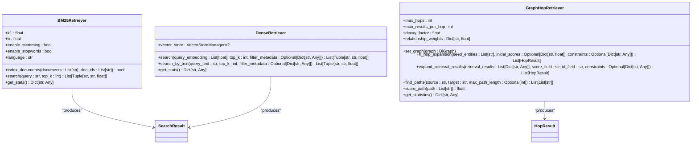

**Diagram sources **
- [hybrid_search_v2.py](file://mahoun/retrieval/hybrid_search_v2.py#L221-L435)
- [ultra_hybrid_search.py](file://mahoun/retrieval/ultra_hybrid_search.py#L119-L250)
- [graph_hop.py](file://mahoun/retrieval/graph_hop.py#L50-L441)

**Section sources**
- [hybrid_search_v2.py](file://mahoun/retrieval/hybrid_search_v2.py#L221-L435)
- [ultra_hybrid_search.py](file://mahoun/retrieval/ultra_hybrid_search.py#L119-L250)
- [graph_hop.py](file://mahoun/retrieval/graph_hop.py#L50-L441)

## Hybrid Search Architecture

The hybrid search architecture combines multiple retrieval methods through a coordinated pipeline. The HybridSearchV2 class orchestrates the retrieval process, managing both dense and sparse retrieval components. It uses a thread-safe design with proper locking to ensure concurrent access safety. The system supports three retrieval methods: dense-only, sparse-only, and hybrid. In hybrid mode, it performs both dense and sparse searches in parallel when possible, then fuses the results using one of several fusion algorithms. The architecture includes comprehensive metrics collection, with timing measurements for each phase of the retrieval process. It also implements graceful degradation, falling back to dense-only search if BM25 is unavailable. The system is designed for production use, with performance targets of under 100ms for hybrid searches and under 50ms for cached queries.

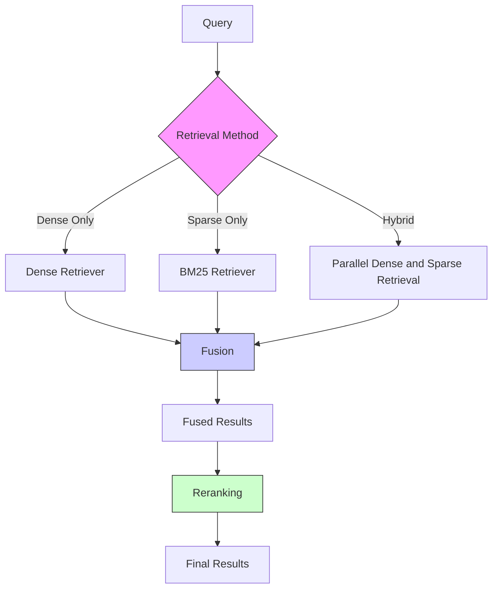

**Diagram sources **
- [hybrid_search_v2.py](file://mahoun/retrieval/hybrid_search_v2.py#L561-L800)
- [ultra_hybrid_search.py](file://mahoun/retrieval/ultra_hybrid_search.py#L439-L614)

**Section sources**
- [hybrid_search_v2.py](file://mahoun/retrieval/hybrid_search_v2.py#L561-L800)
- [ultra_hybrid_search.py](file://mahoun/retrieval/ultra_hybrid_search.py#L439-L614)

## Query Processing Pipeline

The query processing pipeline follows a structured sequence of operations to transform a user query into ranked search results. The process begins with input validation and cache checking. If a cached result exists for the query parameters, it is returned immediately. Otherwise, the system proceeds with retrieval based on the specified method. For hybrid retrieval, both dense and sparse searches are executed, with results combined through fusion algorithms. The fused results are then optionally reranked to improve relevance. Throughout the pipeline, comprehensive metrics are collected, including timing for each phase and quality metrics like overlap between retrieval methods. The pipeline is designed to be efficient and resilient, with proper error handling and fallback mechanisms to ensure reliable operation under various conditions.

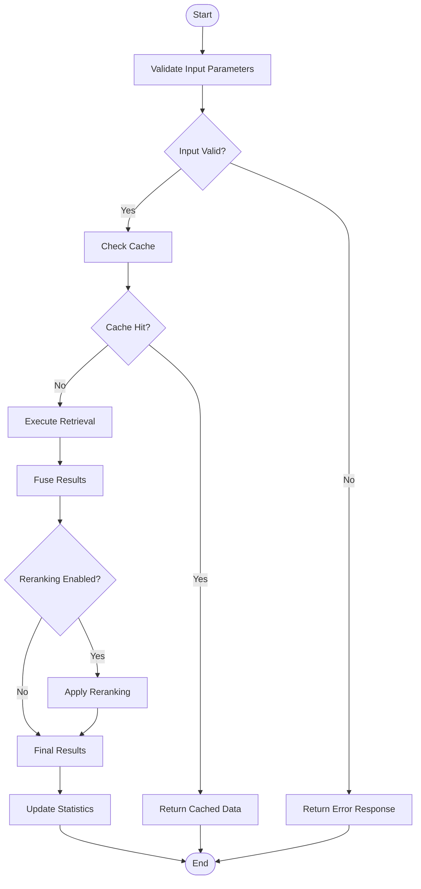

**Diagram sources **
- [hybrid_search_v2.py](file://mahoun/retrieval/hybrid_search_v2.py#L725-L800)
- [hybrid_search_v2.py](file://mahoun/retrieval/hybrid_search_v2.py#L885-L999)

**Section sources**
- [hybrid_search_v2.py](file://mahoun/retrieval/hybrid_search_v2.py#L725-L999)

## Fusion Algorithms

The system implements multiple fusion algorithms to combine results from different retrieval methods. The primary fusion method is Reciprocal Rank Fusion (RRF), which combines rankings by taking the reciprocal of the rank position plus a constant. This method is effective because it gives higher weight to documents that rank highly in either retrieval method. The system also supports weighted sum fusion, which combines normalized scores from dense and sparse retrieval using configurable weights. Additional fusion methods include maximum score (taking the highest score from either method) and minimum score (taking the lowest score, which acts as a conservative fusion). The choice of fusion method can be configured based on the use case, with RRF being the default due to its proven effectiveness in information retrieval.

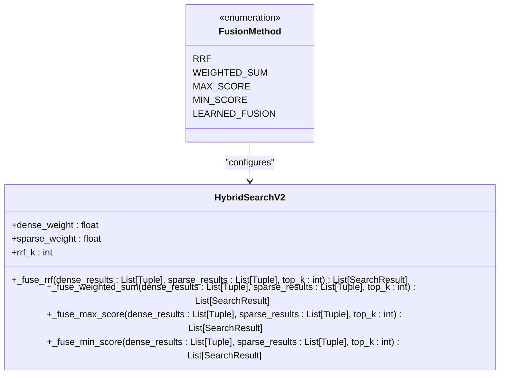

**Diagram sources **
- [hybrid_search_v2.py](file://mahoun/retrieval/hybrid_search_v2.py#L85-L91)
- [hybrid_search_v2.py](file://mahoun/retrieval/hybrid_search_v2.py#L1005-L1252)

**Section sources**
- [hybrid_search_v2.py](file://mahoun/retrieval/hybrid_search_v2.py#L85-L91)
- [hybrid_search_v2.py](file://mahoun/retrieval/hybrid_search_v2.py#L1005-L1252)

## Graph-Based Retrieval

Graph-based retrieval extends the search results by traversing a knowledge graph of legal entities and their relationships. The GraphHopRetriever performs k-hop expansion from seed entities identified in the initial retrieval results. It uses a breadth-first search approach to explore the graph, scoring paths based on relationship types and applying a decay factor for each hop to prioritize closer relationships. The system supports various relationship types with configurable weights, such as CITES (1.0), REFERENCES (0.9), and RELATED (0.7). This allows the retrieval system to find documents that are contextually related to the query, even if they don't contain the exact query terms. The graph retrieval can be used as an additional retrieval method in the hybrid search or as a post-processing step to expand results.

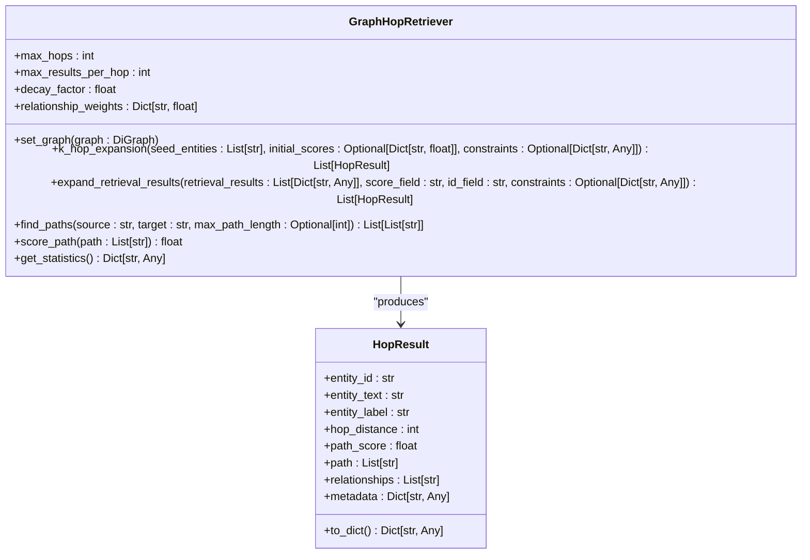

**Diagram sources **
- [graph_hop.py](file://mahoun/retrieval/graph_hop.py#L24-L441)

**Section sources**
- [graph_hop.py](file://mahoun/retrieval/graph_hop.py#L24-L441)

## Result Reranking

Result reranking is performed to improve the relevance of search results after initial retrieval and fusion. The GATReranker uses a Graph Attention Network to re-score results based on their relationships in the knowledge graph. It combines three scores: the original retrieval score, a GAT-based relevance score from graph analysis, and a PageRank score for authority. The final score is a weighted combination of these components. The system includes fallback mechanisms, using PageRank scoring if the GAT model is unavailable. Reranking also supports uncertainty quantification through Monte Carlo dropout, providing confidence estimates for the scores. The reranker can generate explanations for its ranking decisions by analyzing attention weights, showing which graph relationships influenced the final score.

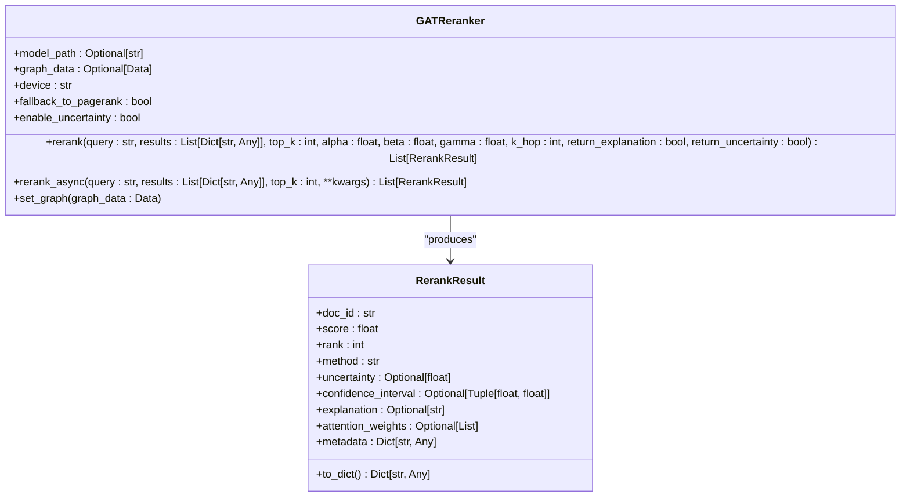

**Diagram sources **
- [gat_reranker.py](file://mahoun/retrieval/gat_reranker.py#L49-L682)

**Section sources**
- [gat_reranker.py](file://mahoun/retrieval/gat_reranker.py#L49-L682)

## Query Expansion and Persian Language Support

The system includes specialized support for Persian language content, particularly for legal documents. The PersianLegalNormalizer handles various Persian and Arabic character variants, normalizing them to standard Persian characters. It converts different digit systems (Persian, Arabic, and English) to a consistent format, ensuring that numeric queries work regardless of the digit representation in the document. The normalizer also corrects common typos in Persian legal documents, such as "اقای" to "آقای". For query expansion, the system uses synonym replacement based on a comprehensive Persian legal synonym dictionary. This dictionary includes legal terms like "دادگاه" (court) with synonyms such as "محکمه" and "دیوان", allowing the system to find relevant documents even when different terminology is used.

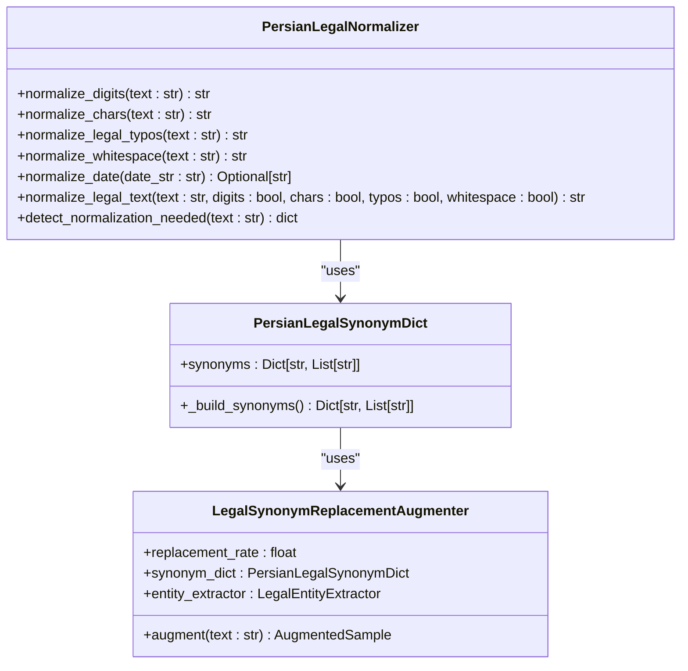

**Diagram sources **
- [persian_normalizer.py](file://mahoun/pipelines/ingestion/persian_normalizer.py#L34-L457)
- [data_augmentation.py](file://mahoun/finetuning/data_augmentation.py#L93-L115)
- [combined_labeling_augmentation.py](file://mahoun/archive/combined_labeling_augmentation.py#L244-L522)

**Section sources**
- [persian_normalizer.py](file://mahoun/pipelines/ingestion/persian_normalizer.py#L34-L457)
- [data_augmentation.py](file://mahoun/finetuning/data_augmentation.py#L93-L115)
- [combined_labeling_augmentation.py](file://mahoun/archive/combined_labeling_augmentation.py#L244-L522)

## Caching Strategy

The system implements a caching strategy using an LRU (Least Recently Used) cache with TTL (Time To Live). The LRUCacheWithTTL class provides thread-safe caching with configurable maximum size and expiration time. Cache entries are stored with a hash of the query parameters, including the query text, top_k value, retrieval method, fusion method, and metadata filters. This ensures that identical queries return the same results without re-executing the retrieval process. The cache hit rate is monitored as part of the system metrics, with a target of high cache efficiency for frequently repeated queries. The caching mechanism significantly reduces response times for cached queries, achieving sub-50ms latency. Cache statistics, including hit rate, eviction count, and size, are collected and reported as part of the system monitoring.

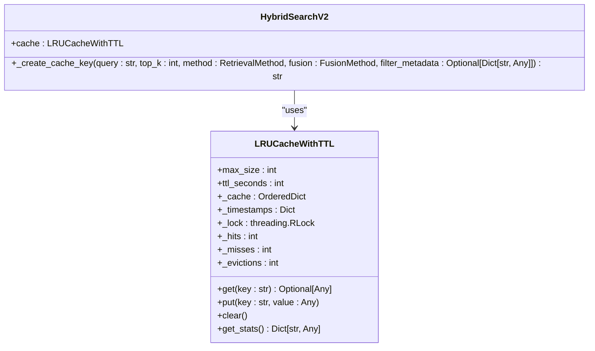

**Diagram sources **
- [hybrid_search_v2.py](file://mahoun/retrieval/hybrid_search_v2.py#L144-L218)
- [hybrid_search_v2.py](file://mahoun/retrieval/hybrid_search_v2.py#L1289-L1307)

**Section sources**
- [hybrid_search_v2.py](file://mahoun/retrieval/hybrid_search_v2.py#L144-L218)
- [hybrid_search_v2.py](file://mahoun/retrieval/hybrid_search_v2.py#L1289-L1307)

## Performance Characteristics

The retrieval system is designed for high performance with specific targets for response times and throughput. Hybrid searches are optimized to complete in under 100ms for top-10 results, while cached queries respond in under 50ms. Complex queries with reranking have a target of under 200ms additional processing time. The system supports retrieval from 100K+ documents with sub-second search performance. Performance is monitored through comprehensive metrics collection, including timing for each phase of the retrieval process (dense search, sparse search, fusion, reranking). The system uses decorators to automatically track function execution times, recording both success and error cases. Performance benchmarks are regularly conducted and compared against baselines to detect regressions. The system is designed to maintain 99.9% success rate with proper fallbacks for component failures.

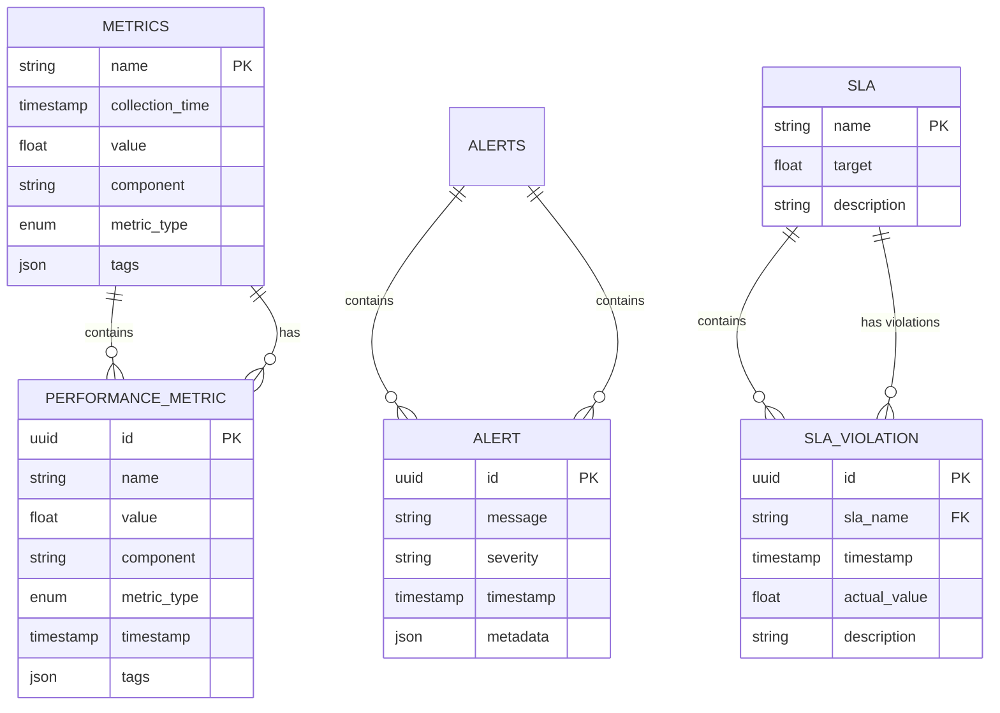

**Diagram sources **
- [self_improve/ultra_performance_monitoring.py](file://mahoun/self_improve/ultra_performance_monitoring.py#L21-L474)
- [core/metrics/decorators.py](file://mahoun/core/metrics/decorators.py#L27-L92)

**Section sources**
- [self_improve/ultra_performance_monitoring.py](file://mahoun/self_improve/ultra_performance_monitoring.py#L21-L474)
- [core/metrics/decorators.py](file://mahoun/core/metrics/decorators.py#L27-L92)

## Failure Modes and Fallback Strategies

The system implements robust fallback strategies to handle component failures and maintain availability. The base agent pattern includes circuit breakers, retry mechanisms, and fallback implementations. When a component fails, the system first retries with exponential backoff up to a maximum number of attempts. If retries fail, it activates the fallback implementation if enabled. For retrieval, this means falling back to dense-only search if BM25 is unavailable, or returning cached results if the primary retrieval fails. The system also includes graceful degradation, where it continues to operate with reduced functionality rather than failing completely. Error handling is centralized through the ErrorHandler class, which logs errors, records metrics, and determines the appropriate response. The fallback strategy ensures that the system always returns some results, even if they are not optimal, maintaining user experience during partial failures.

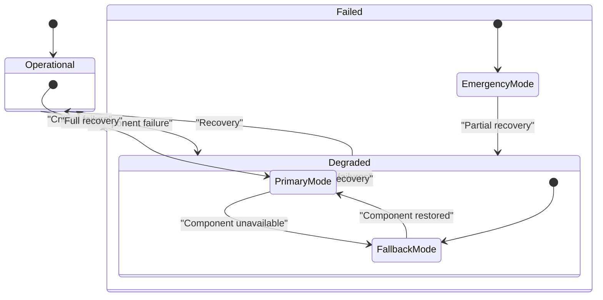

**Diagram sources **
- [agents/base_agent.py](file://mahoun/agents/base_agent.py#L408-L441)
- [core/error_handling.py](file://mahoun/core/error_handling.py#L111-L148)

**Section sources**
- [agents/base_agent.py](file://mahoun/agents/base_agent.py#L408-L441)
- [core/error_handling.py](file://mahoun/core/error_handling.py#L111-L148)

## Monitoring and Metrics

The system includes comprehensive monitoring and metrics collection through the UltraPerformanceMonitor. This component collects real-time metrics on latency, throughput, error rates, and resource usage. It includes anomaly detection using statistical methods and machine learning to identify performance deviations. The monitoring system tracks retrieval-specific metrics such as relevance scores and cache hit rates. Metrics are collected at multiple levels, from individual function calls to system-wide performance. The system uses decorators to automatically instrument functions for timing measurement. Alert management includes deduplication to prevent alert storms, with configurable severity levels from INFO to CRITICAL. Performance data is used for both real-time monitoring and long-term analysis, including comparative analysis across versions to detect regressions. The monitoring capabilities provide full visibility into system performance and reliability.

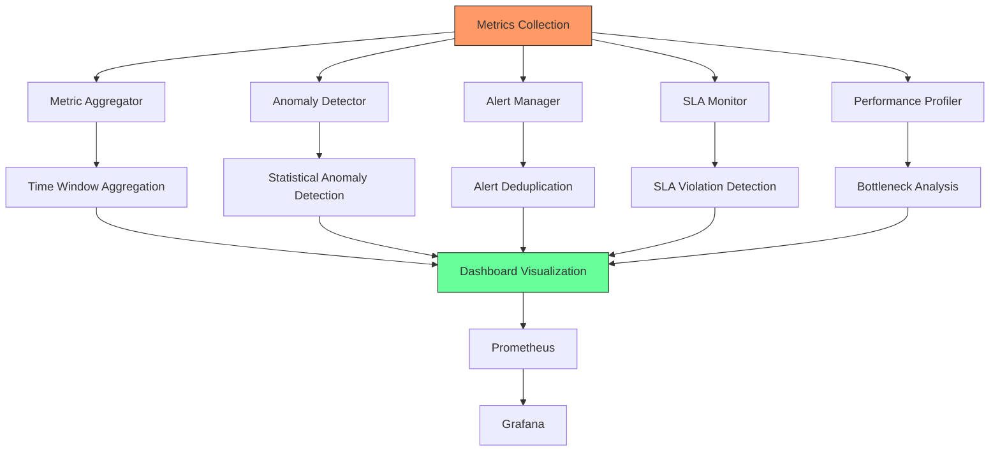

**Diagram sources **
- [self_improve/ultra_performance_monitoring.py](file://mahoun/self_improve/ultra_performance_monitoring.py#L425-L474)
- [monitoring/prometheus/prometheus.yml](file://monitoring/prometheus/prometheus.yml)
- [monitoring/grafana/dashboards/main.json](file://monitoring/grafana/dashboards/main.json)

**Section sources**
- [self_improve/ultra_performance_monitoring.py](file://mahoun/self_improve/ultra_performance_monitoring.py#L425-L474)

## Conclusion

The hybrid retrieval system provides a comprehensive solution for legal document search, combining multiple retrieval paradigms to deliver accurate and relevant results. By integrating sparse, dense, and graph-based retrieval with sophisticated fusion algorithms, the system captures both keyword matches and semantic relationships. The architecture is designed for high performance and reliability, with caching, fallback strategies, and comprehensive monitoring. Specialized support for Persian language content ensures effective retrieval from Iranian legal documents. The system's modular design allows for continuous improvement, with components that can be enhanced or replaced independently. The combination of advanced retrieval techniques with robust engineering practices results in a powerful and reliable search system suitable for demanding legal applications.