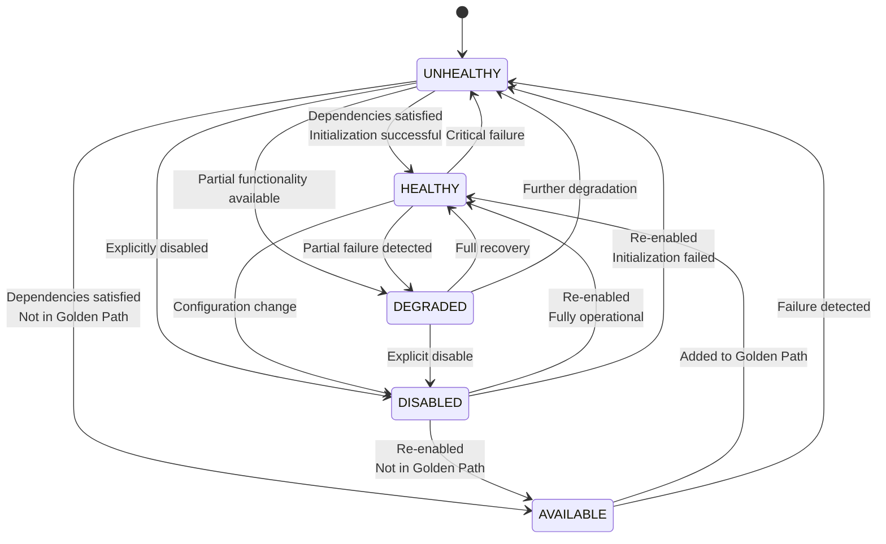
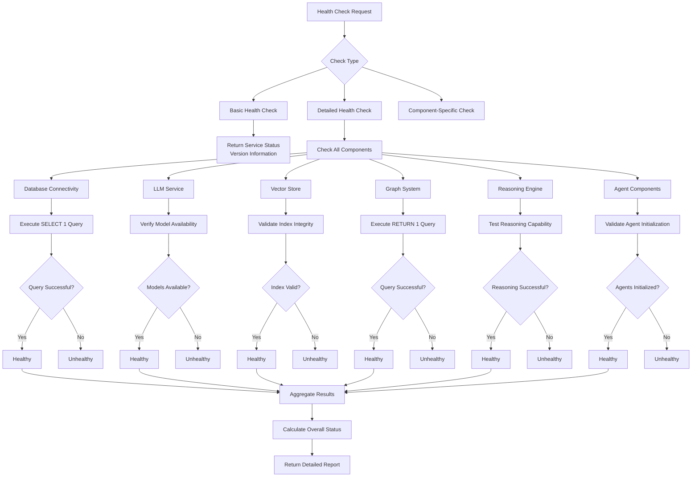
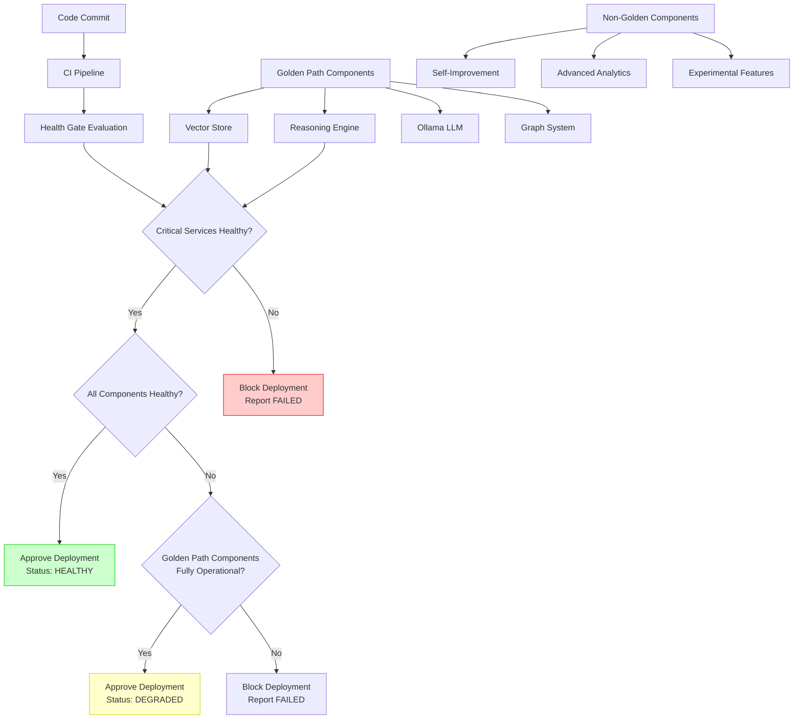
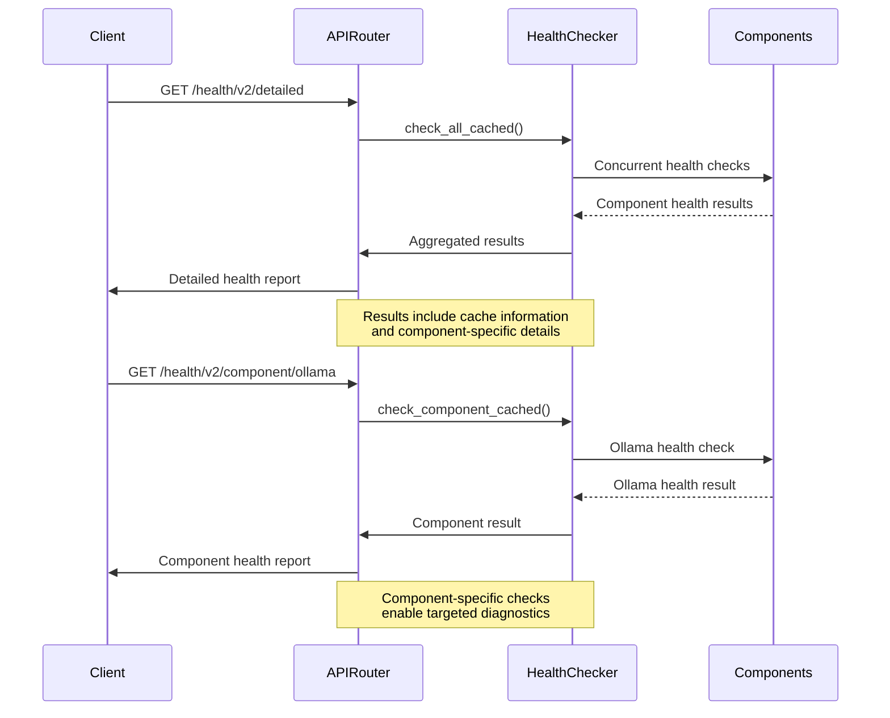
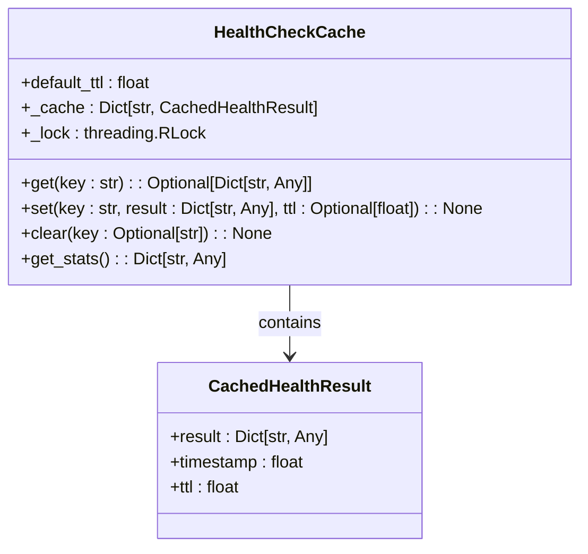
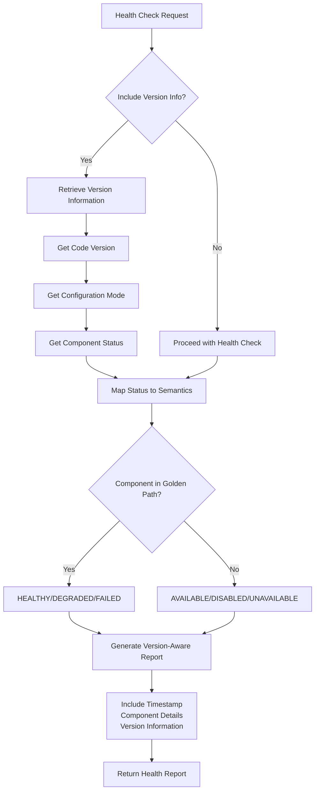
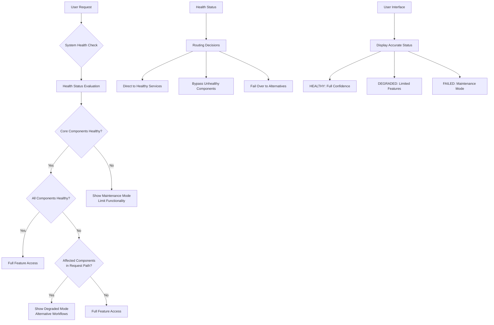
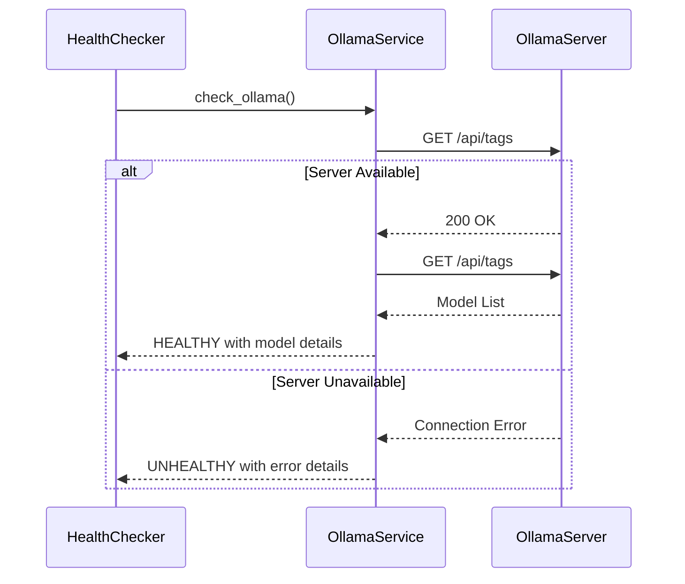
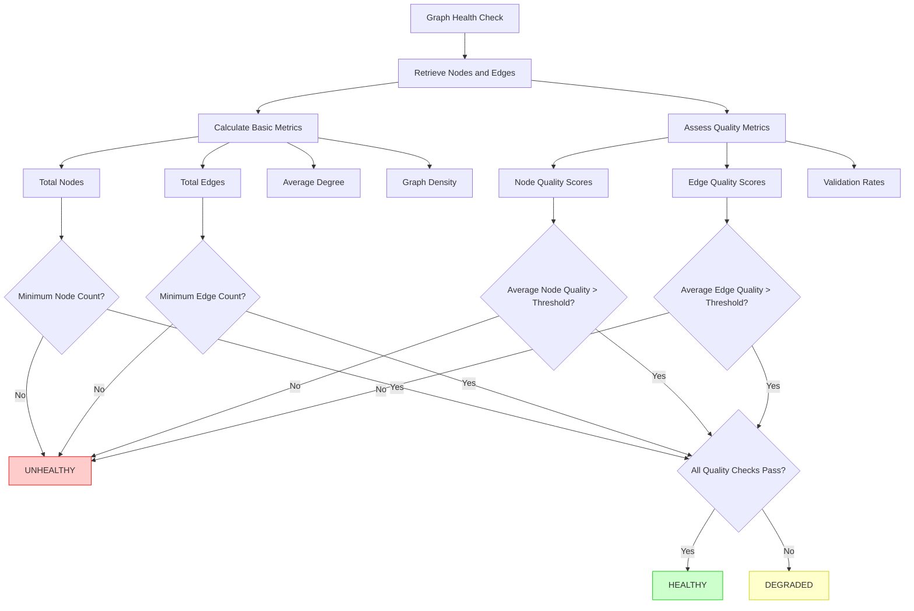

# Health-First Design

<cite>
**Referenced Files in This Document**   
- [health_checker.py](file://mahoun/core/health_checker.py)
- [health_cache.py](file://mahoun/core/health_cache.py)
- [system.py](file://api/routers/system.py)
- [health_v2.py](file://api/routers/health_v2.py)
- [HEALTH_STATUS_SEMANTIC_CORRECTION.md](file://HEALTH_STATUS_SEMANTIC_CORRECTION.md)
- [test_real_health_checks.py](file://tests/test_real_health_checks.py)
- [test_health_checker_gating.py](file://tests/test_health_checker_gating.py)
- [ultra_graph_builder.py](file://mahoun/graph/ultra_graph_builder.py)
- [knowledge_graph.py](file://mahoun/reasoning/knowledge_graph.py)
- [ollama_llm.py](file://mahoun/pipelines/llm/ollama_llm.py)
</cite>

## Table of Contents
1. [Introduction](#introduction)
2. [Health Status Semantics](#health-status-semantics)
3. [Multi-Level Health Checks](#multi-level-health-checks)
4. [Health Gate System](#health-gate-system)
5. [Real-Time Health Monitoring](#real-time-health-monitoring)
6. [Health Cache Mechanism](#health-cache-mechanism)
7. [Version-Aware Health Reporting](#version-aware-health-reporting)
8. [Health-Aware Routing and User Experience](#health-aware-routing-and-user-experience)
9. [Health Check Implementation Examples](#health-check-implementation-examples)
10. [Conclusion](#conclusion)

## Introduction

The Health-First Design philosophy is a foundational principle in the MAHOUN platform architecture, ensuring system reliability, integrity, and truthfulness. This documentation details the comprehensive health monitoring infrastructure that validates system integrity at multiple levels, from infrastructure connectivity to semantic correctness. The system implements a rigorous health gate mechanism that prevents deployment of compromised versions and provides real-time visibility into system health. This approach ensures that the platform never presents a false sense of operational status and maintains clear separation between runtime survival and truth reporting.

**Section sources**
- [HEALTH_STATUS_SEMANTIC_CORRECTION.md](file://HEALTH_STATUS_SEMANTIC_CORRECTION.md)

## Health Status Semantics

The MAHOUN platform implements a precise health status enumeration with clearly defined semantics to ensure truthful reporting and prevent misleading status indications. The system distinguishes between different states of component availability and functionality, ensuring that health reporting reflects actual operational capability rather than mere runtime survival.

The health status model includes five distinct states:

- **HEALTHY**: Component is actively used in the Golden Path and is fully operational
- **AVAILABLE**: Component exists and is functional but not used in the Golden Path
- **DISABLED**: Component is explicitly turned off by design or configuration
- **UNAVAILABLE**: Component dependency is missing or cannot be initialized
- **DEGRADED**: Component is used in the Golden Path but partially impaired

This semantic model enforces truthfulness in health reporting by requiring runtime evidence for HEALTHY status, separating runtime survival from truth reporting, and mandating that missing dependencies be reported as UNAVAILABLE rather than HEALTHY. The system ensures that a component with `initialized=false` can never be reported as HEALTHY, preventing false positive health indications.

**Diagram sources**
- [HEALTH_STATUS_SEMANTIC_CORRECTION.md](file://HEALTH_STATUS_SEMANTIC_CORRECTION.md#L9-L13)

## Multi-Level Health Checks

The MAHOUN platform implements comprehensive health checks at multiple levels, ensuring system integrity, component readiness, and semantic correctness. The health checking system performs actual connectivity tests rather than relying on placeholder responses, verifying that components are not only running but also functionally operational.

The health checking infrastructure includes:

1. **System Integrity Checks**: Verifying connectivity to critical infrastructure components including PostgreSQL, Neo4j, and Redis through actual database queries
2. **Component Readiness Checks**: Validating that individual components such as Ollama LLM service, VectorStore, and reasoning engines are properly initialized and responsive
3. **Semantic Correctness Checks**: Ensuring that components not only respond but return semantically correct results that meet quality standards

The system performs real connectivity tests for database health checks, executing actual queries like `SELECT 1` for PostgreSQL and `RETURN 1` for Neo4j to verify functional connectivity rather than merely checking process availability. This approach ensures that health status reflects actual operational capability rather than mere process existence.

**Diagram sources**
- [system.py](file://api/routers/system.py#L26-L207)
- [health_checker.py](file://mahoun/core/health_checker.py#L69-L568)

## Health Gate System

The MAHOUN platform implements a robust health gate system that prevents deployment of compromised versions by enforcing strict health requirements before allowing code to progress through the CI/CD pipeline. This system acts as a quality enforcement mechanism, ensuring that only healthy, fully functional components are deployed to production environments.

The health gate system operates on the principle that critical core services must be HEALTHY for the overall system status to be considered HEALTHY. The system specifically identifies Vector Store and Reasoning components as critical to the Golden Path, meaning their health directly affects the overall system status. If either of these components is UNHEALTHY, the entire system status is reported as FAILED, preventing deployment.

The gate system evaluates health based on actual component states rather than superficial indicators. It calculates overall status by counting healthy and unhealthy components, ensuring that the status reflects the true operational state of the system. The system also handles special cases such as the desktop_minimal mode, which correctly returns a DEGRADED status rather than a misleading OK response when operating with reduced functionality.

**Diagram sources**
- [health_checker.py](file://mahoun/core/health_checker.py#L595-L659)
- [test_health_checker_gating.py](file://tests/test_health_checker_gating.py#L8-L68)

## Real-Time Health Monitoring

The MAHOUN platform provides comprehensive real-time health monitoring infrastructure that delivers immediate visibility into system status and performance. The monitoring system exposes multiple endpoints for different use cases, from lightweight status checks to detailed diagnostic information.

The monitoring infrastructure includes:

1. **Basic Health Check**: A lightweight endpoint that verifies API responsiveness without performing intensive checks
2. **Detailed Health Check**: A comprehensive endpoint that evaluates all system components and returns detailed status information
3. **Component-Specific Health Check**: Targeted checks for individual components, allowing focused diagnostics
4. **System Health Endpoint**: Production-grade checks that perform actual connectivity tests with databases and services

The system ensures that all health responses include a timestamp in ISO format, providing temporal context for health assessments. The detailed health check includes component-specific latency measurements, enabling performance analysis and bottleneck identification. The monitoring system also tracks historical health data and failure patterns, supporting root cause analysis and system improvement.

**Diagram sources**
- [health_v2.py](file://api/routers/health_v2.py#L48-L149)
- [system.py](file://api/routers/system.py#L26-L207)

## Health Cache Mechanism

The MAHOUN platform implements a sophisticated health check caching mechanism to optimize performance and reduce system load while maintaining accurate health information. The cache prevents excessive health check calls, which could otherwise impact system performance and create unnecessary load on dependent services.

The health cache is thread-safe and supports TTL-based expiration, ensuring that cached results are refreshed periodically to maintain accuracy. The cache operates at multiple levels:

1. **All Components Cache**: Stores the complete health check result for a configurable TTL (default: 30 seconds)
2. **Individual Component Cache**: Allows caching of specific component health checks independently
3. **Configurable TTL**: Enables different expiration times for different components based on their volatility

The cache implementation uses a reentrant lock (RLock) to ensure thread safety during concurrent access. It provides statistics on cache usage, including cache size and cached keys, supporting performance monitoring and optimization. The system allows clients to control cache behavior through request parameters, enabling bypass of the cache when real-time health information is required.

**Diagram sources**
- [health_cache.py](file://mahoun/core/health_cache.py#L24-L103)

## Version-Aware Health Reporting

The MAHOUN platform implements version-aware health reporting that correlates health status with specific system versions and configurations. This approach enables accurate tracking of health trends across deployments and facilitates root cause analysis when issues arise.

The health reporting system includes version information in its responses, allowing correlation of health status with specific code versions. The system also tracks configuration modes (such as desktop_minimal) and reports health status accordingly, recognizing that certain components may be intentionally disabled in specific configurations rather than being truly unhealthy.

The reporting system distinguishes between different types of component states, recognizing that a DISABLED component is intentionally turned off and does not represent a failure, while an UNAVAILABLE component indicates a missing dependency that may require attention. This nuanced reporting prevents false alarms while maintaining visibility into the true operational state of the system.

**Diagram sources**
- [system.py](file://api/routers/system.py#L196-L207)
- [HEALTH_STATUS_SEMANTIC_CORRECTION.md](file://HEALTH_STATUS_SEMANTIC_CORRECTION.md#L17-L26)

## Health-Aware Routing and User Experience

The MAHOUN platform uses health status to inform routing decisions and shape the user experience, ensuring that users are directed to fully functional components and are appropriately informed about system capabilities. This health-aware approach enhances reliability and sets accurate user expectations.

When the system detects that certain components are DEGRADED or UNAVAILABLE, it adjusts routing to bypass affected components when possible, directing requests to healthy alternatives. For components that are essential to the Golden Path, the system may limit functionality or provide graceful degradation rather than complete failure.

The user experience is tailored to the current health status, with appropriate messaging that accurately reflects the system's capabilities. For example, when operating in desktop_minimal mode with certain components disabled, the system correctly reports a DEGRADED status rather than a misleading OK response, setting appropriate user expectations about available functionality.

**Diagram sources**
- [system.py](file://api/routers/system.py#L174-L191)
- [health_checker.py](file://mahoun/core/health_checker.py#L595-L659)

## Health Check Implementation Examples

The MAHOUN platform provides concrete examples of health check implementations for critical system components, demonstrating the practical application of the health-first design philosophy.

### Database Connectivity Health Check

The database connectivity health check performs actual queries against PostgreSQL, Neo4j, and Redis to verify functional connectivity. For PostgreSQL, it executes a `SELECT 1` query; for Neo4j, it runs a `RETURN 1` Cypher query; and for Redis, it sends a PING command. This approach ensures that the health status reflects actual database functionality rather than mere process availability.

**Section sources**
- [system.py](file://api/routers/system.py#L56-L84)
- [system.py](file://api/routers/system.py#L99-L128)
- [system.py](file://api/routers/system.py#L143-L166)

### Model Availability Health Check

The Ollama LLM service health check verifies model availability by first checking if the Ollama server is accessible and then listing available models. The check confirms that the service can communicate with the Ollama API and that the expected models are loaded and ready for inference.

**Diagram sources**
- [health_checker.py](file://mahoun/core/health_checker.py#L69-L132)
- [ollama_llm.py](file://mahoun/pipelines/llm/ollama_llm.py#L51-L59)

### Knowledge Graph Consistency Health Check

The knowledge graph health check verifies the consistency and quality of the legal knowledge graph by assessing node and edge quality, validation rates, and structural metrics such as density and clustering coefficient. The check ensures that the graph maintains high-quality connections and that nodes have sufficient properties and evidence.

**Diagram sources**
- [ultra_graph_builder.py](file://mahoun/graph/ultra_graph_builder.py#L114-L163)
- [knowledge_graph.py](file://mahoun/reasoning/knowledge_graph.py#L59-L70)

## Conclusion

The Health-First Design philosophy in the MAHOUN platform represents a comprehensive approach to system reliability and integrity. By implementing multi-level health checks, a robust health gate system, and real-time monitoring infrastructure, the platform ensures that health status accurately reflects operational capability rather than mere runtime survival. The health cache mechanism optimizes performance while maintaining accuracy, and version-aware reporting enables effective tracking of health trends across deployments. Health status directly influences routing decisions and user experience, ensuring that users have accurate expectations about system capabilities. The concrete implementation examples for database connectivity, model availability, and knowledge graph consistency demonstrate the practical application of these principles, creating a system that is both resilient and truthful in its health reporting.