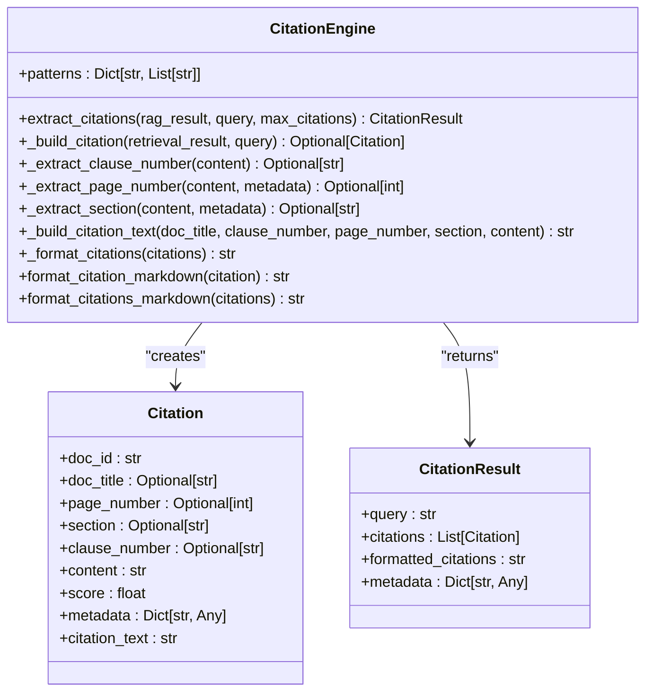
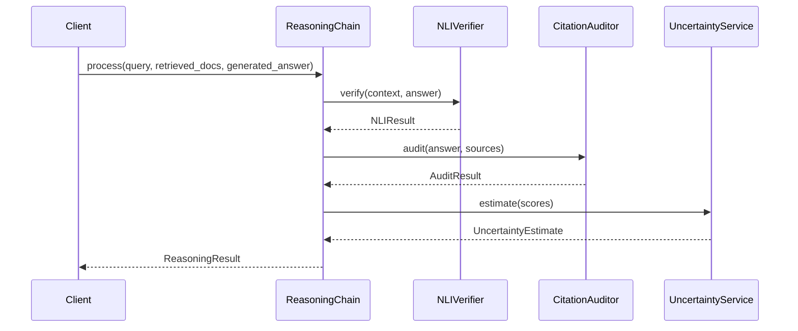
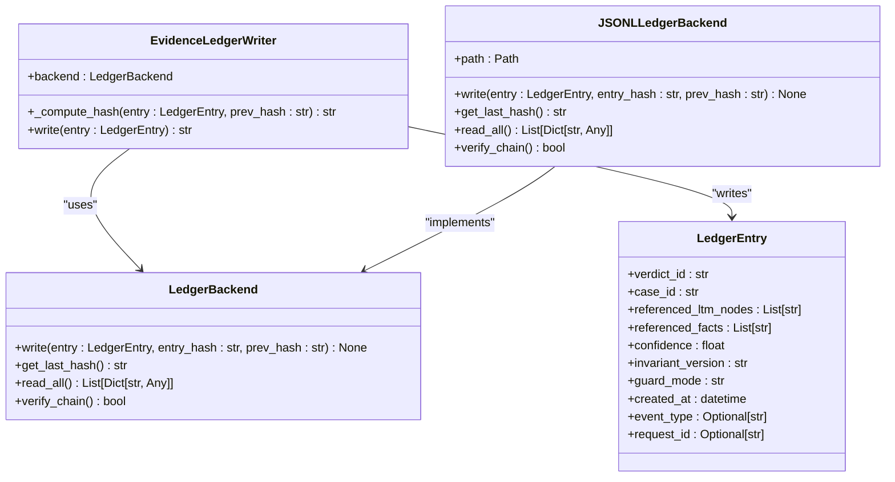
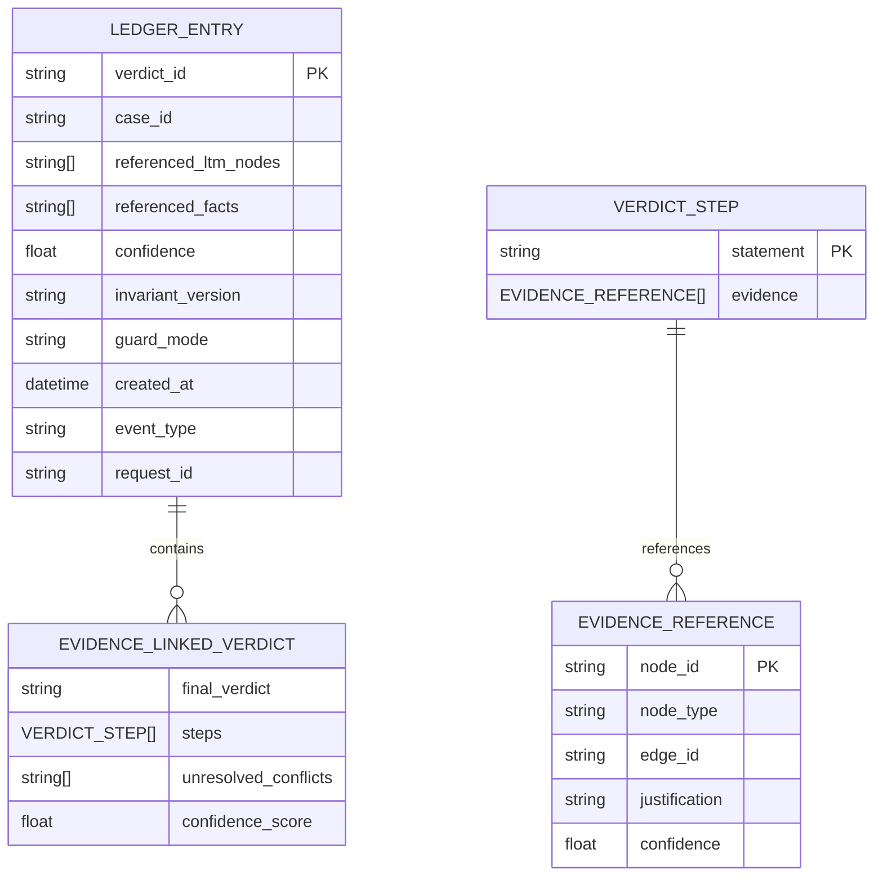
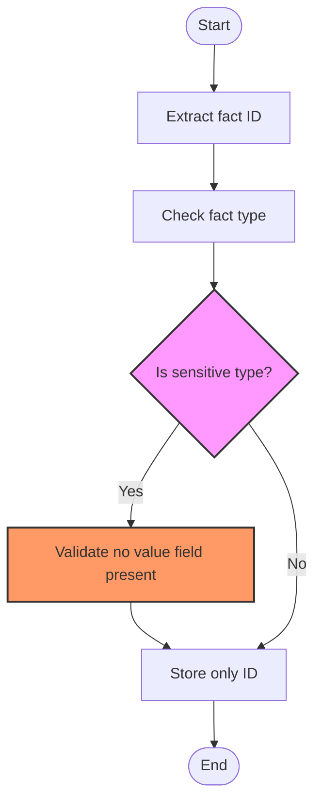
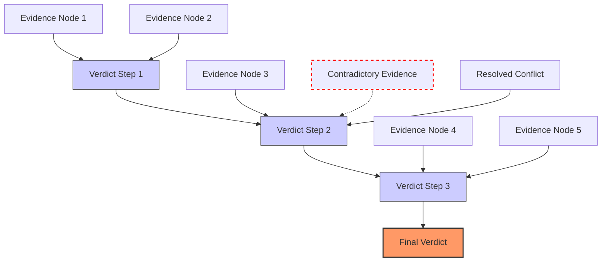
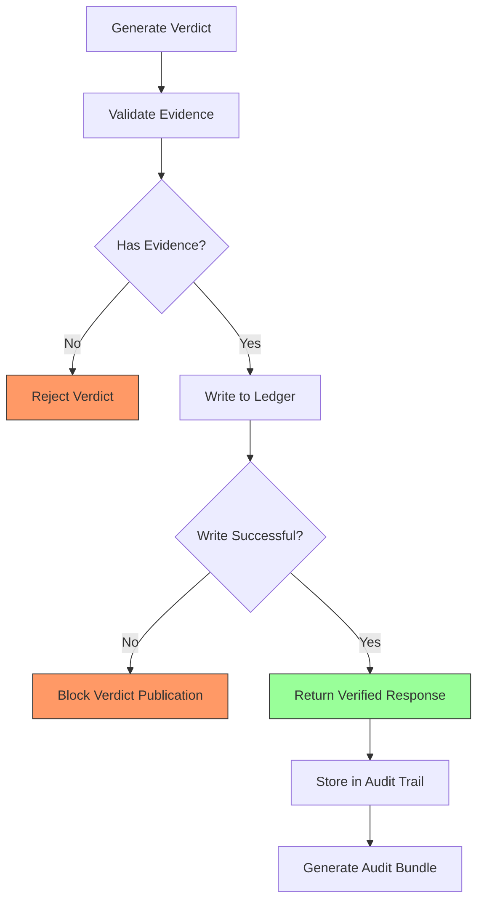

# Provenance Tracking

<cite>
**Referenced Files in This Document**   
- [citation_engine.py](file://mahoun/rag/citation_engine.py)
- [evidence_linked_verdict.py](file://mahoun/reasoning/evidence_linked_verdict.py)
- [ultra_nli_verifier.py](file://mahoun/guardrails/ultra_nli_verifier.py)
- [writer.py](file://mahoun/ledger/writer.py)
- [models.py](file://mahoun/ledger/models.py)
- [privacy.py](file://mahoun/ledger/privacy.py)
- [guards.py](file://mahoun/ledger/guards.py)
- [ledger_invariants.py](file://mahoun/invariants/ledger_invariants.py)
- [document_citation_graph.py](file://mahoun/graph/document_citation_graph.py)
- [reasoning_chain.py](file://mahoun/reasoning/reasoning_chain.py)
- [EXPLANATION_PROVENANCE_LAYER_SPEC.md](file://docs/EXPLANATION_PROVENANCE_LAYER_SPEC.md)
</cite>

## Table of Contents
1. [Introduction](#introduction)
2. [Provenance Architecture Overview](#provenance-architecture-overview)
3. [Citation Engine Implementation](#citation-engine-implementation)
4. [NLI Verifier and Guardrails](#nli-verifier-and-guardrails)
5. [Hash-Chained Ledger System](#hash-chained-ledger-system)
6. [Provenance Data Structure and Storage](#provenance-data-structure-and-storage)
7. [Privacy-Preserving Provenance](#privacy-preserving-provenance)
8. [Provenance Graphs and Dispute Resolution](#provenance-graphs-and-dispute-resolution)
9. [Auditability and Compliance](#auditability-and-compliance)
10. [Conclusion](#conclusion)

## Introduction

The provenance tracking system in MAHOUN provides a comprehensive framework for maintaining traceability from source documents to final responses through citation chains, evidence linking, and ledger-based verification. This system ensures response authenticity by implementing a citation engine, NLI verifier, and hash-chained ledger that work together to create verifiable references. The architecture is designed to support auditability and compliance while preserving privacy in sensitive domains such as healthcare and financial services. The system captures and serializes core-produced artifacts including applied rules, conflict-resolution outcomes, temporal precedence decisions, evidence links, and graph paths used in decision-making, providing a deterministic proof pack that can be archived and verified without re-executing inference.

**Section sources**
- [EXPLANATION_PROVENANCE_LAYER_SPEC.md](file://docs/EXPLANATION_PROVENANCE_LAYER_SPEC.md#L25-L168)

## Provenance Architecture Overview

The provenance tracking system follows a layered architecture that separates decision authority from explanation generation. The core reasoning engine produces authoritative decision artifacts, while the provenance layer generates non-authoritative explanation artifacts derived from these decisions. This separation ensures that the explanation system cannot influence the core reasoning path while still providing comprehensive audit trails.

```mermaid
graph TD
Input --> ExplicitGraphBuilder --> RuleBasedReasoningCore --> Verdict + ProofTrace
Verdict + ProofTrace --> ExplanationProvenanceLayer
ExplanationProvenanceLayer --> Reports
ExplanationProvenanceLayer --> UI
ExplanationProvenanceLayer --> Audit
ExplanationProvenanceLayer --> Export
```

**Diagram sources**
- [EXPLANATION_PROVENANCE_LAYER_SPEC.md](file://docs/EXPLANATION_PROVENANCE_LAYER_SPEC.md#L48-L53)

The system's authority boundary is strictly defined: only the Rule-Based Reasoning Core has decision authority. The Explanation & Provenance Layer is non-authoritative and can be safely disabled at runtime without affecting core inference or verdict production. This design ensures decision invariance even if the provenance layer fails.

**Section sources**
- [EXPLANATION_PROVENANCE_LAYER_SPEC.md](file://docs/EXPLANATION_PROVENANCE_LAYER_SPEC.md#L46-L57)

## Citation Engine Implementation

The citation engine extracts and formats citations from retrieval results, providing precise references to clauses and documents. It uses pattern matching to identify citation information such as clause numbers, page numbers, and sections from both content and metadata.



**Diagram sources**
- [citation_engine.py](file://mahoun/rag/citation_engine.py#L25-L335)

The engine processes retrieval results from the HybridRAGService, extracting citation details and formatting them according to specified standards. It supports multiple output formats including plain text and Markdown, with formatted citations that include document title, clause number, page number, and section information.

**Section sources**
- [citation_engine.py](file://mahoun/rag/citation_engine.py#L25-L335)

## NLI Verifier and Guardrails

The NLI verifier and guardrails system ensures the validity and accuracy of responses through natural language inference and citation auditing. The UltraNLIVerifier performs entailment checking to verify that answers are supported by the provided context, while the UltraCitationAuditor validates citation accuracy and completeness.



**Diagram sources**
- [reasoning_chain.py](file://mahoun/reasoning/reasoning_chain.py#L210-L302)
- [ultra_nli_verifier.py](file://mahoun/guardrails/ultra_nli_verifier.py#L656-L743)

The reasoning chain integrates NLI verification, citation auditing, and uncertainty estimation into a unified pipeline with configurable modes (strict, fast, disabled). In strict mode, required for production and legal compliance, failures in verification are critical and will raise exceptions. The system provides comprehensive statistics on verification outcomes and processing times.

**Section sources**
- [reasoning_chain.py](file://mahoun/reasoning/reasoning_chain.py#L1-L608)
- [ultra_nli_verifier.py](file://mahoun/guardrails/ultra_nli_verifier.py#L1-L743)

## Hash-Chained Ledger System

The evidence ledger implements a hash-chained integrity system that ensures tamper detection and provides a verifiable audit trail. Each entry's hash depends on all previous entries, creating a cryptographic chain that enables detection of any modifications.



**Diagram sources**
- [writer.py](file://mahoun/ledger/writer.py#L1-L371)
- [models.py](file://mahoun/ledger/models.py#L1-L21)

The ledger enforces several critical invariants including evidence requirements, immutability, and privacy preservation. The hash computation includes both the entry content and the previous hash, ensuring that any modification to an entry will break the chain. The system supports multiple backend storage options including JSONL files and SQLite databases.

**Section sources**
- [writer.py](file://mahoun/ledger/writer.py#L1-L371)
- [models.py](file://mahoun/ledger/models.py#L1-L21)

## Provenance Data Structure and Storage

The provenance system structures data according to a minimum data contract that includes the verdict, trace identifier, input digest, graph digest, applied steps, conflicts, evidence links, and other decision artifacts. This structure ensures that audit trails contain sufficient information to validate decisions without re-executing inference.



**Diagram sources**
- [models.py](file://mahoun/ledger/models.py#L1-L21)
- [evidence_linked_verdict.py](file://mahoun/reasoning/evidence_linked_verdict.py#L36-L238)

The storage model includes two tiers: an ephemeral runtime store for debugging and development, and an audit store with append-only persistence for production use. Each stored trace includes metadata such as creation timestamp, schema version, producer version, and optional signatures for tamper evidence.

**Section sources**
- [EXPLANATION_PROVENANCE_LAYER_SPEC.md](file://docs/EXPLANATION_PROVENANCE_LAYER_SPEC.md#L133-L149)
- [writer.py](file://mahoun/ledger/writer.py#L1-L371)

## Privacy-Preserving Provenance

The provenance system implements strict privacy controls to prevent sensitive information from being stored in the evidence ledger. The privacy filtering system ensures that only opaque identifiers are stored, never the actual values of sensitive facts.



**Diagram sources**
- [privacy.py](file://mahoun/ledger/privacy.py#L1-L61)

The system defines sensitive fact types including PERSONAL_ID, MEDICAL, BIOMETRIC, and ADDRESS, which must never have their values stored in the ledger. The privacy filter validates that these sensitive types do not contain value fields and raises an error if they do. This ensures compliance with regulations such as HIPAA in healthcare contexts.

**Section sources**
- [privacy.py](file://mahoun/ledger/privacy.py#L1-L61)
- [ledger_invariants.py](file://mahoun/invariants/ledger_invariants.py#L1-L103)

## Provenance Graphs and Dispute Resolution

Provenance graphs visualize the reasoning chain and evidence links that support a verdict, providing a transparent view of how conclusions were reached. These graphs are used in dispute resolution scenarios to identify contradictions and validate the logical consistency of decisions.



**Diagram sources**
- [evidence_linked_verdict.py](file://mahoun/reasoning/evidence_linked_verdict.py#L36-L238)
- [test_mega_stress.py](file://tests/test_mega_stress.py#L227-L257)

The evidence-linked verdict structure includes explicit evidence references for each reasoning step, with justification and confidence scores. Unresolved conflicts are explicitly identified in the verdict, preventing the system from producing hallucinated conclusions when contradictions cannot be resolved. This transparency enables effective dispute resolution by clearly showing which evidence supports or contradicts the final decision.

**Section sources**
- [evidence_linked_verdict.py](file://mahoun/reasoning/evidence_linked_verdict.py#L36-L238)
- [test_mega_stress.py](file://tests/test_mega_stress.py#L227-L257)

## Auditability and Compliance

The provenance system ensures auditability and compliance through a comprehensive set of invariants and verification mechanisms. The evidence ledger invariants define non-negotiable guarantees that maintain system integrity and legal trustworthiness.



**Diagram sources**
- [guards.py](file://mahoun/ledger/guards.py#L1-L14)
- [writer.py](file://mahoun/ledger/writer.py#L1-L371)

The system enforces eight critical invariants including evidence requirements, immutability, verdict blocking on ledger failure, no resurrection of excluded nodes, audit sufficiency, and privacy preservation. These invariants are enforced at specific points in the codebase and violations have defined consequences that maintain the system's trustworthiness for legal decision-making.

**Section sources**
- [ledger_invariants.py](file://mahoun/invariants/ledger_invariants.py#L1-L103)
- [guards.py](file://mahoun/ledger/guards.py#L1-L14)

## Conclusion

The provenance tracking system in MAHOUN provides a robust framework for maintaining traceability from source documents to final responses. By implementing a citation engine, NLI verifier, and hash-chained ledger, the system ensures response authenticity and supports comprehensive auditability. The architecture separates decision authority from explanation generation, preserving the integrity of the core reasoning process while providing transparent provenance data. Privacy-preserving mechanisms prevent sensitive information from being exposed in audit trails, ensuring compliance with regulations in sensitive domains. The system's provenance graphs and deterministic proof packs enable effective dispute resolution and provide verifiable references that support legal compliance and trustworthiness.