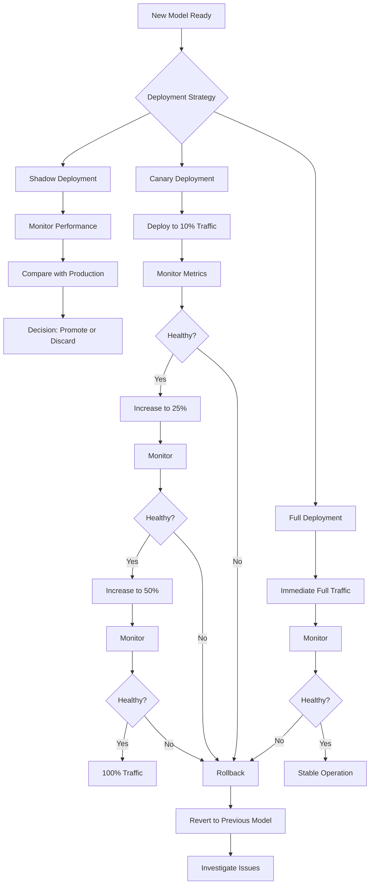
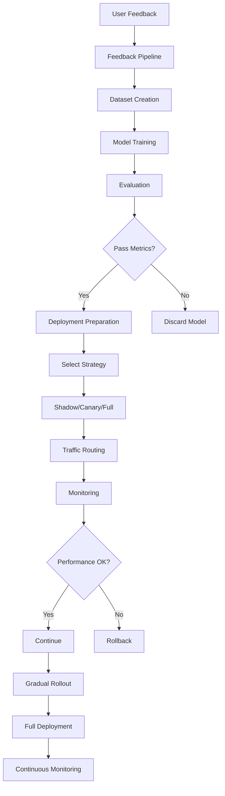
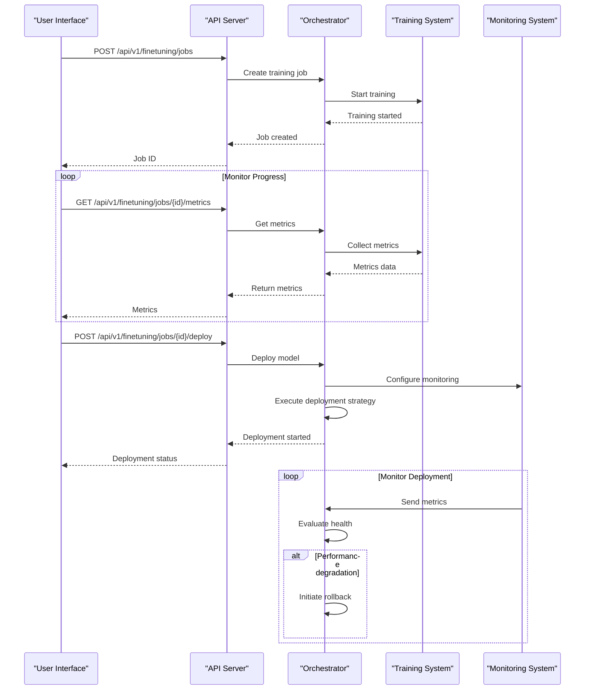
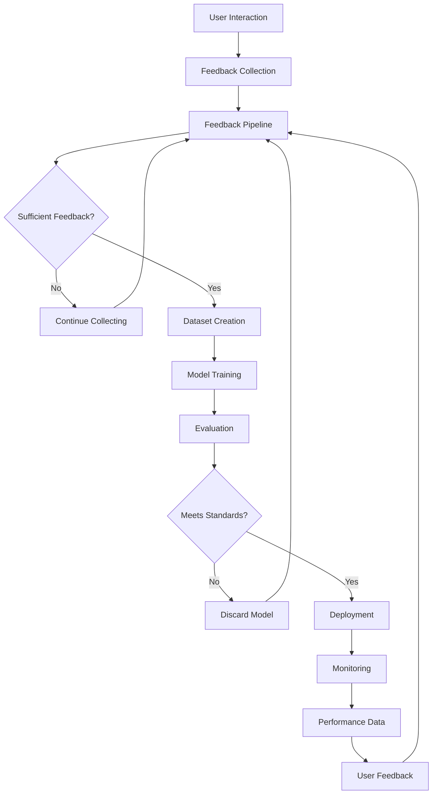
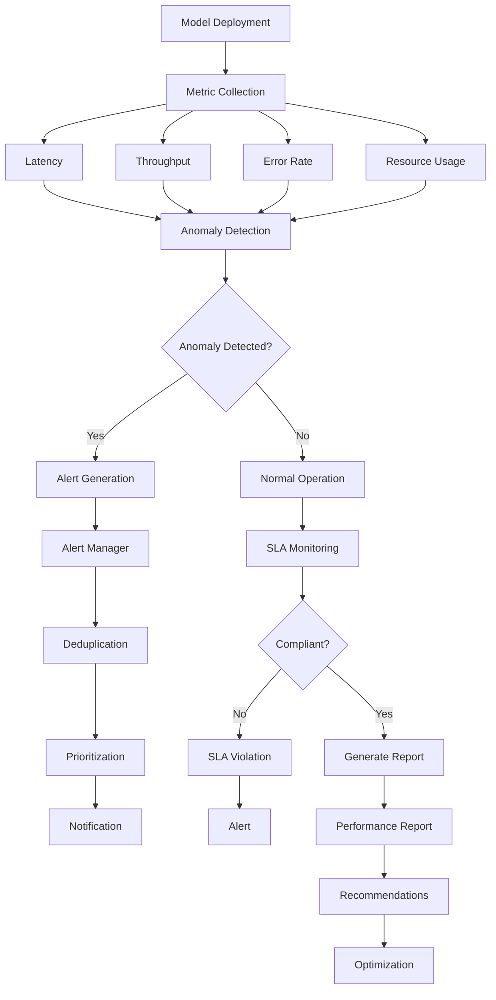

# Deployment Strategy

<cite>
**Referenced Files in This Document**   
- [DEPLOYMENT.md](file://docs/DEPLOYMENT.md)
- [finetuning.py](file://api/routers/finetuning.py)
- [trainer.py](file://mahoun/finetuning/trainer.py)
- [unsloth_runner.py](file://mahoun/finetuning/unsloth_runner.py)
- [ultra_orchestrator_complete.py](file://mahoun/self_improve/ultra_orchestrator_complete.py)
- [orchestrator.py](file://mahoun/orchestrator/orchestrator.py)
- [state_machine.py](file://mahoun/orchestrator/state_machine.py)
- [ultra_performance_monitoring.py](file://mahoun/self_improve/ultra_performance_monitoring.py)
- [ultra_self_improvement_system.py](file://mahoun/self_improve/ultra_self_improvement_system.py)
</cite>

## Table of Contents
1. [Introduction](#introduction)
2. [Deployment Strategies](#deployment-strategies)
3. [Deployment Pipeline](#deployment-pipeline)
4. [API Integration](#api-integration)
5. [Self-Improvement Loop](#self-improvement-loop)
6. [Monitoring and Verification](#monitoring-and-verification)
7. [Troubleshooting](#troubleshooting)
8. [Best Practices](#best-practices)

## Introduction

The deployment strategy for the Mahoun platform is designed to ensure reliable, scalable, and zero-downtime updates of fine-tuned models in production environments. The system supports multiple deployment strategies including shadow, canary, and full deployments, each serving different use cases and risk profiles. The deployment process is tightly integrated with the self-improvement loop, allowing models to be continuously enhanced based on user feedback and performance metrics. This document details the implementation of the deployment pipeline, traffic routing mechanisms, rollback procedures, and monitoring systems that ensure model quality and system stability.

**Section sources**
- [DEPLOYMENT.md](file://docs/DEPLOYMENT.md#L1-L77)

## Deployment Strategies

The Mahoun platform supports three primary deployment strategies: shadow, canary, and full deployment. Each strategy offers different levels of risk mitigation and validation capabilities.

**Shadow Deployment** runs the new model in parallel with the production model without serving any user traffic. This allows for comprehensive testing and performance comparison without impacting users. The shadow model processes the same inputs as the production model, and its outputs are logged for analysis but not returned to users.

**Canary Deployment** gradually rolls out the new model to a small percentage of user traffic, typically starting at 10% and increasing incrementally. This strategy provides a controlled environment for validating model performance with real user interactions while minimizing potential impact. The traffic percentage can be adjusted based on performance metrics and error rates.

**Full Deployment** immediately replaces the production model with the new version across all user traffic. This approach is suitable for high-confidence updates or when rapid deployment is required, but carries higher risk compared to gradual rollout strategies.

The orchestrator manages these deployment strategies through a state machine that tracks the deployment lifecycle, monitors health metrics, and handles automatic rollbacks when performance thresholds are breached.

**Diagram sources **
- [ultra_orchestrator_complete.py](file://mahoun/self_improve/ultra_orchestrator_complete.py#L650-L747)
- [orchestrator.py](file://mahoun/orchestrator/orchestrator.py#L660-L757)

**Section sources**
- [ultra_orchestrator_complete.py](file://mahoun/self_improve/ultra_orchestrator_complete.py#L60-L67)
- [orchestrator.py](file://mahoun/orchestrator/orchestrator.py#L660-L757)

## Deployment Pipeline

The deployment pipeline orchestrates the end-to-end process of model deployment, from training completion to production rollout. The pipeline consists of several stages: dataset preparation, model training, evaluation, deployment, and post-deployment monitoring.

The process begins with dataset preparation from user feedback, where feedback is collected, filtered by quality and rating, and converted into training examples. The dataset is then used to train a fine-tuned model using LoRA (Low-Rank Adaptation) or other parameter-efficient fine-tuning methods. During training, metrics such as loss, accuracy, and learning rate are continuously monitored and recorded.

Once training is complete, the model undergoes evaluation against predefined metrics before being deployed according to the selected strategy. The orchestrator manages the deployment process, handling traffic routing, health checks, and automatic rollbacks if necessary.

**Diagram sources **
- [trainer.py](file://mahoun/finetuning/trainer.py#L24-L187)
- [unsloth_runner.py](file://mahoun/finetuning/unsloth_runner.py#L32-L155)
- [state_machine.py](file://mahoun/orchestrator/state_machine.py#L210-L255)

**Section sources**
- [trainer.py](file://mahoun/finetuning/trainer.py#L24-L187)
- [unsloth_runner.py](file://mahoun/finetuning/unsloth_runner.py#L32-L155)

## API Integration

The deployment process is exposed through a comprehensive API that allows for programmatic control of the entire lifecycle. The API endpoints enable users to create datasets from feedback, start training jobs, monitor progress, and deploy models with specific strategies.

The `/api/v1/finetuning/jobs` endpoint creates and starts a new fine-tuning job, accepting configuration parameters such as model name, training mode, hyperparameters, and dataset information. The response includes a job ID that can be used to monitor the training progress.

The `/api/v1/finetuning/jobs/{job_id}/metrics` endpoint provides real-time access to training metrics, including loss, accuracy, learning rate, and resource utilization. This allows for continuous monitoring of the training process and early detection of potential issues.

The `/api/v1/finetuning/jobs/{job_id}/deploy` endpoint initiates the deployment of a trained model, accepting parameters such as deployment strategy, traffic percentage, and rollback policies. This endpoint triggers the orchestrator to begin the deployment process according to the specified strategy.

**Diagram sources **
- [finetuning.py](file://api/routers/finetuning.py#L319-L724)
- [ultra_orchestrator_complete.py](file://mahoun/self_improve/ultra_orchestrator_complete.py#L650-L747)

**Section sources**
- [finetuning.py](file://api/routers/finetuning.py#L319-L724)

## Self-Improvement Loop

The self-improvement loop is a closed feedback system that continuously enhances model performance through iterative cycles of data collection, training, and deployment. User interactions generate feedback that is collected and processed to create high-quality training datasets. These datasets are used to fine-tune models, which are then deployed and monitored for performance.

The loop begins with user interactions through the frontend interface, where users submit queries and provide feedback on the responses. This feedback is stored in the feedback pipeline and used to create training datasets when sufficient high-quality feedback has been collected.

The orchestrator monitors the feedback accumulation and automatically triggers the training process when predefined thresholds are met. After training and evaluation, the model is deployed using the appropriate strategy, and the cycle continues as new user interactions generate additional feedback.

This continuous improvement process ensures that the models adapt to changing user needs and domain requirements while maintaining high performance standards.

**Diagram sources **
- [ultra_self_improvement_system.py](file://mahoun/self_improve/ultra_self_improvement_system.py#L1-L800)
- [state_machine.py](file://mahoun/orchestrator/state_machine.py#L210-L255)

**Section sources**
- [ultra_self_improvement_system.py](file://mahoun/self_improve/ultra_self_improvement_system.py#L1-L800)
- [state_machine.py](file://mahoun/orchestrator/state_machine.py#L210-L255)

## Monitoring and Verification

Comprehensive monitoring and verification systems ensure the reliability and performance of deployed models. The ultra-performance monitoring system collects metrics across multiple dimensions, including latency, throughput, error rates, and resource utilization.

The monitoring system employs ML-based anomaly detection using techniques such as Isolation Forest and statistical methods to identify performance deviations. Alerts are triggered when metrics exceed predefined thresholds, with deduplication to prevent alert storms.

SLA (Service Level Agreement) monitoring tracks compliance with performance targets, generating reports on availability, response times, and error rates. The system also performs comparative analysis between model versions to quantify improvements or regressions.

Post-deployment verification includes automated testing against known benchmarks and validation datasets to ensure the model maintains expected performance levels. The monitoring data is integrated with the self-improvement loop, providing feedback for future model iterations.

**Diagram sources **
- [ultra_performance_monitoring.py](file://mahoun/self_improve/ultra_performance_monitoring.py#L425-L655)
- [state_machine.py](file://mahoun/orchestrator/state_machine.py#L152-L574)

**Section sources**
- [ultra_performance_monitoring.py](file://mahoun/self_improve/ultra_performance_monitoring.py#L425-L655)

## Troubleshooting

Common deployment issues include model performance regression, deployment failures, and resource constraints. The system provides comprehensive troubleshooting capabilities through detailed logging, monitoring dashboards, and automated diagnostics.

**Deployment Failures** can occur due to various reasons such as missing dependencies, insufficient resources, or configuration errors. The system logs detailed error information and provides clear error messages to facilitate rapid diagnosis and resolution.

**Performance Regressions** are detected through the monitoring system's anomaly detection capabilities. When a regression is identified, the system can automatically initiate a rollback to the previous stable version while alerting the operations team.

**Resource Constraints** such as GPU memory exhaustion or CPU overload are monitored and reported. The system provides recommendations for optimization, such as adjusting batch sizes or implementing more efficient model architectures.

The state machine maintains a complete history of state transitions, which is invaluable for diagnosing issues and understanding the system's behavior during failures. This history includes timestamps, durations, and metadata for each transition, enabling detailed post-mortem analysis.

**Section sources**
- [ultra_performance_monitoring.py](file://mahoun/self_improve/ultra_performance_monitoring.py#L164-L233)
- [state_machine.py](file://mahoun/orchestrator/state_machine.py#L80-L574)

## Best Practices

To ensure successful deployments and maintain system stability, several best practices should be followed:

**Use Gradual Rollouts** for new models, starting with shadow deployments to validate performance without impacting users, followed by canary deployments to gradually increase traffic exposure.

**Monitor Comprehensive Metrics** beyond just accuracy, including latency, error rates, resource utilization, and business-specific KPIs to get a complete picture of model performance.

**Implement Automated Rollbacks** with clear thresholds for performance degradation, allowing the system to automatically revert to a stable version when issues are detected.

**Maintain Detailed Logs** of all deployment activities, including configuration changes, metric trends, and user feedback, to support troubleshooting and continuous improvement.

**Test in Production-Like Environments** before deployment, using shadow mode to compare new models against production models with real traffic patterns.

**Document Deployment Procedures** and maintain runbooks for common scenarios, ensuring consistent processes across the team and facilitating knowledge sharing.

**Regularly Review and Update** deployment strategies based on accumulated experience and changing requirements, continuously improving the deployment process.

**Section sources**
- [DEPLOYMENT.md](file://docs/DEPLOYMENT.md#L1-L77)
- [ultra_orchestrator_complete.py](file://mahoun/self_improve/ultra_orchestrator_complete.py#L650-L747)