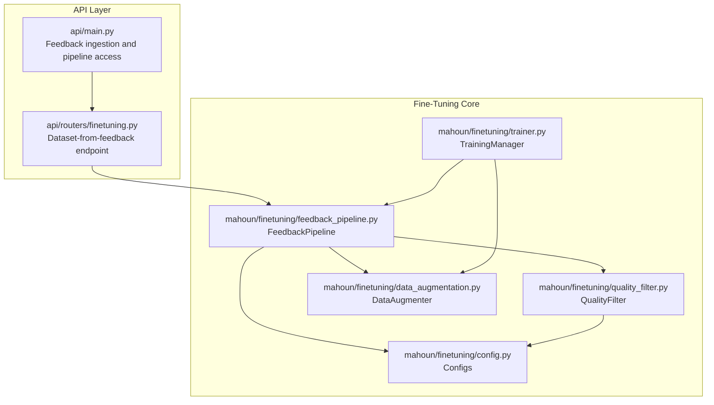
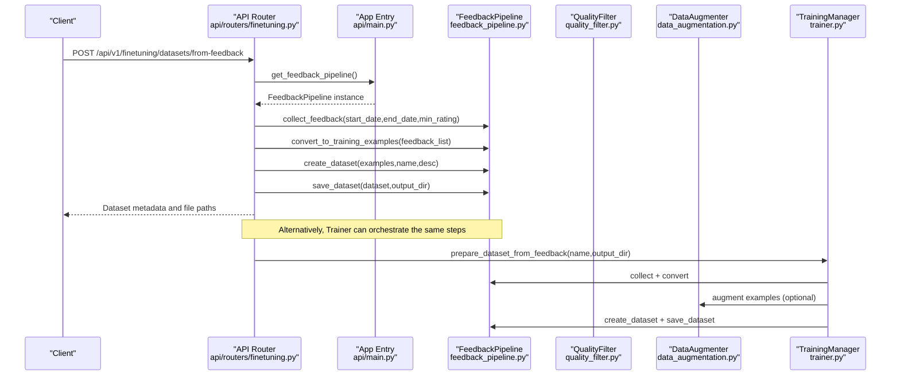
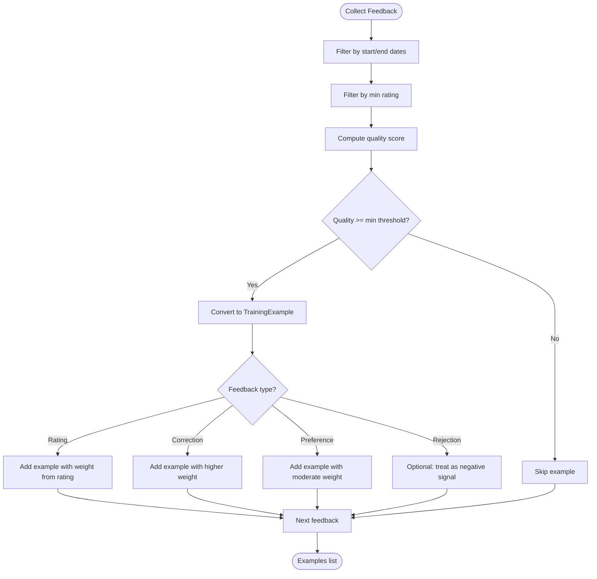
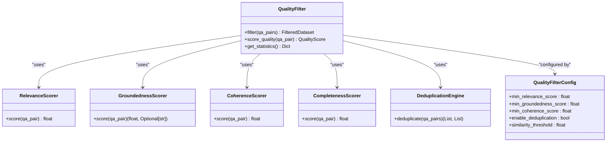
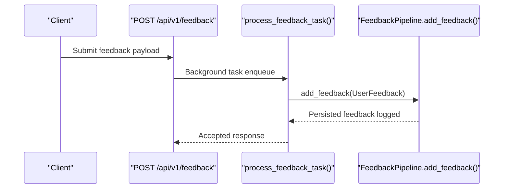
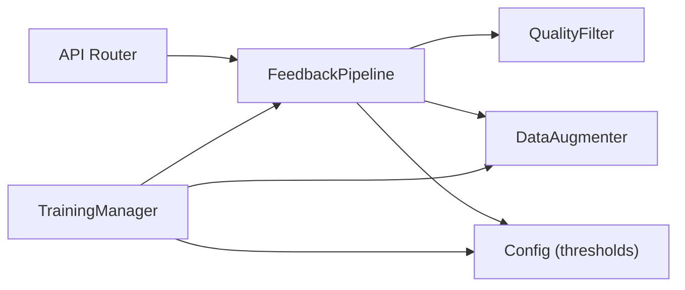

# Feedback Pipeline

<cite>
**Referenced Files in This Document**
- [feedback_pipeline.py](file://mahoun/finetuning/feedback_pipeline.py)
- [quality_filter.py](file://mahoun/finetuning/quality_filter.py)
- [config.py](file://mahoun/finetuning/config.py)
- [trainer.py](file://mahoun/finetuning/trainer.py)
- [data_augmentation.py](file://mahoun/finetuning/data_augmentation.py)
- [finetuning.py](file://api/routers/finetuning.py)
- [main.py](file://api/main.py)
</cite>

## Table of Contents
1. [Introduction](#introduction)
2. [Project Structure](#project-structure)
3. [Core Components](#core-components)
4. [Architecture Overview](#architecture-overview)
5. [Detailed Component Analysis](#detailed-component-analysis)
6. [Dependency Analysis](#dependency-analysis)
7. [Performance Considerations](#performance-considerations)
8. [Troubleshooting Guide](#troubleshooting-guide)
9. [Conclusion](#conclusion)
10. [Appendices](#appendices)

## Introduction
This document explains the feedback pipeline component that powers the self-improvement system. It focuses on how user feedback is collected, transformed into training signals, filtered for quality, and prepared for model fine-tuning. The pipeline ensures data quality by combining a lightweight feedback-to-training converter with enterprise-grade quality filtering and augmentation. It integrates with the API layer so that feedback submissions trigger dataset generation and training workflows.

## Project Structure
The feedback pipeline spans two primary areas:
- Core pipeline and quality filtering under the fine-tuning module
- API endpoints that accept feedback and orchestrate dataset creation and training

**Diagram sources**
- [main.py](file://api/main.py#L247-L357)
- [finetuning.py](file://api/routers/finetuning.py#L555-L641)
- [feedback_pipeline.py](file://mahoun/finetuning/feedback_pipeline.py#L111-L598)
- [quality_filter.py](file://mahoun/finetuning/quality_filter.py#L552-L763)
- [config.py](file://mahoun/finetuning/config.py#L1-L334)
- [trainer.py](file://mahoun/finetuning/trainer.py#L1-L195)
- [data_augmentation.py](file://mahoun/finetuning/data_augmentation.py#L1-L310)

**Section sources**
- [main.py](file://api/main.py#L247-L357)
- [finetuning.py](file://api/routers/finetuning.py#L555-L641)
- [feedback_pipeline.py](file://mahoun/finetuning/feedback_pipeline.py#L111-L598)
- [quality_filter.py](file://mahoun/finetuning/quality_filter.py#L552-L763)
- [config.py](file://mahoun/finetuning/config.py#L1-L334)
- [trainer.py](file://mahoun/finetuning/trainer.py#L1-L195)
- [data_augmentation.py](file://mahoun/finetuning/data_augmentation.py#L1-L310)

## Core Components
- FeedbackPipeline: Collects feedback, computes quality scores, converts to training examples, creates datasets, and saves them to disk.
- QualityFilter: Applies multi-dimensional quality scoring and deduplication to ensure groundedness and coherence.
- Trainer: Orchestrates dataset preparation from feedback, optional augmentation, and training job execution.
- DataAugmenter: Generates paraphrases and synonym replacements while preserving legal entities.
- API endpoints: Expose feedback submission and dataset creation from feedback, integrating with the pipeline.

Key configuration points:
- FeedbackPipeline thresholds for rating and quality score, and dataset split ratios.
- QualityFilterConfig thresholds for relevance, coherence, groundedness, and deduplication.
- TrainingConfig for base model, LoRA parameters, and training loop settings.

**Section sources**
- [feedback_pipeline.py](file://mahoun/finetuning/feedback_pipeline.py#L111-L598)
- [quality_filter.py](file://mahoun/finetuning/quality_filter.py#L552-L763)
- [config.py](file://mahoun/finetuning/config.py#L1-L334)
- [trainer.py](file://mahoun/finetuning/trainer.py#L1-L195)
- [data_augmentation.py](file://mahoun/finetuning/data_augmentation.py#L1-L310)
- [finetuning.py](file://api/routers/finetuning.py#L555-L641)
- [main.py](file://api/main.py#L247-L357)

## Architecture Overview
The feedback pipeline follows a clear flow from user input to training-ready datasets:

**Diagram sources**
- [finetuning.py](file://api/routers/finetuning.py#L555-L641)
- [main.py](file://api/main.py#L247-L357)
- [feedback_pipeline.py](file://mahoun/finetuning/feedback_pipeline.py#L111-L598)
- [quality_filter.py](file://mahoun/finetuning/quality_filter.py#L552-L763)
- [trainer.py](file://mahoun/finetuning/trainer.py#L1-L195)
- [data_augmentation.py](file://mahoun/finetuning/data_augmentation.py#L1-L310)

## Detailed Component Analysis

### FeedbackPipeline: Collection, Quality Scoring, Conversion, and Dataset Creation
Purpose:
- Persist feedback to disk, filter by date and rating, compute a composite quality score, convert to training examples, and produce train/eval/test splits.

Key behaviors:
- Storage: Stores feedback in a JSONL file with datetime and enum normalization.
- Filtering: Date range and minimum rating thresholds.
- Quality scoring: Combines rating, response time, confidence, and feedback type bonuses; corrections receive a special high score.
- Conversion: Produces training examples with source type, quality score, and weight; supports corrections and preferences.
- Dataset creation: Random shuffling and split calculation; metadata aggregation.
- Persistence: Saves train/eval/test splits and metadata to disk.

Practical example paths:
- Example usage and instantiation: [feedback_pipeline.py](file://mahoun/finetuning/feedback_pipeline.py#L546-L598)
- Quality score computation: [feedback_pipeline.py](file://mahoun/finetuning/feedback_pipeline.py#L284-L356)
- Conversion logic: [feedback_pipeline.py](file://mahoun/finetuning/feedback_pipeline.py#L219-L283)
- Dataset creation and saving: [feedback_pipeline.py](file://mahoun/finetuning/feedback_pipeline.py#L357-L491)

**Diagram sources**
- [feedback_pipeline.py](file://mahoun/finetuning/feedback_pipeline.py#L183-L283)
- [feedback_pipeline.py](file://mahoun/finetuning/feedback_pipeline.py#L284-L356)

**Section sources**
- [feedback_pipeline.py](file://mahoun/finetuning/feedback_pipeline.py#L111-L598)

### QualityFilter: Multi-Dimensional Quality Scoring and Deduplication
Purpose:
- Enforce groundedness (Mahoun I1 invariant), coherence, relevance, and completeness; remove duplicates; and report statistics.

Key behaviors:
- Scorers: Relevance (embedding-based or fallback), groundedness (evidence-linking), coherence (linguistic quality), completeness (information density).
- Thresholds: Configurable minimum scores for each dimension.
- Deduplication: Hash-based exact deduplication followed by semantic deduplication using embeddings or fallback.
- Reporting: Failure reasons, quality distribution, duplicates removed, and totals.

Practical example paths:
- Main filter entry: [quality_filter.py](file://mahoun/finetuning/quality_filter.py#L590-L763)
- Groundedness scoring: [quality_filter.py](file://mahoun/finetuning/quality_filter.py#L166-L216)
- Deduplication engine: [quality_filter.py](file://mahoun/finetuning/quality_filter.py#L416-L546)

**Diagram sources**
- [quality_filter.py](file://mahoun/finetuning/quality_filter.py#L552-L763)
- [config.py](file://mahoun/finetuning/config.py#L101-L131)

**Section sources**
- [quality_filter.py](file://mahoun/finetuning/quality_filter.py#L552-L763)
- [config.py](file://mahoun/finetuning/config.py#L101-L131)

### DataAugmentation: Entity-Preserving Paraphrasing and Synonym Replacement
Purpose:
- Increase dataset size and diversity while preserving legal entities.

Key behaviors:
- Legal entity extraction with overlapping protection.
- Synonym replacement respecting protected spans.
- Paraphrasing with legal-domain-aware patterns.

Practical example paths:
- Augmentation entry: [data_augmentation.py](file://mahoun/finetuning/data_augmentation.py#L156-L198)
- Synonym replacement: [data_augmentation.py](file://mahoun/finetuning/data_augmentation.py#L199-L283)
- Paraphrasing: [data_augmentation.py](file://mahoun/finetuning/data_augmentation.py#L284-L310)

**Section sources**
- [data_augmentation.py](file://mahoun/finetuning/data_augmentation.py#L1-L310)

### Trainer: End-to-End Dataset Preparation and Training Orchestration
Purpose:
- Prepare datasets from feedback, optionally augment, and start training jobs.

Key behaviors:
- Collect and convert feedback to examples.
- Optional augmentation with reduced quality weights.
- Create and save datasets.
- Start training with configurable base model and LoRA settings.

Practical example paths:
- Dataset preparation from feedback: [trainer.py](file://mahoun/finetuning/trainer.py#L40-L104)
- Training job execution: [trainer.py](file://mahoun/finetuning/trainer.py#L105-L195)

**Section sources**
- [trainer.py](file://mahoun/finetuning/trainer.py#L1-L195)

### API Integration: Feedback Submission and Dataset Creation
Purpose:
- Expose endpoints to submit feedback and build training datasets from feedback.

Key behaviors:
- Feedback submission endpoint persists feedback and queues processing.
- Dataset-from-feedback endpoint runs the pipeline and returns metadata and file paths.
- Integration with the FeedbackPipeline via the app’s shared instance.

Practical example paths:
- Feedback submission: [main.py](file://api/main.py#L297-L315)
- Feedback statistics: [main.py](file://api/main.py#L317-L357)
- Dataset creation from feedback: [finetuning.py](file://api/routers/finetuning.py#L555-L641)

**Diagram sources**
- [main.py](file://api/main.py#L297-L315)
- [feedback_pipeline.py](file://mahoun/finetuning/feedback_pipeline.py#L166-L182)

**Section sources**
- [main.py](file://api/main.py#L297-L357)
- [finetuning.py](file://api/routers/finetuning.py#L555-L641)
- [feedback_pipeline.py](file://mahoun/finetuning/feedback_pipeline.py#L111-L182)

## Dependency Analysis
- FeedbackPipeline depends on:
  - QualityFilter for downstream QA pair quality filtering (used in broader document-to-training flows).
  - DataAugmenter for optional augmentation.
  - Config objects for thresholds and training parameters.
- API endpoints depend on FeedbackPipeline via the app’s shared instance.
- Trainer composes FeedbackPipeline and DataAugmenter for end-to-end orchestration.

**Diagram sources**
- [feedback_pipeline.py](file://mahoun/finetuning/feedback_pipeline.py#L111-L598)
- [quality_filter.py](file://mahoun/finetuning/quality_filter.py#L552-L763)
- [data_augmentation.py](file://mahoun/finetuning/data_augmentation.py#L1-L310)
- [config.py](file://mahoun/finetuning/config.py#L1-L334)
- [trainer.py](file://mahoun/finetuning/trainer.py#L1-L195)
- [finetuning.py](file://api/routers/finetuning.py#L555-L641)
- [main.py](file://api/main.py#L247-L357)

**Section sources**
- [feedback_pipeline.py](file://mahoun/finetuning/feedback_pipeline.py#L111-L598)
- [quality_filter.py](file://mahoun/finetuning/quality_filter.py#L552-L763)
- [data_augmentation.py](file://mahoun/finetuning/data_augmentation.py#L1-L310)
- [config.py](file://mahoun/finetuning/config.py#L1-L334)
- [trainer.py](file://mahoun/finetuning/trainer.py#L1-L195)
- [finetuning.py](file://api/routers/finetuning.py#L555-L641)
- [main.py](file://api/main.py#L247-L357)

## Performance Considerations
- Feedback persistence: JSONL append is efficient for streaming feedback; ensure disk I/O is not a bottleneck.
- Quality scoring: Embedding-based scorers can be expensive; consider lazy initialization and fallbacks.
- Deduplication: Embedding similarity requires vectorization; tune thresholds to balance recall and performance.
- Augmentation: Entity-preserving operations are optimized with masks; keep augmentation factor reasonable to avoid excessive dataset growth.
- API throughput: Background tasks decouple feedback ingestion from heavy processing.

[No sources needed since this section provides general guidance]

## Troubleshooting Guide
Common issues and resolutions:
- No feedback collected:
  - Verify date filters and minimum rating thresholds.
  - Check that feedback is being persisted to the JSONL file.
  - See: [feedback_pipeline.py](file://mahoun/finetuning/feedback_pipeline.py#L183-L218), [feedback_pipeline.py](file://mahoun/finetuning/feedback_pipeline.py#L144-L165)
- No valid training examples:
  - Review quality score thresholds and feedback types.
  - Ensure corrections and preferences are present when expected.
  - See: [feedback_pipeline.py](file://mahoun/finetuning/feedback_pipeline.py#L219-L283), [feedback_pipeline.py](file://mahoun/finetuning/feedback_pipeline.py#L284-L356)
- Low-quality feedback handling:
  - Adjust min_quality_score and min_rating thresholds.
  - Consider raising thresholds for stricter quality.
  - See: [feedback_pipeline.py](file://mahoun/finetuning/feedback_pipeline.py#L123-L140), [config.py](file://mahoun/finetuning/config.py#L101-L131)
- Deduplication not removing duplicates:
  - Tune similarity_threshold or enable deduplication.
  - See: [quality_filter.py](file://mahoun/finetuning/quality_filter.py#L416-L546), [config.py](file://mahoun/finetuning/config.py#L101-L131)
- API dataset creation failures:
  - Inspect HTTP 400/500 responses and logs for missing feedback or conversion errors.
  - See: [finetuning.py](file://api/routers/finetuning.py#L555-L641)
- Training job issues:
  - Confirm dataset files exist and base model path is valid.
  - See: [trainer.py](file://mahoun/finetuning/trainer.py#L105-L195)

**Section sources**
- [feedback_pipeline.py](file://mahoun/finetuning/feedback_pipeline.py#L123-L182)
- [quality_filter.py](file://mahoun/finetuning/quality_filter.py#L416-L546)
- [config.py](file://mahoun/finetuning/config.py#L101-L131)
- [finetuning.py](file://api/routers/finetuning.py#L555-L641)
- [trainer.py](file://mahoun/finetuning/trainer.py#L105-L195)

## Conclusion
The feedback pipeline transforms user satisfaction and correction signals into high-quality training data. It combines a robust feedback-to-training converter with multi-dimensional quality filtering and optional augmentation. The API layer integrates feedback submission and dataset creation, enabling continuous self-improvement. By tuning thresholds and leveraging deduplication and augmentation, teams can maintain data quality while scaling training datasets effectively.

[No sources needed since this section summarizes without analyzing specific files]

## Appendices

### Practical Examples from the Codebase
- Feedback submission and background processing:
  - [main.py](file://api/main.py#L297-L315)
- Creating a dataset from feedback via API:
  - [finetuning.py](file://api/routers/finetuning.py#L555-L641)
- End-to-end dataset preparation and training:
  - [trainer.py](file://mahoun/finetuning/trainer.py#L40-L104)
  - [trainer.py](file://mahoun/finetuning/trainer.py#L105-L195)
- Quality scoring and groundedness:
  - [feedback_pipeline.py](file://mahoun/finetuning/feedback_pipeline.py#L284-L356)
  - [quality_filter.py](file://mahoun/finetuning/quality_filter.py#L166-L216)

### Configuration Reference
- FeedbackPipeline thresholds and dataset splits:
  - [feedback_pipeline.py](file://mahoun/finetuning/feedback_pipeline.py#L123-L140)
- QualityFilter thresholds and deduplication:
  - [config.py](file://mahoun/finetuning/config.py#L101-L131)
- Training parameters:
  - [config.py](file://mahoun/finetuning/config.py#L173-L216)