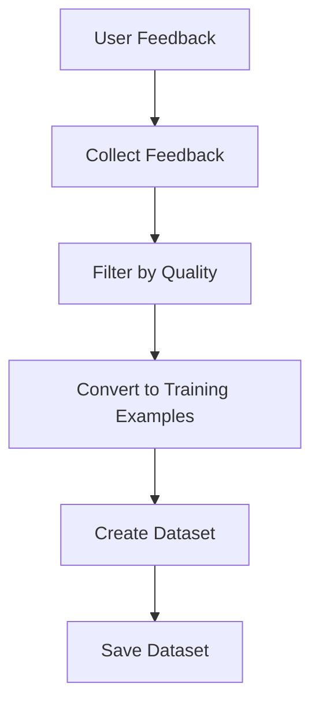
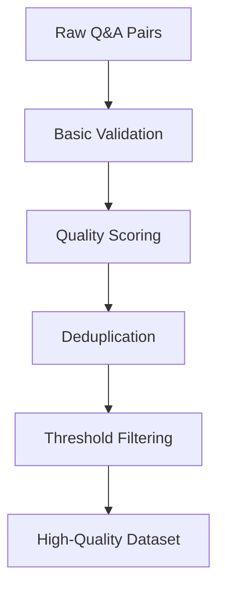
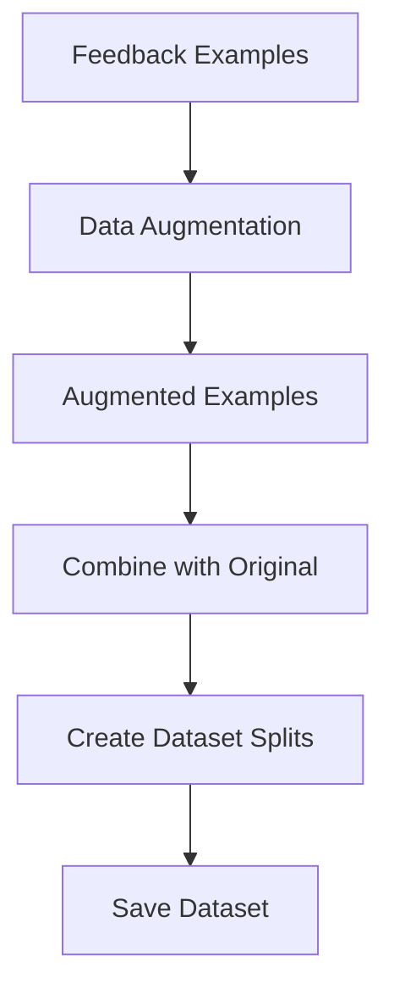
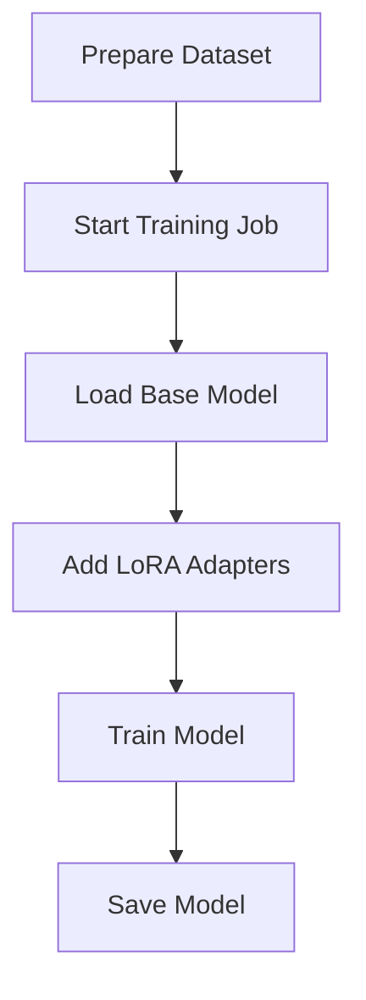
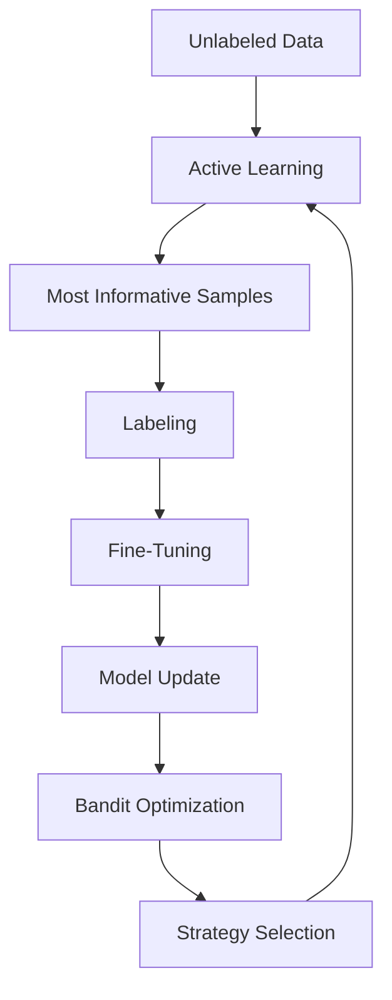
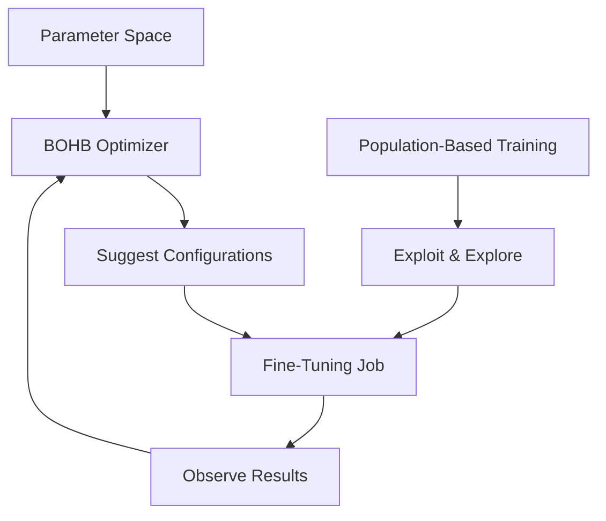
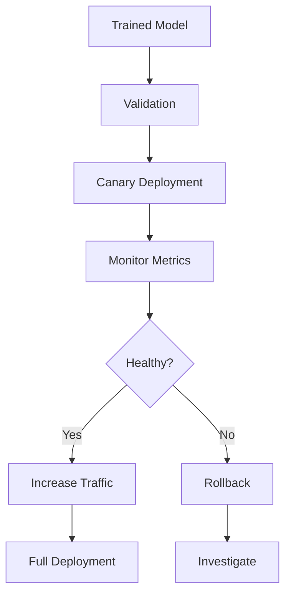
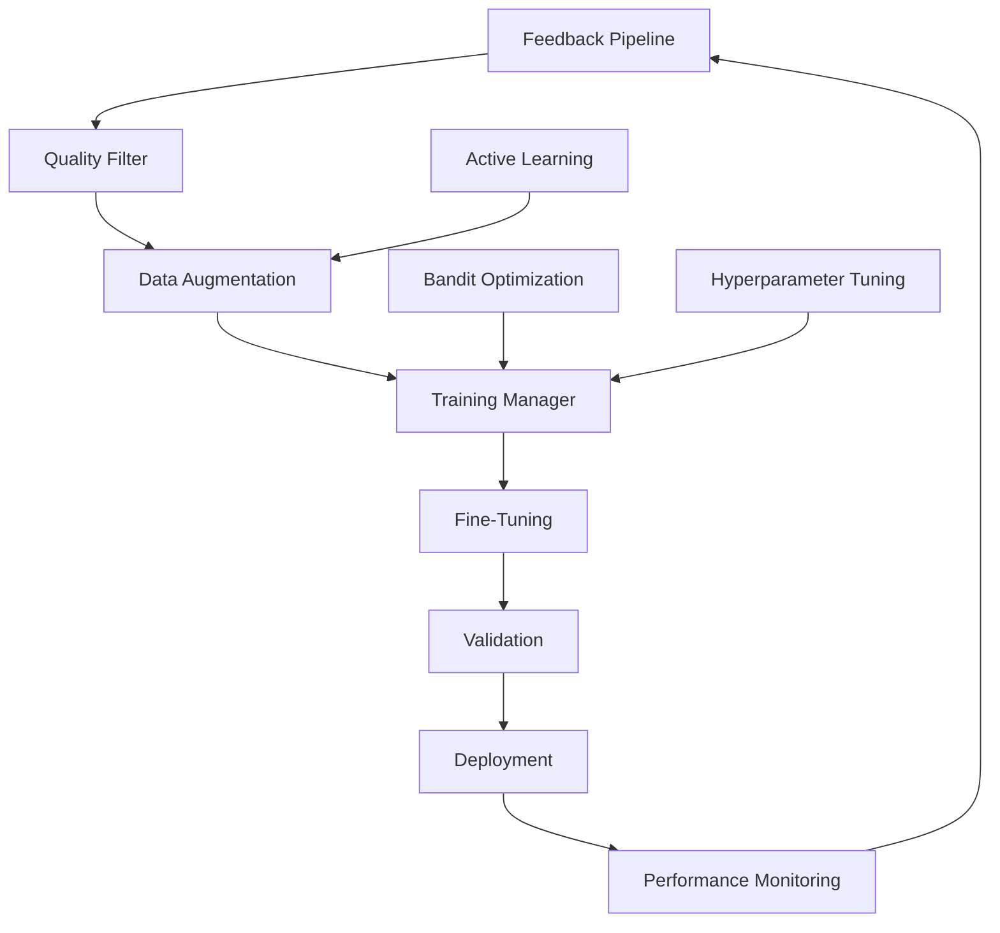
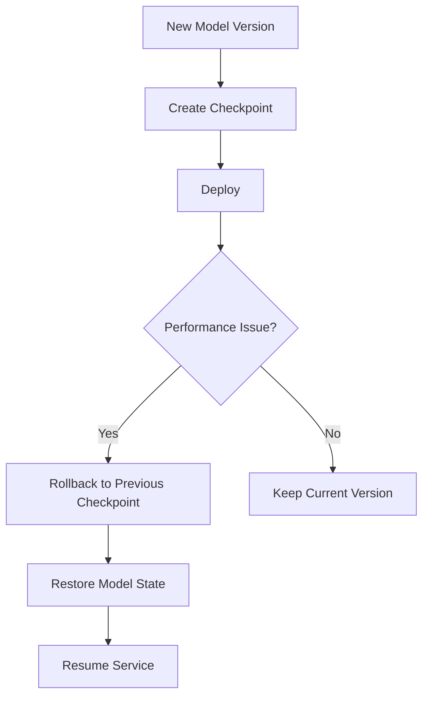

# Self-Improvement Loop

<cite>
**Referenced Files in This Document**   
- [feedback_pipeline.py](file://mahoun/finetuning/feedback_pipeline.py)
- [quality_filter.py](file://mahoun/finetuning/quality_filter.py)
- [data_augmentation.py](file://mahoun/finetuning/data_augmentation.py)
- [trainer.py](file://mahoun/finetuning/trainer.py)
- [unsloth_runner.py](file://mahoun/finetuning/unsloth_runner.py)
- [ultra_active_learning.py](file://mahoun/self_improve/ultra_active_learning.py)
- [ultra_bandit_system.py](file://mahoun/self_improve/ultra_bandit_system.py)
- [ultra_hyperparameter_optimization.py](file://mahoun/self_improve/ultra_hyperparameter_optimization.py)
- [ultra_performance_monitoring.py](file://mahoun/self_improve/ultra_performance_monitoring.py)
- [ultra_self_improve_integration.py](file://mahoun/self_improve/ultra_self_improve_integration.py)
- [self_improvement_system_v2.py](file://mahoun/self_improve/self_improvement_system_v2.py)
- [orchestrator.py](file://mahoun/orchestrator/orchestrator.py)
</cite>

## Table of Contents
1. [Introduction](#introduction)
2. [Feedback Collection Pipeline](#feedback-collection-pipeline)
3. [Quality Filtering Mechanisms](#quality-filtering-mechanisms)
4. [Training Data Generation Process](#training-data-generation-process)
5. [Fine-Tuning Job Execution](#fine-tuning-job-execution)
6. [Active Learning and Bandit Optimization](#active-learning-and-bandit-optimization)
7. [Hyperparameter Tuning](#hyperparameter-tuning)
8. [Model Validation and Deployment](#model-validation-and-deployment)
9. [System Integration](#system-integration)
10. [Model Versioning and Rollback](#model-versioning-and-rollback)
11. [Conclusion](#conclusion)

## Introduction
The Self-Improvement Loop is a comprehensive system designed to continuously enhance the performance of AI models through user feedback, quality filtering, data augmentation, and automated fine-tuning. This document details the architecture and components of this system, focusing on how user feedback is transformed into actionable training signals, how model updates are validated before deployment, and how various optimization strategies are integrated to improve model performance.

**Section sources**
- [feedback_pipeline.py](file://mahoun/finetuning/feedback_pipeline.py#L1-L15)
- [self_improvement_system_v2.py](file://mahoun/self_improve/self_improvement_system_v2.py#L1-L25)

## Feedback Collection Pipeline
The feedback collection pipeline is responsible for gathering user feedback and converting it into training examples. The pipeline starts with collecting feedback from users, which can be in the form of ratings, corrections, preferences, or rejections. Each feedback entry includes metadata such as the user ID, query, response, and timestamp.

The pipeline then filters the feedback based on quality criteria, such as minimum rating and response time. High-quality feedback is converted into training examples, where the input text is the user's query and the target text is the corrected or preferred response. The quality score of each feedback entry is calculated based on factors like rating, response time, confidence score, and feedback type.

**Diagram sources**
- [feedback_pipeline.py](file://mahoun/finetuning/feedback_pipeline.py#L111-L121)

**Section sources**
- [feedback_pipeline.py](file://mahoun/finetuning/feedback_pipeline.py#L111-L241)

## Quality Filtering Mechanisms
The quality filtering mechanisms ensure that only high-quality training data is used for fine-tuning. The system employs a multi-dimensional quality scoring approach, where each training example is evaluated on dimensions such as relevance, coherence, groundedness, completeness, and fluency.

The quality filter applies several stages of filtering:
1. **Basic validation**: Checks for valid input and output text, source text, and other metadata.
2. **Quality scoring**: Calculates a comprehensive quality score using weighted scores from different dimensions.
3. **Deduplication**: Removes duplicate Q&A pairs using both exact hash matching and semantic similarity.
4. **Threshold filtering**: Filters out examples that do not meet the minimum quality score threshold.

The system also includes a fallback mechanism for cases where advanced scoring methods (e.g., embedding-based similarity) are not available.

**Diagram sources**
- [quality_filter.py](file://mahoun/finetuning/quality_filter.py#L552-L598)

**Section sources**
- [quality_filter.py](file://mahoun/finetuning/quality_filter.py#L552-L674)

## Training Data Generation Process
The training data generation process involves augmenting the collected feedback with additional variations to improve the robustness and diversity of the training dataset. The system uses a data augmentation engine that applies various strategies, such as synonym replacement, paraphrasing, and noise injection, while preserving important entities.

The augmentation process is guided by a configuration that specifies the strategies to use, the augmentation factor, and the ratio of synonym replacement. The system extracts legal entities from the text and ensures they are not altered during augmentation. This is crucial for maintaining the integrity of legal terms and references.

The augmented data is then combined with the original feedback to create a comprehensive training dataset, which is split into training, evaluation, and test sets.

**Diagram sources**
- [data_augmentation.py](file://mahoun/finetuning/data_augmentation.py#L139-L153)

**Section sources**
- [data_augmentation.py](file://mahoun/finetuning/data_augmentation.py#L139-L282)

## Fine-Tuning Job Execution
The fine-tuning job execution is managed by the training manager, which orchestrates the entire process from dataset preparation to model training. The training manager uses the Unsloth backend to perform efficient fine-tuning with LoRA adapters.

The process begins with preparing the dataset from the collected feedback, including augmentation and splitting into training, evaluation, and test sets. The training manager then starts a fine-tuning job, which involves loading the base model, adding LoRA adapters, and training the model on the prepared dataset.

The training job is executed asynchronously, allowing for real-time monitoring and status updates. The system supports both real training (when dependencies are available) and mock training (for simulation purposes).

**Diagram sources**
- [trainer.py](file://mahoun/finetuning/trainer.py#L24-L38)

**Section sources**
- [trainer.py](file://mahoun/finetuning/trainer.py#L24-L187)
- [unsloth_runner.py](file://mahoun/finetuning/unsloth_runner.py#L22-L155)

## Active Learning and Bandit Optimization
The system incorporates advanced active learning and bandit optimization strategies to improve data efficiency and exploration-exploitation balance. The active learning component uses multiple acquisition functions, such as BALD (Bayesian Active Learning by Disagreement), entropy-based selection, and query-by-committee, to identify the most informative samples for labeling.

The bandit optimization system employs various algorithms, including Thompson Sampling, UCB (Upper Confidence Bound), and Neural Thompson Sampling, to dynamically allocate resources and explore different strategies. These systems work together to optimize the self-improvement loop by focusing on the most valuable data and strategies.

**Diagram sources**
- [ultra_active_learning.py](file://mahoun/self_improve/ultra_active_learning.py#L207-L250)
- [ultra_bandit_system.py](file://mahoun/self_improve/ultra_bandit_system.py#L346-L350)

**Section sources**
- [ultra_active_learning.py](file://mahoun/self_improve/ultra_active_learning.py#L207-L514)
- [ultra_bandit_system.py](file://mahoun/self_improve/ultra_bandit_system.py#L346-L423)

## Hyperparameter Tuning
The hyperparameter tuning component uses state-of-the-art optimization algorithms to find the best configuration for the fine-tuning process. The system supports multiple optimization strategies, including Bayesian Optimization, Population-Based Training (PBT), and Neural Architecture Search (NAS).

The BOHB (Bayesian Optimization + Hyperband) optimizer combines the strengths of Bayesian optimization for smart parameter selection and Hyperband for efficient resource allocation. The PBT system maintains a population of models with different hyperparameters and periodically exploits the best performers while exploring new configurations.

**Diagram sources**
- [ultra_hyperparameter_optimization.py](file://mahoun/self_improve/ultra_hyperparameter_optimization.py#L69-L85)
- [ultra_hyperparameter_optimization.py](file://mahoun/self_improve/ultra_hyperparameter_optimization.py#L237-L251)

**Section sources**
- [ultra_hyperparameter_optimization.py](file://mahoun/self_improve/ultra_hyperparameter_optimization.py#L69-L477)

## Model Validation and Deployment
The model validation and deployment process ensures that only high-quality models are deployed to production. The system uses a combination of automated testing, performance monitoring, and deployment strategies to validate and deploy model updates.

The orchestrator manages the deployment process, supporting various strategies such as canary, blue-green, and shadow deployments. During a canary deployment, the new model is gradually rolled out to a small percentage of traffic, with continuous monitoring of key metrics. If the model performs well, the traffic is increased; otherwise, it is rolled back.

The system also includes a performance monitoring component that tracks metrics such as latency, throughput, error rate, and user satisfaction. Anomaly detection algorithms identify performance issues, and alerts are triggered when thresholds are exceeded.

**Diagram sources**
- [orchestrator.py](file://mahoun/orchestrator/orchestrator.py#L660-L702)

**Section sources**
- [orchestrator.py](file://mahoun/orchestrator/orchestrator.py#L660-L757)
- [ultra_performance_monitoring.py](file://mahoun/self_improve/ultra_performance_monitoring.py#L425-L655)

## System Integration
The self-improvement system is integrated with various components to create a cohesive and efficient workflow. The integration hub coordinates the activities of the feedback pipeline, quality filter, data augmentation, training manager, and optimization systems.

The system uses an event bus to facilitate communication between components. For example, when a new feedback entry is collected, an event is published, which triggers the quality filtering and data augmentation processes. Similarly, when a fine-tuning job is completed, an event is published to initiate the validation and deployment process.

The integration also includes a unified model architecture that supports multiple tasks, such as classification, reinforcement learning, and value prediction. This allows the system to share knowledge across different components and improve overall performance.

**Diagram sources**
- [ultra_self_improve_integration.py](file://mahoun/self_improve/ultra_self_improve_integration.py#L114-L124)

**Section sources**
- [ultra_self_improve_integration.py](file://mahoun/self_improve/ultra_self_improve_integration.py#L114-L391)

## Model Versioning and Rollback
The system implements a robust model versioning and rollback mechanism to ensure reliability and traceability. Each model update is assigned a unique version ID and stored with its configuration, training data, and performance metrics.

The checkpoint manager maintains a history of model states, allowing for quick rollback to a previous version if needed. The system supports up to 10 checkpoints, with the oldest being removed when the limit is reached. Each checkpoint includes metadata such as the timestamp, improvement score, and explanation of changes.

In the event of a performance issue or failure, the orchestrator can initiate a rollback to a previous checkpoint. This process is automated and can be triggered by anomaly detection or manual intervention.

**Diagram sources**
- [self_improvement_system_v2.py](file://mahoun/self_improve/self_improvement_system_v2.py#L760-L772)

**Section sources**
- [self_improvement_system_v2.py](file://mahoun/self_improve/self_improvement_system_v2.py#L760-L800)

## Conclusion
The Self-Improvement Loop is a sophisticated system that leverages user feedback, quality filtering, data augmentation, and advanced optimization techniques to continuously improve AI models. By integrating active learning, bandit optimization, and hyperparameter tuning, the system maximizes data efficiency and performance. The robust validation, deployment, and rollback mechanisms ensure that only high-quality models are deployed to production, maintaining the reliability and trustworthiness of the AI system.