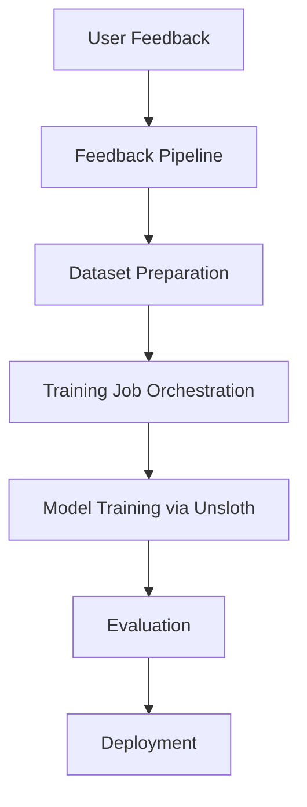
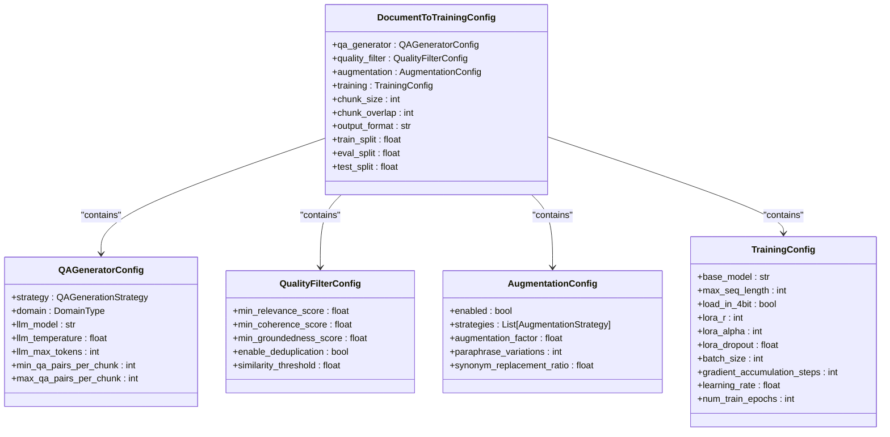
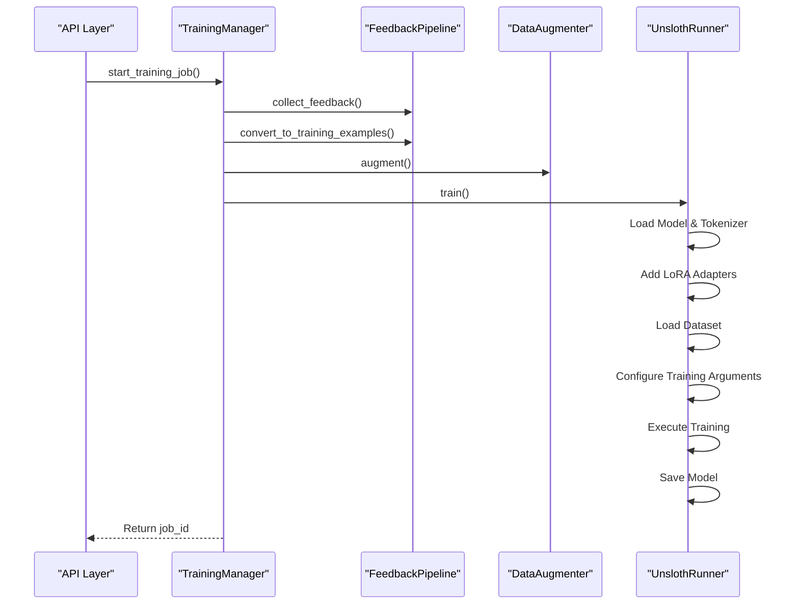
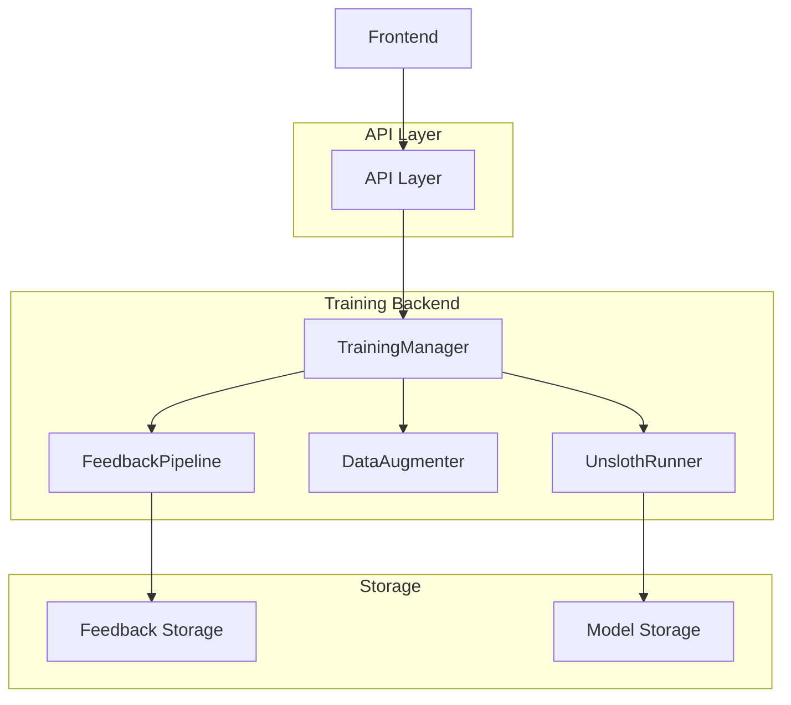

# Training System

<cite>
**Referenced Files in This Document**   
- [config.py](file://mahoun/finetuning/config.py)
- [trainer.py](file://mahoun/finetuning/trainer.py)
- [unsloth_runner.py](file://mahoun/finetuning/unsloth_runner.py)
- [feedback_pipeline.py](file://mahoun/finetuning/feedback_pipeline.py)
- [finetuning.py](file://api/routers/finetuning.py)
- [main.py](file://api/main.py)
</cite>

## Table of Contents
1. [Introduction](#introduction)
2. [Training Workflow](#training-workflow)
3. [Dataset Preparation](#dataset-preparation)
4. [Configuration Options](#configuration-options)
5. [Training Modes and Hyperparameters](#training-modes-and-hyperparameters)
6. [TrainingManager Coordination](#trainingmanager-coordination)
7. [API Layer Integration](#api-layer-integration)
8. [Common Issues and Solutions](#common-issues-and-solutions)
9. [Performance Optimization](#performance-optimization)
10. [Conclusion](#conclusion)

## Introduction
The training system sub-component provides a comprehensive framework for model fine-tuning through a structured workflow that transforms user feedback into high-quality training data. This system enables continuous model improvement by leveraging real user interactions to generate domain-specific training datasets. The architecture integrates dataset preparation, job orchestration, and execution via Unsloth, with support for various training modes including LoRA, QLoRA, and full fine-tuning. The system is designed to be accessible to beginners while providing sufficient technical depth for experienced developers, with clear configuration options and optimization techniques.

## Training Workflow
The model fine-tuning process follows a structured workflow that begins with user feedback collection and culminates in model deployment. The workflow consists of several interconnected stages: feedback collection, dataset preparation, training job orchestration, model training, evaluation, and deployment. User feedback is collected through the API and processed by the feedback pipeline, which converts it into training examples. These examples are then augmented and filtered for quality before being used to train the model. The TrainingManager coordinates the entire process, managing dataset preparation and training job execution. Once training is complete, the model can be deployed through various strategies including shadow, canary, or full deployment.

**Diagram sources**
- [feedback_pipeline.py](file://mahoun/finetuning/feedback_pipeline.py#L1-L15)
- [trainer.py](file://mahoun/finetuning/trainer.py#L1-L15)
- [unsloth_runner.py](file://mahoun/finetuning/unsloth_runner.py#L1-L15)

**Section sources**
- [feedback_pipeline.py](file://mahoun/finetuning/feedback_pipeline.py#L1-L15)
- [trainer.py](file://mahoun/finetuning/trainer.py#L1-L15)
- [unsloth_runner.py](file://mahoun/finetuning/unsloth_runner.py#L1-L15)

## Dataset Preparation
Dataset preparation is a critical phase in the fine-tuning process, transforming raw user feedback into structured training data. The system uses a multi-step approach to ensure data quality and relevance. First, feedback is collected from users through the API, capturing information about query responses, ratings, and corrections. This feedback is then processed by the FeedbackPipeline, which converts it into training examples with appropriate quality scores. The pipeline applies various filters to ensure only high-quality examples are used, including minimum rating thresholds and quality score requirements.

Data augmentation is applied to expand the dataset and improve model generalization. The DataAugmenter implements several strategies including synonym replacement, paraphrasing, and entity preservation, with configurable augmentation factors. Quality filtering ensures that only examples meeting specific criteria are included in the final dataset. The system supports configurable split ratios for training, evaluation, and test sets, allowing users to optimize the data distribution based on their specific requirements.

**Section sources**
- [feedback_pipeline.py](file://mahoun/finetuning/feedback_pipeline.py#L107-L120)
- [data_augmentation.py](file://mahoun/finetuning/data_augmentation.py#L1-L15)
- [quality_filter.py](file://mahoun/finetuning/quality_filter.py#L1-L15)

## Configuration Options
The training system provides extensive configuration options through the DocumentToTrainingConfig class, allowing users to customize various aspects of the fine-tuning process. The configuration is organized into several sub-configurations for different components of the pipeline, including Q&A generation, quality filtering, data augmentation, and training parameters. Each configuration section contains detailed settings with appropriate validation and default values.

The system supports domain-specific configurations for legal, healthcare, financial, and general domains, with pre-configured settings optimized for each domain's requirements. For example, legal and healthcare domains have higher groundedness score requirements to ensure factual accuracy. Users can override these defaults through the configuration interface. The configuration system uses Pydantic models with field validation to ensure data integrity and provide clear error messages for invalid settings.

**Diagram sources**
- [config.py](file://mahoun/finetuning/config.py#L200-L249)

**Section sources**
- [config.py](file://mahoun/finetuning/config.py#L1-L334)

## Training Modes and Hyperparameters
The system supports multiple training modes to accommodate different resource constraints and performance requirements. The primary modes include LoRA (Low-Rank Adaptation), QLoRA (Quantized LoRA), full fine-tuning, DORA, and AdaLoRA. Each mode offers different trade-offs between memory usage, training speed, and model performance. LoRA and QLoRA are particularly useful for resource-constrained environments as they require significantly less GPU memory while maintaining competitive performance.

Key hyperparameters include learning rate, batch size, number of training epochs, gradient accumulation steps, and LoRA-specific parameters such as rank (r), alpha, and dropout. The system provides sensible defaults for these parameters while allowing users to customize them based on their specific needs. For example, the default learning rate of 2e-4 is suitable for most scenarios, but can be adjusted for faster or more stable convergence. The gradient accumulation steps parameter allows users to effectively increase the batch size when GPU memory is limited.

**Section sources**
- [config.py](file://mahoun/finetuning/config.py#L173-L198)
- [unsloth_runner.py](file://mahoun/finetuning/unsloth_runner.py#L58-L70)

## TrainingManager Coordination
The TrainingManager class serves as the central coordinator for the fine-tuning process, orchestrating the various components of the training pipeline. It manages the end-to-end workflow from dataset preparation to model training, providing a clean interface for initiating and monitoring training jobs. The manager maintains state information for current and historical jobs, allowing users to track progress and retrieve results.

The prepare_dataset_from_feedback method handles dataset creation by collecting feedback, converting it to training examples, applying data augmentation, and saving the dataset to disk. The start_training_job method initiates the actual training process, creating a job ID, recording job information, and launching the training in the background. The manager also provides methods for monitoring job status and retrieving job history. Error handling is implemented to gracefully handle failures during training, with detailed error information stored in the job history.

**Diagram sources**
- [trainer.py](file://mahoun/finetuning/trainer.py#L124-L187)
- [unsloth_runner.py](file://mahoun/finetuning/unsloth_runner.py#L32-L155)

**Section sources**
- [trainer.py](file://mahoun/finetuning/trainer.py#L24-L195)

## API Layer Integration
The API layer provides a RESTful interface for interacting with the training system, exposing endpoints for job management, monitoring, and deployment. The finetuning.py router defines the API endpoints, including creating training jobs, listing jobs, retrieving job status, canceling jobs, and deploying models. The API uses FastAPI with Pydantic models for request validation and response serialization.

The integration between the API and training backend is handled through background tasks, allowing long-running training jobs to execute without blocking the API. When a user creates a training job through the API, the request is validated and a background task is scheduled to execute the training. The API returns immediately with a job ID, which can be used to monitor progress. The system maintains in-memory storage of job information and metrics, which can be retrieved through the API endpoints.

**Diagram sources**
- [finetuning.py](file://api/routers/finetuning.py#L1-L724)
- [main.py](file://api/main.py#L136-L141)

**Section sources**
- [finetuning.py](file://api/routers/finetuning.py#L1-L724)
- [main.py](file://api/main.py#L251-L263)

## Common Issues and Solutions
Several common issues may arise during the fine-tuning process, particularly related to GPU memory constraints and training instability. GPU memory issues are often encountered when using larger models or batch sizes. The system addresses this through several strategies: using 4-bit quantization (load_in_4bit), gradient accumulation to simulate larger batch sizes, and memory-efficient implementations like Unsloth. For extremely memory-constrained environments, QLoRA provides an effective solution by combining quantization with LoRA.

Training instability can manifest as loss spikes, poor convergence, or model degradation. This can be mitigated through careful hyperparameter tuning, particularly learning rate and batch size. The system implements gradient clipping (max_grad_norm) to prevent exploding gradients. For unstable training, reducing the learning rate or increasing the warmup steps can improve stability. Monitoring training metrics through the API allows users to detect issues early and adjust parameters accordingly.

**Section sources**
- [config.py](file://mahoun/finetuning/config.py#L180-L198)
- [unsloth_runner.py](file://mahoun/finetuning/unsloth_runner.py#L118-L124)

## Performance Optimization
Performance optimization is critical for efficient model training, particularly in production environments. The system implements several optimization techniques to maximize training efficiency and model quality. Memory optimization is achieved through 4-bit quantization, gradient checkpointing, and efficient LoRA implementations. Computational efficiency is enhanced through mixed-precision training (FP16/BF16) and optimized kernels provided by Unsloth.

For data processing, the system uses parallel processing with configurable max_workers to speed up dataset preparation. Caching is implemented to avoid recomputing expensive operations when possible. The training process can be optimized by adjusting the packing parameter in the SFTTrainer, which combines multiple sequences into a single input to improve GPU utilization. Monitoring GPU memory usage and adjusting batch size accordingly can help achieve optimal throughput.

**Section sources**
- [unsloth_runner.py](file://mahoun/finetuning/unsloth_runner.py#L118-L124)
- [config.py](file://mahoun/finetuning/config.py#L257-L261)

## Conclusion
The training system provides a comprehensive solution for model fine-tuning, integrating user feedback into a structured workflow that produces high-quality, domain-specific models. The system's modular architecture separates concerns between dataset preparation, job orchestration, and model training, making it both flexible and maintainable. By supporting multiple training modes and providing extensive configuration options, the system accommodates a wide range of use cases and resource constraints. The integration with the API layer enables seamless interaction with frontend applications, while the focus on quality filtering and optimization ensures reliable and efficient training processes.