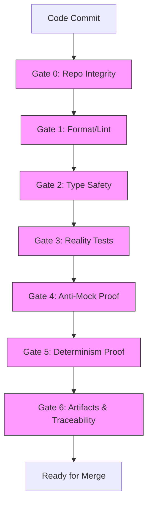
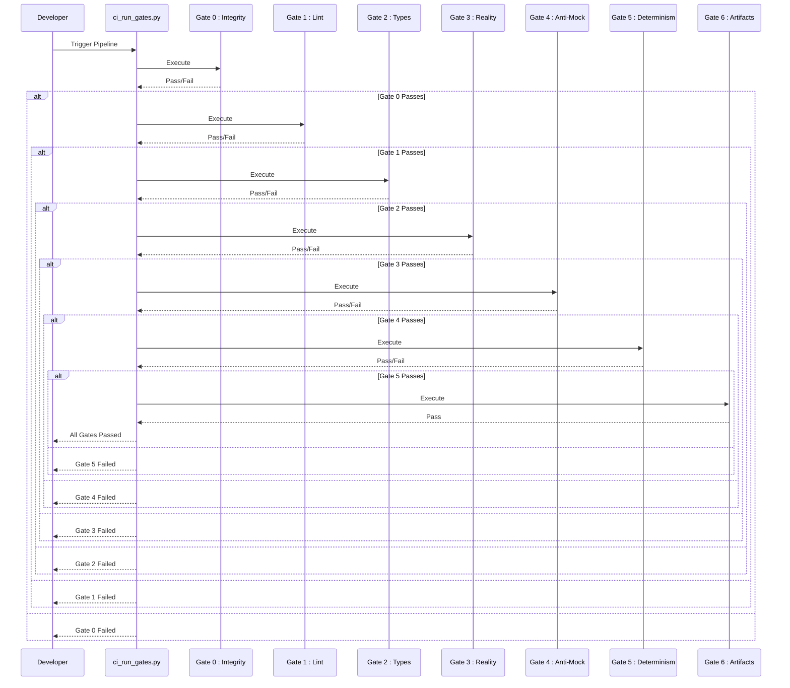
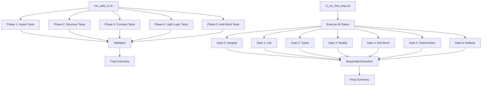

# CI/CD Pipeline Overview

<cite>
**Referenced Files in This Document**   
- [run_safe_ci.sh](file://first_step_ci_cd/run_safe_ci.sh)
- [ci_run_gates.py](file://scripts/ci_run_gates.py)
- [gate_0_integrity.sh](file://ci/first_step/gate_0_integrity.sh)
- [gate_1_lint.sh](file://ci/first_step/gate_1_lint.sh)
- [gate_2_types.sh](file://ci/first_step/gate_2_types.sh)
- [gate_3_reality.sh](file://ci/first_step/gate_3_reality.sh)
- [gate_4_antimock.sh](file://ci/first_step/gate_4_antimock.sh)
- [gate_5_determinism.sh](file://ci/first_step/gate_5_determinism.sh)
- [gate_6_artifacts.sh](file://ci/first_step/gate_6_artifacts.sh)
- [check_mypy_non_regression.py](file://ci/mypy/check_mypy_non_regression.py)
- [ci_run_first_step.sh](file://scripts/ci_run_first_step.sh)
- [DEPLOYMENT_CHECKLIST.md](file://ci/first_step/DEPLOYMENT_CHECKLIST.md)
- [README.md](file://ci/first_step/README.md)
</cite>

## Table of Contents
1. [Introduction](#introduction)
2. [Gate-Based Architecture](#gate-based-architecture)
3. [Core Components](#core-components)
4. [Data Flow and Execution Sequence](#data-flow-and-execution-sequence)
5. [Integration with First-Step Validation Suite](#integration-with-first-step-validation-suite)
6. [Common Failure Modes and Resolution](#common-failure-modes-and-resolution)
7. [Best Practices](#best-practices)
8. [Conclusion](#conclusion)

## Introduction
The CI/CD pipeline implements a gate-based architecture designed to enforce code quality, correctness, and production readiness through a series of progressive validation stages. This system ensures that only authentic, well-structured, and deterministic code reaches the main branch by implementing seven mandatory gates that verify different aspects of code integrity and functionality. The pipeline combines static analysis, dynamic testing, and artifact generation to create a comprehensive quality assurance framework that prevents placeholder implementations, enforces type safety, and verifies real-world behavior.

**Section sources**
- [DEPLOYMENT_CHECKLIST.md](file://ci/first_step/DEPLOYMENT_CHECKLIST.md#L1-L255)
- [README.md](file://ci/first_step/README.md#L1-L174)

## Gate-Based Architecture
The CI/CD pipeline employs a gate-based architecture consisting of seven sequential validation stages that must all pass before code can be merged into the main branch. Each gate serves a specific purpose in verifying different aspects of code quality and readiness, creating a comprehensive quality assurance framework that prevents low-quality or placeholder code from progressing through the development lifecycle.

The gates are designed to be progressive, with each subsequent gate building upon the verification performed by previous stages. This architecture ensures that code passes through multiple layers of validation, from basic syntax and formatting checks to complex behavioral and determinism verification. The gate system is enforced through GitHub/GitLab branch protection rules that require all gate checks to pass before merging is allowed.

**Diagram sources**
- [ci_run_gates.py](file://scripts/ci_run_gates.py#L68-L189)
- [DEPLOYMENT_CHECKLIST.md](file://ci/first_step/DEPLOYMENT_CHECKLIST.md#L47-L58)

## Core Components

### Integrity Checks (Gate 0)
Gate 0 performs comprehensive integrity checks to prevent placeholder patterns and secrets from reaching the main branch. This gate scans critical runtime paths for common placeholder indicators such as standalone `pass` statements, `TODO`/`FIXME` comments, `NotImplementedError` exceptions, and empty return statements. It also detects hardcoded secrets and API keys using pattern matching against known secret formats.

The integrity check specifically targets core application paths including `mahoun/core/`, `mahoun/domain/`, `mahoun/schemas/`, and `api/`, while excluding test files and temporary directories. This focused approach ensures that only production-critical code is validated for completeness, preventing developers from committing incomplete implementations that could compromise system reliability.

**Section sources**
- [gate_0_integrity.sh](file://ci/first_step/gate_0_integrity.sh#L1-L210)
- [ci_scan_placeholders.py](file://scripts/ci_scan_placeholders.py#L1-L294)
- [ci_scan_secrets.py](file://scripts/ci_scan_secrets.py#L1-L292)

### Linting (Gate 1)
Gate 1 enforces code style consistency through automated linting and formatting checks using the `ruff` tool. This gate performs two critical functions: syntax and style validation using `ruff check` with rules E, F, I, UP, N, W, and formatting verification using `ruff format --check`. The linting process ensures that all code adheres to the project's style guidelines, promoting readability and maintainability across the codebase.

By automating style enforcement, this gate eliminates subjective code review debates about formatting and ensures a consistent codebase. The gate fails if any linting violations are detected or if the code is not properly formatted, requiring developers to fix issues before proceeding to subsequent gates.

**Section sources**
- [gate_1_lint.sh](file://ci/first_step/gate_1_lint.sh#L1-L81)
- [README.md](file://ci/first_step/README.md#L52-L57)

### Type Validation (Gate 2)
Gate 2 ensures type safety through static type checking using a tiered approach that prioritizes `basedpyright`, falls back to `pyright`, and finally uses `mypy` if neither is available. This gate implements a non-regression strategy for mypy, where CI will not fail if existing mypy errors remain, but will fail if new errors are introduced. This approach allows the team to gradually improve type coverage without blocking development on legacy code issues.

The type validation gate runs type checkers against critical paths including `mahoun/`, `output/`, and `api/`, ensuring that function signatures, return types, and variable annotations are consistent and correct. For mypy specifically, the gate compares current output against a baseline file to detect only new type errors, enabling incremental type safety improvement.

**Section sources**
- [gate_2_types.sh](file://ci/first_step/gate_2_types.sh#L1-L103)
- [check_mypy_non_regression.py](file://ci/mypy/check_mypy_non_regression.py#L1-L181)
- [run_mypy.sh](file://ci/mypy/run_mypy.sh#L1-L35)

### Reality Testing (Gate 3)
Gate 3 executes the first-step validation suite, a comprehensive set of 137 reality tests that verify the actual functionality of the codebase. These tests are designed to be "laptop-safe," meaning they can run quickly and deterministically without external dependencies. The test suite is organized into five categories: import integrity (18 tests), structure validation (33 tests), contract verification (29 tests), light logic testing (27 tests), and anti-mock validation (30 tests).

The reality tests serve as a smoke test for the core functionality, ensuring that modules import correctly, classes have expected structures, method contracts are satisfied, and basic logic flows work as intended. This gate provides confidence that recent changes have not broken fundamental functionality and that implementations are real rather than placeholders.

**Section sources**
- [gate_3_reality.sh](file://ci/first_step/gate_3_reality.sh#L1-L87)
- [run_safe_ci.sh](file://first_step_ci_cd/run_safe_ci.sh#L1-L157)
- [README.md](file://ci/first_step/README.md#L67-L79)

### Anti-Mock Enforcement (Gate 4)
Gate 4 provides anti-mock enforcement by verifying that implementations are not stubs or placeholders through both automated testing and complexity analysis. This gate runs the anti-mock test suite (`test_5_anti_mock.py`) which specifically looks for patterns indicative of mock implementations, while also checking that critical modules meet minimum complexity thresholds.

The complexity verification ensures that key files like `mahoun/agents/base_agent.py` (500+ lines) and `mahoun/agents/claim_agent.py` (400+ lines) maintain sufficient implementation depth, preventing developers from replacing real code with simplified stubs. This dual approach of behavioral testing and structural analysis provides strong evidence that the codebase contains authentic implementations rather than temporary placeholders.

**Section sources**
- [gate_4_antimock.sh](file://ci/first_step/gate_4_antimock.sh#L1-L121)
- [README.md](file://ci/first_step/README.md#L80-L90)

### Determinism (Gate 5)
Gate 5 enforces determinism by running the reality test suite twice and comparing the results to ensure identical outcomes. This gate addresses the critical requirement that test results should be consistent across multiple executions, which is essential for reliable CI/CD pipelines. The determinism check compares exit codes, test counts, and JUnit XML hashes (with timestamps removed) to detect any non-deterministic behavior.

This gate helps identify issues such as unseeded random number generation, time-dependent logic, network calls, or dictionary/set iteration order dependencies that could lead to flaky tests. By requiring deterministic results, the pipeline ensures that test failures are genuine issues rather than transient environmental factors, increasing confidence in the reliability of the test suite.

**Section sources**
- [gate_5_determinism.sh](file://ci/first_step/gate_5_determinism.sh#L1-L145)
- [README.md](file://ci/first_step/README.md#L91-L97)

### Artifact Verification (Gate 6)
Gate 6 handles artifact generation and traceability by creating comprehensive metadata and reports that document the CI/CD execution. This gate generates three key artifacts: `reality_report.json` (machine-readable metadata), `ci_summary.md` (human-readable summary), and `junit.xml` (test results). These artifacts provide full traceability for each pipeline execution, capturing information such as commit SHA, branch, Python version, timestamp, and detailed gate results.

The artifact generation enables post-execution analysis, auditing, and debugging by preserving the context and outcomes of each CI/CD run. This traceability is essential for investigating failures, tracking code quality trends over time, and ensuring accountability in the development process.

**Section sources**
- [gate_6_artifacts.sh](file://ci/first_step/gate_6_artifacts.sh#L1-L168)
- [ci_make_reality_report.py](file://scripts/ci_make_reality_report.py#L1-L313)

### Mypy Non-Regression Testing
The mypy non-regression system provides a sophisticated approach to type checking that balances strictness with practicality. Instead of failing CI for all type errors, this system maintains a baseline of known errors in `baseline.txt` and only fails when new errors are introduced. This ratchet approach allows teams to incrementally improve type coverage without being blocked by legacy code issues.

The system normalizes error output by stripping column numbers, using basename-only file paths, and sorting errors for deterministic comparison. This ensures consistent results across different development environments. The baseline can be updated after intentional fixes, creating a visible record of type safety improvements over time while preventing regressions.

**Section sources**
- [check_mypy_non_regression.py](file://ci/mypy/check_mypy_non_regression.py#L1-L181)
- [README.md](file://ci/mypy/README.md#L1-L152)

## Data Flow and Execution Sequence
The CI/CD pipeline follows a strict sequential execution model where each gate must pass before the next begins. The process starts with repository integrity checks and progresses through increasingly complex validations, creating a funnel that filters out issues early in the development cycle.

**Diagram sources**
- [ci_run_gates.py](file://scripts/ci_run_gates.py#L68-L189)
- [ci_run_first_step.sh](file://scripts/ci_run_first_step.sh#L77-L122)

## Integration with First-Step Validation Suite
The CI/CD pipeline integrates tightly with the first-step validation suite through the `run_safe_ci.sh` script and the `ci_run_first_step.sh` orchestrator. The `run_safe_ci.sh` script provides a safe execution environment for the validation suite, running tests in phases with clear reporting and handling of dependencies like pytest.

The integration is designed to be resource-efficient and developer-friendly, with the validation suite running in approximately 2 minutes total. The `ci_run_first_step.sh` script orchestrates all seven gates in sequence, providing detailed timing information and summary reports. This integration ensures that the first-step validation suite is executed consistently across different environments, from developer laptops to CI servers.

**Diagram sources**
- [run_safe_ci.sh](file://first_step_ci_cd/run_safe_ci.sh#L1-L157)
- [ci_run_first_step.sh](file://scripts/ci_run_first_step.sh#L1-L182)

## Common Failure Modes and Resolution
The CI/CD pipeline encounters several common failure modes that developers should understand for efficient troubleshooting. These failures typically fall into specific categories with well-defined resolution strategies.

### Integrity Check Failures
Integrity check failures occur when placeholder patterns or secrets are detected in the codebase. Common causes include standalone `pass` statements, `TODO`/`FIXME` comments in critical paths, `NotImplementedError` exceptions, and hardcoded secrets. Resolution involves removing placeholder code, addressing technical debt items, and moving secrets to proper configuration management systems.

### Linting Failures
Linting failures result from code style violations or formatting issues. These are typically resolved by running `ruff format .` to automatically fix formatting issues and `ruff check --fix .` to address linting violations. Developers should configure their editors to apply these fixes automatically to prevent such failures.

### Type Safety Failures
Type safety failures occur when new type errors are introduced in the codebase. For `basedpyright` or `pyright`, this indicates actual type mismatches that must be fixed. For mypy, failures only occur when new errors are detected beyond the baseline. Resolution involves fixing type hints, updating function signatures, or intentionally updating the baseline after legitimate improvements.

### Test Failures
Test failures in the reality suite indicate issues with core functionality. These are debugged using `pytest first_step_ci_cd/ -v` to see detailed output. Common causes include broken imports, incorrect class structures, violated method contracts, or flawed logic implementations.

### Non-Determinism Failures
Non-determinism failures are among the most challenging to resolve, often caused by unseeded random number generation, time-dependent logic, network calls, or dictionary/set iteration order dependencies. Resolution strategies include mocking random with fixed seeds, using `freezegun` for time-based tests, mocking external calls, and using `OrderedDict` or `sorted()` for consistent iteration.

**Section sources**
- [DEPLOYMENT_CHECKLIST.md](file://ci/first_step/DEPLOYMENT_CHECKLIST.md#L134-L153)
- [README.md](file://ci/first_step/README.md#L132-L152)

## Best Practices
Maintaining pipeline reliability and performance requires adherence to several best practices that ensure consistent and efficient operation.

### Local Execution
Developers should run the pipeline locally using `./scripts/ci_run_first_step.sh` before pushing changes. This catches issues early and reduces CI server load. The pipeline is designed to be "laptop-safe" with a target execution time of under 2 minutes.

### Incremental Type Improvement
For mypy type checking, teams should adopt a ratchet approach: fix type errors incrementally and update the baseline after each improvement. This prevents blocking development on legacy type issues while ensuring no regressions occur.

### Deterministic Testing
All tests should be designed to be deterministic by avoiding unseeded randomness, time dependencies, and external service calls. When external dependencies are necessary, they should be properly mocked with consistent return values.

### Baseline Management
The mypy baseline should be updated after intentional improvements, with each update committed to version control. This creates an auditable record of type safety progress over time.

### Failure Analysis
When gates fail, developers should analyze the specific error messages and run the failing gate locally to reproduce and debug the issue. The pipeline provides detailed output to facilitate this process.

**Section sources**
- [DEPLOYMENT_CHECKLIST.md](file://ci/first_step/DEPLOYMENT_CHECKLIST.md#L143-L164)
- [README.md](file://ci/mypy/README.md#L80-L84)

## Conclusion
The CI/CD pipeline's gate-based architecture provides a robust framework for ensuring code quality, correctness, and production readiness. By enforcing a series of progressive validations—from basic integrity checks to complex determinism verification—the system prevents placeholder implementations and ensures that only authentic, well-structured code reaches the main branch. The integration between the first-step validation suite and the full CI pipeline creates a comprehensive quality assurance process that balances thoroughness with developer productivity. By following best practices for pipeline maintenance and failure resolution, teams can ensure reliable and efficient CI/CD operations that support sustainable development.