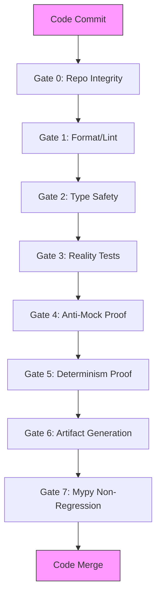
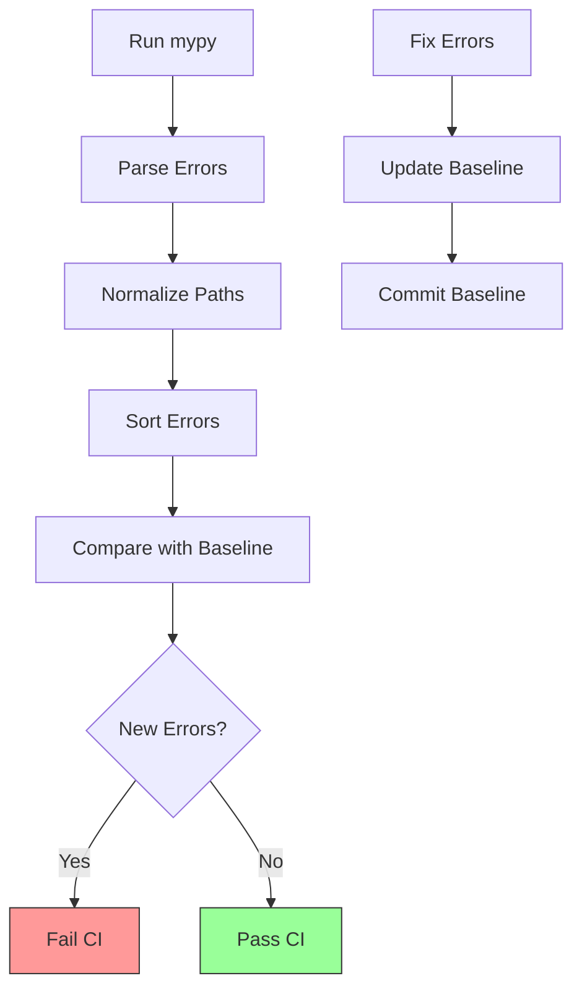

# CI/CD Pipeline

<cite>
**Referenced Files in This Document**   
- [gate_0_integrity.sh](file://ci/first_step/gate_0_integrity.sh)
- [gate_1_lint.sh](file://ci/first_step/gate_1_lint.sh)
- [gate_2_types.sh](file://ci/first_step/gate_2_types.sh)
- [gate_3_reality.sh](file://ci/first_step/gate_3_reality.sh)
- [gate_4_antimock.sh](file://ci/first_step/gate_4_antimock.sh)
- [gate_5_determinism.sh](file://ci/first_step/gate_5_determinism.sh)
- [gate_6_artifacts.sh](file://ci/first_step/gate_6_artifacts.sh)
- [gate_7_mypy_non_regression.sh](file://ci/first_step/gate_7_mypy_non_regression.sh)
- [README.md](file://ci/first_step/README.md)
- [check_mypy_non_regression.py](file://ci/mypy/check_mypy_non_regression.py)
- [baseline.txt](file://ci/mypy/baseline.txt)
- [run_mypy.sh](file://ci/mypy/run_mypy.sh)
- [update_baseline.sh](file://ci/mypy/update_baseline.sh)
- [run_safe_ci.sh](file://scripts/ci_run_first_step.sh)
- [README.md](file://first_step_ci_cd/README.md)
- [pytest.ini](file://first_step_ci_cd/pytest.ini)
</cite>

## Table of Contents
1. [Introduction](#introduction)
2. [Gate-Based Architecture](#gate-based-architecture)
3. [Gate Scripts Implementation](#gate-scripts-implementation)
4. [Mypy Type Checking Integration](#mypy-type-checking-integration)
5. [First-Step CI/CD Setup](#first-step-cicd-setup)
6. [Testing Strategy](#testing-strategy)
7. [Pipeline Failures and Debugging](#pipeline-failures-and-debugging)
8. [Extending the Pipeline](#extending-the-pipeline)
9. [Conclusion](#conclusion)

## Introduction

The CI/CD pipeline for the MAHOUN platform implements a multi-stage validation system designed to ensure code quality, integrity, and reliability through a series of gates. This gate-based architecture provides a systematic approach to code validation, where each gate represents a specific quality check that must pass before code can be merged. The pipeline is specifically designed to operate efficiently in resource-constrained environments while providing comprehensive validation.

The pipeline consists of eight sequential gates that validate different aspects of the codebase, from basic integrity checks to sophisticated type safety verification. This documentation provides a comprehensive overview of the pipeline's architecture, implementation details, and operational procedures, enabling developers to understand, maintain, and extend the system effectively.

**Section sources**
- [README.md](file://ci/first_step/README.md)
- [README.md](file://first_step_ci_cd/README.md)

## Gate-Based Architecture

The CI/CD pipeline implements a gate-based architecture with eight distinct validation stages, each designed to verify specific aspects of code quality and integrity. This multi-layered approach ensures that code changes are thoroughly validated before being accepted into the codebase.

The gate architecture follows a progressive validation model, where each subsequent gate builds upon the verification performed by previous gates. This approach allows for early failure detection, reducing the time and resources required to identify and fix issues. The gates are designed to be executed in sequence, with the pipeline terminating immediately upon any gate failure.

The architecture incorporates both static and dynamic analysis techniques, combining code inspection with actual test execution. This hybrid approach provides comprehensive coverage while maintaining efficiency. Each gate has a specific focus area, from basic code integrity to sophisticated type safety verification, ensuring that multiple dimensions of code quality are validated.

The gate-based design also enables selective execution, allowing developers to run specific gates during development while ensuring that all gates are executed in the CI environment. This flexibility supports efficient development workflows while maintaining rigorous quality standards in the integration environment.



**Diagram sources**
- [README.md](file://ci/first_step/README.md)

## Gate Scripts Implementation

The CI/CD pipeline implements eight gate scripts, each responsible for a specific validation task. These scripts are designed to be executed sequentially, with each gate building upon the verification performed by previous gates.

### Gate 0: Repo Integrity

The repository integrity gate (gate_0_integrity.sh) performs critical checks to ensure code quality and security. This gate verifies the absence of placeholder patterns such as "pass" statements, "TODO" comments, and "raise NotImplementedError" in critical code paths. It also checks for empty return statements and detects hardcoded secrets or credentials that could compromise security.

The script examines core runtime paths including mahoun/core/, mahoun/domain/, mahoun/schemas/, mahoun/orchestrator/, mahoun/mcp/, and api/, while excluding test files and temporary directories. This targeted approach ensures that only production-critical code is validated, reducing false positives while maintaining security.

**Section sources**
- [gate_0_integrity.sh](file://ci/first_step/gate_0_integrity.sh)

### Gate 1: Format/Lint

The format and lint gate (gate_1_lint.sh) enforces code style consistency using the ruff tool. This gate performs two critical checks: code linting and formatting validation. The linting check identifies potential code issues using ruff check with rules E, F, I, UP, N, and W, while the formatting check ensures code adheres to the project's style guidelines using ruff format.

The script automatically installs ruff if not present and provides clear instructions for fixing any issues detected. This gate ensures that all code maintains a consistent style, improving readability and maintainability across the codebase.

**Section sources**
- [gate_1_lint.sh](file://ci/first_step/gate_1_lint.sh)

### Gate 2: Type Safety

The type safety gate (gate_2_types.sh) validates type annotations and type consistency across the codebase. This gate supports multiple type checkers in order of preference: basedpyright, pyright, and mypy. It implements a baseline approach where existing type errors are tolerated, but new errors are not allowed, enabling gradual improvement of type safety.

The script first attempts to use basedpyright, falling back to pyright and then mypy if necessary. When using mypy, it compares the current output against a baseline file (mypy_baseline.txt) to detect only new errors, preventing the gate from failing due to pre-existing issues.

**Section sources**
- [gate_2_types.sh](file://ci/first_step/gate_2_types.sh)

### Gate 3: Reality Tests

The reality tests gate (gate_3_reality.sh) executes the first_step_ci_cd test suite, which consists of 137 tests designed to verify that implementations are real and functional. This gate runs pytest with a 120-second timeout and captures test results in junit.xml format.

The test suite includes import tests, structure tests, contract tests, light logic tests, and anti-mock tests, providing comprehensive validation of code functionality without requiring extensive resources. This gate ensures that code changes maintain the expected behavior and interface contracts.

**Section sources**
- [gate_3_reality.sh](file://ci/first_step/gate_3_reality.sh)

### Gate 4: Anti-Mock Proof

The anti-mock proof gate (gate_4_antimock.sh) verifies that implementations are not stubs by running anti-mock tests and checking module complexity. This gate performs two key validations: executing anti-mock tests and verifying that critical modules meet minimum line count thresholds.

The complexity thresholds are defined in complexity_thresholds.json and include requirements such as mahoun/agents/base_agent.py having at least 500 lines and mahoun/agents/claim_agent.py having at least 400 lines. This ensures that core components maintain sufficient complexity, preventing replacement with placeholder implementations.

**Section sources**
- [gate_4_antimock.sh](file://ci/first_step/gate_4_antimock.sh)

### Gate 5: Determinism Proof

The determinism proof gate (gate_5_determinism.sh) ensures that tests produce identical results on repeated runs, verifying the absence of non-deterministic behavior. This gate runs the test suite twice and compares exit codes, test counts, and junit XML hashes (with timestamps removed) to detect any differences.

The script sets PYTHONHASHSEED=0 and disables external calls to ensure a deterministic environment. This gate is critical for identifying issues related to randomness, time dependencies, network calls, and dictionary/set iteration order that could lead to flaky tests.

**Section sources**
- [gate_5_determinism.sh](file://ci/first_step/gate_5_determinism.sh)

### Gate 6: Artifact Generation

The artifact generation gate (gate_6_artifacts.sh) creates metadata and traceability artifacts for the CI/CD process. This gate generates three key artifacts: reality_report.json (machine-readable metadata), ci_summary.md (human-readable summary), and junit.xml (test results from Gate 3).

The generated artifacts include commit SHA, branch name, Python version, timestamp, and gate execution status, providing comprehensive traceability for each CI/CD run. These artifacts enable post-execution analysis and integration with monitoring and reporting systems.

**Section sources**
- [gate_6_artifacts.sh](file://ci/first_step/gate_6_artifacts.sh)

### Gate 7: Mypy Non-Regression

The mypy non-regression gate (gate_7_mypy_non_regression.sh) ensures that no new mypy errors are introduced by comparing current type checking results against a baseline. This gate executes the check_mypy_non_regression.py script, which implements a sophisticated comparison algorithm to detect only new errors.

This gate is critical for maintaining type safety without being blocked by pre-existing issues, enabling incremental improvement of type annotations across the codebase.

**Section sources**
- [gate_7_mypy_non_regression.sh](file://ci/first_step/gate_7_mypy_non_regression.sh)

## Mypy Type Checking Integration

The CI/CD pipeline integrates mypy type checking through a sophisticated non-regression system designed to prevent the introduction of new type errors while accommodating existing ones. This system enables gradual improvement of type safety without blocking development on pre-existing issues.

### Baseline Management

The mypy integration uses a baseline-driven approach where existing type errors are captured in a baseline file (baseline.txt), and only new errors are considered failures. This approach allows teams to incrementally improve type safety by fixing errors and updating the baseline, rather than requiring immediate resolution of all issues.

The baseline file contains a snapshot of current mypy errors, with each error normalized to include only the filename, line number, severity, message, and error code. This normalization ensures stability across different development environments and CI runners.

### Non-Regression Logic

The non-regression logic is implemented in check_mypy_non_regression.py, which performs the following steps:
1. Runs mypy using run_mypy.sh to generate current error output
2. Parses and normalizes the error output
3. Loads and parses the baseline errors
4. Compares current errors against baseline to identify new errors
5. Reports results and exits with appropriate status code

The comparison process strips column numbers, uses basename-only for file paths, and sorts errors for deterministic comparison. This ensures consistent results across different systems and execution environments.

### Integration Components

The mypy integration consists of several key components:
- **check_mypy_non_regression.py**: Main script that performs the non-regression check
- **run_mypy.sh**: Script that runs mypy with stable, parseable output options
- **baseline.txt**: Authoritative record of current mypy errors
- **update_baseline.sh**: Script to update the baseline after fixing errors

The run_mypy.sh script configures mypy with options that ensure stable output: --show-error-codes, --no-pretty, --no-color-output, and --no-error-summary. This configuration is critical for reliable parsing and comparison of error output.



**Diagram sources**
- [check_mypy_non_regression.py](file://ci/mypy/check_mypy_non_regression.py)
- [run_mypy.sh](file://ci/mypy/run_mypy.sh)
- [baseline.txt](file://ci/mypy/baseline.txt)

**Section sources**
- [check_mypy_non_regression.py](file://ci/mypy/check_mypy_non_regression.py)
- [run_mypy.sh](file://ci/mypy/run_mypy.sh)
- [update_baseline.sh](file://ci/mypy/update_baseline.sh)

## First-Step CI/CD Setup

The first-step CI/CD setup provides a comprehensive framework for validating code changes in resource-constrained environments. This setup is designed to verify the authenticity and integrity of recent development work without causing system crashes or excessive resource usage.

### Execution Methods

The CI/CD pipeline can be executed in multiple ways to accommodate different development workflows:

**All Gates (Recommended):**
```bash
cd 
./scripts/ci_run_first_step.sh
```

**Individual Gates:**
```bash
# From project root
./ci/first_step/gate_0_integrity.sh
./ci/first_step/gate_1_lint.sh
./ci/first_step/gate_2_types.sh
./ci/first_step/gate_3_reality.sh
./ci/first_step/gate_4_antimock.sh
./ci/first_step/gate_5_determinism.sh
./ci/first_step/gate_6_artifacts.sh
```

The main runner script (ci_run_first_step.sh) executes all gates sequentially, providing a comprehensive summary of results upon completion. Individual gate execution allows developers to focus on specific validation aspects during development.

### Environment Configuration

The CI/CD pipeline requires specific environment variables to ensure consistent and reliable execution:

- **MAHOUN_NO_EXTERNAL_CALLS=1**: Disables external service calls to prevent network dependencies
- **MAHOUN_TEST_MODE=1**: Enables test mode with appropriate configurations
- **PYTHONHASHSEED=0**: Ensures determinism in dictionary and set operations

These environment variables are automatically set by the gate scripts, ensuring a consistent execution environment across different systems.

### Test Suite Structure

The first-step CI/CD test suite is organized into five categories, each focusing on a specific aspect of code validation:

```
first_step_ci_cd/
├── test_1_imports.py                  # Import integrity tests
├── test_2_structure.py                # Class structure tests
├── test_3_contracts.py                # Method signature tests
├── test_4_logic_light.py              # Light logic tests (no heavy deps)
├── test_5_anti_mock.py                # Proof of real implementation
└── run_safe_ci.sh                     # Safe execution script
```

Each test category is designed to be lightweight and deterministic, ensuring rapid execution without resource exhaustion.

**Section sources**
- [run_safe_ci.sh](file://scripts/ci_run_first_step.sh)
- [README.md](file://first_step_ci_cd/README.md)
- [pytest.ini](file://first_step_ci_cd/pytest.ini)

## Testing Strategy

The CI/CD pipeline implements a comprehensive testing strategy that combines multiple testing approaches to ensure code quality and reliability. This strategy is specifically designed to operate efficiently in resource-constrained environments while providing meaningful validation.

### Unit Testing

The unit testing approach focuses on verifying individual components in isolation. The test suite includes import tests that verify modules can be imported without errors, ensuring basic code integrity. Structure tests validate that classes have expected methods and inheritance relationships, confirming that the code structure matches design specifications.

Contract tests verify method signatures and return types, ensuring that API contracts are properly implemented. These tests use type hints, parameter counts, and async/sync indicators to validate that functions adhere to their specified interfaces.

### Integration Testing

While full integration testing is deferred to later phases due to resource constraints, the pipeline includes light integration tests that verify basic interactions between components. These tests use mocking to isolate dependencies, allowing validation of integration points without requiring external services or heavy computational resources.

The anti-mock tests specifically verify that implementations are real by checking function bodies for sufficient complexity, ensuring that mocked components have actual implementations rather than being placeholders.

### End-to-End Testing

End-to-end testing is intentionally limited in the first-step CI/CD to prevent system crashes in low-resource environments. However, the pipeline lays the foundation for future E2E testing by establishing the gate architecture and validation principles that will be extended in subsequent phases.

The reality tests serve as a proxy for E2E validation by verifying that core logic produces non-trivial output and that components can work together in basic scenarios. This approach provides confidence in code functionality without the resource requirements of full E2E testing.

### Test Categories

The testing strategy is organized into five distinct categories, each with specific objectives and safety guarantees:

| Test Type | RAM Usage | CPU Usage | Duration | Crash Risk |
|-----------|-----------|-----------|----------|------------|
| Imports | <10 MB | Minimal | <1s | None |
| Structure | <10 MB | Minimal | <1s | None |
| Contracts | <10 MB | Minimal | <1s | None |
| Logic | <50 MB | Low | <5s | Very Low |
| Anti-Mock | <10 MB | Minimal | <1s | None |
| **TOTAL** | **<100 MB** | **Low** | **<10s** | **None** |

This categorization ensures that tests are lightweight, fast, and safe to execute in constrained environments.

**Section sources**
- [README.md](file://first_step_ci_cd/README.md)
- [test_1_imports.py](file://first_step_ci_cd/test_1_imports.py)
- [test_2_structure.py](file://first_step_ci_cd/test_2_structure.py)
- [test_3_contracts.py](file://first_step_ci_cd/test_3_contracts.py)
- [test_4_logic_light.py](file://first_step_ci_cd/test_4_logic_light.py)
- [test_5_anti_mock.py](file://first_step_ci_cd/test_5_anti_mock.py)

## Pipeline Failures and Debugging

Understanding common pipeline failures and their debugging techniques is essential for maintaining efficient development workflows. The CI/CD pipeline provides clear error messages and guidance for resolving issues, enabling developers to quickly address failures.

### Common Failure Scenarios

**Gate 0: Repo Integrity Failures**
- "Placeholder detected": Remove 'pass', 'TODO', or 'raise NotImplementedError' from indicated files
- "Hardcoded values found": Eliminate hardcoded secrets, credentials, or configuration values
- "Empty returns detected": Replace 'return {}' or 'return None' with proper implementations

**Gate 1: Format/Lint Failures**
- "Formatting issues": Run 'ruff format .' to automatically fix formatting problems
- "Linting errors": Address specific linting issues identified by ruff check
- Solution: Run 'ruff check --fix .' to automatically fix most linting issues

**Gate 2: Type Safety Failures**
- "New type errors": Fix type hints or update the baseline if changes are intentional
- "Missing type annotations": Add appropriate type hints to resolve errors
- Solution: Run the type checker locally to identify and fix specific issues

**Gate 3: Reality Test Failures**
- "Tests failing": Debug with 'pytest first_step_ci_cd/ -v' to see detailed failure information
- "Import failures": Verify module existence and syntax correctness
- "Structure failures": Ensure classes have expected methods and attributes

**Gate 5: Determinism Failures**
- "Non-deterministic tests": Check for:
  - random.random() without seed
  - datetime.now() in tests
  - Network calls
  - Dictionary/set iteration
- Solutions:
  - Mock random with fixed seed
  - Use freezegun for time-based tests
  - Mock all external calls
  - Use OrderedDict or sorted()

### Debugging Techniques

Effective debugging of pipeline failures involves several key techniques:

**Local Reproduction**
Run failing gates locally to reproduce and diagnose issues:
```bash
# Run specific gate locally
./ci/first_step/gate_X_script.sh

# Run tests with verbose output
pytest first_step_ci_cd/ -v --tb=short
```

**Incremental Validation**
Validate changes incrementally by running gates in sequence:
```bash
# Run gates one by one to identify failure point
./ci/first_step/gate_0_integrity.sh && \
./ci/first_step/gate_1_lint.sh && \
./ci/first_step/gate_2_types.sh
```

**Baseline Management**
When legitimate changes introduce new type errors, update the baseline appropriately:
```bash
# After fixing intentional issues
python ci/mypy/check_mypy_non_regression.py --update-baseline
```

**Environment Verification**
Ensure the local environment matches CI requirements:
- Verify Python version compatibility
- Check for required dependencies
- Confirm environment variables are set correctly

### Troubleshooting Guide

**"Gate 0 failed: placeholder detected"**
- Remove 'pass', 'TODO', or 'raise NotImplementedError' from the indicated file
- Ensure all functions have proper implementations
- Verify no empty return statements in critical paths

**"Gate 1 failed: formatting"**
- Run 'ruff format .' to fix formatting issues
- Use 'ruff check --fix .' to address linting problems
- Configure IDE to use ruff for real-time feedback

**"Gate 2 failed: type errors"**
- Fix identified type hints
- Add missing type annotations
- Update baseline if changes are intentional and correct

**"Gate 3 failed: tests failing"**
- Run 'pytest first_step_ci_cd/ -v' for detailed output
- Check test dependencies and mocking
- Verify test data and expected outcomes

**"Gate 5 failed: non-deterministic"**
- Identify sources of randomness or time dependencies
- Implement proper mocking for external dependencies
- Ensure consistent ordering in data structures

**Section sources**
- [README.md](file://ci/first_step/README.md)
- [gate_0_integrity.sh](file://ci/first_step/gate_0_integrity.sh)
- [gate_1_lint.sh](file://ci/first_step/gate_1_lint.sh)
- [gate_2_types.sh](file://ci/first_step/gate_2_types.sh)
- [gate_3_reality.sh](file://ci/first_step/gate_3_reality.sh)
- [gate_5_determinism.sh](file://ci/first_step/gate_5_determinism.sh)

## Extending the Pipeline

The CI/CD pipeline is designed to be extensible, allowing teams to add new validation gates and maintain comprehensive test coverage as the project evolves. This section provides guidelines for extending the pipeline with additional validation stages and ensuring ongoing test coverage.

### Adding New Validation Gates

To add a new validation gate to the pipeline, follow these steps:

1. **Create the Gate Script**
   - Place the script in the ci/first_step/ directory
   - Name it according to the pattern gate_X_description.sh (where X is the next sequential number)
   - Implement the validation logic with clear pass/fail criteria

2. **Define Gate Requirements**
   - Specify the purpose and scope of the gate
   - Determine execution time expectations
   - Identify any dependencies or environment requirements

3. **Integrate with Main Runner**
   - Modify run_safe_ci.sh to include the new gate
   - Ensure proper error handling and result reporting
   - Update timing and summary calculations

4. **Document the Gate**
   - Add the gate to the README.md documentation
   - Specify the validation criteria and failure conditions
   - Provide troubleshooting guidance for common failures

Example gate script structure:
```bash
#!/bin/bash
#
# Gate X: [Gate Purpose]
# =====================
# [Detailed description of what the gate validates]
#

set -e

SCRIPT_DIR="$(cd "$(dirname "${BASH_SOURCE[0]}")" && pwd)"
PROJECT_ROOT="$(cd "${SCRIPT_DIR}/../.." && pwd)"

# Colors
RED='\033[0;31m'
GREEN='\033[0;32m'
NC='\033[0m'

echo "================================================"
echo "🔍 Gate X: [Gate Name]"
echo "================================================"
echo ""

cd "$PROJECT_ROOT"

# [Validation logic here]

echo ""
echo "================================================"

if [ "$VALIDATION_PASSED" = true ]; then
    echo -e "${GREEN}✅ Gate X: PASSED${NC}"
    echo "[Success message]"
    exit 0
else
    echo -e "${RED}❌ Gate X: FAILED${NC}"
    echo ""
    echo "Fix issues before merging:"
    echo "[Fix instructions]"
    exit 1
fi
```

### Maintaining Test Coverage

Effective test coverage maintenance requires a systematic approach:

**Regular Coverage Analysis**
- Implement automated coverage reporting
- Set minimum coverage thresholds
- Monitor coverage trends over time

**Test Case Expansion**
- Add tests for new features and functionality
- Expand edge case coverage
- Include negative test cases

**Test Maintenance**
- Refactor tests to match code changes
- Remove obsolete tests
- Update test data and expectations

**Coverage Metrics**
Track key metrics to ensure adequate test coverage:
- Line coverage percentage
- Branch coverage percentage
- Modified line coverage (coverage of changed code)
- Critical path coverage

### Future Pipeline Enhancements

Potential enhancements for future pipeline versions include:

**Performance Testing**
- Add gates for memory usage monitoring
- Implement CPU utilization checks
- Include execution time benchmarks

**Security Scanning**
- Integrate static application security testing (SAST)
- Add dependency vulnerability scanning
- Implement secret detection improvements

**Integration Testing**
- Develop gates for external service integration
- Add database interaction validation
- Implement API contract testing

**Quality Gates**
- Add technical debt measurement
- Implement code complexity monitoring
- Include duplication detection

**Section sources**
- [README.md](file://ci/first_step/README.md)
- [run_safe_ci.sh](file://scripts/ci_run_first_step.sh)

## Conclusion

The CI/CD pipeline for the MAHOUN platform provides a robust, multi-stage validation system that ensures code quality and integrity through a comprehensive gate-based architecture. This documentation has detailed the implementation of eight validation gates, each designed to verify specific aspects of code quality, from basic integrity checks to sophisticated type safety verification.

The pipeline's design prioritizes reliability and efficiency, making it suitable for both development and production environments. By combining static analysis, dynamic testing, and artifact generation, the pipeline provides comprehensive validation while maintaining fast execution times. The mypy non-regression system enables gradual improvement of type safety without being blocked by pre-existing issues, supporting sustainable code quality enhancement.

The first-step CI/CD setup is specifically optimized for resource-constrained environments, allowing teams to verify code authenticity and integrity without system crashes or excessive resource usage. The testing strategy balances thorough validation with practical constraints, providing meaningful confidence in code quality while supporting rapid development cycles.

As the project evolves, the pipeline can be extended with additional validation gates and enhanced testing capabilities. The modular design and clear documentation make it straightforward to add new validation stages, maintain test coverage, and adapt to changing requirements. This extensibility ensures that the CI/CD pipeline can grow alongside the project, continuing to provide value as the codebase and team expand.