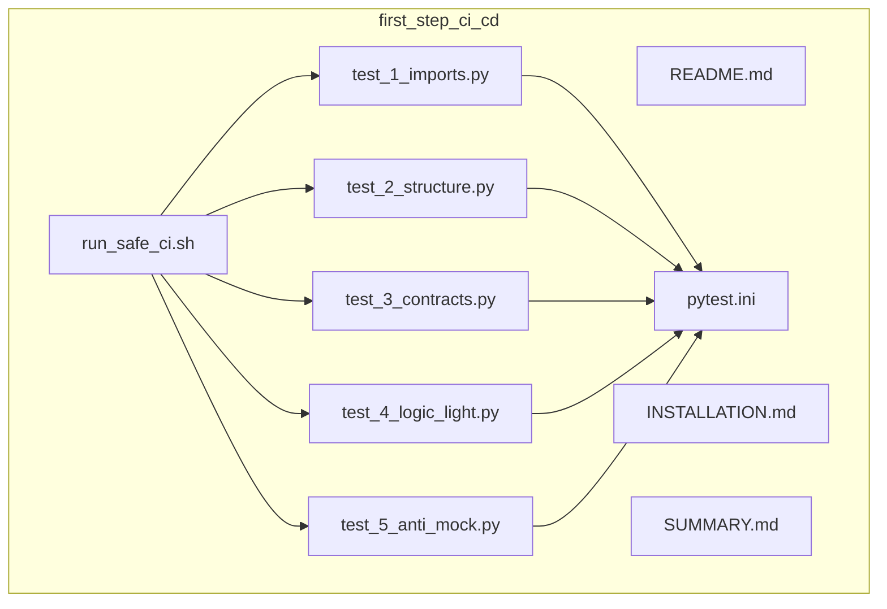
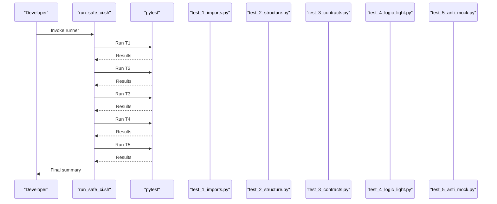
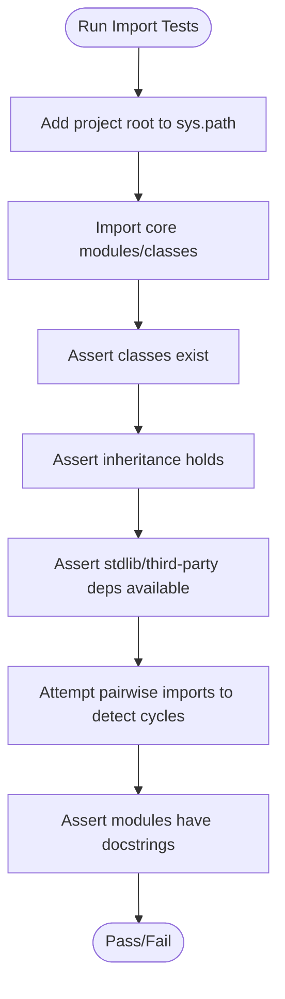
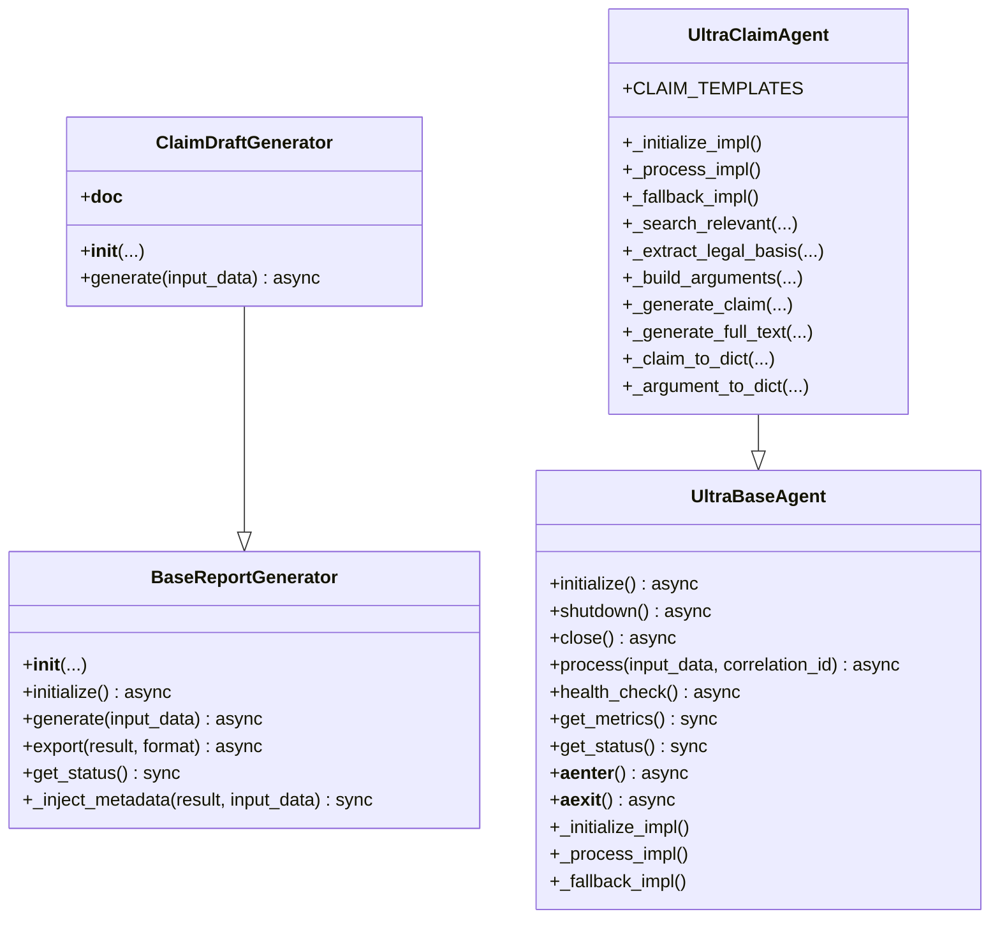
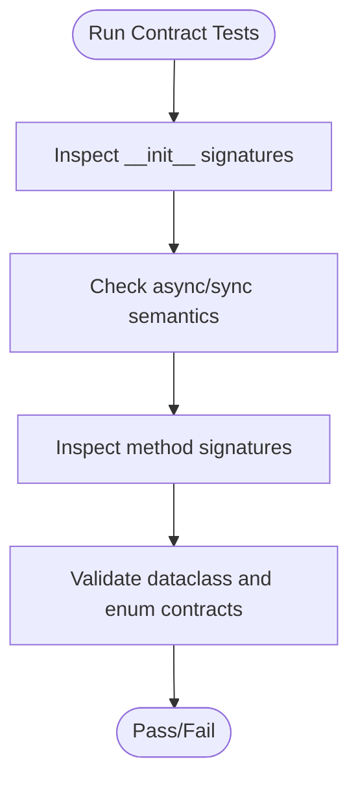
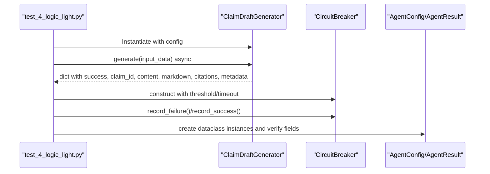
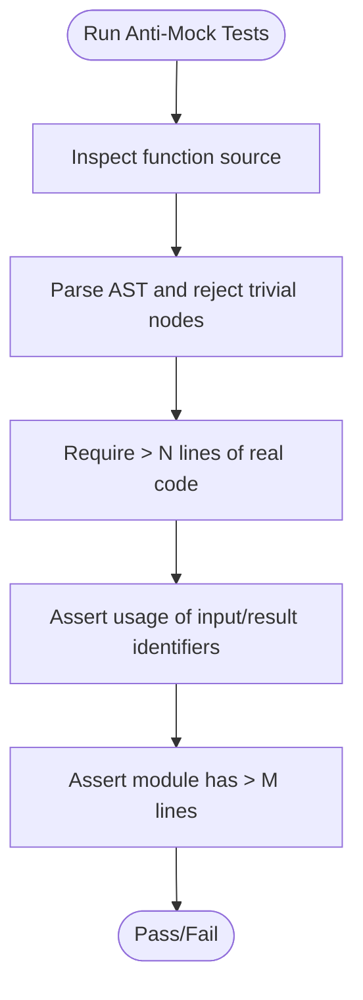
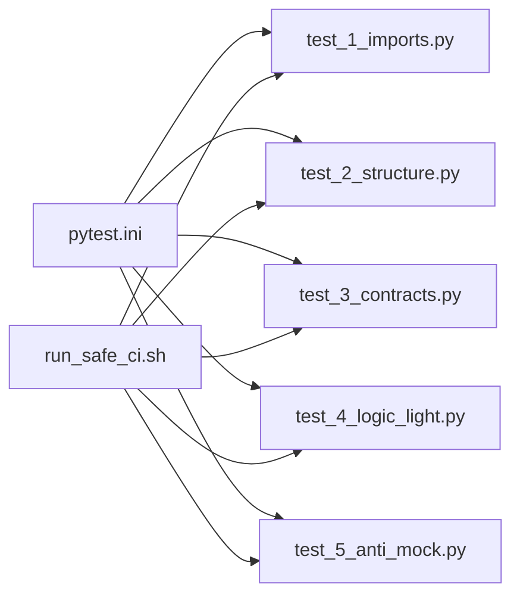

# First-Step CI/CD

<cite>
**Referenced Files in This Document**
- [README.md](file://first_step_ci_cd/README.md)
- [run_safe_ci.sh](file://first_step_ci_cd/run_safe_ci.sh)
- [pytest.ini](file://first_step_ci_cd/pytest.ini)
- [test_1_imports.py](file://first_step_ci_cd/test_1_imports.py)
- [test_2_structure.py](file://first_step_ci_cd/test_2_structure.py)
- [test_3_contracts.py](file://first_step_ci_cd/test_3_contracts.py)
- [test_4_logic_light.py](file://first_step_ci_cd/test_4_logic_light.py)
- [test_5_anti_mock.py](file://first_step_ci_cd/test_5_anti_mock.py)
- [INSTALLATION.md](file://first_step_ci_cd/INSTALLATION.md)
- [SUMMARY.md](file://first_step_ci_cd/SUMMARY.md)
- [ci_run_first_step.sh](file://scripts/ci_run_first_step.sh)
</cite>

## Table of Contents
1. [Introduction](#introduction)
2. [Project Structure](#project-structure)
3. [Core Components](#core-components)
4. [Architecture Overview](#architecture-overview)
5. [Detailed Component Analysis](#detailed-component-analysis)
6. [Dependency Analysis](#dependency-analysis)
7. [Performance Considerations](#performance-considerations)
8. [Troubleshooting Guide](#troubleshooting-guide)
9. [Conclusion](#conclusion)
10. [Appendices](#appendices)

## Introduction
This document explains the First-Step CI/CD system, a lightweight validation suite designed to provide rapid feedback during development. It acts as a pre-commit or pre-push gate to prevent common mistakes early by focusing on five categories:
- Import validation
- Structural integrity
- Contract compliance
- Light logic verification
- Anti-mock enforcement

The suite is intentionally fast, deterministic, and safe for constrained environments. It avoids heavy dependencies (LLMs, databases, external services) and ensures that implementations are real, not placeholders.

## Project Structure
The First-Step CI/CD lives under first_step_ci_cd and includes:
- Five test modules (one per category)
- A runner script to execute tests in sequence
- A pytest configuration file
- Documentation and installation/usage guides

**Diagram sources**
- [README.md](file://first_step_ci_cd/README.md#L1-L120)
- [run_safe_ci.sh](file://first_step_ci_cd/run_safe_ci.sh#L1-L157)
- [pytest.ini](file://first_step_ci_cd/pytest.ini#L1-L39)
- [test_1_imports.py](file://first_step_ci_cd/test_1_imports.py#L1-L181)
- [test_2_structure.py](file://first_step_ci_cd/test_2_structure.py#L1-L273)
- [test_3_contracts.py](file://first_step_ci_cd/test_3_contracts.py#L1-L283)
- [test_4_logic_light.py](file://first_step_ci_cd/test_4_logic_light.py#L1-L363)
- [test_5_anti_mock.py](file://first_step_ci_cd/test_5_anti_mock.py#L1-L385)
- [INSTALLATION.md](file://first_step_ci_cd/INSTALLATION.md#L1-L170)
- [SUMMARY.md](file://first_step_ci_cd/SUMMARY.md#L1-L210)

**Section sources**
- [README.md](file://first_step_ci_cd/README.md#L1-L120)
- [run_safe_ci.sh](file://first_step_ci_cd/run_safe_ci.sh#L1-L157)
- [pytest.ini](file://first_step_ci_cd/pytest.ini#L1-L39)

## Core Components
- Import validation tests: verify modules import cleanly, have non-empty content, and lack circular dependencies.
- Structural integrity tests: confirm classes have expected methods, attributes, inheritance, and dataclass/enums structure.
- Contract compliance tests: validate method signatures, async/sync semantics, and return-type expectations.
- Light logic tests: run minimal workflows with mocked heavy dependencies to ensure basic functionality.
- Anti-mock tests: enforce that implementations are real by inspecting source code and module sizes.

**Section sources**
- [README.md](file://first_step_ci_cd/README.md#L43-L120)
- [test_1_imports.py](file://first_step_ci_cd/test_1_imports.py#L1-L181)
- [test_2_structure.py](file://first_step_ci_cd/test_2_structure.py#L1-L273)
- [test_3_contracts.py](file://first_step_ci_cd/test_3_contracts.py#L1-L283)
- [test_4_logic_light.py](file://first_step_ci_cd/test_4_logic_light.py#L1-L363)
- [test_5_anti_mock.py](file://first_step_ci_cd/test_5_anti_mock.py#L1-L385)

## Architecture Overview
The system orchestrates tests through a shell script that invokes pytest for each category in order. The pytest configuration centralizes options and markers for consistent behavior.

**Diagram sources**
- [run_safe_ci.sh](file://first_step_ci_cd/run_safe_ci.sh#L41-L118)
- [test_1_imports.py](file://first_step_ci_cd/test_1_imports.py#L1-L181)
- [test_2_structure.py](file://first_step_ci_cd/test_2_structure.py#L1-L273)
- [test_3_contracts.py](file://first_step_ci_cd/test_3_contracts.py#L1-L283)
- [test_4_logic_light.py](file://first_step_ci_cd/test_4_logic_light.py#L1-L363)
- [test_5_anti_mock.py](file://first_step_ci_cd/test_5_anti_mock.py#L1-L385)

## Detailed Component Analysis

### Import Validation (test_1_imports.py)
Purpose:
- Ensure modules import without errors and are not empty placeholders.
- Detect circular imports.
- Confirm modules have expected content and documentation.

Key validations:
- Import core classes and verify they exist.
- Check presence of expected classes and supporting types.
- Verify inheritance relationships.
- Confirm availability of standard library and third-party dependencies.
- Detect circular imports by importing pairs of modules.
- Verify module-level metadata (docstrings and imports).

Implementation highlights:
- Adds project root to sys.path to resolve imports reliably.
- Uses fixtures and assertions to validate class presence and structure.
- Skips tests when optional dependencies are unavailable.

**Diagram sources**
- [test_1_imports.py](file://first_step_ci_cd/test_1_imports.py#L1-L181)

**Section sources**
- [test_1_imports.py](file://first_step_ci_cd/test_1_imports.py#L1-L181)

### Structural Integrity (test_2_structure.py)
Purpose:
- Verify classes have expected methods, attributes, and inheritance.
- Confirm abstract base classes and async method signatures.
- Validate data classes and enums.

Key validations:
- ABC checks for base classes.
- Presence of lifecycle and helper methods.
- Async/sync method detection via inspection.
- Signature inspection for required parameters.
- Dataclass and enum structure checks.

**Diagram sources**
- [test_2_structure.py](file://first_step_ci_cd/test_2_structure.py#L1-L273)

**Section sources**
- [test_2_structure.py](file://first_step_ci_cd/test_2_structure.py#L1-L273)

### Contract Compliance (test_3_contracts.py)
Purpose:
- Enforce method contracts: signatures, async/sync semantics, and return-type expectations.
- Validate data class and enum contracts.

Key validations:
- Parameter lists and defaults for constructors and methods.
- Async/sync method detection.
- Signature inspection for required parameters.
- Return-type expectations via method existence and type hints.
- Data class fields and enum values.

**Diagram sources**
- [test_3_contracts.py](file://first_step_ci_cd/test_3_contracts.py#L1-L283)

**Section sources**
- [test_3_contracts.py](file://first_step_ci_cd/test_3_contracts.py#L1-L283)

### Light Logic Verification (test_4_logic_light.py)
Purpose:
- Execute minimal logic flows without heavy dependencies.
- Mock expensive calls to keep tests fast and deterministic.

Key validations:
- Instance creation and configuration acceptance.
- Async generate produces structured output with required fields.
- Export helpers return expected formats.
- Lightweight components (e.g., CircuitBreaker) behave correctly.
- Data classes and enums produce expected values.

**Diagram sources**
- [test_4_logic_light.py](file://first_step_ci_cd/test_4_logic_light.py#L1-L363)

**Section sources**
- [test_4_logic_light.py](file://first_step_ci_cd/test_4_logic_light.py#L1-L363)

### Anti-Mock Enforcement (test_5_anti_mock.py)
Purpose:
- Prove implementations are real, not placeholders.
- Inspect function bodies and module sizes to reject stubs.

Key validations:
- Function source length and AST-based checks to reject trivial statements.
- Assertions that functions process input, build content, and use identifiers.
- Enterprise-grade logic checks for complex classes.
- Module size thresholds to ensure substantial implementation.

**Diagram sources**
- [test_5_anti_mock.py](file://first_step_ci_cd/test_5_anti_mock.py#L1-L385)

**Section sources**
- [test_5_anti_mock.py](file://first_step_ci_cd/test_5_anti_mock.py#L1-L385)

## Dependency Analysis
The suite is organized so that each test file depends on pytest configuration and imports target modules from the project. The runner script coordinates execution order and aggregates results.

**Diagram sources**
- [pytest.ini](file://first_step_ci_cd/pytest.ini#L1-L39)
- [run_safe_ci.sh](file://first_step_ci_cd/run_safe_ci.sh#L41-L118)
- [test_1_imports.py](file://first_step_ci_cd/test_1_imports.py#L1-L181)
- [test_2_structure.py](file://first_step_ci_cd/test_2_structure.py#L1-L273)
- [test_3_contracts.py](file://first_step_ci_cd/test_3_contracts.py#L1-L283)
- [test_4_logic_light.py](file://first_step_ci_cd/test_4_logic_light.py#L1-L363)
- [test_5_anti_mock.py](file://first_step_ci_cd/test_5_anti_mock.py#L1-L385)

**Section sources**
- [pytest.ini](file://first_step_ci_cd/pytest.ini#L1-L39)
- [run_safe_ci.sh](file://first_step_ci_cd/run_safe_ci.sh#L41-L118)

## Performance Considerations
- All tests are deterministic and avoid network calls, heavy LLMs, or external services.
- Memory usage remains low (<100 MB) and execution time is short (<30 seconds).
- The runner script provides a quick pass/fail summary and exits on first failure to accelerate feedback loops.

Practical tips:
- Use the quick invocation for pre-commit hooks.
- Run individual categories when isolating failures.
- Keep virtual environment dependencies minimal to reduce cold-start overhead.

**Section sources**
- [README.md](file://first_step_ci_cd/README.md#L94-L120)
- [SUMMARY.md](file://first_step_ci_cd/SUMMARY.md#L1-L90)

## Troubleshooting Guide
Common issues and resolutions:
- pytest not found: Install pytest and pytest-asyncio in your environment.
- Module import errors: Ensure you are in the project root and your virtual environment is activated.
- Slow initial runs: First-time import overhead; subsequent runs are faster.
- Anti-mock failures: Implement real logic in functions; avoid stubs like pass, NotImplementedError, or empty returns.

Usage patterns:
- Local development:
  - Run all tests: pytest first_step_ci_cd/ -v
  - Run a single category: pytest first_step_ci_cd/test_1_imports.py -v
  - Use the runner: bash first_step_ci_cd/run_safe_ci.sh
- Pre-commit hook:
  - Add a hook that runs pytest first_step_ci_cd/ -q
- GitHub Actions:
  - Install dependencies and run pytest first_step_ci_cd/ -v

**Section sources**
- [INSTALLATION.md](file://first_step_ci_cd/INSTALLATION.md#L1-L170)
- [README.md](file://first_step_ci_cd/README.md#L120-L165)
- [SUMMARY.md](file://first_step_ci_cd/SUMMARY.md#L90-L170)

## Conclusion
The First-Step CI/CD provides a fast, safe, and effective pre-commit/pre-push gate. By validating imports, structure, contracts, light logic, and anti-mock compliance, it prevents placeholder code and structural issues from reaching later stages. Combined with the runner script and pytest configuration, it delivers rapid feedback suitable for constrained environments while maintaining high confidence in recent work.

## Appendices

### Role of run_safe_ci.sh
- Validates pytest availability.
- Executes each test category in order with colored progress and short traceback.
- Aggregates results and prints a final summary.

**Section sources**
- [run_safe_ci.sh](file://first_step_ci_cd/run_safe_ci.sh#L1-L157)

### Configuration from pytest.ini
- Test discovery: python_files, python_classes, python_functions
- Output options: verbose, short traceback, strict markers, disable warnings, color
- Asyncio mode: auto
- Minimum Python version: 3.8
- Test paths and ignored directories
- Logging disabled

**Section sources**
- [pytest.ini](file://first_step_ci_cd/pytest.ini#L1-L39)

### CI Integration Example
- The repository includes a script that runs multiple gates in sequence, demonstrating how the First-Step suite fits into a broader CI pipeline.

**Section sources**
- [ci_run_first_step.sh](file://scripts/ci_run_first_step.sh#L1-L182)