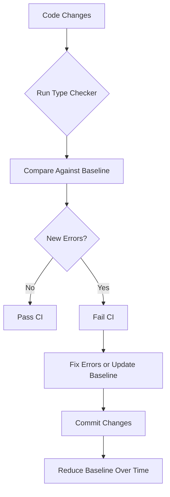

# Type Checking System

<cite>
**Referenced Files in This Document**   
- [run_mypy.sh](file://ci/mypy/run_mypy.sh)
- [update_baseline.sh](file://ci/mypy/update_baseline.sh)
- [check_mypy_non_regression.py](file://ci/mypy/check_mypy_non_regression.py)
- [baseline.txt](file://ci/mypy/baseline.txt)
- [mypy.ini](file://mypy.ini)
- [gate_2_types.sh](file://ci/first_step/gate_2_types.sh)
- [gate_7_mypy_non_regression.sh](file://ci/first_step/gate_7_mypy_non_regression.sh)
- [README.md](file://ci/mypy/README.md)
- [Makefile](file://Makefile)
</cite>

## Table of Contents
1. [Introduction](#introduction)
2. [Type Checking Infrastructure](#type-checking-infrastructure)
3. [Core Components](#core-components)
4. [Configuration and Setup](#configuration-and-setup)
5. [CI Integration](#ci-integration)
6. [Common Type Issues](#common-type-issues)
7. [Best Practices](#best-practices)
8. [Troubleshooting](#troubleshooting)

## Introduction

The Type Checking System in the MAHOUN platform implements a robust static type validation infrastructure using mypy. This system ensures code correctness and prevents runtime errors by catching type-related issues during development and CI/CD processes. The implementation follows a non-regression approach that allows for incremental improvement of type safety while preventing the introduction of new type errors.

The system is designed with a ratchet philosophy: existing type errors are tracked in a baseline, and CI will fail only when new errors are introduced. This approach enables teams to gradually improve type coverage without being blocked by legacy code issues. The infrastructure consists of several key components that work together to provide deterministic, stable type checking across different environments.

**Section sources**
- [README.md](file://ci/mypy/README.md#L1-L152)

## Type Checking Infrastructure

The type checking infrastructure is built around a baseline-driven, non-regression model that focuses on preventing the introduction of new type errors while allowing for gradual improvement of existing code. This approach recognizes that large codebases often have existing type issues that cannot be fixed immediately, but still need protection against future regressions.

The system's core principle is that CI will not fail if existing mypy errors remain, but will fail if new errors are introduced. This creates a "ratchet" effect where type safety can only improve over time. The infrastructure is designed to be stable and portable across different systems by normalizing error fingerprints to use only basename and line numbers, eliminating path differences between development and CI environments.

The system provides clear feedback on type checking results, distinguishing between fixed errors (which represent improvements) and new errors (which represent regressions). This allows developers to track progress in reducing the type error baseline over time, with the ultimate goal of achieving full type coverage.

**Diagram sources**
- [README.md](file://ci/mypy/README.md#L1-L152)
- [check_mypy_non_regression.py](file://ci/mypy/check_mypy_non_regression.py#L1-L181)

**Section sources**
- [README.md](file://ci/mypy/README.md#L1-L152)
- [check_mypy_non_regression.py](file://ci/mypy/check_mypy_non_regression.py#L1-L181)

## Core Components

### run_mypy.sh

The `run_mypy.sh` script executes mypy with stable, parseable output suitable for CI non-regression checks. It ensures deterministic output by disabling colors, pretty formatting, and error summaries. The script runs mypy on the core application directories (mahoun/ and api/) using the project's mypy.ini configuration file.

Key features of the script include:
- Stable output format for reliable parsing
- No ANSI colors or pretty formatting
- Suppressed error summaries (focus on error lines only)
- Inclusion of error codes for detailed analysis
- Proper error handling and exit codes

The script is designed to be called by other tools in the type checking pipeline rather than used directly by developers, ensuring consistent execution parameters across environments.

**Section sources**
- [run_mypy.sh](file://ci/mypy/run_mypy.sh#L1-L35)

### check_mypy_non_regression.py

The `check_mypy_non_regression.py` script is the heart of the non-regression type checking system. It compares current mypy output against a baseline to detect new errors, implementing the core logic that enables incremental type safety improvement. The script follows a three-step process: run mypy, parse errors, and compare against baseline.

The script normalizes error lines by stripping column numbers and using only basename for file paths, creating stable error fingerprints that are consistent across different systems. It ignores summary lines and focuses only on actual error messages. The comparison logic identifies three categories of changes:
- New errors (current but not in baseline) - causes CI failure
- Fixed errors (in baseline but not current) - represents improvement
- Existing errors (in both current and baseline) - tracked but doesn't fail CI

The script provides detailed output showing both new errors (if any) and fixed errors, helping developers understand the impact of their changes on type safety.

**Section sources**
- [check_mypy_non_regression.py](file://ci/mypy/check_mypy_non_regression.py#L1-L181)

### update_baseline.sh

The `update_baseline.sh` script updates the mypy baseline after intentional improvements to type safety. This script should be run only after fixing type errors or making intentional changes to type signatures that result in legitimate changes to mypy output.

The script calls `check_mypy_non_regression.py` with the `--update-baseline` flag, which captures the current mypy output and saves it as the new baseline. After running this script, developers should review the changes to the baseline.txt file in version control to ensure that only intended changes were made.

The script provides clear instructions for the next steps, including reviewing the git diff and committing the updated baseline. This creates an audit trail of type safety improvements over time.

**Section sources**
- [update_baseline.sh](file://ci/mypy/update_baseline.sh#L1-L24)

### baseline.txt

The `baseline.txt` file is the authoritative record of currently accepted type errors in the codebase. It contains a snapshot of mypy output that represents the current state of type safety, serving as the reference point for non-regression checks.

Each line in the baseline represents a specific type error, normalized to include only the filename, line number, error message, and error code. The file is sorted for deterministic comparison. When developers fix type errors, they should update this baseline to reflect the improved state.

The baseline is not a "cheat" to ignore problems, but rather a tool for tracking progress toward full type coverage. All type errors are visible in this file, making the current state of type safety transparent to the entire team. Over time, as errors are fixed, the baseline should shrink toward zero.

**Section sources**
- [baseline.txt](file://ci/mypy/baseline.txt#L1-L976)

## Configuration and Setup

### mypy.ini

The `mypy.ini` configuration file defines the type checking rules and settings for the project. It specifies a Python 3.12 target and enables various warnings to improve code quality. The configuration balances strictness with practicality, enabling strict optional checking and no implicit optional while allowing some flexibility in untyped definitions.

The file includes per-module overrides that apply stricter checking to core components of the system. Modules under mahoun.core.*, mahoun.ledger.*, mahoun.reasoning.*, mahoun.domain.*, mahoun.orchestrator.*, and api.* have `check_untyped_defs = True`, ensuring that functions in these critical areas are properly type-checked even if not explicitly typed.

Performance settings include incremental checking and a cache directory to speed up repeated runs. The output format is configured to show error codes and column numbers while maintaining readability.

**Section sources**
- [mypy.ini](file://mypy.ini#L1-L59)

### Makefile Integration

The Makefile provides convenient targets for type checking operations, integrating them into the developer workflow. Key targets include:

- `typecheck`: Runs the primary type checker (basedpyright, falling back to pyright or mypy)
- `mypy`: Runs the mypy non-regression check specifically
- `mypy-baseline`: Updates the mypy baseline after improvements

These targets abstract the underlying complexity of the type checking system, allowing developers to perform type checks with simple, memorable commands. The `mypy-baseline` target calls the `update_baseline.sh` script, ensuring consistent baseline updates across the team.

**Section sources**
- [Makefile](file://Makefile#L1-L217)

## CI Integration

### gate_2_types.sh

The `gate_2_types.sh` script implements the second gate in the CI pipeline, focusing on type safety. It attempts to use basedpyright or pyright if available, falling back to mypy as the default type checker. This multi-checker approach allows the team to leverage more advanced type checkers when available while maintaining compatibility with mypy.

For mypy runs, the script compares current output against the baseline file to determine if new errors have been introduced. If errors exist but are all accounted for in the baseline, the check passes. Only new errors cause the gate to fail, aligning with the non-regression philosophy.

The script provides clear color-coded output indicating the result of the type check and instructions for fixing issues when they arise.

**Section sources**
- [gate_2_types.sh](file://ci/first_step/gate_2_types.sh#L1-L103)

### gate_7_mypy_non_regression.sh

The `gate_7_mypy_non_regression.sh` script implements a dedicated non-regression check in the CI pipeline. It runs the `check_mypy_non_regression.py` script directly, providing a focused check on type safety regression.

This gate serves as a final safeguard against type errors, running after other CI gates. It uses the same non-regression logic as the development tools but in the controlled environment of the CI system, ensuring that no new type errors are merged into the main branch.

The script provides clear pass/fail output with instructions for addressing failures, including the recommended command to update the baseline if changes are intentional.

**Section sources**
- [gate_7_mypy_non_regression.sh](file://ci/first_step/gate_7_mypy_non_regression.sh#L1-L47)

## Common Type Issues

Analysis of the baseline.txt file reveals several common categories of type errors in the codebase:

### Undefined Attributes (attr-defined)
Numerous errors indicate attempts to access attributes that don't exist on certain types, particularly when working with optional values that might be None. These often occur when developers forget to check for None before accessing attributes.

### Redefined Names (no-redef)
Many files show name redefinition errors, where a name is defined multiple times, potentially shadowing imports or previous definitions. This can lead to confusion about which definition is being used.

### Union Attribute Access (union-attr)
Frequent errors occur when trying to access attributes on union types without proper narrowing, particularly when dealing with Optional types where the None case isn't properly handled.

### Operator Type Mismatches (operator)
Common issues involve using operators like +, -, <, and / with incompatible types, often when one operand might be None or when mixing different numeric types.

### Missing Type Annotations (var-annotated)
Many variables lack type annotations, forcing mypy to infer types or treat them as Any. This is particularly common in local variables within functions.

### Incompatible Assignments (assignment)
Errors occur when assigning values of one type to variables declared with an incompatible type, such as assigning a string to a numeric variable.

### Unreachable Code (unreachable)
Several functions contain code after return statements or in branches that can never be reached, indicating potential logic errors or leftover debug code.

**Section sources**
- [baseline.txt](file://ci/mypy/baseline.txt#L1-L976)

## Best Practices

### Incremental Improvement
Adopt a strategy of fixing high-value type errors first, such as those in core modules or those that indicate potential runtime issues. Update the baseline after each improvement to lock in gains and prevent regression.

### Targeted Fixes
Focus on fixing errors in newly modified code and critical path components. Use the per-module configuration in mypy.ini to gradually increase strictness in different parts of the codebase.

### Baseline Management
Update the baseline only after intentional improvements to type safety. Never update the baseline to bypass CI failures from new bugs. Each baseline update should be accompanied by a commit message explaining the improvements made.

### Developer Workflow
Integrate type checking into the development workflow using the Makefile targets. Run `make mypy` before committing to catch new errors early. Use `make typecheck` for comprehensive type checking during development.

### Documentation
When adding `# type: ignore` comments to suppress specific errors, always include a comment explaining why the ignore is necessary and whether it represents a temporary workaround or a permanent exception.

**Section sources**
- [README.md](file://ci/mypy/README.md#L1-L152)
- [Makefile](file://Makefile#L1-L217)

## Troubleshooting

### "New errors" without code changes
If new errors appear without code changes, possible causes include:
- Dependency updates that changed type stubs
- Mypy version changes
- Python version differences
- Environment-specific path issues

Verify that the baseline is up to date and that all team members are using compatible tool versions.

### CI passes locally but fails in CI
This discrepancy often occurs due to:
- Different mypy versions between local and CI environments
- Different Python versions
- Out-of-sync baseline files
- Path normalization issues

Ensure that the baseline.txt file is committed and that local environments match CI as closely as possible.

### Large number of errors
When facing a large number of type errors, use a prioritized approach:
1. Fix errors in recently modified code
2. Address high-severity errors (e.g., potential runtime failures)
3. Focus on core modules first
4. Update the baseline incrementally

Avoid attempting to fix all errors at once, as this can lead to burnout and lower-quality fixes.

**Section sources**
- [README.md](file://ci/mypy/README.md#L1-L152)
- [check_mypy_non_regression.py](file://ci/mypy/check_mypy_non_regression.py#L1-L181)