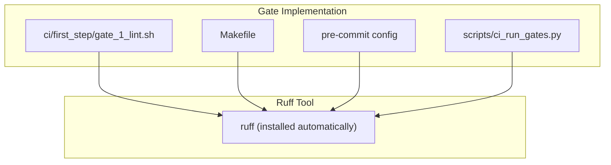
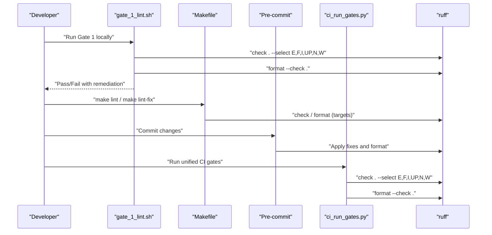
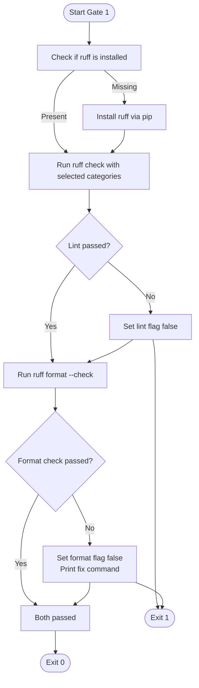
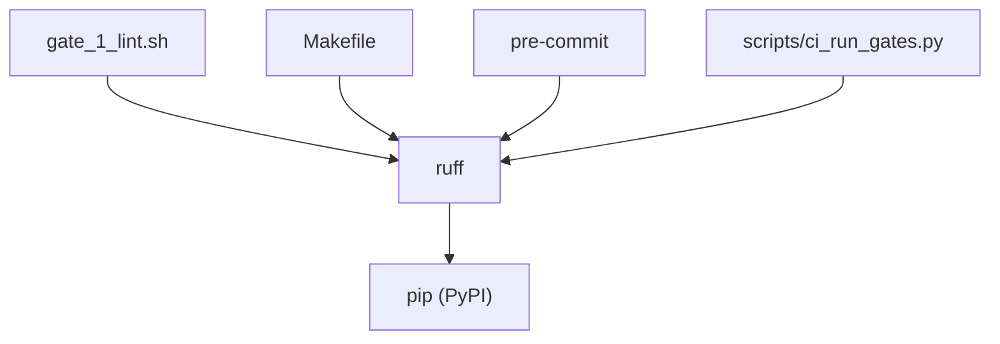

# Format and Lint

<cite>
**Referenced Files in This Document**
- [gate_1_lint.sh](file://ci/first_step/gate_1_lint.sh)
- [Makefile](file://Makefile)
- [.pre-commit-config.yaml](file://.pre-commit-config.yaml)
- [CI_LOCK.md](file://CI_LOCK.md)
- [CI_QUICKREF.md](file://CI_QUICKREF.md)
- [CI_PYTHON_GATES.md](file://CI_PYTHON_GATES.md)
- [scripts/ci_run_gates.py](file://scripts/ci_run_gates.py)
</cite>

## Table of Contents
1. [Introduction](#introduction)
2. [Project Structure](#project-structure)
3. [Core Components](#core-components)
4. [Architecture Overview](#architecture-overview)
5. [Detailed Component Analysis](#detailed-component-analysis)
6. [Dependency Analysis](#dependency-analysis)
7. [Performance Considerations](#performance-considerations)
8. [Troubleshooting Guide](#troubleshooting-guide)
9. [Conclusion](#conclusion)

## Introduction
This document explains the Format and Lint validation gate that enforces code style using ruff. It covers how the gate performs:
- Linting: detecting code quality issues (errors, syntax, import problems, undefined names, unused variables)
- Formatting: ensuring code style consistency across the codebase

It documents the script’s implementation, including automatic installation of ruff if missing, execution of lint and format checks, success/failure criteria, and remediation commands. It also highlights best practices for maintaining style compliance during development.

## Project Structure
The Format and Lint gate is implemented in two complementary ways:
- A Bash script that runs ruff locally and prints colored results
- A Makefile target that invokes ruff for lint and format checks
- A pre-commit configuration that auto-applies fixes and formatting
- A unified Python runner that executes the same checks as part of the CI pipeline

**Diagram sources**
- [gate_1_lint.sh](file://ci/first_step/gate_1_lint.sh#L26-L30)
- [Makefile](file://Makefile#L50-L59)
- [.pre-commit-config.yaml](file://.pre-commit-config.yaml#L18-L25)
- [scripts/ci_run_gates.py](file://scripts/ci_run_gates.py#L82-L90)

**Section sources**
- [gate_1_lint.sh](file://ci/first_step/gate_1_lint.sh#L1-L81)
- [Makefile](file://Makefile#L1-L200)
- [.pre-commit-config.yaml](file://.pre-commit-config.yaml#L1-L55)
- [scripts/ci_run_gates.py](file://scripts/ci_run_gates.py#L54-L102)

## Core Components
- Bash Gate Script: Executes ruff lint and format checks, installs ruff if missing, and reports pass/fail outcomes.
- Makefile Targets: Provides convenient commands to run lint and auto-fix formatting/lint issues.
- Pre-commit Hooks: Applies ruff fixes and formatting automatically on commit.
- Python Gate Runner: Executes the same checks as part of the unified CI pipeline.

Key behaviors:
- Automatic installation of ruff when not present
- Linting with selected categories: E, F, I, UP, N, W
- Formatting verification via a “check” mode
- Clear pass/fail messages and remediation guidance

**Section sources**
- [gate_1_lint.sh](file://ci/first_step/gate_1_lint.sh#L26-L30)
- [gate_1_lint.sh](file://ci/first_step/gate_1_lint.sh#L35-L42)
- [gate_1_lint.sh](file://ci/first_step/gate_1_lint.sh#L48-L58)
- [Makefile](file://Makefile#L50-L59)
- [.pre-commit-config.yaml](file://.pre-commit-config.yaml#L18-L25)
- [scripts/ci_run_gates.py](file://scripts/ci_run_gates.py#L82-L90)

## Architecture Overview
The gate integrates with multiple layers of developer workflows and CI systems. The following diagram maps how the gate is invoked and how ruff is used across environments.

**Diagram sources**
- [gate_1_lint.sh](file://ci/first_step/gate_1_lint.sh#L35-L58)
- [Makefile](file://Makefile#L50-L59)
- [.pre-commit-config.yaml](file://.pre-commit-config.yaml#L18-L25)
- [scripts/ci_run_gates.py](file://scripts/ci_run_gates.py#L82-L90)

## Detailed Component Analysis

### Bash Gate Script: gate_1_lint.sh
Responsibilities:
- Determine project root and change to it
- Automatically install ruff if not present
- Run ruff lint with selected categories and GitHub-style output
- Run ruff format in check mode
- Report pass/fail and provide remediation commands

Implementation highlights:
- Automatic installation: checks for ruff binary and installs via pip if missing
- Lint execution: runs ruff check with a curated set of categories and GitHub output format
- Format execution: runs ruff format --check to verify style compliance
- Outcome handling: sets flags for lint and format passes, prints success/failure, and exits with appropriate codes

Success criteria:
- Both lint and format checks must pass for the gate to succeed

Failure implications:
- The script prints remediation commands to fix issues

Remediation commands:
- Fix lint issues: ruff check --fix .
- Fix formatting: ruff format .

**Diagram sources**
- [gate_1_lint.sh](file://ci/first_step/gate_1_lint.sh#L26-L30)
- [gate_1_lint.sh](file://ci/first_step/gate_1_lint.sh#L35-L42)
- [gate_1_lint.sh](file://ci/first_step/gate_1_lint.sh#L48-L58)
- [gate_1_lint.sh](file://ci/first_step/gate_1_lint.sh#L63-L74)

**Section sources**
- [gate_1_lint.sh](file://ci/first_step/gate_1_lint.sh#L1-L81)

### Makefile Targets: lint and lint-fix
Responsibilities:
- Provide convenient commands to run lint and auto-fix formatting/lint issues
- Mirror the gate’s behavior for local development

Commands:
- make lint: runs ruff check with selected categories and ruff format --check
- make lint-fix: runs ruff check --fix with selected categories and ruff format

Best practice:
- Use make lint-fix to apply fixes quickly before re-running the gate

**Section sources**
- [Makefile](file://Makefile#L50-L59)

### Pre-commit Hooks: .pre-commit-config.yaml
Responsibilities:
- Apply ruff fixes and formatting automatically on commit
- Reduce manual intervention by integrating with the commit workflow

Hooks:
- ruff: applies fixes and selects categories E, F, I, UP, N, W
- ruff-format: ensures formatting is applied

Best practice:
- Install pre-commit and run pre-commit run --all-files to catch issues early

**Section sources**
- [.pre-commit-config.yaml](file://.pre-commit-config.yaml#L18-L25)

### Python Gate Runner: scripts/ci_run_gates.py
Responsibilities:
- Execute the same lint/format checks as part of the unified CI pipeline
- Provide structured logging and timing for gates

Execution:
- Gate 1 runs ruff check with selected categories and ruff format --check

Best practice:
- Use the Python runner for consistent CI behavior across platforms

**Section sources**
- [scripts/ci_run_gates.py](file://scripts/ci_run_gates.py#L82-L90)

## Dependency Analysis
The gate depends on ruff being available. The following diagram shows how the gate integrates with the broader toolchain.

**Diagram sources**
- [gate_1_lint.sh](file://ci/first_step/gate_1_lint.sh#L26-L30)
- [Makefile](file://Makefile#L50-L59)
- [.pre-commit-config.yaml](file://.pre-commit-config.yaml#L18-L25)
- [scripts/ci_run_gates.py](file://scripts/ci_run_gates.py#L82-L90)

**Section sources**
- [gate_1_lint.sh](file://ci/first_step/gate_1_lint.sh#L26-L30)
- [Makefile](file://Makefile#L50-L59)
- [.pre-commit-config.yaml](file://.pre-commit-config.yaml#L18-L25)
- [scripts/ci_run_gates.py](file://scripts/ci_run_gates.py#L82-L90)

## Performance Considerations
- The gate runs ruff check and ruff format --check across the repository. On large repositories, this can take several seconds to a minute depending on machine and cache state.
- Using pre-commit reduces CI overhead by catching issues earlier.
- The Makefile targets and Bash gate both leverage ruff caching; clearing caches (e.g., cleaning temp files) can reset performance characteristics.

[No sources needed since this section provides general guidance]

## Troubleshooting Guide
Common issues and resolutions:
- Inconsistent indentation: Use the auto-fix command to resolve formatting issues.
- Unused imports: The lint categories include import-related rules; use the auto-fix command to remove unused imports.
- Undefined names and syntax errors: The lint categories include E and F; use the auto-fix command to address these.

Remediation commands:
- Fix lint issues: ruff check --fix .
- Fix formatting: ruff format .

Local verification:
- Run the gate locally via the Bash script or Makefile targets before pushing changes.

Documentation references:
- Local run and auto-fix commands are documented in the CI policy and quick reference guides.

**Section sources**
- [CI_LOCK.md](file://CI_LOCK.md#L70-L82)
- [CI_QUICKREF.md](file://CI_QUICKREF.md#L90-L97)
- [CI_QUICKREF.md](file://CI_QUICKREF.md#L130-L143)

## Conclusion
The Format and Lint gate enforces code style compliance using ruff across linting and formatting. It provides multiple integration points—Bash script, Makefile, pre-commit, and Python runner—ensuring developers can catch and fix issues early. By following the documented remediation commands and adopting pre-commit hooks, teams can maintain consistent style and reduce CI failures.