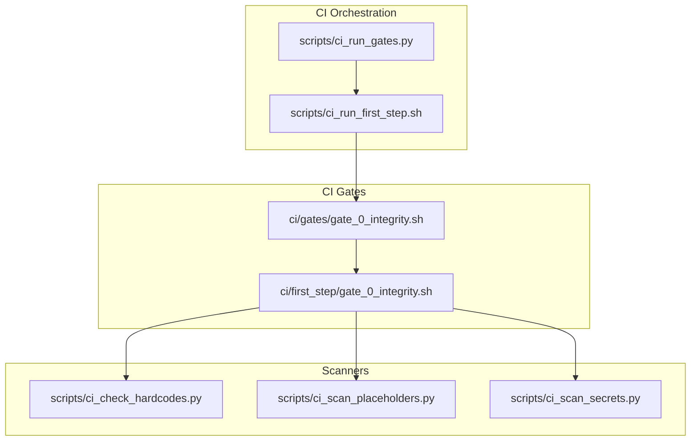
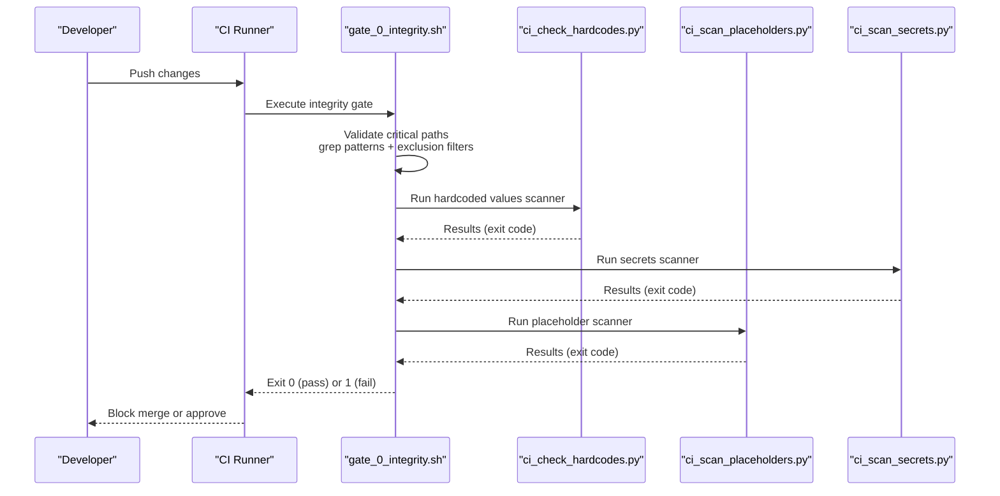
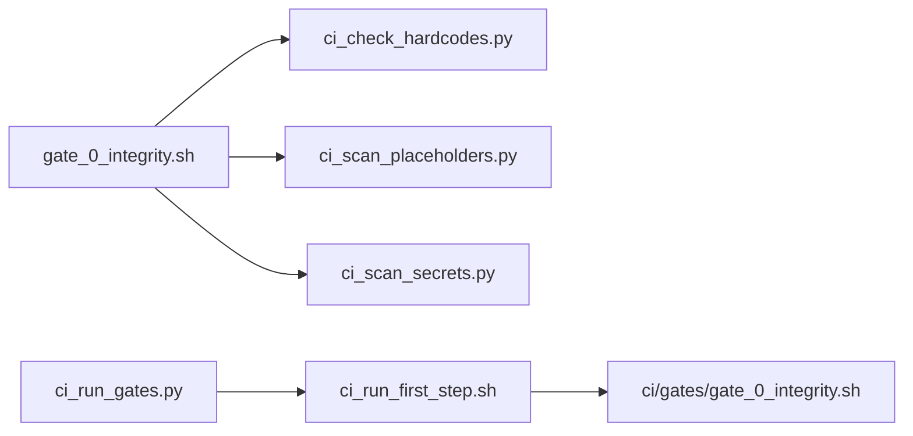

# Repository Integrity

<cite>
**Referenced Files in This Document**
- [gate_0_integrity.sh](file://ci/first_step/gate_0_integrity.sh)
- [gate_0_integrity.sh (wrapper)](file://ci/gates/gate_0_integrity.sh)
- [ci_check_hardcodes.py](file://scripts/ci_check_hardcodes.py)
- [ci_scan_placeholders.py](file://scripts/ci_scan_placeholders.py)
- [ci_scan_secrets.py](file://scripts/ci_scan_secrets.py)
- [ci_run_first_step.sh](file://scripts/ci_run_first_step.sh)
- [ci_run_gates.py](file://scripts/ci_run_gates.py)
</cite>

## Table of Contents
1. [Introduction](#introduction)
2. [Project Structure](#project-structure)
3. [Core Components](#core-components)
4. [Architecture Overview](#architecture-overview)
5. [Detailed Component Analysis](#detailed-component-analysis)
6. [Dependency Analysis](#dependency-analysis)
7. [Performance Considerations](#performance-considerations)
8. [Troubleshooting Guide](#troubleshooting-guide)
9. [Conclusion](#conclusion)

## Introduction
This document explains the Repository Integrity validation gate that prevents placeholder patterns and secrets from reaching the main branch. It focuses on detecting and blocking:
- Placeholder patterns: pass statements, TODO/FIXME/XXX comments, NotImplementedError stubs, and empty return statements
- Hardcoded secrets and sensitive values in critical paths

The gate scans core runtime areas (mahoun/core/, mahoun/domain/, mahoun/schemas/, mahoun/orchestrator/, mahoun/mcp/, api/) and integrates with dedicated scanners for secrets and placeholder patterns. It enforces strict success criteria and clearly communicates failure implications to prevent unsafe merges.

## Project Structure
The integrity gate is implemented as a Bash script that orchestrates multiple scanners and applies path filtering to critical runtime paths. Supporting Python scripts handle secret detection and placeholder pattern scanning.

**Diagram sources**
- [gate_0_integrity.sh](file://ci/first_step/gate_0_integrity.sh#L1-L210)
- [gate_0_integrity.sh (wrapper)](file://ci/gates/gate_0_integrity.sh#L1-L9)
- [ci_check_hardcodes.py](file://scripts/ci_check_hardcodes.py#L1-L160)
- [ci_scan_placeholders.py](file://scripts/ci_scan_placeholders.py#L1-L294)
- [ci_scan_secrets.py](file://scripts/ci_scan_secrets.py#L1-L292)
- [ci_run_first_step.sh](file://scripts/ci_run_first_step.sh#L74-L134)
- [ci_run_gates.py](file://scripts/ci_run_gates.py#L135-L195)

**Section sources**
- [gate_0_integrity.sh](file://ci/first_step/gate_0_integrity.sh#L1-L210)
- [gate_0_integrity.sh (wrapper)](file://ci/gates/gate_0_integrity.sh#L1-L9)
- [ci_check_hardcodes.py](file://scripts/ci_check_hardcodes.py#L1-L160)
- [ci_scan_placeholders.py](file://scripts/ci_scan_placeholders.py#L1-L294)
- [ci_scan_secrets.py](file://scripts/ci_scan_secrets.py#L1-L292)
- [ci_run_first_step.sh](file://scripts/ci_run_first_step.sh#L74-L134)
- [ci_run_gates.py](file://scripts/ci_run_gates.py#L135-L195)

## Core Components
- Integrity gate (Bash): Validates placeholder patterns and secrets in critical paths; aggregates violations; exits with failure if any violations are found.
- Hardcoded values scanner (Python): Detects hardcoded paths and credentials across Python files with configurable exclusions.
- Placeholder pattern scanner (Python): Identifies pass statements, ellipsis, NotImplementedError stubs, TODO/FIXME/XXX comments, and empty returns.
- Secrets scanner (Python): Detects cryptographic keys, tokens, and other sensitive identifiers with allowed-pattern filtering.
- CI orchestration: Integrates gate execution into the broader CI pipeline.

Key success criteria:
- No placeholder violations in critical paths
- No hardcoded secrets or sensitive values
- No empty return stubs (warning level)
- No NotImplementedError stubs in critical paths

Failure implications:
- Merge blocked with explicit error messages
- Violations summarized with remediation steps

**Section sources**
- [gate_0_integrity.sh](file://ci/first_step/gate_0_integrity.sh#L1-L210)
- [ci_check_hardcodes.py](file://scripts/ci_check_hardcodes.py#L1-L160)
- [ci_scan_placeholders.py](file://scripts/ci_scan_placeholders.py#L1-L294)
- [ci_scan_secrets.py](file://scripts/ci_scan_secrets.py#L1-L292)

## Architecture Overview
The integrity gate runs in two stages:
1. Bash gate validates placeholder patterns and secrets in critical paths and invokes Python scanners.
2. Python scanners perform targeted detection with exclusion filters and severity classification.

**Diagram sources**
- [gate_0_integrity.sh](file://ci/first_step/gate_0_integrity.sh#L1-L210)
- [ci_check_hardcodes.py](file://scripts/ci_check_hardcodes.py#L1-L160)
- [ci_scan_placeholders.py](file://scripts/ci_scan_placeholders.py#L1-L294)
- [ci_scan_secrets.py](file://scripts/ci_scan_secrets.py#L1-L292)

## Detailed Component Analysis

### Integrity Gate (Bash) Implementation
Responsibilities:
- Define critical paths (mahoun/core, mahoun/domain, mahoun/schemas, mahoun/orchestrator, mahoun/mcp, api)
- Build exclusion filters for tests, caches, virtual environments, and compiled files
- Detect placeholder patterns:
  - pass statements
  - TODO/FIXME/XXX comments
  - NotImplementedError stubs
  - empty return statements (warn)
- Invoke Python scanners for secrets and placeholder patterns
- Aggregate violations and enforce success criteria

Implementation highlights:
- Uses recursive grep with include/exclude filters to target critical paths
- Applies multiple grep filters to exclude tests and false positives
- Executes Python scanners and interprets exit codes to mark violations
- Emits human-readable summaries and remediation steps

Success criteria:
- No placeholder violations in critical paths
- No hardcoded secrets or sensitive values
- No NotImplementedError stubs in critical paths
- No empty return stubs in critical paths (warning)

Failure implications:
- Merge blocked with explicit error messages
- Remediation steps provided for each category

**Section sources**
- [gate_0_integrity.sh](file://ci/first_step/gate_0_integrity.sh#L1-L210)

### Secret Detection via ci_check_hardcodes.py
Scope:
- Scans Python files for hardcoded paths and credentials
- Excludes test directories, caches, and known safe files

Detection logic:
- Forbidden path patterns (e.g., home directories, mounted paths)
- Forbidden credential patterns (e.g., passwords, API keys, AWS keys)
- Skips comments and docstrings to reduce false positives
- Ignores specific directories and files

Output and exit codes:
- Reports hardcoded paths and credentials
- Returns distinct exit codes indicating presence of issues
- Provides clear pass/fail messaging

**Section sources**
- [ci_check_hardcodes.py](file://scripts/ci_check_hardcodes.py#L1-L160)

### Placeholder Pattern Scanning (ci_scan_placeholders.py)
Scope:
- Scans core runtime paths (mahoun, api, config) for placeholder indicators
- Excludes test files and build artifacts

Patterns detected:
- Standalone pass statements and ellipsis
- NotImplementedError without context
- Empty returns (warn)
- TODO/FIXME/XXX/HACK comments
- Functions with pass as body

Exclusions and heuristics:
- Excludes test files and directories
- Allows pass in except/finally contexts and abstract methods
- Groups issues by severity and prints actionable summaries

**Section sources**
- [ci_scan_placeholders.py](file://scripts/ci_scan_placeholders.py#L1-L294)

### Secrets Scanning (ci_scan_secrets.py)
Scope:
- Scans Python files and configuration files for sensitive identifiers
- Applies allowed-pattern filtering to avoid false positives

Patterns detected:
- AWS keys, private keys, Stripe tokens, GitHub/GitLab tokens, Google API keys, Slack tokens, and webhooks
- Allowed placeholders (e.g., YOUR_, CHANGEME, example, test, sk_test)

Severity and exit behavior:
- Critical severity triggers immediate failure
- Medium severity can fail depending on configuration
- Low severity treated as warning

**Section sources**
- [ci_scan_secrets.py](file://scripts/ci_scan_secrets.py#L1-L292)

### CI Orchestration Integration
- The gate is invoked by CI scripts that manage gate execution order and summarize results.
- The wrapper gate delegates to the canonical gate script.

**Section sources**
- [gate_0_integrity.sh (wrapper)](file://ci/gates/gate_0_integrity.sh#L1-L9)
- [ci_run_first_step.sh](file://scripts/ci_run_first_step.sh#L74-L134)
- [ci_run_gates.py](file://scripts/ci_run_gates.py#L135-L195)

## Dependency Analysis
The integrity gate depends on:
- Bash grep for fast, lightweight pattern matching in critical paths
- Python scanners for comprehensive detection of secrets and placeholder patterns
- CI orchestration scripts to integrate gate execution into the pipeline

**Diagram sources**
- [gate_0_integrity.sh](file://ci/first_step/gate_0_integrity.sh#L1-L210)
- [ci_check_hardcodes.py](file://scripts/ci_check_hardcodes.py#L1-L160)
- [ci_scan_placeholders.py](file://scripts/ci_scan_placeholders.py#L1-L294)
- [ci_scan_secrets.py](file://scripts/ci_scan_secrets.py#L1-L292)
- [gate_0_integrity.sh (wrapper)](file://ci/gates/gate_0_integrity.sh#L1-L9)
- [ci_run_first_step.sh](file://scripts/ci_run_first_step.sh#L74-L134)
- [ci_run_gates.py](file://scripts/ci_run_gates.py#L135-L195)

**Section sources**
- [gate_0_integrity.sh](file://ci/first_step/gate_0_integrity.sh#L1-L210)
- [ci_check_hardcodes.py](file://scripts/ci_check_hardcodes.py#L1-L160)
- [ci_scan_placeholders.py](file://scripts/ci_scan_placeholders.py#L1-L294)
- [ci_scan_secrets.py](file://scripts/ci_scan_secrets.py#L1-L292)
- [gate_0_integrity.sh (wrapper)](file://ci/gates/gate_0_integrity.sh#L1-L9)
- [ci_run_first_step.sh](file://scripts/ci_run_first_step.sh#L74-L134)
- [ci_run_gates.py](file://scripts/ci_run_gates.py#L135-L195)

## Performance Considerations
- The Bash gate uses grep with exclusion filters to minimize IO and scanning overhead.
- Python scanners traverse only relevant directories and skip excluded paths and files.
- Early termination on first violation reduces unnecessary scanning.
- Parallelization is not used; the gate favors simplicity and determinism.

[No sources needed since this section provides general guidance]

## Troubleshooting Guide
Common issues and resolutions:
- Accidental placeholder commits:
  - Replace pass statements with real implementations
  - Remove TODO/FIXME/XXX comments or move them to issues
  - Implement NotImplementedError stubs instead of leaving them as placeholders
- Hardcoded credentials:
  - Externalize secrets to environment variables or secret managers
  - Remove hardcoded values from code and configuration files
  - Use allowed placeholders only in templates and examples

Failure scenarios and remedies:
- Placeholder violations in critical paths:
  - Fix by implementing real logic and removing stubs
- NotImplementedError in critical paths:
  - Implement the method or remove the stub
- Hardcoded secrets:
  - Rotate and revoke exposed secrets, externalize to secure stores
- Empty return stubs:
  - Replace with meaningful return values or raise appropriate exceptions

**Section sources**
- [gate_0_integrity.sh](file://ci/first_step/gate_0_integrity.sh#L1-L210)
- [ci_check_hardcodes.py](file://scripts/ci_check_hardcodes.py#L1-L160)
- [ci_scan_placeholders.py](file://scripts/ci_scan_placeholders.py#L1-L294)
- [ci_scan_secrets.py](file://scripts/ci_scan_secrets.py#L1-L292)

## Conclusion
The Repository Integrity gate enforces high standards for codebase integrity and dependency correctness by blocking placeholder patterns and secrets from entering main. It achieves this through targeted scanning of critical paths, robust exclusion filters, and clear success/failure criteria. By integrating with CI orchestration and dedicated scanners, it provides a reliable safety net that protects the codebase from unsafe commits while offering actionable remediation guidance.

[No sources needed since this section summarizes without analyzing specific files]