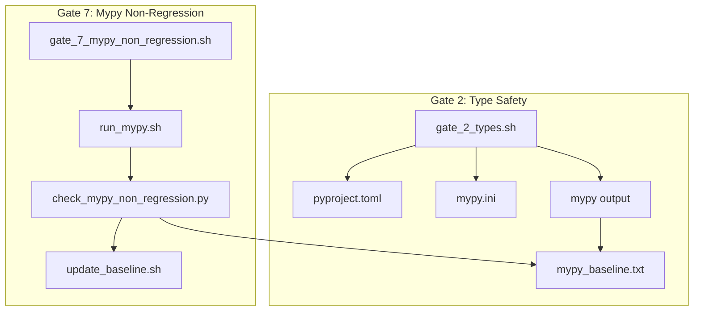
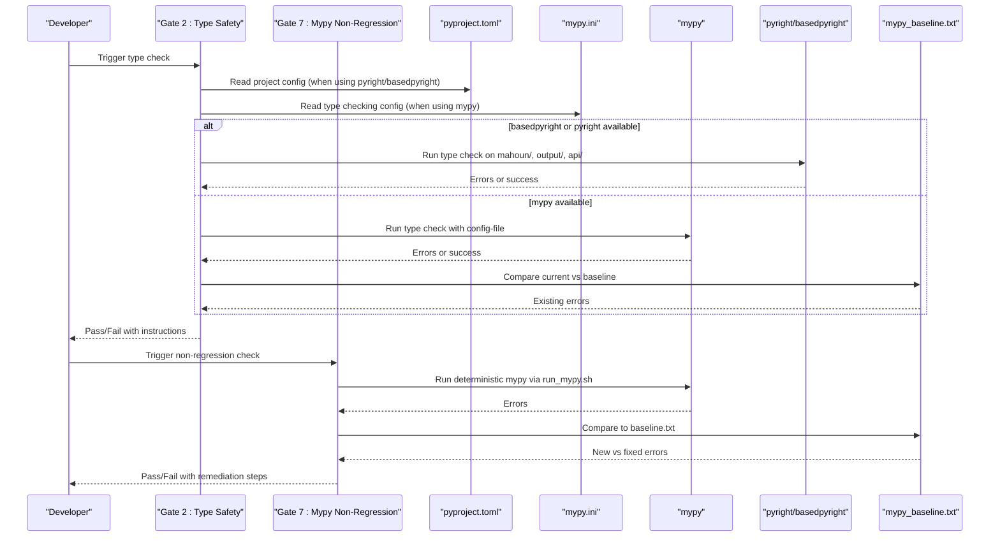
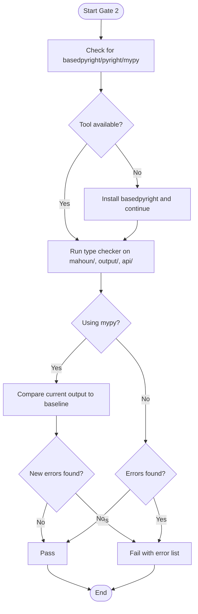
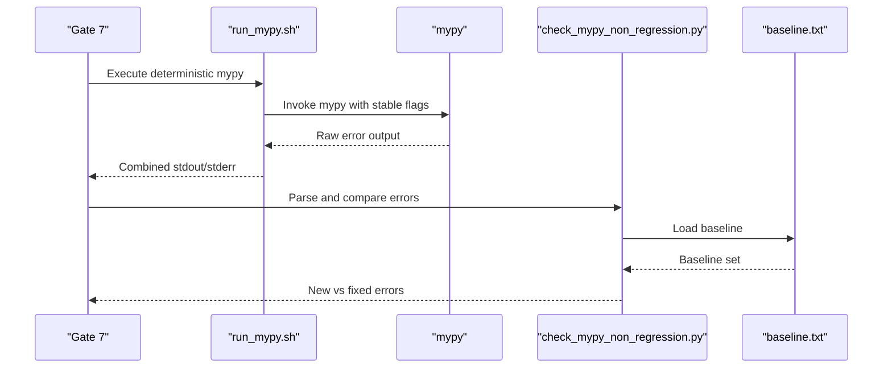
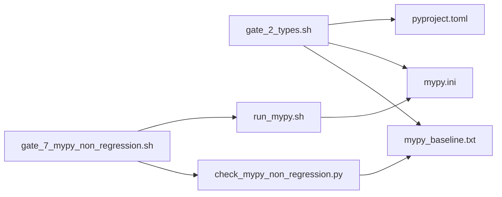

# Type Safety

<cite>
**Referenced Files in This Document**
- [gate_2_types.sh](file://ci/first_step/gate_2_types.sh)
- [mypy.ini](file://mypy.ini)
- [pyproject.toml](file://pyproject.toml)
- [run_mypy.sh](file://ci/mypy/run_mypy.sh)
- [check_mypy_non_regression.py](file://ci/mypy/check_mypy_non_regression.py)
- [update_baseline.sh](file://ci/mypy/update_baseline.sh)
- [mypy_baseline.txt](file://mypy_baseline.txt)
- [gate_7_mypy_non_regression.sh](file://ci/first_step/gate_7_mypy_non_regression.sh)
</cite>

## Table of Contents
1. [Introduction](#introduction)
2. [Project Structure](#project-structure)
3. [Core Components](#core-components)
4. [Architecture Overview](#architecture-overview)
5. [Detailed Component Analysis](#detailed-component-analysis)
6. [Dependency Analysis](#dependency-analysis)
7. [Performance Considerations](#performance-considerations)
8. [Troubleshooting Guide](#troubleshooting-guide)
9. [Conclusion](#conclusion)

## Introduction
This document explains the Type Safety validation gate that enforces static type checking across the repository. It covers:
- Checker selection priority (basedpyright/pyright first, then mypy)
- Configuration via pyproject.toml or mypy.ini
- Baseline comparison for mypy to prevent regressions
- How the gate runs type checking on critical directories (mahoun/, output/, api/)
- How results are interpreted: distinguishing existing baseline errors from new type violations
- Success criteria and failure implications
- Common type issues and resolution strategies

## Project Structure
The type safety enforcement spans two complementary gates:
- Gate 2: Type Safety (runs basedpyright/pyright or mypy on core directories)
- Gate 7: Mypy Non-Regression (ensures no new mypy errors beyond the baseline)

**Diagram sources**
- [gate_2_types.sh](file://ci/first_step/gate_2_types.sh#L1-L103)
- [pyproject.toml](file://pyproject.toml#L1-L104)
- [mypy.ini](file://mypy.ini#L1-L59)
- [run_mypy.sh](file://ci/mypy/run_mypy.sh#L1-L35)
- [check_mypy_non_regression.py](file://ci/mypy/check_mypy_non_regression.py#L1-L181)
- [update_baseline.sh](file://ci/mypy/update_baseline.sh#L1-L24)
- [mypy_baseline.txt](file://mypy_baseline.txt#L1-L20)

**Section sources**
- [gate_2_types.sh](file://ci/first_step/gate_2_types.sh#L1-L103)
- [gate_7_mypy_non_regression.sh](file://ci/first_step/gate_7_mypy_non_regression.sh#L1-L47)

## Core Components
- Gate 2: Type Safety
  - Selects a type checker in order: basedpyright, pyright, mypy
  - Uses pyproject.toml for project configuration when applicable
  - For mypy, runs on mahoun/, output/, api/ and compares current output to a baseline file
  - Passes if no new type errors beyond baseline; otherwise fails with actionable instructions
- Gate 7: Mypy Non-Regression
  - Runs mypy deterministically via run_mypy.sh
  - Compares current errors to baseline.txt and reports new/fixed errors
  - Provides a script to update the baseline after intentional improvements

Key configuration files:
- pyproject.toml: project metadata and dev dependencies (includes mypy)
- mypy.ini: type checking strictness and module-specific overrides

**Section sources**
- [gate_2_types.sh](file://ci/first_step/gate_2_types.sh#L1-L103)
- [mypy.ini](file://mypy.ini#L1-L59)
- [pyproject.toml](file://pyproject.toml#L1-L104)
- [run_mypy.sh](file://ci/mypy/run_mypy.sh#L1-L35)
- [check_mypy_non_regression.py](file://ci/mypy/check_mypy_non_regression.py#L1-L181)
- [update_baseline.sh](file://ci/mypy/update_baseline.sh#L1-L24)
- [mypy_baseline.txt](file://mypy_baseline.txt#L1-L20)
- [gate_7_mypy_non_regression.sh](file://ci/first_step/gate_7_mypy_non_regression.sh#L1-L47)

## Architecture Overview
The type safety pipeline integrates shell scripts, Python utilities, and configuration files to provide layered enforcement:
- Shell-driven gate 2 validates type safety across core directories and supports fallbacks
- Shell-driven gate 7 ensures no new mypy errors by comparing to a stable baseline
- Python utilities normalize and compare mypy outputs deterministically

**Diagram sources**
- [gate_2_types.sh](file://ci/first_step/gate_2_types.sh#L1-L103)
- [pyproject.toml](file://pyproject.toml#L1-L104)
- [mypy.ini](file://mypy.ini#L1-L59)
- [run_mypy.sh](file://ci/mypy/run_mypy.sh#L1-L35)
- [check_mypy_non_regression.py](file://ci/mypy/check_mypy_non_regression.py#L1-L181)
- [mypy_baseline.txt](file://mypy_baseline.txt#L1-L20)
- [gate_7_mypy_non_regression.sh](file://ci/first_step/gate_7_mypy_non_regression.sh#L1-L47)

## Detailed Component Analysis

### Gate 2: Type Safety (shell)
Responsibilities:
- Determine and install a type checker if missing
- Run type checking on mahoun/, output/, api/
- For mypy, compute new errors by comparing to baseline
- Report pass/fail and provide local reproduction commands

Implementation highlights:
- Checker selection priority: basedpyright > pyright > mypy
- Uses pyproject.toml for project configuration when invoking pyright/basedpyright
- For mypy, reads mypy.ini and compares current output to mypy_baseline.txt
- Distinguishes between existing baseline errors and newly introduced errors

Success criteria:
- No new type errors beyond baseline (for mypy)
- No type errors reported (for pyright/basedpyright)

Failure implications:
- CI fails with instructions to fix types locally and re-run

**Diagram sources**
- [gate_2_types.sh](file://ci/first_step/gate_2_types.sh#L1-L103)
- [mypy_baseline.txt](file://mypy_baseline.txt#L1-L20)

**Section sources**
- [gate_2_types.sh](file://ci/first_step/gate_2_types.sh#L1-L103)

### Gate 7: Mypy Non-Regression (shell + Python)
Responsibilities:
- Run mypy deterministically (no colors, no summaries)
- Parse and normalize mypy output lines
- Compare current errors to baseline.txt
- Report new vs fixed errors and exit with appropriate codes

Key behaviors:
- Deterministic output via run_mypy.sh
- Normalization strips column numbers and uses filenames for stability
- Compares sets of normalized error lines
- Provides a script to update baseline after intentional improvements

**Diagram sources**
- [gate_7_mypy_non_regression.sh](file://ci/first_step/gate_7_mypy_non_regression.sh#L1-L47)
- [run_mypy.sh](file://ci/mypy/run_mypy.sh#L1-L35)
- [check_mypy_non_regression.py](file://ci/mypy/check_mypy_non_regression.py#L1-L181)
- [mypy_baseline.txt](file://mypy_baseline.txt#L1-L20)

**Section sources**
- [gate_7_mypy_non_regression.sh](file://ci/first_step/gate_7_mypy_non_regression.sh#L1-L47)
- [run_mypy.sh](file://ci/mypy/run_mypy.sh#L1-L35)
- [check_mypy_non_regression.py](file://ci/mypy/check_mypy_non_regression.py#L1-L181)
- [update_baseline.sh](file://ci/mypy/update_baseline.sh#L1-L24)

### Configuration: pyproject.toml and mypy.ini
- pyproject.toml
  - Declares project metadata and dev dependencies including mypy
  - Used by pyright/basedpyright to resolve project structure and settings
- mypy.ini
  - Controls mypy behavior: strictness flags, import handling, output formatting, caching, and per-module overrides
  - Enables stricter checking for core modules (mahoun.core.*, mahoun.ledger.*, etc.)

Impact on Gate 2:
- When using pyright/basedpyright, the gate passes the project configuration file to the checker
- When using mypy, the gate passes the configuration file to mypy

**Section sources**
- [pyproject.toml](file://pyproject.toml#L1-L104)
- [mypy.ini](file://mypy.ini#L1-L59)

### Baseline Comparison Logic (mypy)
- Gate 2: Uses a simple diff-based comparison between current mypy output and baseline file to count new errors
- Gate 7: Uses a robust Python parser that normalizes error lines, sorts them, and computes symmetric differences

Common outcomes:
- No new errors: pass
- New errors present: fail with a list of new errors
- Existing baseline errors: tracked but do not cause failure in Gate 2; Gate 7 reports them as “existing”

**Section sources**
- [gate_2_types.sh](file://ci/first_step/gate_2_types.sh#L43-L65)
- [check_mypy_non_regression.py](file://ci/mypy/check_mypy_non_regression.py#L35-L112)
- [mypy_baseline.txt](file://mypy_baseline.txt#L1-L20)

## Dependency Analysis
- Gate 2 depends on:
  - Shell environment for tool detection and invocation
  - pyproject.toml for pyright/basedpyright configuration
  - mypy.ini for mypy configuration
  - baseline file for mypy regression detection
- Gate 7 depends on:
  - run_mypy.sh for deterministic mypy invocation
  - check_mypy_non_regression.py for parsing and comparison
  - baseline.txt for regression detection

**Diagram sources**
- [gate_2_types.sh](file://ci/first_step/gate_2_types.sh#L1-L103)
- [pyproject.toml](file://pyproject.toml#L1-L104)
- [mypy.ini](file://mypy.ini#L1-L59)
- [mypy_baseline.txt](file://mypy_baseline.txt#L1-L20)
- [gate_7_mypy_non_regression.sh](file://ci/first_step/gate_7_mypy_non_regression.sh#L1-L47)
- [run_mypy.sh](file://ci/mypy/run_mypy.sh#L1-L35)
- [check_mypy_non_regression.py](file://ci/mypy/check_mypy_non_regression.py#L1-L181)

**Section sources**
- [gate_2_types.sh](file://ci/first_step/gate_2_types.sh#L1-L103)
- [gate_7_mypy_non_regression.sh](file://ci/first_step/gate_7_mypy_non_regression.sh#L1-L47)

## Performance Considerations
- Gate 2:
  - Uses a simple diff-based comparison for mypy; sorting and diff are efficient for typical error counts
  - Pyright/basedpyright may be faster than mypy on large codebases
- Gate 7:
  - run_mypy.sh disables pretty printing and color output to keep parsing deterministic and lightweight
  - mypy caching is enabled via mypy.ini to speed up repeated runs

[No sources needed since this section provides general guidance]

## Troubleshooting Guide
Common type issues and resolutions:
- Missing type annotations
  - Add explicit types to function signatures and variables
  - Use typing constructs (Optional, List, Dict, etc.) consistently
- Incompatible type assignments
  - Align variable types with inferred or declared types
  - Use Union types when values can be None or multiple types
- Unreachable code or unused ignores
  - Remove dead branches and unnecessary type ignore comments
- Missing imports or stubs
  - Install stub packages or adjust ignore_missing_imports as needed
- Strictness mismatches
  - Adjust mypy.ini flags to balance strictness with project progress

Resolution strategies:
- Run the failing checker locally on the affected directories to reproduce and fix
- For mypy regressions, use the provided scripts to update baseline after intentional improvements
- Adopt a gradual approach: annotate incrementally, enable stricter flags module-by-module

Success criteria:
- Gate 2: No new type errors beyond baseline (mypy) or no errors (pyright/basedpyright)
- Gate 7: No new mypy errors beyond baseline.txt

Failure implications:
- CI fails with instructions to fix types locally
- Gate 7 failure suggests introducing new type errors; either fix or update baseline intentionally

**Section sources**
- [gate_2_types.sh](file://ci/first_step/gate_2_types.sh#L54-L65)
- [check_mypy_non_regression.py](file://ci/mypy/check_mypy_non_regression.py#L140-L175)
- [update_baseline.sh](file://ci/mypy/update_baseline.sh#L1-L24)

## Conclusion
The Type Safety validation gates provide a robust, layered approach to maintaining type safety:
- Gate 2 quickly validates core directories using the best available checker and tolerates pre-existing baseline errors
- Gate 7 ensures no new mypy errors are introduced, preserving long-term type quality
Together, they support gradual adoption of type safety while preventing regressions and keeping CI reliable.