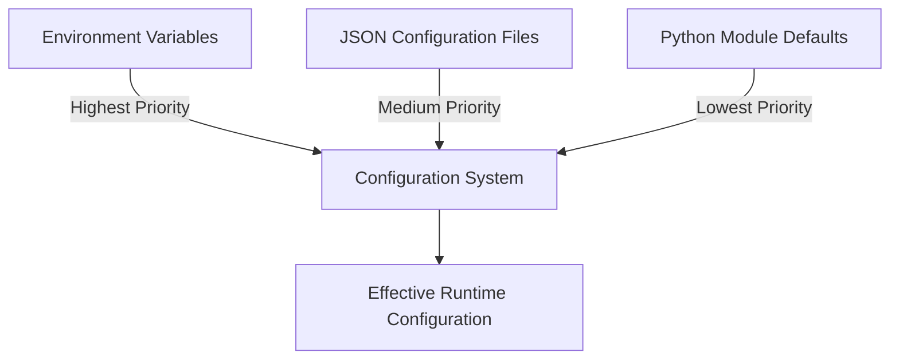
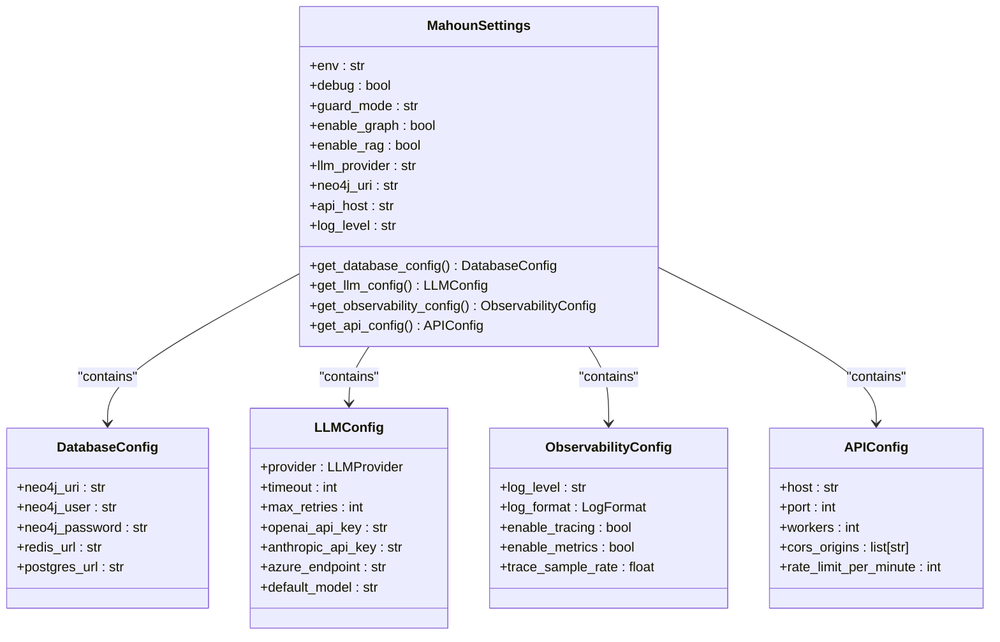
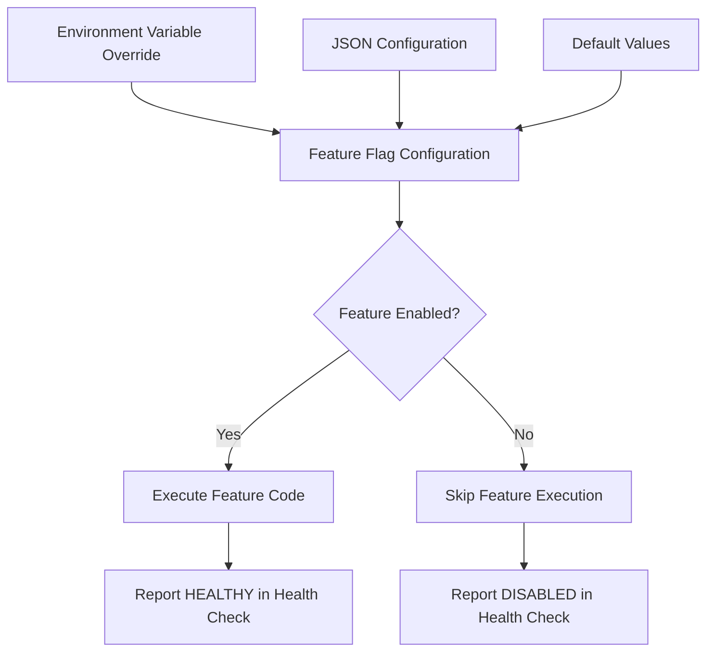
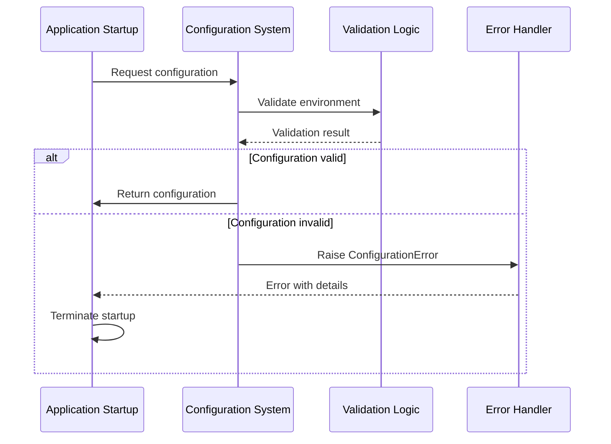
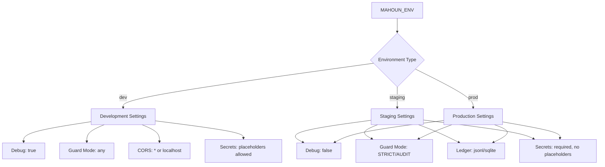
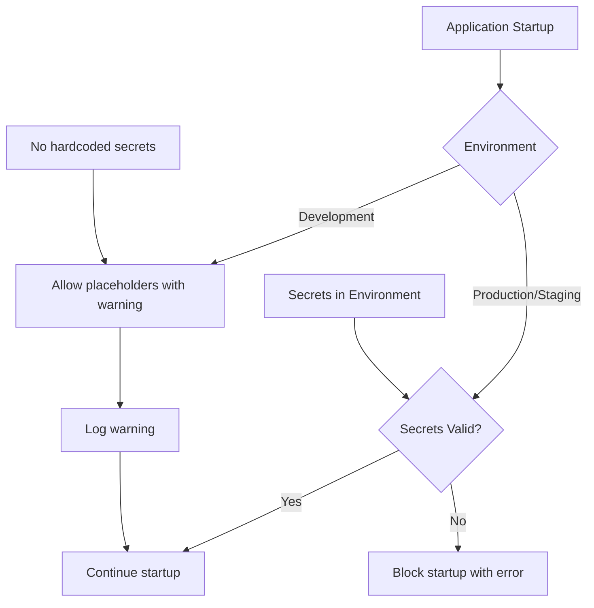
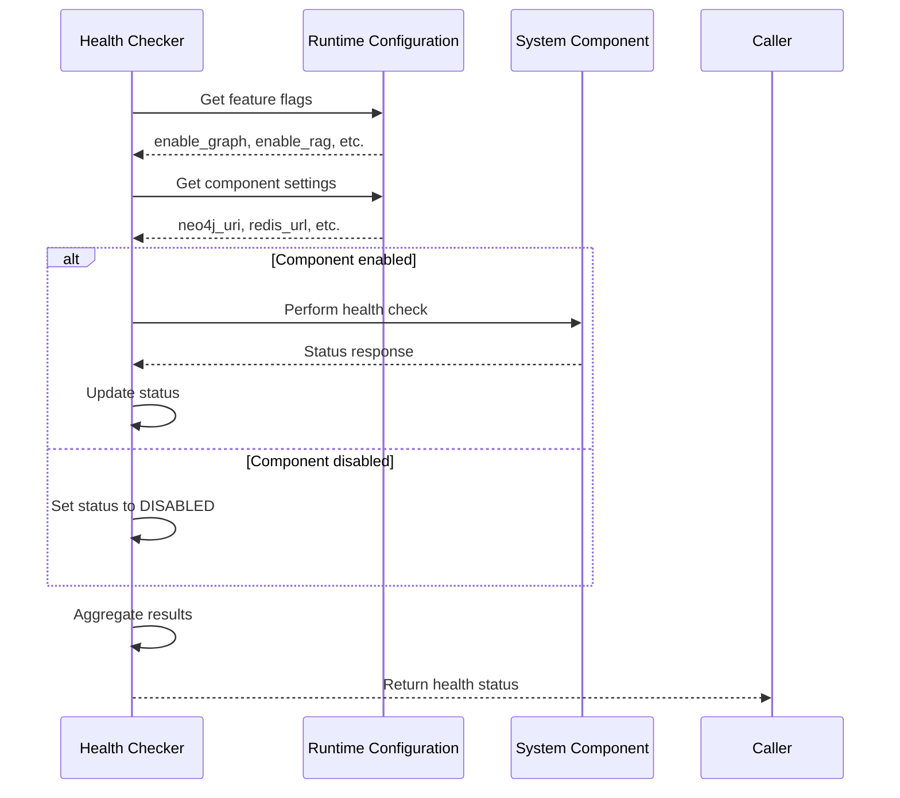

# Configuration Management

<cite>
**Referenced Files in This Document**   
- [runtime.json](file://config/runtime.json)
- [runtime.py](file://config/runtime.py)
- [runtime_config.py](file://mahoun/core/runtime_config.py)
- [config.py](file://mahoun/core/config.py)
- [settings.py](file://mahoun/core/settings.py)
- [health_checker.py](file://mahoun/core/health_checker.py)
- [health_cache.py](file://mahoun/core/health_cache.py)
- [secrets.py](file://mahoun/core/secrets.py)
- [validation.py](file://mahoun/core/validation.py)
- [exceptions.py](file://mahoun/core/exceptions.py)
</cite>

## Table of Contents
1. [Introduction](#introduction)
2. [Hierarchical Configuration Approach](#hierarchical-configuration-approach)
3. [Runtime Configuration Structure](#runtime-configuration-structure)
4. [Feature Flag System](#feature-flag-system)
5. [Configuration Validation and Error Handling](#configuration-validation-and-error-handling)
6. [Deployment Environment Configuration](#deployment-environment-configuration)
7. [Security Considerations](#security-considerations)
8. [Best Practices for Customization](#best-practices-for-customization)
9. [Interaction with Health Checker System](#interaction-with-health-checker-system)
10. [Conclusion](#conclusion)

## Introduction
The Mahoun Platform employs a sophisticated runtime configuration system that combines JSON files, Python configuration modules, and environment variables to provide flexible and secure configuration management. This document details the architecture and implementation of this system, focusing on the hierarchical configuration approach, feature flag management, validation processes, and integration with the health checker system. The configuration system is designed to support multiple deployment environments while maintaining security and reliability.

## Hierarchical Configuration Approach
The Mahoun Platform implements a hierarchical configuration system that combines three primary sources: JSON configuration files, Python configuration modules, and environment variables. This approach provides flexibility for different deployment scenarios while maintaining a clear priority order for configuration values.

The configuration hierarchy follows a specific priority order where environment variables take precedence over JSON file values, which in turn override default values defined in Python modules. This design allows for environment-specific overrides without modifying configuration files, supporting seamless deployment across development, staging, and production environments.

The system uses environment variable substitution within the JSON configuration file, denoted by the `${VARIABLE_NAME:-default}` syntax. This pattern allows specifying fallback values when environment variables are not set, providing a graceful degradation mechanism. For example, `${MAHOUN_ENV:-dev}` uses the value of MAHOUN_ENV if set, otherwise defaults to "dev".

The Python configuration modules implement this hierarchy through a combination of file loading, environment variable reading, and default value assignment. The `runtime_config.py` module demonstrates this approach by first attempting to load YAML configuration, then applying environment variable overrides, and finally falling back to sensible defaults.

**Diagram sources**
- [runtime.json](file://config/runtime.json)
- [runtime_config.py](file://mahoun/core/runtime_config.py)

**Section sources**
- [runtime.json](file://config/runtime.json)
- [runtime_config.py](file://mahoun/core/runtime_config.py)

## Runtime Configuration Structure
The runtime configuration system is centered around the `runtime.json` file located in the config directory, which serves as the primary configuration source for the Mahoun Platform. This JSON file defines the core configuration structure with sections for environment settings, feature flags, LLM configuration, retrieval parameters, storage paths, database connections, API settings, and observability options.

The configuration structure is organized into logical sections that group related settings. The environment section controls the operational mode, debug settings, and guard mode. Feature flags enable or disable major system components like the knowledge graph, RAG capabilities, and self-improvement systems. The LLM section configures language model providers, timeouts, retry policies, and GPU usage.

The Python loader in `runtime.py` and `config.py` modules parses this JSON file and converts it into Python objects. The `MahounSettings` class in `config.py` uses Pydantic's BaseSettings to provide type validation, default values, and environment variable integration. This class implements a singleton pattern with thread safety to ensure consistent configuration access across the application.

**Diagram sources**
- [runtime.json](file://config/runtime.json)
- [config.py](file://mahoun/core/config.py)

**Section sources**
- [runtime.json](file://config/runtime.json)
- [runtime.py](file://config/runtime.py)
- [config.py](file://mahoun/core/config.py)

## Feature Flag System
The Mahoun Platform implements a comprehensive feature flag system that allows runtime toggling of major system components without requiring code changes or restarts. This system enables gradual feature rollouts, A/B testing, and emergency feature disabling when needed.

Feature flags are defined in the `runtime.json` configuration file under the "features" section, with boolean values controlling the activation of specific capabilities. Key features that can be toggled include graph functionality, RAG (Retrieval-Augmented Generation) capabilities, and self-improvement systems. These flags are also exposed as environment variables (e.g., MAHOUN_ENABLE_GRAPH) for external control.

The system provides helper functions in the `runtime_config.py` module to check feature status, such as `should_skip_graph()` and `should_skip_lora_training()`. These functions encapsulate the logic for determining whether a feature should be active based on the current configuration, making it easy for components to conditionally execute feature-specific code.

The feature flag system integrates with the health checker to report the status of enabled and disabled components. When a feature is disabled via configuration, the health checker reports it as "DISABLED" rather than "UNHEALTHY" to distinguish between intentional deactivation and actual failures.

**Diagram sources**
- [runtime.json](file://config/runtime.json)
- [runtime_config.py](file://mahoun/core/runtime_config.py)
- [health_checker.py](file://mahoun/core/health_checker.py)

**Section sources**
- [runtime.json](file://config/runtime.json)
- [runtime_config.py](file://mahoun/core/runtime_config.py)

## Configuration Validation and Error Handling
The Mahoun Platform implements robust configuration validation and error handling to ensure system reliability and security. The configuration system performs validation at multiple levels, from basic type checking to environment-specific requirements enforcement.

The `MahounSettings` class in `config.py` uses Pydantic validators to validate individual fields and implement cross-field validation. Field validators ensure that values are within acceptable ranges and match allowed options (e.g., valid log levels, supported LLM providers). The `model_validator` decorator implements more complex validation logic that considers multiple fields together.

A critical aspect of the validation system is the enforcement of production-specific requirements. When running in production or staging environments, the system validates that debug mode is disabled, guard mode is not set to OFF, the ledger backend is not noop, and required API keys are present for remote LLM providers. These validations prevent insecure configurations in production environments.

The error handling system uses a custom exception hierarchy defined in `exceptions.py`, with `ConfigurationError` as the base class for configuration-related issues. The system fails fast when encountering invalid configurations, providing clear error messages that help administrators identify and fix issues quickly.

**Diagram sources**
- [config.py](file://mahoun/core/config.py)
- [exceptions.py](file://mahoun/core/exceptions.py)

**Section sources**
- [config.py](file://mahoun/core/config.py)
- [exceptions.py](file://mahoun/core/exceptions.py)

## Deployment Environment Configuration
The Mahoun Platform supports multiple deployment environments (development, staging, and production) with tailored configuration profiles for each. The system uses the MAHOUN_ENV environment variable to determine the current environment and apply appropriate settings.

In development environments, the system enables debug mode, allows permissive CORS settings, and accepts placeholder values for secrets. This configuration facilitates rapid development and testing. The default CORS origins include localhost addresses, and the system provides default values for required secrets to simplify setup.

Staging and production environments enforce strict security requirements. Debug mode is disabled, guard mode must be set to STRICT or AUDIT, and the ledger backend cannot be noop. Required secrets must be explicitly set with non-placeholder values. The system validates these requirements at startup and fails fast if they are not met.

The configuration system supports environment-specific YAML files through the `runtime_profile.yaml` mechanism. When MAHOUN_MODE is set to "desktop_minimal", the system loads `runtime_profile_desktop.yaml` instead of the default profile, enabling a lightweight configuration suitable for resource-constrained environments.

**Diagram sources**
- [config.py](file://mahoun/core/config.py)
- [settings.py](file://mahoun/core/settings.py)
- [runtime_config.py](file://mahoun/core/runtime_config.py)

**Section sources**
- [config.py](file://mahoun/core/config.py)
- [settings.py](file://mahoun/core/settings.py)
- [test_config_production.py](file://tests/test_config_production.py)

## Security Considerations
The Mahoun Platform implements comprehensive security measures for managing secrets and sensitive configuration data. The system follows the principle of never committing real secrets to code and provides mechanisms to prevent accidental exposure of sensitive information.

The secrets management system in `secrets.py` distinguishes between development and production environments. In development, the system allows the use of safe placeholder values for convenience, but logs warnings to remind developers to use proper secrets in production. In staging and production environments, the system strictly validates that required secrets are set and do not contain placeholder values.

The configuration system uses Pydantic's SecretStr type to handle sensitive values like API keys and passwords. This ensures that secrets are not accidentally logged or exposed in error messages. The `to_safe_dict()` method in the `MahounSettings` class masks sensitive fields when exporting configuration for logging or debugging.

The system implements a security gate at startup that validates all required secrets before proceeding. If any required secret is missing or contains a placeholder value in a production environment, the system raises a RuntimeError with a clear error message, preventing insecure deployments.

**Diagram sources**
- [secrets.py](file://mahoun/core/secrets.py)
- [config.py](file://mahoun/core/config.py)

**Section sources**
- [secrets.py](file://mahoun/core/secrets.py)
- [config.py](file://mahoun/core/config.py)

## Best Practices for Customization
The Mahoun Platform provides several mechanisms for customizing system behavior without requiring code changes. These approaches allow administrators and operators to tune the system for specific use cases and deployment requirements.

The primary customization method is through environment variables, which override values in the `runtime.json` file. This approach allows for environment-specific configuration without modifying configuration files. For example, different API rate limits can be set for staging and production environments using the MAHOUN_RATE_LIMIT environment variable.

For more complex customizations, the system supports YAML configuration profiles that can be loaded based on the MAHOUN_MODE environment variable. This allows defining different runtime profiles for desktop, server, and enterprise deployments, each with appropriate resource usage and feature sets.

The feature flag system enables granular control over system capabilities. Administrators can disable specific features that are not needed for their use case, reducing resource consumption and attack surface. For example, the self-improvement system can be disabled in environments where model updates are managed externally.

When customizing the system, it is recommended to use the configuration validation system to verify changes before deployment. The `get_settings()` function with caching ensures that configuration is loaded efficiently, and the validation logic helps catch errors early.

**Section sources**
- [runtime.json](file://config/runtime.json)
- [runtime_config.py](file://mahoun/core/runtime_config.py)
- [config.py](file://mahoun/core/config.py)

## Interaction with Health Checker System
The configuration system is tightly integrated with the health checker system to provide comprehensive system monitoring and status reporting. The health checker uses configuration values to determine which components to check and how to interpret their status.

The health checker in `health_checker.py` queries the runtime configuration to determine which components are enabled or disabled. For example, the `check_graph()` method uses `should_skip_graph()` from the runtime configuration to determine if the graph system should be checked. If the graph is disabled, the health check reports it as "DISABLED" rather than "UNHEALTHY".

Configuration values directly impact health check behavior. The `enable_ollama`, `enable_postgres`, and `enable_redis` settings control whether the corresponding health checks are performed. This prevents false alarms when components are intentionally disabled in certain deployment modes.

The health checker system also validates configuration correctness as part of its checks. It verifies that required services are available when enabled and reports configuration issues that could affect system reliability. The cached health checker in `health_cache.py` uses configuration-defined TTL values to balance freshness and performance.

**Diagram sources**
- [health_checker.py](file://mahoun/core/health_checker.py)
- [runtime_config.py](file://mahoun/core/runtime_config.py)
- [health_cache.py](file://mahoun/core/health_cache.py)

**Section sources**
- [health_checker.py](file://mahoun/core/health_checker.py)
- [runtime_config.py](file://mahoun/core/runtime_config.py)
- [health_cache.py](file://mahoun/core/health_cache.py)

## Conclusion
The Mahoun Platform's configuration management system provides a robust, flexible, and secure approach to runtime configuration. By combining JSON files, Python modules, and environment variables in a hierarchical structure, the system supports multiple deployment environments while maintaining consistency and reliability.

The feature flag system enables dynamic control of system capabilities without code changes, facilitating gradual rollouts and emergency responses. Comprehensive validation and error handling ensure that the system fails fast when encountering invalid configurations, particularly in production environments.

Security is prioritized through strict secret management practices, with different rules for development and production environments. The integration with the health checker system provides real-time visibility into the status of configured components, distinguishing between intentional deactivation and actual failures.

This configuration system enables administrators to customize the platform for their specific needs while maintaining system integrity and security. The documented best practices provide guidance for safe and effective customization without compromising system stability.