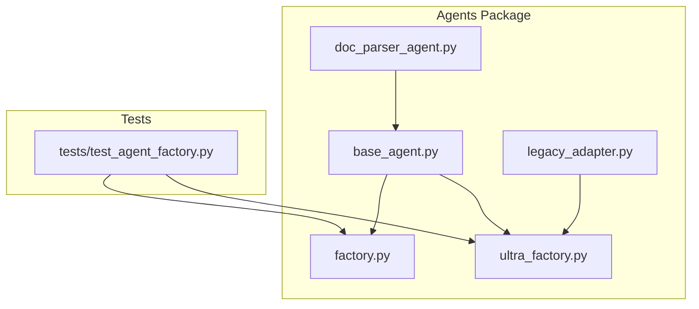
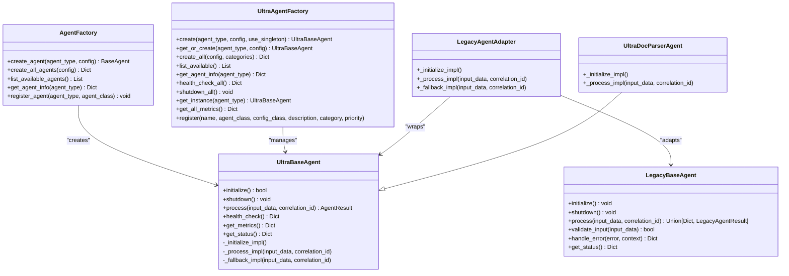
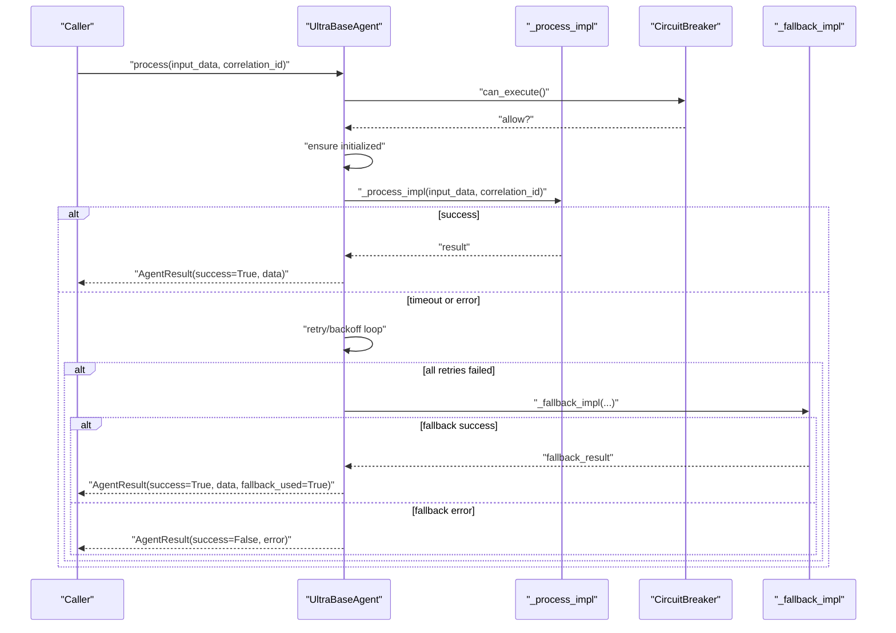
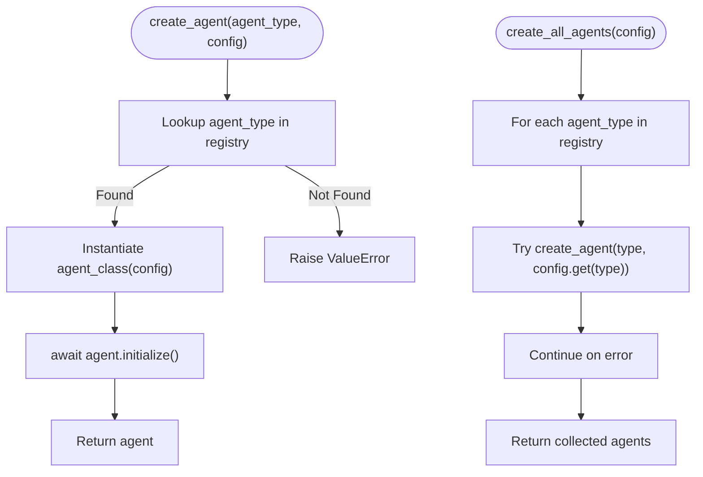
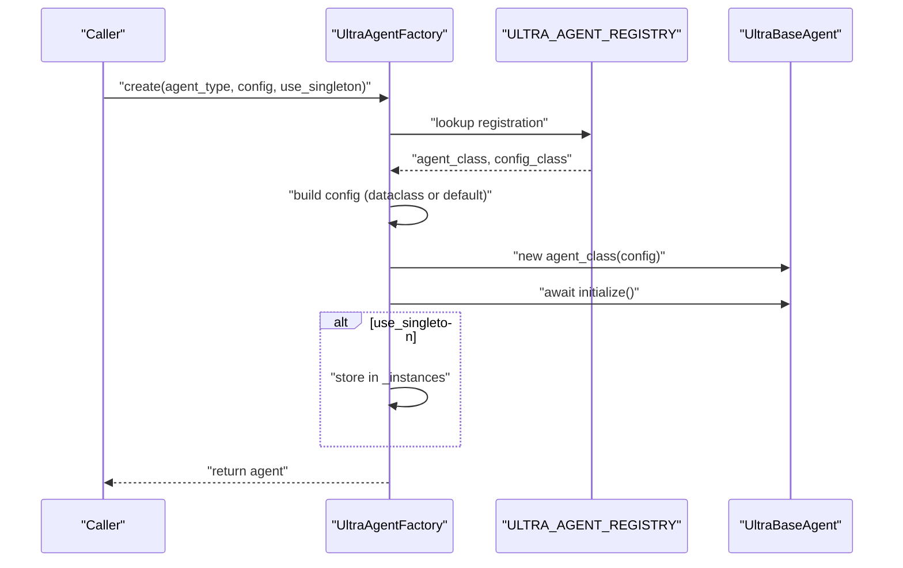
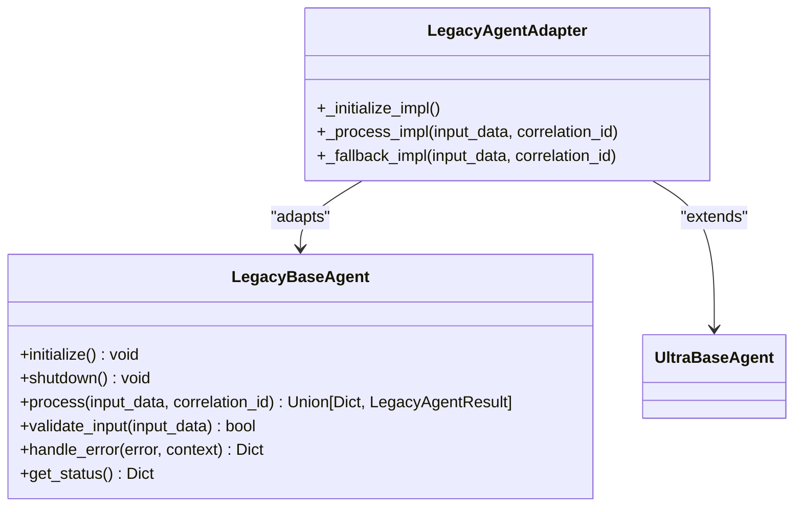
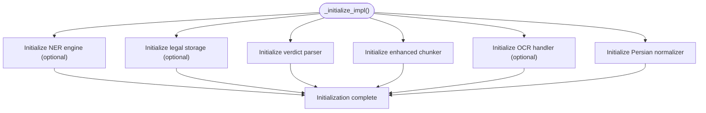
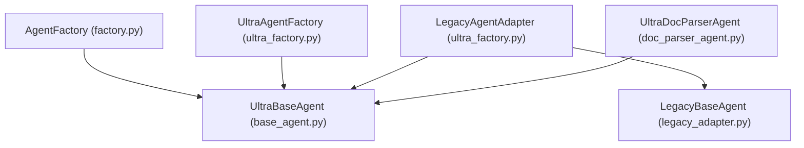

# AI Agents Framework

<cite>
**Referenced Files in This Document**
- [base_agent.py](file://mahoun/agents/base_agent.py)
- [factory.py](file://mahoun/agents/factory.py)
- [ultra_factory.py](file://mahoun/agents/ultra_factory.py)
- [legacy_adapter.py](file://mahoun/agents/legacy_adapter.py)
- [test_agent_factory.py](file://tests/test_agent_factory.py)
- [doc_parser_agent.py](file://mahoun/agents/doc_parser_agent.py)
</cite>

## Table of Contents
1. [Introduction](#introduction)
2. [Project Structure](#project-structure)
3. [Core Components](#core-components)
4. [Architecture Overview](#architecture-overview)
5. [Detailed Component Analysis](#detailed-component-analysis)
6. [Dependency Analysis](#dependency-analysis)
7. [Performance Considerations](#performance-considerations)
8. [Troubleshooting Guide](#troubleshooting-guide)
9. [Conclusion](#conclusion)
10. [Appendices](#appendices)

## Introduction
This document describes the AI Agents Framework with a focus on the base agent architecture and the agent factory pattern. It explains the Agent interface, lifecycle methods, and state management, documents the agent factory system enabling dynamic agent creation and registration, and highlights the ultra_* factory extensions for advanced agent types. It also covers examples of agent initialization and configuration from the test suite and addresses common issues in agent instantiation and lifecycle management, with solutions from the legacy adapter for backward compatibility. Finally, it provides performance considerations for agent pooling and reuse in high-throughput scenarios.

## Project Structure
The AI Agents Framework resides under the mahoun/agents package and includes:
- Base agent abstractions and utilities
- Factory implementations for agent creation and lifecycle management
- Legacy adapter for backward compatibility
- Example agent implementations (e.g., document parser)
- Tests demonstrating factory usage and agent lifecycle

**Diagram sources**
- [base_agent.py](file://mahoun/agents/base_agent.py#L1-L120)
- [factory.py](file://mahoun/agents/factory.py#L1-L182)
- [ultra_factory.py](file://mahoun/agents/ultra_factory.py#L1-L120)
- [legacy_adapter.py](file://mahoun/agents/legacy_adapter.py#L1-L120)
- [doc_parser_agent.py](file://mahoun/agents/doc_parser_agent.py#L1-L120)
- [test_agent_factory.py](file://tests/test_agent_factory.py#L1-L159)

**Section sources**
- [base_agent.py](file://mahoun/agents/base_agent.py#L1-L120)
- [factory.py](file://mahoun/agents/factory.py#L1-L182)
- [ultra_factory.py](file://mahoun/agents/ultra_factory.py#L1-L120)
- [legacy_adapter.py](file://mahoun/agents/legacy_adapter.py#L1-L120)
- [test_agent_factory.py](file://tests/test_agent_factory.py#L1-L159)

## Core Components
- UltraBaseAgent: The enterprise-grade base class providing lifecycle management, retry/backoff, circuit breaker, graceful degradation, structured logging, health checks, and async context manager support.
- AgentFactory: Centralized factory for creating and initializing agents, listing available agents, and registering new agent types.
- UltraAgentFactory: Advanced factory with lazy loading, singleton management, health monitoring, graceful shutdown, and backward compatibility via LegacyAgentAdapter.
- LegacyBaseAgent and LegacyAgentAdapter: Bridge for legacy agents to integrate with the Ultra framework.
- Example agent: UltraDocParserAgent demonstrates extending UltraBaseAgent with specialized initialization and processing logic.

Key responsibilities:
- Base agent: Define lifecycle, state machine, retry/backoff, circuit breaker, health checks, and standardized result format.
- Factory: Map agent types to classes, inject configuration, and manage initialization and lifecycle.
- Ultra factory: Extend factory with singleton caching, health checks across instances, and compatibility adapters.

**Section sources**
- [base_agent.py](file://mahoun/agents/base_agent.py#L160-L576)
- [factory.py](file://mahoun/agents/factory.py#L51-L182)
- [ultra_factory.py](file://mahoun/agents/ultra_factory.py#L224-L590)
- [legacy_adapter.py](file://mahoun/agents/legacy_adapter.py#L48-L201)
- [doc_parser_agent.py](file://mahoun/agents/doc_parser_agent.py#L66-L200)

## Architecture Overview
The framework implements a layered architecture:
- Base abstraction layer (UltraBaseAgent) defines the interface and lifecycle.
- Factory layer (AgentFactory and UltraAgentFactory) manages agent creation, configuration, and lifecycle.
- Compatibility layer (LegacyBaseAgent and LegacyAgentAdapter) ensures backward compatibility.
- Example agents (e.g., UltraDocParserAgent) demonstrate integration with the base and factory layers.

**Diagram sources**
- [base_agent.py](file://mahoun/agents/base_agent.py#L160-L576)
- [factory.py](file://mahoun/agents/factory.py#L51-L182)
- [ultra_factory.py](file://mahoun/agents/ultra_factory.py#L224-L590)
- [legacy_adapter.py](file://mahoun/agents/legacy_adapter.py#L48-L201)
- [doc_parser_agent.py](file://mahoun/agents/doc_parser_agent.py#L66-L200)

## Detailed Component Analysis

### UltraBaseAgent: Lifecycle, State, and Patterns
UltraBaseAgent encapsulates:
- Lifecycle states: created, initializing, ready, processing, degraded, failed, shutdown.
- Retry/backoff with exponential backoff and configurable timeouts.
- Circuit breaker with closed/open/half-open states and thresholds/timeouts.
- Health monitoring with periodic checks and custom health hooks.
- Structured logging with correlation IDs and metrics collection.
- Async context manager support for initialization and shutdown.
- Standardized result format via AgentResult.

Processing flow:
- Validates circuit breaker and initialization.
- Executes _process_impl with operation timeout.
- Applies retry/backoff on transient failures.
- Optionally invokes _fallback_impl on failure.
- Updates metrics and state consistently.

**Diagram sources**
- [base_agent.py](file://mahoun/agents/base_agent.py#L321-L454)

**Section sources**
- [base_agent.py](file://mahoun/agents/base_agent.py#L37-L113)
- [base_agent.py](file://mahoun/agents/base_agent.py#L157-L213)
- [base_agent.py](file://mahoun/agents/base_agent.py#L241-L316)
- [base_agent.py](file://mahoun/agents/base_agent.py#L321-L454)
- [base_agent.py](file://mahoun/agents/base_agent.py#L476-L572)

### AgentFactory: Dynamic Creation and Registration
AgentFactory provides:
- create_agent: Resolve agent type to class, instantiate, initialize, and return.
- create_all_agents: Iterate registry and initialize all agents.
- list_available_agents: Enumerate supported agent types.
- get_agent_info: Retrieve metadata for a given agent type.
- register_agent: Dynamically register new agent types with validation.

**Diagram sources**
- [factory.py](file://mahoun/agents/factory.py#L60-L126)

**Section sources**
- [factory.py](file://mahoun/agents/factory.py#L51-L182)
- [test_agent_factory.py](file://tests/test_agent_factory.py#L12-L56)

### UltraAgentFactory: Advanced Agent Management
UltraAgentFactory extends the factory with:
- Lazy loading and singleton caching per agent type.
- Typed registration with AgentRegistration including config_class, description, category, and priority.
- Health monitoring across instantiated agents and graceful shutdown.
- Backward compatibility via LegacyAgentAdapter and wrap_legacy_agent.

**Diagram sources**
- [ultra_factory.py](file://mahoun/agents/ultra_factory.py#L246-L304)

**Section sources**
- [ultra_factory.py](file://mahoun/agents/ultra_factory.py#L44-L88)
- [ultra_factory.py](file://mahoun/agents/ultra_factory.py#L224-L304)
- [ultra_factory.py](file://mahoun/agents/ultra_factory.py#L331-L369)
- [ultra_factory.py](file://mahoun/agents/ultra_factory.py#L419-L455)
- [ultra_factory.py](file://mahoun/agents/ultra_factory.py#L529-L590)

### Legacy Adapter: Backward Compatibility
LegacyBaseAgent provides a simplified interface compatible with older agents, while LegacyAgentAdapter wraps legacy agents to conform to UltraBaseAgent’s interface. This enables seamless integration of legacy agents into the modern factory and orchestration systems.

**Diagram sources**
- [legacy_adapter.py](file://mahoun/agents/legacy_adapter.py#L48-L201)
- [ultra_factory.py](file://mahoun/agents/ultra_factory.py#L529-L590)

**Section sources**
- [legacy_adapter.py](file://mahoun/agents/legacy_adapter.py#L48-L201)
- [ultra_factory.py](file://mahoun/agents/ultra_factory.py#L529-L590)

### Example Agent: UltraDocParserAgent
UltraDocParserAgent demonstrates:
- Extending UltraBaseAgent with a specialized configuration class (DocParserConfig).
- Lazy initialization of pipeline components (NER engine, storage, chunker, OCR, normalizer).
- Robust error handling and graceful degradation patterns.

**Diagram sources**
- [doc_parser_agent.py](file://mahoun/agents/doc_parser_agent.py#L120-L183)

**Section sources**
- [doc_parser_agent.py](file://mahoun/agents/doc_parser_agent.py#L41-L65)
- [doc_parser_agent.py](file://mahoun/agents/doc_parser_agent.py#L66-L200)

## Dependency Analysis
- UltraBaseAgent depends on enums, dataclasses, asyncio, logging, and time for lifecycle and metrics.
- AgentFactory depends on UltraBaseAgent and agent classes to create and initialize agents.
- UltraAgentFactory depends on UltraBaseAgent and maintains singleton instances with asyncio.Lock for thread-safety.
- LegacyAgentAdapter depends on LegacyBaseAgent and UltraBaseAgent to bridge interfaces.
- Example agents depend on UltraBaseAgent and may import pipeline components.

**Diagram sources**
- [base_agent.py](file://mahoun/agents/base_agent.py#L160-L576)
- [factory.py](file://mahoun/agents/factory.py#L51-L182)
- [ultra_factory.py](file://mahoun/agents/ultra_factory.py#L224-L590)
- [legacy_adapter.py](file://mahoun/agents/legacy_adapter.py#L48-L201)
- [doc_parser_agent.py](file://mahoun/agents/doc_parser_agent.py#L66-L200)

**Section sources**
- [base_agent.py](file://mahoun/agents/base_agent.py#L160-L576)
- [factory.py](file://mahoun/agents/factory.py#L51-L182)
- [ultra_factory.py](file://mahoun/agents/ultra_factory.py#L224-L590)
- [legacy_adapter.py](file://mahoun/agents/legacy_adapter.py#L48-L201)
- [doc_parser_agent.py](file://mahoun/agents/doc_parser_agent.py#L66-L200)

## Performance Considerations
- Singleton pattern: UltraAgentFactory caches agents to avoid repeated initialization overhead. Use get_or_create or create with use_singleton to leverage caching.
- Lazy loading: UltraAgentFactory creates agents only when needed, reducing startup costs.
- Health monitoring: Periodic health checks help detect failing agents early; UltraAgentFactory exposes health_check_all to monitor all instantiated agents.
- Retry/backoff and circuit breaker: UltraBaseAgent’s retry/backoff and circuit breaker reduce wasted work on failing dependencies and prevent cascading failures.
- Concurrency: Use asyncio.Lock in UltraAgentFactory to ensure thread-safe singleton access.
- Metrics: UltraBaseAgent collects metrics (success rate, average processing time) to inform tuning and capacity planning.

Practical tips:
- Prefer singleton usage for long-lived agents to minimize initialization costs.
- Tune AgentConfig (max_retries, retry_base_delay, operation_timeout, circuit_breaker_threshold) based on workload characteristics.
- Monitor health_check_all and get_all_metrics to identify bottlenecks and degraded agents.

**Section sources**
- [ultra_factory.py](file://mahoun/agents/ultra_factory.py#L241-L304)
- [ultra_factory.py](file://mahoun/agents/ultra_factory.py#L419-L455)
- [ultra_factory.py](file://mahoun/agents/ultra_factory.py#L470-L481)
- [base_agent.py](file://mahoun/agents/base_agent.py#L241-L316)
- [base_agent.py](file://mahoun/agents/base_agent.py#L321-L454)

## Troubleshooting Guide
Common issues and resolutions:
- Unknown agent type during creation:
  - Symptom: ValueError indicating unknown agent type.
  - Resolution: Ensure agent_type is registered; use list_available_agents or list_available to discover supported types.
  - References:
    - [factory.py](file://mahoun/agents/factory.py#L81-L94)
    - [ultra_factory.py](file://mahoun/agents/ultra_factory.py#L270-L275)

- Initialization failures:
  - Symptom: Agent state becomes failed; initialization timeout or exception.
  - Resolution: Inspect logs, adjust initialization_timeout, and verify dependencies. Use health_check to diagnose.
  - References:
    - [base_agent.py](file://mahoun/agents/base_agent.py#L241-L277)
    - [base_agent.py](file://mahoun/agents/base_agent.py#L505-L531)

- Circuit breaker blocking requests:
  - Symptom: Requests rejected with circuit breaker open.
  - Resolution: Allow timeout to elapse or fix underlying failures; tune threshold and timeout.
  - References:
    - [base_agent.py](file://mahoun/agents/base_agent.py#L138-L155)
    - [base_agent.py](file://mahoun/agents/base_agent.py#L344-L353)

- Legacy agent integration:
  - Symptom: Legacy agents lack fallback or process signature mismatch.
  - Resolution: Wrap legacy agents using LegacyAgentAdapter or wrap_legacy_agent to adapt to UltraBaseAgent interface.
  - References:
    - [legacy_adapter.py](file://mahoun/agents/legacy_adapter.py#L48-L201)
    - [ultra_factory.py](file://mahoun/agents/ultra_factory.py#L529-L590)

- Agent reuse and lifecycle:
  - Symptom: Repeated initialization overhead or inconsistent state.
  - Resolution: Use UltraAgentFactory singleton patterns (get_or_create/create with use_singleton) to reuse agents.
  - References:
    - [ultra_factory.py](file://mahoun/agents/ultra_factory.py#L306-L329)
    - [ultra_factory.py](file://mahoun/agents/ultra_factory.py#L246-L304)

**Section sources**
- [factory.py](file://mahoun/agents/factory.py#L81-L94)
- [ultra_factory.py](file://mahoun/agents/ultra_factory.py#L270-L275)
- [base_agent.py](file://mahoun/agents/base_agent.py#L241-L277)
- [base_agent.py](file://mahoun/agents/base_agent.py#L344-L353)
- [legacy_adapter.py](file://mahoun/agents/legacy_adapter.py#L48-L201)
- [ultra_factory.py](file://mahoun/agents/ultra_factory.py#L306-L329)
- [ultra_factory.py](file://mahoun/agents/ultra_factory.py#L246-L304)

## Conclusion
The AI Agents Framework provides a robust, enterprise-grade foundation for building and operating agents. The UltraBaseAgent defines a comprehensive lifecycle and resilience model, while AgentFactory and UltraAgentFactory offer flexible, dynamic creation and management. The legacy adapter ensures backward compatibility, and example agents illustrate best practices. By leveraging singleton caching, lazy loading, health monitoring, and resilient patterns, teams can operate agents reliably at scale.

## Appendices

### Agent Initialization and Configuration Examples
- Creating a single agent and verifying initialization and type:
  - [test_create_single_agent](file://tests/test_agent_factory.py#L12-L21)
- Creating agents with custom configuration:
  - [test_create_agent_with_config](file://tests/test_agent_factory.py#L23-L30)
- Listing available agents and retrieving agent info:
  - [test_list_available_agents](file://tests/test_agent_factory.py#L75-L88)
  - [test_get_agent_info](file://tests/test_agent_factory.py#L90-L99)
- Registering a new agent type dynamically:
  - [test_register_agent](file://tests/test_agent_factory.py#L107-L124)

**Section sources**
- [test_agent_factory.py](file://tests/test_agent_factory.py#L12-L56)
- [test_agent_factory.py](file://tests/test_agent_factory.py#L75-L99)
- [test_agent_factory.py](file://tests/test_agent_factory.py#L107-L124)