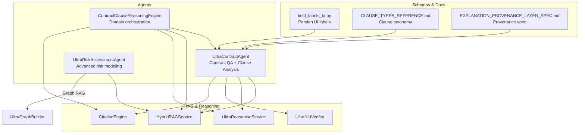
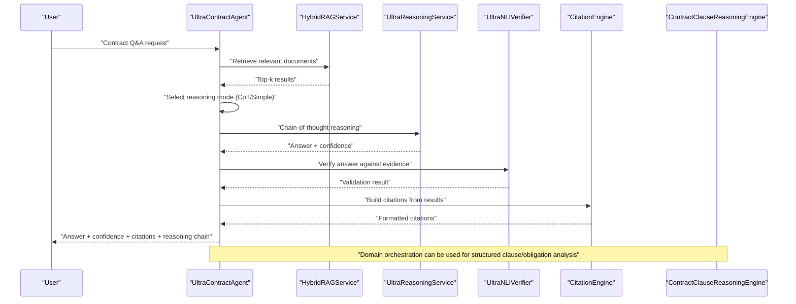
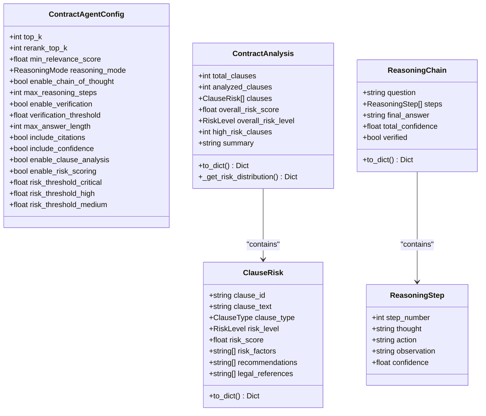
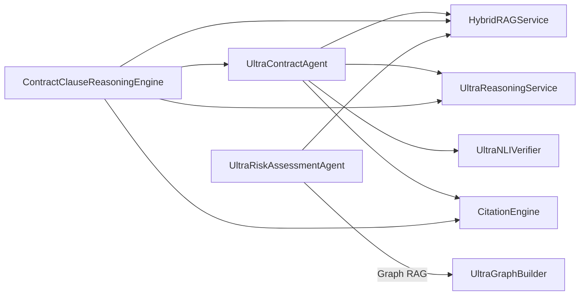

# Contract Agent

<cite>
**Referenced Files in This Document**
- [contract_agent.py](file://mahoun/agents/contract_agent.py)
- [contract_reasoning.py](file://mahoun/domain/contract_reasoning.py)
- [citation_engine.py](file://mahoun/rag/citation_engine.py)
- [field_labels_fa.py](file://mahoun/schemas/field_labels_fa.py)
- [CLAUSE_TYPES_REFERENCE.md](file://mahoun/agents/CLAUSE_TYPES_REFERENCE.md)
- [ULTRA_CONTRACT_AGENT_REPORT.md](file://mahoun/agents/ULTRA_CONTRACT_AGENT_REPORT.md)
- [EXPLANATION_PROVENANCE_LAYER_SPEC.md](file://docs/EXPLANATION_PROVENANCE_LAYER_SPEC.md)
- [financial_aml.py](file://demos/financial_aml.py)
- [ultra_risk_assessment_agent.py](file://mahoun/agents/ultra_risk_assessment_agent.py)
</cite>

## Table of Contents
1. [Introduction](#introduction)
2. [Project Structure](#project-structure)
3. [Core Components](#core-components)
4. [Architecture Overview](#architecture-overview)
5. [Detailed Component Analysis](#detailed-component-analysis)
6. [Dependency Analysis](#dependency-analysis)
7. [Performance Considerations](#performance-considerations)
8. [Troubleshooting Guide](#troubleshooting-guide)
9. [Conclusion](#conclusion)
10. [Appendices](#appendices)

## Introduction
This document explains the Contract Agent’s end-to-end capabilities for contract clause detection, contractual obligation extraction, and risk assessment. It details how the agent leverages domain logic from contract_reasoning.py, integrates with ultra_risk_assessment_agent for advanced analysis, uses field_labels_fa.py for multilingual support and provenance tracking per EXPLANATION_PROVENANCE_LAYER_SPEC.md, and implements robust handling of ambiguous clauses, citation generation via citation_engine.py, and response formatting. It also presents contract Q&A workflows from demos/financial_aml.py and addresses challenges in interpreting complex contractual language using CLAUSE_TYPES_REFERENCE.md.

## Project Structure
The Contract Agent resides in the agents subsystem and interacts with domain engines, RAG, reasoning, and guardrails components. It also integrates with the broader ecosystem for risk assessment and provenance.

**Diagram sources**
- [contract_agent.py](file://mahoun/agents/contract_agent.py#L1-L120)
- [contract_reasoning.py](file://mahoun/domain/contract_reasoning.py#L1-L120)
- [ultra_risk_assessment_agent.py](file://mahoun/agents/ultra_risk_assessment_agent.py#L1-L120)
- [citation_engine.py](file://mahoun/rag/citation_engine.py#L1-L120)
- [field_labels_fa.py](file://mahoun/schemas/field_labels_fa.py#L1-L120)
- [CLAUSE_TYPES_REFERENCE.md](file://mahoun/agents/CLAUSE_TYPES_REFERENCE.md#L1-L120)
- [EXPLANATION_PROVENANCE_LAYER_SPEC.md](file://docs/EXPLANATION_PROVENANCE_LAYER_SPEC.md#L1-L120)

**Section sources**
- [contract_agent.py](file://mahoun/agents/contract_agent.py#L1-L120)
- [contract_reasoning.py](file://mahoun/domain/contract_reasoning.py#L1-L120)
- [ultra_risk_assessment_agent.py](file://mahoun/agents/ultra_risk_assessment_agent.py#L1-L120)
- [citation_engine.py](file://mahoun/rag/citation_engine.py#L1-L120)
- [field_labels_fa.py](file://mahoun/schemas/field_labels_fa.py#L1-L120)
- [CLAUSE_TYPES_REFERENCE.md](file://mahoun/agents/CLAUSE_TYPES_REFERENCE.md#L1-L120)
- [EXPLANATION_PROVENANCE_LAYER_SPEC.md](file://docs/EXPLANATION_PROVENANCE_LAYER_SPEC.md#L1-L120)

## Core Components
- UltraContractAgent: End-to-end contract Q&A with chain-of-thought reasoning, verification, and citation tracking; plus clause-level risk analysis and recommendations.
- ContractClauseReasoningEngine: Domain-level orchestration that coordinates the agent, RAG, and citation engine to produce structured answers, clauses, obligations, and reasoning.
- CitationEngine: Extracts precise citations from RAG results, including clause/page/section metadata and formats them for provenance.
- field_labels_fa.py: Provides Persian labels for UI/reporting, enabling multilingual-friendly interfaces.
- CLAUSE_TYPES_REFERENCE.md: Comprehensive taxonomy of 46 clause types with risk indicators and keywords.
- UltraRiskAssessmentAgent: Advanced probabilistic risk assessment integrating Graph RAG and Monte Carlo simulation; complements contract-level risk scoring.
- EXPLANATION_PROVENANCE_LAYER_SPEC.md: Defines the non-authoritative provenance layer that records and renders reasoning artifacts without altering outcomes.

**Section sources**
- [contract_agent.py](file://mahoun/agents/contract_agent.py#L120-L320)
- [contract_reasoning.py](file://mahoun/domain/contract_reasoning.py#L1-L120)
- [citation_engine.py](file://mahoun/rag/citation_engine.py#L1-L120)
- [field_labels_fa.py](file://mahoun/schemas/field_labels_fa.py#L1-L120)
- [CLAUSE_TYPES_REFERENCE.md](file://mahoun/agents/CLAUSE_TYPES_REFERENCE.md#L1-L120)
- [ultra_risk_assessment_agent.py](file://mahoun/agents/ultra_risk_assessment_agent.py#L1-L120)
- [EXPLANATION_PROVENANCE_LAYER_SPEC.md](file://docs/EXPLANATION_PROVENANCE_LAYER_SPEC.md#L1-L120)

## Architecture Overview
The Contract Agent follows a layered architecture:
- Input: Natural language query and optional context.
- Retrieval: HybridRAGService retrieves relevant documents.
- Reasoning: UltraReasoningService performs chain-of-thought reasoning; optional NLI verification validates answers.
- Citation: CitationEngine extracts and formats precise citations.
- Domain Orchestration: ContractClauseReasoningEngine coordinates the above and produces structured outputs including clauses and obligations.
- Risk Assessment: UltraRiskAssessmentAgent provides probabilistic risk estimates and recommendations.
- Output: Formatted answer, confidence, citations, reasoning chain, and metadata.

**Diagram sources**
- [contract_agent.py](file://mahoun/agents/contract_agent.py#L339-L497)
- [contract_reasoning.py](file://mahoun/domain/contract_reasoning.py#L69-L148)
- [citation_engine.py](file://mahoun/rag/citation_engine.py#L92-L178)

**Section sources**
- [contract_agent.py](file://mahoun/agents/contract_agent.py#L339-L497)
- [contract_reasoning.py](file://mahoun/domain/contract_reasoning.py#L69-L148)

## Detailed Component Analysis

### UltraContractAgent: Contract QA, Clause Detection, Risk Assessment, and Response Formatting
Key responsibilities:
- Chain-of-thought reasoning with automatic mode selection.
- NLI verification for answer validation.
- Citation tracking with precise clause/page/section metadata.
- Clause-level risk analysis across 46 types with recommendations.
- Response formatting with confidence, verification flag, reasoning chain, and metadata.

Implementation highlights:
- Configuration and enums define top-k retrieval, reasoning modes, verification thresholds, and risk thresholds.
- Data classes model ClauseRisk, ContractAnalysis, ReasoningStep, and ReasoningChain for structured outputs.
- Retrieval uses HybridRAGService with relevance filtering.
- Mode selection favors CoT for complex queries with multiple results.
- Verification uses UltraNLIVerifier; fallback returns top result with reduced confidence.
- Citations built from RAG results with doc_id, excerpt, score, and source.
- Clause analysis:
  - Clause extraction via Persian/Arabic clause markers and fallback to paragraph splitting.
  - Type detection by keyword matching against RISK_INDICATORS.
  - Risk calculation aggregates high/medium risk indicators, general risk patterns, and ambiguity signals.
  - Risk levels mapped to thresholds; recommendations generated per clause type and risk level.
  - Overall risk computed as a weighted average emphasizing critical/high-risk clauses.
  - Human-readable summary generated from counts and risk levels.

Ambiguity handling:
- Ambiguity indicators increase risk score and factor list.
- Sensitive clause types receive a minimum baseline risk if no explicit risk factors are found.

Response formatting:
- Fields include answer, confidence, verified, reasoning_chain, citations, and metadata (mode, result count, processing time, verification enabled).

**Section sources**
- [contract_agent.py](file://mahoun/agents/contract_agent.py#L127-L214)
- [contract_agent.py](file://mahoun/agents/contract_agent.py#L339-L497)
- [contract_agent.py](file://mahoun/agents/contract_agent.py#L536-L651)
- [contract_agent.py](file://mahoun/agents/contract_agent.py#L656-L698)
- [contract_agent.py](file://mahoun/agents/contract_agent.py#L722-L997)
- [contract_agent.py](file://mahoun/agents/contract_agent.py#L999-L1208)
- [contract_agent.py](file://mahoun/agents/contract_agent.py#L1209-L1599)
- [contract_agent.py](file://mahoun/agents/contract_agent.py#L1600-L1685)

#### Class Diagram: Core Data Structures

**Diagram sources**
- [contract_agent.py](file://mahoun/agents/contract_agent.py#L127-L214)
- [contract_agent.py](file://mahoun/agents/contract_agent.py#L1600-L1685)

### ContractClauseReasoningEngine: Domain Orchestration for Clause-Level Analysis
Responsibilities:
- Initializes and coordinates the ContractAgent, HybridRAGService, UltraReasoningService, and CitationEngine.
- Enhances queries with clause numbers when provided.
- Extracts clauses from citations and obligations from answer text.
- Builds a reasoning chain summarizing clause identification, obligation extraction, and final answer production.

Outputs:
- Success flag, answer, clauses, reasoning, citations, obligations, confidence, verification status, and metadata.

**Section sources**
- [contract_reasoning.py](file://mahoun/domain/contract_reasoning.py#L1-L152)

### CitationEngine: Precise Citation Extraction and Formatting
Responsibilities:
- Extracts clause/page/section metadata from retrieval results.
- Builds formatted citations and supports Markdown rendering.
- Provides helpers to extract citations from RAG results.

Integration:
- Used by the Contract Agent to enrich answers with precise references.

**Section sources**
- [citation_engine.py](file://mahoun/rag/citation_engine.py#L1-L120)
- [citation_engine.py](file://mahoun/rag/citation_engine.py#L129-L220)
- [citation_engine.py](file://mahoun/rag/citation_engine.py#L221-L335)

### Multilingual Support and Provenance Tracking with field_labels_fa.py and EXPLANATION_PROVENANCE_LAYER_SPEC.md
- field_labels_fa.py: Provides Persian labels for schema paths and helper functions to retrieve labels and check coverage. This enables Persian-friendly UI/reporting for contract analysis outputs.
- EXPLANATION_PROVENANCE_LAYER_SPEC.md: Defines a non-authoritative provenance layer responsible for recording, reconstructing, and presenting reasoning artifacts without altering outcomes. It ensures auditability, reproducibility, and contestability by preserving deterministic proof traces.

**Section sources**
- [field_labels_fa.py](file://mahoun/schemas/field_labels_fa.py#L1-L120)
- [field_labels_fa.py](file://mahoun/schemas/field_labels_fa.py#L175-L224)
- [EXPLANATION_PROVENANCE_LAYER_SPEC.md](file://docs/EXPLANATION_PROVENANCE_LAYER_SPEC.md#L1-L120)

### Risk Assessment Integration with UltraRiskAssessmentAgent
The UltraRiskAssessmentAgent performs:
- Precedent analysis via RAG/Graph.
- Success probability estimation (heuristic/GP).
- Strengths/weaknesses extraction.
- Monte Carlo financial analysis (ROI, break-even probability, worst/best-case).
- Determination of overall risk level and strategic recommendations.

Integration points:
- Contract Agent focuses on clause-level risk and obligations.
- UltraRiskAssessmentAgent complements with enterprise-grade probabilistic risk modeling.

**Section sources**
- [ultra_risk_assessment_agent.py](file://mahoun/agents/ultra_risk_assessment_agent.py#L1-L210)
- [ultra_risk_assessment_agent.py](file://mahoun/agents/ultra_risk_assessment_agent.py#L211-L344)

### Handling Ambiguous Clauses and Complex Language
Ambiguity mitigation strategies:
- Risk scoring increases for ambiguous terms.
- Sensitive clause types receive a minimum baseline risk if no explicit risk factors are present.
- Recommendations emphasize negotiation and clarification for high/medium risk clauses.

Reference taxonomy:
- CLAUSE_TYPES_REFERENCE.md enumerates 46 clause types with risk indicators and keywords, enabling precise classification and targeted recommendations.

**Section sources**
- [contract_agent.py](file://mahoun/agents/contract_agent.py#L1139-L1190)
- [CLAUSE_TYPES_REFERENCE.md](file://mahoun/agents/CLAUSE_TYPES_REFERENCE.md#L1-L120)

### Contract Q&A Workflows from demos/financial_aml.py
While financial AML demos focus on evidence-linked verdicts and graph-based reasoning, the Contract Agent follows a similar pattern:
- Input: Natural language query and optional context.
- Retrieval: HybridRAGService returns top-k results.
- Reasoning: UltraReasoningService produces a step-by-step chain of thought.
- Verification: UltraNLIVerifier validates the answer against evidence.
- Citation: CitationEngine builds precise citations for traceability.
- Output: Formatted answer with confidence, verification flag, reasoning chain, and citations.

This workflow aligns with the provenance layer’s goal of deterministic, auditable reasoning traces.

**Section sources**
- [financial_aml.py](file://demos/financial_aml.py#L1-L119)
- [contract_agent.py](file://mahoun/agents/contract_agent.py#L339-L497)
- [citation_engine.py](file://mahoun/rag/citation_engine.py#L92-L178)

## Dependency Analysis
The Contract Agent composes several subsystems with clear boundaries:
- Internal dependencies: Config, enums, dataclasses, and analysis logic.
- External integrations: HybridRAGService, UltraReasoningService, UltraNLIVerifier, CitationEngine.
- Domain orchestration: ContractClauseReasoningEngine coordinates agent and services.
- Risk assessment: UltraRiskAssessmentAgent augments contract-level insights.

**Diagram sources**
- [contract_agent.py](file://mahoun/agents/contract_agent.py#L308-L338)
- [contract_reasoning.py](file://mahoun/domain/contract_reasoning.py#L39-L68)
- [ultra_risk_assessment_agent.py](file://mahoun/agents/ultra_risk_assessment_agent.py#L104-L136)

**Section sources**
- [contract_agent.py](file://mahoun/agents/contract_agent.py#L308-L338)
- [contract_reasoning.py](file://mahoun/domain/contract_reasoning.py#L39-L68)
- [ultra_risk_assessment_agent.py](file://mahoun/agents/ultra_risk_assessment_agent.py#L104-L136)

## Performance Considerations
- Retrieval tuning: top_k, rerank_top_k, and min_relevance_score balance recall and precision.
- Reasoning mode selection: CoT improves correctness for complex queries but adds latency; simple mode reduces cost.
- Verification overhead: NLI verification improves trust but adds latency; can be disabled per request.
- Citation building: Limiting citation count reduces payload size and speeds up response formatting.
- Risk analysis: Clause-level scoring is linear in clause count and keyword lists; consider chunking long contracts.

[No sources needed since this section provides general guidance]

## Troubleshooting Guide
Common issues and resolutions:
- No results from RAG:
  - Verify HybridRAGService availability and indices.
  - Lower min_relevance_score or increase top_k.
- Low confidence or unverified answers:
  - Enable verification and ensure NLI verifier is initialized.
  - Provide richer context to improve evidence quality.
- Ambiguous clause detection:
  - Add more specific keywords to RISK_INDICATORS for the clause type.
  - Increase risk thresholds cautiously to reduce false positives.
- Citation formatting problems:
  - Ensure metadata includes page/section/clause numbers or content contains markers.
  - Use CitationEngine’s helper functions to extract and format citations.

**Section sources**
- [contract_agent.py](file://mahoun/agents/contract_agent.py#L339-L497)
- [contract_agent.py](file://mahoun/agents/contract_agent.py#L536-L651)
- [citation_engine.py](file://mahoun/rag/citation_engine.py#L129-L220)

## Conclusion
The Contract Agent delivers enterprise-grade contract analysis by combining precise clause detection, risk scoring across 46 clause types, and robust reasoning with verification and citation tracking. Its integration with ContractClauseReasoningEngine, UltraRiskAssessmentAgent, and the provenance layer ensures deterministic, auditable, and actionable outputs. The agent’s design accommodates ambiguous language, supports multilingual UI labeling, and scales across complex contractual texts.

[No sources needed since this section summarizes without analyzing specific files]

## Appendices

### Appendix A: Clause Types Reference
- Comprehensive taxonomy of 46 clause types with risk indicators and keywords.
- Enables precise classification and targeted recommendations.

**Section sources**
- [CLAUSE_TYPES_REFERENCE.md](file://mahoun/agents/CLAUSE_TYPES_REFERENCE.md#L1-L120)

### Appendix B: Contract Analysis Output Schema
- ContractAnalysis: total_clauses, analyzed_clauses, clauses, overall_risk_score, overall_risk_level, high_risk_clauses, summary.
- ClauseRisk: clause_id, clause_text, clause_type, risk_level, risk_score, risk_factors, recommendations, legal_references.

**Section sources**
- [contract_agent.py](file://mahoun/agents/contract_agent.py#L161-L214)
- [contract_agent.py](file://mahoun/agents/contract_agent.py#L1600-L1685)

### Appendix C: Provenance and Multilingual Notes
- Use field_labels_fa.py to present Persian labels in UI/reporting.
- Align outputs with EXPLANATION_PROVENANCE_LAYER_SPEC.md for deterministic, non-authoritative provenance rendering.

**Section sources**
- [field_labels_fa.py](file://mahoun/schemas/field_labels_fa.py#L1-L120)
- [EXPLANATION_PROVENANCE_LAYER_SPEC.md](file://docs/EXPLANATION_PROVENANCE_LAYER_SPEC.md#L1-L120)