# Delay Analysis Agent

<cite>
**Referenced Files in This Document**
- [delay_agent.py](file://mahoun/agents/delay_agent.py)
- [timeline_agent.py](file://mahoun/agents/timeline_agent.py)
- [ultra_delay_agent.py](file://mahoun/agents/ultra_delay_agent.py)
- [ultra_timeline_agent.py](file://mahoun/agents/ultra_timeline_agent.py)
- [delay_analyzer.py](file://mahoun/domain/delay_analyzer.py)
- [delay_narrative.py](file://mahoun/domain/delay_narrative.py)
- [enhanced_chunker.py](file://mahoun/pipelines/ingestion/enhanced_chunker.py)
- [pipeline.py](file://mahoun/pipelines/ingestion/pipeline.py)
- [knowledge_graph.py](file://mahoun/reasoning/knowledge_graph.py)
- [reasoning_engine.py](file://mahoun/reasoning/reasoning_engine.py)
- [causal_inference.py](file://mahoun/reasoning/causal_inference.py)
- [DelayAnalysisDashboard.tsx](file://frontend/src/components/DelayAnalysisDashboard.tsx)
</cite>

## Table of Contents
1. [Introduction](#introduction)
2. [Project Structure](#project-structure)
3. [Core Components](#core-components)
4. [Architecture Overview](#architecture-overview)
5. [Detailed Component Analysis](#detailed-component-analysis)
6. [Dependency Analysis](#dependency-analysis)
7. [Performance Considerations](#performance-considerations)
8. [Troubleshooting Guide](#troubleshooting-guide)
9. [Conclusion](#conclusion)
10. [Appendices](#appendices)

## Introduction
This document explains the Delay Analysis Agent ecosystem, focusing on timeline extraction, cause-effect analysis, and impact quantification. It covers the integration between delay_analyzer.py and delay_narrative.py for constructing chronological narratives, the ultra_delay_agent extension for enhanced temporal reasoning and anomaly detection, and the data flow from ingestion through enhanced_chunker.py to timeline construction in timeline_agent.py. It also documents usage examples from DelayAnalysisDashboard.tsx for visualizing delay chains and identifying critical paths, and addresses challenges in handling incomplete timelines and resolving temporal contradictions using graph-based reasoning.

## Project Structure
The Delay Analysis Agent spans several layers:
- Agents: orchestrate tasks (DelayAgent, TimelineAgent, UltraDelayAgent, UltraTimelineAgent)
- Domain Engines: coordinate analysis and narrative generation (DelayAnalysisEngine, DelayNarrativeGenerator)
- Ingestion Pipelines: prepare documents for analysis (enhanced_chunker.py, ingestion pipeline)
- Reasoning: integrate knowledge graphs, causal inference, and deep reasoning (knowledge_graph.py, reasoning_engine.py, causal_inference.py)
- Frontend: present timelines, delays, attribution, and critical paths (DelayAnalysisDashboard.tsx)

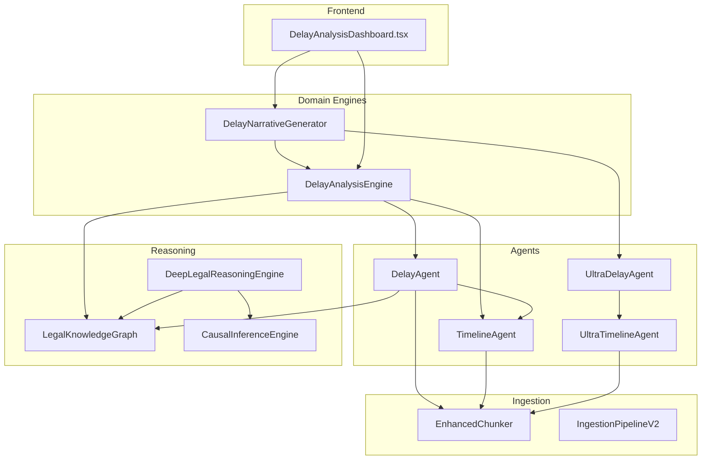

**Diagram sources**
- [delay_agent.py](file://mahoun/agents/delay_agent.py#L1-L220)
- [timeline_agent.py](file://mahoun/agents/timeline_agent.py#L1-L235)
- [ultra_delay_agent.py](file://mahoun/agents/ultra_delay_agent.py#L1-L217)
- [ultra_timeline_agent.py](file://mahoun/agents/ultra_timeline_agent.py#L1-L290)
- [delay_analyzer.py](file://mahoun/domain/delay_analyzer.py#L1-L169)
- [delay_narrative.py](file://mahoun/domain/delay_narrative.py#L1-L195)
- [enhanced_chunker.py](file://mahoun/pipelines/ingestion/enhanced_chunker.py#L1-L317)
- [pipeline.py](file://mahoun/pipelines/ingestion/pipeline.py#L1-L792)
- [knowledge_graph.py](file://mahoun/reasoning/knowledge_graph.py#L1-L499)
- [reasoning_engine.py](file://mahoun/reasoning/reasoning_engine.py#L1-L391)
- [causal_inference.py](file://mahoun/reasoning/causal_inference.py#L1-L279)
- [DelayAnalysisDashboard.tsx](file://frontend/src/components/DelayAnalysisDashboard.tsx#L1-L256)

**Section sources**
- [delay_agent.py](file://mahoun/agents/delay_agent.py#L1-L220)
- [timeline_agent.py](file://mahoun/agents/timeline_agent.py#L1-L235)
- [ultra_delay_agent.py](file://mahoun/agents/ultra_delay_agent.py#L1-L217)
- [ultra_timeline_agent.py](file://mahoun/agents/ultra_timeline_agent.py#L1-L290)
- [delay_analyzer.py](file://mahoun/domain/delay_analyzer.py#L1-L169)
- [delay_narrative.py](file://mahoun/domain/delay_narrative.py#L1-L195)
- [enhanced_chunker.py](file://mahoun/pipelines/ingestion/enhanced_chunker.py#L1-L317)
- [pipeline.py](file://mahoun/pipelines/ingestion/pipeline.py#L1-L792)
- [knowledge_graph.py](file://mahoun/reasoning/knowledge_graph.py#L1-L499)
- [reasoning_engine.py](file://mahoun/reasoning/reasoning_engine.py#L1-L391)
- [causal_inference.py](file://mahoun/reasoning/causal_inference.py#L1-L279)
- [DelayAnalysisDashboard.tsx](file://frontend/src/components/DelayAnalysisDashboard.tsx#L1-L256)

## Core Components
- DelayAgent: orchestrates retrieval, timeline extraction, delay extraction, analysis, critical path identification, and attribution.
- TimelineAgent: extracts events, builds a timeline, detects conflicts, and constructs a timeline matrix.
- UltraDelayAgent: enterprise-grade delay analysis with classification (excusable/non-excusable), concurrent delay detection, and critical path impact.
- UltraTimelineAgent: advanced date extraction, temporal consistency checks, event type classification, and conflict detection.
- DelayAnalysisEngine: coordinates DelayAgent and TimelineAnalyzer to produce delay windows, enhanced attribution, and metadata.
- DelayNarrativeGenerator: produces legal/technical narratives enriched with delay analysis results.
- EnhancedChunker: semantic chunking with dynamic sizing and boundary preservation.
- IngestionPipelineV2: production-grade ingestion pipeline integrating normalization, chunking, embedding, and storage.
- LegalKnowledgeGraph: persistent legal rules and precedents with CRUD and similarity search.
- DeepLegalReasoningEngine: combines chain-of-thought, causal inference, and knowledge graph for deep reasoning.
- CausalInferenceEngine: infers causal relationships from facts and outcomes.

**Section sources**
- [delay_agent.py](file://mahoun/agents/delay_agent.py#L1-L220)
- [timeline_agent.py](file://mahoun/agents/timeline_agent.py#L1-L235)
- [ultra_delay_agent.py](file://mahoun/agents/ultra_delay_agent.py#L1-L217)
- [ultra_timeline_agent.py](file://mahoun/agents/ultra_timeline_agent.py#L1-L290)
- [delay_analyzer.py](file://mahoun/domain/delay_analyzer.py#L1-L169)
- [delay_narrative.py](file://mahoun/domain/delay_narrative.py#L1-L195)
- [enhanced_chunker.py](file://mahoun/pipelines/ingestion/enhanced_chunker.py#L1-L317)
- [pipeline.py](file://mahoun/pipelines/ingestion/pipeline.py#L1-L792)
- [knowledge_graph.py](file://mahoun/reasoning/knowledge_graph.py#L1-L499)
- [reasoning_engine.py](file://mahoun/reasoning/reasoning_engine.py#L1-L391)
- [causal_inference.py](file://mahoun/reasoning/causal_inference.py#L1-L279)

## Architecture Overview
The Delay Analysis Agent follows a layered architecture:
- Ingestion layer prepares documents via enhanced_chunker.py and ingestion pipeline.
- Agent layer performs timeline extraction and delay analysis.
- Domain engine layer coordinates analysis and narrative generation.
- Reasoning layer enriches analysis with legal knowledge and causal inference.
- Frontend layer visualizes timelines, delays, attribution, and critical paths.

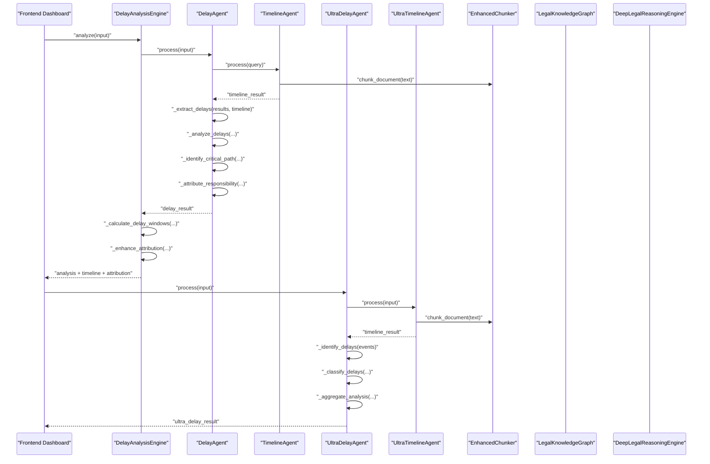

**Diagram sources**
- [delay_analyzer.py](file://mahoun/domain/delay_analyzer.py#L56-L131)
- [delay_agent.py](file://mahoun/agents/delay_agent.py#L64-L138)
- [timeline_agent.py](file://mahoun/agents/timeline_agent.py#L59-L130)
- [ultra_delay_agent.py](file://mahoun/agents/ultra_delay_agent.py#L106-L139)
- [ultra_timeline_agent.py](file://mahoun/agents/ultra_timeline_agent.py#L120-L177)
- [enhanced_chunker.py](file://mahoun/pipelines/ingestion/enhanced_chunker.py#L52-L86)
- [DelayAnalysisDashboard.tsx](file://frontend/src/components/DelayAnalysisDashboard.tsx#L29-L71)

## Detailed Component Analysis

### DelayAgent
Responsibilities:
- Initialize RAG, TimelineAgent, and optional UltraReasoningService.
- Retrieve delay-related information via RAG.
- Extract delays from retrieval results and timeline.
- Analyze delays, identify critical path, and attribute responsibility.
- Return structured results with metadata.

Key processing logic:
- Timeline extraction via TimelineAgent.
- RAG retrieval with multiple queries.
- Delay extraction using keyword matching and numeric pattern extraction.
- Attribution using responsibility keywords.
- Critical path selection by returning top events with sequence.

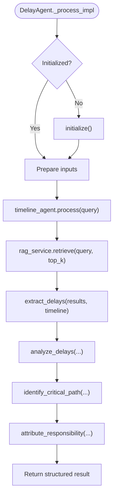

**Diagram sources**
- [delay_agent.py](file://mahoun/agents/delay_agent.py#L64-L138)

**Section sources**
- [delay_agent.py](file://mahoun/agents/delay_agent.py#L30-L138)

### TimelineAgent
Responsibilities:
- Initialize RAG, QueryRouter, and MetadataExtractor.
- Route queries and retrieve results.
- Extract events with dates and descriptions.
- Build a sorted timeline, detect conflicts, and construct a timeline matrix.

Key processing logic:
- Query routing and retrieval.
- Date extraction using regex patterns.
- Conflict detection by grouping events by date and comparing descriptions.
- Timeline matrix building for visualization.

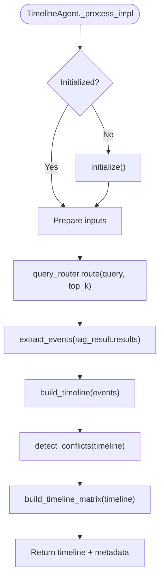

**Diagram sources**
- [timeline_agent.py](file://mahoun/agents/timeline_agent.py#L59-L130)

**Section sources**
- [timeline_agent.py](file://mahoun/agents/timeline_agent.py#L38-L130)

### UltraDelayAgent
Responsibilities:
- Link to UltraTimelineAgent and RAG.
- Convert timeline events to delay events.
- Classify delays (excusable/compensable/non-excusable/concurrent).
- Aggregate analysis and provide recommendations.

Key processing logic:
- Timeline retrieval via UltraTimelineAgent.
- Delay identification using keywords.
- Classification heuristics based on party mentions and duration thresholds.
- Aggregation with totals and recommendations.

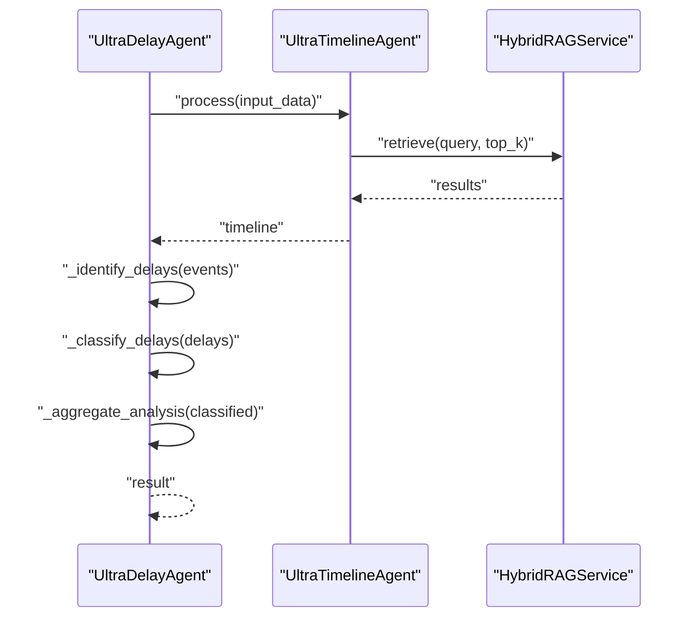

**Diagram sources**
- [ultra_delay_agent.py](file://mahoun/agents/ultra_delay_agent.py#L106-L139)
- [ultra_timeline_agent.py](file://mahoun/agents/ultra_timeline_agent.py#L120-L177)

**Section sources**
- [ultra_delay_agent.py](file://mahoun/agents/ultra_delay_agent.py#L68-L139)

### UltraTimelineAgent
Responsibilities:
- Advanced date extraction (Persian/Gregorian).
- Event type classification.
- Temporal consistency checks and conflict detection.
- Timeline construction with metadata.

Key processing logic:
- Date pattern matching and normalization.
- Sentence-based event extraction.
- Consistency scoring and conflict detection.
- Duration calculation and analysis metadata.

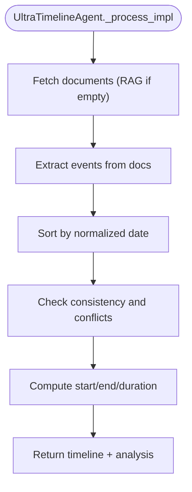

**Diagram sources**
- [ultra_timeline_agent.py](file://mahoun/agents/ultra_timeline_agent.py#L120-L177)

**Section sources**
- [ultra_timeline_agent.py](file://mahoun/agents/ultra_timeline_agent.py#L82-L177)

### DelayAnalysisEngine
Responsibilities:
- Coordinate DelayAgent and TimelineAnalyzer.
- Calculate delay windows and enhance attribution.
- Return unified analysis with timeline context.

Key processing logic:
- Invoke DelayAgent and TimelineAnalyzer.
- Combine delay results with timeline context.
- Compute delay windows and enhanced attribution statistics.

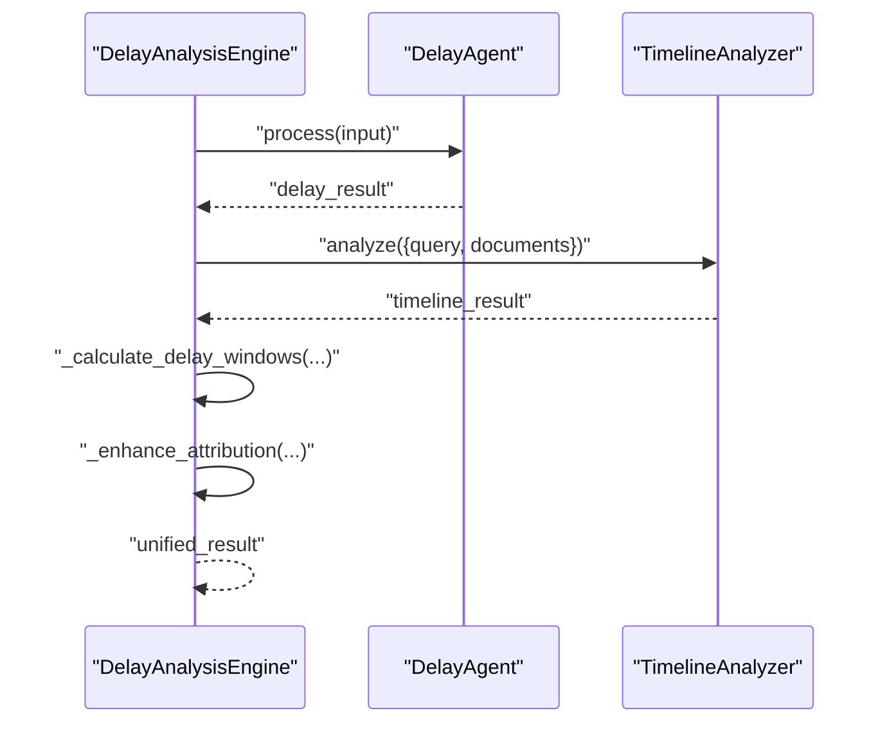

**Diagram sources**
- [delay_analyzer.py](file://mahoun/domain/delay_analyzer.py#L56-L131)

**Section sources**
- [delay_analyzer.py](file://mahoun/domain/delay_analyzer.py#L19-L131)

### DelayNarrativeGenerator
Responsibilities:
- Build narrative context from delay analysis.
- Generate narrative enriched with delay-specific sections.
- Extract legal and technical analysis from narrative.

Key processing logic:
- Build context from delay counts and totals.
- Enhance narrative with delay summaries.
- Extract legal arguments and technical analysis.

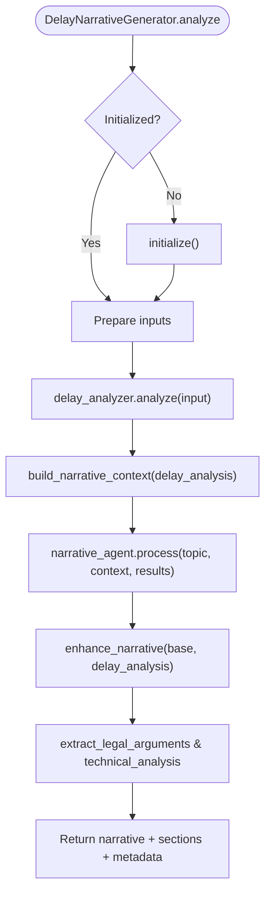

**Diagram sources**
- [delay_narrative.py](file://mahoun/domain/delay_narrative.py#L56-L139)

**Section sources**
- [delay_narrative.py](file://mahoun/domain/delay_narrative.py#L19-L139)

### Ingestion Pipeline and Enhanced Chunker
Responsibilities:
- Normalize Persian legal text.
- Chunk documents with semantic boundaries and overlap.
- Generate embeddings and store in vector database.
- Provide metrics and statistics.

Key processing logic:
- Normalization, verdict detection, and specialized chunking for legal verdicts.
- Dynamic chunk size based on content type.
- Overlap-aware chunk boundary detection preserving sentences and paragraphs.
- Embedding generation and vector storage with retries.

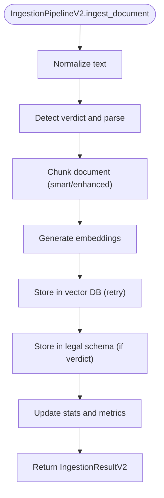

**Diagram sources**
- [pipeline.py](file://mahoun/pipelines/ingestion/pipeline.py#L228-L495)
- [enhanced_chunker.py](file://mahoun/pipelines/ingestion/enhanced_chunker.py#L52-L180)

**Section sources**
- [pipeline.py](file://mahoun/pipelines/ingestion/pipeline.py#L176-L495)
- [enhanced_chunker.py](file://mahoun/pipelines/ingestion/enhanced_chunker.py#L20-L180)

### Reasoning Integration
- LegalKnowledgeGraph: stores legal rules and precedents with version history and persistence.
- DeepLegalReasoningEngine: integrates CoT, causal inference, and knowledge graph for deep reasoning.
- CausalInferenceEngine: infers causal relationships and identifies primary causes.

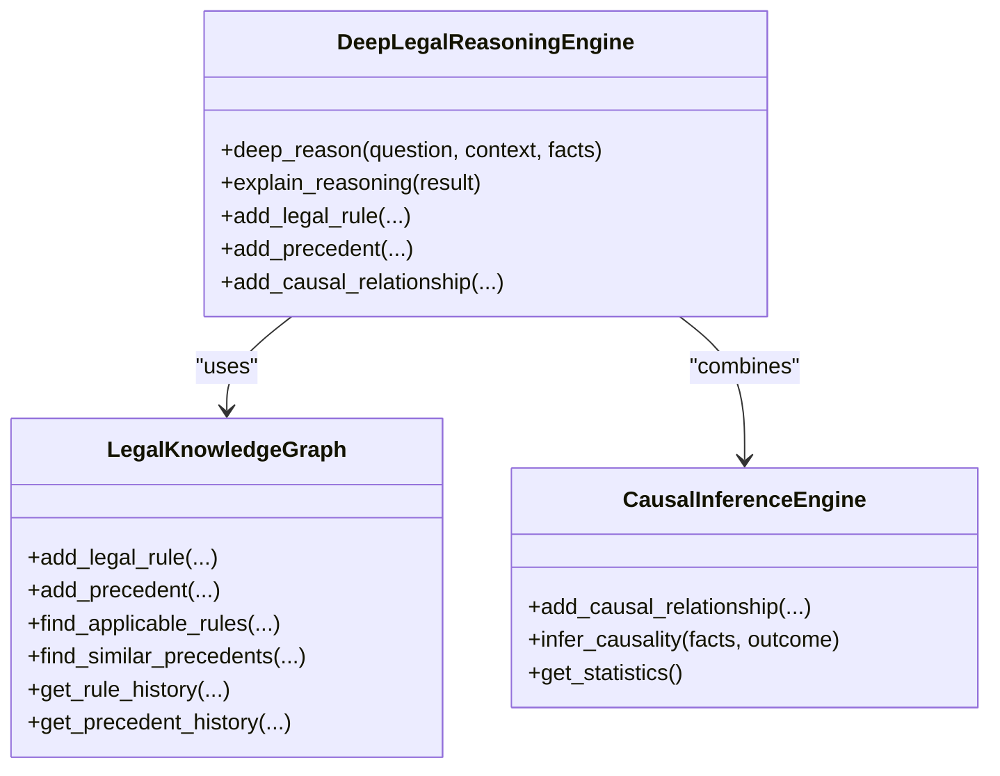

**Diagram sources**
- [knowledge_graph.py](file://mahoun/reasoning/knowledge_graph.py#L1-L499)
- [reasoning_engine.py](file://mahoun/reasoning/reasoning_engine.py#L1-L391)
- [causal_inference.py](file://mahoun/reasoning/causal_inference.py#L1-L279)

**Section sources**
- [knowledge_graph.py](file://mahoun/reasoning/knowledge_graph.py#L1-L499)
- [reasoning_engine.py](file://mahoun/reasoning/reasoning_engine.py#L1-L391)
- [causal_inference.py](file://mahoun/reasoning/causal_inference.py#L1-L279)

### Frontend Usage Example
The DelayAnalysisDashboard demonstrates:
- Submitting project_id and optional query.
- Triggering analysis and rendering summary cards (total delays, total delay days, average delay).
- Displaying attribution table by party.
- Showing critical path events with sequence numbers and dates.
- Generating and downloading a Markdown report.

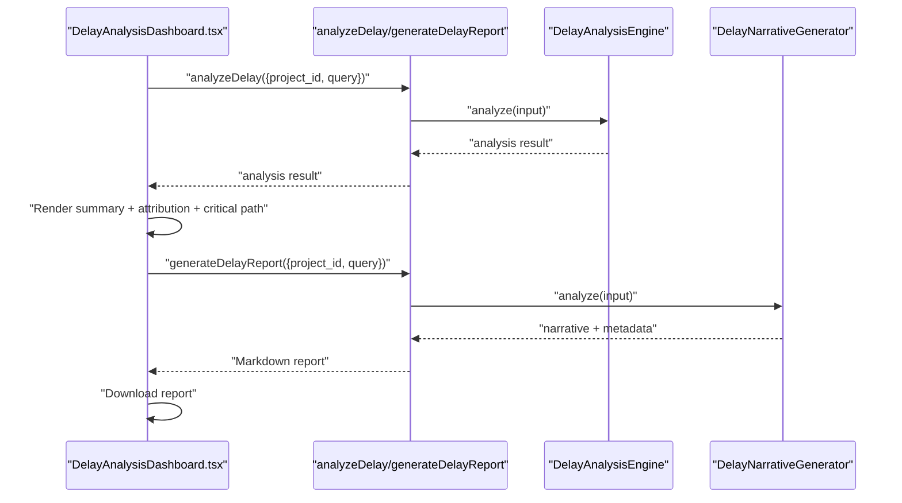

**Diagram sources**
- [DelayAnalysisDashboard.tsx](file://frontend/src/components/DelayAnalysisDashboard.tsx#L29-L71)
- [delay_analyzer.py](file://mahoun/domain/delay_analyzer.py#L56-L131)
- [delay_narrative.py](file://mahoun/domain/delay_narrative.py#L56-L139)

**Section sources**
- [DelayAnalysisDashboard.tsx](file://frontend/src/components/DelayAnalysisDashboard.tsx#L1-L256)

## Dependency Analysis
- DelayAgent depends on TimelineAgent and HybridRAGService; TimelineAgent depends on QueryRouter and MetadataExtractor.
- UltraDelayAgent depends on UltraTimelineAgent and HybridRAGService.
- DelayAnalysisEngine composes DelayAgent and TimelineAnalyzer.
- DelayNarrativeGenerator composes DelayAnalysisEngine and NarrativeAgent.
- IngestionPipelineV2 integrates EnhancedChunker and embedding services.
- Reasoning engines depend on LegalKnowledgeGraph and CausalInferenceEngine.

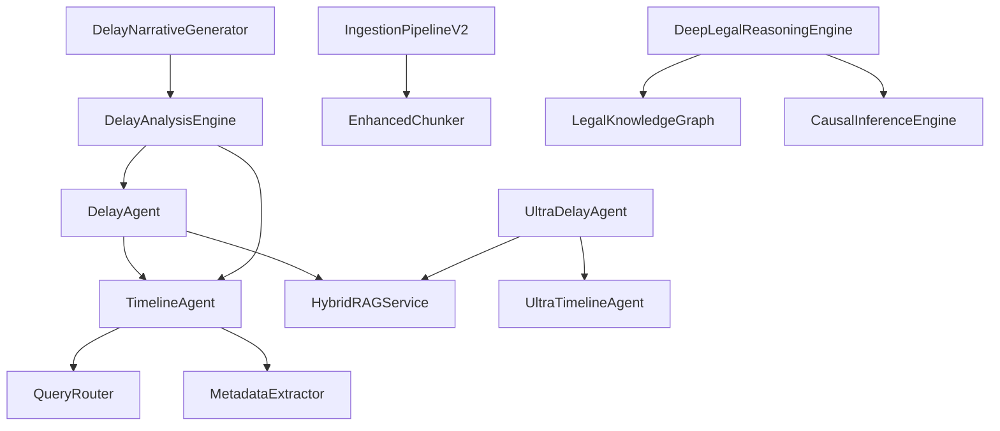

**Diagram sources**
- [delay_agent.py](file://mahoun/agents/delay_agent.py#L37-L58)
- [timeline_agent.py](file://mahoun/agents/timeline_agent.py#L38-L58)
- [ultra_delay_agent.py](file://mahoun/agents/ultra_delay_agent.py#L86-L105)
- [ultra_timeline_agent.py](file://mahoun/agents/ultra_timeline_agent.py#L110-L119)
- [delay_analyzer.py](file://mahoun/domain/delay_analyzer.py#L34-L49)
- [delay_narrative.py](file://mahoun/domain/delay_narrative.py#L34-L49)
- [pipeline.py](file://mahoun/pipelines/ingestion/pipeline.py#L176-L227)
- [enhanced_chunker.py](file://mahoun/pipelines/ingestion/enhanced_chunker.py#L20-L51)
- [reasoning_engine.py](file://mahoun/reasoning/reasoning_engine.py#L15-L39)
- [knowledge_graph.py](file://mahoun/reasoning/knowledge_graph.py#L72-L95)
- [causal_inference.py](file://mahoun/reasoning/causal_inference.py#L161-L182)

**Section sources**
- [delay_agent.py](file://mahoun/agents/delay_agent.py#L37-L58)
- [timeline_agent.py](file://mahoun/agents/timeline_agent.py#L38-L58)
- [ultra_delay_agent.py](file://mahoun/agents/ultra_delay_agent.py#L86-L105)
- [ultra_timeline_agent.py](file://mahoun/agents/ultra_timeline_agent.py#L110-L119)
- [delay_analyzer.py](file://mahoun/domain/delay_analyzer.py#L34-L49)
- [delay_narrative.py](file://mahoun/domain/delay_narrative.py#L34-L49)
- [pipeline.py](file://mahoun/pipelines/ingestion/pipeline.py#L176-L227)
- [enhanced_chunker.py](file://mahoun/pipelines/ingestion/enhanced_chunker.py#L20-L51)
- [reasoning_engine.py](file://mahoun/reasoning/reasoning_engine.py#L15-L39)
- [knowledge_graph.py](file://mahoun/reasoning/knowledge_graph.py#L72-L95)
- [causal_inference.py](file://mahoun/reasoning/causal_inference.py#L161-L182)

## Performance Considerations
- IngestionPipelineV2 uses thread pools and async operations to parallelize CPU-bound tasks (normalization, parsing, embedding) and I/O-bound operations (vector storage).
- EnhancedChunker dynamically adjusts chunk sizes based on content type to balance semantic coherence and retrieval performance.
- RAG retrieval uses top_k tuning to balance recall and latency.
- UltraDelayAgent and UltraTimelineAgent leverage heuristic classification and simple consistency checks to keep processing lightweight while still robust.

[No sources needed since this section provides general guidance]

## Troubleshooting Guide
Common issues and resolutions:
- Missing or uninitialized dependencies: Ensure initialize() is called before processing in agents and engines.
- Empty or low-quality chunks: Verify EnhancedChunker configuration and content type detection.
- Inconsistent or conflicting timelines: Use UltraTimelineAgent’s consistency checks and conflict detection; consider LegalKnowledgeGraph for temporal precedence.
- Attribution bias: Review keyword-based attribution logic and expand to include richer metadata extraction.
- Frontend rendering errors: Validate that analysis results include required fields (delays, delay_analysis, attribution, critical_path).

**Section sources**
- [delay_agent.py](file://mahoun/agents/delay_agent.py#L37-L63)
- [timeline_agent.py](file://mahoun/agents/timeline_agent.py#L38-L58)
- [ultra_timeline_agent.py](file://mahoun/agents/ultra_timeline_agent.py#L253-L275)
- [enhanced_chunker.py](file://mahoun/pipelines/ingestion/enhanced_chunker.py#L182-L251)
- [DelayAnalysisDashboard.tsx](file://frontend/src/components/DelayAnalysisDashboard.tsx#L125-L228)

## Conclusion
The Delay Analysis Agent provides a robust, layered system for extracting timelines, identifying delays, attributing responsibility, and constructing narratives. By integrating ingestion pipelines, advanced chunking, timeline agents, and reasoning engines, it supports both basic and enterprise-grade delay analysis. The frontend dashboard enables practical visualization of delay chains and critical paths, while the reasoning layer enhances analysis with legal knowledge and causal inference.

[No sources needed since this section summarizes without analyzing specific files]

## Appendices

### Data Flow from Ingestion to Timeline Construction
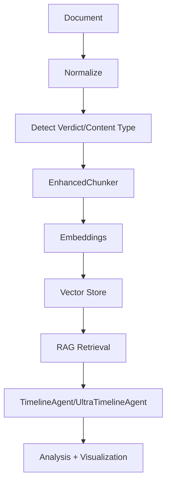

**Diagram sources**
- [pipeline.py](file://mahoun/pipelines/ingestion/pipeline.py#L228-L495)
- [enhanced_chunker.py](file://mahoun/pipelines/ingestion/enhanced_chunker.py#L52-L180)
- [timeline_agent.py](file://mahoun/agents/timeline_agent.py#L59-L130)
- [ultra_timeline_agent.py](file://mahoun/agents/ultra_timeline_agent.py#L120-L177)

### Handling Incomplete Timelines and Temporal Contradictions
- Incomplete timelines: Use UltraTimelineAgent’s consistency checks and conflict detection; leverage LegalKnowledgeGraph to resolve temporal precedence and select newer rules or facts.
- Temporal contradictions: Apply graph-based reasoning to resolve by confidence, credibility, temporal precedence, or graph analytics.

**Section sources**
- [ultra_timeline_agent.py](file://mahoun/agents/ultra_timeline_agent.py#L253-L275)
- [knowledge_graph.py](file://mahoun/reasoning/knowledge_graph.py#L334-L426)
- [reasoning_engine.py](file://mahoun/reasoning/reasoning_engine.py#L130-L213)