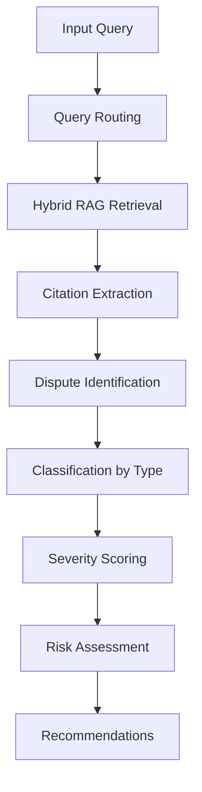
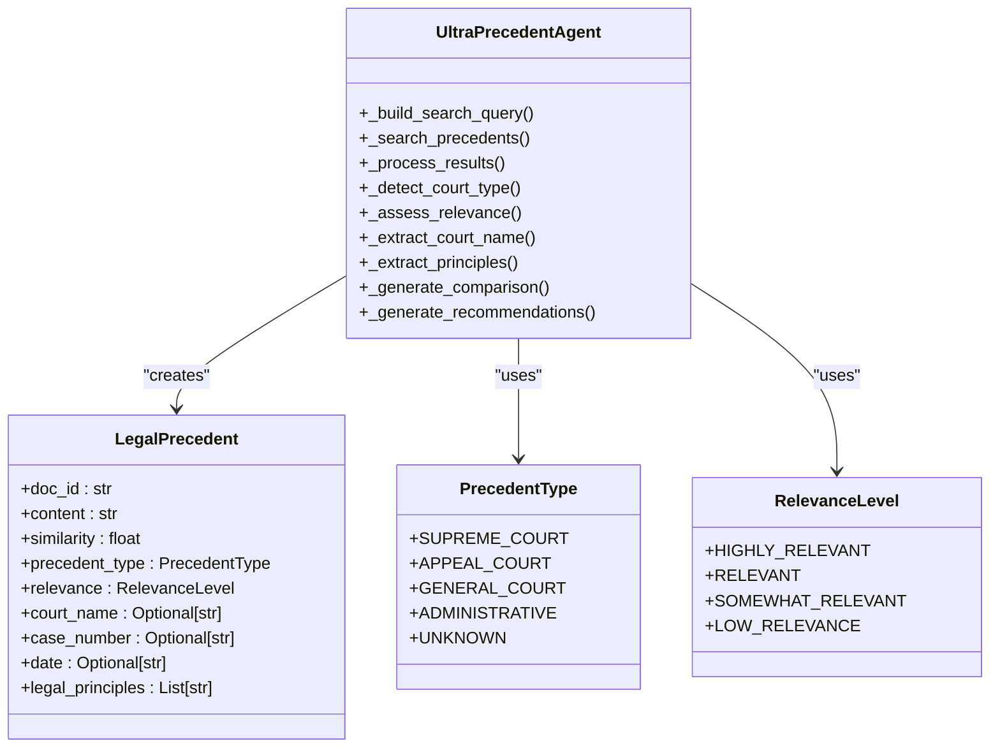
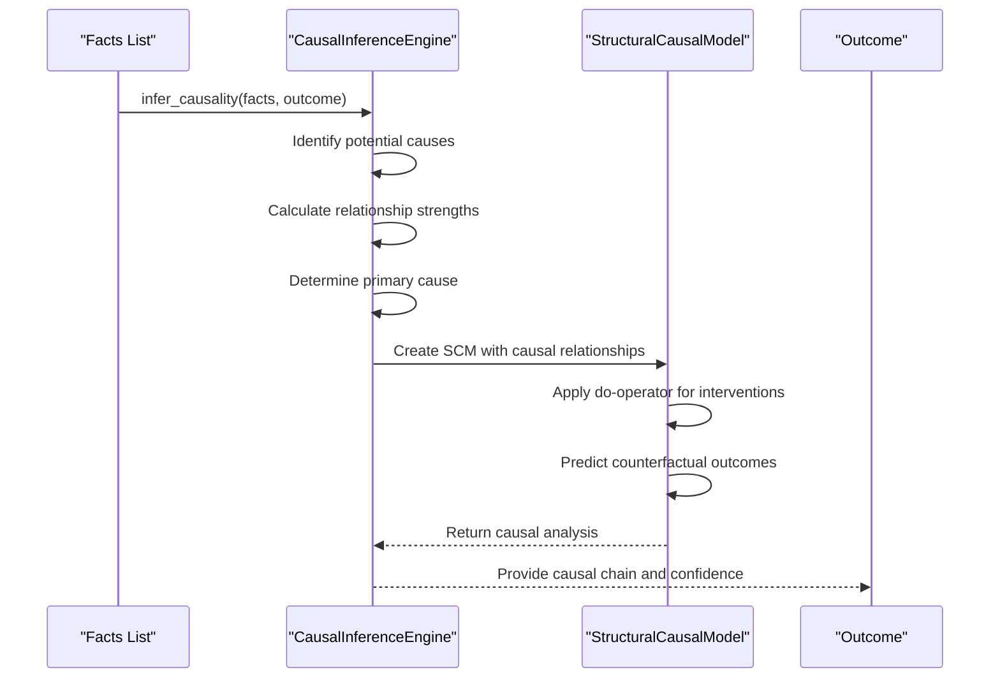
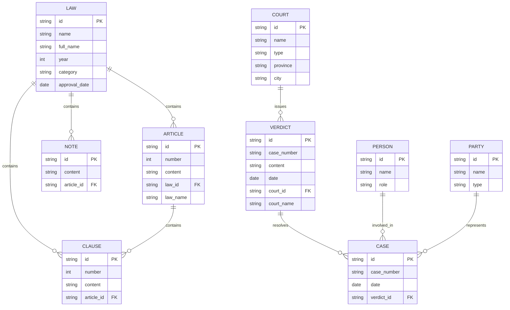
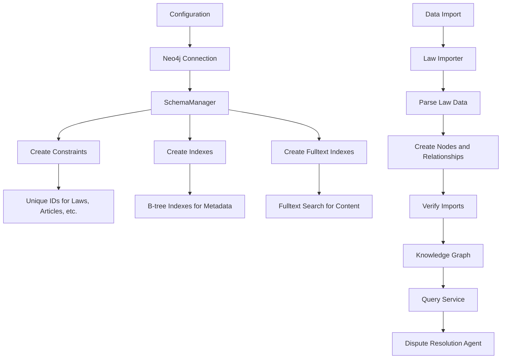

# Dispute Resolution Agent

<cite>
**Referenced Files in This Document**   
- [dispute_agent.py](file://mahoun/agents/dispute_agent.py)
- [dispute_extractor.py](file://mahoun/domain/dispute_extractor.py)
- [causal_inference.py](file://mahoun/reasoning/causal_inference.py)
- [ultra_precedent_agent.py](file://mahoun/agents/ultra_precedent_agent.py)
- [legal_precedent_agent.py](file://mahoun/agents/legal_precedent_agent.py)
- [healthcare_compliance.py](file://demos/healthcare_compliance.py)
- [import_laws.py](file://mahoun/graph/neo4j/examples/import_laws.py)
</cite>

## Table of Contents
1. [Introduction](#introduction)
2. [Core Components](#core-components)
3. [Dispute Detection and Extraction](#dispute-detection-and-extraction)
4. [Legal Precedent Retrieval](#legal-precedent-retrieval)
5. [Causal Inference and Liability Analysis](#causal-inference-and-liability-analysis)
6. [Healthcare Compliance Example](#healthcare-compliance-example)
7. [Jurisdiction-Specific Regulation Handling](#jurisdiction-specific-regulation-handling)
8. [Configuration and Knowledge Base Management](#configuration-and-knowledge-base-management)
9. [Conclusion](#conclusion)

## Introduction
The Dispute Resolution Agent is a sophisticated system designed to identify contractual disputes, extract relevant evidence, and leverage legal precedents to provide comprehensive dispute analysis. This document details the architecture, components, and integration points of the agent, focusing on its ability to detect issues through the dispute_extractor.py module, retrieve case law via the ultra_precedent_agent, establish liability chains using causal_inference.py, and apply these capabilities in domain-specific scenarios such as healthcare compliance. The system is built on a modular architecture that enables seamless integration of specialized agents and reasoning engines, ensuring accurate and legally sound dispute resolution outcomes.

## Core Components
The Dispute Resolution Agent comprises several interconnected components that work in concert to analyze disputes and generate actionable insights. At its core, the system utilizes a hybrid RAG (Retrieval-Augmented Generation) service combined with reasoning engines to perform deep analysis of contractual and legal documents. The agent classifies disputes into types such as financial, temporal, quality, contractual, and procedural, assigning severity levels based on keywords and confidence scores. It integrates with citation engines to extract relevant clauses and legal references, while also performing risk assessment and generating recommendations for resolution. The architecture supports backward compatibility with legacy systems while providing enhanced capabilities through modern AI-driven reasoning and evidence linking.

**Section sources**
- [dispute_agent.py](file://mahoun/agents/dispute_agent.py#L1-L429)

## Dispute Detection and Extraction
The dispute detection and extraction process is primarily handled by the DisputeAgent and DisputeExtractionEngine components. The DisputeAgent performs comprehensive analysis by routing queries through a hybrid RAG system, extracting citations, and applying reasoning to identify potential disputes. It classifies disputes based on keyword matching and assigns severity levels using a weighted scoring system that considers both the base relevance score and type-specific multipliers. The DisputeExtractionEngine acts as a domain-specific engine that leverages the DisputeAgent to extract disputes and violations from input data, enhancing the results with severity analysis and sorting by importance.

**Diagram sources **
- [dispute_agent.py](file://mahoun/agents/dispute_agent.py#L85-L164)
- [dispute_extractor.py](file://mahoun/domain/dispute_extractor.py#L53-L122)

## Legal Precedent Retrieval
Legal precedent retrieval is a critical function of the Dispute Resolution Agent, implemented through both the LegalPrecedentAgent and the more advanced UltraPrecedentAgent. These agents search for similar court rulings and verdicts by constructing optimized queries that include case descriptions, types, and legal issues. The UltraPrecedentAgent enhances this capability with enterprise-grade features such as court type detection, relevance level assessment, and precedent ranking. It categorizes precedents by court type (Supreme Court, Appeal Court, General Court, Administrative) and determines relevance based on similarity scores, providing a structured approach to legal research and case comparison.

**Diagram sources **
- [ultra_precedent_agent.py](file://mahoun/agents/ultra_precedent_agent.py#L25-L445)
- [legal_precedent_agent.py](file://mahoun/agents/legal_precedent_agent.py#L1-L192)

## Causal Inference and Liability Analysis
The causal inference capability of the Dispute Resolution Agent is implemented through the CausalInferenceEngine and StructuralCausalModel classes. This system enables the agent to establish liability and responsibility chains by modeling causal relationships between events and outcomes. The engine identifies potential causes from a set of facts and determines the primary cause based on relationship strength. It supports counterfactual reasoning, allowing the system to answer questions about what would have happened under different circumstances. This capability is essential for determining liability in complex disputes where multiple factors may contribute to an outcome.

**Diagram sources **
- [causal_inference.py](file://mahoun/reasoning/causal_inference.py#L1-L279)

## Healthcare Compliance Example
The healthcare compliance example demonstrates the application of the Dispute Resolution Agent in a regulated industry context. The healthcare_compliance.py demo showcases how the system can be used to detect violations of HIPAA regulations by encoding legal rules and precedents into a knowledge graph. The example includes rules for PHI encryption at rest and in transit, access auditing requirements, and references to actual regulatory settlements. When presented with case facts, the system generates evidence-linked verdicts that explicitly reference the applicable rules and precedents, providing a transparent and auditable decision-making process.

```mermaid
flowchart LR
A[Case Facts] --> B[Knowledge Graph]
B --> C[Applicable Rules]
C --> D[Similar Precedents]
D --> E[Contradiction Detection]
E --> F[Resolution Strategy]
F --> G[Evidence-Linked Verdict]
G --> H[Confidence Score]
H --> I[Recommendations]
style A fill:#f9f,stroke:#333
style B fill:#bbf,stroke:#333
style C fill:#f96,stroke:#333
style D fill:#6f9,stroke:#333
style E fill:#f66,stroke:#333
style F fill:#66f,stroke:#333
style G fill:#6f6,stroke:#333
style H fill:#ff6,stroke:#333
style I fill:#6ff,stroke:#333
```

**Diagram sources **
- [healthcare_compliance.py](file://demos/healthcare_compliance.py#L1-L169)

## Jurisdiction-Specific Regulation Handling
Handling jurisdiction-specific regulations is a key challenge addressed by the Dispute Resolution Agent through its flexible knowledge base architecture. The system supports the import and management of legal frameworks from different jurisdictions, as demonstrated by the import_laws.py example that shows how Iranian laws can be imported into the Neo4j knowledge graph. The schema supports multiple law categories including civil, penal, and procedural codes, with each article, note, and clause stored as a node in the graph. This structure enables efficient querying and retrieval of jurisdiction-specific regulations, ensuring that dispute resolution is grounded in the appropriate legal context.

**Diagram sources **
- [import_laws.py](file://mahoun/graph/neo4j/examples/import_laws.py#L1-L290)

## Configuration and Knowledge Base Management
The configuration and knowledge base management system for the Dispute Resolution Agent is designed to support flexible deployment across different legal domains and jurisdictions. The system uses a Neo4j graph database to store legal knowledge, with a comprehensive schema that includes constraints and indexes for efficient querying. The SchemaManager class handles the creation of constraints for unique identifiers and indexes for frequently searched fields, including full-text indexes for law, article, and verdict content. The system supports both programmatic and command-line import of legal data, with verification mechanisms to ensure data integrity.

**Diagram sources **
- [import_laws.py](file://mahoun/graph/neo4j/examples/import_laws.py#L1-L290)
- [schema.py](file://mahoun/graph/neo4j/schema.py#L1-L441)

## Conclusion
The Dispute Resolution Agent represents a comprehensive solution for identifying, analyzing, and resolving contractual disputes through the integration of advanced AI techniques and legal knowledge management. By combining dispute detection, precedent retrieval, causal inference, and jurisdiction-specific regulation handling, the system provides a robust framework for evidence-based dispute resolution. The modular architecture enables seamless integration of specialized components while maintaining backward compatibility with existing systems. The use of knowledge graphs and evidence-linked verdicts ensures transparency and auditability, making the system suitable for high-stakes legal applications. Future enhancements could include expanded support for international legal frameworks and integration with real-time regulatory updates.