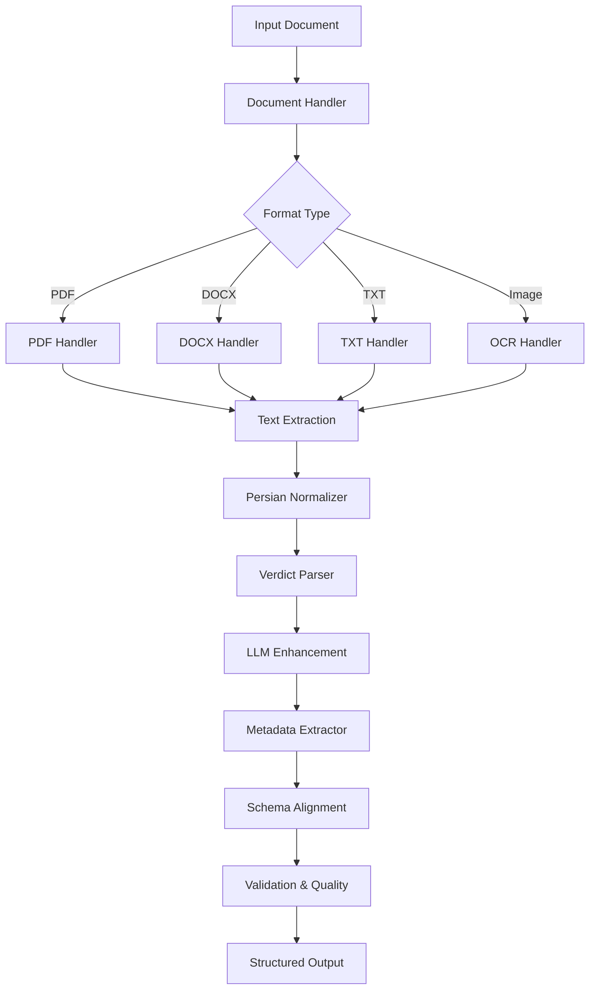
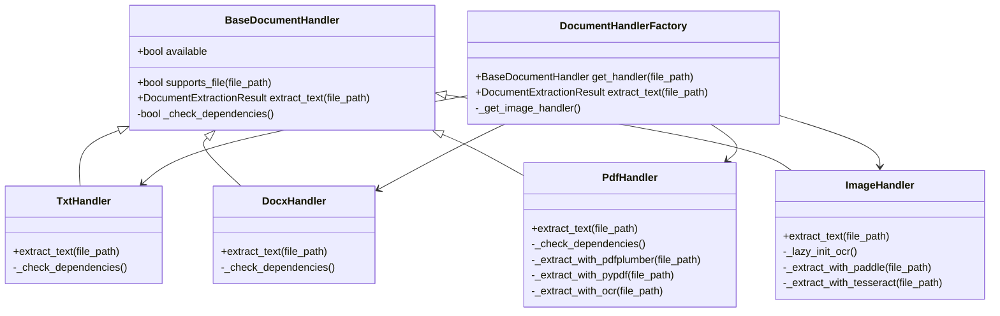
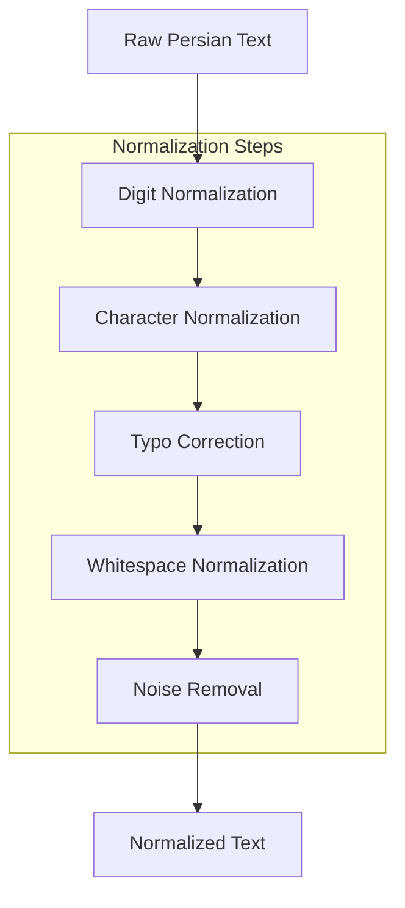
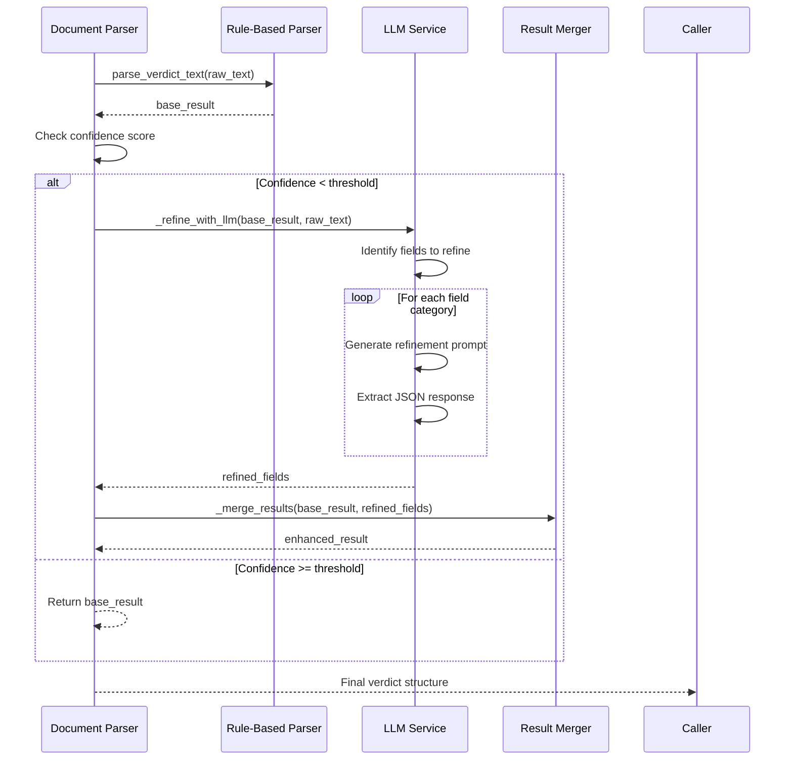
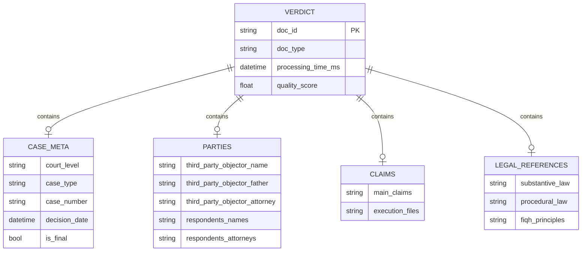
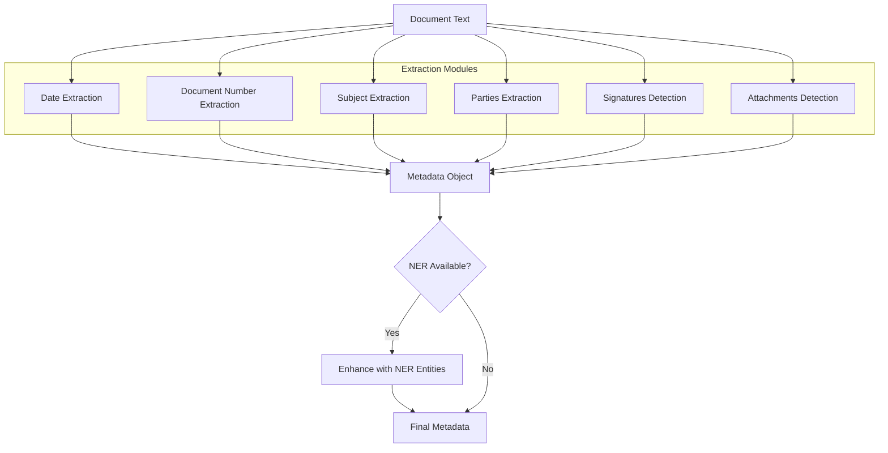
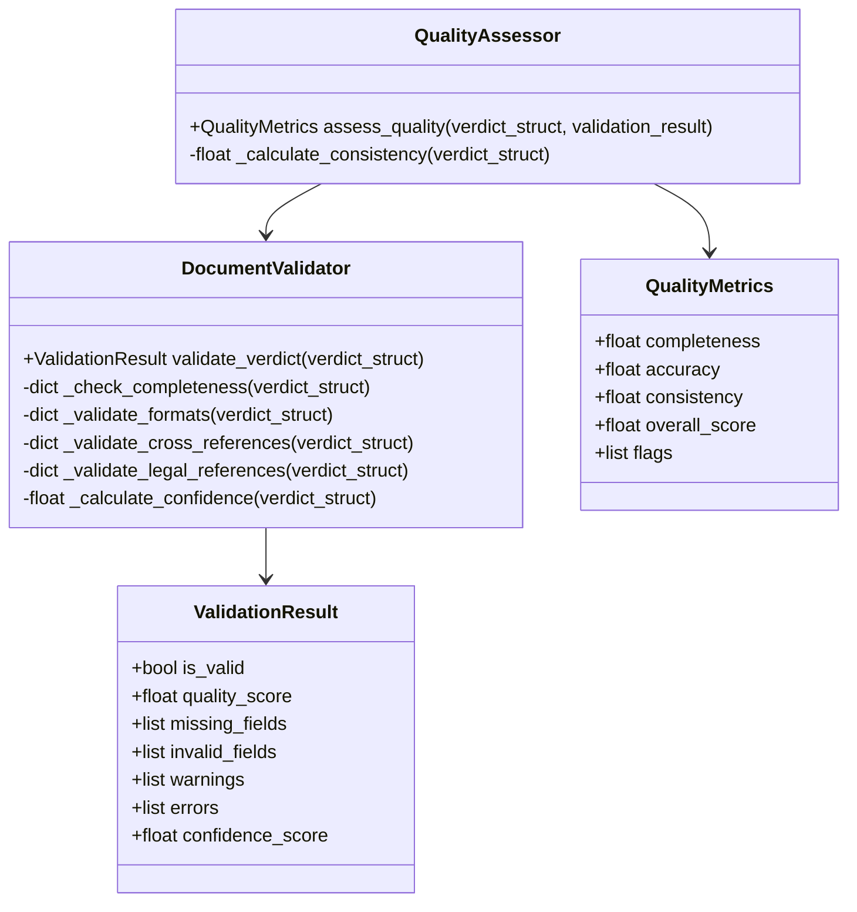
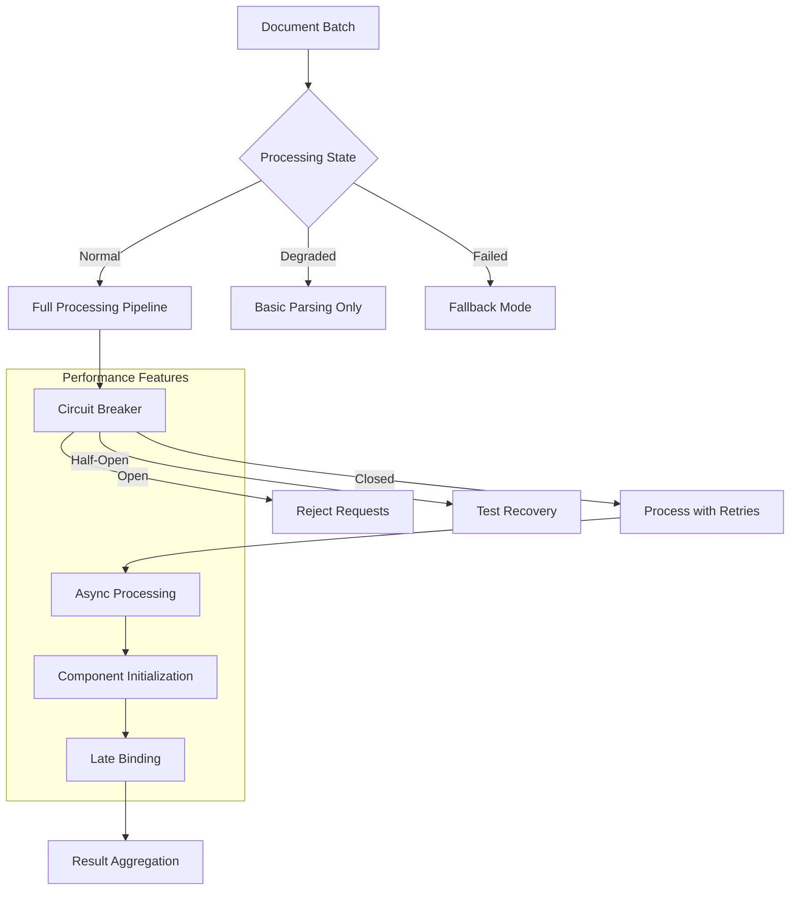
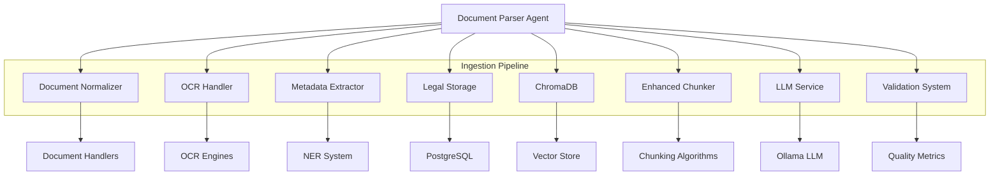

# Document Parser Agent

<cite>
**Referenced Files in This Document**   
- [doc_parser_agent.py](file://mahoun/agents/doc_parser_agent.py)
- [legal_struct_schema.py](file://mahoun/schemas/legal_struct_schema.py)
- [metadata_extractor.py](file://mahoun/pipelines/ingestion/metadata_extractor.py)
- [document_normalizer.py](file://mahoun/pipelines/ingestion/document_normalizer.py)
- [persian_normalizer.py](file://mahoun/pipelines/ingestion/persian_normalizer.py)
- [validation_quality.py](file://mahoun/pipelines/ingestion/validation_quality.py)
- [ocr_handler.py](file://mahoun/pipelines/ingestion/ocr_handler.py)
- [llm_enhanced_parser.py](file://mahoun/pipelines/ingestion/llm_enhanced_parser.py)
- [minimal_verdict_parser.py](file://mahoun/pipelines/ingestion/minimal_verdict_parser.py)
- [document_handlers.py](file://mahoun/pipelines/ingestion/document_handlers.py)
</cite>

## Table of Contents
1. [Introduction](#introduction)
2. [Parsing Pipeline Architecture](#parsing-pipeline-architecture)
3. [Multi-Format Input Processing](#multi-format-input-processing)
4. [Persian Text Normalization](#persian-text-normalization)
5. [LLM-Enhanced Extraction](#llm-enhanced-extraction)
6. [Schema Alignment and Structured Output](#schema-alignment-and-structured-output)
7. [Metadata Enrichment](#metadata-enrichment)
8. [Error Recovery and Validation](#error-recovery-and-validation)
9. [Performance Optimization](#performance-optimization)
10. [Integration with Ingestion Pipelines](#integration-with-ingestion-pipelines)

## Introduction
The Document Parser Agent is a core component of the MAHOUN system, responsible for extracting and normalizing structured data from legal documents. This agent processes various document formats, including PDFs, scanned images, and text files, transforming them into standardized JSON structures for downstream analysis. The parser combines rule-based extraction with LLM-enhanced refinement to achieve high accuracy in extracting legal entities, case metadata, and verdict structures. It integrates with multiple subsystems including OCR processing, Persian text normalization, metadata extraction, and quality validation to ensure robust document processing across diverse input types and quality levels.

## Parsing Pipeline Architecture

The Document Parser Agent implements a comprehensive processing pipeline that handles document ingestion, text extraction, normalization, and structured output generation. The architecture follows a layered approach with graceful degradation capabilities to maintain functionality even when certain components fail.

**Diagram sources**
- [doc_parser_agent.py](file://mahoun/agents/doc_parser_agent.py#L70-L566)
- [document_handlers.py](file://mahoun/pipelines/ingestion/document_handlers.py#L64-L724)
- [document_normalizer.py](file://mahoun/pipelines/ingestion/document_normalizer.py#L41-L404)

**Section sources**
- [doc_parser_agent.py](file://mahoun/agents/doc_parser_agent.py#L70-L566)

## Multi-Format Input Processing

The Document Parser Agent supports multiple document formats through specialized handlers that extract text content. The system uses a factory pattern to select the appropriate handler based on file extension and content type, with fallback mechanisms to ensure processing continues even when preferred handlers are unavailable.

### Document Handler Components

The ingestion pipeline includes handlers for various document types:

- **PDF Handler**: Uses pdfplumber for layout-aware text extraction, with pypdf as fallback and OCR for scanned documents
- **DOCX Handler**: Extracts text, tables, and formatting from Word documents using python-docx
- **TXT Handler**: Processes plain text files with multiple encoding support
- **Image Handler**: Applies OCR to extract text from image files

The system prioritizes handlers based on format specificity and available dependencies, falling back to simpler methods when advanced libraries are not installed.

**Diagram sources**
- [document_handlers.py](file://mahoun/pipelines/ingestion/document_handlers.py#L43-L724)

**Section sources**
- [document_handlers.py](file://mahoun/pipelines/ingestion/document_handlers.py#L43-L724)

## Persian Text Normalization

The Document Parser Agent includes comprehensive Persian text normalization capabilities to handle the various character encodings and typographical variations found in Iranian legal documents. The normalization process ensures consistent parsing and semantic correctness across the system.

### Normalization Process

The PersianLegalNormalizer class performs several critical normalization steps:

1. **Digit Normalization**: Converts Persian (۰۱۲۳۴۵۶۷۸۹) and Arabic (٠١٢٣٤٥٦٧٨٩) digits to standard English digits (0123456789)
2. **Character Normalization**: Standardizes character variants (ي→ی, ك→ک, etc.)
3. **Typo Correction**: Fixes common legal document typos (اقای→آقای)
4. **Whitespace Normalization**: Collapses multiple spaces and removes zero-width characters
5. **Document Noise Removal**: Strips page numbers and common header/footer artifacts

**Diagram sources**
- [persian_normalizer.py](file://mahoun/pipelines/ingestion/persian_normalizer.py#L34-L458)

**Section sources**
- [persian_normalizer.py](file://mahoun/pipelines/ingestion/persian_normalizer.py#L34-L458)

## LLM-Enhanced Extraction

The Document Parser Agent leverages LLM technology to enhance the accuracy of structured data extraction from legal documents. This hybrid approach combines rule-based parsing with LLM refinement to handle ambiguous or low-confidence extractions.

### Enhancement Workflow

The LLM enhancement process follows these steps:

1. **Initial Rule-Based Parsing**: The minimal_verdict_parser extracts structured data using regex patterns and heuristics
2. **Confidence Assessment**: The system evaluates the quality of initial extraction
3. **Targeted LLM Refinement**: For fields with low confidence, the system uses LLM to refine the extraction
4. **Result Integration**: Refined fields are merged with the base result
5. **Confidence Recalculation**: Final confidence score is updated based on refinement

**Diagram sources**
- [llm_enhanced_parser.py](file://mahoun/pipelines/ingestion/llm_enhanced_parser.py#L25-L456)
- [minimal_verdict_parser.py](file://mahoun/pipelines/ingestion/minimal_verdict_parser.py#L1-L1243)

**Section sources**
- [llm_enhanced_parser.py](file://mahoun/pipelines/ingestion/llm_enhanced_parser.py#L25-L456)

## Schema Alignment and Structured Output

The Document Parser Agent ensures extracted data conforms to a standardized schema defined in legal_struct_schema.py. This schema alignment process transforms raw extractions into consistent, predictable structures for downstream processing.

### Legal Structure Schema

The legal document schema defines the expected structure for parsed verdicts, including:

- **Case Metadata**: Court level, case type, decision date, case number
- **Parties**: Third-party objector, respondents, attorneys
- **Claims**: Main claims and execution file references
- **Legal References**: Substantive and procedural laws cited
- **Final Decision**: Court's ruling and reasoning

The schema serves as both a validation framework and a target structure for the parsing process, ensuring consistency across documents from different sources and time periods.

**Diagram sources**
- [legal_struct_schema.py](file://mahoun/schemas/legal_struct_schema.py)
- [doc_parser_agent.py](file://mahoun/agents/doc_parser_agent.py#L70-L566)

**Section sources**
- [legal_struct_schema.py](file://mahoun/schemas/legal_struct_schema.py)

## Metadata Enrichment

The Document Parser Agent enriches parsed documents with additional metadata extracted from the content and context. This metadata enhancement improves searchability, categorization, and analytical capabilities.

### Metadata Extraction Process

The metadata extraction system analyzes document text to identify and extract key information:

- **Dates**: Extracts decision dates, issue dates, and receipt dates using pattern matching
- **Document Numbers**: Identifies case numbers, letter numbers, and reference numbers
- **Subject/Title**: Determines document subject from keywords and document structure
- **Parties**: Identifies senders, recipients, and involved parties
- **Signatures**: Detects signature blocks and signatories
- **Attachments**: Identifies referenced attachments and enclosures

The system combines pattern matching with NER (when available) to maximize extraction accuracy.

**Diagram sources**
- [metadata_extractor.py](file://mahoun/pipelines/ingestion/metadata_extractor.py#L26-L285)

**Section sources**
- [metadata_extractor.py](file://mahoun/pipelines/ingestion/metadata_extractor.py#L26-L285)

## Error Recovery and Validation

The Document Parser Agent implements comprehensive error recovery and validation mechanisms to ensure robust processing of documents with varying quality and completeness.

### Validation Quality System

The validation system performs multiple checks on parsed documents:

- **Field Completeness**: Verifies required fields are present
- **Format Validation**: Ensures data conforms to expected formats
- **Cross-Reference Validation**: Checks consistency between related fields
- **Legal Reference Validation**: Validates cited legal articles
- **Confidence Scoring**: Calculates overall confidence in parsing accuracy

The system flags documents with quality issues and provides detailed information about missing or invalid fields.

**Diagram sources**
- [validation_quality.py](file://mahoun/pipelines/ingestion/validation_quality.py#L45-L449)

**Section sources**
- [validation_quality.py](file://mahoun/pipelines/ingestion/validation_quality.py#L45-L449)

## Performance Optimization

The Document Parser Agent includes several performance optimizations to handle large document batches efficiently.

### Processing Optimizations

Key performance features include:

- **Circuit Breaker Pattern**: Prevents cascade failures by temporarily halting requests to failing services
- **Retry with Exponential Backoff**: Handles transient failures with intelligent retry scheduling
- **Async Processing**: Uses asynchronous I/O for non-blocking operations
- **Lazy Initialization**: Loads components only when needed
- **Graceful Degradation**: Falls back to basic parsing when advanced features fail

The agent also implements comprehensive metrics collection to monitor processing performance and identify bottlenecks.

**Diagram sources**
- [doc_parser_agent.py](file://mahoun/agents/doc_parser_agent.py#L70-L566)
- [base_agent.py](file://mahoun/agents/base_agent.py#L161-L576)

**Section sources**
- [doc_parser_agent.py](file://mahoun/agents/doc_parser_agent.py#L70-L566)

## Integration with Ingestion Pipelines

The Document Parser Agent integrates seamlessly with the broader ingestion pipeline, connecting with various components to provide end-to-end document processing.

### Integration Architecture

The agent interacts with multiple pipeline components:

- **Document Normalizer**: Converts inputs to standardized format
- **OCR Handler**: Processes scanned documents and images
- **Metadata Extractor**: Enriches documents with extracted metadata
- **Legal Storage**: Persists processed documents to PostgreSQL
- **ChromaDB**: Stores document chunks for vector search
- **Enhanced Chunker**: Splits documents into coherent segments

The integration follows a modular design with loose coupling, allowing components to be updated or replaced independently.

**Diagram sources**
- [doc_parser_agent.py](file://mahoun/agents/doc_parser_agent.py#L70-L566)
- [document_normalizer.py](file://mahoun/pipelines/ingestion/document_normalizer.py#L41-L404)
- [ocr_handler.py](file://mahoun/pipelines/ingestion/ocr_handler.py#L538-L658)

**Section sources**
- [doc_parser_agent.py](file://mahoun/agents/doc_parser_agent.py#L70-L566)