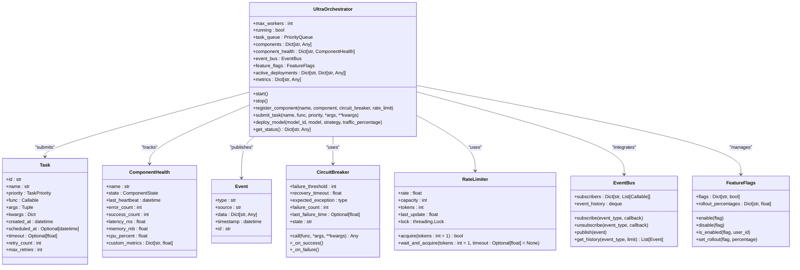
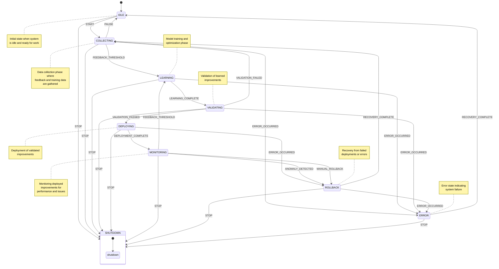
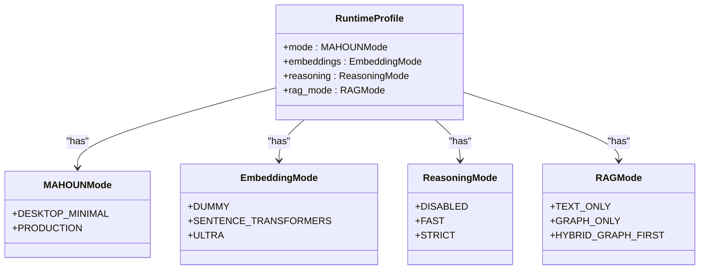
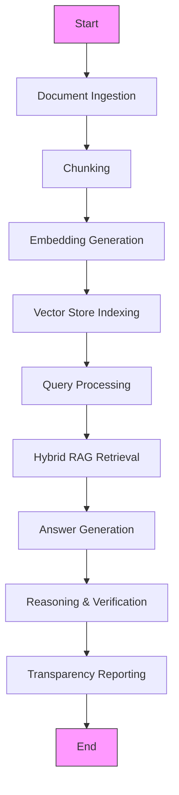

# Agent Orchestration

<cite>
**Referenced Files in This Document**   
- [orchestrator.py](file://mahoun/orchestrator/orchestrator.py)
- [state_machine.py](file://mahoun/orchestrator/state_machine.py)
- [runtime_profile.py](file://mahoun/orchestrator/runtime_profile.py)
- [demo_mvp.py](file://mahoun/orchestrator/demo_mvp.py)
- [smoke_tests.py](file://mahoun/orchestrator/smoke_tests.py)
- [test_e2e_mahoun.py](file://tests/test_e2e_mahoun.py)
</cite>

## Table of Contents
1. [Introduction](#introduction)
2. [Orchestrator Architecture](#orchestrator-architecture)
3. [State Machine Management](#state-machine-management)
4. [Runtime Profiling and Performance Monitoring](#runtime-profiling-and-performance-monitoring)
5. [Workflow Coordination and Execution](#workflow-coordination-and-execution)
6. [Error Handling and Timeout Management](#error-handling-and-timeout-management)
7. [Scalability Considerations](#scalability-considerations)
8. [Practical Examples and Testing](#practical-examples-and-testing)
9. [Conclusion](#conclusion)

## Introduction

The Agent Orchestration system in the MAHOUN platform provides a comprehensive framework for managing complex workflows involving multiple AI agents. This system ensures reliable coordination, state management, and performance monitoring across distributed components. The core implementation revolves around the orchestrator.py module, which manages task scheduling, component health, and workflow execution, while the state_machine.py module handles complex state transitions and lifecycle management. The runtime_profile.py module provides transparency into the operational mode of the system, and practical examples from demo_mvp.py and test_e2e_mahoun.py demonstrate real-world usage patterns. This documentation covers the architecture, implementation details, and best practices for working with the agent orchestration system.

**Section sources**
- [orchestrator.py](file://mahoun/orchestrator/orchestrator.py#L1-L837)
- [state_machine.py](file://mahoun/orchestrator/state_machine.py#L1-L574)

## Orchestrator Architecture

The orchestrator.py implementation provides a robust framework for managing AI agent workflows with enterprise-grade features. The UltraOrchestrator class serves as the central coordination point, handling task scheduling, component health monitoring, and workflow execution. The architecture follows an event-driven design with a pub/sub event bus that enables loose coupling between components. Tasks are managed through a priority queue system that supports different priority levels from CRITICAL to BACKGROUND, ensuring that high-priority operations receive appropriate resources.

The orchestrator implements several resilience patterns including circuit breakers and rate limiters to prevent cascading failures and protect system resources. The CircuitBreaker class monitors component health and automatically isolates failing components, while the RateLimiter implements a token bucket algorithm to control request rates. These mechanisms work together to maintain system stability under varying loads and failure conditions.

**Diagram sources **
- [orchestrator.py](file://mahoun/orchestrator/orchestrator.py#L1-L837)

**Section sources**
- [orchestrator.py](file://mahoun/orchestrator/orchestrator.py#L1-L837)

## State Machine Management

The state_machine.py module implements a sophisticated state management system for coordinating the lifecycle of self-improvement processes. The StateMachine class provides thread-safe state transitions with comprehensive guards, conditions, and callbacks. The system supports eight distinct states: IDLE, COLLECTING, LEARNING, VALIDATING, DEPLOYING, MONITORING, ROLLBACK, and ERROR, each representing a phase in the self-improvement lifecycle.

State transitions are triggered by specific events such as START, FEEDBACK_THRESHOLD, LEARNING_COMPLETE, VALIDATION_PASSED, and ERROR_OCCURRED. The state machine enforces valid transitions through a predefined transition table, preventing invalid state changes. Each transition can have associated conditions that must be satisfied before the transition occurs, providing fine-grained control over the workflow progression.

The implementation includes several advanced features:
- **Transition guards**: Conditions that must be met before a transition can occur
- **State entry/exit actions**: Callbacks executed when entering or exiting a state
- **Rollback capabilities**: Support for reverting to previous states when errors occur
- **Detailed metrics**: Comprehensive tracking of state durations, transition frequencies, and error rates
- **Thread safety**: RLock protection for concurrent access

**Diagram sources **
- [state_machine.py](file://mahoun/orchestrator/state_machine.py#L1-L574)

**Section sources**
- [state_machine.py](file://mahoun/orchestrator/state_machine.py#L1-L574)

## Runtime Profiling and Performance Monitoring

The runtime_profile.py module provides a descriptive view of the current operational profile of the MAHOUN system. This module serves as a transparency layer, reporting the current mode and configuration without controlling behavior. The RuntimeProfile class contains four key configuration dimensions: operational mode, embedding mode, reasoning mode, and RAG mode.

The MAHOUNMode enum defines two operational modes: DESKTOP_MINIMAL for development and testing, and PRODUCTION for full-featured operation. The EmbeddingMode enum specifies the embedding service configuration with options for DUMMY (random vectors for testing), SENTENCE_TRANSFORMERS (semantic embeddings), and ULTRA (advanced embeddings). The ReasoningMode enum controls reasoning capabilities with DISABLED, FAST, and STRICT options, while the RAGMode enum determines retrieval behavior with TEXT_ONLY, GRAPH_ONLY, and HYBRID_GRAPH_FIRST strategies.

**Diagram sources **
- [runtime_profile.py](file://mahoun/orchestrator/runtime_profile.py#L1-L65)

**Section sources**
- [runtime_profile.py](file://mahoun/orchestrator/runtime_profile.py#L1-L65)

## Workflow Coordination and Execution

The agent orchestration system coordinates complex workflows through a combination of task scheduling, dependency management, and execution sequencing. The orchestrator manages the execution of multiple AI agents in a coordinated manner, ensuring proper initialization, execution order, and resource allocation. The system supports both sequential and parallel execution patterns, with the ability to define dependencies between tasks.

Workflow execution follows a well-defined pattern:
1. **Initialization**: Agents are registered with the orchestrator and initialized
2. **Task Submission**: Tasks are submitted with appropriate priority levels
3. **Dependency Resolution**: The orchestrator resolves dependencies between tasks
4. **Execution Scheduling**: Tasks are scheduled based on priority and resource availability
5. **Monitoring**: Task progress and component health are continuously monitored
6. **Completion**: Results are collected and aggregated

The system supports various deployment strategies including immediate deployment, canary deployments with gradual traffic rollout, blue-green deployments, rolling updates, and shadow deployments for testing. These strategies allow for safe and controlled deployment of new models and improvements.

**Section sources**
- [orchestrator.py](file://mahoun/orchestrator/orchestrator.py#L1-L837)
- [demo_mvp.py](file://mahoun/orchestrator/demo_mvp.py#L1-L542)

## Error Handling and Timeout Management

The agent orchestration system implements comprehensive error handling and timeout management to ensure reliability and resilience. The orchestrator uses multiple mechanisms to handle failures gracefully and prevent system instability. The circuit breaker pattern automatically isolates failing components, preventing cascading failures and allowing time for recovery.

Timeout management is implemented at multiple levels:
- **Task-level timeouts**: Individual tasks have configurable timeout values
- **Component-level timeouts**: Components can be configured with specific timeout thresholds
- **Workflow-level timeouts**: Entire workflows can have timeout constraints

When a task fails, the system implements a retry mechanism with exponential backoff. Tasks are retried up to a configurable maximum number of times before being marked as failed. The orchestrator also implements health monitoring that tracks error rates and automatically marks components as DEGRADED or UNHEALTHY when error thresholds are exceeded.

The state machine provides additional error handling capabilities through its ROLLBACK state, which allows the system to revert to a previous stable state when critical errors occur. The transition from any state to ROLLBACK can be triggered by ERROR_OCCURRED, ANOMALY_DETECTED, or MANUAL_ROLLBACK events, providing multiple pathways for error recovery.

**Section sources**
- [orchestrator.py](file://mahoun/orchestrator/orchestrator.py#L1-L837)
- [state_machine.py](file://mahoun/orchestrator/state_machine.py#L1-L574)
- [smoke_tests.py](file://mahoun/orchestrator/smoke_tests.py#L1-L306)

## Scalability Considerations

The agent orchestration system is designed with scalability in mind to support large numbers of concurrent agent workflows. The architecture supports horizontal scaling through several key mechanisms:

**Worker Pool Management**: The orchestrator maintains a configurable pool of worker threads that can be adjusted based on system resources and workload requirements. The max_workers parameter controls the number of concurrent tasks that can be executed, allowing the system to scale with available CPU resources.

**Priority-Based Scheduling**: The priority queue system ensures that critical tasks receive resources even under heavy load. By categorizing tasks into CRITICAL, HIGH, MEDIUM, LOW, and BACKGROUND priorities, the system can maintain responsiveness for important operations while processing lower-priority tasks when resources are available.

**Resource Isolation**: Components are isolated through rate limiting and circuit breakers, preventing any single component from consuming excessive resources or affecting the stability of other components. The rate limiter controls the request rate for each component, while the circuit breaker prevents repeated calls to failing components.

**Asynchronous Processing**: The entire system is built on asyncio, enabling efficient handling of I/O-bound operations and allowing thousands of concurrent workflows to be managed with minimal overhead. This asynchronous design is particularly important for AI agent workflows, which often involve network calls to external services.

**State Management**: The state machine implementation is thread-safe and can handle concurrent access from multiple workflows. The use of RLock ensures that state transitions are atomic and consistent, even when multiple threads are attempting to modify the state simultaneously.

**Section sources**
- [orchestrator.py](file://mahoun/orchestrator/orchestrator.py#L1-L837)
- [state_machine.py](file://mahoun/orchestrator/state_machine.py#L1-L574)

## Practical Examples and Testing

The MAHOUN platform includes several practical examples and testing utilities that demonstrate the agent orchestration system in action. The demo_mvp.py module provides an end-to-end demonstration of the complete pipeline, from document ingestion through to answer generation and verification. This example shows how multiple components work together in a coordinated workflow.

The smoke_tests.py module contains end-to-end smoke tests that verify the basic functionality of the orchestrator in desktop_minimal mode. These tests validate that the runtime configuration is correct, the orchestrator can be instantiated successfully, and components are properly initialized. The tests also verify graceful degradation, ensuring that the system continues to function even when optional components are unavailable.

The test_e2e_mahoun.py module contains comprehensive end-to-end tests that validate complete workflows involving multiple agents. These tests cover various scenarios including document analysis, query answering, and report generation. The tests verify that agents are properly coordinated, dependencies are respected, and results are correctly aggregated.

**Diagram sources **
- [demo_mvp.py](file://mahoun/orchestrator/demo_mvp.py#L1-L542)

**Section sources**
- [demo_mvp.py](file://mahoun/orchestrator/demo_mvp.py#L1-L542)
- [smoke_tests.py](file://mahoun/orchestrator/smoke_tests.py#L1-L306)
- [test_e2e_mahoun.py](file://tests/test_e2e_mahoun.py#L1-L178)

## Conclusion

The Agent Orchestration system in the MAHOUN platform provides a robust and scalable framework for managing complex AI workflows. Through the integration of the orchestrator.py, state_machine.py, and supporting modules, the system offers comprehensive capabilities for workflow coordination, state management, and performance monitoring. The architecture emphasizes reliability through circuit breakers, rate limiting, and comprehensive error handling, while supporting scalability through asynchronous processing and efficient resource management.

Key strengths of the system include its modular design, which allows for easy extension and customization, and its comprehensive monitoring capabilities that provide visibility into system performance and health. The practical examples and testing utilities demonstrate the system's capabilities in real-world scenarios, from simple demonstrations to complex end-to-end workflows.

For optimal use of the agent orchestration system, it is recommended to:
- Configure appropriate priority levels for different task types
- Implement proper error handling and retry logic
- Monitor system metrics to identify performance bottlenecks
- Use the state machine for managing complex lifecycle transitions
- Leverage the runtime profiling system for transparency and debugging

The system is well-positioned to handle the demands of large-scale AI applications, providing a solid foundation for building reliable and scalable agent-based systems.