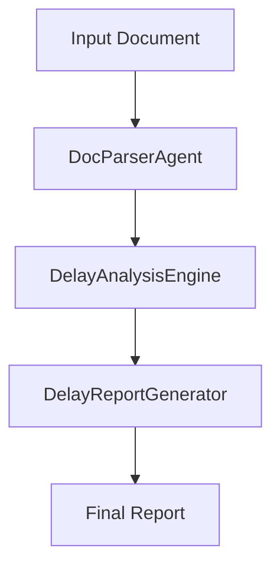
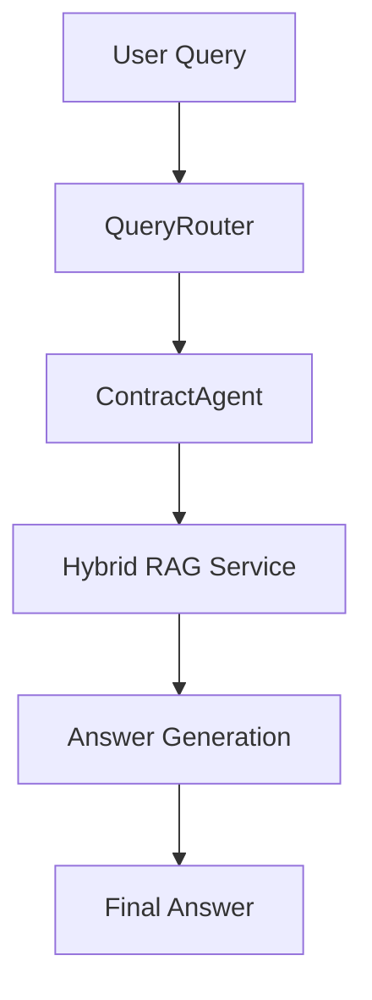
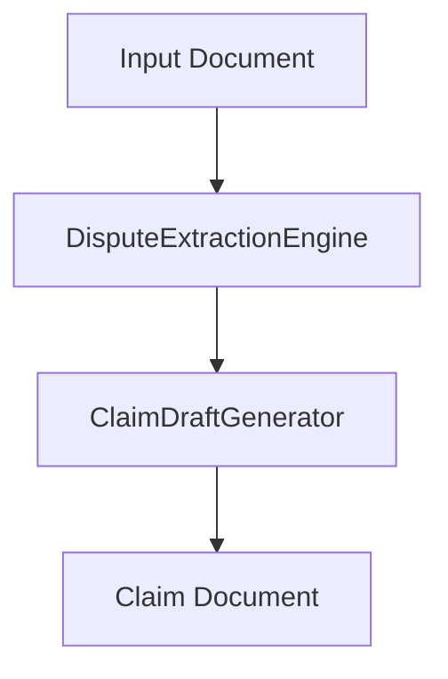
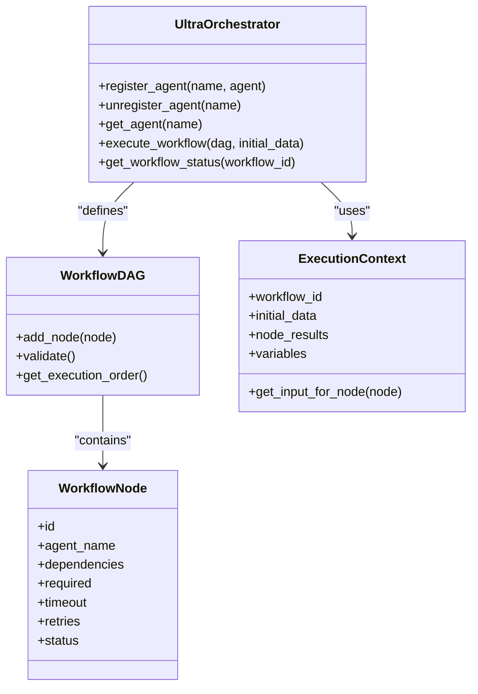

# Orchestration Workflows

<cite>
**Referenced Files in This Document**   
- [demo_mvp.py](file://mahoun/orchestrator/demo_mvp.py)
- [test_e2e_mahoun.py](file://tests/test_e2e_mahoun.py)
- [orchestrator.py](file://mahoun/agents/orchestrator.py)
- [base_agent.py](file://mahoun/agents/base_agent.py)
- [doc_parser_agent.py](file://mahoun/agents/doc_parser_agent.py)
- [contract_agent.py](file://mahoun/agents/contract_agent.py)
- [dispute_agent.py](file://mahoun/agents/dispute_agent.py)
- [reasoning_chain.py](file://mahoun/reasoning/reasoning_chain.py)
- [hybrid_rag_service.py](file://mahoun/rag/hybrid_rag_service.py)
- [state_machine.py](file://mahoun/orchestrator/state_machine.py)
</cite>

## Table of Contents
1. [Introduction](#introduction)
2. [Core Workflow Patterns](#core-workflow-patterns)
3. [Document → Analysis → Report Workflow](#document--analysis--report-workflow)
4. [Query → RAG → Answer Workflow](#query--rag--answer-workflow)
5. [Claim Generation Workflow](#claim-generation-workflow)
6. [Multi-Agent Orchestration](#multi-agent-orchestration)
7. [Agent Registration and Configuration](#agent-registration-and-configuration)
8. [Workflow Execution and State Management](#workflow-execution-and-state-management)
9. [Input and Output Specifications](#input-and-output-specifications)
10. [Troubleshooting and Common Issues](#troubleshooting-and-common-issues)

## Introduction
Orchestration Workflows in the MAHOUN platform coordinate complex sequences of operations across multiple specialized agents and services. These workflows enable end-to-end processing of legal and contractual documents through a series of well-defined stages, from document ingestion to final report generation. The orchestrator manages dependencies, handles errors, and ensures the integrity of multi-step processes. This document details the key workflow patterns, execution mechanics, and practical examples based on the `test_e2e_mahoun.py` and `demo_mvp.py` files, providing a comprehensive guide to building and managing orchestrated processes.

**Section sources**
- [demo_mvp.py](file://mahoun/orchestrator/demo_mvp.py#L1-L542)
- [test_e2e_mahoun.py](file://tests/test_e2e_mahoun.py#L1-L178)

## Core Workflow Patterns
The MAHOUN platform implements several core workflow patterns that represent common processing pipelines. These patterns are built on a foundation of modular agents and services that can be combined in various ways to achieve specific objectives. The primary patterns include Document → Analysis → Report, Query → RAG → Answer, and Claim Generation. Each pattern follows a sequential or directed acyclic graph (DAG) structure, where the output of one stage serves as the input to the next. The orchestrator ensures that these workflows execute reliably, with proper error handling and state management. These patterns are designed to be both robust and flexible, allowing for customization through configuration parameters.

**Section sources**
- [test_e2e_mahoun.py](file://tests/test_e2e_mahoun.py#L12-L54)
- [test_e2e_mahoun.py](file://tests/test_e2e_mahoun.py#L58-L81)
- [test_e2e_mahoun.py](file://tests/test_e2e_mahoun.py#L117-L144)

## Document → Analysis → Report Workflow
The Document → Analysis → Report workflow is a fundamental pattern for processing legal documents. It begins with the ingestion and parsing of a document, followed by a specialized analysis phase, and concludes with the generation of a structured report. In the `test_document_to_report_workflow` example, the process starts with the `DocParserAgent` which extracts text and metadata from the input document. The parsed data is then passed to the `DelayAnalysisEngine` for domain-specific analysis, such as identifying delays in a contract. Finally, the `DelayReportGenerator` compiles the analysis results into a formal report. This workflow demonstrates a linear progression where each stage depends on the successful completion of the previous one, ensuring a coherent and traceable processing pipeline.

**Diagram sources**
- [test_e2e_mahoun.py](file://tests/test_e2e_mahoun.py#L12-L54)

**Section sources**
- [test_e2e_mahoun.py](file://tests/test_e2e_mahoun.py#L12-L54)
- [doc_parser_agent.py](file://mahoun/agents/doc_parser_agent.py#L70-L200)
- [domain/delay_analyzer.py](file://mahoun/domain/delay_analyzer.py)

## Query → RAG → Answer Workflow
The Query → RAG → Answer workflow is designed for information retrieval and response generation. It starts with a user query, which is processed through a Retrieval-Augmented Generation (RAG) system to find relevant information, and ends with a generated answer. In the `test_query_to_answer_workflow` example, the `QueryRouter` first classifies the incoming query to determine the appropriate retrieval strategy. The classified query is then handled by the `ContractAgent`, which uses the RAG system to retrieve contextually relevant document chunks. The agent processes this retrieved information to generate a precise and well-supported answer. This workflow highlights the integration of retrieval and reasoning, ensuring that answers are grounded in the available evidence.

**Diagram sources**
- [test_e2e_mahoun.py](file://tests/test_e2e_mahoun.py#L58-L81)
- [rag/hybrid_rag_service.py](file://mahoun/rag/hybrid_rag_service.py)

**Section sources**
- [test_e2e_mahoun.py](file://tests/test_e2e_mahoun.py#L58-L81)
- [contract_agent.py](file://mahoun/agents/contract_agent.py)
- [hybrid_rag_service.py](file://mahoun/rag/hybrid_rag_service.py)

## Claim Generation Workflow
The Claim Generation workflow automates the creation of legal claims based on identified disputes. This process begins with the extraction of dispute information from documents, followed by the generation of a formal claim draft. In the `test_claim_generation_workflow` example, the `DisputeExtractionEngine` analyzes the input to identify potential disputes or contractual violations. The extracted dispute data is then passed to the `ClaimDraftGenerator`, which uses this information to compose a structured claim. This workflow is critical for legal automation, as it transforms raw analysis into actionable legal documents, significantly reducing the time and effort required for claim preparation.

**Diagram sources**
- [test_e2e_mahoun.py](file://tests/test_e2e_mahoun.py#L117-L144)

**Section sources**
- [test_e2e_mahoun.py](file://tests/test_e2e_mahoun.py#L117-L144)
- [domain/dispute_extractor.py](file://mahoun/domain/dispute_extractor.py)
- [output/claim_generator.py](file://output/claim_generator.py)

## Multi-Agent Orchestration
The orchestrator manages the execution of workflows involving multiple agents, ensuring proper coordination and dependency resolution. The `UltraOrchestrator` class provides a robust framework for defining and executing complex workflows. In the `test_orchestrator_workflow` example, agents are registered with the orchestrator, and a workflow is defined as a sequence of steps, each specifying an agent and its configuration. The orchestrator executes these steps in order, passing data from one agent to the next. It handles errors according to the `required` flag, allowing non-critical steps to fail without stopping the entire workflow. This capability enables the creation of sophisticated, fault-tolerant processing pipelines.

**Diagram sources**
- [orchestrator.py](file://mahoun/agents/orchestrator.py#L234-L388)

**Section sources**
- [test_e2e_mahoun.py](file://tests/test_e2e_mahoun.py#L84-L114)
- [orchestrator.py](file://mahoun/agents/orchestrator.py)

## Agent Registration and Configuration
Agents are registered with the orchestrator to make them available for workflow execution. Each agent is assigned a unique name and can be configured with specific parameters that control its behavior. The `UltraOrchestrator` maintains a dictionary of registered agents, allowing them to be looked up by name during workflow execution. Configuration is passed to agents through the `config` parameter in the workflow definition, enabling dynamic adjustment of agent behavior without modifying the agent code itself. This decoupling of configuration from code enhances flexibility and reusability, allowing the same agent to be used in different contexts with different settings.

**Section sources**
- [orchestrator.py](file://mahoun/agents/orchestrator.py#L330-L346)
- [test_e2e_mahoun.py](file://tests/test_e2e_mahoun.py#L91-L97)

## Workflow Execution and State Management
Workflow execution is managed by the orchestrator, which tracks the state of each workflow and its constituent nodes. The `execute_workflow` method validates the workflow DAG, creates an execution context, and processes nodes in the correct order based on their dependencies. The orchestrator supports checkpointing, allowing long-running workflows to be resumed from a previous state in case of interruption. It also provides real-time progress tracking through callbacks, enabling external systems to monitor workflow execution. The state of each node (e.g., pending, running, completed, failed) is meticulously tracked, providing a clear audit trail of the workflow's progress.

**Section sources**
- [orchestrator.py](file://mahoun/agents/orchestrator.py#L351-L483)
- [state_machine.py](file://mahoun/orchestrator/state_machine.py)

## Input and Output Specifications
Each stage of a workflow has well-defined input and output specifications. Inputs are typically provided as a dictionary of key-value pairs, which may include raw text, document metadata, or results from previous steps. Outputs are standardized in the form of an `AgentResult` object, which contains a success flag, the result data, and any error messages. This consistent interface ensures that data can be reliably passed between agents. For example, the `DocParserAgent` expects an input with a `text` or `file_path` key and returns a result containing parsed content and extracted entities. Similarly, the `ContractAgent` takes a `query` as input and returns an `answer` along with supporting evidence.

**Section sources**
- [base_agent.py](file://mahoun/agents/base_agent.py#L84-L113)
- [doc_parser_agent.py](file://mahoun/agents/doc_parser_agent.py#L184-L200)
- [contract_agent.py](file://mahoun/agents/contract_agent.py#L85-L200)

## Troubleshooting and Common Issues
Common issues in workflow execution include agent initialization failures, retrieval timeouts, and verification errors. Test assertions in `test_e2e_mahoun.py` provide a blueprint for validating workflow correctness, checking for the presence of expected keys in the output and ensuring the success flag is set. A frequent issue is the unavailability of required dependencies, such as the NLI verifier or citation auditor, which can cause verification steps to fail. The orchestrator's integrity guard can detect potential hallucinations by running a critic agent on the results. To troubleshoot, developers should check the logs for error messages, verify that all agents are properly registered, and ensure that the input data conforms to the expected schema.

**Section sources**
- [test_e2e_mahoun.py](file://tests/test_e2e_mahoun.py)
- [reasoning_chain.py](file://mahoun/reasoning/reasoning_chain.py#L146-L200)
- [base_agent.py](file://mahoun/agents/base_agent.py)