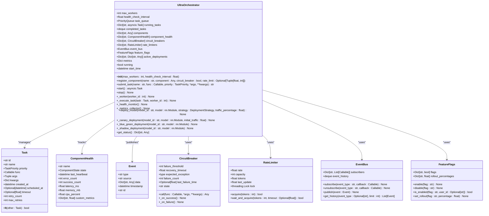
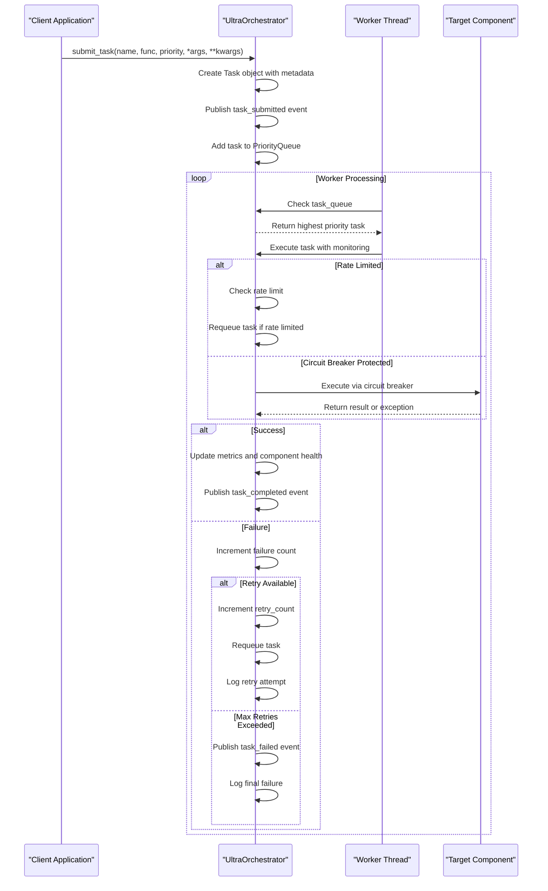
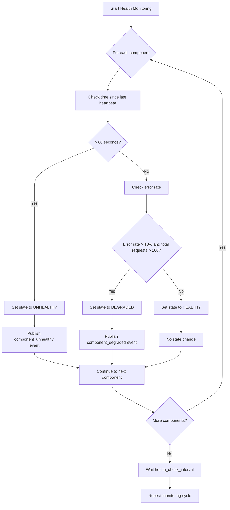
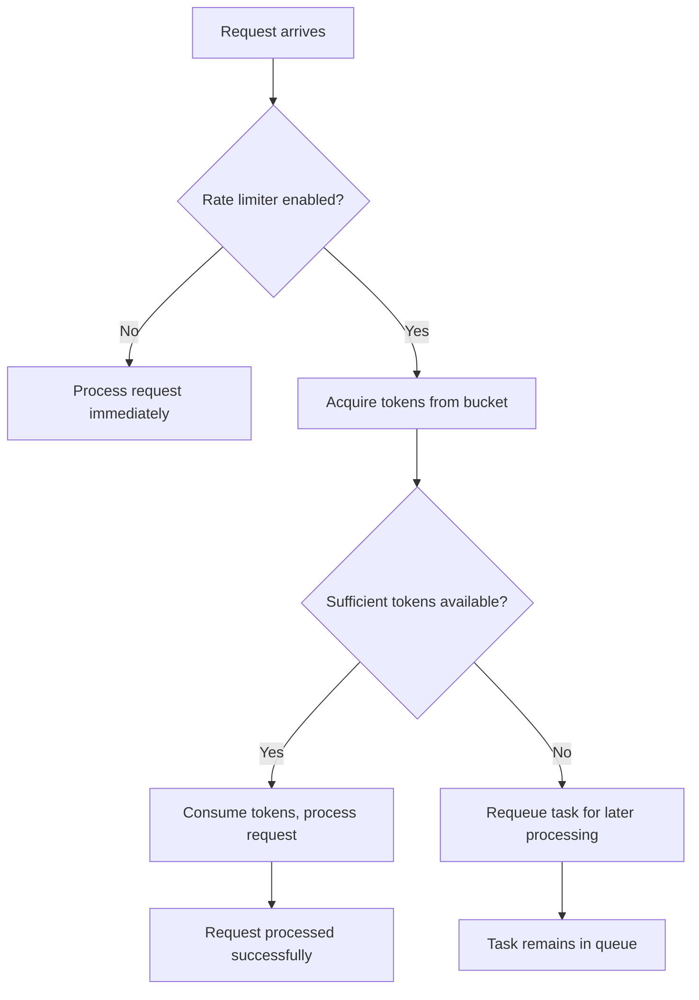
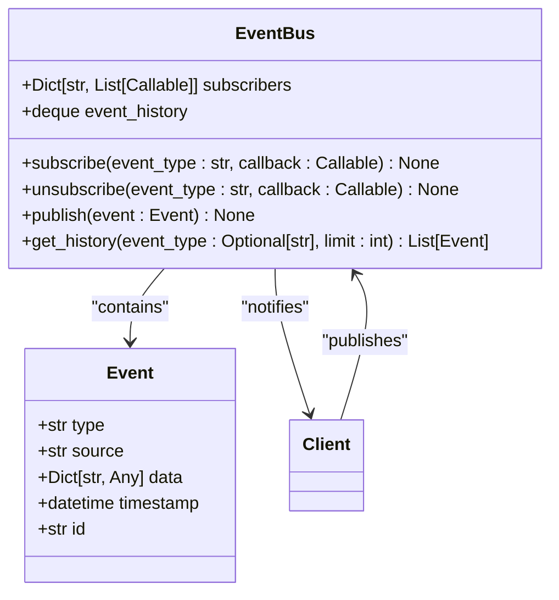
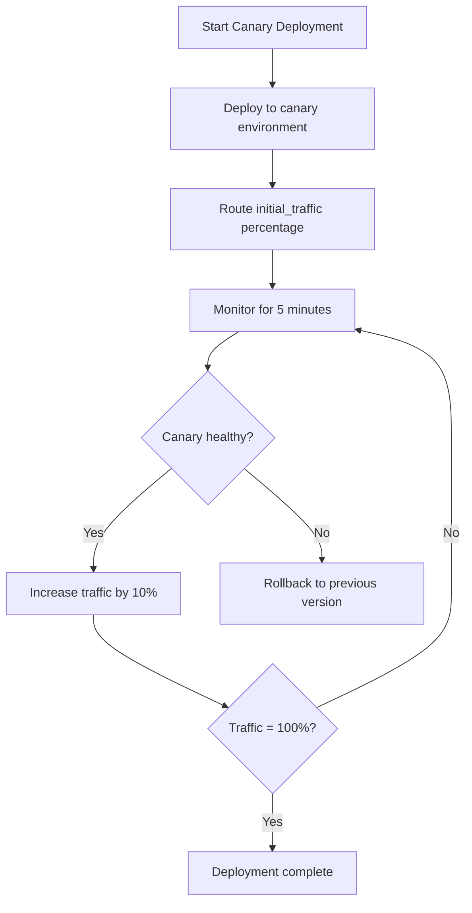

# Orchestrator Implementation

<cite>
**Referenced Files in This Document**   
- [orchestrator.py](file://mahoun/orchestrator/orchestrator.py)
- [demo_mvp.py](file://mahoun/orchestrator/demo_mvp.py)
- [state_machine.py](file://mahoun/orchestrator/state_machine.py)
- [runtime_profile.py](file://mahoun/orchestrator/runtime_profile.py)
- [bootstrap_verdict_dataloader.py](file://mahoun/orchestrator/bootstrap_verdict_dataloader.py)
- [ultra_orchestrator_complete.py](file://mahoun/self_improve/ultra_orchestrator_complete.py)
</cite>

## Table of Contents
1. [Introduction](#introduction)
2. [Core Architecture](#core-architecture)
3. [Task Management](#task-management)
4. [Health Monitoring and Circuit Breakers](#health-monitoring-and-circuit-breakers)
5. [Rate Limiting](#rate-limiting)
6. [Event-Driven Architecture](#event-driven-architecture)
7. [Deployment Strategies](#deployment-strategies)
8. [Component Registration and Task Management Examples](#component-registration-and-task-management-examples)
9. [Scalability Considerations](#scalability-considerations)
10. [Configuration Parameters](#configuration-parameters)

## Introduction
The UltraOrchestrator class in the Mahoun platform provides a comprehensive orchestration system for managing self-improvement components. It implements a distributed task scheduling system with priority queues, health monitoring, circuit breakers, rate limiting, and an event-driven architecture. The orchestrator manages the lifecycle of various components, ensuring reliable execution of tasks while providing mechanisms for fault tolerance and system stability. This documentation details the implementation of the UltraOrchestrator, focusing on its core features including distributed task scheduling, health monitoring, circuit breakers, rate limiting, event-driven architecture, and deployment strategies.

## Core Architecture
The UltraOrchestrator class serves as the central coordination point for all self-improvement components in the Mahoun platform. It implements a sophisticated architecture that combines multiple reliability patterns to ensure robust operation in production environments. The orchestrator manages task scheduling and execution, component health monitoring, circuit breakers, rate limiting, event-driven coordination, deployment strategies, feature flags, and metrics collection.



**Diagram sources**
- [orchestrator.py](file://mahoun/orchestrator/orchestrator.py#L310-L774)

**Section sources**
- [orchestrator.py](file://mahoun/orchestrator/orchestrator.py#L1-L837)

## Task Management
The UltraOrchestrator implements a sophisticated task management system that handles distributed task scheduling with priority queues. Tasks are submitted to the orchestrator with varying priority levels, which determine their execution order in the priority queue.

### Task Submission and Execution Workflow
The task management system follows a well-defined workflow for submitting, scheduling, and executing tasks. When a task is submitted via the `submit_task` method, it is wrapped in a `Task` object that includes metadata such as priority, creation time, and retry configuration. The task is then placed in the priority queue, where it will be processed by one of the available worker threads.



**Diagram sources**
- [orchestrator.py](file://mahoun/orchestrator/orchestrator.py#L394-L423)
- [orchestrator.py](file://mahoun/orchestrator/orchestrator.py#L496-L588)

**Section sources**
- [orchestrator.py](file://mahoun/orchestrator/orchestrator.py#L394-L588)

### Priority-Based Processing
The orchestrator supports five priority levels for task processing, allowing critical operations to be executed before lower-priority background tasks. The priority levels are defined in the `TaskPriority` enum:

- **CRITICAL (0)**: Highest priority for time-sensitive operations
- **HIGH (1)**: Important tasks that should be processed quickly
- **MEDIUM (2)**: Normal priority for standard operations
- **LOW (3)**: Lower priority tasks that can be delayed
- **BACKGROUND (4)**: Lowest priority for non-essential background processing

The priority queue ensures that tasks are processed in order of their priority, with higher-priority tasks being executed first. This is implemented through the `__lt__` method in the `Task` class, which compares tasks based on their priority value.

### Retry Mechanisms
The orchestrator implements a robust retry mechanism to handle transient failures. Each task has a configurable `max_retries` parameter (default: 3) that determines how many times a failed task will be automatically requeued. When a task fails, the orchestrator:

1. Increments the task's retry count
2. Requeues the task for another attempt
3. Logs the retry attempt
4. If the maximum retry count is exceeded, the task is marked as failed and a `task_failed` event is published

This retry mechanism helps improve system reliability by automatically recovering from temporary issues such as network glitches or momentary resource constraints.

## Health Monitoring and Circuit Breakers
The UltraOrchestrator includes comprehensive health monitoring capabilities and implements the circuit breaker pattern to prevent cascading failures in the system.

### Health Monitoring System
The orchestrator continuously monitors the health of registered components through its `_health_monitor` method, which runs as a background task. The health monitoring system tracks several key metrics for each component:

- **Heartbeat monitoring**: Components must update their last heartbeat timestamp regularly. If no heartbeat is received within 60 seconds, the component is marked as UNHEALTHY.
- **Error rate calculation**: The system tracks the ratio of failed to successful requests. If the error rate exceeds 10% over 100+ requests, the component is marked as DEGRADED.
- **Performance metrics**: Latency, success count, and error count are tracked for each component.



**Diagram sources**
- [orchestrator.py](file://mahoun/orchestrator/orchestrator.py#L590-L622)

**Section sources**
- [orchestrator.py](file://mahoun/orchestrator/orchestrator.py#L590-L622)

### Circuit Breaker Implementation
The orchestrator implements the circuit breaker pattern to prevent cascading failures when a component becomes unresponsive. The `CircuitBreaker` class manages the state of external dependencies and prevents requests from being sent to failing components.

The circuit breaker has three states:
- **Closed**: Normal operation, requests are allowed
- **Open**: Failure threshold exceeded, requests are blocked
- **Half-Open**: After timeout, allowing a test request to check if the component has recovered

When a component fails, the circuit breaker increments its failure count. Once the failure threshold (default: 5) is reached, the circuit breaker opens and rejects subsequent requests. After a recovery timeout (default: 60 seconds), the circuit breaker enters the half-open state and allows one request through. If this request succeeds, the circuit breaker closes; if it fails, the circuit breaker reopens.

## Rate Limiting
The orchestrator implements rate limiting using the token bucket algorithm to prevent components from being overwhelmed by too many requests. The `RateLimiter` class provides this functionality.

### Token Bucket Algorithm
The rate limiter uses a token bucket approach where tokens are added to the bucket at a fixed rate (tokens per second). Each request consumes one or more tokens from the bucket. If insufficient tokens are available, the request is either rejected or delayed.

Key parameters:
- **rate**: Tokens added per second (default: component-specific)
- **capacity**: Maximum tokens the bucket can hold (default: component-specific)
- **tokens**: Current number of tokens in the bucket



**Diagram sources**
- [orchestrator.py](file://mahoun/orchestrator/orchestrator.py#L179-L216)

**Section sources**
- [orchestrator.py](file://mahoun/orchestrator/orchestrator.py#L179-L216)

The rate limiter is applied at the component level, allowing different components to have different rate limits based on their capacity and importance. When a task is executed, the orchestrator checks if the corresponding component's rate limiter has sufficient tokens. If not, the task is requeued for later processing.

## Event-Driven Architecture
The UltraOrchestrator implements a pub/sub event-driven architecture using the `EventBus` class. This allows loose coupling between components and enables real-time monitoring and reaction to system events.

### Event Bus Implementation
The `EventBus` class provides a central hub for publishing and subscribing to events. It maintains a dictionary of subscribers for each event type and a history of recent events.

Key features:
- **Event publishing**: Any component can publish events with a type, source, data payload, and timestamp
- **Event subscription**: Components can subscribe to specific event types or use wildcard subscriptions
- **Event history**: Maintains a deque of the last 1,000 events for debugging and analysis



**Diagram sources**
- [orchestrator.py](file://mahoun/orchestrator/orchestrator.py#L223-L261)

**Section sources**
- [orchestrator.py](file://mahoun/orchestrator/orchestrator.py#L223-L261)

### Event Types
The orchestrator publishes various event types to notify subscribers of system state changes:

- **task_submitted**: When a task is submitted to the orchestrator
- **task_completed**: When a task completes successfully
- **task_failed**: When a task fails after all retry attempts
- **orchestrator_started**: When the orchestrator starts
- **orchestrator_stopped**: When the orchestrator stops
- **component_unhealthy**: When a component is detected as unhealthy
- **metrics_snapshot**: Periodic snapshot of system metrics
- **model_deployed**: When a model is deployed using a deployment strategy

These events enable external monitoring systems, logging components, and other subscribers to react to system changes in real-time.

## Deployment Strategies
The UltraOrchestrator supports multiple deployment strategies for safely rolling out new models and components. These strategies help minimize risk and allow for gradual validation of new versions.

### Supported Deployment Strategies
The orchestrator supports the following deployment strategies through the `DeploymentStrategy` enum:

- **IMMEDIATE**: Direct deployment (no gradual rollout)
- **CANARY**: Gradual rollout to a small percentage of traffic
- **BLUE_GREEN**: Switch between two identical environments
- **ROLLING**: Incremental replacement of instances
- **SHADOW**: Run new version in parallel without affecting users

### Canary Deployment
The canary deployment strategy gradually increases traffic to a new model version while monitoring its health. The process starts with a small percentage of traffic (default: 10%) and increases by 10% every 5 minutes if the canary is healthy.



**Diagram sources**
- [orchestrator.py](file://mahoun/orchestrator/orchestrator.py#L703-L733)

**Section sources**
- [orchestrator.py](file://mahoun/orchestrator/orchestrator.py#L703-L733)

### Blue-Green Deployment
The blue-green deployment strategy maintains two identical production environments. The orchestrator deploys the new version to the inactive environment (green) and then switches traffic from the current environment (blue) to the new one. This allows for instant rollback by switching back to the blue environment if issues are detected.

### Shadow Deployment
The shadow deployment strategy runs the new version in parallel with the current version, processing the same requests but not affecting user responses. This allows for testing the new version with real production traffic while maintaining system stability.

## Component Registration and Task Management Examples
The orchestrator provides practical examples of component registration and task management through its example usage code.

### Component Registration
Components are registered with the orchestrator using the `register_component` method, which allows configuration of circuit breakers and rate limiting:

```python
# Register components with the orchestrator
orchestrator.register_component(
    "rl_agent",
    None,
    circuit_breaker=True,
    rate_limit=(10.0, 100),  # 10 requests/sec, capacity 100
)

orchestrator.register_component(
    "active_learner",
    None,
    circuit_breaker=True,
)
```

### Task Management Example
The orchestrator demonstrates task submission and event handling:

```python
# Subscribe to task completion events
def on_task_completed(event: Event):
    print(f"   ✅ Task completed: {event.data['task_id']}")

orchestrator.event_bus.subscribe("task_completed", on_task_completed)

# Submit tasks with different priorities
def sample_task(x):
    time.sleep(0.1)
    return x * 2

for i in range(10):
    orchestrator.submit_task(
        f"rl_agent_task_{i}",
        sample_task,
        TaskPriority.HIGH,
        i,
    )
```

**Section sources**
- [orchestrator.py](file://mahoun/orchestrator/orchestrator.py#L780-L837)

## Scalability Considerations
The UltraOrchestrator is designed to handle concurrent workflows and scale with increasing workloads. Several architectural decisions support scalability:

### Concurrent Processing
The orchestrator uses asyncio and multiple worker threads to process tasks concurrently. The number of workers is configurable via the `max_workers` parameter in the constructor, allowing the system to be tuned based on available resources and workload characteristics.

### Queue Management
The priority queue ensures that high-priority tasks are processed first, even under heavy load. The queue is implemented using Python's `PriorityQueue`, which provides thread-safe operations for multiple producers and consumers.

### Resource Monitoring
The orchestrator collects metrics on queue size, running tasks, and component health, which can be used to make scaling decisions. The metrics collector publishes snapshots every 60 seconds, providing visibility into system performance.

## Configuration Parameters
The UltraOrchestrator can be configured through several parameters to optimize performance and reliability:

### Key Configuration Parameters
- **max_workers**: Number of concurrent worker threads (default: 10)
- **health_check_interval**: Frequency of health checks in seconds (default: 30.0)

These parameters can be adjusted based on the specific requirements of the deployment environment and workload characteristics.

**Section sources**
- [orchestrator.py](file://mahoun/orchestrator/orchestrator.py#L324-L363)