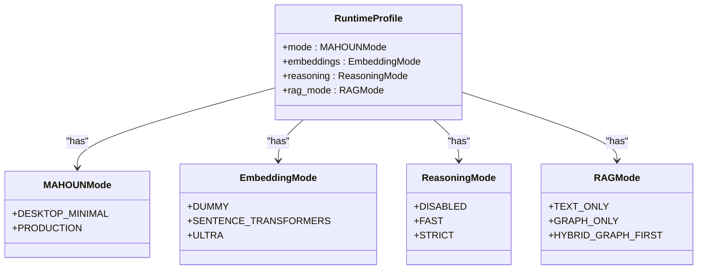
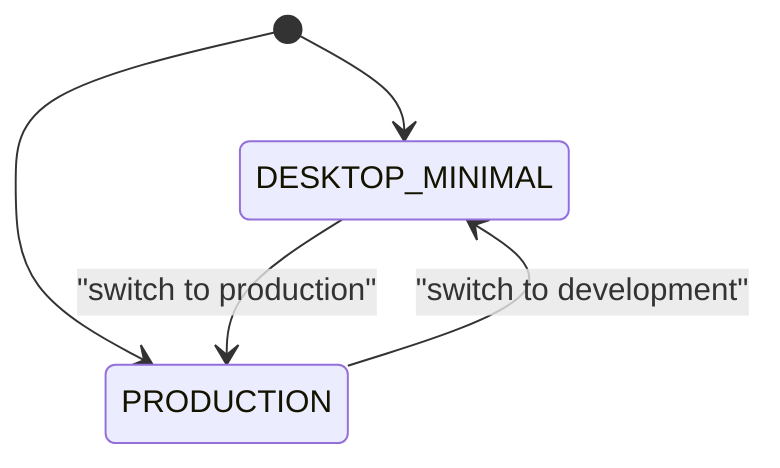
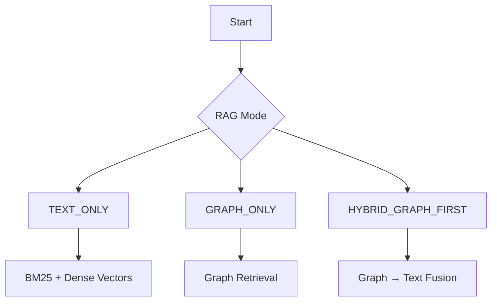

# Runtime Profiling

<cite>
**Referenced Files in This Document**   
- [runtime_profile.py](file://mahoun/orchestrator/runtime_profile.py)
- [demo_mvp.py](file://mahoun/orchestrator/demo_mvp.py)
- [hybrid_rag_service.py](file://mahoun/rag/hybrid_rag_service.py)
- [reasoning_chain.py](file://mahoun/reasoning/reasoning_chain.py)
- [runtime_config.py](file://mahoun/core/runtime_config.py)
- [config.py](file://mahoun/config.py)
</cite>

## Table of Contents
1. [Introduction](#introduction)
2. [RuntimeProfile Class and MAHOUN_PROFILE Instance](#runtimeprofile-class-and-mahoun_profile-instance)
3. [Operational Modes](#operational-modes)
4. [Configuration Aspects](#configuration-aspects)
5. [Usage and Interpretation](#usage-and-interpretation)
6. [Conclusion](#conclusion)

## Introduction
Runtime profiling in the MAHOUN system provides a descriptive, read-only view of the current operational state. This mechanism is designed for transparency, logging, and demonstration purposes rather than control flow decisions. The profile reflects the actual runtime environment and configuration, offering insights into the system's behavior under different modes and settings. This document details the `RuntimeProfile` class, the `MAHOUN_PROFILE` instance, and the various configuration aspects that influence system behavior.

**Section sources**
- [runtime_profile.py](file://mahoun/orchestrator/runtime_profile.py#L1-L65)

## RuntimeProfile Class and MAHOUN_PROFILE Instance
The `RuntimeProfile` class is a dataclass that encapsulates the current operational state of the MAHOUN system. It is designed to provide a descriptive, read-only view of the system's configuration and is not intended for controlling behavior. The class includes attributes for operational mode, embedding mode, reasoning mode, and RAG mode, each represented by an enumeration.

The `MAHOUN_PROFILE` instance is a global singleton of the `RuntimeProfile` class, initialized with default values that reflect the current demo behavior in a desktop_minimal environment. This instance serves as a central point for accessing the current runtime profile and is used for logging, transparency, and test validation.

**Diagram sources**
- [runtime_profile.py](file://mahoun/orchestrator/runtime_profile.py#L21-L64)

**Section sources**
- [runtime_profile.py](file://mahoun/orchestrator/runtime_profile.py#L48-L64)

## Operational Modes
The MAHOUN system supports two primary operational modes: `DESKTOP_MINIMAL` and `PRODUCTION`. These modes define the overall behavior and resource usage of the system, influencing which features are enabled and how they are configured.

### DESKTOP_MINIMAL Mode
The `DESKTOP_MINIMAL` mode is optimized for development and demonstration on desktop environments with limited resources. It prioritizes CPU-only operations and minimal resource usage. Key characteristics include:
- Graph operations are disabled by default.
- LoRA training is disabled.
- The LLM uses the OpenAI API by default or a lightweight local model.
- Lightweight embedding models are used.
- Optional components are disabled by default.

### PRODUCTION Mode
The `PRODUCTION` mode is designed for enterprise environments with full feature sets and local GPU acceleration. It enables all capabilities and is optimized for performance and reliability. Key characteristics include:
- Graph operations are enabled with a full local backend.
- LoRA training is enabled with local GPU.
- Local GPU-accelerated LLMs are used.
- Default embedding models are used.
- Optional components can be enabled via environment variables.

**Diagram sources**
- [runtime_config.py](file://mahoun/core/runtime_config.py#L179-L238)

**Section sources**
- [runtime_config.py](file://mahoun/core/runtime_config.py#L179-L238)

## Configuration Aspects
The `RuntimeProfile` class includes several configuration aspects that define the system's behavior in different operational contexts. These aspects include embedding modes, reasoning modes, and RAG modes.

### Embedding Modes
The embedding mode determines the backend used for generating embeddings. The available modes are:
- **DUMMY**: Uses random vectors for embeddings, suitable for demos and testing.
- **SENTENCE_TRANSFORMERS**: Uses the Sentence Transformers library for semantic search.
- **ULTRA**: Uses advanced models for high-quality embeddings.

### Reasoning Modes
The reasoning mode controls the level of verification and analysis performed by the reasoning chain. The available modes are:
- **DISABLED**: Skips reasoning and verification.
- **FAST**: Performs lightweight verification, suitable for desktop development.
- **STRICT**: Performs full verification, required for production and legal compliance.

### RAG Modes
The RAG mode defines the retrieval strategy used by the hybrid RAG service. The available modes are:
- **TEXT_ONLY**: Uses pure text retrieval with BM25 and dense vectors.
- **GRAPH_ONLY**: Uses pure graph retrieval when Neo4j is available.
- **HYBRID_GRAPH_FIRST**: Combines graph and text retrieval, prioritizing graph results.

**Diagram sources**
- [hybrid_rag_service.py](file://mahoun/rag/hybrid_rag_service.py#L29-L34)
- [reasoning_chain.py](file://mahoun/reasoning/reasoning_chain.py#L29-L34)

**Section sources**
- [hybrid_rag_service.py](file://mahoun/rag/hybrid_rag_service.py#L29-L34)
- [reasoning_chain.py](file://mahoun/reasoning/reasoning_chain.py#L29-L34)

## Usage and Interpretation
The `MAHOUN_PROFILE` instance is used to report the current operational state of the system. It is particularly useful for logging and transparency in demo outputs, test validation, and documentation. The profile should not be used for control flow decisions; instead, the `core.runtime_config` module should be used for that purpose.

When interpreting the profile for debugging and demonstration purposes, consider the following:
- The `mode` attribute indicates whether the system is running in `DESKTOP_MINIMAL` or `PRODUCTION` mode.
- The `embeddings` attribute shows the current embedding backend, which affects the quality of semantic search.
- The `reasoning` attribute indicates the level of verification being performed, which impacts the reliability of the results.
- The `rag_mode` attribute defines the retrieval strategy, influencing how results are combined from different sources.

For example, in a `DESKTOP_MINIMAL` environment, the profile might show `DUMMY` embeddings and `DISABLED` reasoning, indicating that the system is using random vectors and skipping verification. This is suitable for demos but not for production use.

**Section sources**
- [demo_mvp.py](file://mahoun/orchestrator/demo_mvp.py#L73-L78)

## Conclusion
The `RuntimeProfile` class and `MAHOUN_PROFILE` instance provide a comprehensive, read-only view of the MAHOUN system's operational state. By understanding the different operational modes and configuration aspects, developers and users can better interpret the system's behavior and ensure it is configured appropriately for their needs. The profile serves as a valuable tool for transparency, logging, and demonstration, but should not be used for control flow decisions.