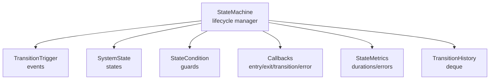
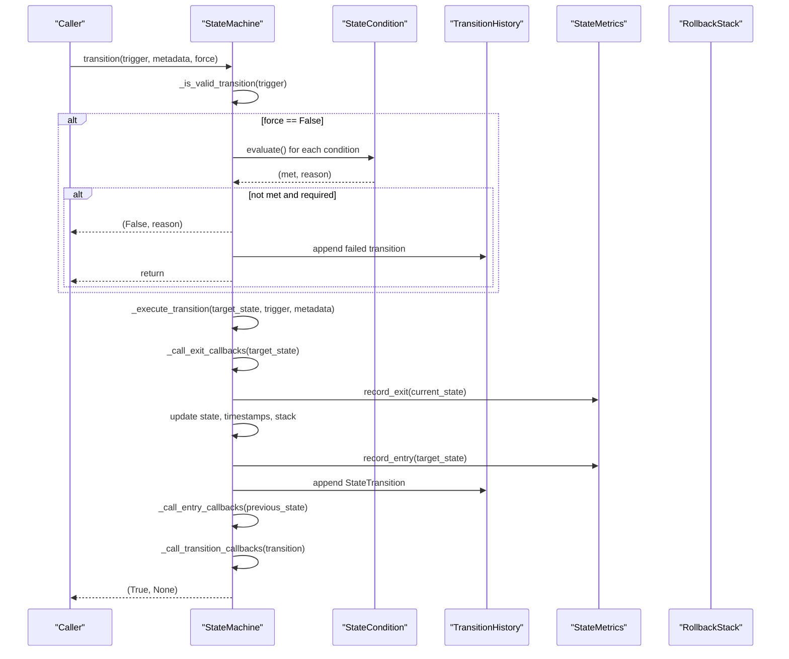
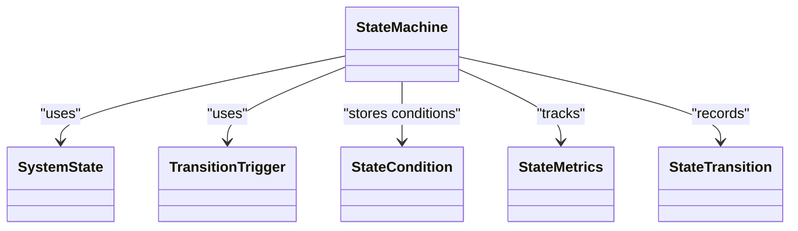

# State Machine Management

<cite>
**Referenced Files in This Document**
- [state_machine.py](file://mahoun/orchestrator/state_machine.py)
- [orchestrator.py](file://mahoun/orchestrator/orchestrator.py)
- [self_improvement_system_v2.py](file://mahoun/self_improve/self_improvement_system_v2.py)
</cite>

## Table of Contents
1. [Introduction](#introduction)
2. [Project Structure](#project-structure)
3. [Core Components](#core-components)
4. [Architecture Overview](#architecture-overview)
5. [Detailed Component Analysis](#detailed-component-analysis)
6. [Dependency Analysis](#dependency-analysis)
7. [Performance Considerations](#performance-considerations)
8. [Troubleshooting Guide](#troubleshooting-guide)
9. [Conclusion](#conclusion)

## Introduction
This document explains the State Machine Management subsystem with a focus on the StateMachine class that orchestrates the self-improvement lifecycle. It covers lifecycle states, transition triggers and guards, entry/exit callbacks, transition history, metrics collection, thread-safety, rollback capabilities, and practical examples for extending behavior.

## Project Structure
The StateMachine resides in the orchestrator module and is designed to be reusable across self-improvement workflows. It integrates with broader orchestration patterns and can be embedded into larger systems.

**Diagram sources**
- [state_machine.py](file://mahoun/orchestrator/state_machine.py#L35-L255)

**Section sources**
- [state_machine.py](file://mahoun/orchestrator/state_machine.py#L1-L209)

## Core Components
- SystemState: Defines the lifecycle states including IDLE, COLLECTING, LEARNING, VALIDATING, DEPLOYING, MONITORING, ROLLBACK, ERROR, and SHUTDOWN.
- TransitionTrigger: Enumerates triggers such as START, FEEDBACK_THRESHOLD, LEARNING_COMPLETE, VALIDATION_PASSED, VALIDATION_FAILED, DEPLOYMENT_COMPLETE, ANOMALY_DETECTED, MANUAL_ROLLBACK, ERROR_OCCURRED, RECOVERY_COMPLETE, STOP, PAUSE, RESUME.
- StateCondition: Encapsulates a guard condition with a name, evaluation function, description, and requirement flag.
- StateMetrics: Tracks per-state statistics including entry count, total/min/max duration, recent averages, and error counts.
- StateTransition: Captures a transition with from/to states, trigger, timestamp, duration in previous state, metadata, success flag, and error message.
- StateMachine: Central class managing transitions, guards, callbacks, metrics, history, and rollback.

Key responsibilities:
- Thread-safe state transitions guarded by conditions and triggers.
- Entry/exit callbacks around state changes.
- Rollback stack and manual rollback capability.
- Metrics and transition history for analysis and observability.
- Error handling with error callbacks and failed transition recording.

**Section sources**
- [state_machine.py](file://mahoun/orchestrator/state_machine.py#L35-L255)
- [state_machine.py](file://mahoun/orchestrator/state_machine.py#L79-L150)
- [state_machine.py](file://mahoun/orchestrator/state_machine.py#L152-L574)

## Architecture Overview
The StateMachine composes lifecycle states, triggers, conditions, callbacks, and metrics into a cohesive system. Transitions are validated against a transition table and optional conditions. On successful transitions, entry/exit callbacks fire, metrics update, and history records are appended. Errors are captured and routed to error callbacks.

**Diagram sources**
- [state_machine.py](file://mahoun/orchestrator/state_machine.py#L257-L410)
- [state_machine.py](file://mahoun/orchestrator/state_machine.py#L411-L477)

## Detailed Component Analysis

### StateMachine Class
The StateMachine class encapsulates the entire lifecycle management. It maintains:
- Current and previous state
- A thread-safe lock for atomic operations
- Transition history with configurable capacity
- Per-state metrics
- Transition conditions keyed by (state, trigger)
- Callback registries for state entry/exit, global transitions, and errors
- Rollback stack for recovery
- Statistics counters for transitions, failures, errors, and rollbacks

Lifecycle states and transitions:
- IDLE can start or stop.
- COLLECTING can move to LEARNING on threshold, ERROR on error, STOP to SHUTDOWN, or PAUSE to IDLE.
- LEARNING moves to VALIDATING on completion or ERROR on error; STOP to SHUTDOWN.
- VALIDATING moves to DEPLOYING on pass, back to COLLECTING on fail, ERROR on error; STOP to SHUTDOWN.
- DEPLOYING moves to MONITORING on success or ROLLBACK on error; STOP to SHUTDOWN.
- MONITORING can trigger ROLLBACK on anomaly or manual rollback, move back to LEARNING on feedback threshold, or STOP to SHUTDOWN.
- ROLLBACK recovers to COLLECTING or ERROR; STOP to SHUTDOWN.
- ERROR recovers to IDLE or STOP to SHUTDOWN.
- SHUTDOWN is terminal.

Guards and conditions:
- Conditions are registered per (state, trigger) and evaluated before transitions.
- Required conditions must pass; non-required conditions can still block if they fail.

Callbacks:
- State entry/exit callbacks receive the previous/new state.
- Global transition callbacks receive the full transition record.
- Error callbacks receive error messages and exceptions.

Metrics:
- Per-state entry/exit timing and duration tracking.
- Average and recent average durations.
- Error counts per state.
- Aggregate statistics including success rate and recent transitions.

Rollback:
- Maintains a bounded stack of states.
- Provides manual rollback to previous stable state using a dedicated trigger.

Examples of usage:
- Adding conditions to transitions: see [add_condition](file://mahoun/orchestrator/state_machine.py#L443-L461).
- Registering callbacks: see [register_state_entry_callback](file://mahoun/orchestrator/state_machine.py#L462-L469), [register_state_exit_callback](file://mahoun/orchestrator/state_machine.py#L466-L469), [register_transition_callback](file://mahoun/orchestrator/state_machine.py#L470-L477), [register_error_callback](file://mahoun/orchestrator/state_machine.py#L474-L477).
- Performing transitions: see [transition](file://mahoun/orchestrator/state_machine.py#L257-L294).
- Manual rollback: see [rollback_to_previous](file://mahoun/orchestrator/state_machine.py#L478-L489).

Thread-safety:
- Uses a recursive lock to serialize all public operations.
- All getters and setters are guarded by the lock.

Error handling:
- Exceptions during transitions are caught, logged, and recorded as failed transitions.
- Error callbacks are invoked for diagnostics.

**Section sources**
- [state_machine.py](file://mahoun/orchestrator/state_machine.py#L152-L574)

### State Lifecycle States
States represent stages of the self-improvement loop:
- IDLE: Initial state; awaiting start or shutdown.
- COLLECTING: Gathering data or feedback.
- LEARNING: Training or adapting models.
- VALIDATING: Evaluating performance or correctness.
- DEPLOYING: Releasing updates into production.
- MONITORING: Observing performance and detecting anomalies.
- ROLLBACK: Recovering from failures or anomalies.
- ERROR: Fault state; requires recovery.
- SHUTDOWN: Terminal state.

Operational vs terminal:
- Operational states are those actively performing work.
- Terminal states end the lifecycle.

**Section sources**
- [state_machine.py](file://mahoun/orchestrator/state_machine.py#L35-L60)

### Transition Triggers and Guards
Triggers define external events that can cause state changes. Guards (conditions) add logical checks before transitions occur. Guards are optional but can be required to enforce safety.

Common triggers:
- START, STOP, PAUSE, RESUME
- FEEDBACK_THRESHOLD, LEARNING_COMPLETE, VALIDATION_PASSED, VALIDATION_FAILED
- DEPLOYMENT_COMPLETE, ANOMALY_DETECTED, MANUAL_ROLLBACK, ERROR_OCCURRED, RECOVERY_COMPLETE

Adding conditions:
- Use [add_condition](file://mahoun/orchestrator/state_machine.py#L443-L461) to register a callable that returns a boolean and a reason string when it fails.

**Section sources**
- [state_machine.py](file://mahoun/orchestrator/state_machine.py#L62-L77)
- [state_machine.py](file://mahoun/orchestrator/state_machine.py#L92-L110)
- [state_machine.py](file://mahoun/orchestrator/state_machine.py#L443-L461)

### Entry/Exit Callbacks and Transition History
Callbacks:
- Register per-state entry/exit callbacks via [register_state_entry_callback](file://mahoun/orchestrator/state_machine.py#L462-L469) and [register_state_exit_callback](file://mahoun/orchestrator/state_machine.py#L466-L469).
- Register global transition callbacks via [register_transition_callback](file://mahoun/orchestrator/state_machine.py#L470-L477).
- Register error callbacks via [register_error_callback](file://mahoun/orchestrator/state_machine.py#L474-L477).

Transition history:
- Each successful or failed transition is recorded in a bounded deque via [get_transition_history](file://mahoun/orchestrator/state_machine.py#L507-L514).
- Accessors include recent transitions and aggregated statistics.

**Section sources**
- [state_machine.py](file://mahoun/orchestrator/state_machine.py#L411-L477)
- [state_machine.py](file://mahoun/orchestrator/state_machine.py#L507-L564)

### Metrics Collection and Analysis
Per-state metrics:
- Entry/exit timing and duration tracking via [StateMetrics.record_entry](file://mahoun/orchestrator/state_machine.py#L114-L137) and [StateMetrics.record_exit](file://mahoun/orchestrator/state_machine.py#L128-L137).
- Averages and recent averages via [get_avg_duration](file://mahoun/orchestrator/state_machine.py#L138-L143) and [get_recent_avg_duration](file://mahoun/orchestrator/state_machine.py#L144-L149).

Aggregate statistics:
- Total transitions, failed transitions, error count, rollback count, and success rate via [get_statistics](file://mahoun/orchestrator/state_machine.py#L540-L564).

**Section sources**
- [state_machine.py](file://mahoun/orchestrator/state_machine.py#L111-L150)
- [state_machine.py](file://mahoun/orchestrator/state_machine.py#L540-L564)

### Thread-Safety Mechanisms
- All public methods acquire the recursive lock before proceeding.
- Read-only getters also acquire the lock to ensure consistent snapshots.
- Rollback stack and history are protected by the same lock.

**Section sources**
- [state_machine.py](file://mahoun/orchestrator/state_machine.py#L172-L175)
- [state_machine.py](file://mahoun/orchestrator/state_machine.py#L490-L501)

### Rollback Capabilities
- Automatic rollback occurs from DEPLOYING to ROLLBACK on error and from MONITORING to ROLLBACK on anomaly.
- Manual rollback is supported via [rollback_to_previous](file://mahoun/orchestrator/state_machine.py#L478-L489), which triggers a manual rollback to the previous stable state.

**Section sources**
- [state_machine.py](file://mahoun/orchestrator/state_machine.py#L234-L249)
- [state_machine.py](file://mahoun/orchestrator/state_machine.py#L240-L244)
- [state_machine.py](file://mahoun/orchestrator/state_machine.py#L478-L489)

### Practical Examples
- Adding a condition to require sufficient data before moving from COLLECTING to LEARNING:
  - Use [add_condition](file://mahoun/orchestrator/state_machine.py#L443-L461) with state COLLECTING and trigger FEEDBACK_THRESHOLD.
- Registering a callback to log state entry:
  - Use [register_state_entry_callback](file://mahoun/orchestrator/state_machine.py#L462-L469) with the desired state and a callable receiving previous and current state.
- Triggering a manual rollback:
  - Use [rollback_to_previous](file://mahoun/orchestrator/state_machine.py#L478-L489) to revert to the prior stable state.

**Section sources**
- [state_machine.py](file://mahoun/orchestrator/state_machine.py#L443-L489)

## Dependency Analysis
The StateMachine depends on:
- SystemState and TransitionTrigger enums for state and trigger definitions.
- StateCondition for guard evaluation.
- StateMetrics for per-state statistics.
- TransitionHistory for storing transition records.
- Callback registries for lifecycle hooks.
- Rollback stack for recovery.

**Diagram sources**
- [state_machine.py](file://mahoun/orchestrator/state_machine.py#L35-L150)
- [state_machine.py](file://mahoun/orchestrator/state_machine.py#L152-L209)

**Section sources**
- [state_machine.py](file://mahoun/orchestrator/state_machine.py#L35-L209)

## Performance Considerations
- Transition table lookups are O(1) per trigger.
- Condition evaluation cost scales with the number of registered conditions per transition.
- Metrics updates are O(1) per transition.
- History and metrics are bounded by configured capacities.
- Rollback stack is bounded to prevent unbounded growth.

[No sources needed since this section provides general guidance]

## Troubleshooting Guide
Common issues and resolutions:
- Invalid transition: Occurs when the trigger is not valid for the current state. Check the transition table and ensure the trigger is appropriate for the current state.
- Transition conditions not met: Review registered conditions for the (state, trigger) pair and fix the underlying predicate.
- Transition execution errors: Inspect error callbacks and logs; examine the failed transition record in history.
- Rollback not triggered: Verify that the trigger is appropriate and that the rollback stack contains a previous state.

Diagnostic utilities:
- Use [get_statistics](file://mahoun/orchestrator/state_machine.py#L540-L564) to inspect success rate, error counts, and recent transitions.
- Use [get_transition_history](file://mahoun/orchestrator/state_machine.py#L507-L514) to retrieve recent transitions for analysis.
- Use [get_state_metrics](file://mahoun/orchestrator/state_machine.py#L515-L539) to inspect per-state durations and error counts.

**Section sources**
- [state_machine.py](file://mahoun/orchestrator/state_machine.py#L507-L564)

## Conclusion
The StateMachine provides a robust, thread-safe foundation for managing the self-improvement lifecycle. It supports explicit guards, comprehensive callbacks, rich metrics, and reliable rollback mechanisms. By leveraging conditions and callbacks, teams can tailor state transitions to their domain requirements while maintaining observability and resilience.