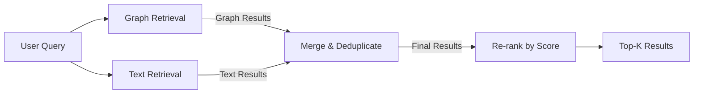
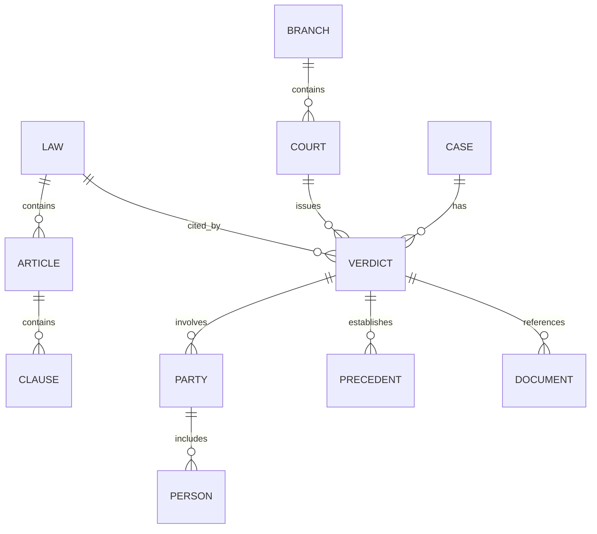
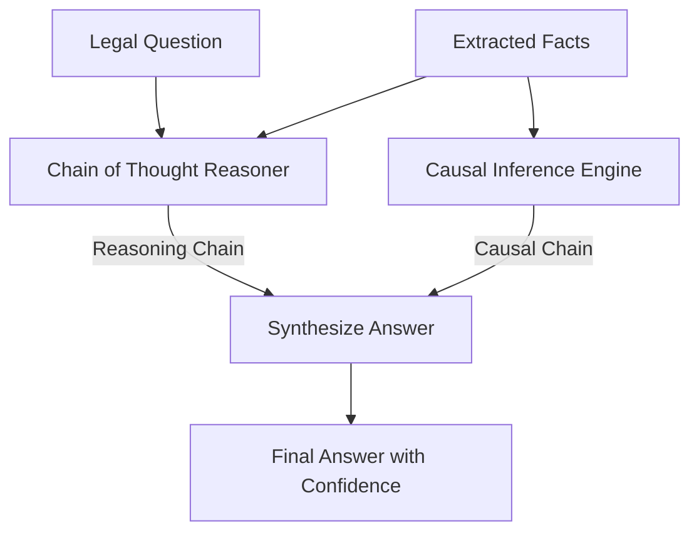

# Core AI System

<cite>
**Referenced Files in This Document**   
- [demo_mvp.py](file://mahoun/orchestrator/demo_mvp.py)
- [test_e2e_mahoun.py](file://tests/test_e2e_mahoun.py)
- [doc_parser_agent.py](file://mahoun/agents/doc_parser_agent.py)
- [contract_agent.py](file://mahoun/agents/contract_agent.py)
- [delay_agent.py](file://mahoun/agents/delay_agent.py)
- [dispute_agent.py](file://mahoun/agents/dispute_agent.py)
- [orchestrator.py](file://mahoun/agents/orchestrator.py)
- [hybrid_rag_service.py](file://mahoun/rag/hybrid_rag_service.py)
- [ultra_graph_rag.py](file://mahoun/rag/ultra_graph_rag.py)
- [schema.py](file://mahoun/graph/neo4j/schema.py)
- [reasoning_engine.py](file://mahoun/reasoning/reasoning_engine.py)
- [causal_inference.py](file://mahoun/reasoning/causal_inference.py)
- [knowledge_graph.py](file://mahoun/reasoning/knowledge_graph.py)
</cite>

## Table of Contents
1. [Introduction](#introduction)
2. [Agent-Based Architecture](#agent-based-architecture)
3. [Orchestrator and Agent Coordination](#orchestrator-and-agent-coordination)
4. [Retrieval-Augmented Generation (RAG)](#retrieval-augmented-generation-rag)
5. [Knowledge Graph Implementation](#knowledge-graph-implementation)
6. [Reasoning Engine and Causal Inference](#reasoning-engine-and-causal-inference)
7. [Practical Examples and Testing](#practical-examples-and-testing)
8. [Common Issues and Solutions](#common-issues-and-solutions)
9. [Performance Considerations](#performance-considerations)
10. [Conclusion](#conclusion)

## Introduction
The Core AI System is an advanced, agent-based artificial intelligence platform designed for complex legal and contractual analysis. It leverages a sophisticated architecture of specialized agents, orchestrated through a central workflow engine, to perform deep reasoning, document analysis, and dispute resolution. The system integrates retrieval-augmented generation (RAG) with a hybrid search strategy combining BM25, dense vector embeddings, and graph traversal, all built upon a Neo4j knowledge graph. This document provides a comprehensive overview of the system's architecture, detailing the roles of its key agents, the implementation of its reasoning engine, and its practical applications.

## Agent-Based Architecture

The Core AI System is built on a modular agent-based architecture, where each agent is a specialized component responsible for a specific analytical task. This design promotes scalability, maintainability, and clear separation of concerns. The primary agents include the Document Parser Agent, Contract Agent, Delay Agent, and Dispute Agent, each inheriting from a common base class to ensure consistent interfaces and lifecycle management.

### Document Parser Agent
The Document Parser Agent is responsible for ingesting and processing legal documents. It performs text extraction from various formats (PDF, DOCX, TXT, images), applies Persian text normalization, and uses a LegalNEREngine to extract named entities such as parties, dates, and clauses. It then structures the document content, creates intelligent chunks using an EnhancedChunker, and stores the processed data in both a vector database (ChromaDB) for semantic search and a PostgreSQL database (LegalStorageService) for structured querying. The agent is designed with robust error handling, including a fallback mode that uses basic text splitting if advanced components are unavailable.

**Section sources**
- [doc_parser_agent.py](file://mahoun/agents/doc_parser_agent.py#L1-L566)

### Contract Agent
The Contract Agent is the primary interface for answering questions about contracts. It employs a multi-step reasoning process that begins with a hybrid RAG retrieval to gather relevant context. The agent then uses a Chain-of-Thought (CoT) reasoning strategy, which breaks down the query into a series of logical steps, each documented with a thought, action, and observation. The final answer is verified using a Natural Language Inference (NLI) verifier to ensure it is supported by the retrieved evidence. The agent can classify contract clauses into a comprehensive taxonomy of over 40 types (e.g., payment, delivery, liability) and assess their risk level (critical, high, medium, low) based on predefined risk indicators.

**Section sources**
- [contract_agent.py](file://mahoun/agents/contract_agent.py#L1-L1685)

### Delay Agent
The Delay Agent specializes in the analysis of project delays. It integrates with the TimelineAgent to extract a chronological sequence of events from project documentation. It then identifies potential delays by searching for keywords like "تأخیر" (delay) or "مهلت" (deadline) and calculates the duration of each delay. The agent performs a basic analysis to determine the total delay days, identify the critical path, and attribute responsibility to parties such as the employer, contractor, or consultant. This agent serves as a foundational component for more advanced forensic schedule analysis.

**Section sources**
- [delay_agent.py](file://mahoun/agents/delay_agent.py#L1-L220)

### Dispute Agent
The Dispute Agent is designed to detect and analyze legal disputes and contract violations. It uses a multi-query strategy to search for evidence of disputes, violations, and legal citations. The agent classifies disputes into types such as financial, temporal, quality, or contractual, and assigns a severity level (critical, high, medium, low) based on the strength of the evidence and the presence of critical keywords. It performs a risk assessment by combining the number and severity of disputes with the number of identified violations, providing a comprehensive risk score and actionable recommendations for mitigation.

**Section sources**
- [dispute_agent.py](file://mahoun/agents/dispute_agent.py#L1-L429)

## Orchestrator and Agent Coordination

The UltraOrchestrator is the central nervous system of the Core AI System, responsible for managing the execution of complex workflows composed of multiple agents. It uses a Directed Acyclic Graph (DAG) to define the workflow, where each node represents an agent execution step and the edges represent dependencies between them. This allows for parallel execution of independent tasks, significantly improving processing efficiency.

```mermaid
flowchart TD
subgraph "Workflow DAG"
Parse[Parse\n(doc_parser)]
Analyze[Analyze\n(contract_agent)]
Report[Report\n(narrative_agent)]
Delay[Delay Analysis\n(delay_agent)]
Dispute[Dispute Detection\n(dispute_agent)]
end
Parse --> Analyze
Analyze --> Report
Parse --> Delay
Parse --> Dispute
Delay --> Report
Dispute --> Report
```

**Diagram sources**
- [orchestrator.py](file://mahoun/agents/orchestrator.py#L1-L985)

The orchestrator provides advanced features such as checkpointing and resuming, which allows long-running workflows to be paused and restarted from the last completed step. It also includes a real-time progress tracking system and an Integrity Guard that uses a Critic Agent to validate the outputs of other agents, flagging potential hallucinations if the faithfulness score falls below a threshold. Agents are registered with the orchestrator by name, and the orchestrator handles their initialization, execution, and error recovery, ensuring a robust and reliable workflow.

**Section sources**
- [orchestrator.py](file://mahoun/agents/orchestrator.py#L1-L985)

## Retrieval-Augmented Generation (RAG)

The Core AI System implements a sophisticated hybrid RAG system that combines multiple retrieval strategies to maximize the relevance and comprehensiveness of the results. The system supports three operational modes: `text_only` (using BM25 and dense vectors), `graph_only` (using Neo4j queries), and `hybrid_graph_first` (a fusion of both).

### Hybrid Search Implementation
The hybrid search strategy is implemented in the `HybridRAGService`. In `hybrid_graph_first` mode, the system first queries the Neo4j knowledge graph to find nodes that are semantically or structurally related to the query. It then performs a text-based search using the `UltraHybridSearch` component, which combines sparse retrieval (BM25) and dense retrieval (vector similarity) and fuses the results using a method like Reciprocal Rank Fusion (RRF). The results from both sources are merged, deduplicated, and re-ranked to produce a final list of the top-k most relevant documents.



**Diagram sources**
- [hybrid_rag_service.py](file://mahoun/rag/hybrid_rag_service.py#L1-L452)
- [ultra_graph_rag.py](file://mahoun/rag/ultra_graph_rag.py#L1-L644)

The system is designed for graceful degradation; if the graph database is unavailable, it automatically falls back to `text_only` mode. The `create_hybrid_rag_service` helper function ensures that all necessary components (vector store, hybrid search, graph retriever) are properly initialized, making the RAG system easy to integrate into any agent.

**Section sources**
- [hybrid_rag_service.py](file://mahoun/rag/hybrid_rag_service.py#L1-L452)

## Knowledge Graph Implementation

The knowledge graph is a cornerstone of the system's reasoning capabilities, implemented using Neo4j. It stores legal knowledge in the form of nodes (e.g., Law, Article, Verdict, Clause) and relationships (e.g., `CITES`, `AMENDS`, `APPLIES_TO`). This graph structure allows for complex traversals and pattern matching that are impossible with traditional keyword search.

### Schema Design
The schema is meticulously designed with constraints and indexes to ensure data integrity and query performance. For each of the 10 core node types (e.g., Law, Article, Verdict), a unique constraint is created on the `id` property. A comprehensive set of indexes is also created, including B-tree indexes for exact matches on properties like `case_number` and `date`, full-text indexes for searching the `content` of laws and verdicts, and vector indexes for performing similarity searches on embedded text.



**Diagram sources**
- [schema.py](file://mahoun/graph/neo4j/schema.py#L1-L441)

The `SchemaManager` class is responsible for initializing the database with these constraints and indexes. It provides methods to create, drop, and validate the schema, ensuring that the database is always in a consistent state. The full-text indexes are particularly important for the RAG system, as they enable fast and accurate retrieval of relevant text passages.

**Section sources**
- [schema.py](file://mahoun/graph/neo4j/schema.py#L1-L441)

## Reasoning Engine and Causal Inference

The reasoning engine is the intellectual core of the system, combining multiple advanced techniques to perform deep, explainable legal reasoning. The `DeepLegalReasoningEngine` integrates a Chain-of-Thought reasoner, a causal inference engine, and a legal knowledge graph to produce comprehensive and transparent analyses.

### Chain of Thought and Causal Inference
The reasoning process follows a six-step Chain-of-Thought (CoT) pattern: analyzing the question, extracting legal concepts, finding applicable rules, identifying precedents, applying logical reasoning, and generating a conclusion. This CoT process is augmented with causal inference, which uses a `StructuralCausalModel` to identify cause-and-effect relationships between facts. For example, given the facts "contract breach" and "financial loss," the causal engine can infer that the breach caused the loss with a certain strength.



**Diagram sources**
- [reasoning_engine.py](file://mahoun/reasoning/reasoning_engine.py#L1-L391)
- [causal_inference.py](file://mahoun/reasoning/causal_inference.py#L1-L279)

The final answer is synthesized by combining the output of the CoT reasoner and the causal engine. The confidence score is calculated as the average of the two components' confidence levels. The system also provides a detailed explanation of its reasoning, listing each step of the CoT process and the identified causal relationships, which enhances transparency and trust.

**Section sources**
- [reasoning_engine.py](file://mahoun/reasoning/reasoning_engine.py#L1-L391)

## Practical Examples and Testing

The functionality of the Core AI System is demonstrated through practical examples in the `demo_mvp.py` script and validated by end-to-end tests in `test_e2e_mahoun.py`.

### Demo MVP Pipeline
The `demo_mvp.py` script provides a complete pipeline that simulates a real-world use case. It begins by ingesting a document, then performs a hybrid RAG retrieval to find relevant information, generates a simple extractive answer, and finally runs a comprehensive reasoning chain that includes NLI verification, citation auditing, and uncertainty estimation. The script outputs a detailed report of the entire process, including processing times and confidence scores, making it an excellent tool for understanding the system's workflow.

**Section sources**
- [demo_mvp.py](file://mahoun/orchestrator/demo_mvp.py#L1-L542)

### End-to-End Testing
The `test_e2e_mahoun.py` test suite validates the integration of all system components. It tests the complete flow from document ingestion to answer generation, ensuring that the agents, orchestrator, RAG system, and reasoning engine work together seamlessly. These tests are critical for maintaining system reliability and catching regressions after code changes.

**Section sources**
- [test_e2e_mahoun.py](file://tests/test_e2e_mahoun.py)

## Common Issues and Solutions

The system is designed to handle common issues in agent coordination and reasoning accuracy through robust design patterns and specialized components.

### Agent Coordination Issues
A primary challenge is managing dependencies and ensuring graceful degradation when an agent fails. The UltraOrchestrator addresses this by allowing agents to be marked as non-required; if such an agent fails, the workflow continues. The system also uses a circuit breaker pattern to prevent cascading failures. For example, if the NLI verifier is unavailable, the Contract Agent can still return an answer, albeit without a verification flag.

### Reasoning Accuracy Issues
Hallucinations and low-confidence answers are mitigated by the Integrity Guard. This feature uses a Critic Agent to perform red-teaming on the output of other agents. If the faithfulness score of an answer is below a threshold (e.g., 0.7), the system issues a warning, alerting the user to potential inaccuracies. This self-auditing capability is a key factor in ensuring the reliability of the system's outputs.

**Section sources**
- [orchestrator.py](file://mahoun/agents/orchestrator.py#L1-L985)
- [contract_agent.py](file://mahoun/agents/contract_agent.py#L1-L1685)

## Performance Considerations

The Core AI System is optimized for performance in complex reasoning tasks, but certain operations are computationally intensive.

### Resource-Intensive Operations
The most demanding operations are the hybrid RAG retrieval and the deep reasoning process. The hybrid search, which involves both graph queries and vector similarity searches, can be slow if the databases are large. The reasoning engine, particularly the causal inference and quantum-inspired scoring (in `UltraGraphRAG`), requires significant computational resources. To manage this, the system implements a `Desktop-Minimal` mode that disables heavy graph components when running on less powerful hardware.

### Optimization Strategies
Key optimization strategies include the use of efficient data structures, caching of intermediate results, and parallel execution of independent tasks by the orchestrator. The system also uses a shared vector store and embedding service across different phases of a workflow to avoid redundant computations. For production deployments, it is recommended to use a high-performance vector database and a dedicated Neo4j instance to ensure low-latency responses.

**Section sources**
- [ultra_graph_rag.py](file://mahoun/rag/ultra_graph_rag.py#L1-L644)
- [demo_mvp.py](file://mahoun/orchestrator/demo_mvp.py#L1-L542)

## Conclusion
The Core AI System represents a state-of-the-art approach to automated legal and contractual analysis. Its agent-based architecture, powered by a sophisticated orchestrator, enables the creation of complex, multi-step workflows. The integration of a hybrid RAG system with a Neo4j knowledge graph provides unparalleled retrieval capabilities, while the deep reasoning engine, combining Chain-of-Thought and causal inference, produces transparent and reliable analyses. The system's design for graceful degradation, self-auditing, and performance optimization makes it a robust and practical solution for real-world applications. Future work will focus on enhancing the causal inference engine and expanding the self-improving feedback loop to further increase the system's accuracy and adaptability.