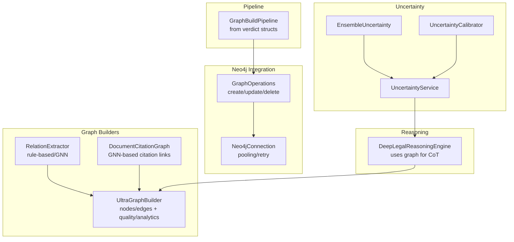
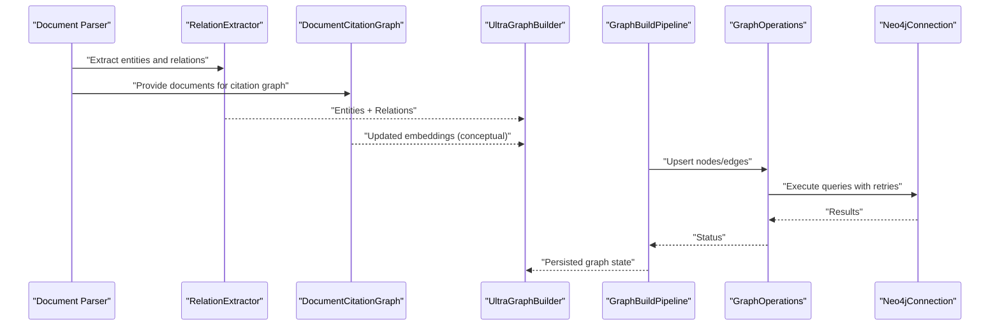
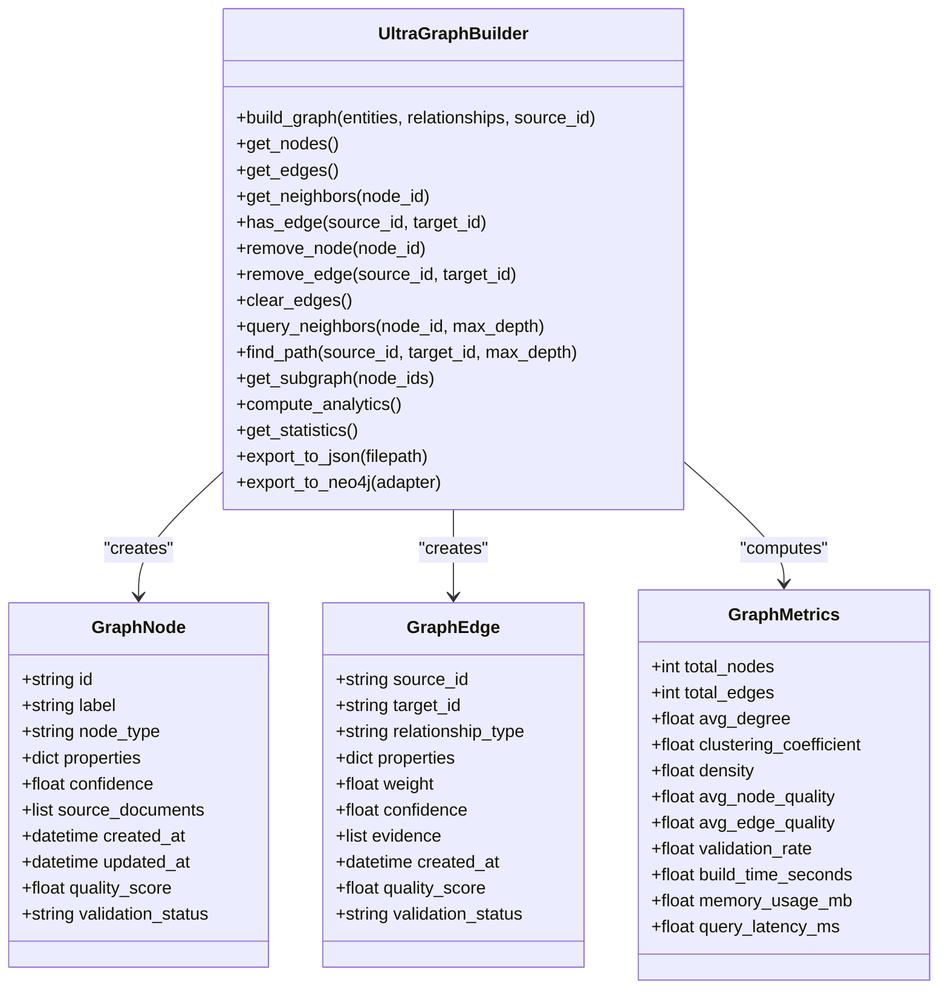
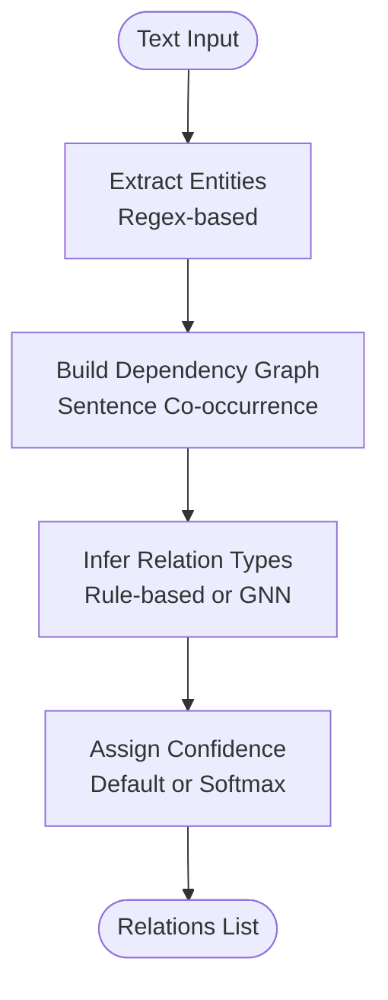
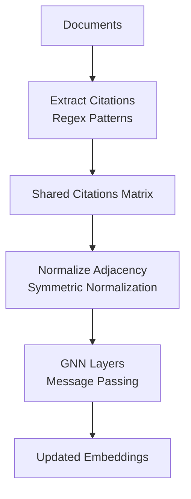
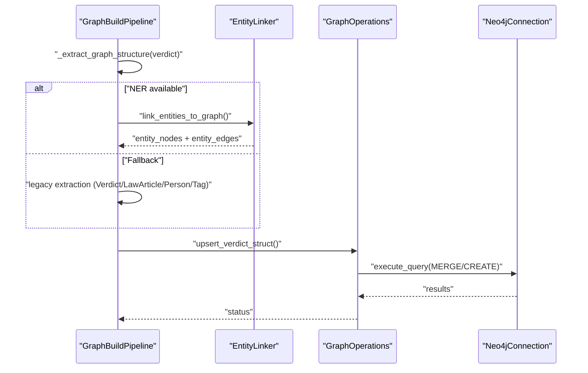
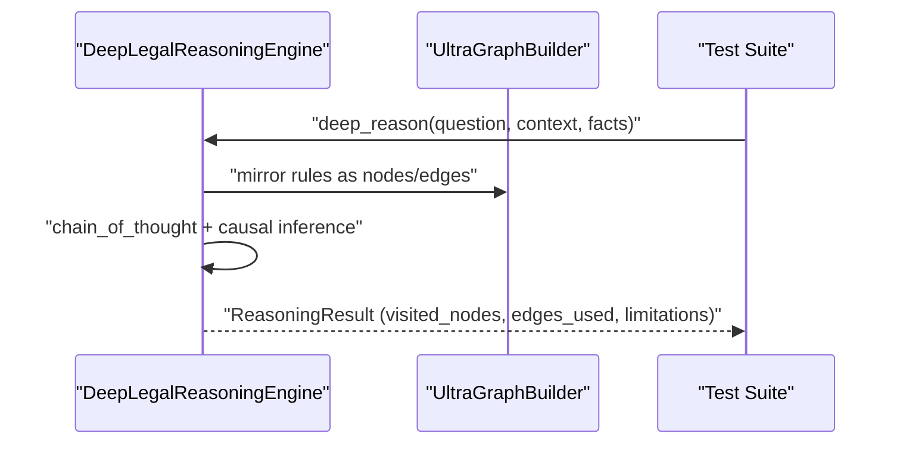
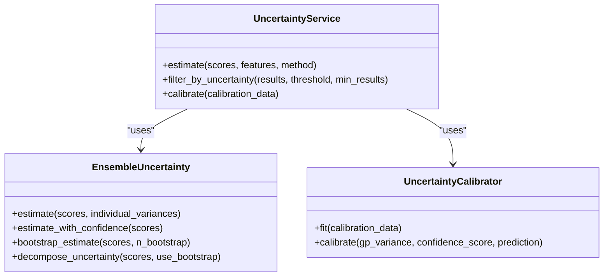
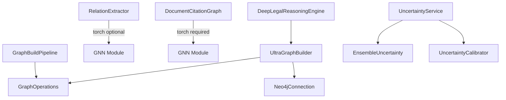
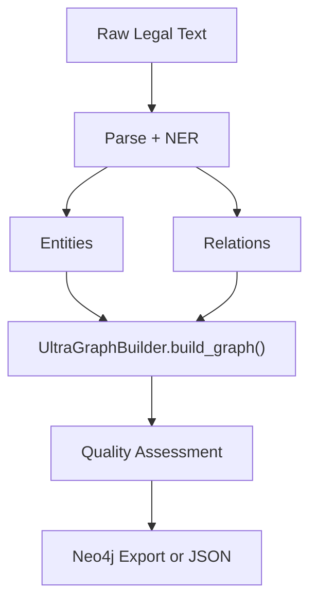

# Graph Building Pipeline

<cite>
**Referenced Files in This Document**
- [ultra_graph_builder.py](file://mahoun/graph/ultra_graph_builder.py)
- [relation_extractor.py](file://mahoun/graph/relation_extractor.py)
- [document_citation_graph.py](file://mahoun/graph/document_citation_graph.py)
- [test_graph_native_extreme_hard.py](file://tests/test_graph_native_extreme_hard.py)
- [run_import.py](file://mahoun/pipelines/graph_build/run_import.py)
- [operations.py](file://mahoun/graph/neo4j/operations.py)
- [connection.py](file://mahoun/graph/neo4j/connection.py)
- [reasoning_engine.py](file://mahoun/reasoning/reasoning_engine.py)
- [service.py](file://mahoun/uncertainty/service.py)
- [ensemble.py](file://mahoun/uncertainty/ensemble.py)
- [calibration.py](file://mahoun/uncertainty/calibration.py)
</cite>

## Table of Contents
1. [Introduction](#introduction)
2. [Project Structure](#project-structure)
3. [Core Components](#core-components)
4. [Architecture Overview](#architecture-overview)
5. [Detailed Component Analysis](#detailed-component-analysis)
6. [Dependency Analysis](#dependency-analysis)
7. [Performance Considerations](#performance-considerations)
8. [Troubleshooting Guide](#troubleshooting-guide)
9. [Conclusion](#conclusion)
10. [Appendices](#appendices)

## Introduction
This document explains the end-to-end graph building pipeline that transforms legal documents into structured knowledge graphs. It focuses on:
- Ultra-advanced graph construction from entities and relationships
- Semantic relation extraction between legal concepts
- Multi-document citation graph construction
- Data flow from raw text to structured nodes and edges
- Real-world validation via extreme-hard graph-native tests
- Entity disambiguation and relationship confidence scoring using uncertainty quantification
- Scalability and memory optimization strategies

## Project Structure
The graph building pipeline spans several modules:
- Graph builders and analyzers
- Relation extraction engines
- Document citation graph
- Neo4j integration for persistence
- Reasoning engine integration
- Uncertainty quantification for confidence scoring

**Diagram sources**
- [ultra_graph_builder.py](file://mahoun/graph/ultra_graph_builder.py#L316-L780)
- [relation_extractor.py](file://mahoun/graph/relation_extractor.py#L1-L347)
- [document_citation_graph.py](file://mahoun/graph/document_citation_graph.py#L1-L218)
- [run_import.py](file://mahoun/pipelines/graph_build/run_import.py#L1-L468)
- [operations.py](file://mahoun/graph/neo4j/operations.py#L1-L800)
- [connection.py](file://mahoun/graph/neo4j/connection.py#L1-L476)
- [reasoning_engine.py](file://mahoun/reasoning/reasoning_engine.py#L1-L391)
- [service.py](file://mahoun/uncertainty/service.py#L1-L397)
- [ensemble.py](file://mahoun/uncertainty/ensemble.py#L1-L259)
- [calibration.py](file://mahoun/uncertainty/calibration.py#L1-L424)

**Section sources**
- [ultra_graph_builder.py](file://mahoun/graph/ultra_graph_builder.py#L1-L842)
- [relation_extractor.py](file://mahoun/graph/relation_extractor.py#L1-L347)
- [document_citation_graph.py](file://mahoun/graph/document_citation_graph.py#L1-L218)
- [run_import.py](file://mahoun/pipelines/graph_build/run_import.py#L1-L468)
- [operations.py](file://mahoun/graph/neo4j/operations.py#L1-L928)
- [connection.py](file://mahoun/graph/neo4j/connection.py#L1-L476)
- [reasoning_engine.py](file://mahoun/reasoning/reasoning_engine.py#L1-L391)
- [service.py](file://mahoun/uncertainty/service.py#L1-L397)
- [ensemble.py](file://mahoun/uncertainty/ensemble.py#L1-L259)
- [calibration.py](file://mahoun/uncertainty/calibration.py#L1-L424)

## Core Components
- UltraGraphBuilder: constructs nodes and edges from structured inputs, computes quality metrics, and exposes traversal helpers. It supports Neo4j export and JSON export for batch processing.
- RelationExtractor: extracts semantic relationships between legal entities using rule-based extraction (fallback) or GNN-based classification (when torch is available).
- DocumentCitationGraph: builds a citation graph among documents using shared legal citations and applies GNN message passing to update document embeddings.
- GraphBuildPipeline: transforms parsed verdict structures into graph-ready nodes and edges, submitting to Neo4j or writing batch JSON files.
- Neo4j integration: GraphOperations and Neo4jConnection provide safe, pooled, and retried operations for node/relationship creation and updates.
- Reasoning integration: DeepLegalReasoningEngine mirrors legal rules into the graph and uses it for chain-of-thought reasoning.
- Uncertainty quantification: UncertaintyService combines ensemble and calibration approaches to produce epistemic/aleatoric/total uncertainty and confidence thresholds.

**Section sources**
- [ultra_graph_builder.py](file://mahoun/graph/ultra_graph_builder.py#L316-L780)
- [relation_extractor.py](file://mahoun/graph/relation_extractor.py#L1-L347)
- [document_citation_graph.py](file://mahoun/graph/document_citation_graph.py#L1-L218)
- [run_import.py](file://mahoun/pipelines/graph_build/run_import.py#L1-L468)
- [operations.py](file://mahoun/graph/neo4j/operations.py#L1-L800)
- [connection.py](file://mahoun/graph/neo4j/connection.py#L1-L476)
- [reasoning_engine.py](file://mahoun/reasoning/reasoning_engine.py#L1-L391)
- [service.py](file://mahoun/uncertainty/service.py#L1-L397)
- [ensemble.py](file://mahoun/uncertainty/ensemble.py#L1-L259)
- [calibration.py](file://mahoun/uncertainty/calibration.py#L1-L424)

## Architecture Overview
The pipeline converts raw legal documents into a knowledge graph with:
- Entities extracted from text (or pre-normalized structures)
- Relations inferred between entities
- Document-level citation links computed across multiple documents
- Graph stored in Neo4j or exported as JSON for later ingestion

**Diagram sources**
- [relation_extractor.py](file://mahoun/graph/relation_extractor.py#L1-L347)
- [document_citation_graph.py](file://mahoun/graph/document_citation_graph.py#L1-L218)
- [ultra_graph_builder.py](file://mahoun/graph/ultra_graph_builder.py#L316-L780)
- [run_import.py](file://mahoun/pipelines/graph_build/run_import.py#L1-L468)
- [operations.py](file://mahoun/graph/neo4j/operations.py#L1-L800)
- [connection.py](file://mahoun/graph/neo4j/connection.py#L1-L476)

## Detailed Component Analysis

### UltraGraphBuilder: End-to-end Graph Construction
- Inputs: lists of entities and relationships, each carrying labels, types, properties, confidence, and optional evidence/source documents.
- Processing:
  - Processes entities into nodes, updating existing nodes with new source documents.
  - Processes relationships into edges with weights and confidence.
  - Optional quality assessment computes node/edge quality scores and validation status.
  - Builds indexes for fast neighbor and edge existence checks.
- Outputs: nodes, edges, metrics, and optional analytics (centrality, communities).
- Persistence:
  - JSON export for offline inspection.
  - Neo4j export via dynamic Cypher generation and MERGE semantics.

**Diagram sources**
- [ultra_graph_builder.py](file://mahoun/graph/ultra_graph_builder.py#L48-L110)
- [ultra_graph_builder.py](file://mahoun/graph/ultra_graph_builder.py#L316-L780)

Key behaviors:
- Quality assessment and validation thresholds guide downstream reasoning reliability.
- Traversal helpers support efficient neighborhood queries and shortest-path computations.
- Neo4j export uses MERGE to ensure idempotency and updates.

**Section sources**
- [ultra_graph_builder.py](file://mahoun/graph/ultra_graph_builder.py#L316-L780)

### RelationExtractor: Semantic Relationship Inference
- Rule-based extraction:
  - Identifies legal entities using regex patterns.
  - Builds an entity dependency graph from sentence co-occurrence.
  - Infers relation types (e.g., REFERENCES, CITES) and assigns default confidence.
- GNN-based extraction (torch available):
  - Embeds entities and passes through a GNN to classify relations.
  - Returns relations sorted by confidence.

**Diagram sources**
- [relation_extractor.py](file://mahoun/graph/relation_extractor.py#L1-L347)

**Section sources**
- [relation_extractor.py](file://mahoun/graph/relation_extractor.py#L1-L347)

### DocumentCitationGraph: Multi-Document Citation Links
- Extracts citation patterns from Persian legal texts (e.g., “judgment number”, “article number”).
- Computes adjacency matrix based on shared citations.
- Applies GCN-style message passing to update document embeddings, enabling multi-document reasoning.

**Diagram sources**
- [document_citation_graph.py](file://mahoun/graph/document_citation_graph.py#L1-L218)

**Section sources**
- [document_citation_graph.py](file://mahoun/graph/document_citation_graph.py#L1-L218)

### GraphBuildPipeline: From Verdict Structures to Graph
- Accepts parsed verdict structures and converts them into nodes and edges.
- Integrates with an enterprise NER subsystem if available; otherwise falls back to legacy extraction.
- Submits to Neo4j using MERGE semantics or writes batch JSON files for background import.

**Diagram sources**
- [run_import.py](file://mahoun/pipelines/graph_build/run_import.py#L1-L468)
- [operations.py](file://mahoun/graph/neo4j/operations.py#L1-L800)
- [connection.py](file://mahoun/graph/neo4j/connection.py#L1-L476)

**Section sources**
- [run_import.py](file://mahoun/pipelines/graph_build/run_import.py#L1-L468)
- [operations.py](file://mahoun/graph/neo4j/operations.py#L1-L800)
- [connection.py](file://mahoun/graph/neo4j/connection.py#L1-L476)

### Reasoning Integration: Graph-Dependent Legal Reasoning
- The reasoning engine mirrors legal rules into the graph and uses it for chain-of-thought reasoning.
- Tests validate that reasoning depends on traversed edges, preserves contradictions, and maintains traceability.

**Diagram sources**
- [reasoning_engine.py](file://mahoun/reasoning/reasoning_engine.py#L1-L391)
- [test_graph_native_extreme_hard.py](file://tests/test_graph_native_extreme_hard.py#L1-L331)

**Section sources**
- [reasoning_engine.py](file://mahoun/reasoning/reasoning_engine.py#L1-L391)
- [test_graph_native_extreme_hard.py](file://tests/test_graph_native_extreme_hard.py#L1-L331)

### Uncertainty Quantification: Confidence Scoring and Filtering
- EnsembleUncertainty: estimates epistemic/aleatoric/total uncertainty from multiple scores.
- UncertaintyCalibrator: fuses GP variance, temperature-scaled confidence, and conformal intervals.
- UncertaintyService: unified interface to estimate uncertainty and filter results by confidence.

**Diagram sources**
- [ensemble.py](file://mahoun/uncertainty/ensemble.py#L1-L259)
- [calibration.py](file://mahoun/uncertainty/calibration.py#L1-L424)
- [service.py](file://mahoun/uncertainty/service.py#L1-L397)

**Section sources**
- [ensemble.py](file://mahoun/uncertainty/ensemble.py#L1-L259)
- [calibration.py](file://mahoun/uncertainty/calibration.py#L1-L424)
- [service.py](file://mahoun/uncertainty/service.py#L1-L397)

## Dependency Analysis
- UltraGraphBuilder depends on runtime configuration and Neo4j adapter availability.
- RelationExtractor conditionally uses torch; otherwise falls back to rule-based extraction.
- DocumentCitationGraph requires torch for full functionality.
- GraphBuildPipeline integrates with Neo4j operations and supports batch mode.
- Reasoning engine composes knowledge graph, chain-of-thought, and causal inference, mirroring rules into the graph.
- Uncertainty quantification is decoupled and can be used across reasoning and retrieval.

**Diagram sources**
- [ultra_graph_builder.py](file://mahoun/graph/ultra_graph_builder.py#L316-L780)
- [relation_extractor.py](file://mahoun/graph/relation_extractor.py#L1-L347)
- [document_citation_graph.py](file://mahoun/graph/document_citation_graph.py#L1-L218)
- [run_import.py](file://mahoun/pipelines/graph_build/run_import.py#L1-L468)
- [operations.py](file://mahoun/graph/neo4j/operations.py#L1-L800)
- [connection.py](file://mahoun/graph/neo4j/connection.py#L1-L476)
- [reasoning_engine.py](file://mahoun/reasoning/reasoning_engine.py#L1-L391)
- [service.py](file://mahoun/uncertainty/service.py#L1-L397)
- [ensemble.py](file://mahoun/uncertainty/ensemble.py#L1-L259)
- [calibration.py](file://mahoun/uncertainty/calibration.py#L1-L424)

**Section sources**
- [ultra_graph_builder.py](file://mahoun/graph/ultra_graph_builder.py#L316-L780)
- [relation_extractor.py](file://mahoun/graph/relation_extractor.py#L1-L347)
- [document_citation_graph.py](file://mahoun/graph/document_citation_graph.py#L1-L218)
- [run_import.py](file://mahoun/pipelines/graph_build/run_import.py#L1-L468)
- [operations.py](file://mahoun/graph/neo4j/operations.py#L1-L800)
- [connection.py](file://mahoun/graph/neo4j/connection.py#L1-L476)
- [reasoning_engine.py](file://mahoun/reasoning/reasoning_engine.py#L1-L391)
- [service.py](file://mahoun/uncertainty/service.py#L1-L397)
- [ensemble.py](file://mahoun/uncertainty/ensemble.py#L1-L259)
- [calibration.py](file://mahoun/uncertainty/calibration.py#L1-L424)

## Performance Considerations
- Batch processing:
  - GraphBuildPipeline writes batch JSON files for background import when Neo4j is disabled or unavailable.
  - GraphOperations supports batched node and relationship creation with transactional grouping by relationship type.
- Connection pooling and retries:
  - Neo4jConnection provides connection pooling and retry-on-failure decorators to handle transient failures.
- Memory optimization:
  - UltraGraphBuilder stores nodes in a dictionary and edges in a list; indexes are lazily built and can be rebuilt after mutations.
  - Traversal helpers use BFS with bounded depth to avoid excessive memory growth.
- GNN operations:
  - DocumentCitationGraph normalizes adjacency matrices and applies message passing in batches to reduce peak memory usage.

[No sources needed since this section provides general guidance]

## Troubleshooting Guide
- Missing torch:
  - RelationExtractor falls back to rule-based extraction; DocumentCitationGraph raises a runtime error if torch is not available.
- Neo4j connectivity:
  - Use health checks and retry mechanisms; verify credentials and URI via environment variables or config file.
- Graph disabled or desktop-minimal mode:
  - Runtime settings can skip graph operations; verify mode and adjust accordingly.
- Graph dependency proof failures:
  - Tests assert that reasoning must traverse edges; ensure graph contains expected nodes/edges and that traversal helpers are functioning.

**Section sources**
- [relation_extractor.py](file://mahoun/graph/relation_extractor.py#L1-L347)
- [document_citation_graph.py](file://mahoun/graph/document_citation_graph.py#L1-L218)
- [connection.py](file://mahoun/graph/neo4j/connection.py#L1-L476)
- [run_import.py](file://mahoun/pipelines/graph_build/run_import.py#L1-L468)
- [test_graph_native_extreme_hard.py](file://tests/test_graph_native_extreme_hard.py#L1-L331)

## Conclusion
The graph building pipeline integrates entity extraction, semantic relation inference, and document-level citation modeling into a robust, production-grade system. UltraGraphBuilder centralizes graph construction and quality assessment, while Neo4j operations ensure reliable persistence. The reasoning engine leverages the graph for chain-of-thought and causal inference, validated by extreme-hard tests. Uncertainty quantification provides confidence-aware filtering and scoring, improving trustworthiness in complex legal reasoning tasks.

[No sources needed since this section summarizes without analyzing specific files]

## Appendices

### Data Flow from Raw Text to Structured Graph
- Raw text is parsed into entities and relations.
- Entities and relations are transformed into nodes and edges.
- Quality assessment and analytics enrich the graph.
- Neo4j export or batch JSON enables persistence and later ingestion.

**Diagram sources**
- [ultra_graph_builder.py](file://mahoun/graph/ultra_graph_builder.py#L316-L780)
- [relation_extractor.py](file://mahoun/graph/relation_extractor.py#L1-L347)
- [run_import.py](file://mahoun/pipelines/graph_build/run_import.py#L1-L468)
- [operations.py](file://mahoun/graph/neo4j/operations.py#L1-L800)

### Concrete Examples from Extreme-Hard Graph-Native Tests
- The test suite demonstrates:
  - Multi-step chaining requiring traversed edges.
  - Preservation of contradictions between competing rules.
  - Trace export correctness and graph dependency proof.
  - Degraded behavior when graph edges are removed.

**Section sources**
- [test_graph_native_extreme_hard.py](file://tests/test_graph_native_extreme_hard.py#L1-L331)