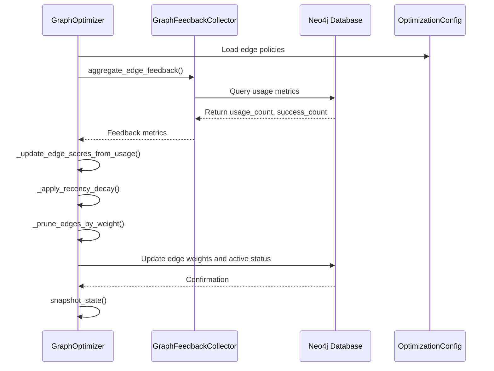
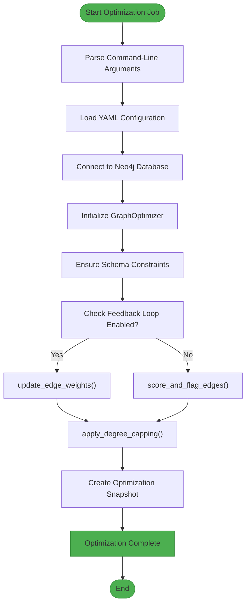
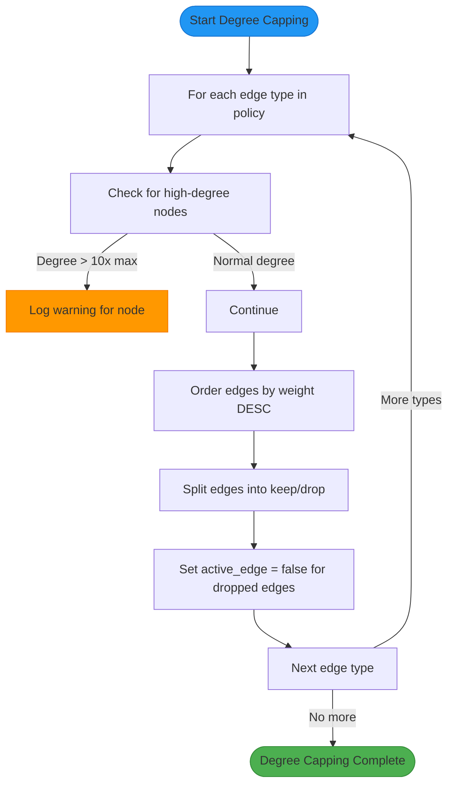
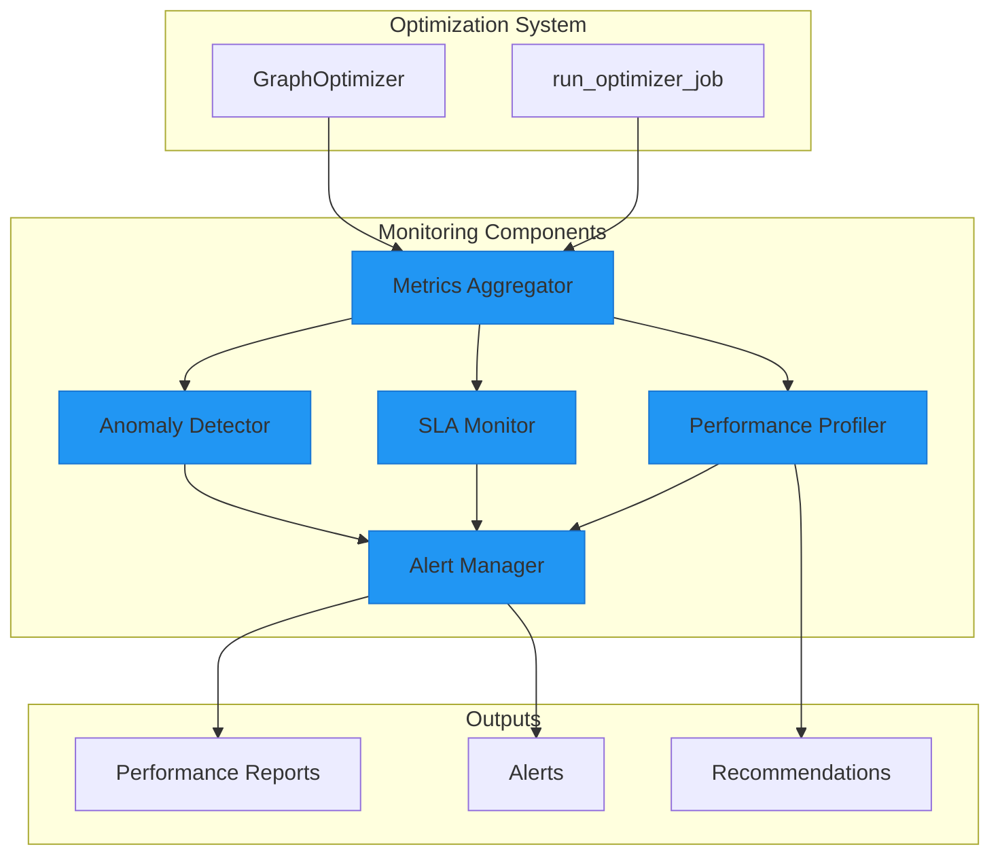

# Graph Optimization Strategies

<cite>
**Referenced Files in This Document**   
- [graph_optimizer.py](file://mahoun/graph/optimizer/graph_optimizer.py)
- [run_optimizer_job.py](file://mahoun/graph/optimizer/run_optimizer_job.py)
- [feedback.py](file://mahoun/graph/optimizer/feedback.py)
- [config.py](file://mahoun/graph/optimizer/config.py)
- [runtime_invariants.py](file://mahoun/guardrails/runtime_invariants.py)
- [monitoring.py](file://mahoun/graph/neo4j/monitoring.py)
- [ultra_performance_monitoring.py](file://mahoun/self_improve/ultra_performance_monitoring.py)
- [maintenance.py](file://mahoun/mcp/tools/maintenance.py)
</cite>

## Table of Contents
1. [Introduction](#introduction)
2. [Feedback-Driven Optimization Loop](#feedback-driven-optimization-loop)
3. [Scheduled Optimization with run_optimizer_job.py](#scheduled-optimization-with-run_optimizer_jobpy)
4. [Feedback Collection Mechanism](#feedback-collection-mechanism)
5. [Graph Density Reduction Strategies](#graph-density-reduction-strategies)
6. [Over-Optimization Safeguards](#over-optimization-safeguards)
7. [Monitoring and Impact Assessment](#monitoring-and-impact-assessment)
8. [Rollback Procedures](#rollback-procedures)
9. [Conclusion](#conclusion)

## Introduction
The MAHOUN graph optimization system implements a sophisticated feedback-driven approach to continuously improve graph quality based on query performance and user feedback. This document details the architecture and implementation of the optimization system, focusing on the core components in the `mahoun/graph/optimizer` module. The system employs a non-destructive structural optimization approach that enhances graph quality while preserving critical legal relationships. The optimization process is driven by usage metrics, recency decay, and success rates, with comprehensive safeguards to prevent over-optimization and ensure system stability.

## Feedback-Driven Optimization Loop
The graph optimization system implements a feedback-driven loop that continuously improves graph quality based on real-world usage patterns and performance metrics. The core of this system is the `GraphOptimizer` class in `graph_optimizer.py`, which orchestrates the optimization process through a series of coordinated steps.

The optimization loop begins with schema validation, ensuring all necessary constraints and indexes are in place by delegating to the existing Neo4j schema management system. This is followed by the core feedback-driven edge weighting process, which updates edge weights based on usage metrics, success rates, and recency. The system applies a sophisticated algorithm that combines the base weight from the edge type policy with usage factors (calculated as log(1 + usage_count)) and success factors (success_rate when available). The resulting weight is then bounded by the minimum and maximum weight constraints defined in the policy configuration.



**Diagram sources**
- [graph_optimizer.py](file://mahoun/graph/optimizer/graph_optimizer.py#L154-L381)
- [feedback.py](file://mahoun/graph/optimizer/feedback.py#L53-L104)

**Section sources**
- [graph_optimizer.py](file://mahoun/graph/optimizer/graph_optimizer.py#L154-L381)
- [config.py](file://mahoun/graph/optimizer/config.py#L4-L93)

## Scheduled Optimization with run_optimizer_job.py
The `run_optimizer_job.py` script serves as the official entrypoint for scheduled optimization tasks, providing a robust framework for executing optimization cycles at regular intervals. This script implements a command-line interface that allows for flexible configuration through both YAML configuration files and command-line arguments.

The job execution follows a well-defined sequence: it first loads the optimization configuration, establishes a connection to the Neo4j database using runtime configuration, and initializes the `GraphOptimizer` with the appropriate settings. The optimization cycle then proceeds through several key phases: schema validation, feedback-driven edge weighting (or basic scoring if feedback is disabled), degree capping, and state snapshotting. The script ensures that optimization reports are saved to the specified directory, with a default location of `logs/graph_optimization`.



**Diagram sources**
- [run_optimizer_job.py](file://mahoun/graph/optimizer/run_optimizer_job.py#L76-L174)

**Section sources**
- [run_optimizer_job.py](file://mahoun/graph/optimizer/run_optimizer_job.py#L1-L175)

## Feedback Collection Mechanism
The feedback collection system, implemented in `feedback.py`, aggregates usage and quality signals from various sources to inform the optimization process. The `GraphFeedbackCollector` class serves as the central component for gathering feedback metrics, primarily reading from existing relationship properties in the Neo4j database such as `usage_count`, `success_count`, `last_used_at`, and `avg_score`.

The collector operates by querying all relationships in the graph that have non-null usage or success counts, returning a comprehensive map of edge IDs to their respective feedback metrics. This data is then used by the `GraphOptimizer` to update edge weights and make informed decisions about which edges to retain or prune. The system is designed with future extensibility in mind, with planned integrations for retrieval logs, RAG flows, and quality systems that will provide additional signals for optimization.

```mermaid
classDiagram
class GraphFeedbackCollector {
+Driver driver
+Logger logger
+__init__(driver, logger)
+aggregate_edge_feedback() Dict~str, Dict~str, Any~~
+collect_from_retrieval_logs() Dict~str, Dict~str, Any~~
+collect_from_rag_flows() Dict~str, Dict~str, Any~~
+collect_from_quality_systems() Dict~str, Dict~str, Any~~
}
class GraphOptimizer {
-GraphFeedbackCollector _feedback_collector
+update_edge_weights()
+_load_usage_metrics()
+_update_edge_scores_from_usage(metrics)
}
GraphOptimizer --> GraphFeedbackCollector : "uses"
GraphFeedbackCollector --> Neo4j : "queries"
note right of GraphFeedbackCollector
Aggregates feedback signals from
relationship properties and future
sources like retrieval logs and
quality systems
end note
```

**Diagram sources**
- [feedback.py](file://mahoun/graph/optimizer/feedback.py#L24-L135)
- [graph_optimizer.py](file://mahoun/graph/optimizer/graph_optimizer.py#L37-L243)

**Section sources**
- [feedback.py](file://mahoun/graph/optimizer/feedback.py#L1-L135)

## Graph Density Reduction Strategies
The optimization system employs multiple strategies to reduce graph density while preserving critical legal relationships. The primary mechanism is degree capping, which limits the number of outgoing edges of a specific type from any node. This is implemented in the `apply_degree_capping` method of `GraphOptimizer`, which processes each edge type according to its policy configuration.

For each edge type, the system first checks for nodes with exceptionally high degrees (more than 10 times the maximum degree), logging warnings for potential anomalies. It then applies the degree cap by ordering edges by their weight in descending order and deactivating those that exceed the maximum degree limit. This non-destructive approach ensures that relationships are not permanently removed but are instead marked as inactive, allowing for potential reactivation if usage patterns change.



**Diagram sources**
- [graph_optimizer.py](file://mahoun/graph/optimizer/graph_optimizer.py#L71-L114)

**Section sources**
- [graph_optimizer.py](file://mahoun/graph/optimizer/graph_optimizer.py#L71-L114)
- [config.py](file://mahoun/graph/optimizer/config.py#L5-L22)

## Over-Optimization Safeguards
The system incorporates comprehensive safeguards to prevent over-optimization that might remove semantically important but infrequent relationships. The guardrails system, implemented in the `mahoun/guardrails` module, enforces critical invariants at runtime to ensure system correctness and prevent regressions.

The `runtime_invariants.py` file defines several key guards that protect against common optimization pitfalls. For example, `G3_NonResurrection` ensures that excluded nodes do not reappear in resolved results, preventing the resurrection of relationships that were intentionally removed. The `G2_EvidenceReferencesResolve` guard verifies that all evidence references can be resolved to real nodes, maintaining the integrity of the knowledge graph.

```mermaid
graph TD
subgraph "Guardrails System"
G1[G1_EvidenceStepHasEvidence]
G2[G2_EvidenceReferencesResolve]
G3[G3_NonResurrection]
G4[G4_ContradictionVisibility]
G5[G5_ResolutionOrder]
end
subgraph "Optimization Process"
Optimizer[GraphOptimizer]
Feedback[GraphFeedbackCollector]
end
Optimizer --> G1
Optimizer --> G2
Optimizer --> G3
Optimizer --> G4
Optimizer --> G5
Feedback --> G2
style G1 fill:#F44336,stroke:#D32F2F
style G2 fill:#F44336,stroke:#D32F2F
style G3 fill:#F44336,stroke:#D32F2F
style G4 fill:#F44336,stroke:#D32F2F
style G5 fill:#F44336,stroke:#D32F2F
note right of Guardrails System
Runtime invariants ensure system
correctness and prevent optimization
regressions. Guards can operate in
OFF, WARN, STRICT, or AUDIT modes.
end note
```

**Diagram sources**
- [runtime_invariants.py](file://mahoun/guardrails/runtime_invariants.py#L77-L239)
- [modes.py](file://mahoun/guardrails/modes.py#L1-L37)

**Section sources**
- [runtime_invariants.py](file://mahoun/guardrails/runtime_invariants.py#L1-L239)
- [exceptions.py](file://mahoun/guardrails/exceptions.py#L1-L29)

## Monitoring and Impact Assessment
The optimization system integrates with comprehensive monitoring capabilities to track the impact of optimization changes and ensure system stability. The `ultra_performance_monitoring.py` module provides an enterprise-grade monitoring system with real-time analytics, ML-based anomaly detection, and SLA monitoring.

The monitoring system collects metrics across multiple dimensions including latency, throughput, error rate, and relevance score. It employs statistical methods and isolation forest algorithms to detect anomalies in performance metrics, automatically triggering alerts when thresholds are exceeded. The system also tracks SLA compliance, generating detailed performance reports that include bottleneck analysis and optimization recommendations.



**Diagram sources**
- [ultra_performance_monitoring.py](file://mahoun/self_improve/ultra_performance_monitoring.py#L121-L746)
- [monitoring.py](file://mahoun/graph/neo4j/monitoring.py#L1-L96)

**Section sources**
- [ultra_performance_monitoring.py](file://mahoun/self_improve/ultra_performance_monitoring.py#L1-L746)
- [monitoring.py](file://mahoun/graph/neo4j/monitoring.py#L1-L96)

## Rollback Procedures
The system provides robust rollback procedures to recover from detrimental optimization changes. The primary mechanism is the optimization snapshot functionality, implemented in the `snapshot_state` method of `GraphOptimizer`. This method tags the current graph state with optimization metadata, including a timestamp and snapshot label, allowing for easy identification of pre-optimization states.

In addition to snapshots, the system provides explicit rollback capabilities through the maintenance tools. The `MaintenanceTool` class in `maintenance.py` offers operations for rebuilding the graph from source data and creating full system backups. These operations can be triggered via the MCP (Mahoun Control Plane) interface, providing a controlled mechanism for recovery when optimization changes have negative impacts.

```mermaid
flowchart TD
Problem[Performance Degradation Detected] --> CheckSnapshot["Check for Optimization Snapshots"]
CheckSnapshot --> |Snapshots Available| RestoreSnapshot["Restore from Snapshot"]
CheckSnapshot --> |No Snapshots| RebuildGraph["Trigger Full Graph Rebuild"]
RebuildGraph --> BT[backup_all()]
BT --> RG[rebuild_graph()]
RestoreSnapshot --> Validate["Validate System Performance"]
RebuildGraph --> Validate
Validate --> |Performance Restored| Complete([Rollback Complete])
Validate --> |Still Degraded| Escalate["Escalate to Engineering Team"]
style Problem fill:#F44336,stroke:#D32F2F
style Complete fill:#4CAF50,stroke:#388E3C
style Escalate fill:#FF9800,stroke:#F57C00
```

**Diagram sources**
- [graph_optimizer.py](file://mahoun/graph/optimizer/graph_optimizer.py#L189-L228)
- [maintenance.py](file://mahoun/mcp/tools/maintenance.py#L1-L84)

**Section sources**
- [graph_optimizer.py](file://mahoun/graph/optimizer/graph_optimizer.py#L189-L228)
- [maintenance.py](file://mahoun/mcp/tools/maintenance.py#L1-L84)

## Conclusion
The MAHOUN graph optimization system represents a sophisticated, feedback-driven approach to maintaining and improving knowledge graph quality. By combining usage metrics, recency decay, and success rates with comprehensive safeguards, the system achieves a balance between optimization and preservation of critical relationships. The scheduled optimization jobs, implemented in `run_optimizer_job.py`, provide a reliable mechanism for regular maintenance, while the feedback collection system in `feedback.py` ensures that optimization decisions are grounded in real-world usage patterns.

The system's strength lies in its layered approach to risk management: non-destructive edge deactivation instead of deletion, runtime invariants to prevent semantic errors, comprehensive monitoring to detect performance issues, and robust rollback procedures for recovery. This multi-faceted strategy ensures that the knowledge graph evolves to meet changing usage patterns while maintaining the integrity and reliability required for legal applications.

Future enhancements to the system could include deeper integration with retrieval logs and RAG flows for more granular feedback signals, predictive modeling to anticipate optimization impacts, and automated A/B testing to validate optimization changes before full deployment. These advancements would further strengthen the system's ability to self-improve while minimizing risks to production stability.