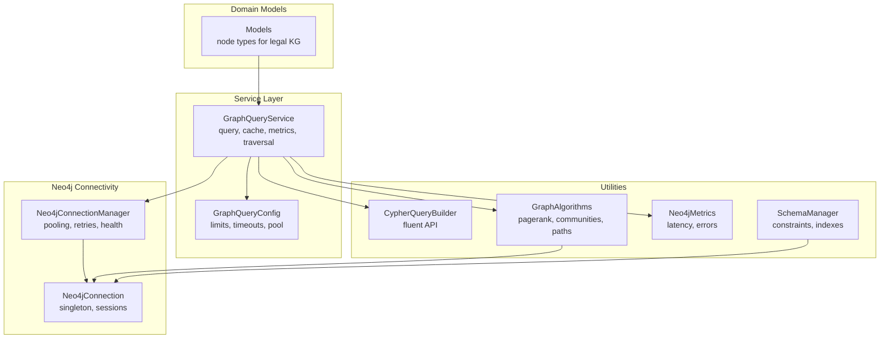
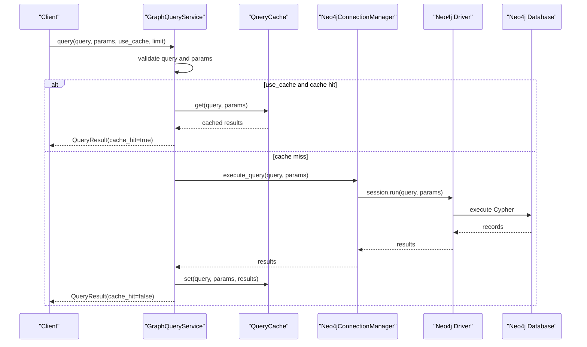
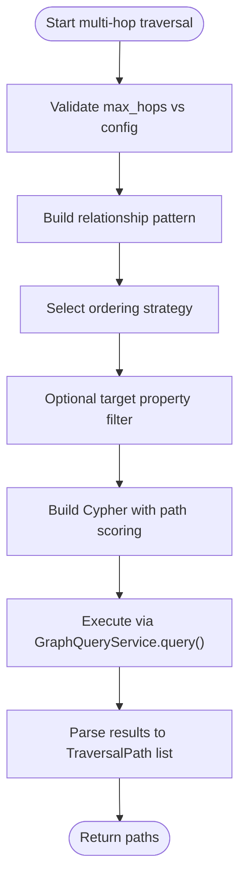
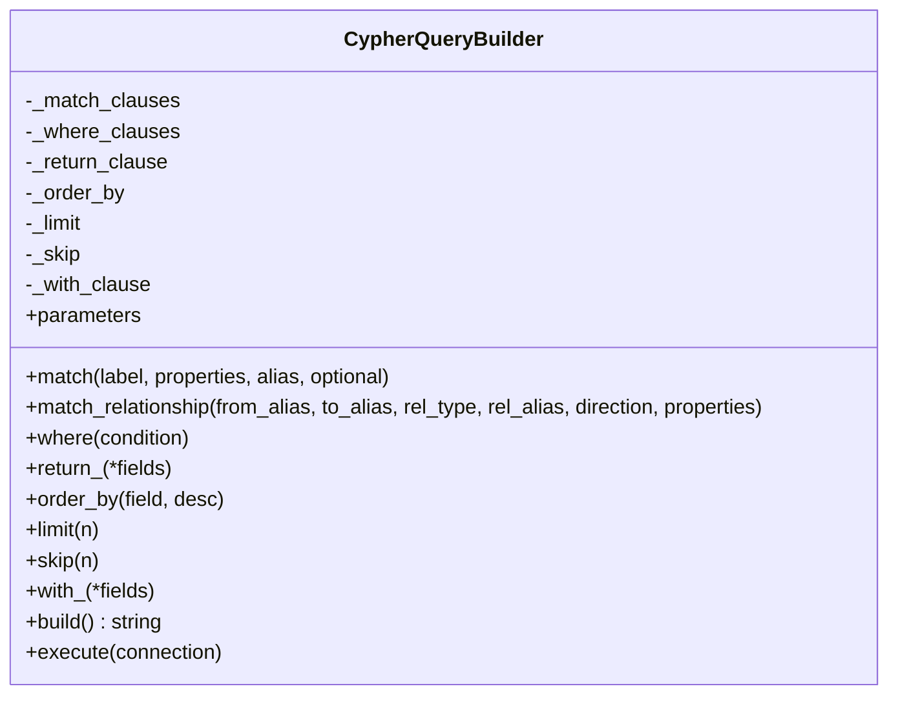
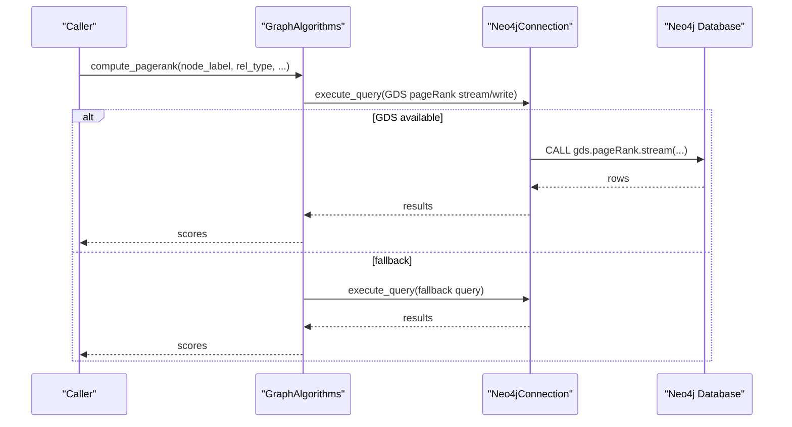
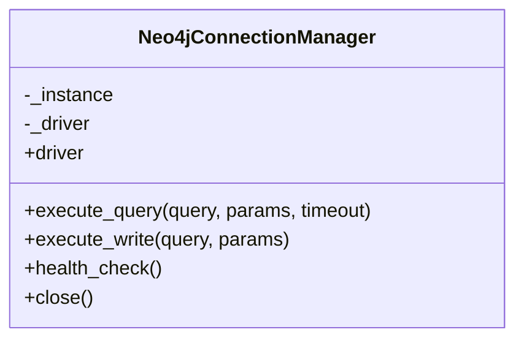
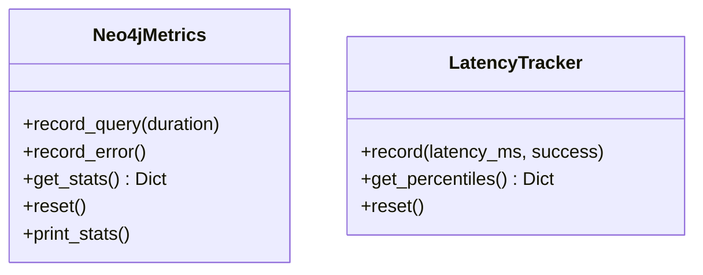
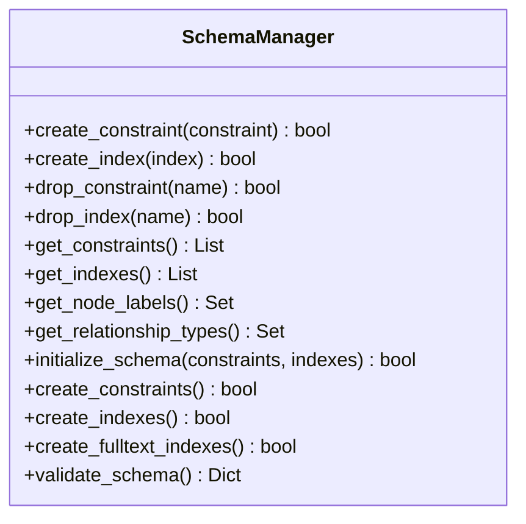
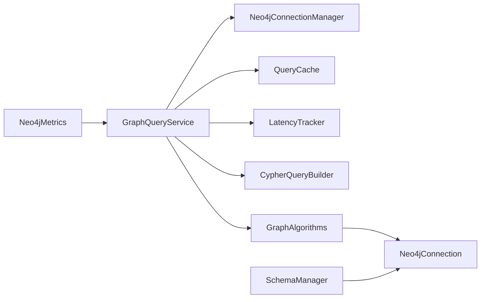

# Graph Querying Mechanisms

<cite>
**Referenced Files in This Document**
- [graph_query_service.py](file://mahoun/graph/graph_query_service.py)
- [query_builder.py](file://mahoun/graph/neo4j/query_builder.py)
- [algorithms.py](file://mahoun/graph/neo4j/algorithms.py)
- [connection.py](file://mahoun/graph/neo4j/connection.py)
- [operations.py](file://mahoun/graph/neo4j/operations.py)
- [monitoring.py](file://mahoun/graph/neo4j/monitoring.py)
- [schema.py](file://mahoun/graph/neo4j/schema.py)
- [models.py](file://mahoun/graph/neo4j/models.py)
</cite>

## Table of Contents
1. [Introduction](#introduction)
2. [Project Structure](#project-structure)
3. [Core Components](#core-components)
4. [Architecture Overview](#architecture-overview)
5. [Detailed Component Analysis](#detailed-component-analysis)
6. [Dependency Analysis](#dependency-analysis)
7. [Performance Considerations](#performance-considerations)
8. [Troubleshooting Guide](#troubleshooting-guide)
9. [Conclusion](#conclusion)
10. [Appendices](#appendices)

## Introduction
This document explains the graph querying system centered on the production-grade graph query service and its supporting utilities. It covers:
- Complex graph traversals using Cypher queries and pathfinding algorithms
- The parameterized query builder for safe and efficient query construction
- Graph algorithms for legal reasoning tasks such as precedent retrieval and rule propagation
- Practical examples of multi-hop queries for tracing legal citations across jurisdictions
- Performance optimization techniques including query plan caching, batching, and depth limiting
- Strategies for handling timeouts and memory exhaustion in dense legal networks
- Guidance on monitoring query performance through integrated observability

## Project Structure
The graph querying stack is organized around a service layer that orchestrates Neo4j connectivity, caching, and metrics, with specialized modules for building Cypher queries, running graph algorithms, and managing schema/indexes.

**Diagram sources**
- [graph_query_service.py](file://mahoun/graph/graph_query_service.py#L140-L220)
- [connection.py](file://mahoun/graph/neo4j/connection.py#L1-L120)
- [query_builder.py](file://mahoun/graph/neo4j/query_builder.py#L1-L80)
- [algorithms.py](file://mahoun/graph/neo4j/algorithms.py#L1-L60)
- [monitoring.py](file://mahoun/graph/neo4j/monitoring.py#L1-L60)
- [schema.py](file://mahoun/graph/neo4j/schema.py#L1-L60)
- [models.py](file://mahoun/graph/neo4j/models.py#L1-L60)

**Section sources**
- [graph_query_service.py](file://mahoun/graph/graph_query_service.py#L140-L220)
- [connection.py](file://mahoun/graph/neo4j/connection.py#L1-L120)

## Core Components
- GraphQueryService: Central orchestration of queries, caching, metrics, and traversal helpers. Provides synchronous and asynchronous query execution, batch operations, neighborhood extraction, and legal-domain specific queries.
- Neo4jConnectionManager: Singleton connection manager with connection pooling, retry logic, and health checks.
- QueryCache: Thread-safe LRU cache with TTL for query results.
- LatencyTracker: Windowed percentile calculator for latency and success rate.
- CypherQueryBuilder: Fluent API to construct parameterized Cypher queries safely.
- GraphAlgorithms: High-level graph algorithms leveraging Neo4j GDS when available, with fallbacks.
- Neo4jMetrics: Lightweight metrics for query counts, durations, and error rates.
- SchemaManager: Manages constraints and indexes for the legal knowledge graph.

**Section sources**
- [graph_query_service.py](file://mahoun/graph/graph_query_service.py#L470-L760)
- [connection.py](file://mahoun/graph/neo4j/connection.py#L45-L120)
- [query_builder.py](file://mahoun/graph/neo4j/query_builder.py#L1-L80)
- [algorithms.py](file://mahoun/graph/neo4j/algorithms.py#L1-L60)
- [monitoring.py](file://mahoun/graph/neo4j/monitoring.py#L1-L60)
- [schema.py](file://mahoun/graph/neo4j/schema.py#L1-L60)

## Architecture Overview
The system integrates a service layer with Neo4j connectivity and utilities. The service validates inputs, applies limits, caches results, executes queries, and records metrics. Algorithms and builders encapsulate reusable logic for traversal and query construction.

**Diagram sources**
- [graph_query_service.py](file://mahoun/graph/graph_query_service.py#L564-L663)
- [connection.py](file://mahoun/graph/neo4j/connection.py#L174-L216)

## Detailed Component Analysis

### GraphQueryService: Traversals, Algorithms, and Legal Queries
- Multi-hop traversal: Builds relationship patterns, applies breadth-first, depth-first, or best-first ordering, and computes path scores using relationship weights/confidence.
- Personalized PageRank: Attempts GDS-backed PPR with fallback to a simple BFS-based approximation when GDS is unavailable.
- Neighborhood extraction: Returns nodes and edges within a configurable depth, optionally including properties.
- Batch operations: Executes multiple queries in a single transaction or individually, with validation and metrics.
- Legal-domain queries: Related verdicts scoring by shared law articles, tags, and parties; law article usage aggregation.

**Diagram sources**
- [graph_query_service.py](file://mahoun/graph/graph_query_service.py#L670-L737)

**Section sources**
- [graph_query_service.py](file://mahoun/graph/graph_query_service.py#L666-L737)
- [graph_query_service.py](file://mahoun/graph/graph_query_service.py#L755-L903)
- [graph_query_service.py](file://mahoun/graph/graph_query_service.py#L908-L967)
- [graph_query_service.py](file://mahoun/graph/graph_query_service.py#L973-L1019)
- [graph_query_service.py](file://mahoun/graph/graph_query_service.py#L1037-L1137)

### CypherQueryBuilder: Safe, Parameterized Query Construction
- Fluent API to compose MATCH/WHERE/RETURN/ORDER BY/LIMIT/SKIP/WITH clauses.
- Automatically parameterizes node and relationship properties to prevent injection.
- Builds and executes queries through a connection interface.

**Diagram sources**
- [query_builder.py](file://mahoun/graph/neo4j/query_builder.py#L1-L251)

**Section sources**
- [query_builder.py](file://mahoun/graph/neo4j/query_builder.py#L1-L251)

### GraphAlgorithms: Pagerank, Communities, Shortest Paths, Similarity
- Pagerank: Uses GDS when available, otherwise falls back to degree-based centrality.
- Community detection: Louvain or label propagation with write/stream modes.
- Shortest path: Computes shortest path between two nodes up to a maximum depth.
- Betweenness centrality: GDS-backed computation with write/stream modes.
- Similar nodes: Counts common neighbors to find similar nodes.

**Diagram sources**
- [algorithms.py](file://mahoun/graph/neo4j/algorithms.py#L1-L120)
- [algorithms.py](file://mahoun/graph/neo4j/algorithms.py#L120-L214)

**Section sources**
- [algorithms.py](file://mahoun/graph/neo4j/algorithms.py#L1-L276)

### Neo4jConnectionManager: Pooling, Retries, Health
- Singleton connection manager with driver initialization, connection pooling, and retry logic.
- Health checks and graceful fallback when disabled.

**Diagram sources**
- [connection.py](file://mahoun/graph/neo4j/connection.py#L1-L120)
- [connection.py](file://mahoun/graph/neo4j/connection.py#L174-L216)

**Section sources**
- [connection.py](file://mahoun/graph/neo4j/connection.py#L1-L120)
- [connection.py](file://mahoun/graph/neo4j/connection.py#L174-L216)

### Neo4jMetrics and LatencyTracker: Observability
- Neo4jMetrics: Tracks query counts, durations, errors, and slow queries.
- LatencyTracker: Windowed percentile computation for p50/p95/p99 and mean/success rate.

**Diagram sources**
- [monitoring.py](file://mahoun/graph/neo4j/monitoring.py#L1-L96)
- [graph_query_service.py](file://mahoun/graph/graph_query_service.py#L266-L340)

**Section sources**
- [monitoring.py](file://mahoun/graph/neo4j/monitoring.py#L1-L96)
- [graph_query_service.py](file://mahoun/graph/graph_query_service.py#L266-L340)

### SchemaManager: Constraints and Indexes
- Creates unique, existence, and node-key constraints.
- Creates b-tree, full-text, and vector indexes.
- Validates schema presence and initializes default RAG schema.

**Diagram sources**
- [schema.py](file://mahoun/graph/neo4j/schema.py#L1-L180)
- [schema.py](file://mahoun/graph/neo4j/schema.py#L180-L385)

**Section sources**
- [schema.py](file://mahoun/graph/neo4j/schema.py#L1-L180)
- [schema.py](file://mahoun/graph/neo4j/schema.py#L180-L385)

### Legal Knowledge Graph Models
- Pydantic models define node types and constraints for the legal knowledge graph (e.g., Law, Article, Verdict, Court, Case, Person, Party).

**Section sources**
- [models.py](file://mahoun/graph/neo4j/models.py#L1-L268)

## Dependency Analysis
The service depends on the connection manager for database operations, the query builder for safe query construction, and the algorithms module for advanced graph computations. Metrics and schema management provide observability and data integrity.

**Diagram sources**
- [graph_query_service.py](file://mahoun/graph/graph_query_service.py#L470-L760)
- [algorithms.py](file://mahoun/graph/neo4j/algorithms.py#L1-L60)
- [connection.py](file://mahoun/graph/neo4j/connection.py#L1-L120)
- [schema.py](file://mahoun/graph/neo4j/schema.py#L1-L60)
- [monitoring.py](file://mahoun/graph/neo4j/monitoring.py#L1-L60)

**Section sources**
- [graph_query_service.py](file://mahoun/graph/graph_query_service.py#L470-L760)
- [algorithms.py](file://mahoun/graph/neo4j/algorithms.py#L1-L60)
- [connection.py](file://mahoun/graph/neo4j/connection.py#L1-L120)
- [schema.py](file://mahoun/graph/neo4j/schema.py#L1-L60)
- [monitoring.py](file://mahoun/graph/neo4j/monitoring.py#L1-L60)

## Performance Considerations
- Query Plan Caching and Result Streaming
  - The service caches query results keyed by normalized query and parameters. While the driver itself caches plans, the application-level cache avoids repeated execution of identical queries. There is no explicit result streaming mechanism in the current code; consider batching and pagination for large result sets.
  - Recommendation: Use LIMIT and SKIP for pagination; leverage Cypher’s WITH for intermediate projections to reduce payload sizes.

- Depth Limiting and Traversal Control
  - The service enforces a maximum traversal depth in configuration and applies it to traversal queries. This prevents combinatorial explosion in dense legal networks.
  - Recommendation: Keep max_traversal_depth conservative (e.g., 3–5) and tune per workload.

- Connection Pooling and Retry Logic
  - Connection pooling reduces overhead and improves throughput under load. Retry logic with exponential backoff mitigates transient failures.
  - Recommendation: Size the pool according to concurrency; monitor health checks and adjust timeouts.

- Batching and Transactions
  - Batch operations can be executed in a single transaction for atomicity and reduced round-trips. The service supports batch queries with or without transactions.
  - Recommendation: Use transactions for related writes; keep batch sizes balanced to avoid long-running transactions.

- Algorithmic Complexity
  - Multi-hop traversal and neighborhood queries scale with fan-out. Prefer breadth-first ordering for shortest-path-like goals and best-first ordering with path scoring for weighted graphs.
  - Recommendation: Use relationship-type filters to constrain traversal; apply early filtering in WHERE clauses.

- Memory and Timeout Management
  - Large traversals and aggregations can exhaust memory or exceed timeouts. Use depth limits, path scoring, and LIMIT clauses to cap resource usage.
  - Recommendation: Monitor latency percentiles and error rates; set query timeouts conservatively; consider iterative deepening for very dense graphs.

[No sources needed since this section provides general guidance]

## Troubleshooting Guide
- Query Timeout and Memory Exhaustion
  - Symptoms: Exceptions during execution, timeouts, or excessive memory usage.
  - Actions:
    - Reduce max_traversal_depth and hop limits.
    - Add LIMIT clauses and pagination (SKIP/LIMIT).
    - Filter by relationship types and target properties.
    - Enable caching for repeated queries.
    - Monitor latency percentiles and error rates via metrics.

- Connection Issues
  - Symptoms: Health checks failing, connectivity errors.
  - Actions:
    - Verify Neo4j URI, credentials, and database name.
    - Check pool size and connection timeouts.
    - Use health_check() to diagnose connectivity.

- Dangerous Query Detection
  - The service validates queries to reject potentially destructive operations without WHERE clauses.
  - Actions: Review query construction and ensure appropriate WHERE conditions.

- GDS Unavailable
  - Symptoms: Pagerank and community detection fallbacks invoked.
  - Actions: Install and configure Neo4j GDS; otherwise rely on fallbacks.

**Section sources**
- [graph_query_service.py](file://mahoun/graph/graph_query_service.py#L531-L557)
- [graph_query_service.py](file://mahoun/graph/graph_query_service.py#L1158-L1167)
- [algorithms.py](file://mahoun/graph/neo4j/algorithms.py#L60-L120)

## Conclusion
The graph querying system provides a robust, production-grade foundation for legal reasoning on Neo4j. It combines safe query construction, caching, observability, and algorithmic capabilities to support complex traversals and rule propagation. By applying depth limiting, pagination, and careful batching, teams can operate reliably in dense legal networks while maintaining strong performance and resilience.

[No sources needed since this section summarizes without analyzing specific files]

## Appendices

### Example Workflows

- Multi-hop Traversal Across Jurisdictions
  - Use multi_hop_traversal with relationship types representing cross-jurisdictional citations and a target property filter for jurisdiction-aware nodes. Order by best-first to prioritize higher-scoring paths.

- Precedent Retrieval Using Shared Elements
  - Use find_related_verdicts to combine matches by shared law articles, tags, and parties, then rank by combined weights.

- Law Article Usage Analysis
  - Use find_law_article_usage to discover how often a specific article is cited and sample related verdicts.

- Batch Updates with Transactions
  - Use batch_query with use_transaction=True to atomically apply multiple updates.

**Section sources**
- [graph_query_service.py](file://mahoun/graph/graph_query_service.py#L666-L737)
- [graph_query_service.py](file://mahoun/graph/graph_query_service.py#L1037-L1137)
- [graph_query_service.py](file://mahoun/graph/graph_query_service.py#L973-L1019)