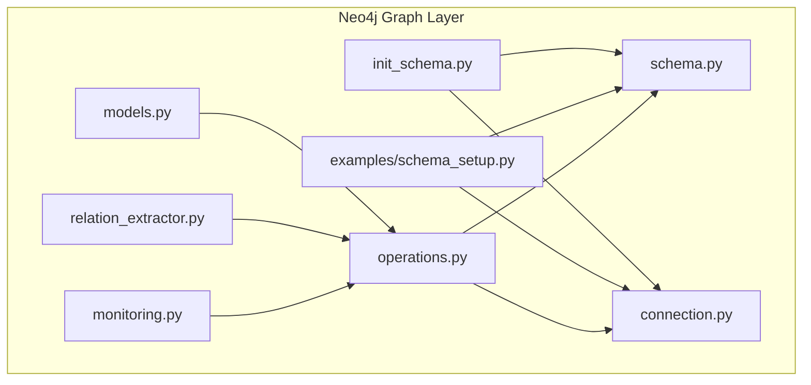
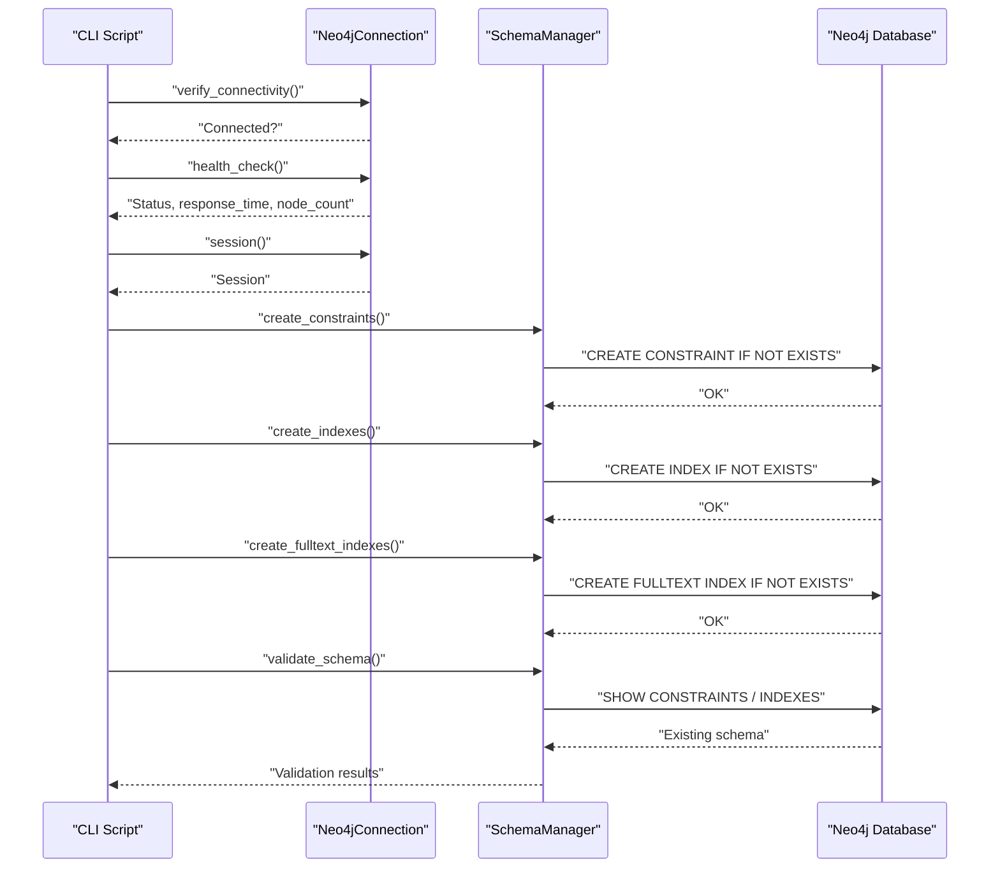
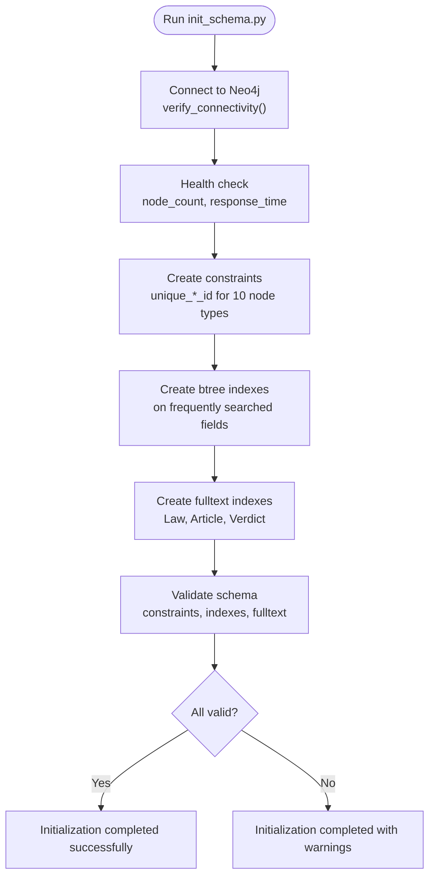
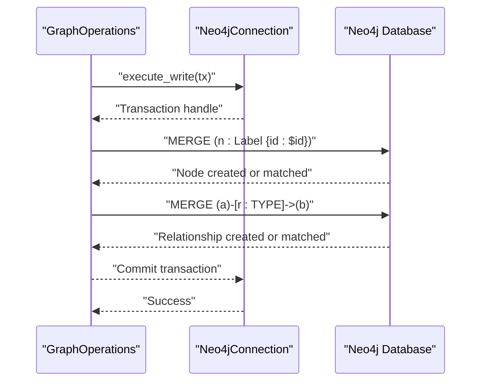
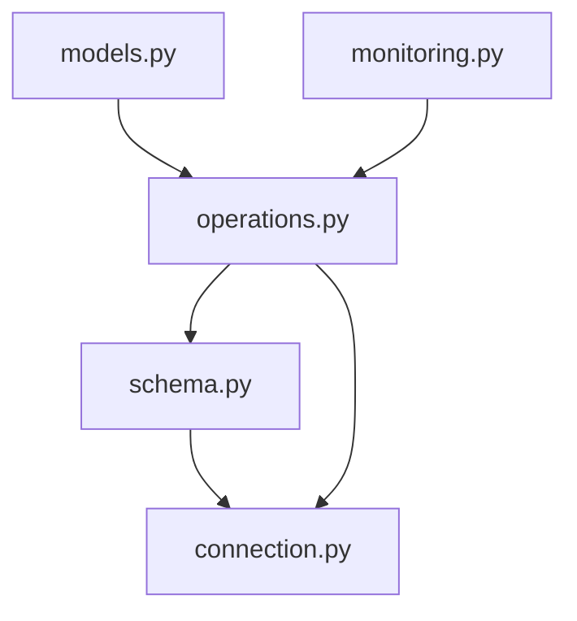
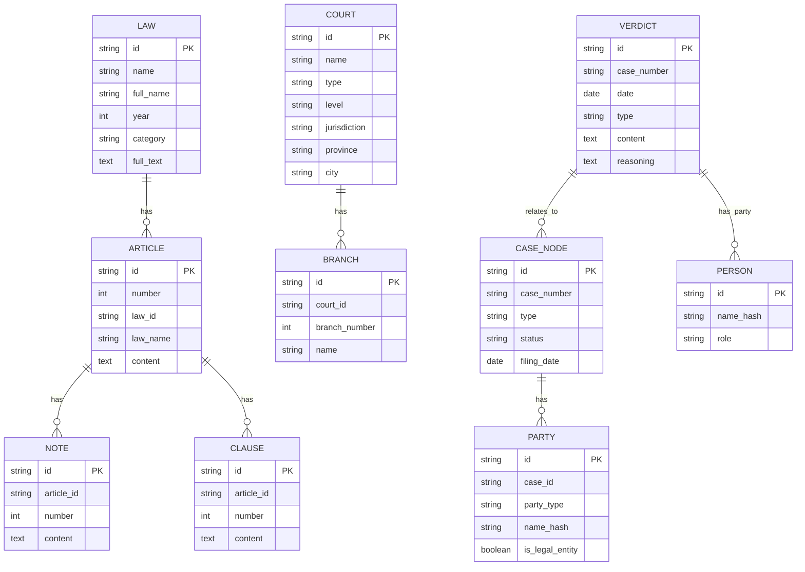

# Graph Schema Design

<cite>
**Referenced Files in This Document**
- [init_schema.py](file://mahoun/graph/neo4j/init_schema.py)
- [schema.py](file://mahoun/graph/neo4j/schema.py)
- [models.py](file://mahoun/graph/neo4j/models.py)
- [operations.py](file://mahoun/graph/neo4j/operations.py)
- [connection.py](file://mahoun/graph/neo4j/connection.py)
- [monitoring.py](file://mahoun/graph/neo4j/monitoring.py)
- [schema_setup.py](file://mahoun/graph/neo4j/examples/schema_setup.py)
- [relation_extractor.py](file://mahoun/graph/relation_extractor.py)
</cite>

## Table of Contents
1. [Introduction](#introduction)
2. [Project Structure](#project-structure)
3. [Core Components](#core-components)
4. [Architecture Overview](#architecture-overview)
5. [Detailed Component Analysis](#detailed-component-analysis)
6. [Dependency Analysis](#dependency-analysis)
7. [Performance Considerations](#performance-considerations)
8. [Troubleshooting Guide](#troubleshooting-guide)
9. [Conclusion](#conclusion)
10. [Appendices](#appendices)

## Introduction
This document describes the Neo4j-based legal knowledge graph schema used by the platform. It covers the 10 node types, unique constraints, indexing strategy (including fulltext indexes), and the schema initialization process. It also explains how the schema is deployed via example scripts, outlines relationship types used in the graph, and provides guidance for schema migration and versioning while maintaining backward compatibility during legal ontology updates. Performance implications of constraint creation order and index selection are addressed for large-scale legal datasets.

## Project Structure
The schema and initialization logic reside under the Neo4j graph module. Key files include:
- Schema initialization and validation
- Schema management utilities
- Node models and properties
- Graph operations and ingestion helpers
- Connection management and monitoring
- Example scripts for default and custom schema deployment

**Diagram sources**
- [init_schema.py](file://mahoun/graph/neo4j/init_schema.py#L1-L111)
- [schema.py](file://mahoun/graph/neo4j/schema.py#L1-L441)
- [models.py](file://mahoun/graph/neo4j/models.py#L1-L268)
- [operations.py](file://mahoun/graph/neo4j/operations.py#L1-L928)
- [connection.py](file://mahoun/graph/neo4j/connection.py#L1-L476)
- [monitoring.py](file://mahoun/graph/neo4j/monitoring.py#L1-L96)
- [schema_setup.py](file://mahoun/graph/neo4j/examples/schema_setup.py#L1-L122)
- [relation_extractor.py](file://mahoun/graph/relation_extractor.py#L1-L145)

**Section sources**
- [init_schema.py](file://mahoun/graph/neo4j/init_schema.py#L1-L111)
- [schema.py](file://mahoun/graph/neo4j/schema.py#L1-L441)
- [models.py](file://mahoun/graph/neo4j/models.py#L1-L268)
- [operations.py](file://mahoun/graph/neo4j/operations.py#L1-L928)
- [connection.py](file://mahoun/graph/neo4j/connection.py#L1-L476)
- [monitoring.py](file://mahoun/graph/neo4j/monitoring.py#L1-L96)
- [schema_setup.py](file://mahoun/graph/neo4j/examples/schema_setup.py#L1-L122)
- [relation_extractor.py](file://mahoun/graph/relation_extractor.py#L1-L145)

## Core Components
- SchemaManager: Centralizes constraint and index creation, validation, and introspection.
- Constraint and Index dataclasses: Define schema elements declaratively.
- Node models: Define properties and validations for each node type.
- GraphOperations: Provides high-level graph manipulation and ingestion helpers.
- Connection: Manages Neo4j connectivity, retries, and health checks.
- Monitoring: Tracks query performance and error rates.

Key responsibilities:
- SchemaManager applies constraints and indexes in a deterministic order and validates schema completeness.
- Node models define properties and constraints for ingestion and validation.
- GraphOperations encapsulates MERGE semantics and batching for safe, idempotent ingestion.
- Connection and monitoring support robust, observable operations.

**Section sources**
- [schema.py](file://mahoun/graph/neo4j/schema.py#L1-L441)
- [models.py](file://mahoun/graph/neo4j/models.py#L1-L268)
- [operations.py](file://mahoun/graph/neo4j/operations.py#L1-L928)
- [connection.py](file://mahoun/graph/neo4j/connection.py#L1-L476)
- [monitoring.py](file://mahoun/graph/neo4j/monitoring.py#L1-L96)

## Architecture Overview
The schema initialization flow connects to Neo4j, verifies health, and applies constraints, indexes, and fulltext indexes. Validation ensures all required schema elements are present. Example scripts demonstrate default and custom schema deployment.

**Diagram sources**
- [init_schema.py](file://mahoun/graph/neo4j/init_schema.py#L25-L110)
- [schema.py](file://mahoun/graph/neo4j/schema.py#L169-L385)
- [connection.py](file://mahoun/graph/neo4j/connection.py#L272-L354)

## Detailed Component Analysis

### Node Types and Properties
The legal knowledge graph defines 10 node types with unique constraints and frequently queried properties. Each node type has a dedicated Pydantic model that specifies properties and validations.

- Law
  - Unique constraint: unique_law_id
  - Frequently searched fields: name, year, category
  - Fulltext fields: name, full_name, full_text
- Article
  - Unique constraint: unique_article_id
  - Frequently searched fields: number, law_id, law_name
  - Fulltext fields: content
- Note
  - Unique constraint: unique_note_id
- Clause
  - Unique constraint: unique_clause_id
- Court
  - Unique constraint: unique_court_id
  - Frequently searched fields: name, type, province, city
- Branch
  - Unique constraint: unique_branch_id
- Verdict
  - Unique constraint: unique_verdict_id
  - Frequently searched fields: case_number, date, type
  - Fulltext fields: content, reasoning
- Case
  - Unique constraint: unique_case_id
  - Frequently searched fields: case_number, date
- Person
  - Unique constraint: unique_person_id
- Party
  - Unique constraint: unique_party_id

These definitions are derived from the schema constraints and indexes declared in the schema manager and the node property models.

**Section sources**
- [schema.py](file://mahoun/graph/neo4j/schema.py#L185-L337)
- [models.py](file://mahoun/graph/neo4j/models.py#L34-L268)

### Unique Constraints and Indexing Strategy
Constraints:
- unique_law_id, unique_article_id, unique_note_id, unique_clause_id, unique_court_id, unique_branch_id, unique_verdict_id, unique_case_id, unique_person_id, unique_party_id

Indexes:
- B-tree indexes on frequently searched fields:
  - Law: name, year, category
  - Article: number, law_id, law_name
  - Court: name, type, province, city
  - Verdict: case_number, date, type
  - Case: case_number, date
- Fulltext indexes:
  - Law: name, full_name, full_text
  - Article: content
  - Verdict: content, reasoning

Vector index:
- Chunk: embedding (vector index for embeddings)

Index selection rationale:
- B-tree indexes optimize equality and range scans on categorical and numeric fields.
- Fulltext indexes enable efficient text search across multi-field content.
- Vector index accelerates similarity search for embeddings.

**Section sources**
- [schema.py](file://mahoun/graph/neo4j/schema.py#L268-L337)
- [schema.py](file://mahoun/graph/neo4j/schema.py#L305-L337)

### Relationship Types
The graph uses explicit relationship types to represent legal connections. From the ingestion helpers and relation extractor:
- References: links nodes to referenced legal provisions.
- Cites: links entities to legal articles.
- Modifies: indicates modifications to laws or articles.
- Implements: indicates implementation of legal norms.
- RelatedTo: general association between legal entities.
- Additional ingestion relationships observed in operations:
  - REFERS_TO: links Verdict to LawArticle.
  - HAS_TAG: links Verdict to Tag.
  - HAS_PARTY: links Verdict to Person with role.

These types are used consistently in MERGE operations to ensure idempotency and to build a coherent legal knowledge graph.

**Section sources**
- [relation_extractor.py](file://mahoun/graph/relation_extractor.py#L31-L145)
- [operations.py](file://mahoun/graph/neo4j/operations.py#L563-L800)

### Schema Initialization and Deployment
- init_schema.py orchestrates schema initialization:
  - Connects to Neo4j, performs health checks, and applies constraints, indexes, and fulltext indexes.
  - Validates schema completeness and reports status.
- schema_setup.py demonstrates:
  - Default schema deployment for a RAG system.
  - Custom schema deployment with user-defined constraints and indexes.
  - Schema inspection utilities to enumerate constraints, indexes, labels, and relationship types.

**Diagram sources**
- [init_schema.py](file://mahoun/graph/neo4j/init_schema.py#L25-L110)
- [schema.py](file://mahoun/graph/neo4j/schema.py#L169-L385)

**Section sources**
- [init_schema.py](file://mahoun/graph/neo4j/init_schema.py#L25-L110)
- [schema_setup.py](file://mahoun/graph/neo4j/examples/schema_setup.py#L1-L122)
- [schema.py](file://mahoun/graph/neo4j/schema.py#L169-L385)

### Ingestion and Idempotent Updates
GraphOperations provides:
- create_node and create_relationship with MERGE semantics to ensure idempotency.
- batch_create_nodes and batch_create_relationships for efficient bulk ingestion.
- Typed relationship batching grouped by type and executed in transactions for consistency.
- Helper functions to upsert verdict structures, creating nodes and relationships with REFERS_TO, HAS_TAG, and HAS_PARTY.

**Diagram sources**
- [operations.py](file://mahoun/graph/neo4j/operations.py#L76-L139)
- [operations.py](file://mahoun/graph/neo4j/operations.py#L193-L340)
- [operations.py](file://mahoun/graph/neo4j/operations.py#L341-L440)

**Section sources**
- [operations.py](file://mahoun/graph/neo4j/operations.py#L1-L928)
- [connection.py](file://mahoun/graph/neo4j/connection.py#L174-L237)

## Dependency Analysis
The schema layer depends on:
- Neo4j driver for connectivity and query execution.
- Pydantic models for node property definitions and validations.
- Logging and error handling for robust operation.

**Diagram sources**
- [schema.py](file://mahoun/graph/neo4j/schema.py#L1-L441)
- [models.py](file://mahoun/graph/neo4j/models.py#L1-L268)
- [operations.py](file://mahoun/graph/neo4j/operations.py#L1-L928)
- [connection.py](file://mahoun/graph/neo4j/connection.py#L1-L476)
- [monitoring.py](file://mahoun/graph/neo4j/monitoring.py#L1-L96)

**Section sources**
- [schema.py](file://mahoun/graph/neo4j/schema.py#L1-L441)
- [models.py](file://mahoun/graph/neo4j/models.py#L1-L268)
- [operations.py](file://mahoun/graph/neo4j/operations.py#L1-L928)
- [connection.py](file://mahoun/graph/neo4j/connection.py#L1-L476)
- [monitoring.py](file://mahoun/graph/neo4j/monitoring.py#L1-L96)

## Performance Considerations
- Constraint creation order:
  - Create unique constraints before indexes to minimize conflicts and reduce write contention during index population.
- Index selection:
  - Prefer btree indexes for equality/range filters on categorical and numeric fields.
  - Use fulltext indexes for multi-field textual search on Law, Article, and Verdict content.
  - Use vector indexes for embedding similarity search.
- Batch operations:
  - Use batch_create_nodes and batch_create_relationships to reduce round-trips and improve throughput.
  - Group relationships by type and execute within transactions to ensure atomicity.
- Monitoring:
  - Track query counts, latency distributions, error rates, and slow queries to identify bottlenecks.
- Connection pooling:
  - Leverage connection pooling and retry logic to handle transient failures and scale concurrency.

[No sources needed since this section provides general guidance]

## Troubleshooting Guide
Common issues and strategies:
- Connection failures:
  - Verify connectivity and credentials; use health checks to confirm database availability.
- Schema validation failures:
  - Confirm that all required constraints and indexes exist; re-run initialization if missing.
- Slow queries:
  - Review query plans and ensure appropriate indexes are in place; monitor with Neo4jMetrics.
- Migration and versioning:
  - Maintain backward compatibility by adding new properties and indexes without removing old ones.
  - Use validation steps to ensure schema readiness before enabling new features.
- Idempotency:
  - Use MERGE semantics to avoid duplicates during ingestion; rely on unique constraints to enforce integrity.

**Section sources**
- [connection.py](file://mahoun/graph/neo4j/connection.py#L272-L354)
- [schema.py](file://mahoun/graph/neo4j/schema.py#L339-L385)
- [monitoring.py](file://mahoun/graph/neo4j/monitoring.py#L1-L96)
- [operations.py](file://mahoun/graph/neo4j/operations.py#L76-L139)

## Conclusion
The Neo4j legal knowledge graph schema is designed around 10 node types with unique constraints and a balanced indexing strategy. Schema initialization is automated and validated, while ingestion helpers ensure idempotent updates. By following best practices for constraint order, index selection, and monitoring, the system remains performant and maintainable at scale. Backward-compatible migrations and careful validation support ongoing legal ontology evolution.

[No sources needed since this section summarizes without analyzing specific files]

## Appendices

### Practical Examples from Schema Setup
- Default schema deployment:
  - Demonstrates initializing constraints and indexes for a RAG system.
- Custom schema deployment:
  - Shows how to define and apply custom constraints and indexes for other domains.
- Schema inspection:
  - Lists constraints, indexes, node labels, and relationship types for auditing.

**Section sources**
- [schema_setup.py](file://mahoun/graph/neo4j/examples/schema_setup.py#L1-L122)

### Data Model Overview

[No sources needed since this diagram shows conceptual relationships, not a direct mapping to specific source files]