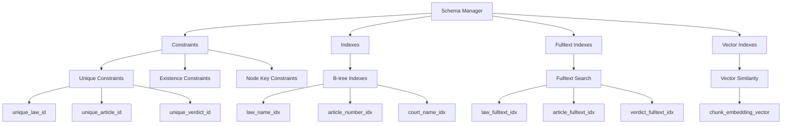
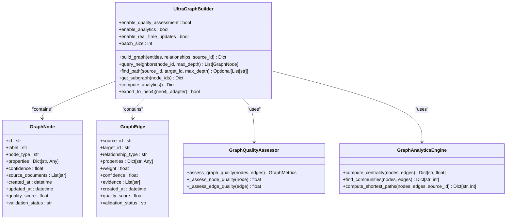
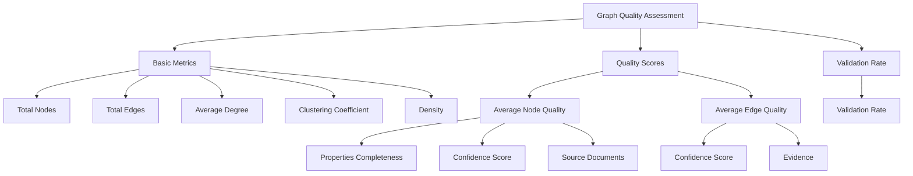
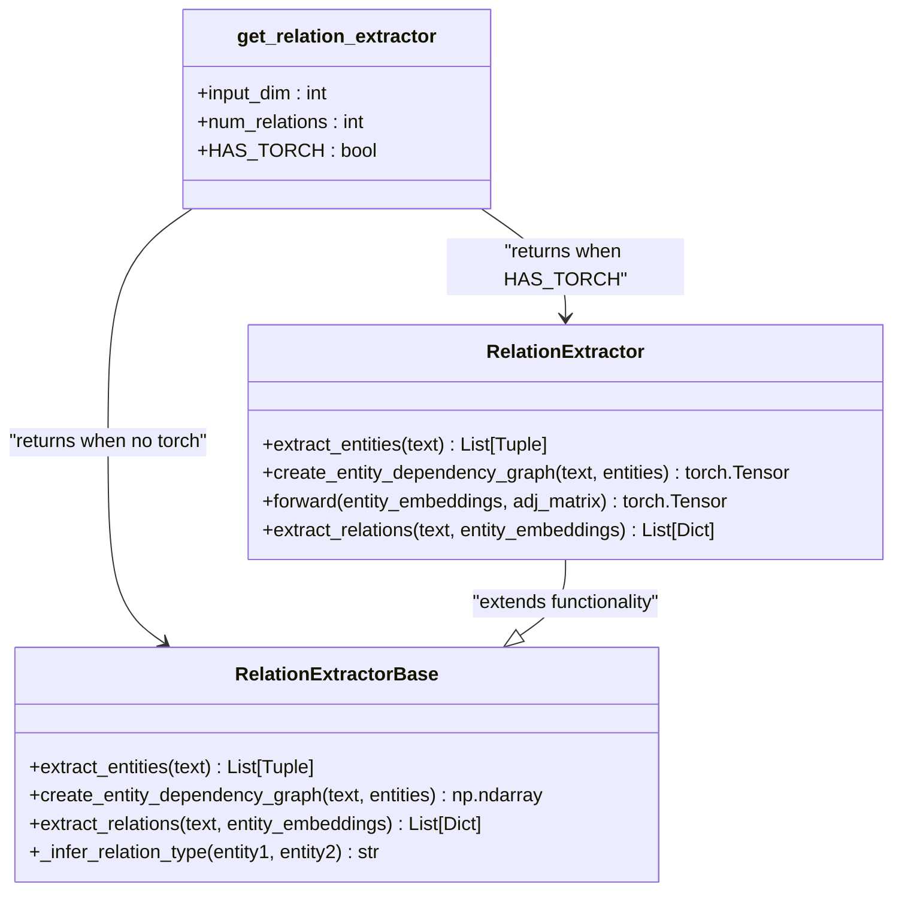
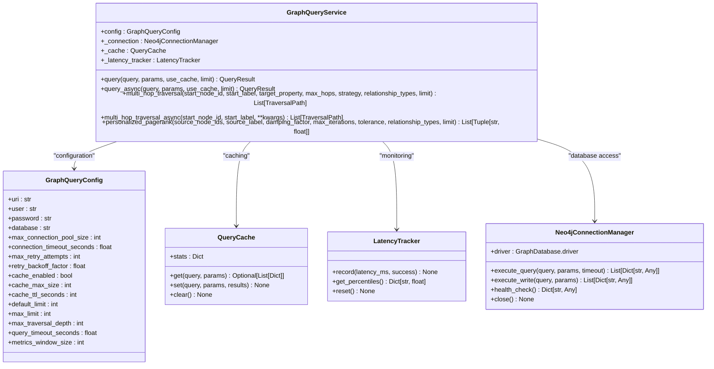
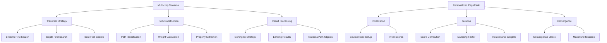
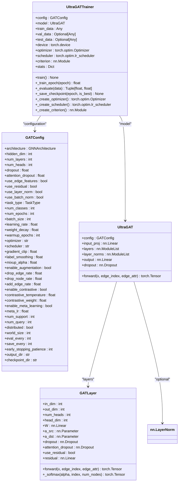
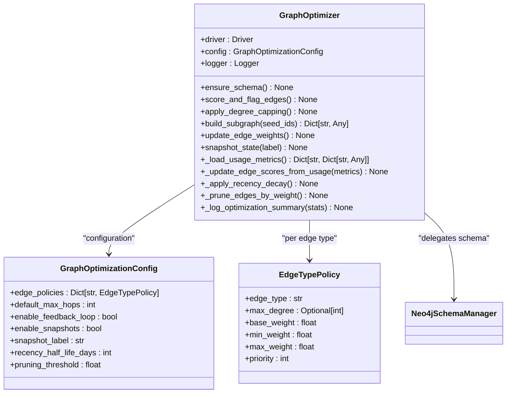
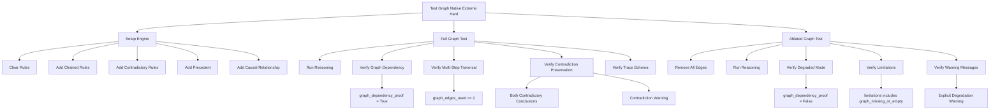

# Knowledge Graph System

<cite>
**Referenced Files in This Document**   
- [document_citation_graph.py](file://mahoun/graph/document_citation_graph.py)
- [ultra_graph_builder.py](file://mahoun/graph/ultra_graph_builder.py)
- [relation_extractor.py](file://mahoun/graph/relation_extractor.py)
- [graph_query_service.py](file://mahoun/graph/graph_query_service.py)
- [ultra_gat_trainer.py](file://mahoun/graph/ultra_gat_trainer.py)
- [test_graph_native_extreme_hard.py](file://tests/test_graph_native_extreme_hard.py)
- [graph_optimizer.py](file://mahoun/graph/optimizer/graph_optimizer.py)
- [schema.py](file://mahoun/graph/neo4j/schema.py)
- [connection.py](file://mahoun/graph/neo4j/connection.py)
- [init_schema.py](file://mahoun/graph/neo4j/init_schema.py)
</cite>

## Table of Contents
1. [Introduction](#introduction)
2. [Graph Schema Design](#graph-schema-design)
3. [Ultra Graph Builder Implementation](#ultra-graph-builder-implementation)
4. [Relation Extraction System](#relation-extraction-system)
5. [Graph Query Service](#graph-query-service)
6. [Graph Attention Network Training](#graph-attention-network-training)
7. [Graph Optimization Strategies](#graph-optimization-strategies)
8. [Practical Examples and Testing](#practical-examples-and-testing)
9. [Scalability Considerations](#scalability-considerations)

## Introduction
The Knowledge Graph System is a sophisticated framework designed for constructing and managing Neo4j-based document citation graphs, specifically tailored for legal document analysis. This system integrates advanced graph neural networks (GNNs), real-time graph processing, and comprehensive query capabilities to enable complex reasoning and relationship extraction from legal texts. The architecture combines rule-based and machine learning approaches, with fallback mechanisms when advanced dependencies like PyTorch are unavailable. The system is designed with production-grade features including connection pooling, query caching, batch operations, and comprehensive monitoring metrics. It supports both full graph operations and degraded modes when graph data is unavailable, ensuring robust performance across different deployment scenarios.

## Graph Schema Design
The graph schema design follows a comprehensive approach to ensure data integrity, efficient querying, and scalability. The system implements a multi-layered schema strategy with constraints, indexes, and specialized index types for different use cases.

### Node and Relationship Types
The system defines a rich set of node labels and relationship types to represent legal documents and their interconnections. Key node types include:
- **Law**: Represents legal codes and statutes
- **Article**: Individual articles within laws
- **Verdict**: Court decisions and judgments
- **Case**: Legal cases and proceedings
- **Person**: Individuals involved in legal matters
- **Party**: Legal parties in cases
- **Court**: Judicial institutions
- **Branch**: Court branches
- **Note**: Explanatory notes on legal texts
- **Clause**: Specific clauses within legal documents

Relationship types establish meaningful connections between these entities, including:
- **REFERENCES**: Indicates citation between documents
- **CITES**: Explicit citation relationship
- **MODIFIES**: One legal document modifies another
- **IMPLEMENTS**: Implementation relationship between laws
- **RELATED_TO**: General relationship between entities

### Indexing Strategy
The indexing strategy is designed to optimize query performance across various access patterns:

**Diagram sources**
- [schema.py](file://mahoun/graph/neo4j/schema.py#L187-L258)
- [schema.py](file://mahoun/graph/neo4j/schema.py#L271-L303)
- [schema.py](file://mahoun/graph/neo4j/schema.py#L308-L337)

The system implements three primary index types:
1. **B-tree indexes** for exact match queries on frequently accessed fields like law names, article numbers, and court names
2. **Fulltext indexes** for text search capabilities across law names, article content, and verdict reasoning
3. **Vector indexes** for similarity search on document embeddings

Constraints ensure data integrity with unique constraints on all primary identifiers and existence constraints where appropriate. The schema initialization process is automated through the `init_schema.py` script, which creates all necessary constraints and indexes in a single execution.

**Section sources**
- [schema.py](file://mahoun/graph/neo4j/schema.py#L187-L385)
- [init_schema.py](file://mahoun/graph/neo4j/init_schema.py#L25-L96)

## Ultra Graph Builder Implementation
The Ultra Graph Builder is a comprehensive system for constructing citation networks from legal documents, providing multi-source graph construction, real-time updates, and quality assessment capabilities.

### Core Architecture
The UltraGraphBuilder class serves as the central component for graph construction, offering several key features:

**Diagram sources**
- [ultra_graph_builder.py](file://mahoun/graph/ultra_graph_builder.py#L316-L780)
- [ultra_graph_builder.py](file://mahoun/graph/ultra_graph_builder.py#L52-L88)
- [ultra_graph_builder.py](file://mahoun/graph/ultra_graph_builder.py#L71-L88)

### Document Citation Graph Construction
The document citation graph construction process identifies relationships between legal documents by analyzing citation patterns within the text. The system uses regular expressions to detect various citation formats in Persian legal texts, including:

- Judgment numbers ("دادنامه شماره X")
- Ruling numbers ("حکم شماره X")
- Article references ("ماده X")
- Multiple article references ("ماده X و Y")

The citation extraction process creates an adjacency matrix based on shared citations between documents, with edge weights proportional to the number of shared citations (capped at 3 for stability). This approach enables the system to identify semantically related documents even when direct citations are not present.

### Graph Quality Assessment
The GraphQualityAssessor component evaluates the quality of the constructed graph using multiple metrics:

**Diagram sources**
- [ultra_graph_builder.py](file://mahoun/graph/ultra_graph_builder.py#L114-L213)
- [ultra_graph_builder.py](file://mahoun/graph/ultra_graph_builder.py#L126-L163)

The quality assessment considers properties completeness, confidence scores, source documentation, and supporting evidence to assign quality scores to nodes and edges. Elements with quality scores above 0.7 are automatically marked as validated.

**Section sources**
- [ultra_graph_builder.py](file://mahoun/graph/ultra_graph_builder.py#L114-L213)
- [ultra_graph_builder.py](file://mahoun/graph/ultra_graph_builder.py#L316-L780)

## Relation Extraction System
The relation extraction system identifies semantic relationships between entities in legal documents using a hybrid approach that combines rule-based extraction with Graph Neural Networks (GNNs) when available.

### Dual-Mode Architecture
The system implements a factory pattern that selects between GNN-based and rule-based extraction based on the availability of PyTorch:

**Diagram sources**
- [relation_extractor.py](file://mahoun/graph/relation_extractor.py#L35-L152)
- [relation_extractor.py](file://mahoun/graph/relation_extractor.py#L156-L296)
- [relation_extractor.py](file://mahoun/graph/relation_extractor.py#L302-L311)

When PyTorch is available, the system uses a Graph Attention Network (GAT) to classify relationships between entities. The GNN processes entity embeddings and a dependency graph derived from co-occurrence in sentences to predict relationship types with associated confidence scores. When PyTorch is not available, the system falls back to a rule-based approach that uses predefined patterns and heuristics to infer relationships.

### Entity Recognition and Relationship Classification
The relation extraction process follows a two-stage approach:

1. **Entity Extraction**: Uses regular expressions to identify legal entities in the text, including articles, rulings, courts, and legal participants
2. **Relationship Classification**: Analyzes the context and proximity of entities to determine their relationships

The system supports five primary relationship types:
- **REFERENCES**: General reference between documents
- **CITES**: Explicit citation
- **MODIFIES**: One document modifies another
- **IMPLEMENTS**: Implementation relationship
- **RELATED_TO**: General relationship

The rule-based system infers relationship types based on entity types, while the GNN-based system learns these relationships from training data, providing more nuanced classification capabilities.

**Section sources**
- [relation_extractor.py](file://mahoun/graph/relation_extractor.py#L51-L146)
- [relation_extractor.py](file://mahoun/graph/relation_extractor.py#L178-L216)

## Graph Query Service
The Graph Query Service provides a robust interface for executing complex graph traversals and queries against the Neo4j database, with comprehensive features for production environments.

### Core Features and Architecture
The GraphQueryService implements a production-grade architecture with the following key components:

**Diagram sources**
- [graph_query_service.py](file://mahoun/graph/graph_query_service.py#L474-L800)
- [graph_query_service.py](file://mahoun/graph/graph_query_service.py#L136-L177)
- [graph_query_service.py](file://mahoun/graph/graph_query_service.py#L183-L264)
- [graph_query_service.py](file://mahoun/graph/graph_query_service.py#L270-L327)
- [graph_query_service.py](file://mahoun/graph/graph_query_service.py#L333-L468)

### Multi-Hop Traversal and Personalized PageRank
The service supports advanced graph algorithms for complex reasoning:

**Diagram sources**
- [graph_query_service.py](file://mahoun/graph/graph_query_service.py#L670-L737)
- [graph_query_service.py](file://mahoun/graph/graph_query_service.py#L759-L787)

The multi-hop traversal feature enables complex reasoning by finding paths between nodes up to a specified depth, with different strategies for path selection. The personalized PageRank algorithm identifies the most influential nodes relative to a set of source nodes, useful for finding relevant precedents or related cases.

The service includes comprehensive error handling, retry logic, and performance monitoring, with percentile-based latency tracking (p50, p95, p99) for monitoring query performance.

**Section sources**
- [graph_query_service.py](file://mahoun/graph/graph_query_service.py#L670-L737)
- [graph_query_service.py](file://mahoun/graph/graph_query_service.py#L759-L787)
- [graph_query_service.py](file://mahoun/graph/graph_query_service.py#L558-L639)

## Graph Attention Network Training
The Graph Attention Network (GAT) training system provides advanced capabilities for training deep learning models on graph-structured data, with support for multiple GNN architectures and training configurations.

### UltraGATTrainer Architecture
The UltraGATTrainer implements a sophisticated training pipeline with support for various GNN architectures and training strategies:

**Diagram sources**
- [ultra_gat_trainer.py](file://mahoun/graph/ultra_gat_trainer.py#L75-L141)
- [ultra_gat_trainer.py](file://mahoun/graph/ultra_gat_trainer.py#L162-L249)
- [ultra_gat_trainer.py](file://mahoun/graph/ultra_gat_trainer.py#L250-L298)
- [ultra_gat_trainer.py](file://mahoun/graph/ultra_gat_trainer.py#L300-L474)

### Training Configuration and Process
The training system supports multiple GNN architectures including GAT, GATv2, Transformer, GraphSAGE, GCN, and GIN. The configuration system allows fine-tuning of numerous parameters:

- **Model architecture**: Hidden dimensions, number of layers, attention heads
- **Regularization**: Dropout rates, weight decay, label smoothing
- **Optimization**: Learning rate, optimizer choice (AdamW, Adam, SGD), learning rate scheduling
- **Data augmentation**: Edge dropping, node dropping, edge addition
- **Advanced techniques**: Contrastive learning, meta-learning, distributed training

The training process includes early stopping based on validation performance, model checkpointing, and comprehensive logging of training metrics. The system also supports contrastive learning and meta-learning for few-shot scenarios, making it suitable for domains with limited labeled data.

**Section sources**
- [ultra_gat_trainer.py](file://mahoun/graph/ultra_gat_trainer.py#L75-L141)
- [ultra_gat_trainer.py](file://mahoun/graph/ultra_gat_trainer.py#L300-L474)

## Graph Optimization Strategies
The graph optimization system provides tools for maintaining graph quality, performance, and relevance over time, with features for feedback-driven optimization and structural improvements.

### GraphOptimizer Implementation
The GraphOptimizer class implements a comprehensive set of optimization techniques:

**Diagram sources**
- [graph_optimizer.py](file://mahoun/graph/optimizer/graph_optimizer.py#L15-L381)
- [graph_optimizer.py](file://mahoun/graph/optimizer/config.py#L1-L50)

### Optimization Techniques
The system implements several optimization strategies:

1. **Schema Management**: Ensures database constraints and indexes are properly configured by delegating to the Neo4j schema manager
2. **Edge Weighting**: Assigns weights to edges based on confidence values and usage metrics
3. **Degree Capping**: Limits the number of outgoing edges per node to prevent hub nodes from dominating the graph
4. **Feedback-Driven Optimization**: Updates edge weights based on usage patterns, success rates, and recency
5. **State Snapshots**: Captures the state of the graph after optimization for audit and rollback purposes

The feedback-driven optimization uses metrics from the GraphFeedbackCollector to adjust edge weights, applying recency decay to older relationships and pruning low-weight edges. This ensures that the most relevant and frequently used relationships are prioritized in queries and traversals.

**Section sources**
- [graph_optimizer.py](file://mahoun/graph/optimizer/graph_optimizer.py#L15-L381)
- [graph_optimizer.py](file://mahoun/graph/optimizer/graph_optimizer.py#L164-L187)

## Practical Examples and Testing
The system includes comprehensive testing to validate its functionality, particularly focusing on graph-native reasoning and audit capabilities.

### Extreme Hard Test Case
The test_graph_native_extreme_hard.py file contains a rigorous test suite that validates the system's graph dependency, contradiction preservation, and audit capabilities:

**Diagram sources**
- [test_graph_native_extreme_hard.py](file://tests/test_graph_native_extreme_hard.py#L22-L331)

The test creates a complex reasoning scenario with:
- Chained rules requiring multi-step traversal
- Contradictory rules with equal confidence
- Precedent relationships
- Causal relationships

The test verifies that the system properly uses the graph for reasoning by checking that:
1. The graph_dependency_proof flag is set to true
2. Multiple edges are used in the reasoning process
3. Contradictions are preserved in the output
4. The trace JSON contains the expected schema

The test also validates the system's behavior in degraded mode by removing all graph edges and verifying that the system correctly identifies the limitation and adjusts its reasoning accordingly.

**Section sources**
- [test_graph_native_extreme_hard.py](file://tests/test_graph_native_extreme_hard.py#L22-L331)

## Scalability Considerations
The Knowledge Graph System is designed with scalability in mind, incorporating several strategies to handle large-scale legal document networks.

### Connection and Query Optimization
The system implements connection pooling with a configurable maximum pool size (default: 50 connections) to efficiently manage database connections. Query caching with TTL (Time-To-Live) and LRU (Least Recently Used) eviction reduces redundant database queries, improving performance for frequently accessed data. The connection manager includes retry logic with exponential backoff to handle transient failures.

### Batch Processing and Memory Management
For large-scale operations, the system supports batch processing of graph operations. The UltraGraphBuilder can process entities and relationships in batches, reducing memory overhead and improving throughput. The GraphOptimizer processes edge updates in batches to avoid memory issues when handling large graphs.

### Distributed Training and Inference
The UltraGATTrainer supports distributed training across multiple GPUs or machines, enabling the processing of large graph datasets. The system can be deployed in a distributed architecture with separate components for ingestion, processing, and querying, allowing each component to scale independently based on workload requirements.

### Performance Monitoring
Comprehensive performance monitoring tracks query latency (p50, p95, p99), success rates, and other metrics to identify performance bottlenecks. The system includes health checks for the Neo4j connection and database status, enabling proactive maintenance and optimization.

The combination of these scalability features ensures that the Knowledge Graph System can effectively handle large-scale legal document networks while maintaining high performance and reliability.

**Section sources**
- [graph_query_service.py](file://mahoun/graph/graph_query_service.py#L148-L152)
- [graph_query_service.py](file://mahoun/graph/graph_query_service.py#L155-L157)
- [ultra_gat_trainer.py](file://mahoun/graph/ultra_gat_trainer.py#L130-L132)
- [graph_optimizer.py](file://mahoun/graph/optimizer/graph_optimizer.py#L257-L258)