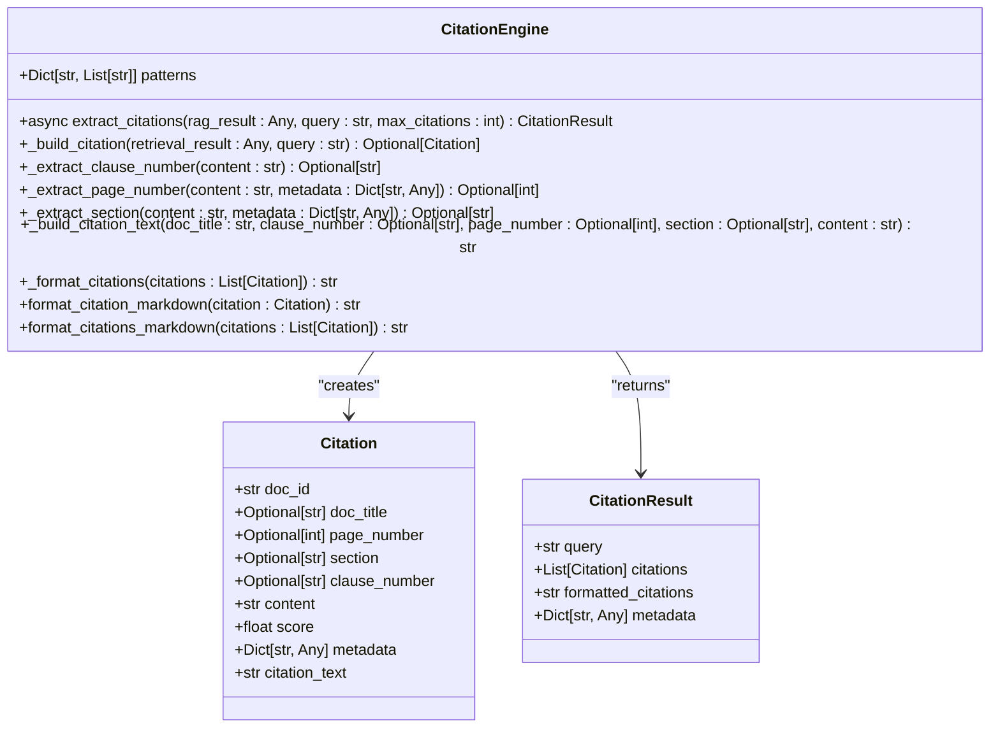
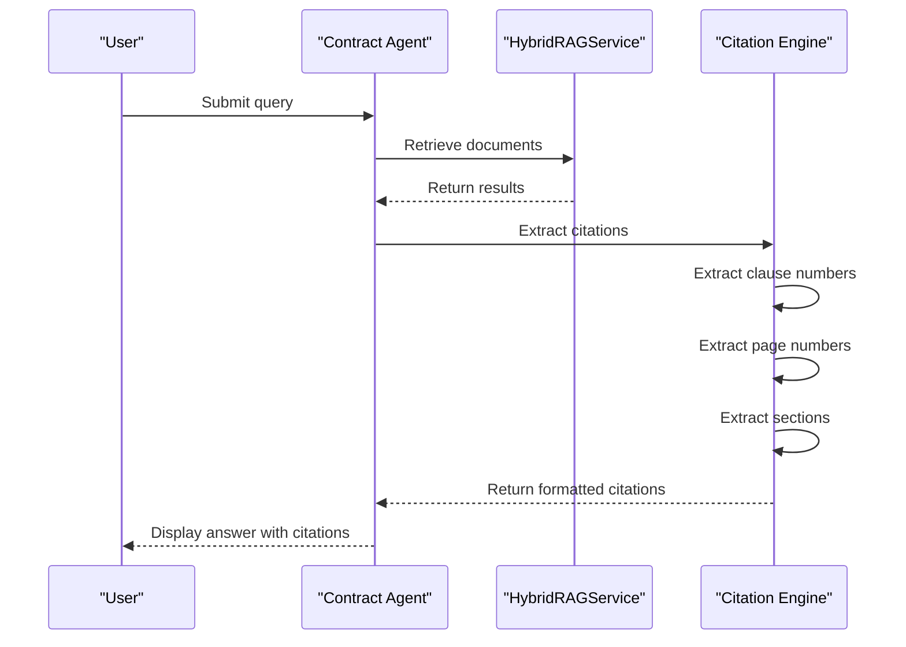
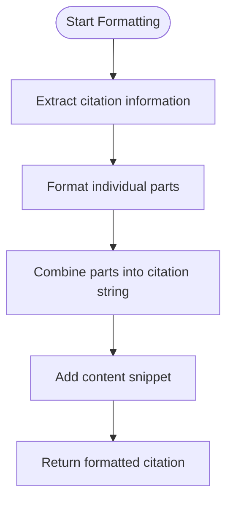
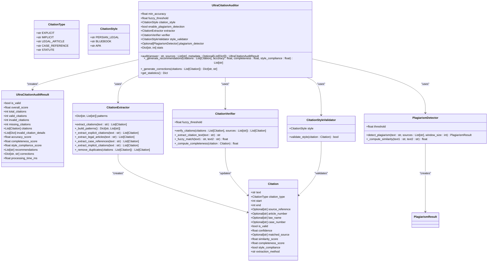
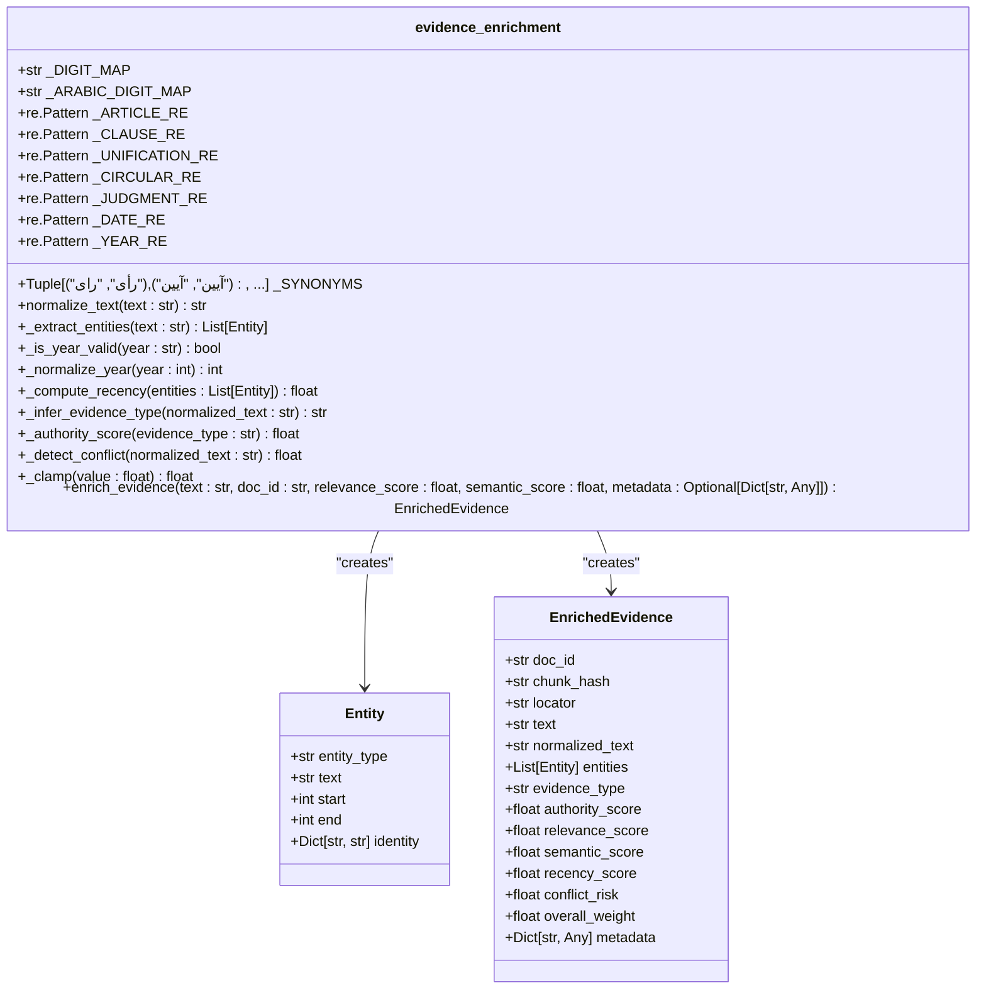
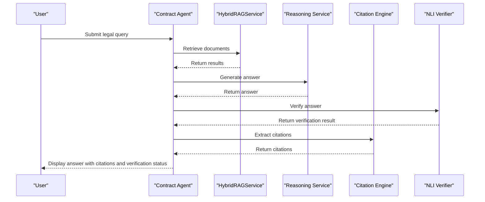
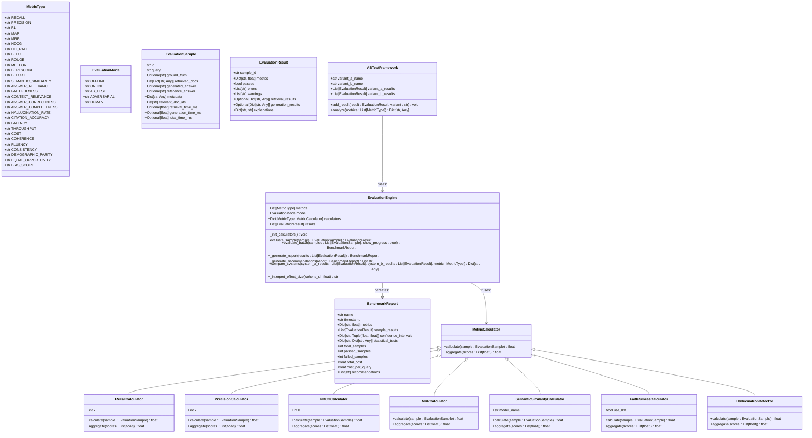

# Citation and Provenance Engine

<cite>
**Referenced Files in This Document**   
- [citation_engine.py](file://mahoun/rag/citation_engine.py)
- [ultra_citation_auditor.py](file://mahoun/guardrails/ultra_citation_auditor.py)
- [evidence_enrichment.py](file://mahoun/rag/evidence_enrichment.py)
- [ultra_evaluation_system.py](file://mahoun/rag/ultra_evaluation_system.py)
- [contract_agent.py](file://mahoun/agents/contract_agent.py)
- [hybrid_rag_service.py](file://mahoun/rag/hybrid_rag_service.py)
</cite>

## Table of Contents
1. [Introduction](#introduction)
2. [Citation Engine Implementation](#citation-engine-implementation)
3. [Citation Extraction and Relevance Scoring](#citation-extraction-and-relevance-scoring)
4. [Citation Formatting and Legal Standards](#citation-formatting-and-legal-standards)
5. [Citation Integrity Verification](#citation-integrity-verification)
6. [Evidence Enrichment Integration](#evidence-enrichment-integration)
7. [Citation Generation in Legal Q&A](#citation-generation-in-legal-qa)
8. [Citation Accuracy and Completeness](#citation-accuracy-and-completeness)
9. [Configuration and Formatting Options](#configuration-and-formatting-options)
10. [Conclusion](#conclusion)

## Introduction
The Citation and Provenance Engine is a comprehensive system designed to provide verifiable source attribution for all generated responses within the MAHOUN platform. This engine ensures that every answer is backed by precise document excerpts, properly formatted citations, and rigorous validation against legal standards. The system integrates multiple components to extract, verify, and enrich citations, creating a robust framework for legal and contractual analysis. By leveraging advanced retrieval techniques, citation auditing, and evidence enrichment, the engine delivers accurate, reliable, and legally compliant responses. This documentation details the implementation of the citation_engine.py, its integration with guardrails/ultra_citation_auditor.py for integrity verification, and examples from contract_agent.py demonstrating citation generation in legal Q&A scenarios.

**Section sources**
- [citation_engine.py](file://mahoun/rag/citation_engine.py#L1-L335)

## Citation Engine Implementation
The Citation Engine is implemented in citation_engine.py and serves as the core component for extracting and formatting citations from retrieval results. The engine processes results from the HybridRAGService, extracting precise citation information such as document title, page number, section, and clause number. It uses regular expression patterns to identify citation details within the content and metadata of retrieved documents. The engine constructs Citation objects containing the extracted information and formats them according to specified standards. The implementation includes methods for building individual citations, extracting citation details from content, and formatting citations in both plain text and Markdown formats. The engine is designed to handle multiple citation formats and provides flexibility in citation presentation.

**Diagram sources**
- [citation_engine.py](file://mahoun/rag/citation_engine.py#L26-L37)
- [citation_engine.py](file://mahoun/rag/citation_engine.py#L40-L45)
- [citation_engine.py](file://mahoun/rag/citation_engine.py#L48-L335)

**Section sources**
- [citation_engine.py](file://mahoun/rag/citation_engine.py#L1-L335)

## Citation Extraction and Relevance Scoring
The citation extraction process begins with the retrieval of relevant documents using the HybridRAGService, which combines graph and text-based retrieval methods. The Citation Engine then processes these results to extract citation details using predefined patterns for clauses, pages, and sections. The relevance scoring is derived from the retrieval results, with the engine preserving the original relevance scores from the HybridRAGService. The extraction process involves analyzing both the content and metadata of retrieved documents to identify citation information. For each retrieval result, the engine constructs a Citation object containing the document ID, title, page number, section, clause number, content, score, metadata, and formatted citation text. The engine supports multiple citation formats and can handle both explicit and implicit citations within the text.

**Diagram sources**
- [citation_engine.py](file://mahoun/rag/citation_engine.py#L92-L127)
- [citation_engine.py](file://mahoun/rag/citation_engine.py#L129-L177)
- [hybrid_rag_service.py](file://mahoun/rag/hybrid_rag_service.py#L134-L217)

**Section sources**
- [citation_engine.py](file://mahoun/rag/citation_engine.py#L66-L251)
- [hybrid_rag_service.py](file://mahoun/rag/hybrid_rag_service.py#L134-L217)

## Citation Formatting and Legal Standards
The Citation Engine provides comprehensive formatting capabilities to ensure citations meet legal standards. The engine supports multiple formatting styles, including plain text and Markdown, allowing for flexible presentation in different contexts. The formatted citations include the document title, clause number, page number, section, and a content snippet, presented in a standardized format. The engine uses a hierarchical approach to citation formatting, prioritizing the most relevant information and ensuring consistency across all citations. The formatting process involves constructing a citation string that combines the extracted information in a readable and legally compliant manner. The engine also supports customization of citation formatting through configuration options, allowing for adaptation to different document types and legal requirements.

**Diagram sources**
- [citation_engine.py](file://mahoun/rag/citation_engine.py#L221-L251)
- [citation_engine.py](file://mahoun/rag/citation_engine.py#L253-L267)
- [citation_engine.py](file://mahoun/rag/citation_engine.py#L269-L309)

**Section sources**
- [citation_engine.py](file://mahoun/rag/citation_engine.py#L221-L309)

## Citation Integrity Verification
The integrity of citations is verified using the ultra_citation_auditor.py component, which performs comprehensive citation auditing. The auditor extracts citations from the generated answer and verifies them against the provided sources using fuzzy matching and pattern recognition. The verification process includes checking the accuracy, completeness, and style compliance of citations. The auditor assigns a validity score to each citation based on its similarity to the source material and adherence to citation standards. The system also detects potential plagiarism by comparing the generated answer to the source documents. The verification results include recommendations for improving citation accuracy and completeness, as well as automated corrections for invalid citations. This multi-layered verification process ensures that all citations are accurate, complete, and compliant with legal standards.

**Diagram sources**
- [ultra_citation_auditor.py](file://mahoun/guardrails/ultra_citation_auditor.py#L32-L65)
- [ultra_citation_auditor.py](file://mahoun/guardrails/ultra_citation_auditor.py#L48-L65)
- [ultra_citation_auditor.py](file://mahoun/guardrails/ultra_citation_auditor.py#L68-L84)
- [ultra_citation_auditor.py](file://mahoun/guardrails/ultra_citation_auditor.py#L100-L213)
- [ultra_citation_auditor.py](file://mahoun/guardrails/ultra_citation_auditor.py#L220-L252)
- [ultra_citation_auditor.py](file://mahoun/guardrails/ultra_citation_auditor.py#L283-L315)
- [ultra_citation_auditor.py](file://mahoun/guardrails/ultra_citation_auditor.py#L330-L344)
- [ultra_citation_auditor.py](file://mahoun/guardrails/ultra_citation_auditor.py#L351-L474)

**Section sources**
- [ultra_citation_auditor.py](file://mahoun/guardrails/ultra_citation_auditor.py#L1-L569)

## Evidence Enrichment Integration
The evidence_enrichment.py component enhances citations by adding contextual metadata and computing various scores to assess the quality and relevance of evidence. The enrichment process involves normalizing text, extracting entities such as articles, clauses, and judgments, and inferring the evidence type based on content analysis. The system computes authority scores based on the evidence type, with higher scores assigned to more authoritative sources such as laws and unification rulings. Recency scores are calculated based on the publication year of the evidence, with more recent documents receiving higher scores. The system also detects potential conflicts, such as waiver clauses, and assigns a conflict risk score. The overall weight of evidence is computed as a weighted combination of relevance, authority, and recency scores, providing a comprehensive assessment of evidence quality.

**Diagram sources**
- [evidence_enrichment.py](file://mahoun/rag/evidence_enrichment.py#L41-L47)
- [evidence_enrichment.py](file://mahoun/rag/evidence_enrichment.py#L50-L65)
- [evidence_enrichment.py](file://mahoun/rag/evidence_enrichment.py#L68-L249)

**Section sources**
- [evidence_enrichment.py](file://mahoun/rag/evidence_enrichment.py#L1-L250)

## Citation Generation in Legal Q&A
The contract_agent.py demonstrates the application of the Citation and Provenance Engine in legal Q&A scenarios. The UltraContractAgent processes user queries by retrieving relevant documents, generating answers with chain-of-thought reasoning, and including citations in the response. The agent uses the HybridRAGService for document retrieval and the CitationEngine for citation extraction and formatting. The generated responses include the answer, confidence score, verification status, reasoning chain, and citations. The agent supports different reasoning modes, including simple answers and chain-of-thought reasoning, automatically selecting the appropriate mode based on the complexity of the query. The system also performs NLI verification to ensure the answer is supported by the retrieved evidence. This integration enables the agent to provide accurate, well-supported answers to complex legal questions.

**Diagram sources**
- [contract_agent.py](file://mahoun/agents/contract_agent.py#L262-L497)
- [contract_agent.py](file://mahoun/agents/contract_agent.py#L378-L389)
- [contract_agent.py](file://mahoun/agents/contract_agent.py#L396-L411)
- [contract_agent.py](file://mahoun/agents/contract_agent.py#L413-L424)
- [contract_agent.py](file://mahoun/agents/contract_agent.py#L426-L427)

**Section sources**
- [contract_agent.py](file://mahoun/agents/contract_agent.py#L1-L1599)

## Citation Accuracy and Completeness
The ultra_evaluation_system.py provides a comprehensive framework for evaluating citation accuracy and completeness. The system includes metrics for assessing retrieval quality, generation quality, and end-to-end performance. The evaluation engine computes scores for recall, precision, F1, MAP, MRR, and NDCG to assess retrieval effectiveness. For generation quality, the system uses metrics such as BLEU, ROUGE, METEOR, BERTSCORE, and BLEURT. The framework also includes semantic metrics like semantic similarity, answer relevance, faithfulness, and context relevance. The citation accuracy metric specifically evaluates the correctness and completeness of citations, identifying hallucinations and unsupported claims. The system performs statistical analysis of evaluation results, providing confidence intervals and significance testing. This comprehensive evaluation framework enables continuous improvement of the citation system through data-driven insights.

**Diagram sources**
- [ultra_evaluation_system.py](file://mahoun/rag/ultra_evaluation_system.py#L39-L83)
- [ultra_evaluation_system.py](file://mahoun/rag/ultra_evaluation_system.py#L85-L92)
- [ultra_evaluation_system.py](file://mahoun/rag/ultra_evaluation_system.py#L98-L115)
- [ultra_evaluation_system.py](file://mahoun/rag/ultra_evaluation_system.py#L117-L131)
- [ultra_evaluation_system.py](file://mahoun/rag/ultra_evaluation_system.py#L133-L159)
- [ultra_evaluation_system.py](file://mahoun/rag/ultra_evaluation_system.py#L165-L362)
- [ultra_evaluation_system.py](file://mahoun/rag/ultra_evaluation_system.py#L368-L586)
- [ultra_evaluation_system.py](file://mahoun/rag/ultra_evaluation_system.py#L604-L661)

**Section sources**
- [ultra_evaluation_system.py](file://mahoun/rag/ultra_evaluation_system.py#L1-L721)

## Configuration and Formatting Options
The Citation and Provenance Engine provides extensive configuration options for citation verbosity and formatting styles. The system supports different document types through configurable citation styles, including Persian legal, Bluebook, and APA formats. The verbosity of citations can be adjusted through configuration parameters, allowing for concise or detailed citation presentation. The engine supports multiple output formats, including plain text and Markdown, with customizable formatting options for each format. The configuration also includes settings for citation extraction patterns, relevance score thresholds, and citation validation rules. These configuration options enable the system to adapt to different use cases and user preferences, ensuring that citations are presented in the most appropriate format for the context.

**Section sources**
- [citation_engine.py](file://mahoun/rag/citation_engine.py#L66-L90)
- [ultra_citation_auditor.py](file://mahoun/guardrails/ultra_citation_auditor.py#L333-L344)

## Conclusion
The Citation and Provenance Engine represents a comprehensive solution for verifiable source attribution in the MAHOUN platform. By integrating advanced retrieval, citation extraction, integrity verification, and evidence enrichment components, the system ensures that all generated responses are backed by accurate, complete, and legally compliant citations. The engine's modular architecture allows for flexible configuration and adaptation to different document types and legal standards. The integration with the contract_agent.py demonstrates the system's effectiveness in legal Q&A scenarios, providing users with well-supported answers to complex legal questions. The comprehensive evaluation framework enables continuous improvement of the citation system through data-driven insights. Overall, the Citation and Provenance Engine establishes a robust foundation for trustworthy and reliable information retrieval and generation in legal and contractual contexts.