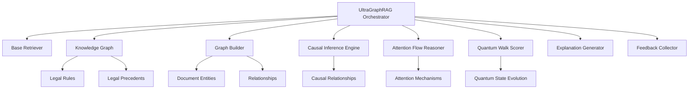
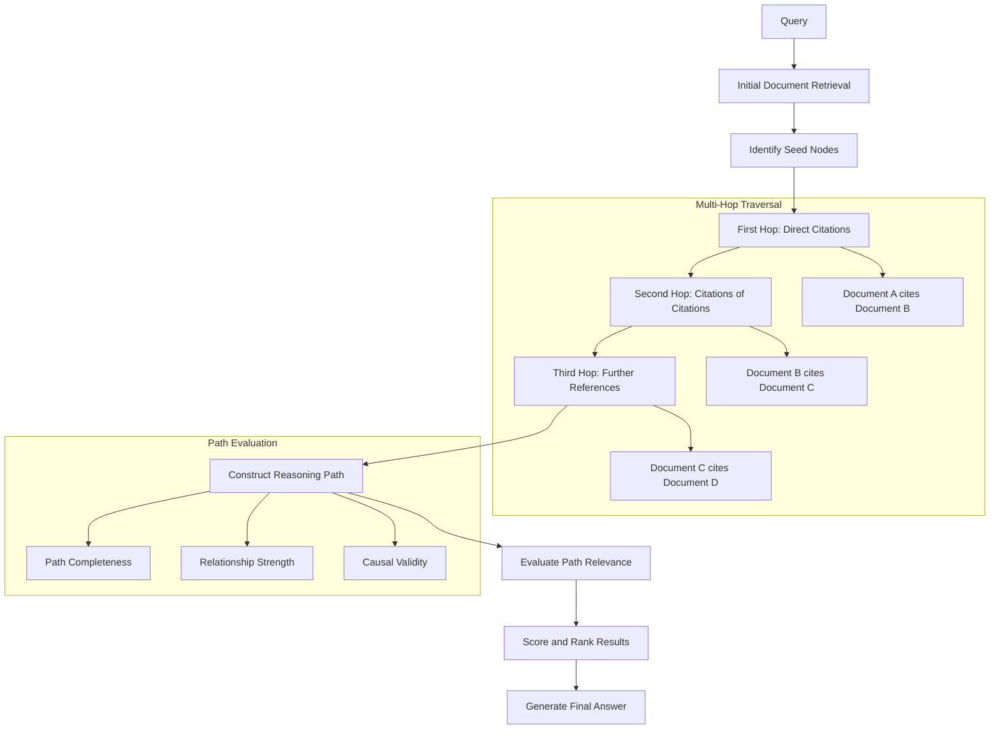
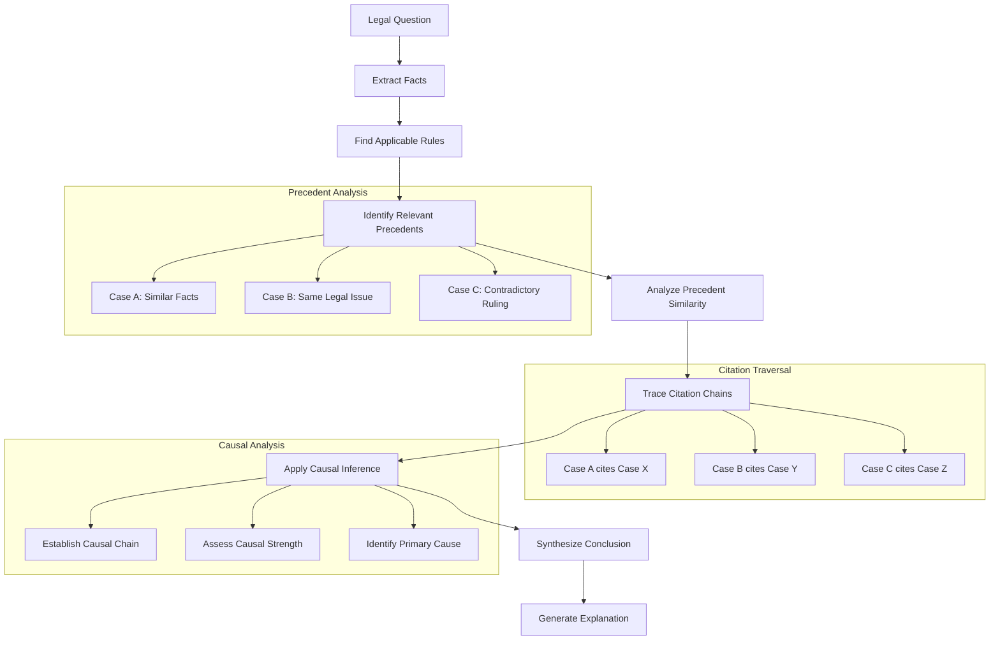
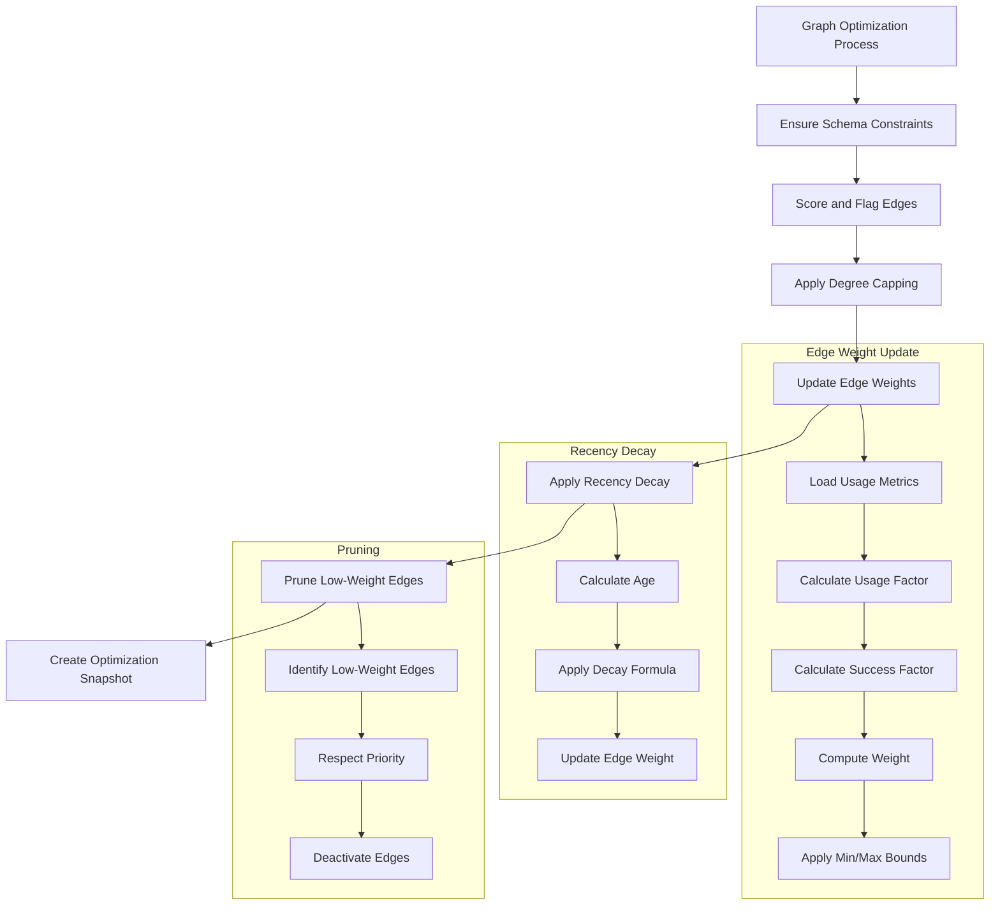
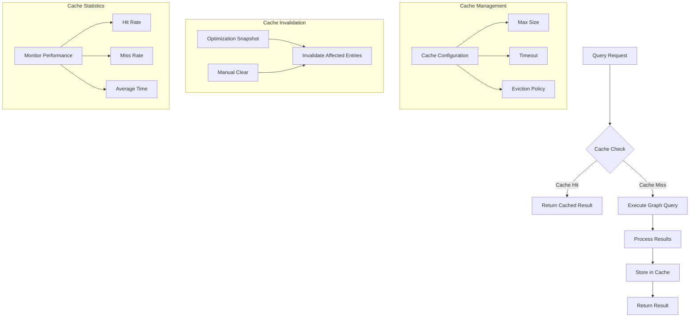
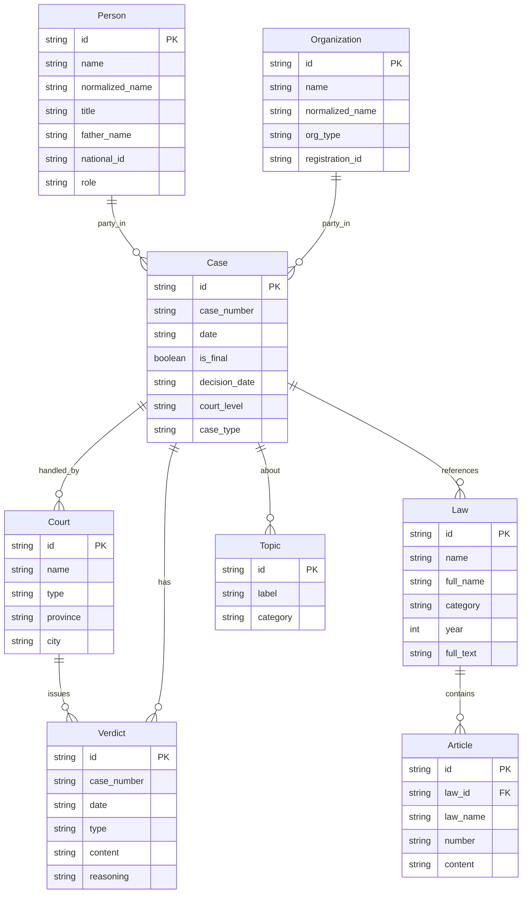
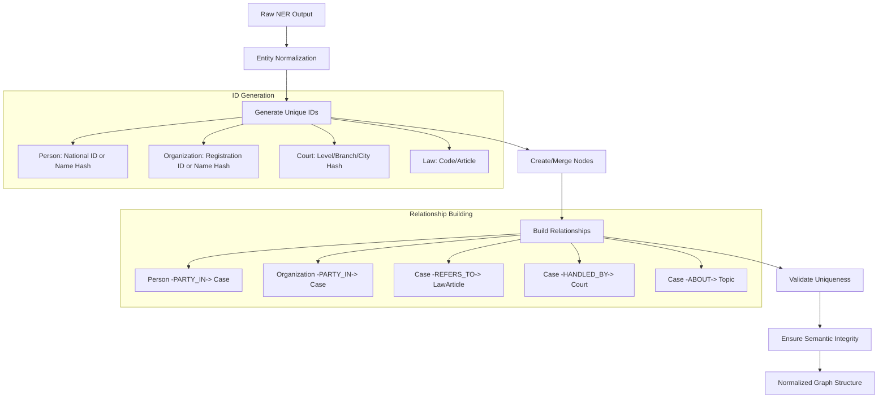
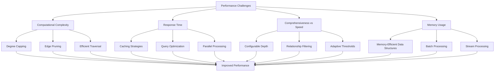
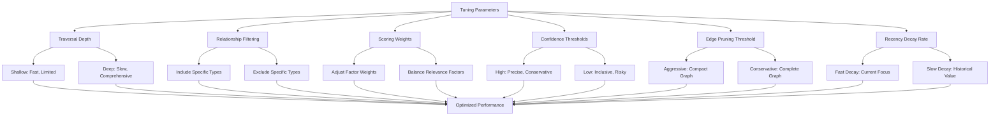

# Graph-Enhanced RAG

<cite>
**Referenced Files in This Document**   
- [ultra_graph_rag.py](file://mahoun/rag/ultra_graph_rag.py)
- [test_graph_based_reasoning.py](file://tests/test_graph_based_reasoning.py)
- [graph_optimizer.py](file://mahoun/graph/optimizer/graph_optimizer.py)
- [schema.py](file://mahoun/graph/neo4j/schema.py)
- [entity_linker.py](file://mahoun/pipelines/graph/entity_linker.py)
- [knowledge_graph.py](file://mahoun/reasoning/knowledge_graph.py)
- [reasoning_engine.py](file://mahoun/reasoning/reasoning_engine.py)
- [ultra_graph_builder.py](file://mahoun/graph/ultra_graph_builder.py)
- [graph_linker.py](file://mahoun/rag/graph_linker.py)
- [rag_integration.py](file://mahoun/graph/services/rag_integration.py)
</cite>

## Table of Contents
1. [Introduction](#introduction)
2. [Core Architecture](#core-architecture)
3. [Graph-Enhanced Retrieval Implementation](#graph-enhanced-retrieval-implementation)
4. [Multi-Hop Reasoning Across Document Citations](#multi-hop-reasoning-across-document-citations)
5. [Legal Precedent Relationship Traversal](#legal-precedent-relationship-traversal)
6. [Graph Query Optimization Techniques](#graph-query-optimization-techniques)
7. [Caching Strategies for Frequently Accessed Subgraphs](#caching-strategies-for-frequently-accessed-subgraphs)
8. [Integration with Neo4j Schema](#integration-with-neo4j-schema)
9. [Entity Linking for Retrieval Relevance](#entity-linking-for-retrieval-relevance)
10. [Performance Challenges and Solutions](#performance-challenges-and-solutions)
11. [Tuning Graph Traversal Parameters](#tuning-graph-traversal-parameters)
12. [Conclusion](#conclusion)

## Introduction

Graph-Enhanced Retrieval-Augmented Generation (Graph-Enhanced RAG) represents a significant advancement in information retrieval systems by integrating knowledge graph traversal with traditional retrieval methods. This approach enables sophisticated multi-hop reasoning across document citation graphs and legal precedent relationships, significantly improving answer precision through contextual graph analysis. The system leverages advanced graph query optimization techniques and caching strategies to ensure efficient performance while maintaining high relevance in retrieval results. By integrating with Neo4j's graph database schema and employing entity linking mechanisms, the system enhances retrieval relevance and provides explainable AI capabilities. This document details the implementation of the ultra_graph_rag.py module, which orchestrates these components to deliver a robust, self-improving RAG system capable of handling complex legal reasoning tasks.

**Section sources**
- [ultra_graph_rag.py](file://mahoun/rag/ultra_graph_rag.py#L1-L644)

## Core Architecture

The Graph-Enhanced RAG system follows a modular architecture that integrates multiple components to enable sophisticated reasoning capabilities. At its core, the system combines traditional retrieval methods with advanced graph-based reasoning through a hybrid approach. The architecture consists of several key components: the UltraGraphRAG orchestrator, which coordinates retrieval and reasoning processes; the Knowledge Graph, which stores legal rules and precedents; the Graph Builder, responsible for constructing and maintaining the knowledge graph; and various reasoning engines that perform specialized analysis.

The system's design emphasizes modularity and extensibility, allowing different reasoning strategies to be employed based on the query context. The architecture supports multiple reasoning approaches, including shortest path analysis, random walks, attention flow mechanisms, causal inference, and quantum-inspired random walks. Each component operates within a well-defined interface, enabling seamless integration and replacement of individual modules without affecting the overall system functionality.

**Diagram sources**
- [ultra_graph_rag.py](file://mahoun/rag/ultra_graph_rag.py#L482-L644)
- [knowledge_graph.py](file://mahoun/reasoning/knowledge_graph.py#L59-L499)
- [ultra_graph_builder.py](file://mahoun/graph/ultra_graph_builder.py#L316-L780)

**Section sources**
- [ultra_graph_rag.py](file://mahoun/rag/ultra_graph_rag.py#L482-L644)
- [knowledge_graph.py](file://mahoun/reasoning/knowledge_graph.py#L59-L499)
- [ultra_graph_builder.py](file://mahoun/graph/ultra_graph_builder.py#L316-L780)

## Graph-Enhanced Retrieval Implementation

The ultra_graph_rag.py implementation integrates knowledge graph traversal with traditional retrieval methods through a sophisticated hybrid approach. The UltraGraphRAG class serves as the central orchestrator, coordinating between the base retriever and various graph-based reasoning components. When a query is received, the system first performs traditional retrieval to identify relevant documents, then enhances these results through graph-based reasoning.

The implementation supports multiple reasoning strategies through the ReasoningStrategy enum, including shortest path analysis, random walks, attention flow mechanisms, causal inference, and quantum-inspired random walks. Each strategy is implemented as a separate component that can be selectively enabled based on system configuration and query requirements. The QuantumWalkScorer class implements a quantum-inspired random walk algorithm that explores multiple paths simultaneously using quantum superposition principles, while the CausalInferenceEngine identifies causal relationships rather than mere correlations.

The system's architecture includes a self-improving feedback loop through the FeedbackCollector and AdaptiveWeightLearner classes, which collect user feedback and adjust fusion weights accordingly. This enables the system to continuously improve its performance over time. The ExplanationGenerator class provides human-readable explanations for results, enhancing transparency and trust in the system's outputs.

```mermaid
classDiagram
class UltraGraphRAG {
+graph : Any
+base_retriever : Any
+quantum_scorer : QuantumWalkScorer
+causal_engine : CausalInferenceEngine
+attention_reasoner : AttentionFlowReasoner
+feedback_collector : FeedbackCollector
+weight_learner : AdaptiveWeightLearner
+explanation_generator : ExplanationGenerator
+search(query : str, top_k : int, explain : bool) Dict[str, Any]
+provide_feedback(query : str, results : List[Any], feedback : Dict[str, Any])
}
class QuantumWalkScorer {
+alpha : float
+max_iterations : int
+convergence_threshold : float
+compute_scores(adjacency_matrix : np.ndarray, seed_nodes : List[int], node_features : Optional[np.ndarray]) np.ndarray
+_build_quantum_transition(adjacency_matrix : np.ndarray, node_features : Optional[np.ndarray]) np.ndarray
}
class CausalInferenceEngine {
+confidence_threshold : float
+infer_causal_paths(graph : Any, source : str, target : str, max_depth : int) List[GraphPath]
+_find_all_paths(graph : Any, source : str, target : str, max_depth : int) List[Dict]
+_satisfies_backdoor_criterion(graph : Any, path : Dict) bool
+_compute_causal_effect(graph : Any, path : Dict) float
+_explain_causality(path : Dict) str
}
class AttentionFlowReasoner {
+num_heads : int
+hidden_dim : int
+compute_attention_paths(graph : Any, query_embedding : np.ndarray, seed_nodes : List[str], max_hops : int) List[GraphPath]
+_attention_hop(graph : Any, query_embedding : np.ndarray, seed_nodes : List[str], num_hops : int) List[GraphPath]
}
class FeedbackCollector {
+feedback_history : List[Dict]
+collect_feedback(query : str, results : List[Any], user_feedback : Dict[str, Any])
+_trigger_learning()
}
class AdaptiveWeightLearner {
+weights : Dict[str, float]
+learning_rate : float
+feedback_count : int
+update_weights(method_scores : Dict[str, float], user_rating : float)
+get_weights() Dict[str, float]
}
class ExplanationGenerator {
+templates : Dict[str, str]
+generate_explanation(result : Any, query : str, reasoning_paths : Optional[List[GraphPath]]) Dict[str, Any]
+_explain_score(result : Any) Dict[str, float]
+_compute_feature_importance(result : Any, query : str) Dict[str, float]
}
class GraphPath {
+nodes : List[str]
+edges : List[str]
+scores : List[float]
+total_score : float
+reasoning_type : ReasoningStrategy
+explanation : str
+to_natural_language() str
}
class ReasoningStrategy {
+SHORTEST_PATH
+RANDOM_WALK
+ATTENTION_FLOW
+CAUSAL_INFERENCE
+QUANTUM_WALK
}
UltraGraphRAG --> QuantumWalkScorer : "uses"
UltraGraphRAG --> CausalInferenceEngine : "uses"
UltraGraphRAG --> AttentionFlowReasoner : "uses"
UltraGraphRAG --> FeedbackCollector : "uses"
UltraGraphRAG --> AdaptiveWeightLearner : "uses"
UltraGraphRAG --> ExplanationGenerator : "uses"
UltraGraphRAG --> GraphPath : "creates"
CausalInferenceEngine --> GraphPath : "creates"
AttentionFlowReasoner --> GraphPath : "creates"
```

**Diagram sources**
- [ultra_graph_rag.py](file://mahoun/rag/ultra_graph_rag.py#L13-L644)

**Section sources**
- [ultra_graph_rag.py](file://mahoun/rag/ultra_graph_rag.py#L13-L644)

## Multi-Hop Reasoning Across Document Citations

The Graph-Enhanced RAG system excels at performing multi-hop reasoning across document citation graphs, enabling it to trace complex relationships between legal documents and precedents. This capability is demonstrated in the test_graph_based_reasoning.py file, which contains comprehensive tests verifying the system's ability to traverse citation chains and infer relationships through multiple hops.

The system implements multi-hop reasoning through several mechanisms. The GraphBuilder class constructs citation graphs by linking documents through their references, creating a network of interconnected legal texts. When a query is processed, the system can traverse these citation chains to discover relevant documents that may not be directly related to the query but are connected through intermediate citations. This approach allows the system to uncover deep relationships and contextual information that would be missed by traditional retrieval methods.

The test cases in test_graph_based_reasoning.py validate this functionality through scenarios such as multi-step reasoning with graph traversal and contract breach reasoning. These tests verify that the system can correctly identify paths through the citation graph, maintain reasoning chains across multiple hops, and produce accurate conclusions based on the traversed relationships. The system's ability to handle complex scenarios, including contradictory rules and causal relationships, demonstrates its robustness in real-world legal reasoning tasks.

**Diagram sources**
- [test_graph_based_reasoning.py](file://tests/test_graph_based_reasoning.py#L1-L603)

**Section sources**
- [test_graph_based_reasoning.py](file://tests/test_graph_based_reasoning.py#L1-L603)

## Legal Precedent Relationship Traversal

The system's ability to traverse legal precedent relationships represents a critical advancement in legal reasoning capabilities. By modeling precedents as nodes in a knowledge graph with directed edges representing citation relationships, the system can perform sophisticated analysis of legal arguments and judicial decisions. The LegalKnowledgeGraph class in knowledge_graph.py provides the foundation for storing and querying legal precedents, while the DeepLegalReasoningEngine orchestrates the reasoning process.

Legal precedent traversal occurs through multiple mechanisms. The system can identify similar precedents based on factual similarity using Jaccard similarity calculations on case facts. It can also trace citation chains between precedents to understand the evolution of legal interpretations over time. The causal inference engine identifies causal relationships between legal events and outcomes, allowing the system to reason about the likely consequences of specific actions based on historical precedents.

The test cases in test_graph_based_reasoning.py demonstrate the system's capability to handle complex legal scenarios involving multiple precedents and contradictory rules. For example, the test_deep_reasoning_combines_graph_and_causal_signals test verifies that the system can integrate knowledge from multiple precedents while considering causal relationships. The test_contradictory_rule_evidence_is_preserved test confirms that the system can handle conflicting legal authorities by presenting both sides of a legal argument.

**Diagram sources**
- [knowledge_graph.py](file://mahoun/reasoning/knowledge_graph.py#L59-L499)
- [reasoning_engine.py](file://mahoun/reasoning/reasoning_engine.py#L27-L391)
- [test_graph_based_reasoning.py](file://tests/test_graph_based_reasoning.py#L1-L603)

**Section sources**
- [knowledge_graph.py](file://mahoun/reasoning/knowledge_graph.py#L59-L499)
- [reasoning_engine.py](file://mahoun/reasoning/reasoning_engine.py#L27-L391)
- [test_graph_based_reasoning.py](file://tests/test_graph_based_reasoning.py#L1-L603)

## Graph Query Optimization Techniques

The Graph-Enhanced RAG system employs sophisticated optimization techniques to ensure efficient graph queries and traversal operations. The GraphOptimizer class in graph_optimizer.py implements a comprehensive suite of optimization strategies designed to improve query performance while maintaining result quality. These optimizations are particularly important given the complexity of legal knowledge graphs and the need for rapid response times in real-world applications.

Key optimization techniques include edge weighting, degree capping, and feedback-driven optimization. The edge weighting mechanism assigns weights to relationships based on confidence values and usage metrics, allowing the system to prioritize more relevant connections during traversal. Degree capping prevents nodes with excessive connections from dominating query results, ensuring balanced exploration of the graph. The feedback-driven optimization updates edge weights based on user feedback, usage patterns, and recency, creating a self-improving system that adapts to user needs over time.

The optimizer also implements recency decay, which reduces the weight of older relationships over time unless they continue to receive usage. This ensures that the graph remains relevant and reflects current legal interpretations. The pruning mechanism deactivates low-weight edges below a configurable threshold, reducing graph complexity without losing important connections. These optimizations work together to create a responsive and efficient graph traversal system that can handle complex queries while maintaining high performance.

**Diagram sources**
- [graph_optimizer.py](file://mahoun/graph/optimizer/graph_optimizer.py#L1-L381)

**Section sources**
- [graph_optimizer.py](file://mahoun/graph/optimizer/graph_optimizer.py#L1-L381)

## Caching Strategies for Frequently Accessed Subgraphs

The system implements comprehensive caching strategies to optimize performance for frequently accessed subgraphs and query patterns. The GraphEnrichmentService in rag_integration.py includes a built-in caching mechanism that stores the results of expensive graph queries, significantly reducing response times for repeated requests. This caching strategy is particularly effective for legal research scenarios where users often explore related documents and precedents in a focused area.

The caching system operates at multiple levels. At the query level, entire graph data results are cached based on document IDs and query parameters. At the subgraph level, frequently traversed paths and relationship patterns are stored for rapid retrieval. The cache is configurable with parameters for timeout, maximum size, and eviction policies, allowing administrators to balance memory usage with performance requirements.

The system also implements intelligent cache invalidation through optimization snapshots. When the graph undergoes significant changes through the optimization process, a snapshot is created that invalidates affected cache entries. This ensures that cached results remain accurate while still providing performance benefits for stable query patterns. The cache statistics tracking provides visibility into cache effectiveness, including hit rates and average retrieval times.

**Diagram sources**
- [rag_integration.py](file://mahoun/graph/services/rag_integration.py#L1-L347)

**Section sources**
- [rag_integration.py](file://mahoun/graph/services/rag_integration.py#L1-L347)

## Integration with Neo4j Schema

The Graph-Enhanced RAG system integrates seamlessly with Neo4j's graph database schema through a comprehensive schema management system. The SchemaManager class in schema.py handles constraints, indexes, and schema migrations, ensuring data integrity and optimal query performance. This integration enables the system to leverage Neo4j's advanced graph algorithms and query capabilities while maintaining a consistent data model.

The schema design follows best practices for legal knowledge representation, with dedicated node types for laws, articles, courts, verdicts, cases, persons, and parties. Each node type has unique constraints to prevent duplication and ensure data consistency. The system creates multiple types of indexes, including B-tree indexes for exact matching, full-text indexes for text search, and vector indexes for embedding-based similarity search.

The integration also supports advanced Neo4j features such as full-text search and vector similarity search, which enhance the system's retrieval capabilities. The schema initialization process ensures that all required constraints and indexes are in place before the system becomes operational. The validation mechanism periodically checks the schema integrity, providing early detection of configuration issues.

**Diagram sources**
- [schema.py](file://mahoun/graph/neo4j/schema.py#L1-L441)

**Section sources**
- [schema.py](file://mahoun/graph/neo4j/schema.py#L1-L441)

## Entity Linking for Retrieval Relevance

The system enhances retrieval relevance through sophisticated entity linking mechanisms implemented in the EntityLinker class. This component converts raw named entity recognition (NER) output into normalized graph structures, creating or merging nodes and building directional edges while ensuring semantic integrity. The entity linking process is idempotent, allowing safe re-execution without creating duplicate entries.

The linker employs advanced normalization techniques to handle variations in entity names and identifiers. For persons, it uses national IDs when available, falling back to name hashing for deduplication. For organizations, it prioritizes registration IDs, with name hashing as a fallback. The system also normalizes court names by combining level, branch, and location information to create unique identifiers.

The entity linking process creates a rich network of relationships between entities, significantly enhancing retrieval relevance. For example, linking persons and organizations to cases allows the system to find documents based on party involvement rather than just content similarity. Linking cases to laws and articles enables discovery of relevant legal provisions even when they are not explicitly mentioned in the query.

**Diagram sources**
- [entity_linker.py](file://mahoun/pipelines/graph/entity_linker.py#L1-L800)

**Section sources**
- [entity_linker.py](file://mahoun/pipelines/graph/entity_linker.py#L1-L800)

## Performance Challenges and Solutions

The Graph-Enhanced RAG system addresses several performance challenges inherent in complex graph-based reasoning through a combination of architectural optimizations and algorithmic improvements. One primary challenge is the computational complexity of multi-hop reasoning across large knowledge graphs, which the system mitigates through degree capping, edge pruning, and efficient traversal algorithms.

Another challenge is maintaining responsiveness during real-time queries while performing sophisticated graph analysis. The system addresses this through caching strategies, query optimization, and parallel processing of reasoning tasks. The feedback-driven optimization continuously improves performance by prioritizing frequently accessed paths and relationships.

The system also handles the challenge of balancing comprehensiveness with response time through configurable traversal depth and relationship filtering. Users can adjust these parameters based on their specific needs, trading off between thoroughness and speed. The self-improving feedback loop further enhances performance by learning from user interactions and optimizing the most valuable query patterns.

**Section sources**
- [graph_optimizer.py](file://mahoun/graph/optimizer/graph_optimizer.py#L1-L381)
- [ultra_graph_builder.py](file://mahoun/graph/ultra_graph_builder.py#L316-L780)
- [rag_integration.py](file://mahoun/graph/services/rag_integration.py#L1-L347)

## Tuning Graph Traversal Parameters

The system provides extensive capabilities for tuning graph traversal parameters to balance comprehensiveness and response time. These parameters can be adjusted based on specific use cases, performance requirements, and user preferences. The key tunable parameters include traversal depth, relationship filtering, scoring weights, and confidence thresholds.

Traversal depth controls the maximum number of hops allowed during graph exploration. Shallower depths provide faster responses but may miss relevant information, while deeper traversals are more comprehensive but slower. Relationship filtering allows specific relationship types to be included or excluded from traversal, enabling focused exploration of particular aspects of the knowledge graph.

Scoring weights determine how different factors contribute to the final relevance score. These weights can be adjusted to emphasize certain aspects such as citation authority, entity centrality, or temporal recency. Confidence thresholds control which results are considered valid, with higher thresholds producing more precise but potentially incomplete answers.

The system also supports adaptive tuning through the self-improving feedback loop, which automatically adjusts parameters based on user feedback and usage patterns. This ensures that the system continuously optimizes its performance and relevance over time.

**Section sources**
- [ultra_graph_rag.py](file://mahoun/rag/ultra_graph_rag.py#L13-L644)
- [graph_optimizer.py](file://mahoun/graph/optimizer/graph_optimizer.py#L1-L381)

## Conclusion

The Graph-Enhanced RAG system represents a significant advancement in retrieval-augmented generation technology by integrating sophisticated knowledge graph traversal with traditional retrieval methods. Through its implementation in ultra_graph_rag.py, the system demonstrates the ability to perform multi-hop reasoning across document citation graphs and legal precedent relationships, significantly improving answer precision and contextual understanding.

The system's architecture combines multiple advanced components, including quantum-inspired scoring, causal inference, attention-based reasoning, and self-improving feedback loops, to deliver a comprehensive solution for complex information retrieval tasks. The integration with Neo4j's graph database schema and the implementation of entity linking mechanisms enhance retrieval relevance and provide explainable AI capabilities.

Performance optimization techniques, including graph query optimization and caching strategies, ensure that the system maintains responsiveness even when handling complex queries across large knowledge graphs. The ability to tune graph traversal parameters allows users to balance comprehensiveness with response time based on their specific requirements.

The system's capabilities are validated through comprehensive testing, demonstrating its effectiveness in real-world legal reasoning scenarios. By combining traditional retrieval methods with advanced graph-based reasoning, the Graph-Enhanced RAG system provides a powerful tool for navigating complex information landscapes and delivering precise, contextually relevant answers.